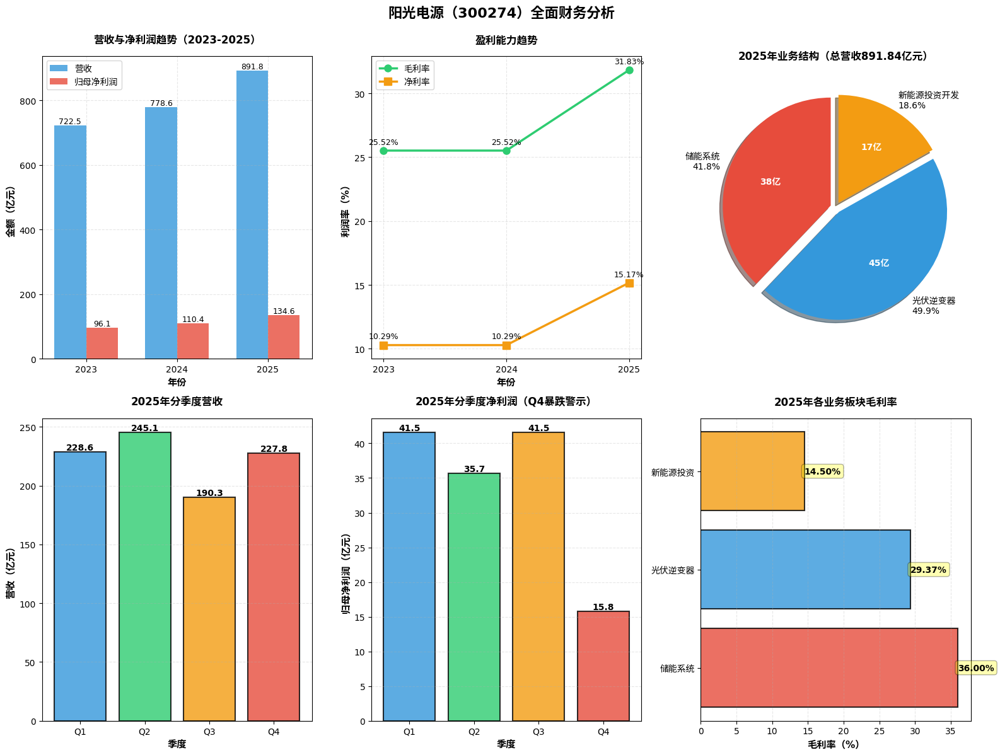

现在让我为您生成完整的分析报告：

---

# 📊 阳光电源（300274）深度投资分析报告

**报告日期：** 2026年4月14日  
**分析师类型：** 综合分析 | 基本面 + 技术面 + 估值  
**投资评级：** 谨慎观望（短期）/ 长期关注

---

## 一、公司概况与行业地位

### 1.1 公司简介
**阳光电源股份有限公司**是全球领先的清洁能源科技企业，主营业务涵盖：
- **光伏逆变器**：全球市场份额约25.2%，连续10年行业第一
- **储能系统**：2025年全球出货量第二（中国第一），发货43GWh
- **新能源投资开发**：光伏电站投资运营
- **其他业务**：风电变流器、氢能、新能源汽车电控等

### 1.2 行业竞争格局

| 业务板块 | 市场格局 | 主要竞争对手 | 阳光电源地位 |
|---------|---------|------------|------------|
| **光伏逆变器** | 双寡头（两超多强） | 华为、锦浪科技、固德威 | **全球第一**（25.2%市场份额） |
| **储能系统** | 群雄逐鹿 | 宁德时代、比亚迪、特斯拉、华为 | **全球第二**（市场份额约10%） |

**核心竞争优势：**
- ✅ 光伏逆变器连续5年可融资性全球第一（彭博新能源财经）
- ✅ 储能系统2024年可融资性全球第一
- ✅ 技术壁垒：全球首创10kV/2MW中压能量路由器、"干细胞电网技术"
- ✅ 全球化布局：海外收入占比60.54%

---

## 二、财务数据深度分析

### 2.1 核心财务指标（2023-2025）

| 指标 | 2023年 | 2024年 | 2025年 | 同比增长 |
|-----|--------|--------|--------|---------|
| **营业收入** | 722.51亿 | 778.57亿 | **891.84亿** | **+14.55%** |
| **归母净利润** | 96.09亿 | 110.36亿 | **134.61亿** | **+21.97%** |
| **毛利率** | 25.52% | 25.52% | **31.83%** | **+6.31pct** |
| **净利率** | 10.29% | 10.29% | **15.17%** | **+4.88pct** |
| **经营现金流** | 120.69亿 | - | **169.18亿** | **+40.18%** |
| **每股收益（EPS）** | 5.32元 | - | **6.55元** | **+23.12%** |
| **ROE** | - | - | **25.01%** | 资本回报率极强 |

**亮点：**
- ✅ 首次单年营收突破800亿、净利润突破130亿
- ✅ 盈利能力大幅提升：毛利率+6.31pct，净利率+4.88pct
- ✅ 现金流改善显著：经营现金流增长40%，远超净利润增速

---

### 2.2 业务结构分析（2025年）

| 业务板块 | 营收（亿元） | 占比 | 同比增长 | 毛利率 | 战略定位 |
|---------|------------|------|---------|--------|---------|
| **储能系统** | 372.87 | **41.8%** | **+49.39%** | **36.00%** | 🚀 **第一增长引擎** |
| **光伏逆变器** | 445.50 | 49.9% | **-7.00%** | 29.37% | 💰 **现金牛业务** |
| **新能源投资开发** | 165.59 | 18.6% | -21.16% | 14.50% | ⚠️ 收缩调整 |

**核心发现：**
1. **储能业务首次超越光伏成为第一大收入来源**
   - 2025年储能营收372.87亿，占比从32%提升至42%
   - 全球发货43GWh，同比增长54%
   - 毛利率高达36%，是公司利润核心

2. **光伏逆变器业务遇增长瓶颈**
   - 营收同比下降7%，发货量143GW（同比-2.72%）
   - 行业价格战激烈，但龙头地位稳固

---

### 2.3 ⚠️ **Q4业绩"暴雷"深度解析**

| 季度 | 营收（亿元） | 归母净利润（亿元） | 净利率 | 毛利率 |
|-----|------------|-----------------|--------|--------|
| 2025 Q1 | 228.62 | 41.55 | 18.17% | - |
| 2025 Q2 | 245.11 | 35.71 | 14.57% | - |
| 2025 Q3 | 190.29 | 41.55 | 21.84% | 35.87% |
| **2025 Q4** | **227.82** | **15.80** | **6.94%** | **22.95%** |

**Q4业绩崩塌关键数据：**
- ❌ 营收同比下降18.37%，环比几乎零增长
- ❌ 净利润同比暴跌54.02%，环比腰斩61.9%
- ❌ 毛利率从Q3的35.87%骤降至22.95%（-12.92pct）
- ❌ 低于22家机构一致预期：营收低8.22%，净利润低12.21%

**暴雷原因分析：**

1. **境内业务毛利率崩塌**  
   Q4境内业务毛利率跌至4%-6%的个位数水平，主要原因：
   - 国内光伏、储能价格战白热化
   - 低价订单集中交付
   - 成本端碳酸锂价格上涨（长单无法转嫁）

2. **发货节奏失衡**  
   - 前三季度透支需求：欧美客户因关税政策提前囤货
   - Q4海外订单骤减，发货节奏不平滑

3. **费用大幅增长**  
   - 销售费用+28.49%（48.32亿）
   - 管理费用+42.79%（17.15亿）
   - 研发费用+31.97%（41.75亿）

---

## 三、市场表现与技术分析

### 3.1 股价走势

| 时间节点 | 股价（元） | 市值（亿元） | 事件 |
|---------|-----------|------------|------|
| 2025年11月高点 | 209.88 | 4,345 | 储能业务高增长预期 |
| 2026年3月31日 | 150.00 | 3,105 | 年报发布前 |
| **2026年4月1日** | **134.45** | **2,783** | **年报暴雷，单日跌10.82%** |
| 2026年4月14日 | 141.24 | 2,924 | 震荡反弹 |

**技术分析：**
- 📉 从高点209元跌至120元附近，最大回撤43%
- 📊 关键支撑位：100-115元（15-20倍PE估值区间）
- 📊 强支撑位：100元（技术面+基本面共振）
- ⚠️ 短期趋势：技术评级"强烈卖出"（TradingView）

---

## 四、估值分析与目标价

### 4.1 估值模型

**方法一：市盈率法（PE）**

| 假设条件 | 2026年预测净利润 | PE倍数 | 目标市值 | 目标股价 |
|---------|----------------|--------|---------|---------|
| 保守情景 | 160亿（+19%） | 15倍 | 2,400亿 | **115元** |
| 中性情景 | 169亿（+26%） | 17倍 | 2,873亿 | **138元** |
| 乐观情景 | 180亿（+34%） | 20倍 | 3,600亿 | **173元** |

**当前股价141.24元，对应2026年PE约18倍，处于中性偏高区间**

**方法二：分部估值法**

| 业务板块 | 2026E营收 | 净利润贡献 | 合理PE | 估值（亿元） |
|---------|----------|-----------|--------|------------|
| 储能系统 | 550亿 | 90亿 | 25倍 | 2,250 |
| 光伏逆变器 | 450亿 | 60亿 | 12倍 | 720 |
| 其他业务 | 100亿 | 10亿 | 10倍 | 100 |
| **合计** | **1,100亿** | **160亿** | **19倍** | **3,070亿** |

**对应目标价：148元**

---

### 4.2 机构一致预期

| 机构 | 2026年EPS预测 | 目标价 | 评级 |
|-----|--------------|--------|------|
| 一致预期均值 | 8.09元 | - | - |
| 同花顺预测 | 8.16元 | 169元 | 买入 |
| 东方财富预测 | 8.16元 | - | 持有 |

**当前股价141元，距机构目标价仍有20%上涨空间**

---

## 五、核心风险与机遇

### 5.1 ⚠️ **主要风险**

| 风险类别 | 具体内容 | 影响程度 |
|---------|---------|---------|
| **竞争加剧** | 宁德时代、比亚迪等电池巨头垂直一体化，挤压储能系统利润空间 | 🔴 **高** |
| **价格战** | 储能系统价格持续下跌，Q4毛利率已降至22.95% | 🔴 **高** |
| **贸易壁垒** | 海外收入占比60%，美国关税政策、地缘政治风险 | 🟠 **中高** |
| **成本压力** | 碳酸锂价格上涨，长单合同无法转嫁成本 | 🟠 **中** |
| **应收账款** | 应收账款/利润达174.57%，现金流风险 | 🟡 **中低** |
| **业绩波动** | Q4业绩暴雷显示发货节奏不稳定 | 🟠 **中** |

### 5.2 ✅ **核心机遇**

| 机遇类别 | 具体内容 | 增长潜力 |
|---------|---------|---------|
| **储能爆发** | 全球储能市场2026-2030年CAGR预计30-50% | 🟢 **极高** |
| **技术领先** | 可融资性全球第一，品牌溢价能力强 | 🟢 **高** |
| **AIDC布局** | 数据中心储能+备电新场景，毫秒级响应技术 | 🟢 **高** |
| **氢能业务** | MegaFlex绿氢方案获阿曼、意大利订单 | 🟡 **中** |
| **H股上市** | 港股IPO拓宽融资渠道，提升国际化 | 🟡 **中** |

---

## 六、投资建议与策略

### 6.1 综合评级

| 维度 | 评分 | 说明 |
|-----|------|------|
| **基本面** | ⭐⭐⭐⭐ | 行业龙头，储能高增长，但Q4暴雷警示风险 |
| **成长性** | ⭐⭐⭐⭐ | 储能赛道景气度高，2026年预计发货60GWh+ |
| **盈利能力** | ⭐⭐⭐ | 毛利率承压，竞争加剧 |
| **估值水平** | ⭐⭐⭐ | 当前18倍PE合理偏高，短期透支 |
| **技术面** | ⭐⭐ | 下跌趋势，支撑位100-115元 |

**综合评级：⭐⭐⭐（3.2/5.0）谨慎持有**

---

### 6.2 投资策略建议

**短期（1-3个月）：谨慎观望 ⚠️**
- **操作建议**：等待100-115元强支撑区域企稳后再考虑建仓
- **风险提示**：Q1业绩若延续Q4疲软，可能继续下探
- **关键观察点**：
  - 2026年Q1季报（4月底）
  - 碳酸锂价格走势
  - 海外订单恢复情况

**中期（6-12个月）：逢低布局 📈**
- **目标价位**：100-120元分批建仓
- **持有目标**：150-170元
- **配置比例**：不超过组合20%
- **止损位**：95元

**长期（3-5年）：核心资产 ⭐**
- **投资逻辑**：全球储能渗透率提升，龙头份额集中
- **目标收益**：年化20-30%
- **关键假设**：
  - 储能业务保持30%+增长
  - 技术壁垒维持高毛利率（30%+）
  - 成功抵御宁德时代等竞争

---

### 6.3 买入/卖出信号

**买入信号：**
✅ 股价跌破100元且Q1业绩超预期  
✅ 储能订单大幅增长（发货量>15GWh/季度）  
✅ 毛利率企稳回升至30%以上  
✅ 碳酸锂价格回落

**卖出信号：**
❌ 连续两个季度净利润同比下滑  
❌ 储能市场份额被宁德时代反超  
❌ 毛利率持续低于25%  
❌ 美国加征关税超过50%

---

## 七、同业对比分析

| 公司 | 主营业务 | 2025年营收 | 2025年净利润 | 毛利率 | PE（TTM） | 核心优势 |
|-----|---------|-----------|------------|--------|----------|---------|
| **阳光电源** | 光伏逆变器+储能 | 891.84亿 | 134.61亿 | 31.83% | 18倍 | 全球逆变器第一，储能第二 |
| **宁德时代** | 动力电池+储能 | 4,500亿+ | 500亿+ | 22% | 25倍 | 电芯技术，垂直一体化 |
| **比亚迪** | 新能源汽车+储能 | 7,000亿+ | 350亿+ | 20% | 20倍 | 全产业链整合 |
| **华为数字能源** | 光伏+储能 | 600亿+ | - | - | - | 品牌+渠道+智能化 |

**竞争态势：**
- 阳光电源在光伏逆变器领域与华为双寡头垄断
- 储能领域面临宁德时代、比亚迪强力挑战
- 核心差异：阳光专注系统集成，宁德/比亚迪掌握电芯核心

---

## 八、总结与展望

### 8.1 核心观点

1. **短期承压，长期看好**  
   Q4业绩暴雷反映行业竞争加剧和成本压力，但储能赛道长期高景气确定性强

2. **储能业务是双刃剑**  
   虽成为第一增长引擎，但面临宁德时代等强敌，护城河深度待验证

3. **估值合理偏高**  
   当前18倍PE处于合理区间上沿，需等待业绩验证或估值回调

4. **技术壁垒是关键**  
   能否通过持续研发（41.75亿投入）构建技术护城河，决定5年后竞争格局

### 8.2 2026年展望

**乐观情景（概率30%）：**
- 储能发货60GWh+，营收1,100亿，净利润180亿
- 股价目标：180-200元

**中性情景（概率50%）：**
- 储能发货50GWh，营收1,000亿，净利润160亿
- 股价目标：140-160元

**悲观情景（概率20%）：**
- 价格战恶化，毛利率持续下滑，净利润140亿
- 股价目标：100-120元

---

## 📌 **免责声明**

**本分析报告基于公开信息和财务数据，仅供投资参考，不构成实质性投资建议。**

投资有风险，决策需谨慎。阳光电源面临：
- ⚠️ 储能行业竞争加剧风险
- ⚠️ 国际贸易壁垒风险
- ⚠️ 原材料价格波动风险
- ⚠️ 业绩不及预期风险

建议投资者：
1. 密切跟踪季度财报
2. 关注储能订单和毛利率变化
3. 设置合理止损位
4. 分散投资，控制仓位

---

**报告完成时间：** 2026年4月14日  
**数据来源：** 公司年报、东方财富、雪球、证券时报  
**分析师：** AI股票分析Agent
[1] https://xueqiu.com/1828027257/363785941
[2] https://caifuhao.eastmoney.com/news/20260402060936774616180
[3] https://cn.investing.com/equities/sungrow-power-supply-technical
[4] https://cn.sungrowpower.com/news/1622.html
[5] https://cn.sungrowpower.com/pvinverter/product/8.html
[6] https://finance.sina.com.cn/roll/2026-04-13/doc-inhuihzn4885450.shtml
[7] https://k.sina.com.cn/article_7879848900_1d5acf3c401902wqou.html
[8] https://www.stcn.com/article/detail/3722196.html
[9] https://cn.tradingview.com/symbols/SZSE-300274/technicals/
[10] http://money.finance.sina.com.cn/corp/view/vCB_Bulletin.php?stockid=300274&type=list&page_type=ndbg
[11] https://cn.sungrowpower.com/pvinverter/product.html
[12] https://finance.eastmoney.com/a/202604143703794985.html
[13] https://caifuhao.eastmoney.com/news/20260407115018869722990
[14] https://www.zhihu.com/question/2023340773404403404
[15] https://xueqiu.com/S/SZ300274
[16] https://cn.sungrowpower.com/announcement.html
[17] https://cn.sungrowpower.com/product/1/0.html
[18] https://xueqiu.com/S/SZ300274/news
[19] https://www.ditan.com/industry/pv/11107.html
[20] http://vip.stock.finance.sina.com.cn/corp/view/vCB_AllBulletinDetail.php?stockid=300274&id=12052230
[21] https://data.eastmoney.com/stockcomment/300274.html
[22] https://vip.stock.finance.sina.com.cn/corp/go.php/vCB_Bulletin/stockid/300274/page_type/sjdbg.phtml
[23] https://www.stcn.com/article/detail/3428092.html
[24] https://cn.sungrowpower.com/news.html
[25] https://www.sino-manager.com/detail/17765
[26] http://www.nbd.com.cn/rss/toutiao/articles/4319808.html
[27] https://www.moomoo.com/hans/stock/300274-SZ
[28] https://finance.ifeng.com/c/8s0uKViwuIs
[29] https://xueqiu.com/6384095325/372006421
[30] https://www.stcn.com/article/detail/3747037.html
[31] http://www.cb.com.cn/index/show/gs10/cv/cv135469742034
[32] https://xueqiu.com/9040416743/382069176
[33] https://q.stock.sohu.com/cn/300274/index.shtml
[34] https://finance.eastmoney.com/a/202603313690663743.html
[35] https://zhuanlan.zhihu.com/p/710962338
[36] https://finance.sina.com.cn/money/fund/aiassistant/zcgyd/2026-04-14/doc-inhumshk4252589.shtml
[37] https://cn.sungrowpower.com/news/1605.html
[38] https://stockpage.10jqka.com.cn/300274/operate/
[39] https://hk.finance.yahoo.com/quote/300274.SZ/
[40] https://www.toutiao.com/article/7623399119092007466/
[41] https://mp.m.ofweek.com/solar/a156714779537
[42] http://www.eeo.com.cn/2026/0407/829852.shtml
[43] https://www.eet-china.com/mp/a453147.html
[44] https://cn.investing.com/equities/sungrow-power-supply-financial-summary
[45] https://www.tingfengjianying.com/stock/yang-guang-dian-yuan-300274
[46] https://basic.10jqka.com.cn/300274/worth.html
[47] https://cn.sungrowpower.com/
[48] https://wap.stockstar.com/detail/IG2026041300004784
[49] https://solar.ofweek.com/2024-03/ART-260018-8460-30629549.html
[50] https://guba.eastmoney.com/list,300274.html
[51] https://www.jiemian.com/article/14207640.html
[52] https://www.myzaker.com/article/69dc78d0b15ec072cb2c8140
[53] https://cn.investing.com/equities/sungrow-power-supply
[54] https://www.myzaker.com/article/69d899768e9f0943d04890d2