# 东方盛虹（000301.SZ）价值分析报告草稿

- 生成时间：2026-05-13 08:10:29
- 自动化脚本：`.agents/skills/value-report/value_report_scaffold.py`
- 数据口径：数据库字段定义以 `app/models/models.py` 为准
- 公司信息：行业 化纤｜地区 江苏｜上市日期 20000529
- 管理层：董事长 缪汉根｜总经理 缪汉根｜员工 29526
- 主营业务：主营业务:纺织,贸易,电力,热能,房地产.
- 提示：本文件已自动填充定量部分，定性模块请结合最新公告与行业资料补充。

## 自动填充数据（可直接引用）
### 最新估值
- 交易日：20260511
- 收盘价：12.94 元
- PE(TTM)：69.84 倍
- PB：2.46 倍
- PS(TTM)：0.67 倍
- 股息率(TTM)：N/A
- 总市值：855.49 亿元

### 最新财务快照
- 报告期：20260331
- 营收：320.22亿（同比 5.65%）
- 归母净利润：14.32亿（同比 319.86%）
- 经营现金流：35.34亿（同比 231.31%）
- 自由现金流：-30.35亿
- 毛利率：18.92%，净利率：4.52%
- ROE：4.11%，ROIC：1.27%
- 资产负债率：81.10%，流动比率：0.41
- 经营现金流/利润：190.83%
- 货币资金：163.00亿，有息负债：1082.89亿，净现金：-919.89亿

### 近五年年报趋势
| 年度 | 营收 | 营收同比 | 归母净利 | 净利同比 | 毛利率 | 净利率 | ROE | ROIC | 资产负债率 | 经营现金流 | 自由现金流 | 现净比 |
| --- | --- | --- | --- | --- | --- | --- | --- | --- | --- | --- | --- | --- |
| 2025 | 1255.87亿 | -8.78% | 1.34亿 | 105.82% | 10.77% | 0.09% | 0.39% | 2.36% | 81.38% | 160.53亿 | 46.62亿 | 12002.56% |
| 2024 | 1376.75亿 | -1.97% | -22.97亿 | -420.33% | 8.43% | -1.66% | -6.61% | 0.65% | 81.66% | 104.75亿 | -68.50亿 | -456.05% |
| 2023 | 1404.40亿 | 120.05% | 7.17亿 | 30.81% | 11.27% | 0.51% | 2.02% | 2.43% | 81.34% | 83.43亿 | -142.25亿 | 1163.54% |
| 2022 | 638.22亿 | 23.39% | 5.48亿 | -87.94% | 7.67% | 0.85% | 1.73% | 1.88% | 78.56% | 13.91亿 | -408.25亿 | 253.71% |
| 2021 | 517.22亿 | N/A | 45.44亿 | N/A | 16.72% | 9.83% | 20.12% | 7.76% | 77.72% | 53.34亿 | -318.87亿 | 117.39% |

- 近五年营收CAGR：24.83%
- 近五年净利CAGR：-69.12%

### 分红与审计
#### 已实施分红
2024年已实施现金分红（税前）合计：每股 0.100 元
2023年已实施现金分红（税前）合计：每股 0.100 元
2022年已实施现金分红（税前）合计：每股 0.150 元
2021年已实施现金分红（税前）合计：每股 0.100 元

#### 审计意见
- 20241231：标准无保留意见（立信会计师事务所）
- 20231231：标准无保留意见（立信会计师事务所）
- 20221231：标准无保留意见（立信会计师事务所）
- 20211231：标准无保留意见（立信会计师事务所）
- 20201231：标准无保留意见（立信会计师事务所）

## ECharts 图表数据（option）

- 说明：以下 `option` 可直接用于前端图表渲染；单位已在坐标轴标注。

### 1. 主营业务收入趋势图
```json
{
  "title": {
    "text": "主营业务收入趋势（近5年）"
  },
  "tooltip": {
    "trigger": "axis"
  },
  "legend": {
    "top": 24,
    "data": [
      "主营业务收入"
    ]
  },
  "xAxis": {
    "type": "category",
    "data": [
      "2021",
      "2022",
      "2023",
      "2024",
      "2025"
    ]
  },
  "yAxis": {
    "type": "value",
    "name": "亿元"
  },
  "series": [
    {
      "name": "主营业务收入",
      "type": "line",
      "smooth": true,
      "data": [
        517.22,
        638.22,
        1404.4,
        1376.75,
        1255.87
      ]
    }
  ]
}
```

### 2. 净利润趋势图
```json
{
  "title": {
    "text": "净利润趋势（近5年）"
  },
  "tooltip": {
    "trigger": "axis"
  },
  "legend": {
    "top": 24,
    "data": [
      "净利润",
      "营业收入"
    ]
  },
  "xAxis": {
    "type": "category",
    "data": [
      "2021",
      "2022",
      "2023",
      "2024",
      "2025"
    ]
  },
  "yAxis": [
    {
      "type": "value",
      "name": "亿元"
    },
    {
      "type": "value",
      "name": "亿元"
    }
  ],
  "series": [
    {
      "name": "净利润",
      "type": "bar",
      "data": [
        45.44,
        5.48,
        7.17,
        -22.97,
        1.34
      ]
    },
    {
      "name": "营业收入",
      "type": "line",
      "yAxisIndex": 1,
      "data": [
        517.22,
        638.22,
        1404.4,
        1376.75,
        1255.87
      ]
    }
  ]
}
```

### 3. 毛利率和净利率对比图
```json
{
  "title": {
    "text": "毛利率 vs 净利率"
  },
  "tooltip": {
    "trigger": "axis"
  },
  "legend": {
    "top": 24,
    "data": [
      "毛利率",
      "净利率"
    ]
  },
  "xAxis": {
    "type": "category",
    "data": [
      "2021",
      "2022",
      "2023",
      "2024",
      "2025"
    ]
  },
  "yAxis": {
    "type": "value",
    "name": "%"
  },
  "series": [
    {
      "name": "毛利率",
      "type": "bar",
      "data": [
        16.72,
        7.67,
        11.27,
        8.43,
        10.77
      ]
    },
    {
      "name": "净利率",
      "type": "bar",
      "data": [
        9.83,
        0.85,
        0.51,
        -1.66,
        0.09
      ]
    }
  ]
}
```

### 4. 分产品收入结构图
```json
{
  "title": {
    "text": "分产品收入结构（20251231）"
  },
  "tooltip": {
    "trigger": "item"
  },
  "legend": {
    "type": "scroll",
    "top": 24
  },
  "series": [
    {
      "type": "pie",
      "radius": "55%",
      "data": [
        {
          "name": "石化及化工新材料",
          "value": 994.72
        },
        {
          "name": "其他化工材料",
          "value": 723.85
        },
        {
          "name": "炼油产品",
          "value": 270.87
        },
        {
          "name": "化纤(行业)",
          "value": 239.57
        },
        {
          "name": "涤纶丝",
          "value": 228.93
        },
        {
          "name": "国外",
          "value": 67.31
        },
        {
          "name": "其他(行业)",
          "value": 21.58
        },
        {
          "name": "其他主营业务",
          "value": 21.58
        }
      ]
    }
  ]
}
```

### 4. 分产品收入变化图
```json
{
  "title": {
    "text": "分产品收入变化（近5年）"
  },
  "tooltip": {
    "trigger": "axis"
  },
  "legend": {
    "type": "scroll",
    "top": 24,
    "data": [
      "石化及化工新材料",
      "其他化工材料",
      "炼油产品",
      "化纤(行业)",
      "涤纶丝"
    ]
  },
  "xAxis": {
    "type": "category",
    "data": [
      "2021",
      "2022",
      "2023",
      "2024",
      "2025"
    ]
  },
  "yAxis": {
    "type": "value",
    "name": "亿元"
  },
  "series": [
    {
      "name": "石化及化工新材料",
      "type": "bar",
      "stack": "total",
      "data": [
        303.69,
        618.57,
        1689.4,
        1671.54,
        1481.18
      ]
    },
    {
      "name": "其他化工材料",
      "type": "bar",
      "stack": "total",
      "data": [
        99.82,
        225.06,
        1254.82,
        1252.45,
        1095.69
      ]
    },
    {
      "name": "炼油产品",
      "type": "bar",
      "stack": "total",
      "data": [
        0.0,
        0.0,
        434.58,
        419.09,
        385.49
      ]
    },
    {
      "name": "化纤(行业)",
      "type": "bar",
      "stack": "total",
      "data": [
        288.72,
        295.64,
        347.55,
        401.22,
        351.83
      ]
    },
    {
      "name": "涤纶丝",
      "type": "bar",
      "stack": "total",
      "data": [
        0.0,
        0.0,
        331.97,
        385.31,
        336.64
      ]
    }
  ]
}
```

### 5. 分产品利润结构图
```json
{
  "title": {
    "text": "分产品利润结构（20251231）"
  },
  "tooltip": {
    "trigger": "axis"
  },
  "legend": {
    "top": 24,
    "data": [
      "利润",
      "毛利率"
    ]
  },
  "xAxis": {
    "type": "category",
    "data": [
      "石化及化工新材料",
      "其他化工材料",
      "炼油产品",
      "化纤(行业)",
      "涤纶丝",
      "国外",
      "其他(行业)",
      "其他主营业务"
    ]
  },
  "yAxis": [
    {
      "type": "value",
      "name": "亿元"
    },
    {
      "type": "value",
      "name": "%"
    }
  ],
  "series": [
    {
      "name": "利润",
      "type": "bar",
      "data": [
        116.27,
        32.28,
        83.98,
        13.29,
        14.02,
        3.59,
        5.68,
        5.68
      ]
    },
    {
      "name": "毛利率",
      "type": "line",
      "yAxisIndex": 1,
      "data": [
        11.69,
        4.46,
        31.01,
        5.55,
        6.12,
        5.33,
        26.33,
        26.33
      ]
    }
  ]
}
```

### 6. 分地区收入分布图
```json
{
  "title": {
    "text": "分地区收入分布（20251231）"
  },
  "tooltip": {
    "trigger": "item"
  },
  "legend": {
    "type": "scroll",
    "top": 24
  },
  "series": [
    {
      "type": "pie",
      "radius": "55%",
      "data": [
        {
          "name": "中国大陆",
          "value": 1188.56
        }
      ]
    }
  ]
}
```

### 7. 资产负债表关键数据图
```json
{
  "title": {
    "text": "资产负债表关键数据（近5年）"
  },
  "tooltip": {
    "trigger": "axis"
  },
  "legend": {
    "top": 24,
    "data": [
      "总资产",
      "总负债",
      "股东权益"
    ]
  },
  "xAxis": {
    "type": "category",
    "data": [
      "2021",
      "2022",
      "2023",
      "2024",
      "2025"
    ]
  },
  "yAxis": {
    "type": "value",
    "name": "亿元"
  },
  "series": [
    {
      "name": "总资产",
      "type": "bar",
      "stack": "capital",
      "data": [
        1320.03,
        1665.12,
        1902.15,
        2043.12,
        2052.28
      ]
    },
    {
      "name": "总负债",
      "type": "bar",
      "stack": "capital",
      "data": [
        1025.95,
        1308.14,
        1547.23,
        1668.4,
        1670.2
      ]
    },
    {
      "name": "股东权益",
      "type": "line",
      "data": [
        294.08,
        356.98,
        354.92,
        374.72,
        382.08
      ]
    }
  ]
}
```

### 8. 自由现金流与经营现金流对比图
```json
{
  "title": {
    "text": "自由现金流 vs 经营现金流"
  },
  "tooltip": {
    "trigger": "axis"
  },
  "legend": {
    "top": 24,
    "data": [
      "经营现金流",
      "自由现金流"
    ]
  },
  "xAxis": {
    "type": "category",
    "data": [
      "2021",
      "2022",
      "2023",
      "2024",
      "2025"
    ]
  },
  "yAxis": {
    "type": "value",
    "name": "亿元"
  },
  "series": [
    {
      "name": "经营现金流",
      "type": "line",
      "data": [
        53.34,
        13.91,
        83.43,
        104.75,
        160.53
      ]
    },
    {
      "name": "自由现金流",
      "type": "line",
      "data": [
        -318.87,
        -408.25,
        -142.25,
        -68.5,
        46.62
      ]
    }
  ]
}
```

### 9. 股东回报分析图
```json
{
  "title": {
    "text": "股东回报（EPS/分红）"
  },
  "tooltip": {
    "trigger": "axis"
  },
  "legend": {
    "top": 24,
    "data": [
      "EPS",
      "每股现金分红（已实施）"
    ]
  },
  "xAxis": {
    "type": "category",
    "data": [
      "2021",
      "2022",
      "2023",
      "2024",
      "2025"
    ]
  },
  "yAxis": {
    "type": "value",
    "name": "元"
  },
  "series": [
    {
      "name": "EPS",
      "type": "line",
      "data": [
        0.76,
        0.09,
        0.11,
        -0.35,
        0.02
      ]
    },
    {
      "name": "每股现金分红（已实施）",
      "type": "line",
      "data": [
        0.1,
        0.15,
        0.1,
        0.1,
        0.0
      ]
    }
  ]
}
```

### 10. 财务比率分析图
```json
{
  "title": {
    "text": "关键财务比率（近5年）"
  },
  "tooltip": {
    "trigger": "axis"
  },
  "legend": {
    "type": "scroll",
    "top": 24,
    "data": [
      "资产负债率",
      "流动比率",
      "速动比率",
      "应收周转率",
      "存货周转率"
    ]
  },
  "xAxis": {
    "type": "category",
    "data": [
      "2021",
      "2022",
      "2023",
      "2024",
      "2025"
    ]
  },
  "yAxis": [
    {
      "type": "value",
      "name": "比率/%"
    },
    {
      "type": "value",
      "name": "周转率"
    }
  ],
  "series": [
    {
      "name": "资产负债率",
      "type": "line",
      "data": [
        77.72,
        78.56,
        81.34,
        81.66,
        81.38
      ]
    },
    {
      "name": "流动比率",
      "type": "line",
      "data": [
        0.63,
        0.62,
        0.43,
        0.4,
        0.4
      ]
    },
    {
      "name": "速动比率",
      "type": "line",
      "data": [
        0.48,
        0.29,
        0.19,
        0.22,
        0.22
      ]
    },
    {
      "name": "应收周转率",
      "type": "bar",
      "yAxisIndex": 1,
      "data": [
        139.0,
        104.14,
        129.21,
        72.33,
        47.22
      ]
    },
    {
      "name": "存货周转率",
      "type": "bar",
      "yAxisIndex": 1,
      "data": [
        9.77,
        4.99,
        6.97,
        7.19,
        6.61
      ]
    }
  ]
}
```

### 11. ROE与ROA对比图
```json
{
  "title": {
    "text": "ROE vs ROA（近5年）"
  },
  "tooltip": {
    "trigger": "axis"
  },
  "legend": {
    "top": 24,
    "data": [
      "ROE",
      "ROA"
    ]
  },
  "xAxis": {
    "type": "category",
    "data": [
      "2021",
      "2022",
      "2023",
      "2024",
      "2025"
    ]
  },
  "yAxis": {
    "type": "value",
    "name": "%"
  },
  "series": [
    {
      "name": "ROE",
      "type": "line",
      "data": [
        20.12,
        1.73,
        2.02,
        -6.61,
        0.39
      ]
    },
    {
      "name": "ROA",
      "type": "line",
      "data": [
        7.26,
        1.56,
        2.09,
        0.57,
        2.05
      ]
    }
  ]
}
```

## 1. 公司概况（商业模式优先）
- 公司是如何赚钱的？
- 收入来源构成（核心业务占比）
- 客户类型（To B / To C / 政府）
- 是否具备持续性收入（一次性 vs 订阅/复购）
- 是否依赖单一客户或区域

### 结论
- 商业模式是否简单、可理解
- 是否具备长期可持续性

## 2. 行业与竞争格局
- 行业空间（市场规模、天花板）
- 行业阶段（成长 / 成熟 / 衰退）
- 行业增速
- 主要竞争对手
- 市场份额与行业集中度
- 公司在产业链中的位置

### 结论
- 是否属于优质赛道
- 公司是否处于有利竞争位置
- 行业未来3-5年趋势

## 3. 护城河分析（含真伪辨别）
- 品牌优势
- 成本优势
- 网络效应
- 转换成本
- 技术壁垒
- 渠道优势

### 护城河真伪辨别
- 如果产品提价 5%，客户是否会流失？
- 客户是否对价格敏感？
- 是否存在“非它不可”的使用场景？
- 替代品是否容易出现？
- 客户更换供应商的成本高不高？

### 结论
- 护城河类型
- 护城河强度：强 / 中 / 弱 / 伪护城河
- 是否具备真实定价权

## 4. 管理层与资本配置（重点）
- 管理层背景与稳定性
- 是否存在诚信问题（造假 / 处罚 / 诉讼）
- 过往战略是否理性

### 资本配置历史
- 是否长期分红
- 是否进行回购注销（而非股权激励稀释）
- 并购历史（成功 / 失败 / 频繁）
- 是否存在盲目多元化扩张
- 资本开支是否合理

### 结论
- 管理层类型：价值创造者 / 中性 / 价值毁灭者
- 是否值得长期信任

## 5. 财务分析
### 5.1 成长性
- 营收增长率（近3-5年）
- 净利润增长率
- 增长是否稳定

### 结论
- 是否具备持续成长能力

### 5.2 盈利能力
- 毛利率
- 净利率
- ROE / ROIC

### 结论
- 是否具备定价权
- 盈利质量如何

### 5.3 财务健康
- 资产负债率
- 有息负债
- 现金储备
- 短期偿债能力

### 结论
- 是否存在财务风险

### 5.4 现金流质量
- 经营现金流
- 自由现金流
- 净利润与现金流是否匹配

### 结论
- 利润是否真实
- 是否具备造血能力

## 6. 成长驱动
- 未来3-5年增长来源
- 是否依赖提价 / 扩张 / 新业务
- 增长逻辑是否清晰

### 结论
- 成长是否可持续

## 7. 风险分析（含幸存者偏差）
- 政策风险
- 行业竞争风险
- 技术替代风险
- 财务风险
- 客户集中风险

### 幸存者偏差检验
- 行业历史最差时期是什么时候？
- 当时发生了什么（金融危机 / 疫情 / 监管）？
- 公司当时表现：是否大幅亏损 / 现金流断裂 / 接近破产？
- 公司在极端情况下是：变强 / 持平 / 衰退

### 结论
- 抗风险能力：强 / 中 / 弱
- 是否属于“穿越周期公司”

## 8. 估值分析
- PE / PB / PS / PEG / EV/EBITDA
- 当前估值 vs 历史估值
- 当前估值 vs 行业对比

### 结论
- 当前是否高估 / 低估 / 合理
- 是否具备安全边际

## 9. 投资判断
### 多头逻辑
1. 
2. 
3. 

### 空头逻辑
1. 
2. 
3. 

### 核心跟踪指标
1. 
2. 
3. 

## 最终结论
- 这是否是一家好公司？
- 是否具备长期投资价值？
- 当前价格是否值得买入？
- 投资建议：买入 / 观察 / 回避

## 总评分（100分）
- 商业模式：
- 护城河：
- 管理层：
- 财务：
- 风险：
- 估值：

**最终评分：__ / 100**

## 三个终极问题（必须回答）
1. 如果提价 5%，客户会不会流失？
2. 公司赚的钱有没有被管理层浪费？
3. 在行业最差年份，公司是怎么活下来的？

<!-- VALUE_CHARTS_START -->
## 图表图片（自动生成）

### 1. 主营业务收入趋势图
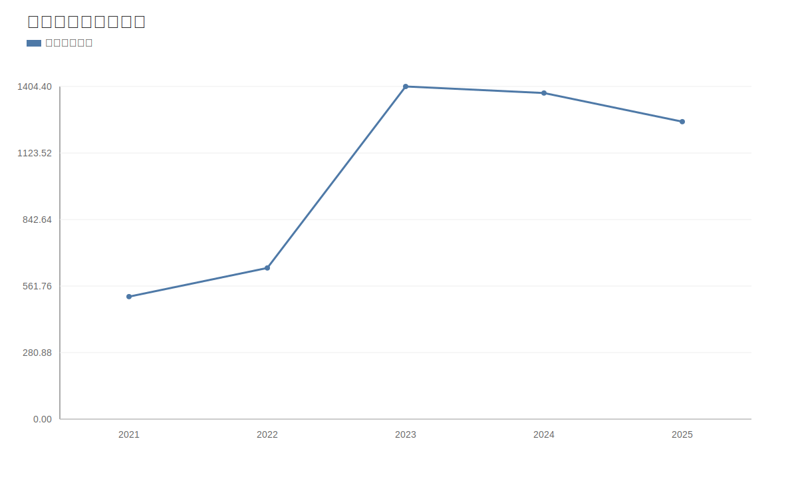

### 2. 净利润趋势图
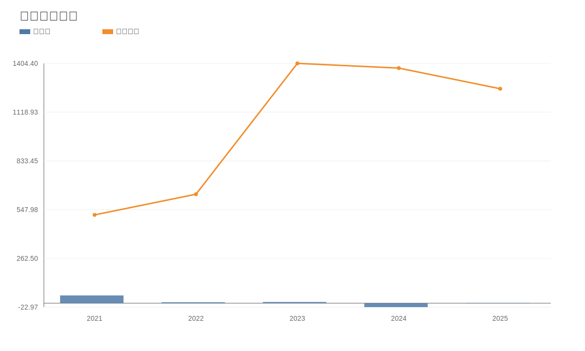

### 3. 毛利率和净利率对比图
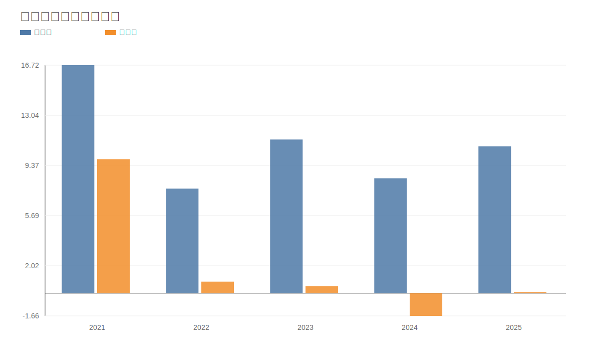

### 4. 分产品收入结构图
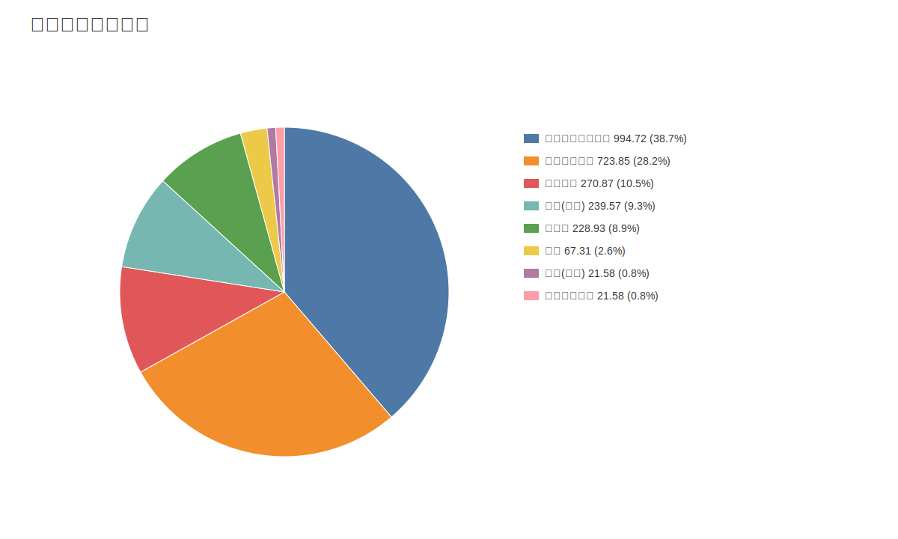

### 4. 分产品收入变化图
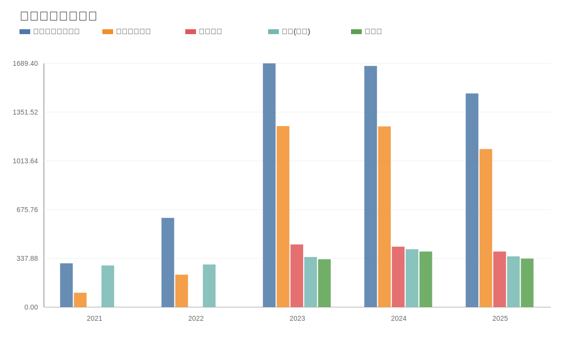

### 5. 分产品利润结构图
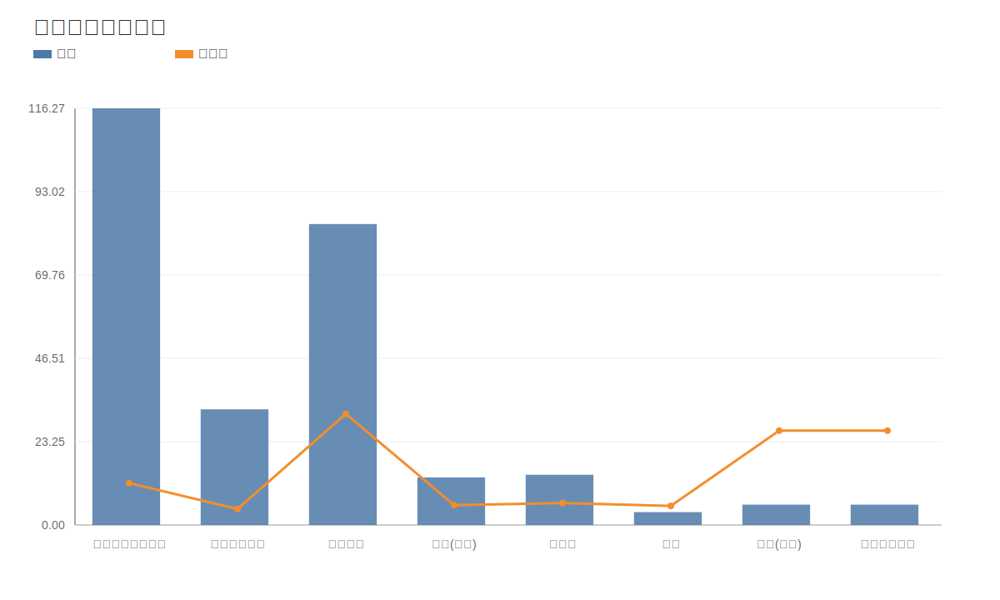

### 6. 分地区收入分布图
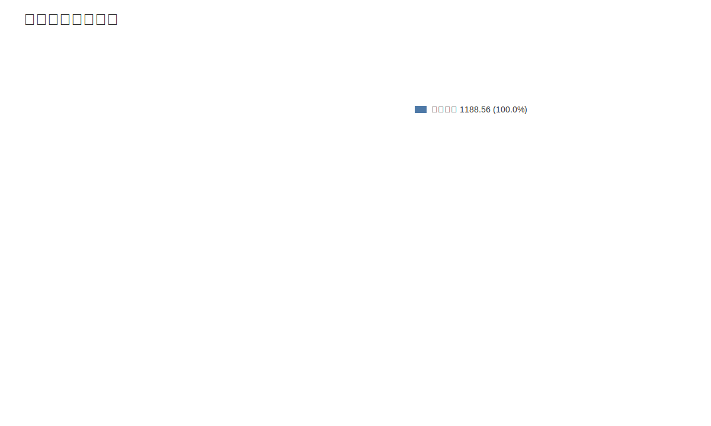

### 7. 资产负债表关键数据图
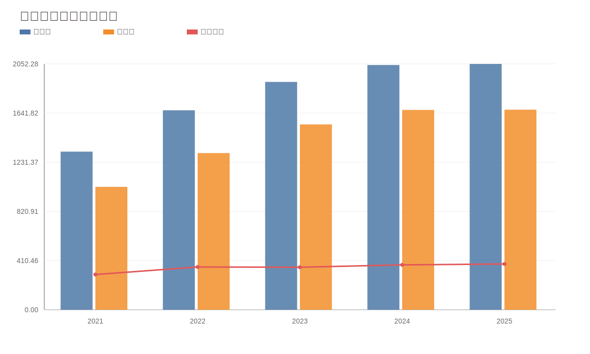

### 8. 自由现金流与经营现金流对比图
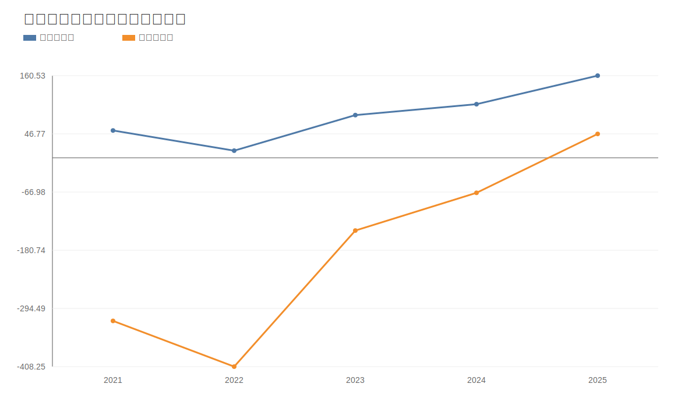

### 9. 股东回报分析图
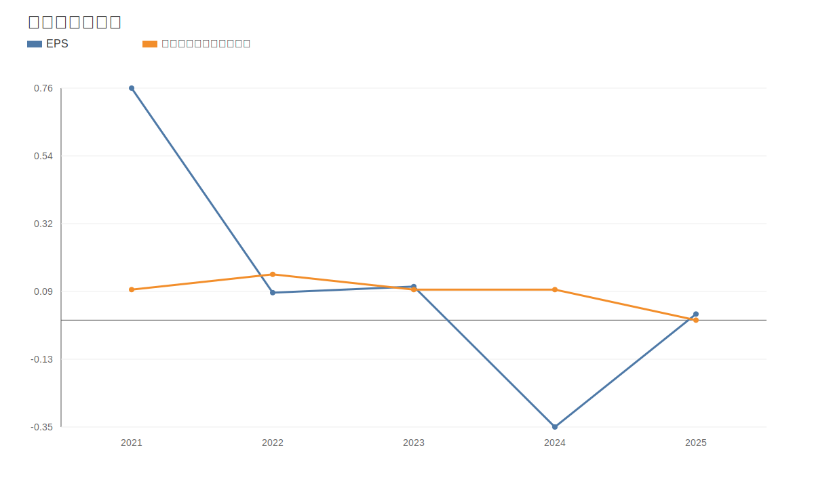

### 10. 财务比率分析图
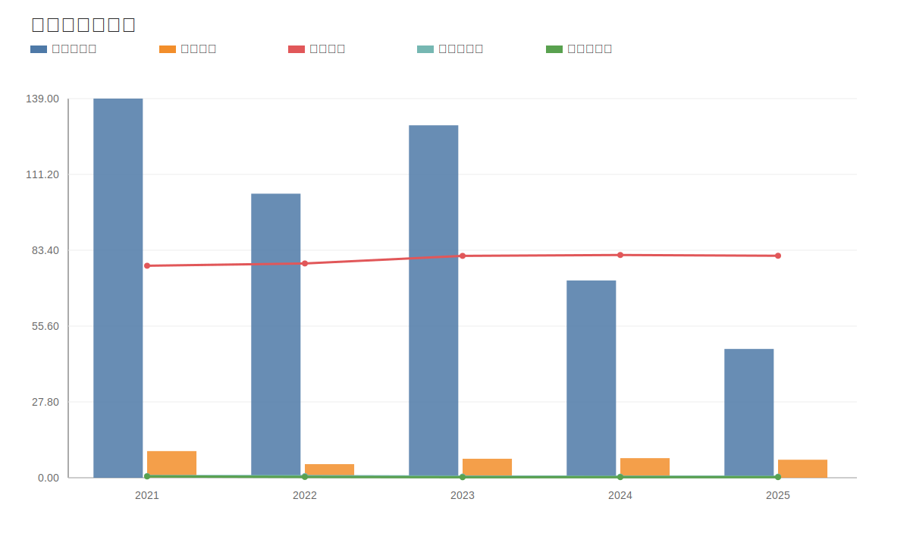

### 11. ROE与ROA对比图
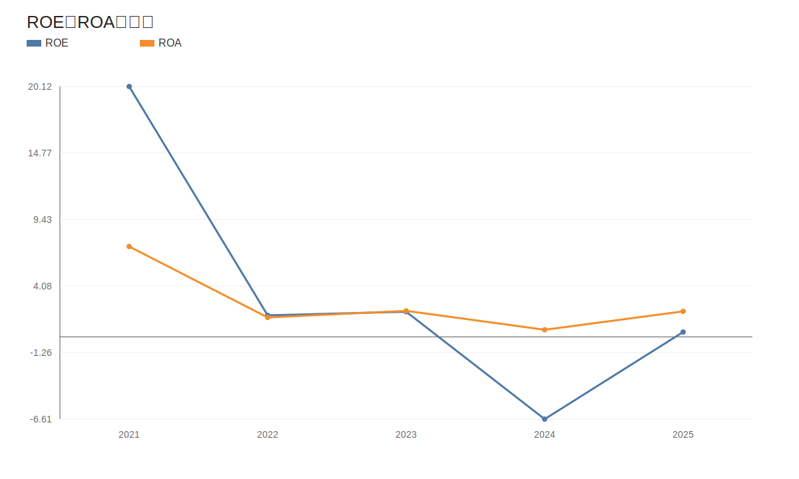
<!-- VALUE_CHARTS_END -->

## 困境反转专项判断（东方盛虹）
事实：
- 价格日期：20260511；财报日期：20260331。
- 当前收盘价 12.94 元，PE(TTM) 69.84，PB 2.46。
计算结果：
- 营收同比 -74.50%，净利润同比 971.00%，经营现金流同比 -77.98%。
- 资产负债率：最新 81.10%，上期 81.38%。
- 困境反转评分：2/3，状态：反转进行中。
推断：
- 若“盈利修复 + 现金流修复 + 杠杆缓解”连续两个报告期维持，则反转概率提升；若任一项再度恶化，应下调反转置信度。
