# 长春高新（000661.SZ）价值分析报告草稿

- 生成时间：2026-05-13 01:36:26
- 自动化脚本：`.agents/skills/value-report/value_report_scaffold.py`
- 数据口径：数据库字段定义以 `app/models/models.py` 为准
- 公司信息：行业 生物制药｜地区 吉林｜上市日期 19961218
- 管理层：董事长 姜云涛｜总经理 金磊｜员工 11547
- 主营业务：主要产品:基因重组人生长素,血栓心脉宁,冠脉宁.
- 提示：本文件已自动填充定量部分，定性模块请结合最新公告与行业资料补充。

## 自动填充数据（可直接引用）
### 最新估值
- 交易日：20260511
- 收盘价：90.00 元
- PE(TTM)：N/A 倍
- PB：1.65 倍
- PS(TTM)：3.15 倍
- 股息率(TTM)：2.84%
- 总市值：367.14 亿元

### 最新财务快照
- 报告期：20260331
- 营收：25.87亿（同比 -13.69%）
- 归母净利润：2.76亿（同比 -41.67%）
- 经营现金流：10.98亿（同比 92.27%）
- 自由现金流：4.19亿
- 毛利率：77.95%，净利率：10.46%
- ROE：1.25%，ROIC：1.03%
- 资产负债率：18.30%，流动比率：3.52
- 经营现金流/利润：310.29%
- 货币资金：26.21亿，有息负债：19.22亿，净现金：6.99亿

### 近五年年报趋势
| 年度 | 营收 | 营收同比 | 归母净利 | 净利同比 | 毛利率 | 净利率 | ROE | ROIC | 资产负债率 | 经营现金流 | 自由现金流 | 现净比 |
| --- | --- | --- | --- | --- | --- | --- | --- | --- | --- | --- | --- | --- |
| 2025 | 120.83亿 | -10.27% | 1.55亿 | -94.00% | 82.11% | -0.19% | 0.69% | 1.03% | 17.32% | 8.02亿 | -383.42亿 | 517.60% |
| 2024 | 134.66亿 | -7.55% | 25.83亿 | -43.01% | 85.72% | 20.11% | 11.46% | 9.70% | 15.94% | 31.04亿 | 10.78亿 | 120.18% |
| 2023 | 145.66亿 | 15.35% | 45.32亿 | 9.48% | 85.97% | 32.79% | 22.59% | 19.20% | 18.58% | 51.04亿 | 30.76亿 | 112.60% |
| 2022 | 126.27亿 | 17.50% | 41.40亿 | 10.18% | 88.00% | 33.38% | 25.38% | 20.17% | 20.06% | 28.26亿 | 12.75亿 | 68.27% |
| 2021 | 107.47亿 | N/A | 37.57亿 | N/A | 87.61% | 36.27% | 29.46% | 23.49% | 23.45% | 33.31亿 | 15.17亿 | 88.64% |

- 近五年营收CAGR：2.97%
- 近五年净利CAGR：-54.94%

### 分红与审计
#### 已实施分红
2025年已实施现金分红（税前）合计：每股 2.600 元
2024年已实施现金分红（税前）合计：每股 4.500 元
2023年已实施现金分红（税前）合计：每股 1.000 元
2022年已实施现金分红（税前）合计：每股 0.800 元
2021年已实施现金分红（税前）合计：每股 0.800 元

#### 审计意见
- 20241231：标准无保留意见（大华会计师事务所）
- 20231231：标准无保留意见（大信会计师事务所）
- 20221231：标准无保留意见（大信会计师事务所）
- 20211231：标准无保留意见（大信会计师事务所）
- 20201231：标准无保留意见（大信会计师事务所）

## ECharts 图表数据（option）

- 说明：以下 `option` 可直接用于前端图表渲染；单位已在坐标轴标注。

### 1. 主营业务收入趋势图
```json
{
  "title": {
    "text": "主营业务收入趋势（近5年）"
  },
  "tooltip": {
    "trigger": "axis"
  },
  "legend": {
    "top": 24,
    "data": [
      "主营业务收入"
    ]
  },
  "xAxis": {
    "type": "category",
    "data": [
      "2021",
      "2022",
      "2023",
      "2024",
      "2025"
    ]
  },
  "yAxis": {
    "type": "value",
    "name": "亿元"
  },
  "series": [
    {
      "name": "主营业务收入",
      "type": "line",
      "smooth": true,
      "data": [
        107.47,
        126.27,
        145.66,
        134.66,
        120.83
      ]
    }
  ]
}
```

### 2. 净利润趋势图
```json
{
  "title": {
    "text": "净利润趋势（近5年）"
  },
  "tooltip": {
    "trigger": "axis"
  },
  "legend": {
    "top": 24,
    "data": [
      "净利润",
      "营业收入"
    ]
  },
  "xAxis": {
    "type": "category",
    "data": [
      "2021",
      "2022",
      "2023",
      "2024",
      "2025"
    ]
  },
  "yAxis": [
    {
      "type": "value",
      "name": "亿元"
    },
    {
      "type": "value",
      "name": "亿元"
    }
  ],
  "series": [
    {
      "name": "净利润",
      "type": "bar",
      "data": [
        37.57,
        41.4,
        45.32,
        25.83,
        1.55
      ]
    },
    {
      "name": "营业收入",
      "type": "line",
      "yAxisIndex": 1,
      "data": [
        107.47,
        126.27,
        145.66,
        134.66,
        120.83
      ]
    }
  ]
}
```

### 3. 毛利率和净利率对比图
```json
{
  "title": {
    "text": "毛利率 vs 净利率"
  },
  "tooltip": {
    "trigger": "axis"
  },
  "legend": {
    "top": 24,
    "data": [
      "毛利率",
      "净利率"
    ]
  },
  "xAxis": {
    "type": "category",
    "data": [
      "2021",
      "2022",
      "2023",
      "2024",
      "2025"
    ]
  },
  "yAxis": {
    "type": "value",
    "name": "%"
  },
  "series": [
    {
      "name": "毛利率",
      "type": "bar",
      "data": [
        87.61,
        88.0,
        85.97,
        85.72,
        82.11
      ]
    },
    {
      "name": "净利率",
      "type": "bar",
      "data": [
        36.27,
        33.38,
        32.79,
        20.11,
        -0.19
      ]
    }
  ]
}
```

### 4. 分产品收入结构图
```json
{
  "title": {
    "text": "分产品收入结构（20251231）"
  },
  "tooltip": {
    "trigger": "item"
  },
  "legend": {
    "type": "scroll",
    "top": 24
  },
  "series": [
    {
      "type": "pie",
      "radius": "55%",
      "data": [
        {
          "name": "制药业(行业)",
          "value": 111.71
        },
        {
          "name": "基因工程药品\\生物类药品",
          "value": 104.16
        },
        {
          "name": "房地产",
          "value": 8.16
        },
        {
          "name": "房地产(行业)",
          "value": 8.16
        },
        {
          "name": "中成药",
          "value": 7.56
        },
        {
          "name": "国外",
          "value": 1.44
        },
        {
          "name": "服务业(行业)",
          "value": 0.96
        },
        {
          "name": "服务业收入",
          "value": 0.96
        }
      ]
    }
  ]
}
```

### 4. 分产品收入变化图
```json
{
  "title": {
    "text": "分产品收入变化（近5年）"
  },
  "tooltip": {
    "trigger": "axis"
  },
  "legend": {
    "type": "scroll",
    "top": 24,
    "data": [
      "制药业(行业)",
      "基因工程药品\\生物类药品",
      "房地产",
      "房地产(行业)",
      "中成药"
    ]
  },
  "xAxis": {
    "type": "category",
    "data": [
      "2021",
      "2022",
      "2023",
      "2024",
      "2025"
    ]
  },
  "yAxis": {
    "type": "value",
    "name": "亿元"
  },
  "series": [
    {
      "name": "制药业(行业)",
      "type": "bar",
      "stack": "total",
      "data": [
        147.23,
        176.57,
        196.67,
        188.29,
        173.01
      ]
    },
    {
      "name": "基因工程药品\\生物类药品",
      "type": "bar",
      "stack": "total",
      "data": [
        137.77,
        166.94,
        186.1,
        176.76,
        161.67
      ]
    },
    {
      "name": "房地产",
      "type": "bar",
      "stack": "total",
      "data": [
        9.33,
        7.52,
        10.11,
        12.12,
        12.66
      ]
    },
    {
      "name": "房地产(行业)",
      "type": "bar",
      "stack": "total",
      "data": [
        9.33,
        7.52,
        10.11,
        12.12,
        12.66
      ]
    },
    {
      "name": "中成药",
      "type": "bar",
      "stack": "total",
      "data": [
        9.46,
        9.63,
        10.57,
        11.53,
        11.33
      ]
    }
  ]
}
```

### 5. 分产品利润结构图
```json
{
  "title": {
    "text": "分产品利润结构（20251231）"
  },
  "tooltip": {
    "trigger": "axis"
  },
  "legend": {
    "top": 24,
    "data": [
      "利润",
      "毛利率"
    ]
  },
  "xAxis": {
    "type": "category",
    "data": [
      "制药业(行业)",
      "基因工程药品\\生物类药品",
      "房地产",
      "房地产(行业)",
      "中成药",
      "国外",
      "服务业(行业)",
      "服务业收入"
    ]
  },
  "yAxis": [
    {
      "type": "value",
      "name": "亿元"
    },
    {
      "type": "value",
      "name": "%"
    }
  ],
  "series": [
    {
      "name": "利润",
      "type": "bar",
      "data": [
        97.65,
        92.86,
        1.22,
        1.22,
        4.78,
        1.07,
        0.36,
        0.36
      ]
    },
    {
      "name": "毛利率",
      "type": "line",
      "yAxisIndex": 1,
      "data": [
        87.41,
        89.16,
        14.92,
        14.92,
        63.3,
        74.26,
        37.25,
        37.25
      ]
    }
  ]
}
```

### 6. 分地区收入分布图
```json
{
  "title": {
    "text": "分地区收入分布（20251231）"
  },
  "tooltip": {
    "trigger": "item"
  },
  "legend": {
    "type": "scroll",
    "top": 24
  },
  "series": [
    {
      "type": "pie",
      "radius": "55%",
      "data": [
        {
          "name": "华东",
          "value": 45.81
        },
        {
          "name": "华南",
          "value": 15.8
        },
        {
          "name": "东北",
          "value": 14.71
        },
        {
          "name": "华中",
          "value": 13.24
        },
        {
          "name": "西南",
          "value": 13.09
        },
        {
          "name": "华北",
          "value": 12.34
        },
        {
          "name": "西北",
          "value": 4.41
        }
      ]
    }
  ]
}
```

### 7. 资产负债表关键数据图
```json
{
  "title": {
    "text": "资产负债表关键数据（近5年）"
  },
  "tooltip": {
    "trigger": "axis"
  },
  "legend": {
    "top": 24,
    "data": [
      "总资产",
      "总负债",
      "股东权益"
    ]
  },
  "xAxis": {
    "type": "category",
    "data": [
      "2021",
      "2022",
      "2023",
      "2024",
      "2025"
    ]
  },
  "yAxis": {
    "type": "value",
    "name": "亿元"
  },
  "series": [
    {
      "name": "总资产",
      "type": "bar",
      "stack": "capital",
      "data": [
        225.16,
        260.27,
        307.44,
        310.51,
        300.81
      ]
    },
    {
      "name": "总负债",
      "type": "bar",
      "stack": "capital",
      "data": [
        52.79,
        52.21,
        57.11,
        49.49,
        52.11
      ]
    },
    {
      "name": "股东权益",
      "type": "line",
      "data": [
        172.37,
        208.06,
        250.32,
        261.02,
        248.7
      ]
    }
  ]
}
```

### 8. 自由现金流与经营现金流对比图
```json
{
  "title": {
    "text": "自由现金流 vs 经营现金流"
  },
  "tooltip": {
    "trigger": "axis"
  },
  "legend": {
    "top": 24,
    "data": [
      "经营现金流",
      "自由现金流"
    ]
  },
  "xAxis": {
    "type": "category",
    "data": [
      "2021",
      "2022",
      "2023",
      "2024",
      "2025"
    ]
  },
  "yAxis": {
    "type": "value",
    "name": "亿元"
  },
  "series": [
    {
      "name": "经营现金流",
      "type": "line",
      "data": [
        33.31,
        28.26,
        51.04,
        31.04,
        8.02
      ]
    },
    {
      "name": "自由现金流",
      "type": "line",
      "data": [
        15.17,
        12.75,
        30.76,
        10.78,
        -383.42
      ]
    }
  ]
}
```

### 9. 股东回报分析图
```json
{
  "title": {
    "text": "股东回报（EPS/分红）"
  },
  "tooltip": {
    "trigger": "axis"
  },
  "legend": {
    "top": 24,
    "data": [
      "EPS",
      "每股现金分红（已实施）"
    ]
  },
  "xAxis": {
    "type": "category",
    "data": [
      "2021",
      "2022",
      "2023",
      "2024",
      "2025"
    ]
  },
  "yAxis": {
    "type": "value",
    "name": "元"
  },
  "series": [
    {
      "name": "EPS",
      "type": "line",
      "data": [
        9.28,
        10.29,
        11.21,
        6.42,
        0.39
      ]
    },
    {
      "name": "每股现金分红（已实施）",
      "type": "line",
      "data": [
        0.8,
        0.8,
        1.0,
        4.5,
        2.6
      ]
    }
  ]
}
```

### 10. 财务比率分析图
```json
{
  "title": {
    "text": "关键财务比率（近5年）"
  },
  "tooltip": {
    "trigger": "axis"
  },
  "legend": {
    "type": "scroll",
    "top": 24,
    "data": [
      "资产负债率",
      "流动比率",
      "速动比率",
      "应收周转率",
      "存货周转率"
    ]
  },
  "xAxis": {
    "type": "category",
    "data": [
      "2021",
      "2022",
      "2023",
      "2024",
      "2025"
    ]
  },
  "yAxis": [
    {
      "type": "value",
      "name": "比率/%"
    },
    {
      "type": "value",
      "name": "周转率"
    }
  ],
  "series": [
    {
      "name": "资产负债率",
      "type": "line",
      "data": [
        23.45,
        20.06,
        18.58,
        15.94,
        17.32
      ]
    },
    {
      "name": "流动比率",
      "type": "line",
      "data": [
        3.72,
        4.01,
        3.79,
        4.76,
        3.76
      ]
    },
    {
      "name": "速动比率",
      "type": "line",
      "data": [
        2.56,
        2.79,
        2.75,
        3.37,
        2.17
      ]
    },
    {
      "name": "应收周转率",
      "type": "bar",
      "yAxisIndex": 1,
      "data": [
        7.74,
        6.98,
        5.38,
        4.54,
        5.09
      ]
    },
    {
      "name": "存货周转率",
      "type": "bar",
      "yAxisIndex": 1,
      "data": [
        0.36,
        0.34,
        0.43,
        0.4,
        0.41
      ]
    }
  ]
}
```

### 11. ROE与ROA对比图
```json
{
  "title": {
    "text": "ROE vs ROA（近5年）"
  },
  "tooltip": {
    "trigger": "axis"
  },
  "legend": {
    "top": 24,
    "data": [
      "ROE",
      "ROA"
    ]
  },
  "xAxis": {
    "type": "category",
    "data": [
      "2021",
      "2022",
      "2023",
      "2024",
      "2025"
    ]
  },
  "yAxis": {
    "type": "value",
    "name": "%"
  },
  "series": [
    {
      "name": "ROE",
      "type": "line",
      "data": [
        29.46,
        25.38,
        22.59,
        11.46,
        0.69
      ]
    },
    {
      "name": "ROA",
      "type": "line",
      "data": [
        23.0,
        19.92,
        19.02,
        9.86,
        -0.02
      ]
    }
  ]
}
```

## 1. 公司概况（商业模式优先）
- 公司是如何赚钱的？
- 收入来源构成（核心业务占比）
- 客户类型（To B / To C / 政府）
- 是否具备持续性收入（一次性 vs 订阅/复购）
- 是否依赖单一客户或区域

### 结论
- 商业模式是否简单、可理解
- 是否具备长期可持续性

## 2. 行业与竞争格局
- 行业空间（市场规模、天花板）
- 行业阶段（成长 / 成熟 / 衰退）
- 行业增速
- 主要竞争对手
- 市场份额与行业集中度
- 公司在产业链中的位置

### 结论
- 是否属于优质赛道
- 公司是否处于有利竞争位置
- 行业未来3-5年趋势

## 3. 护城河分析（含真伪辨别）
- 品牌优势
- 成本优势
- 网络效应
- 转换成本
- 技术壁垒
- 渠道优势

### 护城河真伪辨别
- 如果产品提价 5%，客户是否会流失？
- 客户是否对价格敏感？
- 是否存在“非它不可”的使用场景？
- 替代品是否容易出现？
- 客户更换供应商的成本高不高？

### 结论
- 护城河类型
- 护城河强度：强 / 中 / 弱 / 伪护城河
- 是否具备真实定价权

## 4. 管理层与资本配置（重点）
- 管理层背景与稳定性
- 是否存在诚信问题（造假 / 处罚 / 诉讼）
- 过往战略是否理性

### 资本配置历史
- 是否长期分红
- 是否进行回购注销（而非股权激励稀释）
- 并购历史（成功 / 失败 / 频繁）
- 是否存在盲目多元化扩张
- 资本开支是否合理

### 结论
- 管理层类型：价值创造者 / 中性 / 价值毁灭者
- 是否值得长期信任

## 5. 财务分析
### 5.1 成长性
- 营收增长率（近3-5年）
- 净利润增长率
- 增长是否稳定

### 结论
- 是否具备持续成长能力

### 5.2 盈利能力
- 毛利率
- 净利率
- ROE / ROIC

### 结论
- 是否具备定价权
- 盈利质量如何

### 5.3 财务健康
- 资产负债率
- 有息负债
- 现金储备
- 短期偿债能力

### 结论
- 是否存在财务风险

### 5.4 现金流质量
- 经营现金流
- 自由现金流
- 净利润与现金流是否匹配

### 结论
- 利润是否真实
- 是否具备造血能力

## 6. 成长驱动
- 未来3-5年增长来源
- 是否依赖提价 / 扩张 / 新业务
- 增长逻辑是否清晰

### 结论
- 成长是否可持续

## 7. 风险分析（含幸存者偏差）
- 政策风险
- 行业竞争风险
- 技术替代风险
- 财务风险
- 客户集中风险

### 幸存者偏差检验
- 行业历史最差时期是什么时候？
- 当时发生了什么（金融危机 / 疫情 / 监管）？
- 公司当时表现：是否大幅亏损 / 现金流断裂 / 接近破产？
- 公司在极端情况下是：变强 / 持平 / 衰退

### 结论
- 抗风险能力：强 / 中 / 弱
- 是否属于“穿越周期公司”

## 8. 估值分析
- PE / PB / PS / PEG / EV/EBITDA
- 当前估值 vs 历史估值
- 当前估值 vs 行业对比

### 结论
- 当前是否高估 / 低估 / 合理
- 是否具备安全边际

## 9. 投资判断
### 多头逻辑
1. 
2. 
3. 

### 空头逻辑
1. 
2. 
3. 

### 核心跟踪指标
1. 
2. 
3. 

## 最终结论
- 这是否是一家好公司？
- 是否具备长期投资价值？
- 当前价格是否值得买入？
- 投资建议：买入 / 观察 / 回避

## 总评分（100分）
- 商业模式：
- 护城河：
- 管理层：
- 财务：
- 风险：
- 估值：

**最终评分：__ / 100**

## 三个终极问题（必须回答）
1. 如果提价 5%，客户会不会流失？
2. 公司赚的钱有没有被管理层浪费？
3. 在行业最差年份，公司是怎么活下来的？

<!-- VALUE_CHARTS_START -->
## 图表图片（自动生成）

### 1. 主营业务收入趋势图
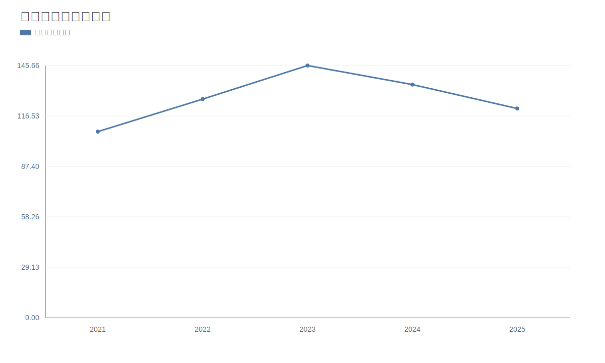

### 2. 净利润趋势图
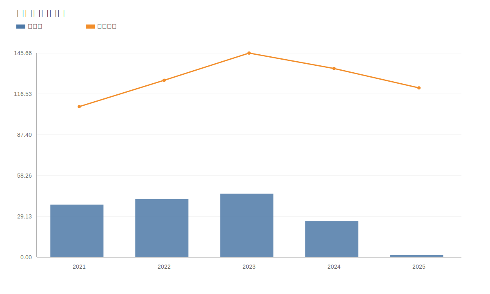

### 3. 毛利率和净利率对比图
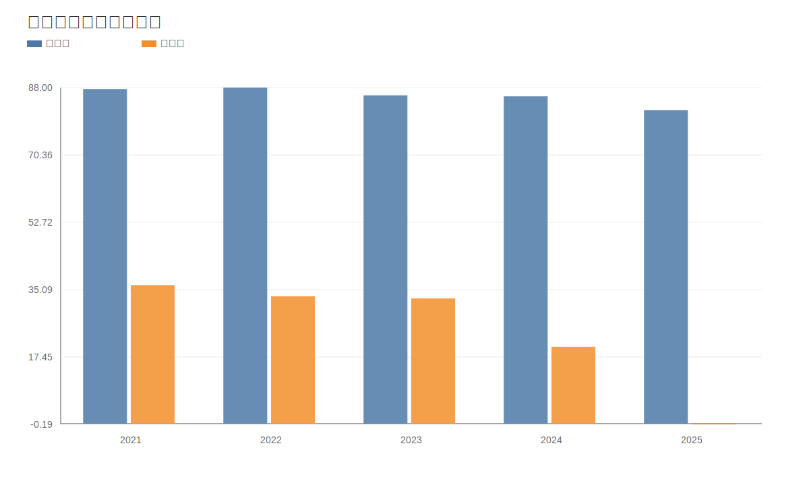

### 4. 分产品收入结构图
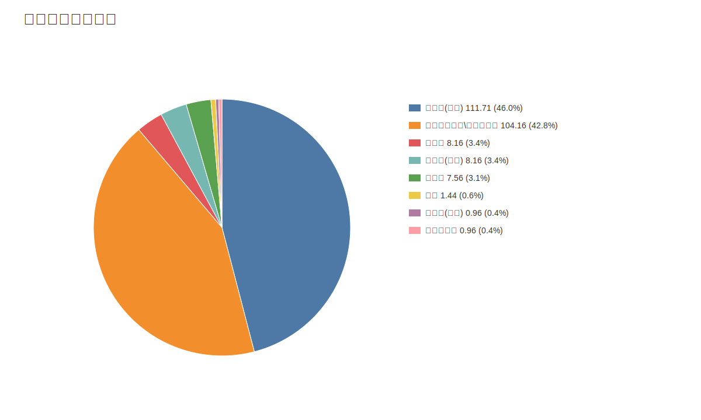

### 4. 分产品收入变化图
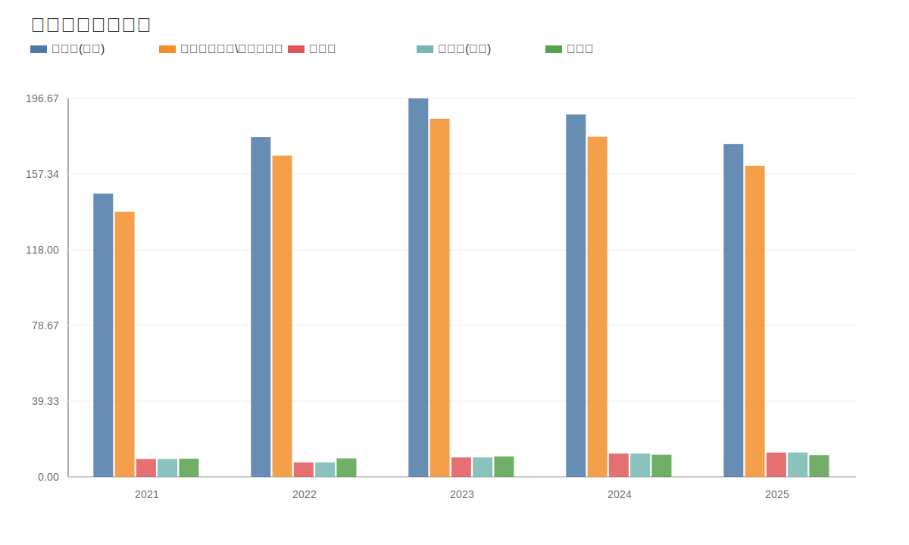

### 5. 分产品利润结构图
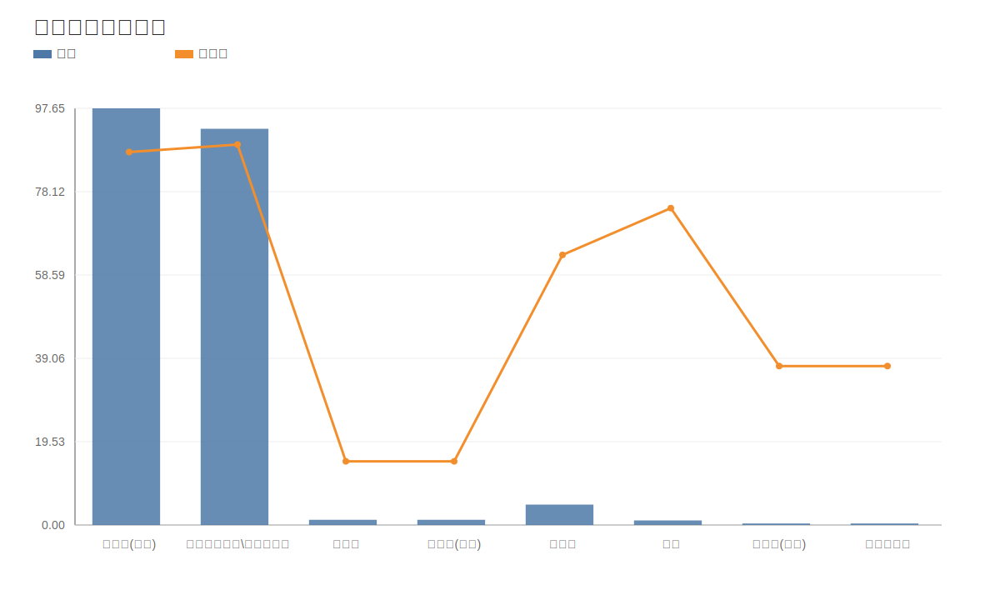

### 6. 分地区收入分布图
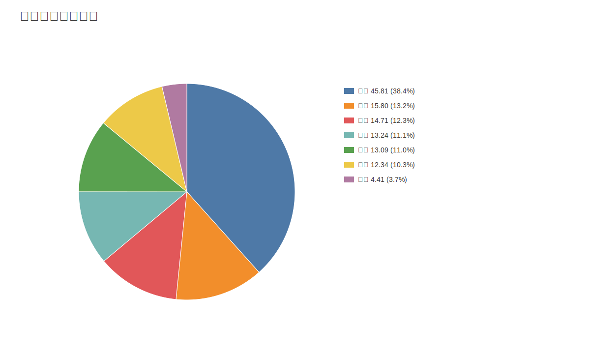

### 7. 资产负债表关键数据图
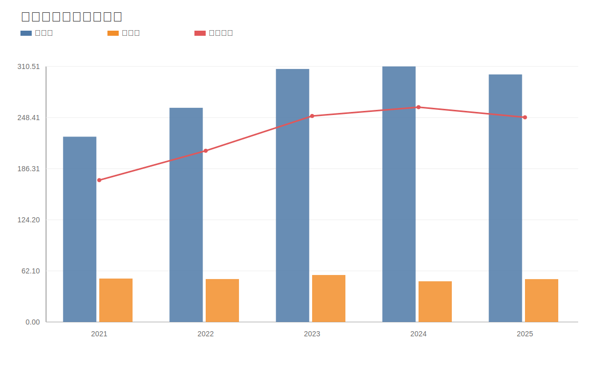

### 8. 自由现金流与经营现金流对比图
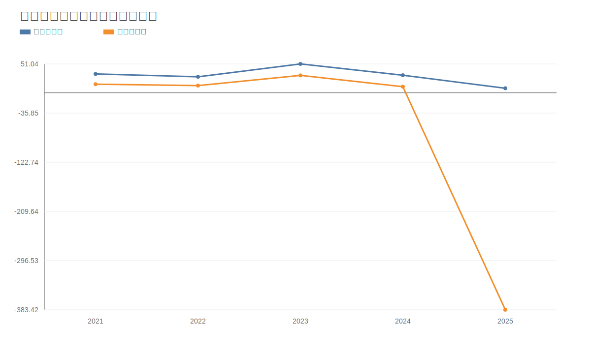

### 9. 股东回报分析图
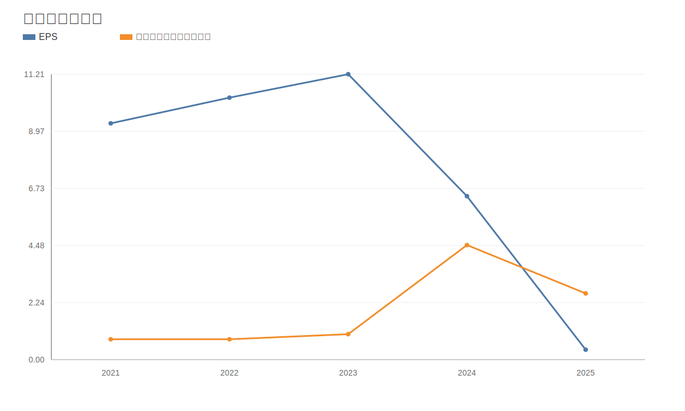

### 10. 财务比率分析图
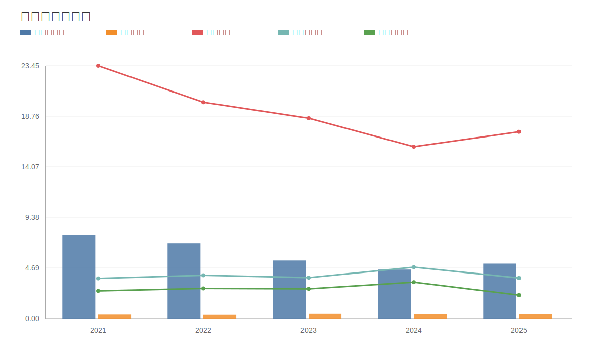

### 11. ROE与ROA对比图
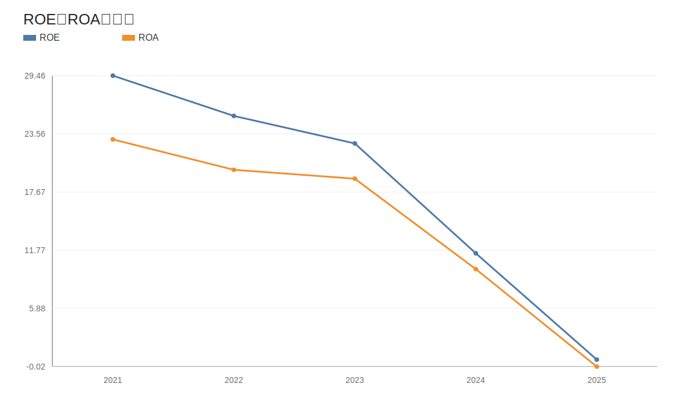
<!-- VALUE_CHARTS_END -->
