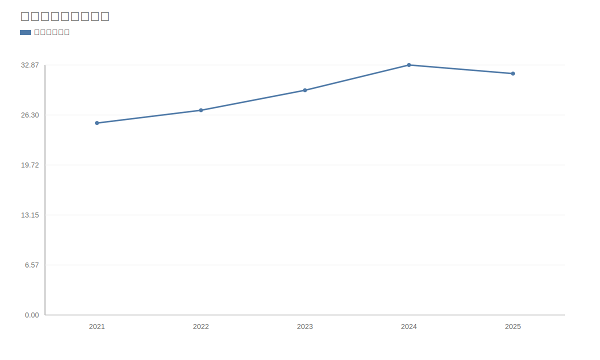
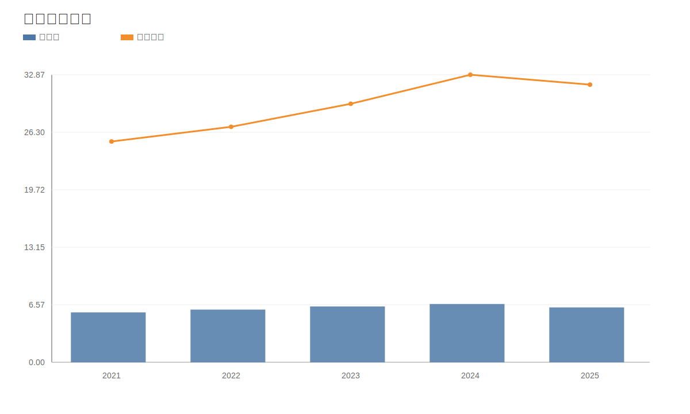
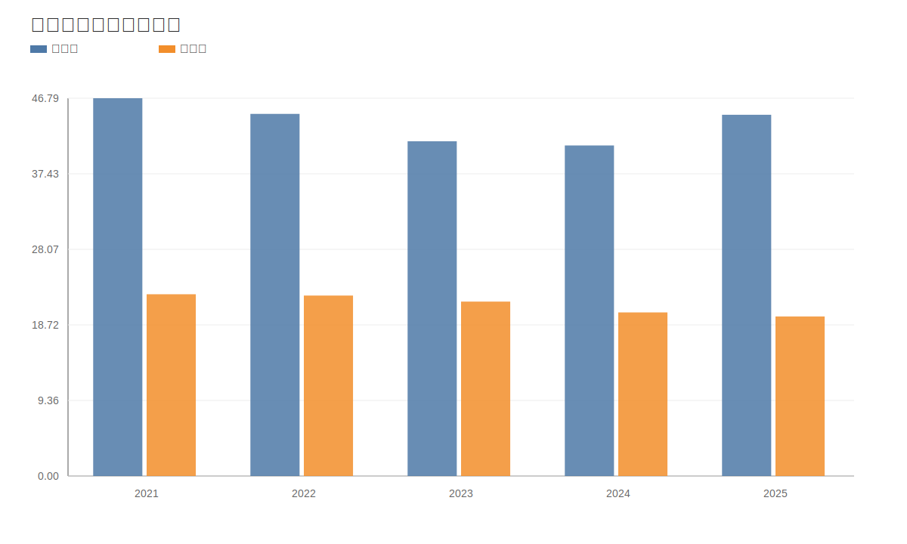
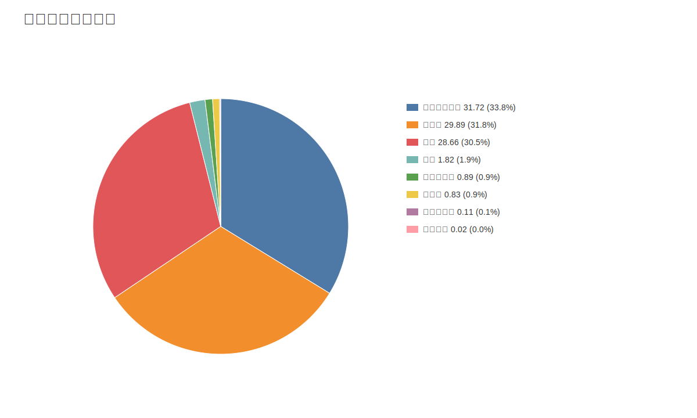

# 承德露露（000848）深度价值研究报告（巴菲特+芒格框架）

价格日期：2026-04-17  
财报日期：2024-12-31

## 1. 公司概况（商业模式优先）
承德露露主要销售植物蛋白饮料（杏仁露为核心），通过经销网络向终端渠道铺货，收入以高复购快消为主。客户类型以ToC消费为主，经销体系承接渠道分发。

结论：公司是典型“成熟消费品+渠道分销”商业模式，现金流属性优于成长属性。  
事实：2024年收入32.87亿元，净利润6.66亿元；杏仁露相关收入占比约97.0%。  
推断：若没有新品类突破，长期增长中枢大概率维持中低个位数。

## 2. 行业与竞争格局
植物蛋白饮料属于成熟赛道，需求总体稳定但高增速阶段已过。行业竞争重点在渠道占位、品牌心智与促销效率。

结论：行业空间稳定但天花板明显，竞争以“存量份额争夺”为主。  
事实：公司收入区域中北部占比约91.0%，区域集中显著。  
推断：全国化增量和品类延展是估值修复的关键变量。

## 3. 护城河分析（含真伪辨别）
护城河来源：品牌认知、区域渠道深度、供应链稳定性。弱点：消费习惯易受替代品冲击，区域外心智并不强。

结论：护城河强度为“中等偏窄”。  
事实：北部地区毛利率约42.01%，显著高于公司均值，体现主场优势。  
推断：若提价5%，主场市场承受力尚可，但在弱势区域更容易丢份额。

## 4. 管理层与资本配置
管理层保持稳定，审计连续多年标准无保留意见。资本配置风格偏稳健，重分红、低杠杆，研发投入较低。

结论：管理层偏防守型，资本配置总体审慎。  
事实：2024年研发费用约0.16亿元，占收入不足1%。  
推断：若要打开第二增长曲线，研发与品牌投资强度需要提升。

## 5. 财务分析（成长/盈利/健康/现金流）
成长性：2020-2024收入CAGR约15.3%，净利CAGR约11.4%。
盈利能力：2024年毛利率40.94%，净利率20.26%，ROE20.41%。
财务健康：资产负债率25.10%，流动比率3.75。
现金流质量：2024年经营现金流6.30亿元，自由现金流4.82亿元，现金流/净利润匹配良好。

结论：财务质量优良，抗风险能力较强。  
事实：2024年净现金约32.51亿元。  
推断：公司具备持续分红与抗周期能力，但成长弹性有限。

## 6. 成长驱动
未来增长驱动主要来自：新品拓展、非北方市场渗透、渠道精细化运营与数字化营销提升。

结论：成长驱动存在但强度一般。  
事实：2024年收入同比约11.3%，净利同比约4.4%。  
推断：若新品贡献度无法提升，增长将继续受制于成熟品类属性。

## 7. 风险分析（含幸存者偏差）
核心风险：品类老化、渠道竞争加剧、区域集中、原料价格波动、新品失败。幸存者偏差检验需看行业低迷期公司现金流与利润韧性。

结论：抗风险能力“中偏强”，但增长风险高于财务风险。  
事实：2020-2024经营现金流均为正且在3.79-6.88亿元区间。  
推断：公司“活得稳”，但“长得快”不确定性较高。

## 8. 估值分析
当前估值：PE 13.20x、PB 2.58x、PS 2.70x。历史分位：PE 5.8% / PB 2.1% / PS 3.8%。
相对估值：显著低于伊利、天味等消费可比标的。
DCF：保守/基准/乐观估值约10.15/11.09/12.14元。
反向DCF：当前价格隐含未来5年FCF增速约-4.7%。

结论：估值处于偏低区间，安全边际相对充足。  
事实：反向DCF显示市场已计入偏保守增长预期。  
推断：只要维持稳健现金流和分红，估值下行风险相对有限。

## 9. 投资判断（多头/空头/跟踪指标）
多头逻辑：
- 低估值 + 高现金流 + 高分红潜力。
- 财务稳健，净现金充足。
- 主场市场品牌与渠道仍有优势。

空头逻辑：
- 品类成熟，增长天花板明显。
- 区域集中度高，外延扩张难度大。
- 竞争加剧下销售费用可能侵蚀利润。

核心跟踪指标：
- 收入增速是否稳定在双位数以下/以上的拐点。
- 北方以外区域收入占比变化。
- 销售费用率与经营现金流净额。

结论：偏价值防守型标的，向上弹性依赖增长修复验证。  
事实：当前估值低位已反映较多悲观预期。  
推断：若增长改善，存在“估值+业绩”双击机会。

## 10. 最终结论
承德露露是“财务强、增长弱”的典型成熟消费股。当前价格更像低预期定价，回撤风险有限，但上行空间取决于增长再加速能力。

结论：建议“观察偏积极/分批配置”。  
事实：估值处历史低位且现金流稳健。  
推断：中短期靠估值修复，中长期靠新品与区域扩张兑现。

## 11. 总评分（100分）
- 商业模式（20）：15
- 护城河（20）：13
- 管理层与资本配置（15）：12
- 财务质量（20）：18
- 风险控制（10）：7
- 估值性价比（15）：12
- 最终总分：77/100

结论：属于“稳健价值型”公司，胜在确定性，弱在成长性。  
事实：评分高项集中在财务与估值，低项集中在成长驱动。  
推断：适合低波动偏好投资者，不适合高成长预期策略。

## 12. 三个终极问题（必须回答）
1. 如果提价5%，客户会不会流失？
- 主场区域短期流失有限，弱势区域更敏感，整体需谨慎提价并配合渠道策略。

2. 公司赚的钱有没有被管理层浪费？
- 目前看没有明显浪费，现金流稳、负债低、审计持续标准无保留。

3. 在行业最差年份，公司是怎么活下来的？
- 靠品牌惯性、区域渠道深度和稳定现金流，维持盈利与分红能力。

结论：终极三问下，公司符合“防守型价值股”特征。  
事实：现金流和净现金构成主要安全垫。  
推断：若增长改善，估值修复概率上升。

<!-- VALUE_CHARTS_START -->
## 图表图片（自动生成）

### 1. 营收与归母净利润（亿元）

### 2. 毛利率与净利率（%）

### 3. 经营现金流与自由现金流（亿元）

### 4. 2024区域收入结构（亿元）

<!-- VALUE_CHARTS_END -->

> ⚠️ 免责声明：本分析仅供教育和研究用途，不构成投资建议。
