# 五粮液（000858.SZ）价值分析报告草稿

- 生成时间：2026-05-13 01:35:36
- 自动化脚本：`.agents/skills/value-report/value_report_scaffold.py`
- 数据口径：数据库字段定义以 `app/models/models.py` 为准
- 公司信息：行业 白酒｜地区 四川｜上市日期 19980427
- 管理层：董事长 曾从钦｜总经理 华涛｜员工 25132
- 主营业务：主要产品:五粮液系列酒.
- 提示：本文件已自动填充定量部分，定性模块请结合最新公告与行业资料补充。

## 自动填充数据（可直接引用）
### 最新估值
- 交易日：20260511
- 收盘价：91.81 元
- PE(TTM)：28.28 倍
- PB：2.78 倍
- PS(TTM)：7.70 倍
- 股息率(TTM)：6.26%
- 总市值：3563.70 亿元

### 最新财务快照
- 报告期：20260331
- 营收：228.38亿（同比 -38.18%）
- 归母净利润：80.63亿（同比 -45.74%）
- 经营现金流：-25.35亿（同比 -116.00%）
- 自由现金流：N/A
- 毛利率：81.43%，净利率：36.45%
- ROE：6.50%，ROIC：6.24%
- 资产负债率：34.31%，流动比率：2.56
- 经营现金流/利润：-23.78%
- 货币资金：1242.59亿，有息负债：0.00亿，净现金：1242.59亿

### 近五年年报趋势
| 年度 | 营收 | 营收同比 | 归母净利 | 净利同比 | 毛利率 | 净利率 | ROE | ROIC | 资产负债率 | 经营现金流 | 自由现金流 | 现净比 |
| --- | --- | --- | --- | --- | --- | --- | --- | --- | --- | --- | --- | --- |
| 2025 | 405.29亿 | -54.55% | 89.54亿 | -71.89% | 77.54% | 22.99% | 7.07% | 5.61% | 35.69% | 297.06亿 | 235.55亿 | 331.76% |
| 2024 | 891.75亿 | 7.09% | 318.53亿 | 5.44% | 77.05% | 37.22% | 24.24% | 23.04% | 27.55% | 339.40亿 | 412.78亿 | 106.55% |
| 2023 | 832.72亿 | 12.58% | 302.11亿 | 13.19% | 75.79% | 37.85% | 24.81% | 23.77% | 20.00% | 417.42亿 | 381.15亿 | 138.17% |
| 2022 | 739.69亿 | 11.72% | 266.91亿 | 14.17% | 75.42% | 37.81% | 25.05% | 24.13% | 23.59% | 244.31亿 | 223.62亿 | 91.53% |
| 2021 | 662.09亿 | N/A | 233.77亿 | N/A | 75.35% | 37.02% | 25.30% | 24.44% | 25.24% | 267.75亿 | 246.63亿 | 114.54% |

- 近五年营收CAGR：-11.55%
- 近五年净利CAGR：-21.33%

### 分红与审计
#### 已实施分红
2025年已实施现金分红（税前）合计：每股 8.323 元
2024年已实施现金分红（税前）合计：每股 4.670 元
2023年已实施现金分红（税前）合计：每股 3.782 元

#### 审计意见
- 20241231：标准无保留意见（天职国际会计师事务所）
- 20231231：标准无保留意见（四川华信(集团)会计师事务所）
- 20221231：标准无保留意见（四川华信(集团)会计师事务所）
- 20211231：标准无保留意见（四川华信(集团)会计师事务所）
- 20201231：标准无保留意见（四川华信(集团)会计师事务所）

## ECharts 图表数据（option）

- 说明：以下 `option` 可直接用于前端图表渲染；单位已在坐标轴标注。

### 1. 主营业务收入趋势图
```json
{
  "title": {
    "text": "主营业务收入趋势（近5年）"
  },
  "tooltip": {
    "trigger": "axis"
  },
  "legend": {
    "top": 24,
    "data": [
      "主营业务收入"
    ]
  },
  "xAxis": {
    "type": "category",
    "data": [
      "2021",
      "2022",
      "2023",
      "2024",
      "2025"
    ]
  },
  "yAxis": {
    "type": "value",
    "name": "亿元"
  },
  "series": [
    {
      "name": "主营业务收入",
      "type": "line",
      "smooth": true,
      "data": [
        662.09,
        739.69,
        832.72,
        891.75,
        405.29
      ]
    }
  ]
}
```

### 2. 净利润趋势图
```json
{
  "title": {
    "text": "净利润趋势（近5年）"
  },
  "tooltip": {
    "trigger": "axis"
  },
  "legend": {
    "top": 24,
    "data": [
      "净利润",
      "营业收入"
    ]
  },
  "xAxis": {
    "type": "category",
    "data": [
      "2021",
      "2022",
      "2023",
      "2024",
      "2025"
    ]
  },
  "yAxis": [
    {
      "type": "value",
      "name": "亿元"
    },
    {
      "type": "value",
      "name": "亿元"
    }
  ],
  "series": [
    {
      "name": "净利润",
      "type": "bar",
      "data": [
        233.77,
        266.91,
        302.11,
        318.53,
        89.54
      ]
    },
    {
      "name": "营业收入",
      "type": "line",
      "yAxisIndex": 1,
      "data": [
        662.09,
        739.69,
        832.72,
        891.75,
        405.29
      ]
    }
  ]
}
```

### 3. 毛利率和净利率对比图
```json
{
  "title": {
    "text": "毛利率 vs 净利率"
  },
  "tooltip": {
    "trigger": "axis"
  },
  "legend": {
    "top": 24,
    "data": [
      "毛利率",
      "净利率"
    ]
  },
  "xAxis": {
    "type": "category",
    "data": [
      "2021",
      "2022",
      "2023",
      "2024",
      "2025"
    ]
  },
  "yAxis": {
    "type": "value",
    "name": "%"
  },
  "series": [
    {
      "name": "毛利率",
      "type": "bar",
      "data": [
        75.35,
        75.42,
        75.79,
        77.05,
        77.54
      ]
    },
    {
      "name": "净利率",
      "type": "bar",
      "data": [
        37.02,
        37.81,
        37.85,
        37.22,
        22.99
      ]
    }
  ]
}
```

### 4. 分产品收入结构图
```json
{
  "title": {
    "text": "分产品收入结构（20250630）"
  },
  "tooltip": {
    "trigger": "item"
  },
  "legend": {
    "type": "scroll",
    "top": 24
  },
  "series": [
    {
      "type": "pie",
      "radius": "55%",
      "data": [
        {
          "name": "制造业",
          "value": 527.71
        },
        {
          "name": "五粮液系列",
          "value": 409.98
        },
        {
          "name": "高价位酒",
          "value": 409.98
        },
        {
          "name": "南部",
          "value": 218.86
        },
        {
          "name": "东部",
          "value": 201.09
        },
        {
          "name": "中低价位酒",
          "value": 81.22
        },
        {
          "name": "其他酒",
          "value": 81.22
        },
        {
          "name": "北部",
          "value": 71.24
        }
      ]
    }
  ]
}
```

### 4. 分产品收入变化图
```json
{
  "title": {
    "text": "分产品收入变化（近5年）"
  },
  "tooltip": {
    "trigger": "axis"
  },
  "legend": {
    "type": "scroll",
    "top": 24,
    "data": [
      "制造业",
      "五粮液系列",
      "高价位酒",
      "南部",
      "东部"
    ]
  },
  "xAxis": {
    "type": "category",
    "data": [
      "2021",
      "2022",
      "2023",
      "2024",
      "2025"
    ]
  },
  "yAxis": {
    "type": "value",
    "name": "亿元"
  },
  "series": [
    {
      "name": "制造业",
      "type": "bar",
      "stack": "total",
      "data": [
        1029.61,
        1151.91,
        1287.78,
        1398.23,
        527.71
      ]
    },
    {
      "name": "五粮液系列",
      "type": "bar",
      "stack": "total",
      "data": [
        762.5,
        873.08,
        979.83,
        1070.8,
        409.98
      ]
    },
    {
      "name": "高价位酒",
      "type": "bar",
      "stack": "total",
      "data": [
        271.38,
        873.08,
        351.79,
        1070.8,
        409.98
      ]
    },
    {
      "name": "南部",
      "type": "bar",
      "stack": "total",
      "data": [
        111.66,
        113.33,
        103.27,
        428.32,
        218.86
      ]
    },
    {
      "name": "东部",
      "type": "bar",
      "stack": "total",
      "data": [
        287.18,
        295.32,
        341.02,
        448.42,
        201.09
      ]
    }
  ]
}
```

### 5. 分产品利润结构图
```json
{
  "title": {
    "text": "分产品利润结构（20250630）"
  },
  "tooltip": {
    "trigger": "axis"
  },
  "legend": {
    "top": 24,
    "data": [
      "利润",
      "毛利率"
    ]
  },
  "xAxis": {
    "type": "category",
    "data": [
      "制造业",
      "五粮液系列",
      "高价位酒",
      "南部",
      "东部",
      "中低价位酒",
      "其他酒",
      "北部"
    ]
  },
  "yAxis": [
    {
      "type": "value",
      "name": "亿元"
    },
    {
      "type": "value",
      "name": "%"
    }
  ],
  "series": [
    {
      "name": "利润",
      "type": "bar",
      "data": [
        405.43,
        354.42,
        354.42,
        170.7,
        172.05,
        49.33,
        49.33,
        61.0
      ]
    },
    {
      "name": "毛利率",
      "type": "line",
      "yAxisIndex": 1,
      "data": [
        76.83,
        86.45,
        86.45,
        78.0,
        85.55,
        60.74,
        60.74,
        85.62
      ]
    }
  ]
}
```

### 6. 分地区收入分布图
```json
{
  "title": {
    "text": "分地区收入分布（20250630，数据待补）"
  },
  "tooltip": {
    "trigger": "item"
  },
  "legend": {
    "type": "scroll",
    "top": 24
  },
  "series": [
    {
      "type": "pie",
      "radius": "55%",
      "data": []
    }
  ]
}
```

### 7. 资产负债表关键数据图
```json
{
  "title": {
    "text": "资产负债表关键数据（近5年）"
  },
  "tooltip": {
    "trigger": "axis"
  },
  "legend": {
    "top": 24,
    "data": [
      "总资产",
      "总负债",
      "股东权益"
    ]
  },
  "xAxis": {
    "type": "category",
    "data": [
      "2021",
      "2022",
      "2023",
      "2024",
      "2025"
    ]
  },
  "yAxis": {
    "type": "value",
    "name": "亿元"
  },
  "series": [
    {
      "name": "总资产",
      "type": "bar",
      "stack": "capital",
      "data": [
        1356.21,
        1527.15,
        1654.33,
        1882.52,
        1899.84
      ]
    },
    {
      "name": "总负债",
      "type": "bar",
      "stack": "capital",
      "data": [
        342.29,
        360.31,
        330.84,
        518.57,
        678.04
      ]
    },
    {
      "name": "股东权益",
      "type": "line",
      "data": [
        1013.92,
        1166.84,
        1323.49,
        1363.95,
        1221.81
      ]
    }
  ]
}
```

### 8. 自由现金流与经营现金流对比图
```json
{
  "title": {
    "text": "自由现金流 vs 经营现金流"
  },
  "tooltip": {
    "trigger": "axis"
  },
  "legend": {
    "top": 24,
    "data": [
      "经营现金流",
      "自由现金流"
    ]
  },
  "xAxis": {
    "type": "category",
    "data": [
      "2021",
      "2022",
      "2023",
      "2024",
      "2025"
    ]
  },
  "yAxis": {
    "type": "value",
    "name": "亿元"
  },
  "series": [
    {
      "name": "经营现金流",
      "type": "line",
      "data": [
        267.75,
        244.31,
        417.42,
        339.4,
        297.06
      ]
    },
    {
      "name": "自由现金流",
      "type": "line",
      "data": [
        246.63,
        223.62,
        381.15,
        412.78,
        235.55
      ]
    }
  ]
}
```

### 9. 股东回报分析图
```json
{
  "title": {
    "text": "股东回报（EPS/分红）"
  },
  "tooltip": {
    "trigger": "axis"
  },
  "legend": {
    "top": 24,
    "data": [
      "EPS",
      "每股现金分红（已实施）"
    ]
  },
  "xAxis": {
    "type": "category",
    "data": [
      "2021",
      "2022",
      "2023",
      "2024",
      "2025"
    ]
  },
  "yAxis": {
    "type": "value",
    "name": "元"
  },
  "series": [
    {
      "name": "EPS",
      "type": "line",
      "data": [
        6.02,
        6.88,
        7.78,
        8.21,
        2.31
      ]
    },
    {
      "name": "每股现金分红（已实施）",
      "type": "line",
      "data": [
        0.0,
        0.0,
        3.782,
        4.67,
        8.323
      ]
    }
  ]
}
```

### 10. 财务比率分析图
```json
{
  "title": {
    "text": "关键财务比率（近5年）"
  },
  "tooltip": {
    "trigger": "axis"
  },
  "legend": {
    "type": "scroll",
    "top": 24,
    "data": [
      "资产负债率",
      "流动比率",
      "速动比率",
      "应收周转率",
      "存货周转率"
    ]
  },
  "xAxis": {
    "type": "category",
    "data": [
      "2021",
      "2022",
      "2023",
      "2024",
      "2025"
    ]
  },
  "yAxis": [
    {
      "type": "value",
      "name": "比率/%"
    },
    {
      "type": "value",
      "name": "周转率"
    }
  ],
  "series": [
    {
      "name": "资产负债率",
      "type": "line",
      "data": [
        25.24,
        23.59,
        20.0,
        27.55,
        35.69
      ]
    },
    {
      "name": "流动比率",
      "type": "line",
      "data": [
        3.63,
        3.85,
        4.5,
        3.25,
        2.45
      ]
    },
    {
      "name": "速动比率",
      "type": "line",
      "data": [
        3.22,
        3.4,
        3.97,
        2.89,
        2.15
      ]
    },
    {
      "name": "应收周转率",
      "type": "bar",
      "yAxisIndex": 1,
      "data": [
        1252.9,
        1481.15,
        2126.07,
        2229.55,
        1079.44
      ]
    },
    {
      "name": "存货周转率",
      "type": "bar",
      "yAxisIndex": 1,
      "data": [
        1.2,
        1.21,
        1.21,
        1.15,
        0.48
      ]
    }
  ]
}
```

### 11. ROE与ROA对比图
```json
{
  "title": {
    "text": "ROE vs ROA（近5年）"
  },
  "tooltip": {
    "trigger": "axis"
  },
  "legend": {
    "top": 24,
    "data": [
      "ROE",
      "ROA"
    ]
  },
  "xAxis": {
    "type": "category",
    "data": [
      "2021",
      "2022",
      "2023",
      "2024",
      "2025"
    ]
  },
  "yAxis": {
    "type": "value",
    "name": "%"
  },
  "series": [
    {
      "name": "ROE",
      "type": "line",
      "data": [
        25.3,
        25.05,
        24.81,
        24.24,
        7.07
      ]
    },
    {
      "name": "ROA",
      "type": "line",
      "data": [
        24.62,
        24.33,
        24.79,
        23.37,
        5.04
      ]
    }
  ]
}
```

## 1. 公司概况（商业模式优先）
- 公司是如何赚钱的？
- 收入来源构成（核心业务占比）
- 客户类型（To B / To C / 政府）
- 是否具备持续性收入（一次性 vs 订阅/复购）
- 是否依赖单一客户或区域

### 结论
- 商业模式是否简单、可理解
- 是否具备长期可持续性

## 2. 行业与竞争格局
- 行业空间（市场规模、天花板）
- 行业阶段（成长 / 成熟 / 衰退）
- 行业增速
- 主要竞争对手
- 市场份额与行业集中度
- 公司在产业链中的位置

### 结论
- 是否属于优质赛道
- 公司是否处于有利竞争位置
- 行业未来3-5年趋势

## 3. 护城河分析（含真伪辨别）
- 品牌优势
- 成本优势
- 网络效应
- 转换成本
- 技术壁垒
- 渠道优势

### 护城河真伪辨别
- 如果产品提价 5%，客户是否会流失？
- 客户是否对价格敏感？
- 是否存在“非它不可”的使用场景？
- 替代品是否容易出现？
- 客户更换供应商的成本高不高？

### 结论
- 护城河类型
- 护城河强度：强 / 中 / 弱 / 伪护城河
- 是否具备真实定价权

## 4. 管理层与资本配置（重点）
- 管理层背景与稳定性
- 是否存在诚信问题（造假 / 处罚 / 诉讼）
- 过往战略是否理性

### 资本配置历史
- 是否长期分红
- 是否进行回购注销（而非股权激励稀释）
- 并购历史（成功 / 失败 / 频繁）
- 是否存在盲目多元化扩张
- 资本开支是否合理

### 结论
- 管理层类型：价值创造者 / 中性 / 价值毁灭者
- 是否值得长期信任

## 5. 财务分析
### 5.1 成长性
- 营收增长率（近3-5年）
- 净利润增长率
- 增长是否稳定

### 结论
- 是否具备持续成长能力

### 5.2 盈利能力
- 毛利率
- 净利率
- ROE / ROIC

### 结论
- 是否具备定价权
- 盈利质量如何

### 5.3 财务健康
- 资产负债率
- 有息负债
- 现金储备
- 短期偿债能力

### 结论
- 是否存在财务风险

### 5.4 现金流质量
- 经营现金流
- 自由现金流
- 净利润与现金流是否匹配

### 结论
- 利润是否真实
- 是否具备造血能力

## 6. 成长驱动
- 未来3-5年增长来源
- 是否依赖提价 / 扩张 / 新业务
- 增长逻辑是否清晰

### 结论
- 成长是否可持续

## 7. 风险分析（含幸存者偏差）
- 政策风险
- 行业竞争风险
- 技术替代风险
- 财务风险
- 客户集中风险

### 幸存者偏差检验
- 行业历史最差时期是什么时候？
- 当时发生了什么（金融危机 / 疫情 / 监管）？
- 公司当时表现：是否大幅亏损 / 现金流断裂 / 接近破产？
- 公司在极端情况下是：变强 / 持平 / 衰退

### 结论
- 抗风险能力：强 / 中 / 弱
- 是否属于“穿越周期公司”

## 8. 估值分析
- PE / PB / PS / PEG / EV/EBITDA
- 当前估值 vs 历史估值
- 当前估值 vs 行业对比

### 结论
- 当前是否高估 / 低估 / 合理
- 是否具备安全边际

## 9. 投资判断
### 多头逻辑
1. 
2. 
3. 

### 空头逻辑
1. 
2. 
3. 

### 核心跟踪指标
1. 
2. 
3. 

## 最终结论
- 这是否是一家好公司？
- 是否具备长期投资价值？
- 当前价格是否值得买入？
- 投资建议：买入 / 观察 / 回避

## 总评分（100分）
- 商业模式：
- 护城河：
- 管理层：
- 财务：
- 风险：
- 估值：

**最终评分：__ / 100**

## 三个终极问题（必须回答）
1. 如果提价 5%，客户会不会流失？
2. 公司赚的钱有没有被管理层浪费？
3. 在行业最差年份，公司是怎么活下来的？

<!-- VALUE_CHARTS_START -->
## 图表图片（自动生成）

### 1. 主营业务收入趋势图
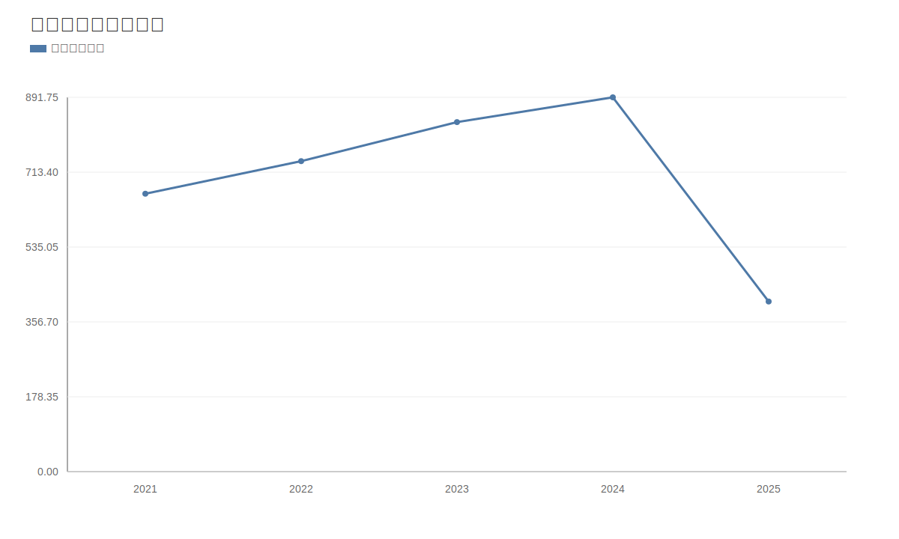

### 2. 净利润趋势图
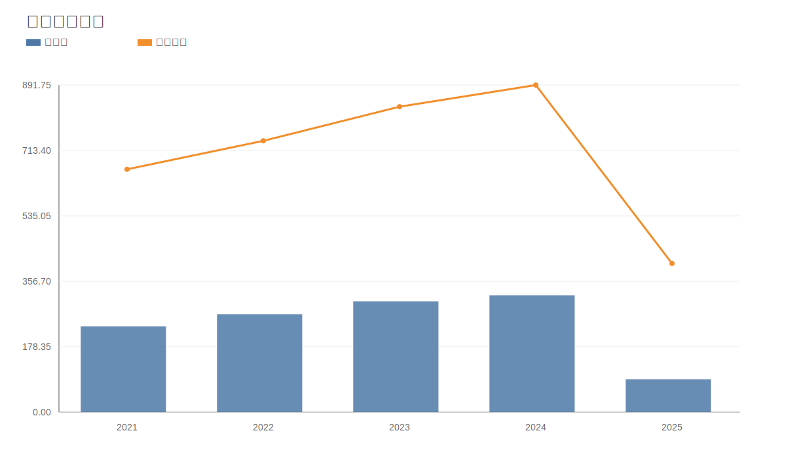

### 3. 毛利率和净利率对比图
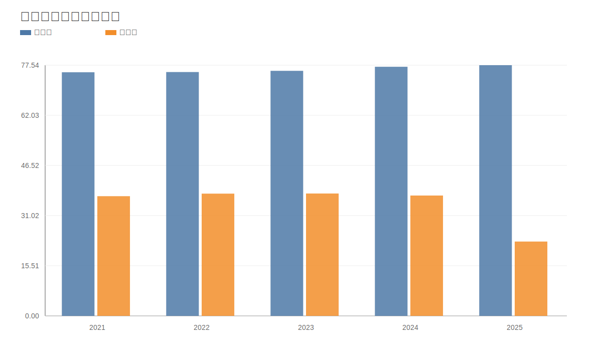

### 4. 分产品收入结构图
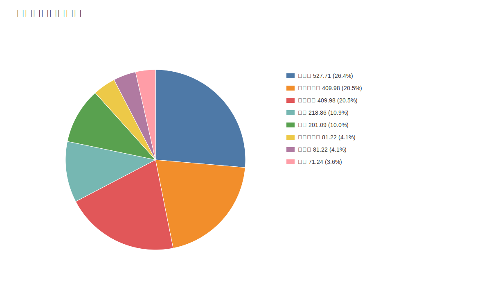

### 4. 分产品收入变化图
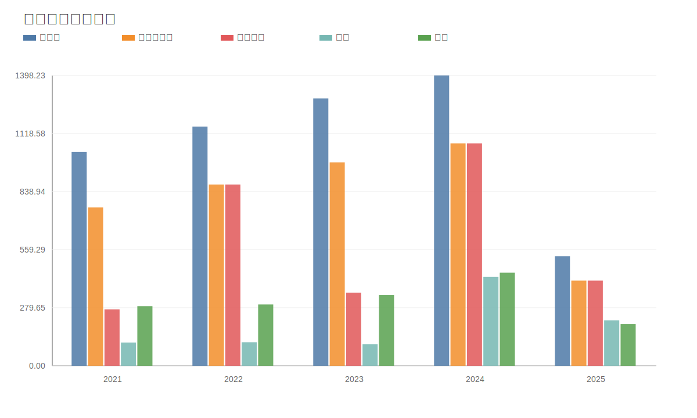

### 5. 分产品利润结构图
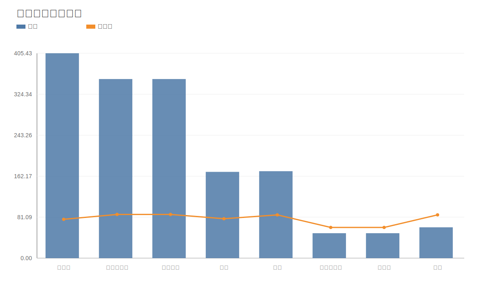

### 6. 分地区收入分布图


### 7. 资产负债表关键数据图
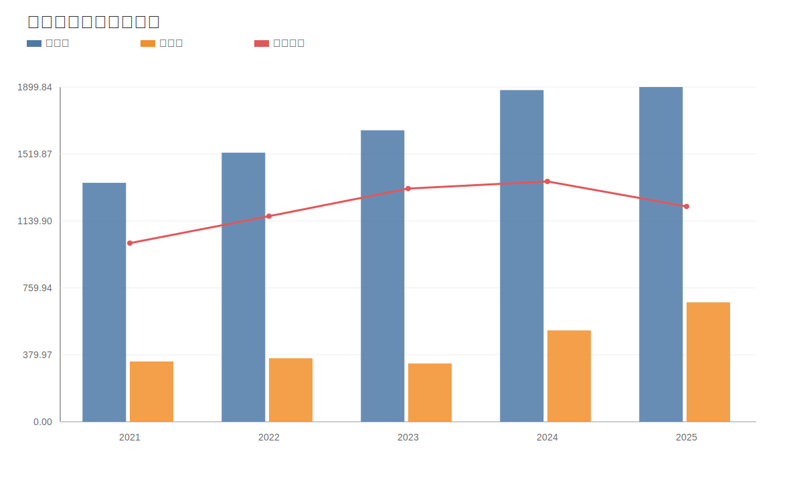

### 8. 自由现金流与经营现金流对比图
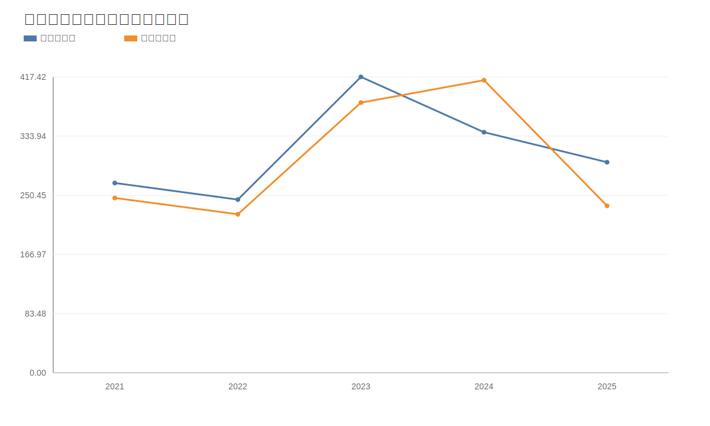

### 9. 股东回报分析图
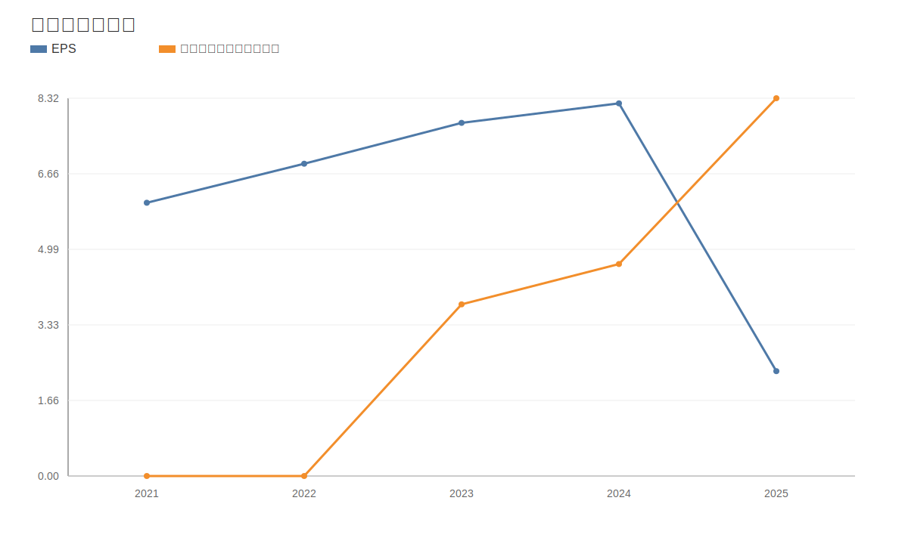

### 10. 财务比率分析图
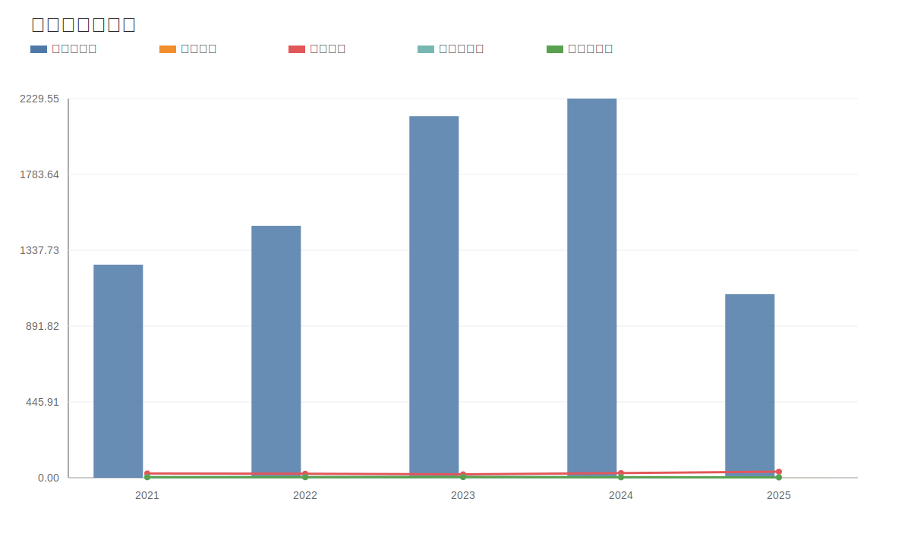

### 11. ROE与ROA对比图
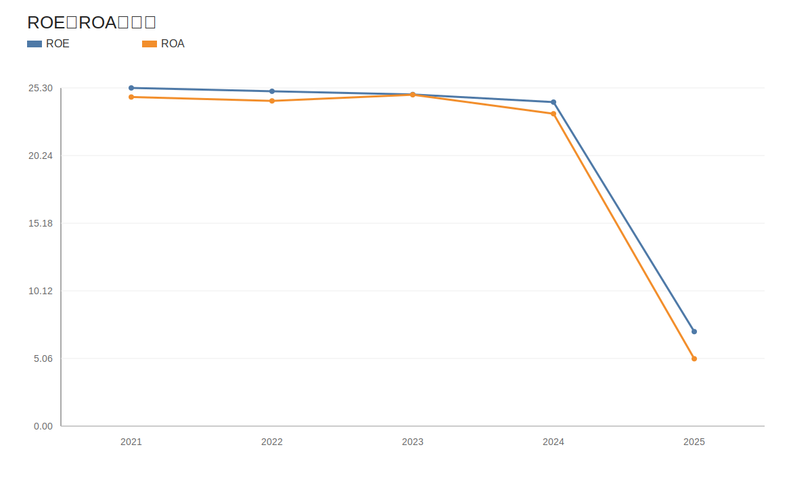
<!-- VALUE_CHARTS_END -->
