# 大族激光（002008）深度价值研究报告

- 研究对象：大族激光（002008.SZ）
- 报告时间：2026年5月24日
- 数据区间：2021-2025年年报，补充2026年一季报
- 最新估值基准日：2026年5月13日（收盘价148.13元）

## 1. 公司概况

大族激光是国内激光装备龙头之一，核心收入来自激光加工设备及自动化配套装备，商业模式是“设备销售 + 解决方案集成 + 存量客户迭代升级”。其收入受制造业资本开支周期、下游电子与泛工业景气影响明显，订单结构决定利润弹性。公司客户类型以ToB工业客户为主，收入可持续性取决于下游扩产与技术升级频率。

结论：公司是典型高端装备制造企业，具备技术与规模优势，但周期属性较强。  
事实：2025年营收187.59亿元，净利润11.90亿元；主营产品包括激光标记、焊接、数控及自动化设备。  
推断：若制造业进入新一轮设备更新周期，公司有望受益于订单放量与结构优化。

## 2. 行业与竞争格局

激光装备行业长期受益于制造业自动化、精密化和国产替代趋势，但短期波动与下游电子、汽车、锂电、PCB等行业投资节奏高度相关。竞争格局呈“头部集中 + 细分赛道分化”，国际厂商在高端激光器件和部分超精密场景仍具优势，国内龙头通过系统集成、服务网络和成本效率追赶。

结论：行业处于“成熟扩散 + 结构升级”阶段，公司仍在国产替代主线中。  
事实：公司2021-2025营收CAGR约3.52%，净利CAGR约-12.12%，显示行业竞争和需求波动对利润侵蚀明显。  
推断：未来3-5年增速更依赖高附加值产品占比提升，而非单纯规模扩张。

## 3. 护城河分析（含真伪辨别）

公司护城河主要来自工艺know-how沉淀、行业客户覆盖、交付与服务体系、以及国产化成本优势。其护城河是“技术迭代 + 工程化能力”复合型，不是单一品牌溢价。真伪辨别上，若在成熟标准化设备线提价5%，客户流失风险较高；但在定制化与产线绑定较深场景，替代难度和切换成本显著上升。

结论：护城河强度为“中偏强”，但分业务线差异大。  
事实：公司毛利率由2021年的37.55%下降至2025年的33.28%，说明竞争与产品结构变化仍在挤压盈利。  
推断：若高端应用与核心部件自研比例持续提升，护城河可由“工程化优势”向“技术平台优势”演进。

## 4. 管理层与资本配置

管理层稳定，董事长与总经理均为高云峰，经营战略连续性较好。公司保持连续分红，审计意见连续为标准无保留，治理透明度基础较稳。资本配置重点应关注研发投入效率、固定资产扩张回报与海外/新业务拓展的资本纪律。

结论：管理层总体偏“中性到价值创造者”。  
事实：2021-2025持续现金分红（每股0.20-0.40元区间），2020-2024审计均为标准无保留意见。  
推断：若未来通过更克制的资本开支换取更高ROIC，股东回报质量将明显改善。

## 5. 财务分析（成长/盈利/健康/现金流）

### 5.1 成长性
2021-2025营收整体低速波动，2025年同比+27.00%反弹明显，但净利同比-29.77%，反映“增收不增利”压力。

### 5.2 盈利能力
毛利率处于30%+区间但较历史下滑，净利率从2021年的12.74%降至2025年的7.03%；ROE从18.67%下滑至7.12%，盈利效率显著弱化。

### 5.3 财务健康
2026Q1资产负债率43.69%，流动比率1.91，净现金75.93亿元，偿债安全边际尚可。

### 5.4 现金流质量
历史经营现金流多数年份为正，但2026Q1经营现金流为-7.16亿元，经营现金流/利润为-154.53%，短期存在回款与营运资本压力信号。

结论：财务质量“中等偏稳”，但盈利能力和现金流质量阶段性承压。  
事实：2025年收入反弹但利润下滑，2026Q1利润高增长同时现金流为负。  
推断：若后续回款修复不及预期，利润兑现质量会被进一步质疑。

## 6. 成长驱动

未来3-5年主要驱动包括：  
1. 制造业设备更新与产线自动化升级。  
2. 下游新能源、消费电子、PCB等景气修复。  
3. 高端精密加工与海外市场拓展。  
4. 产品结构向高毛利场景迁移。

结论：成长逻辑成立，但验证点在“订单质量与利润率修复”。  
事实：2025年营收已出现恢复性增长。  
推断：若公司无法同步改善毛利率与ROIC，则收入增长对估值支撑有限。

## 7. 风险分析（含幸存者偏差）

主要风险：  
1. 宏观与制造业资本开支波动风险。  
2. 行业竞争导致价格下压与毛利率下行。  
3. 技术迭代风险，若关键工艺升级慢于竞争对手可能失去份额。  
4. 应收与存货管理风险，景气下行期现金流压力放大。  
5. 海外经营与汇率波动风险。

幸存者偏差检验：在2022-2023低景气阶段，公司营收与利润明显承压但保持经营现金流为正、未出现财务失序，说明具备一定周期承压能力，但回报中枢下移风险同样真实存在。

结论：抗风险能力评估为“中”。  
事实：2022-2023净利润连续下滑，2024年短暂修复后2025年再次回落。  
推断：公司能活下来，但要恢复到历史高ROE状态需要更强的产品和成本改善。

## 8. 估值分析

截至2026年5月13日，公司PE(TTM)约110.50倍、PB约7.38倍、PS(TTM)约7.28倍，股息率约0.24%。在当前盈利质量与ROE水平下，该估值已隐含较高修复预期，对后续业绩兑现要求很高。

结论：估值判断为“偏高”，安全边际不足。  
事实：PE、PB均处于高位区间且股息率偏低。  
推断：若盈利修复不及预期，估值回撤压力较大。

## 9. 投资判断（多头/空头/跟踪指标）

多头逻辑：  
1. 行业龙头地位与工艺积累深厚。  
2. 制造业升级与国产替代仍是长期方向。  
3. 资产负债表相对健康，净现金为正。  
4. 2026Q1收入与利润同比高增长，景气修复初显。

空头逻辑：  
1. 高估值与低股息组合，容错率低。  
2. 利润率和ROE较历史中枢明显下行。  
3. 2026Q1经营现金流为负，利润含金量需验证。  
4. 行业竞争加剧，价格战与技术迭代压力并存。

核心跟踪指标（季度）：  
1. 新签订单与在手订单结构。  
2. 毛利率、净利率、ROE、ROIC修复幅度。  
3. 经营现金流与应收周转变化。  
4. 海外收入占比与高端产品占比。

结论：当前更像“景气交易标的”而非低估值价值标的。  
事实：基本面有恢复信号，但估值提前反映较多乐观预期。  
推断：更适合等待“业绩持续验证或估值回落”后的再配置。

## 10. 最终结论

大族激光是具备长期产业地位的优质制造龙头，但现阶段“盈利质量待验证 + 估值偏高”使得风险收益比不够均衡。长期投资价值存在，当前价格下不具备明显安全边际。

投资建议：观察。

结论：公司是好资产，但当前不是高性价比买点。  
事实：估值高、股息低、ROE中枢下行，同时现金流短期承压。  
推断：若盈利修复连续两个以上季度并伴随估值回落，投资吸引力会明显提升。

## 11. 总评分（100分）

- 商业模式（20%）：16/20
- 护城河（20%）：15/20
- 管理层与资本配置（15%）：11/15
- 财务质量（20%）：12/20
- 风险控制（15%）：10/15
- 估值性价比（10%）：4/10

最终总分：68/100

结论：综合评分对应“产业地位强、估值透支较多”的状态。  
事实：业务基本盘与治理尚可，但盈利中枢和估值匹配度不理想。  
推断：后续得分改善关键在ROE修复和估值回归二者至少满足其一。

## 12. 三个终极问题（必须回答）

1. 如果提价5%，客户会不会流失？  
在标准化竞争品类会流失，尤其价格敏感客户；在深度定制与产线绑定场景流失相对可控。

2. 公司赚的钱有没有被管理层浪费？  
目前没有明确证据表明系统性浪费。分红持续、审计稳定，但资本开支与研发转化效率仍需更强验证。

3. 在行业最差年份，公司是怎么活下来的？  
依靠龙头客户基础、正向经营现金流（历史多数年份）和相对稳健资产负债表，在低景气周期保持了经营连续性。

结论：三问总体为“可过关但不突出”。  
事实：公司具备穿越周期能力，但盈利波动和回报中枢下移已出现。  
推断：若不能重建利润率优势，长期估值中枢将下移。

<!-- VALUE_CHARTS_START -->
## 图表图片（自动生成）

### 1. 主营业务收入趋势图
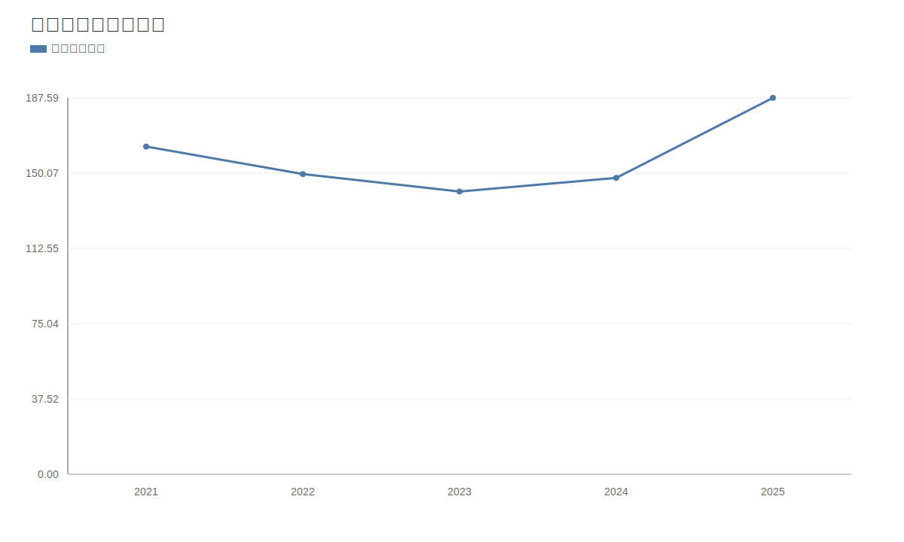

### 2. 净利润趋势图
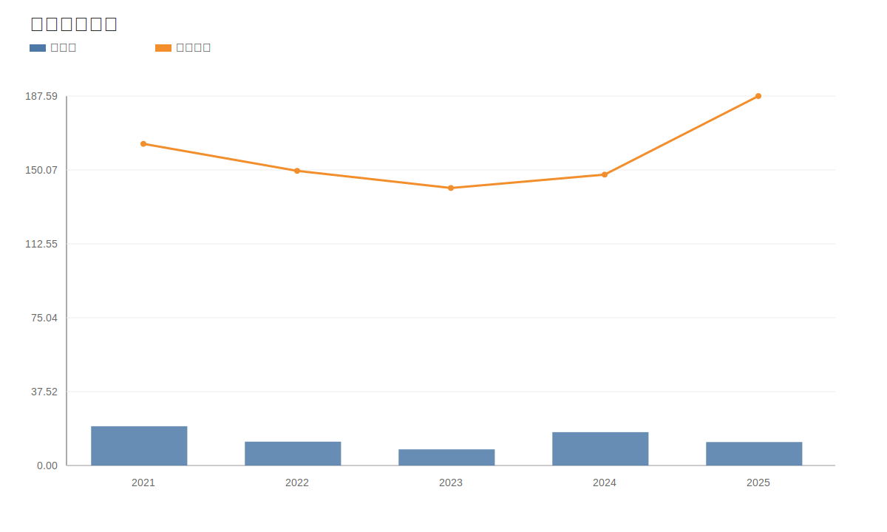

### 3. 毛利率和净利率对比图
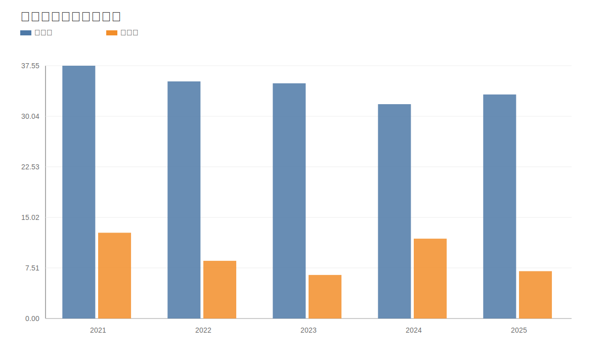

### 4. 分产品收入结构图
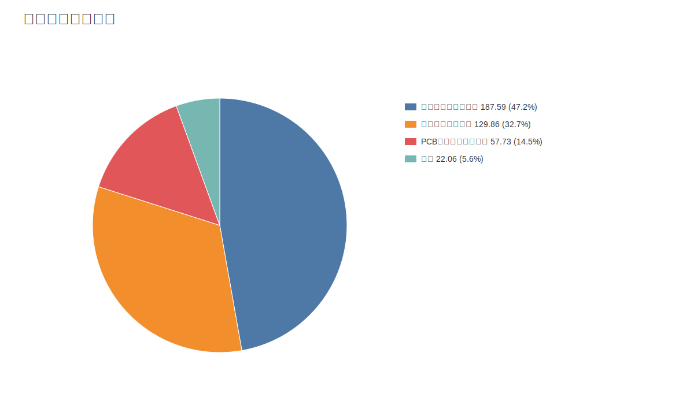

### 4. 分产品收入变化图
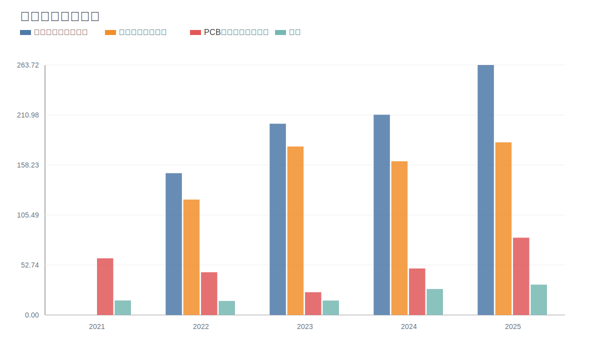

### 5. 分产品利润结构图
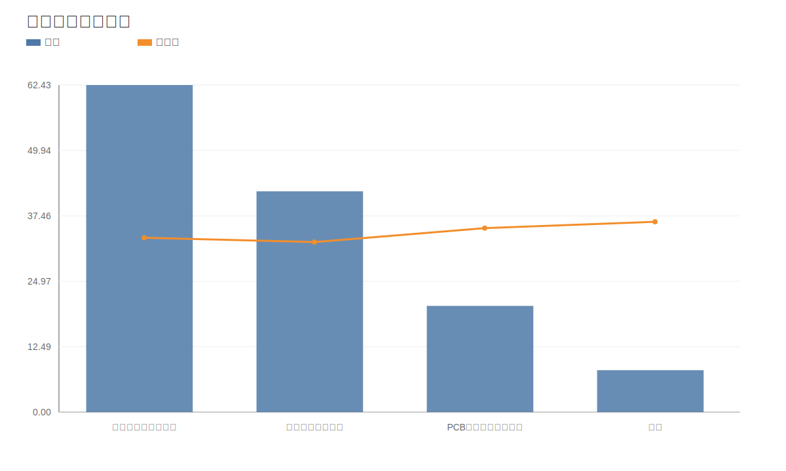

### 6. 分地区收入分布图
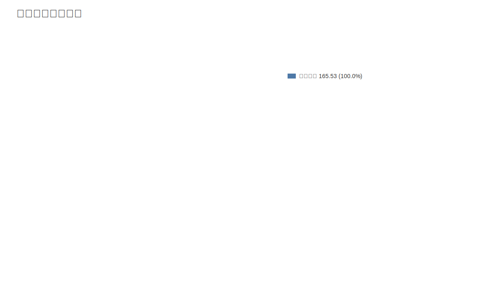

### 7. 资产负债表关键数据图
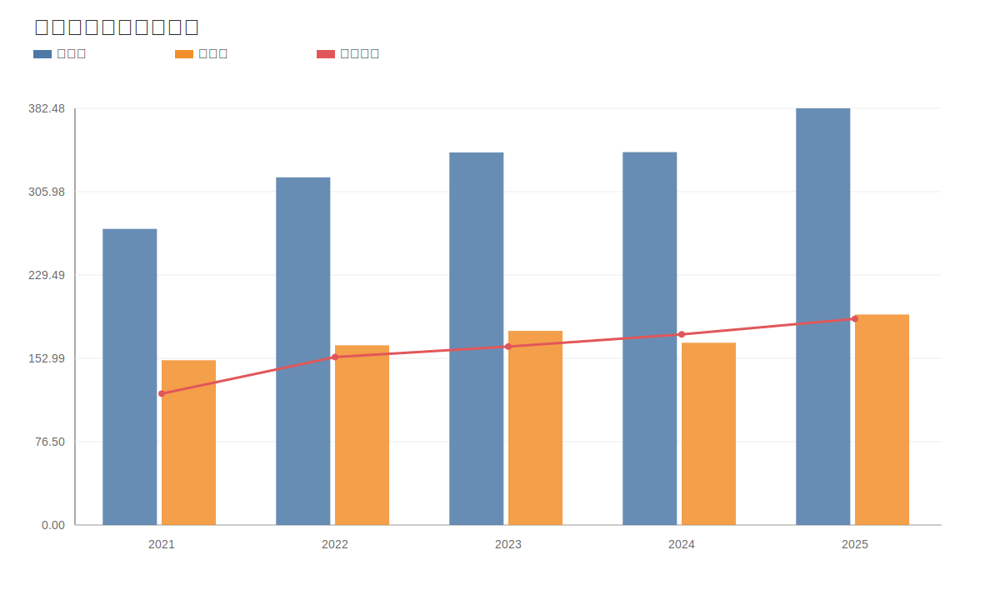

### 8. 自由现金流与经营现金流对比图
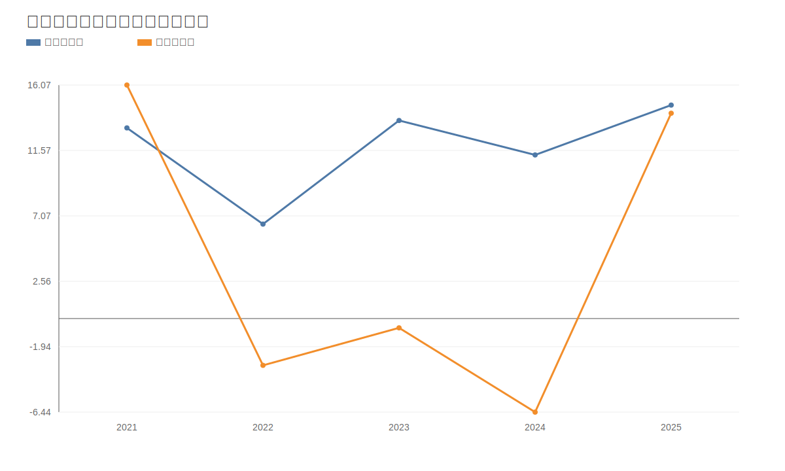

### 9. 股东回报分析图
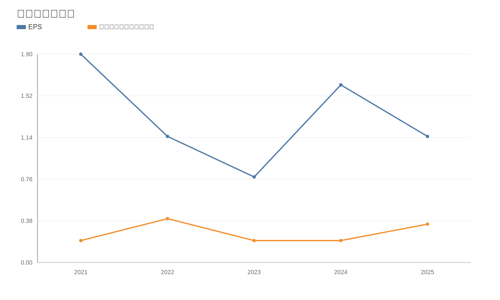

### 10. 财务比率分析图
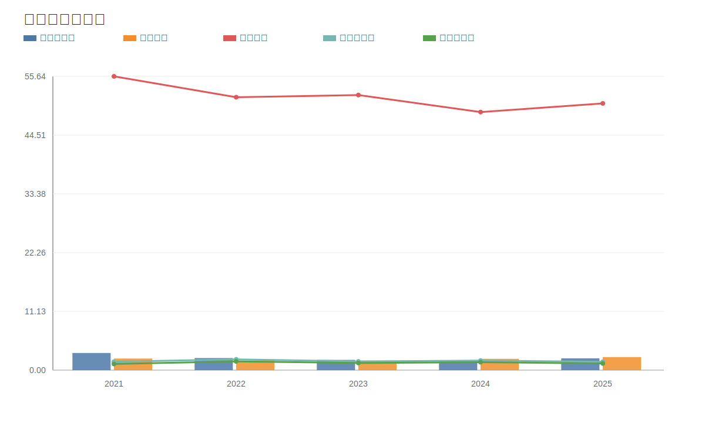

### 11. ROE与ROA对比图
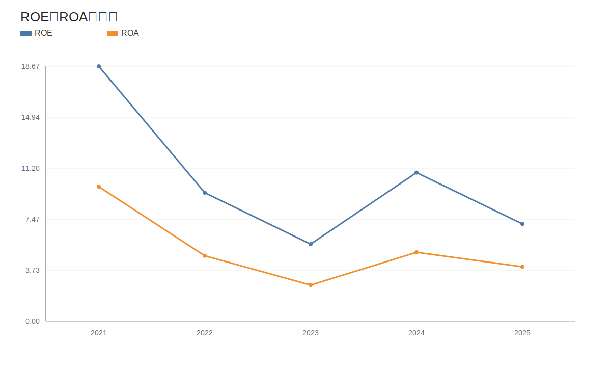
<!-- VALUE_CHARTS_END -->
