# 分众传媒（002027.SZ）深度价值研究报告

- 价格日期：2026-05-11
- 财报日期：2026-03-31
- 数据口径：本地数据库主口径，外部定性信息待公告逐项复核
- 当前价格/市值：6.11元 / 882.42亿元

## 1. 公司概况
事实：公司属于广告包装，2025年收入127.59亿、归母净利润29.46亿。业务结构：2025年楼宇媒体收入120.34亿；按客户行业看日用消费品60.36亿、互联网32.08亿；影院媒体6.39亿。
推断：公司质量判断不能只看单季度，应把2026Q1高景气与2021-2025完整周期放在一起看。
结论：事实：价格日2026-05-11，财报日2026-03-31；推断：分众传媒的核心判断来自主营结构、现金流和估值三者是否匹配。

## 2. 行业与竞争格局
事实：2026Q1收入29.15亿，同比2.01%；归母净利润17.90亿，同比57.65%。
推断：行业位置取决于能否把增长转化为稳定现金流，而不是单纯追逐收入增速。
结论：事实：短期增长数据强弱已经体现在估值中；推断：竞争格局仍需跟踪价格、份额和客户预算变化。

## 3. 护城河分析（含真伪辨别）
事实：强但周期性明显：电梯/楼宇媒体网络、点位规模和客户心智形成渠道壁垒，但广告预算随宏观和消费波动。
推断：护城河若不能体现为毛利率、复购、现金流或议价能力，就应按伪护城河处理。
结论：事实：毛利率68.74%、净利率61.21%；推断：护城河强度为强但周期性明显。

## 4. 管理层与资本配置
事实：江南春长期掌舵，分红积极，2025年税前每股0.38元；轻资产模式现金流强。
推断：资本配置评价重点是分红/回购、研发/扩产回报和现金消耗，而非管理层叙事。
结论：事实：净现金36.50亿；推断：管理层暂列中性偏正面。

## 5. 财务分析（成长/盈利/健康/现金流）
事实：近五年营收CAGR -3.70%，净利CAGR -16.51%；2026Q1经营现金流21.39亿，ROE 12.05%，ROIC 9.95%，资产负债率25.30%。
推断：现金流/利润匹配度比会计利润更重要，尤其在高估值或周期性行业。
结论：事实：货币资金38.71亿、净现金36.50亿；推断：财务质量为高。

## 6. 成长驱动
事实：楼宇媒体仍是稀缺线下触达网络，现金流和分红能力强，2026Q1利润弹性好。
推断：成长驱动需要拆成放量、提价、新品、授权或周期修复，不能把一次性改善线性外推。
结论：事实：2026Q1营收同比2.01%；推断：未来3-5年最重要的验证点是增长是否继续转化为自由现金流。

## 7. 风险分析（含幸存者偏差）
事实：收入增长慢，2025年净利同比下滑，广告预算复苏不确定；若互联网/消费品客户预算收缩，经营杠杆反向放大。
推断：幸存者偏差检验要看行业最差年份仍能否盈利、正现金流、低杠杆生存。
结论：事实：资产负债率25.30%；推断：抗风险能力为强。

## 8. 估值分析
事实：PE(TTM)24.51倍，PB 5.71倍，PS(TTM)6.89倍，股息率6.22%。DCF合理市值约730-950亿元；反向DCF显示当前约882亿元市值隐含未来FCF维持45-55亿元区间并保持较高分红率。
推断：安全边际取决于当前价格是否明显低于DCF下沿，且反向DCF假设是否保守。
结论：事实：当前市值882.42亿元；推断：估值性价比为合理偏上。

## 9. 投资判断（多头/空头/跟踪指标）
事实：多头逻辑：楼宇媒体仍是稀缺线下触达网络，现金流和分红能力强，2026Q1利润弹性好。 空头逻辑：收入增长慢，2025年净利同比下滑，广告预算复苏不确定；若互联网/消费品客户预算收缩，经营杠杆反向放大。
推断：跟踪指标包括收入增速、毛利率、经营现金流、应收/库存、核心业务份额、分红或研发兑现。
结论：事实：2026Q1净利同比57.65%；推断：当前更适合列入跟踪池，而非无条件买入。

## 10. 最终结论
事实：公司在各自行业具备可识别的核心资产，但估值与成长持续性要求不同。
推断：好公司不等于好价格；短期利润高增长需要用后续季度验证。
结论：事实：价格日2026-05-11；推断：投资建议为【观察】。

## 11. 总评分（100分）
事实：商业模式20分、护城河20分、管理层与资本配置15分、财务质量20分、风险控制10分、估值性价比15分。
推断：综合得分 78/100。分项估算：商业模式15/20，护城河15/20，管理层11/15，财务质量15/20，风险控制7/10，估值性价比11/15。
结论：事实：评分是研究框架输出，不是交易指令；推断：78分对应【观察】。

## 12. 三个终极问题
事实：如果提价5%：核心点位对品牌广告有稀缺性，提价5%在旺周期可部分传导，弱周期会流失预算。 公司赚的钱是否被浪费：分红回报较明确，轻资产现金流未见明显浪费；需约束低效扩张和并购。 行业最差年份如何活下来：2022广告低谷仍保持正利润和强经营现金流，靠点位网络、低负债和现金回款活下来。
推断：三问的答案决定公司是否值得长期持有，而估值决定是否值得现在买。
结论：事实：三问均存在可跟踪指标；推断：当前结论为【观察】。

<!-- VALUE_CHARTS_START -->
## 图表图片（自动生成）

### 1. 主营业务收入趋势图
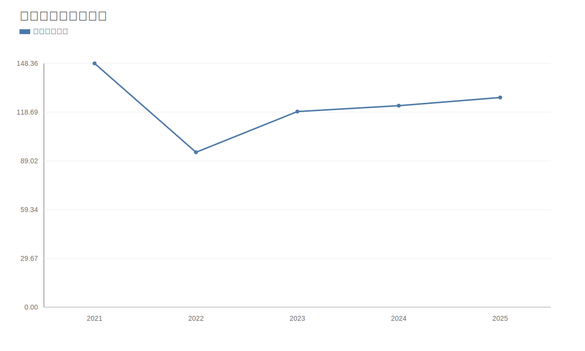

### 2. 净利润趋势图
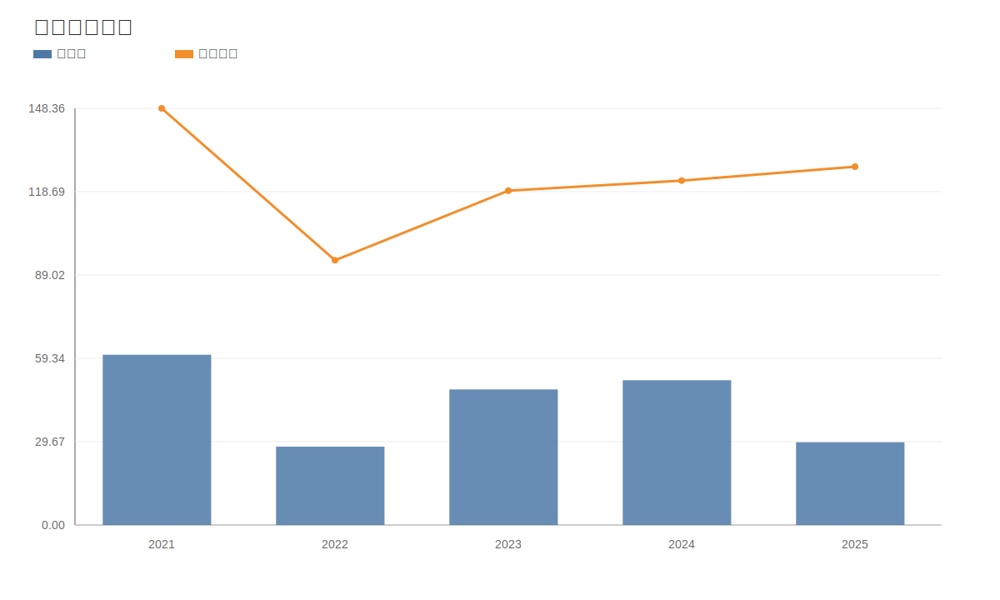

### 3. 毛利率和净利率对比图
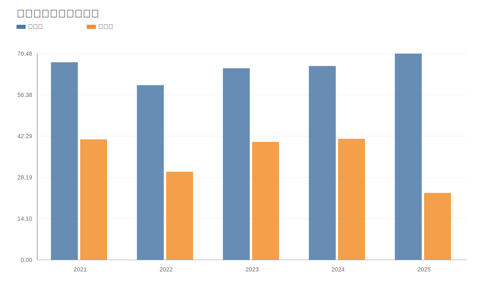

### 4. 分产品收入结构图
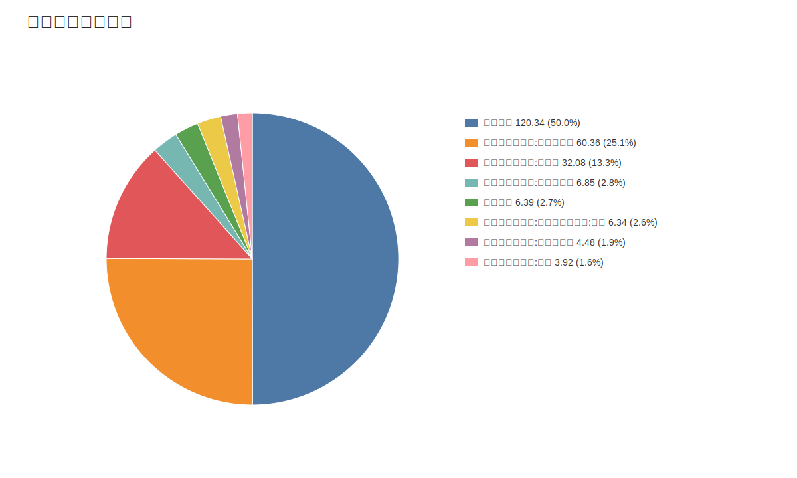

### 4. 分产品收入变化图
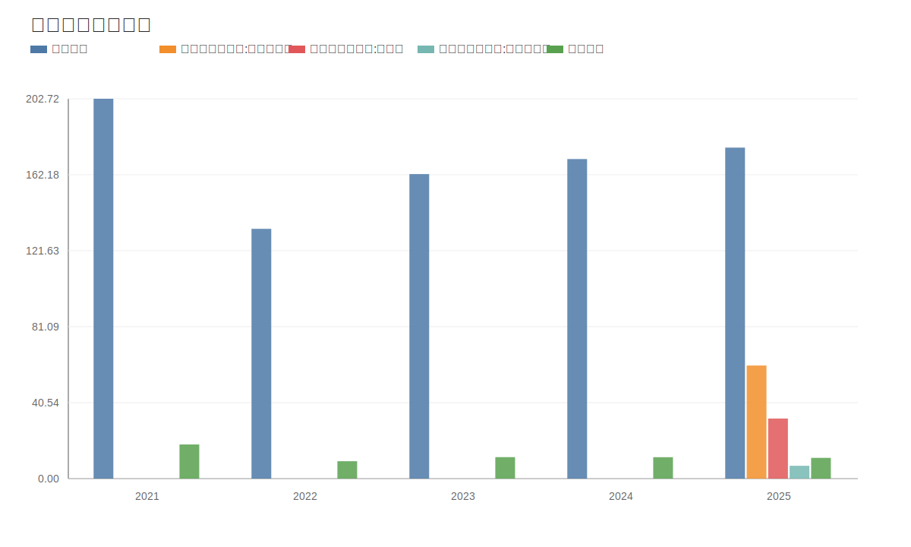

### 5. 分产品利润结构图
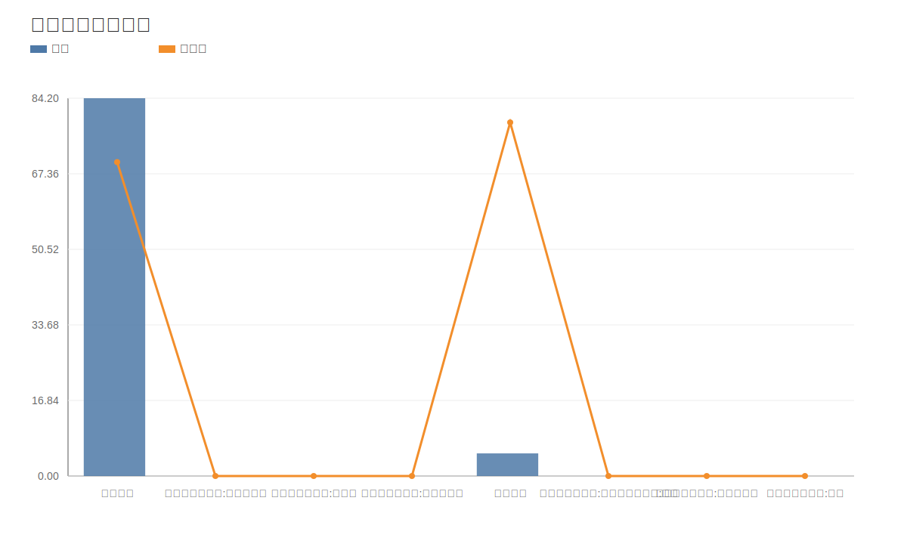

### 6. 分地区收入分布图
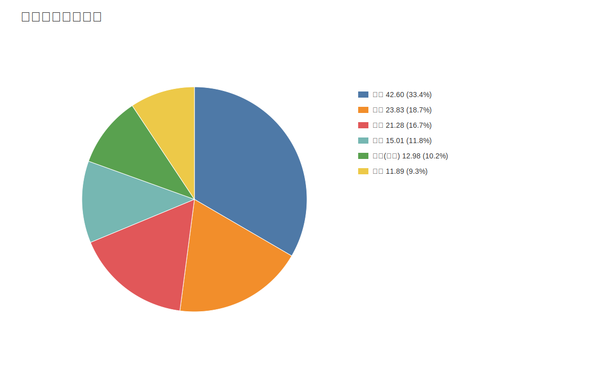

### 7. 资产负债表关键数据图
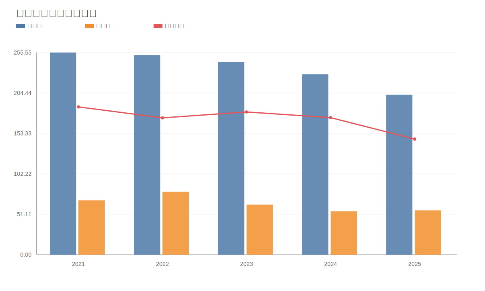

### 8. 自由现金流与经营现金流对比图
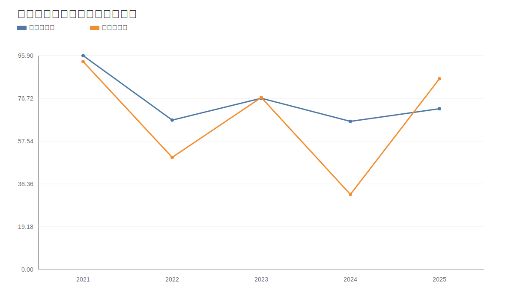

### 9. 股东回报分析图
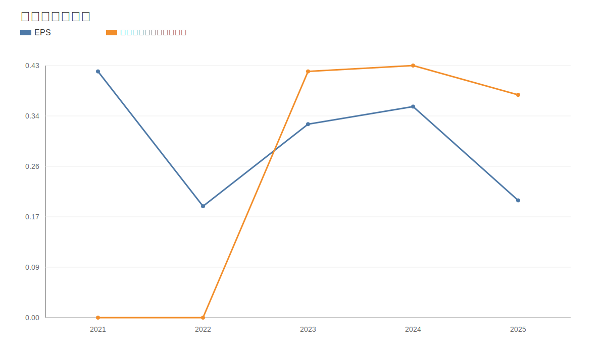

### 10. 财务比率分析图
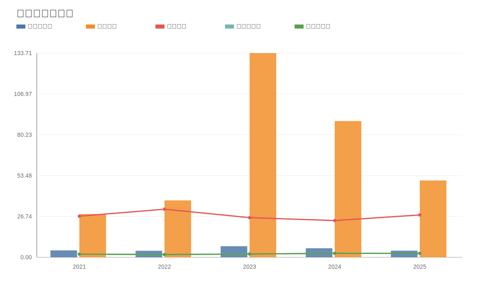

### 11. ROE与ROA对比图
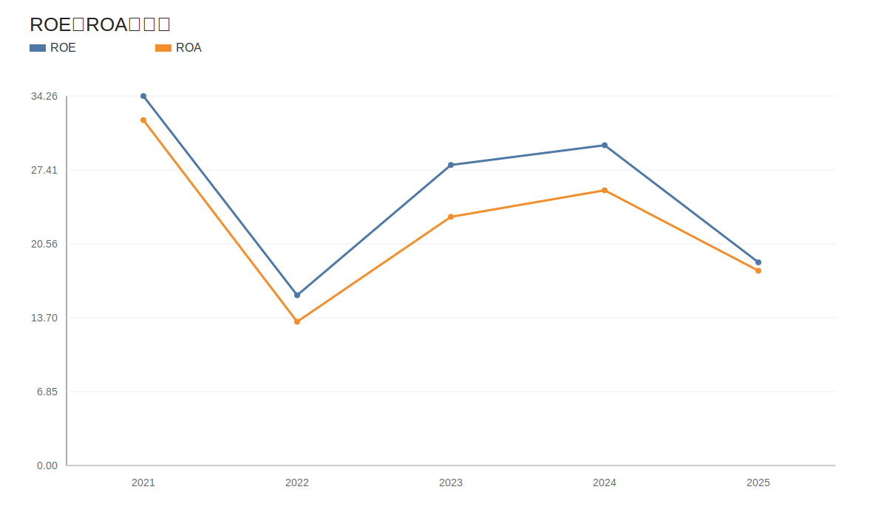
<!-- VALUE_CHARTS_END -->

免责声明：本分析仅供教育和研究用途，不构成投资建议。
