# 洋河股份（002304.SZ）价值分析报告草稿

- 生成时间：2026-05-13 01:35:59
- 自动化脚本：`.agents/skills/value-report/value_report_scaffold.py`
- 数据口径：数据库字段定义以 `app/models/models.py` 为准
- 公司信息：行业 白酒｜地区 江苏｜上市日期 20091106
- 管理层：董事长 顾宇｜总经理 顾宇｜员工 21532
- 主营业务：主营业务:洋河蓝色经典,洋河大曲,敦煌古酿等系列品牌浓香型白酒的生产,加工和销售
- 提示：本文件已自动填充定量部分，定性模块请结合最新公告与行业资料补充。

## 自动填充数据（可直接引用）
### 最新估值
- 交易日：20260511
- 收盘价：48.29 元
- PE(TTM)：71.64 倍
- PB：1.48 倍
- PS(TTM)：4.45 倍
- 股息率(TTM)：4.80%
- 总市值：727.46 亿元

### 最新财务快照
- 报告期：20260331
- 营收：81.86亿（同比 -26.03%）
- 归母净利润：24.47亿（同比 -32.73%）
- 经营现金流：19.39亿（同比 -23.54%）
- 自由现金流：13.75亿
- 毛利率：75.42%，净利率：29.85%
- ROE：5.09%，ROIC：5.02%
- 资产负债率：18.17%，流动比率：4.22
- 经营现金流/利润：58.96%
- 货币资金：129.54亿，有息负债：1.31亿，净现金：128.23亿

### 近五年年报趋势
| 年度 | 营收 | 营收同比 | 归母净利 | 净利同比 | 毛利率 | 净利率 | ROE | ROIC | 资产负债率 | 经营现金流 | 自由现金流 | 现净比 |
| --- | --- | --- | --- | --- | --- | --- | --- | --- | --- | --- | --- | --- |
| 2025 | 192.11亿 | -33.47% | 22.06亿 | -66.94% | 71.60% | 11.40% | 4.48% | 4.06% | 19.97% | -7.63亿 | -16.75亿 | -34.59% |
| 2024 | 288.76亿 | -12.83% | 66.73亿 | -33.37% | 73.16% | 23.09% | 12.89% | 11.97% | 23.24% | 46.29亿 | 24.18亿 | 69.36% |
| 2023 | 331.26亿 | 10.04% | 100.16亿 | 6.80% | 75.25% | 30.25% | 20.15% | 18.95% | 25.42% | 61.30亿 | 44.40亿 | 61.20% |
| 2022 | 301.05亿 | 18.76% | 93.78亿 | 24.91% | 74.60% | 31.19% | 20.85% | 19.78% | 30.07% | 36.48亿 | 59.15亿 | 38.90% |
| 2021 | 253.50亿 | N/A | 75.08亿 | N/A | 75.32% | 29.64% | 18.54% | 17.75% | 37.34% | 153.18亿 | 187.06亿 | 204.03% |

- 近五年营收CAGR：-6.70%
- 近五年净利CAGR：-26.37%

### 分红与审计
#### 已实施分红
2025年已实施现金分红（税前）合计：每股 4.647 元
2024年已实施现金分红（税前）合计：每股 4.660 元
2023年已实施现金分红（税前）合计：每股 3.740 元
2022年已实施现金分红（税前）合计：每股 3.000 元

#### 审计意见
- 20241231：标准无保留意见（中喜会计师事务所）
- 20231231：标准无保留意见（苏亚金诚会计师事务所）
- 20221231：标准无保留意见（苏亚金诚会计师事务所）
- 20211231：标准无保留意见（苏亚金诚会计师事务所）
- 20201231：标准无保留意见（苏亚金诚会计师事务所）

## ECharts 图表数据（option）

- 说明：以下 `option` 可直接用于前端图表渲染；单位已在坐标轴标注。

### 1. 主营业务收入趋势图
```json
{
  "title": {
    "text": "主营业务收入趋势（近5年）"
  },
  "tooltip": {
    "trigger": "axis"
  },
  "legend": {
    "top": 24,
    "data": [
      "主营业务收入"
    ]
  },
  "xAxis": {
    "type": "category",
    "data": [
      "2021",
      "2022",
      "2023",
      "2024",
      "2025"
    ]
  },
  "yAxis": {
    "type": "value",
    "name": "亿元"
  },
  "series": [
    {
      "name": "主营业务收入",
      "type": "line",
      "smooth": true,
      "data": [
        253.5,
        301.05,
        331.26,
        288.76,
        192.11
      ]
    }
  ]
}
```

### 2. 净利润趋势图
```json
{
  "title": {
    "text": "净利润趋势（近5年）"
  },
  "tooltip": {
    "trigger": "axis"
  },
  "legend": {
    "top": 24,
    "data": [
      "净利润",
      "营业收入"
    ]
  },
  "xAxis": {
    "type": "category",
    "data": [
      "2021",
      "2022",
      "2023",
      "2024",
      "2025"
    ]
  },
  "yAxis": [
    {
      "type": "value",
      "name": "亿元"
    },
    {
      "type": "value",
      "name": "亿元"
    }
  ],
  "series": [
    {
      "name": "净利润",
      "type": "bar",
      "data": [
        75.08,
        93.78,
        100.16,
        66.73,
        22.06
      ]
    },
    {
      "name": "营业收入",
      "type": "line",
      "yAxisIndex": 1,
      "data": [
        253.5,
        301.05,
        331.26,
        288.76,
        192.11
      ]
    }
  ]
}
```

### 3. 毛利率和净利率对比图
```json
{
  "title": {
    "text": "毛利率 vs 净利率"
  },
  "tooltip": {
    "trigger": "axis"
  },
  "legend": {
    "top": 24,
    "data": [
      "毛利率",
      "净利率"
    ]
  },
  "xAxis": {
    "type": "category",
    "data": [
      "2021",
      "2022",
      "2023",
      "2024",
      "2025"
    ]
  },
  "yAxis": {
    "type": "value",
    "name": "%"
  },
  "series": [
    {
      "name": "毛利率",
      "type": "bar",
      "data": [
        75.32,
        74.6,
        75.25,
        73.16,
        71.6
      ]
    },
    {
      "name": "净利率",
      "type": "bar",
      "data": [
        29.64,
        31.19,
        30.25,
        23.09,
        11.4
      ]
    }
  ]
}
```

### 4. 分产品收入结构图
```json
{
  "title": {
    "text": "分产品收入结构（20251231）"
  },
  "tooltip": {
    "trigger": "item"
  },
  "legend": {
    "type": "scroll",
    "top": 24
  },
  "series": [
    {
      "type": "pie",
      "radius": "55%",
      "data": [
        {
          "name": "酒类",
          "value": 187.76
        },
        {
          "name": "白酒",
          "value": 187.48
        },
        {
          "name": "省外",
          "value": 101.57
        },
        {
          "name": "省内",
          "value": 86.19
        },
        {
          "name": "其他业务",
          "value": 4.35
        },
        {
          "name": "其他业务(行业)",
          "value": 4.35
        },
        {
          "name": "红酒",
          "value": 0.28
        }
      ]
    }
  ]
}
```

### 4. 分产品收入变化图
```json
{
  "title": {
    "text": "分产品收入变化（近5年）"
  },
  "tooltip": {
    "trigger": "axis"
  },
  "legend": {
    "type": "scroll",
    "top": 24,
    "data": [
      "酒类",
      "白酒",
      "省外",
      "省内",
      "其他业务"
    ]
  },
  "xAxis": {
    "type": "category",
    "data": [
      "2021",
      "2022",
      "2023",
      "2024",
      "2025"
    ]
  },
  "yAxis": {
    "type": "value",
    "name": "亿元"
  },
  "series": [
    {
      "name": "酒类",
      "type": "bar",
      "stack": "total",
      "data": [
        397.93,
        480.17,
        539.46,
        507.4,
        332.89
      ]
    },
    {
      "name": "白酒",
      "type": "bar",
      "stack": "total",
      "data": [
        395.04,
        477.52,
        537.8,
        506.12,
        332.42
      ]
    },
    {
      "name": "省外",
      "type": "bar",
      "stack": "total",
      "data": [
        210.13,
        260.9,
        300.92,
        283.96,
        175.49
      ]
    },
    {
      "name": "省内",
      "type": "bar",
      "stack": "total",
      "data": [
        187.8,
        219.27,
        238.54,
        223.44,
        157.4
      ]
    },
    {
      "name": "其他业务",
      "type": "bar",
      "stack": "total",
      "data": [
        11.01,
        9.96,
        10.53,
        10.13,
        7.18
      ]
    }
  ]
}
```

### 5. 分产品利润结构图
```json
{
  "title": {
    "text": "分产品利润结构（20251231）"
  },
  "tooltip": {
    "trigger": "axis"
  },
  "legend": {
    "top": 24,
    "data": [
      "利润",
      "毛利率"
    ]
  },
  "xAxis": {
    "type": "category",
    "data": [
      "酒类",
      "白酒",
      "省外",
      "省内",
      "其他业务",
      "其他业务(行业)",
      "红酒"
    ]
  },
  "yAxis": [
    {
      "type": "value",
      "name": "亿元"
    },
    {
      "type": "value",
      "name": "%"
    }
  ],
  "series": [
    {
      "name": "利润",
      "type": "bar",
      "data": [
        136.53,
        136.43,
        72.85,
        63.67,
        1.03,
        1.03,
        0.1
      ]
    },
    {
      "name": "毛利率",
      "type": "line",
      "yAxisIndex": 1,
      "data": [
        72.71,
        72.77,
        71.73,
        73.88,
        23.66,
        23.66,
        34.7
      ]
    }
  ]
}
```

### 6. 分地区收入分布图
```json
{
  "title": {
    "text": "分地区收入分布（20251231）"
  },
  "tooltip": {
    "trigger": "item"
  },
  "legend": {
    "type": "scroll",
    "top": 24
  },
  "series": [
    {
      "type": "pie",
      "radius": "55%",
      "data": [
        {
          "name": "其他业务(地区)",
          "value": 4.35
        }
      ]
    }
  ]
}
```

### 7. 资产负债表关键数据图
```json
{
  "title": {
    "text": "资产负债表关键数据（近5年）"
  },
  "tooltip": {
    "trigger": "axis"
  },
  "legend": {
    "top": 24,
    "data": [
      "总资产",
      "总负债",
      "股东权益"
    ]
  },
  "xAxis": {
    "type": "category",
    "data": [
      "2021",
      "2022",
      "2023",
      "2024",
      "2025"
    ]
  },
  "yAxis": {
    "type": "value",
    "name": "亿元"
  },
  "series": [
    {
      "name": "总资产",
      "type": "bar",
      "stack": "capital",
      "data": [
        677.99,
        679.64,
        697.92,
        673.45,
        585.96
      ]
    },
    {
      "name": "总负债",
      "type": "bar",
      "stack": "capital",
      "data": [
        253.17,
        204.4,
        177.42,
        156.52,
        117.03
      ]
    },
    {
      "name": "股东权益",
      "type": "line",
      "data": [
        424.81,
        475.24,
        520.5,
        516.93,
        468.93
      ]
    }
  ]
}
```

### 8. 自由现金流与经营现金流对比图
```json
{
  "title": {
    "text": "自由现金流 vs 经营现金流"
  },
  "tooltip": {
    "trigger": "axis"
  },
  "legend": {
    "top": 24,
    "data": [
      "经营现金流",
      "自由现金流"
    ]
  },
  "xAxis": {
    "type": "category",
    "data": [
      "2021",
      "2022",
      "2023",
      "2024",
      "2025"
    ]
  },
  "yAxis": {
    "type": "value",
    "name": "亿元"
  },
  "series": [
    {
      "name": "经营现金流",
      "type": "line",
      "data": [
        153.18,
        36.48,
        61.3,
        46.29,
        -7.63
      ]
    },
    {
      "name": "自由现金流",
      "type": "line",
      "data": [
        187.06,
        59.15,
        44.4,
        24.18,
        -16.75
      ]
    }
  ]
}
```

### 9. 股东回报分析图
```json
{
  "title": {
    "text": "股东回报（EPS/分红）"
  },
  "tooltip": {
    "trigger": "axis"
  },
  "legend": {
    "top": 24,
    "data": [
      "EPS",
      "每股现金分红（已实施）"
    ]
  },
  "xAxis": {
    "type": "category",
    "data": [
      "2021",
      "2022",
      "2023",
      "2024",
      "2025"
    ]
  },
  "yAxis": {
    "type": "value",
    "name": "元"
  },
  "series": [
    {
      "name": "EPS",
      "type": "line",
      "data": [
        5.01,
        6.23,
        6.65,
        4.43,
        1.46
      ]
    },
    {
      "name": "每股现金分红（已实施）",
      "type": "line",
      "data": [
        0.0,
        3.0,
        3.74,
        4.66,
        4.647
      ]
    }
  ]
}
```

### 10. 财务比率分析图
```json
{
  "title": {
    "text": "关键财务比率（近5年）"
  },
  "tooltip": {
    "trigger": "axis"
  },
  "legend": {
    "type": "scroll",
    "top": 24,
    "data": [
      "资产负债率",
      "流动比率",
      "速动比率",
      "应收周转率",
      "存货周转率"
    ]
  },
  "xAxis": {
    "type": "category",
    "data": [
      "2021",
      "2022",
      "2023",
      "2024",
      "2025"
    ]
  },
  "yAxis": [
    {
      "type": "value",
      "name": "比率/%"
    },
    {
      "type": "value",
      "name": "周转率"
    }
  ],
  "series": [
    {
      "name": "资产负债率",
      "type": "line",
      "data": [
        37.34,
        30.07,
        25.42,
        23.24,
        19.97
      ]
    },
    {
      "name": "流动比率",
      "type": "line",
      "data": [
        2.01,
        2.58,
        3.06,
        3.3,
        3.77
      ]
    },
    {
      "name": "速动比率",
      "type": "line",
      "data": [
        1.33,
        1.7,
        1.96,
        2.0,
        1.96
      ]
    },
    {
      "name": "应收周转率",
      "type": "bar",
      "yAxisIndex": 1,
      "data": [
        9263.42,
        1297.88,
        1361.21,
        4611.47,
        2180.99
      ]
    },
    {
      "name": "存货周转率",
      "type": "bar",
      "yAxisIndex": 1,
      "data": [
        0.4,
        0.44,
        0.45,
        0.4,
        0.27
      ]
    }
  ]
}
```

### 11. ROE与ROA对比图
```json
{
  "title": {
    "text": "ROE vs ROA（近5年）"
  },
  "tooltip": {
    "trigger": "axis"
  },
  "legend": {
    "top": 24,
    "data": [
      "ROE",
      "ROA"
    ]
  },
  "xAxis": {
    "type": "category",
    "data": [
      "2021",
      "2022",
      "2023",
      "2024",
      "2025"
    ]
  },
  "yAxis": {
    "type": "value",
    "name": "%"
  },
  "series": [
    {
      "name": "ROE",
      "type": "line",
      "data": [
        18.54,
        20.85,
        20.15,
        12.89,
        4.48
      ]
    },
    {
      "name": "ROA",
      "type": "line",
      "data": [
        15.64,
        17.47,
        18.08,
        12.43,
        5.03
      ]
    }
  ]
}
```

## 1. 公司概况（商业模式优先）
- 公司是如何赚钱的？
- 收入来源构成（核心业务占比）
- 客户类型（To B / To C / 政府）
- 是否具备持续性收入（一次性 vs 订阅/复购）
- 是否依赖单一客户或区域

### 结论
- 商业模式是否简单、可理解
- 是否具备长期可持续性

## 2. 行业与竞争格局
- 行业空间（市场规模、天花板）
- 行业阶段（成长 / 成熟 / 衰退）
- 行业增速
- 主要竞争对手
- 市场份额与行业集中度
- 公司在产业链中的位置

### 结论
- 是否属于优质赛道
- 公司是否处于有利竞争位置
- 行业未来3-5年趋势

## 3. 护城河分析（含真伪辨别）
- 品牌优势
- 成本优势
- 网络效应
- 转换成本
- 技术壁垒
- 渠道优势

### 护城河真伪辨别
- 如果产品提价 5%，客户是否会流失？
- 客户是否对价格敏感？
- 是否存在“非它不可”的使用场景？
- 替代品是否容易出现？
- 客户更换供应商的成本高不高？

### 结论
- 护城河类型
- 护城河强度：强 / 中 / 弱 / 伪护城河
- 是否具备真实定价权

## 4. 管理层与资本配置（重点）
- 管理层背景与稳定性
- 是否存在诚信问题（造假 / 处罚 / 诉讼）
- 过往战略是否理性

### 资本配置历史
- 是否长期分红
- 是否进行回购注销（而非股权激励稀释）
- 并购历史（成功 / 失败 / 频繁）
- 是否存在盲目多元化扩张
- 资本开支是否合理

### 结论
- 管理层类型：价值创造者 / 中性 / 价值毁灭者
- 是否值得长期信任

## 5. 财务分析
### 5.1 成长性
- 营收增长率（近3-5年）
- 净利润增长率
- 增长是否稳定

### 结论
- 是否具备持续成长能力

### 5.2 盈利能力
- 毛利率
- 净利率
- ROE / ROIC

### 结论
- 是否具备定价权
- 盈利质量如何

### 5.3 财务健康
- 资产负债率
- 有息负债
- 现金储备
- 短期偿债能力

### 结论
- 是否存在财务风险

### 5.4 现金流质量
- 经营现金流
- 自由现金流
- 净利润与现金流是否匹配

### 结论
- 利润是否真实
- 是否具备造血能力

## 6. 成长驱动
- 未来3-5年增长来源
- 是否依赖提价 / 扩张 / 新业务
- 增长逻辑是否清晰

### 结论
- 成长是否可持续

## 7. 风险分析（含幸存者偏差）
- 政策风险
- 行业竞争风险
- 技术替代风险
- 财务风险
- 客户集中风险

### 幸存者偏差检验
- 行业历史最差时期是什么时候？
- 当时发生了什么（金融危机 / 疫情 / 监管）？
- 公司当时表现：是否大幅亏损 / 现金流断裂 / 接近破产？
- 公司在极端情况下是：变强 / 持平 / 衰退

### 结论
- 抗风险能力：强 / 中 / 弱
- 是否属于“穿越周期公司”

## 8. 估值分析
- PE / PB / PS / PEG / EV/EBITDA
- 当前估值 vs 历史估值
- 当前估值 vs 行业对比

### 结论
- 当前是否高估 / 低估 / 合理
- 是否具备安全边际

## 9. 投资判断
### 多头逻辑
1. 
2. 
3. 

### 空头逻辑
1. 
2. 
3. 

### 核心跟踪指标
1. 
2. 
3. 

## 最终结论
- 这是否是一家好公司？
- 是否具备长期投资价值？
- 当前价格是否值得买入？
- 投资建议：买入 / 观察 / 回避

## 总评分（100分）
- 商业模式：
- 护城河：
- 管理层：
- 财务：
- 风险：
- 估值：

**最终评分：__ / 100**

## 三个终极问题（必须回答）
1. 如果提价 5%，客户会不会流失？
2. 公司赚的钱有没有被管理层浪费？
3. 在行业最差年份，公司是怎么活下来的？

<!-- VALUE_CHARTS_START -->
## 图表图片（自动生成）

### 1. 主营业务收入趋势图
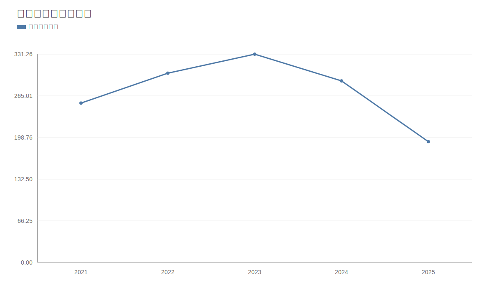

### 2. 净利润趋势图
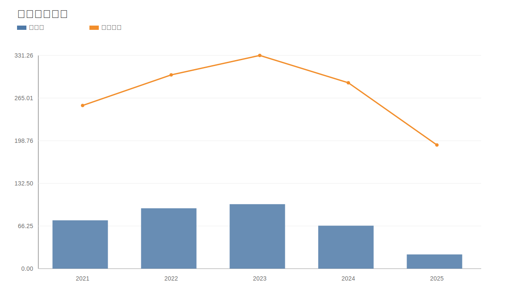

### 3. 毛利率和净利率对比图
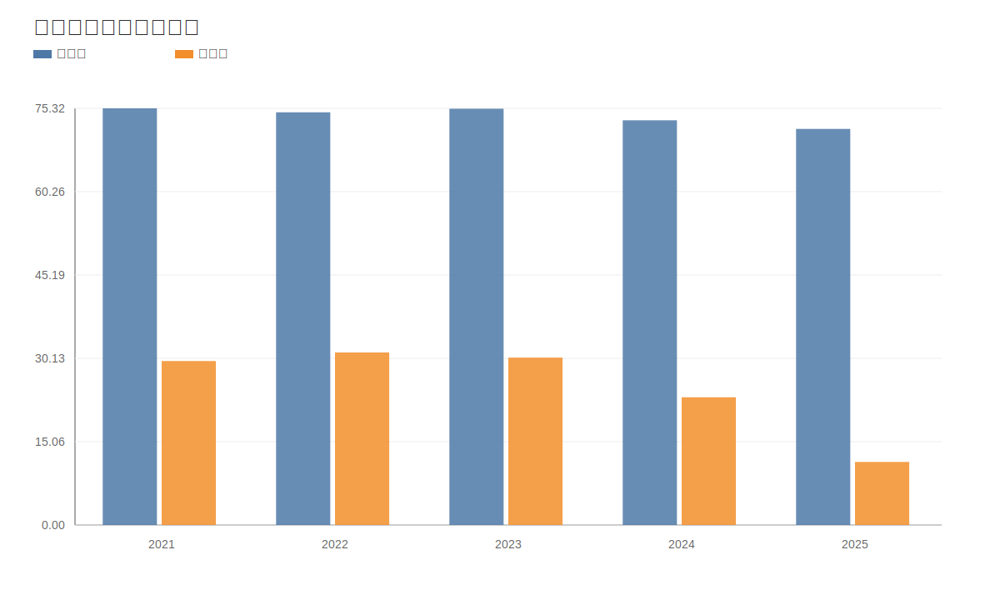

### 4. 分产品收入结构图
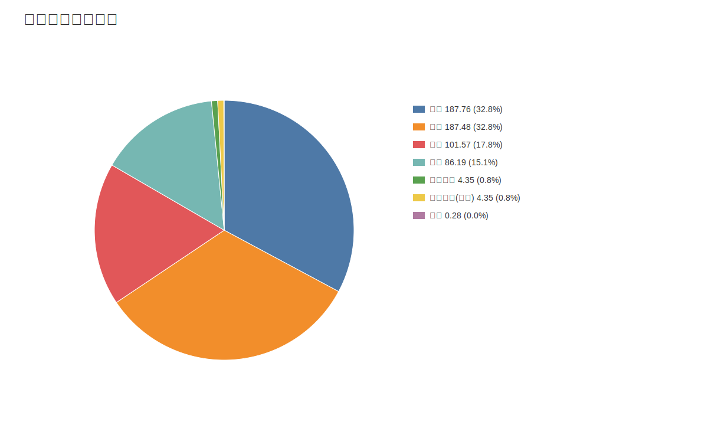

### 4. 分产品收入变化图
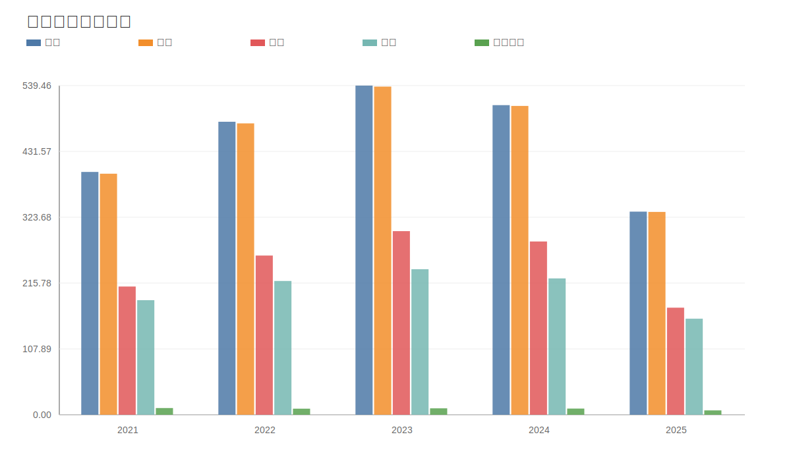

### 5. 分产品利润结构图
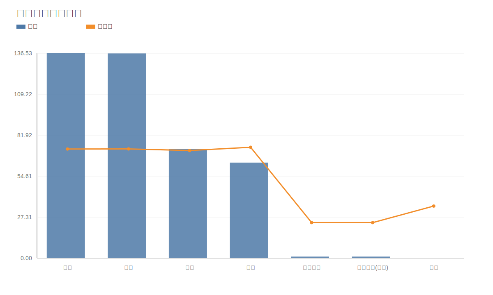

### 6. 分地区收入分布图
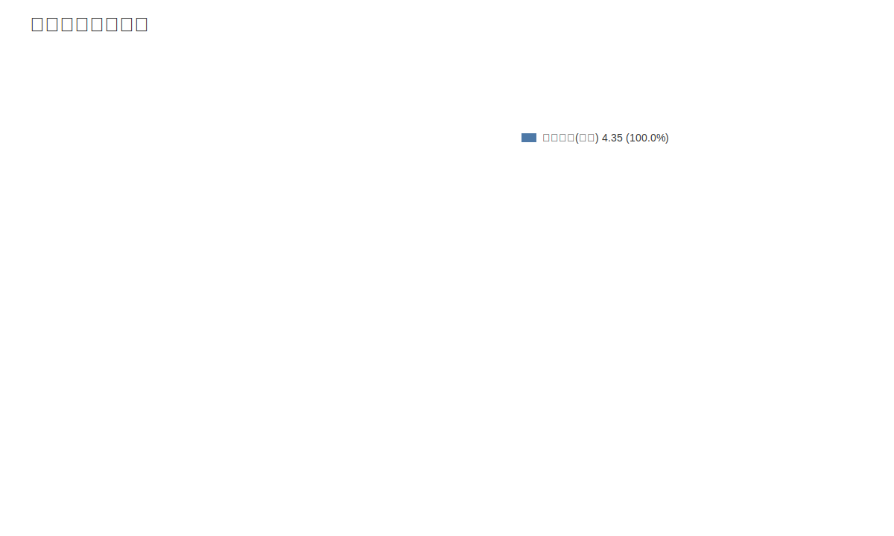

### 7. 资产负债表关键数据图
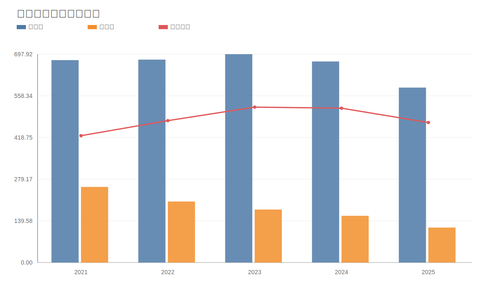

### 8. 自由现金流与经营现金流对比图
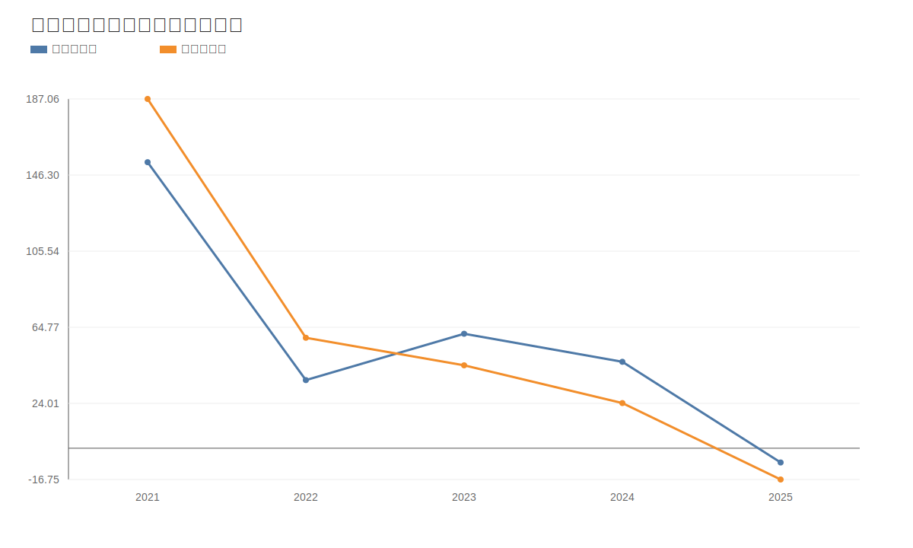

### 9. 股东回报分析图
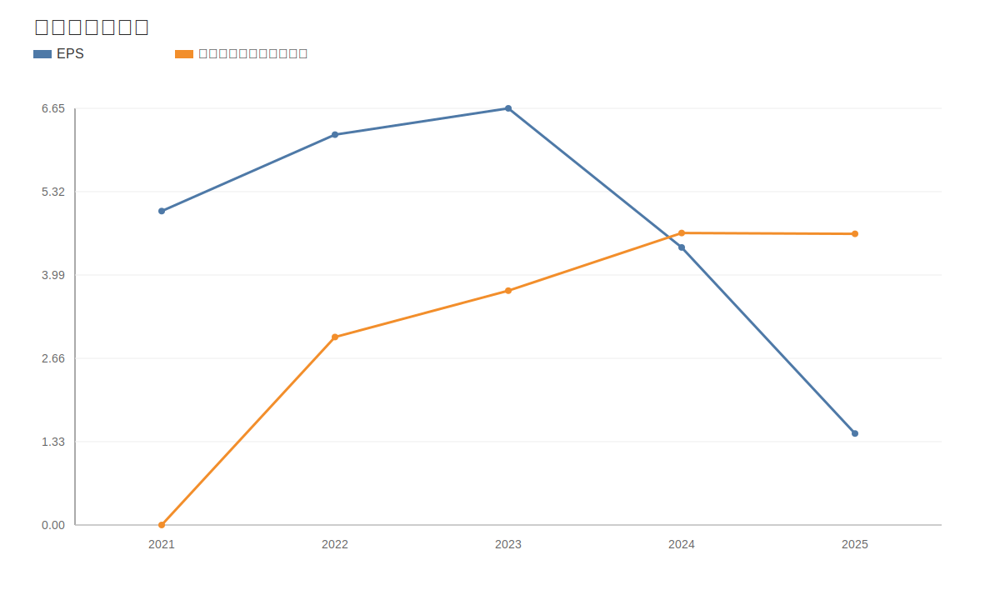

### 10. 财务比率分析图
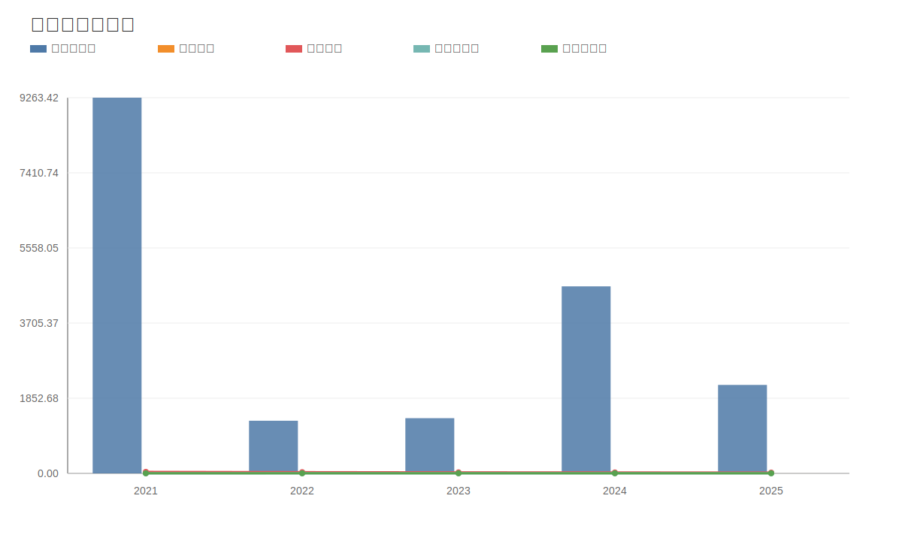

### 11. ROE与ROA对比图
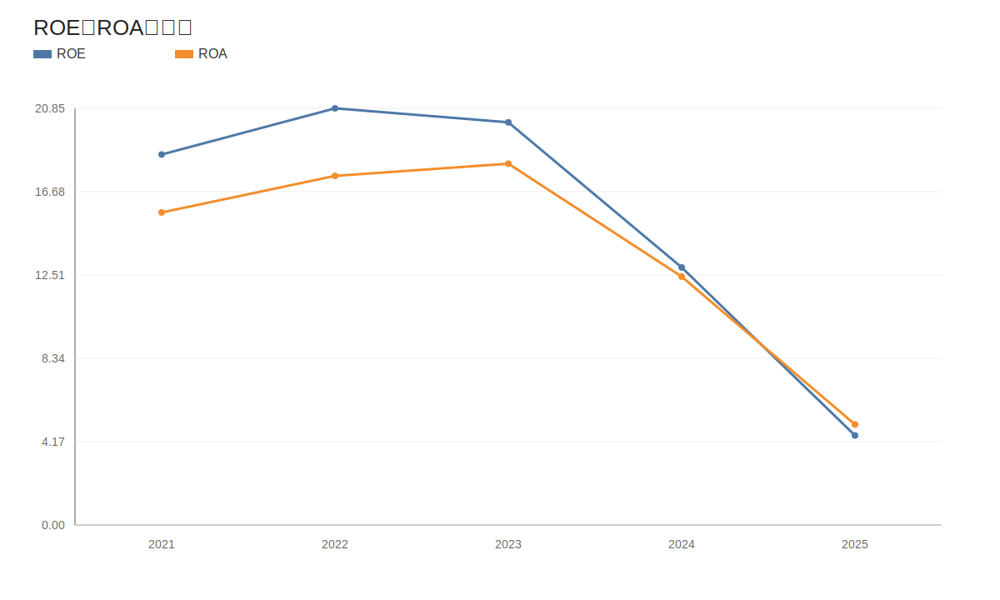
<!-- VALUE_CHARTS_END -->
