# 伟星新材（002372.SZ）价值分析报告草稿

- 生成时间：2026-05-13 01:35:40
- 自动化脚本：`.agents/skills/value-report/value_report_scaffold.py`
- 数据口径：数据库字段定义以 `app/models/models.py` 为准
- 公司信息：行业 其他建材｜地区 浙江｜上市日期 20100318
- 管理层：董事长 金红阳｜总经理 施国军｜员工 4594
- 主营业务：专业从事高质量,高附加值新型塑料管道的研发,生产和销售.主要产品为无规共聚聚丙烯(PPR)系列管材及管件,聚乙烯(PE)系列管材及管件,高密度聚乙烯(HDPE)双壁波纹管和聚丁烯(PB)管材管件等.
- 提示：本文件已自动填充定量部分，定性模块请结合最新公告与行业资料补充。

## 自动填充数据（可直接引用）
### 最新估值
- 交易日：20260511
- 收盘价：10.67 元
- PE(TTM)：22.75 倍
- PB：3.82 倍
- PS(TTM)：3.21 倍
- 股息率(TTM)：4.16%
- 总市值：169.87 亿元

### 最新财务快照
- 报告期：20260331
- 营收：8.13亿（同比 -9.20%）
- 归母净利润：1.19亿（同比 5.08%）
- 经营现金流：1.23亿（同比 45.22%）
- 自由现金流：0.04亿
- 毛利率：41.40%，净利率：14.74%
- ROE：2.42%，ROIC：2.37%
- 资产负债率：21.59%，流动比率：3.05
- 经营现金流/利润：110.81%
- 货币资金：16.06亿，有息负债：0.00亿，净现金：16.06亿

### 近五年年报趋势
| 年度 | 营收 | 营收同比 | 归母净利 | 净利同比 | 毛利率 | 净利率 | ROE | ROIC | 资产负债率 | 经营现金流 | 自由现金流 | 现净比 |
| --- | --- | --- | --- | --- | --- | --- | --- | --- | --- | --- | --- | --- |
| 2025 | 53.82亿 | -14.12% | 7.41亿 | -22.24% | 40.98% | 13.64% | 14.85% | 14.17% | 23.06% | 11.78亿 | 8.74亿 | 159.07% |
| 2024 | 62.67亿 | -1.75% | 9.53亿 | -33.49% | 41.72% | 15.32% | 17.83% | 16.67% | 21.07% | 11.47亿 | 7.50亿 | 120.44% |
| 2023 | 63.78亿 | -8.27% | 14.32亿 | 10.40% | 44.32% | 22.91% | 26.23% | 24.86% | 21.15% | 13.74亿 | 10.27亿 | 95.91% |
| 2022 | 69.54亿 | 8.86% | 12.97亿 | 6.06% | 39.76% | 18.85% | 25.36% | 24.17% | 21.45% | 15.31亿 | 12.44亿 | 117.98% |
| 2021 | 63.88亿 | N/A | 12.23亿 | N/A | 39.79% | 19.23% | 26.51% | 25.54% | 23.32% | 15.94亿 | 9.39亿 | 130.26% |

- 近五年营收CAGR：-4.19%
- 近五年净利CAGR：-11.79%

### 分红与审计
#### 已实施分红
2025年已实施现金分红（税前）合计：每股 0.600 元
2024年已实施现金分红（税前）合计：每股 0.900 元
2023年已实施现金分红（税前）合计：每股 0.600 元
2022年已实施现金分红（税前）合计：每股 0.600 元

#### 审计意见
- 20241231：标准无保留意见（天健会计师事务所）
- 20231231：标准无保留意见（天健会计师事务所）
- 20221231：标准无保留意见（天健会计师事务所）
- 20211231：标准无保留意见（天健会计师事务所）
- 20201231：标准无保留意见（天健会计师事务所）

## ECharts 图表数据（option）

- 说明：以下 `option` 可直接用于前端图表渲染；单位已在坐标轴标注。

### 1. 主营业务收入趋势图
```json
{
  "title": {
    "text": "主营业务收入趋势（近5年）"
  },
  "tooltip": {
    "trigger": "axis"
  },
  "legend": {
    "top": 24,
    "data": [
      "主营业务收入"
    ]
  },
  "xAxis": {
    "type": "category",
    "data": [
      "2021",
      "2022",
      "2023",
      "2024",
      "2025"
    ]
  },
  "yAxis": {
    "type": "value",
    "name": "亿元"
  },
  "series": [
    {
      "name": "主营业务收入",
      "type": "line",
      "smooth": true,
      "data": [
        63.88,
        69.54,
        63.78,
        62.67,
        53.82
      ]
    }
  ]
}
```

### 2. 净利润趋势图
```json
{
  "title": {
    "text": "净利润趋势（近5年）"
  },
  "tooltip": {
    "trigger": "axis"
  },
  "legend": {
    "top": 24,
    "data": [
      "净利润",
      "营业收入"
    ]
  },
  "xAxis": {
    "type": "category",
    "data": [
      "2021",
      "2022",
      "2023",
      "2024",
      "2025"
    ]
  },
  "yAxis": [
    {
      "type": "value",
      "name": "亿元"
    },
    {
      "type": "value",
      "name": "亿元"
    }
  ],
  "series": [
    {
      "name": "净利润",
      "type": "bar",
      "data": [
        12.23,
        12.97,
        14.32,
        9.53,
        7.41
      ]
    },
    {
      "name": "营业收入",
      "type": "line",
      "yAxisIndex": 1,
      "data": [
        63.88,
        69.54,
        63.78,
        62.67,
        53.82
      ]
    }
  ]
}
```

### 3. 毛利率和净利率对比图
```json
{
  "title": {
    "text": "毛利率 vs 净利率"
  },
  "tooltip": {
    "trigger": "axis"
  },
  "legend": {
    "top": 24,
    "data": [
      "毛利率",
      "净利率"
    ]
  },
  "xAxis": {
    "type": "category",
    "data": [
      "2021",
      "2022",
      "2023",
      "2024",
      "2025"
    ]
  },
  "yAxis": {
    "type": "value",
    "name": "%"
  },
  "series": [
    {
      "name": "毛利率",
      "type": "bar",
      "data": [
        39.79,
        39.76,
        44.32,
        41.72,
        40.98
      ]
    },
    {
      "name": "净利率",
      "type": "bar",
      "data": [
        19.23,
        18.85,
        22.91,
        15.32,
        13.64
      ]
    }
  ]
}
```

### 4. 分产品收入结构图
```json
{
  "title": {
    "text": "分产品收入结构（20251231）"
  },
  "tooltip": {
    "trigger": "item"
  },
  "legend": {
    "type": "scroll",
    "top": 24
  },
  "series": [
    {
      "type": "pie",
      "radius": "55%",
      "data": [
        {
          "name": "制造业",
          "value": 53.5
        },
        {
          "name": "PPR管材管件",
          "value": 24.92
        },
        {
          "name": "PE管材管件",
          "value": 11.67
        },
        {
          "name": "其他收入",
          "value": 9.41
        },
        {
          "name": "PVC管材管件",
          "value": 7.5
        },
        {
          "name": "西部",
          "value": 7.3
        },
        {
          "name": "国外",
          "value": 3.12
        },
        {
          "name": "其他业务",
          "value": 0.32
        }
      ]
    }
  ]
}
```

### 4. 分产品收入变化图
```json
{
  "title": {
    "text": "分产品收入变化（近5年）"
  },
  "tooltip": {
    "trigger": "axis"
  },
  "legend": {
    "type": "scroll",
    "top": 24,
    "data": [
      "制造业",
      "PPR管材管件",
      "PE管材管件",
      "其他收入",
      "PVC管材管件"
    ]
  },
  "xAxis": {
    "type": "category",
    "data": [
      "2021",
      "2022",
      "2023",
      "2024",
      "2025"
    ]
  },
  "yAxis": {
    "type": "value",
    "name": "亿元"
  },
  "series": [
    {
      "name": "制造业",
      "type": "bar",
      "stack": "total",
      "data": [
        85.54,
        92.78,
        85.28,
        85.35,
        74.09
      ]
    },
    {
      "name": "PPR管材管件",
      "type": "bar",
      "stack": "total",
      "data": [
        43.25,
        44.63,
        40.3,
        40.12,
        34.25
      ]
    },
    {
      "name": "PE管材管件",
      "type": "bar",
      "stack": "total",
      "data": [
        22.86,
        23.62,
        20.18,
        18.97,
        15.78
      ]
    },
    {
      "name": "其他收入",
      "type": "bar",
      "stack": "total",
      "data": [
        5.59,
        9.21,
        12.33,
        14.96,
        13.66
      ]
    },
    {
      "name": "PVC管材管件",
      "type": "bar",
      "stack": "total",
      "data": [
        13.82,
        15.32,
        12.47,
        11.3,
        10.39
      ]
    }
  ]
}
```

### 5. 分产品利润结构图
```json
{
  "title": {
    "text": "分产品利润结构（20251231）"
  },
  "tooltip": {
    "trigger": "axis"
  },
  "legend": {
    "top": 24,
    "data": [
      "利润",
      "毛利率"
    ]
  },
  "xAxis": {
    "type": "category",
    "data": [
      "制造业",
      "PPR管材管件",
      "PE管材管件",
      "其他收入",
      "PVC管材管件",
      "西部",
      "国外",
      "其他业务"
    ]
  },
  "yAxis": [
    {
      "type": "value",
      "name": "亿元"
    },
    {
      "type": "value",
      "name": "%"
    }
  ],
  "series": [
    {
      "name": "利润",
      "type": "bar",
      "data": [
        22.01,
        13.69,
        3.53,
        2.78,
        2.01,
        3.03,
        1.04,
        0.05
      ]
    },
    {
      "name": "毛利率",
      "type": "line",
      "yAxisIndex": 1,
      "data": [
        41.14,
        54.92,
        30.23,
        29.54,
        26.83,
        41.46,
        33.22,
        15.58
      ]
    }
  ]
}
```

### 6. 分地区收入分布图
```json
{
  "title": {
    "text": "分地区收入分布（20251231）"
  },
  "tooltip": {
    "trigger": "item"
  },
  "legend": {
    "type": "scroll",
    "top": 24
  },
  "series": [
    {
      "type": "pie",
      "radius": "55%",
      "data": [
        {
          "name": "华东",
          "value": 27.4
        },
        {
          "name": "华北",
          "value": 7.24
        },
        {
          "name": "华中",
          "value": 4.98
        },
        {
          "name": "东北",
          "value": 1.97
        },
        {
          "name": "华南",
          "value": 1.82
        }
      ]
    }
  ]
}
```

### 7. 资产负债表关键数据图
```json
{
  "title": {
    "text": "资产负债表关键数据（近5年）"
  },
  "tooltip": {
    "trigger": "axis"
  },
  "legend": {
    "top": 24,
    "data": [
      "总资产",
      "总负债",
      "股东权益"
    ]
  },
  "xAxis": {
    "type": "category",
    "data": [
      "2021",
      "2022",
      "2023",
      "2024",
      "2025"
    ]
  },
  "yAxis": {
    "type": "value",
    "name": "亿元"
  },
  "series": [
    {
      "name": "总资产",
      "type": "bar",
      "stack": "capital",
      "data": [
        64.36,
        69.39,
        72.92,
        66.32,
        63.93
      ]
    },
    {
      "name": "总负债",
      "type": "bar",
      "stack": "capital",
      "data": [
        15.01,
        14.88,
        15.42,
        13.97,
        14.74
      ]
    },
    {
      "name": "股东权益",
      "type": "line",
      "data": [
        49.35,
        54.5,
        57.49,
        52.35,
        49.19
      ]
    }
  ]
}
```

### 8. 自由现金流与经营现金流对比图
```json
{
  "title": {
    "text": "自由现金流 vs 经营现金流"
  },
  "tooltip": {
    "trigger": "axis"
  },
  "legend": {
    "top": 24,
    "data": [
      "经营现金流",
      "自由现金流"
    ]
  },
  "xAxis": {
    "type": "category",
    "data": [
      "2021",
      "2022",
      "2023",
      "2024",
      "2025"
    ]
  },
  "yAxis": {
    "type": "value",
    "name": "亿元"
  },
  "series": [
    {
      "name": "经营现金流",
      "type": "line",
      "data": [
        15.94,
        15.31,
        13.74,
        11.47,
        11.78
      ]
    },
    {
      "name": "自由现金流",
      "type": "line",
      "data": [
        9.39,
        12.44,
        10.27,
        7.5,
        8.74
      ]
    }
  ]
}
```

### 9. 股东回报分析图
```json
{
  "title": {
    "text": "股东回报（EPS/分红）"
  },
  "tooltip": {
    "trigger": "axis"
  },
  "legend": {
    "top": 24,
    "data": [
      "EPS",
      "每股现金分红（已实施）"
    ]
  },
  "xAxis": {
    "type": "category",
    "data": [
      "2021",
      "2022",
      "2023",
      "2024",
      "2025"
    ]
  },
  "yAxis": {
    "type": "value",
    "name": "元"
  },
  "series": [
    {
      "name": "EPS",
      "type": "line",
      "data": [
        0.77,
        0.82,
        0.9,
        0.61,
        0.47
      ]
    },
    {
      "name": "每股现金分红（已实施）",
      "type": "line",
      "data": [
        0.0,
        0.6,
        0.6,
        0.9,
        0.6
      ]
    }
  ]
}
```

### 10. 财务比率分析图
```json
{
  "title": {
    "text": "关键财务比率（近5年）"
  },
  "tooltip": {
    "trigger": "axis"
  },
  "legend": {
    "type": "scroll",
    "top": 24,
    "data": [
      "资产负债率",
      "流动比率",
      "速动比率",
      "应收周转率",
      "存货周转率"
    ]
  },
  "xAxis": {
    "type": "category",
    "data": [
      "2021",
      "2022",
      "2023",
      "2024",
      "2025"
    ]
  },
  "yAxis": [
    {
      "type": "value",
      "name": "比率/%"
    },
    {
      "type": "value",
      "name": "周转率"
    }
  ],
  "series": [
    {
      "name": "资产负债率",
      "type": "line",
      "data": [
        23.32,
        21.45,
        21.15,
        21.07,
        23.06
      ]
    },
    {
      "name": "流动比率",
      "type": "line",
      "data": [
        2.96,
        3.64,
        3.46,
        3.29,
        2.85
      ]
    },
    {
      "name": "速动比率",
      "type": "line",
      "data": [
        2.22,
        2.98,
        2.76,
        2.56,
        2.23
      ]
    },
    {
      "name": "应收周转率",
      "type": "bar",
      "yAxisIndex": 1,
      "data": [
        19.78,
        17.43,
        12.82,
        11.51,
        11.06
      ]
    },
    {
      "name": "存货周转率",
      "type": "bar",
      "yAxisIndex": 1,
      "data": [
        4.18,
        4.26,
        3.72,
        3.71,
        3.48
      ]
    }
  ]
}
```

### 11. ROE与ROA对比图
```json
{
  "title": {
    "text": "ROE vs ROA（近5年）"
  },
  "tooltip": {
    "trigger": "axis"
  },
  "legend": {
    "top": 24,
    "data": [
      "ROE",
      "ROA"
    ]
  },
  "xAxis": {
    "type": "category",
    "data": [
      "2021",
      "2022",
      "2023",
      "2024",
      "2025"
    ]
  },
  "yAxis": {
    "type": "value",
    "name": "%"
  },
  "series": [
    {
      "name": "ROE",
      "type": "line",
      "data": [
        26.51,
        25.36,
        26.23,
        17.83,
        14.85
      ]
    },
    {
      "name": "ROA",
      "type": "line",
      "data": [
        22.99,
        22.05,
        23.28,
        15.7,
        13.49
      ]
    }
  ]
}
```

## 1. 公司概况（商业模式优先）
- 公司是如何赚钱的？
- 收入来源构成（核心业务占比）
- 客户类型（To B / To C / 政府）
- 是否具备持续性收入（一次性 vs 订阅/复购）
- 是否依赖单一客户或区域

### 结论
- 商业模式是否简单、可理解
- 是否具备长期可持续性

## 2. 行业与竞争格局
- 行业空间（市场规模、天花板）
- 行业阶段（成长 / 成熟 / 衰退）
- 行业增速
- 主要竞争对手
- 市场份额与行业集中度
- 公司在产业链中的位置

### 结论
- 是否属于优质赛道
- 公司是否处于有利竞争位置
- 行业未来3-5年趋势

## 3. 护城河分析（含真伪辨别）
- 品牌优势
- 成本优势
- 网络效应
- 转换成本
- 技术壁垒
- 渠道优势

### 护城河真伪辨别
- 如果产品提价 5%，客户是否会流失？
- 客户是否对价格敏感？
- 是否存在“非它不可”的使用场景？
- 替代品是否容易出现？
- 客户更换供应商的成本高不高？

### 结论
- 护城河类型
- 护城河强度：强 / 中 / 弱 / 伪护城河
- 是否具备真实定价权

## 4. 管理层与资本配置（重点）
- 管理层背景与稳定性
- 是否存在诚信问题（造假 / 处罚 / 诉讼）
- 过往战略是否理性

### 资本配置历史
- 是否长期分红
- 是否进行回购注销（而非股权激励稀释）
- 并购历史（成功 / 失败 / 频繁）
- 是否存在盲目多元化扩张
- 资本开支是否合理

### 结论
- 管理层类型：价值创造者 / 中性 / 价值毁灭者
- 是否值得长期信任

## 5. 财务分析
### 5.1 成长性
- 营收增长率（近3-5年）
- 净利润增长率
- 增长是否稳定

### 结论
- 是否具备持续成长能力

### 5.2 盈利能力
- 毛利率
- 净利率
- ROE / ROIC

### 结论
- 是否具备定价权
- 盈利质量如何

### 5.3 财务健康
- 资产负债率
- 有息负债
- 现金储备
- 短期偿债能力

### 结论
- 是否存在财务风险

### 5.4 现金流质量
- 经营现金流
- 自由现金流
- 净利润与现金流是否匹配

### 结论
- 利润是否真实
- 是否具备造血能力

## 6. 成长驱动
- 未来3-5年增长来源
- 是否依赖提价 / 扩张 / 新业务
- 增长逻辑是否清晰

### 结论
- 成长是否可持续

## 7. 风险分析（含幸存者偏差）
- 政策风险
- 行业竞争风险
- 技术替代风险
- 财务风险
- 客户集中风险

### 幸存者偏差检验
- 行业历史最差时期是什么时候？
- 当时发生了什么（金融危机 / 疫情 / 监管）？
- 公司当时表现：是否大幅亏损 / 现金流断裂 / 接近破产？
- 公司在极端情况下是：变强 / 持平 / 衰退

### 结论
- 抗风险能力：强 / 中 / 弱
- 是否属于“穿越周期公司”

## 8. 估值分析
- PE / PB / PS / PEG / EV/EBITDA
- 当前估值 vs 历史估值
- 当前估值 vs 行业对比

### 结论
- 当前是否高估 / 低估 / 合理
- 是否具备安全边际

## 9. 投资判断
### 多头逻辑
1. 
2. 
3. 

### 空头逻辑
1. 
2. 
3. 

### 核心跟踪指标
1. 
2. 
3. 

## 最终结论
- 这是否是一家好公司？
- 是否具备长期投资价值？
- 当前价格是否值得买入？
- 投资建议：买入 / 观察 / 回避

## 总评分（100分）
- 商业模式：
- 护城河：
- 管理层：
- 财务：
- 风险：
- 估值：

**最终评分：__ / 100**

## 三个终极问题（必须回答）
1. 如果提价 5%，客户会不会流失？
2. 公司赚的钱有没有被管理层浪费？
3. 在行业最差年份，公司是怎么活下来的？

<!-- VALUE_CHARTS_START -->
## 图表图片（自动生成）

### 1. 主营业务收入趋势图
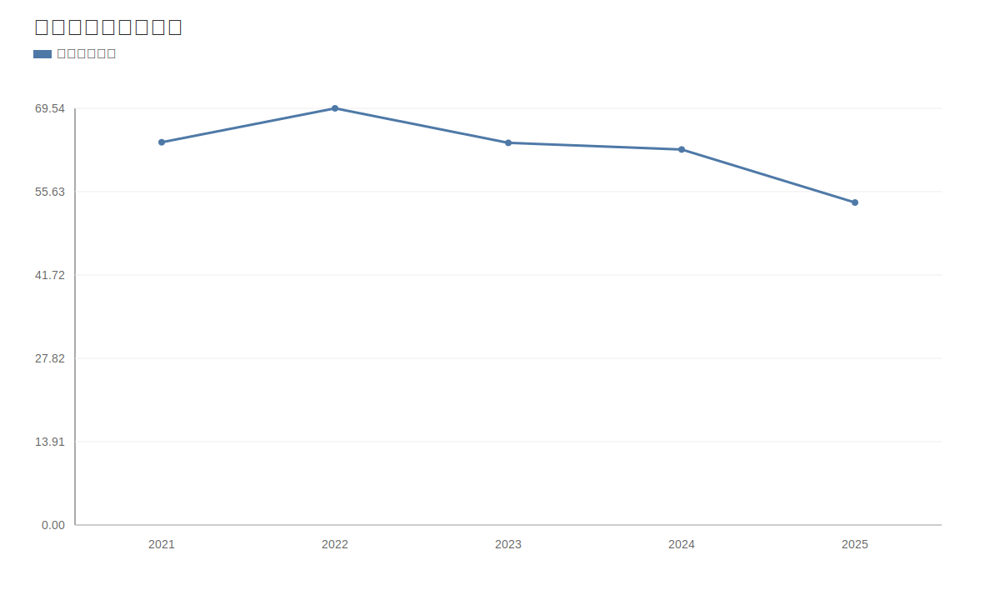

### 2. 净利润趋势图
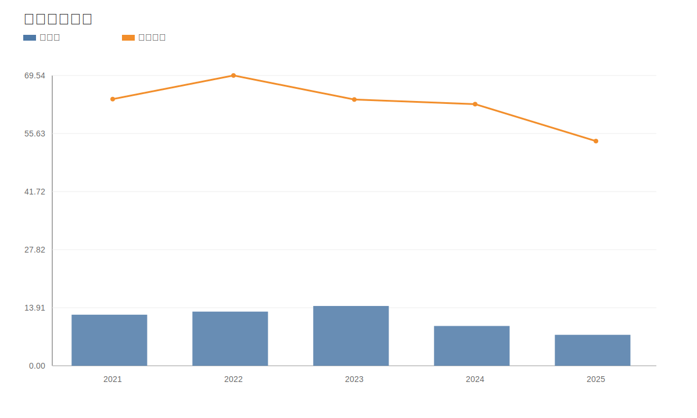

### 3. 毛利率和净利率对比图
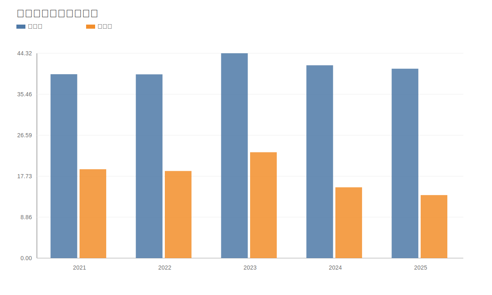

### 4. 分产品收入结构图
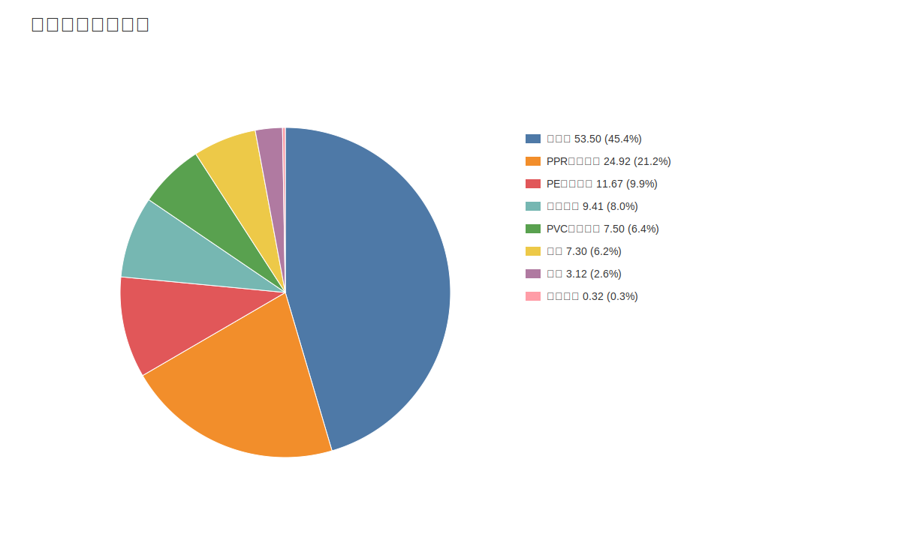

### 4. 分产品收入变化图
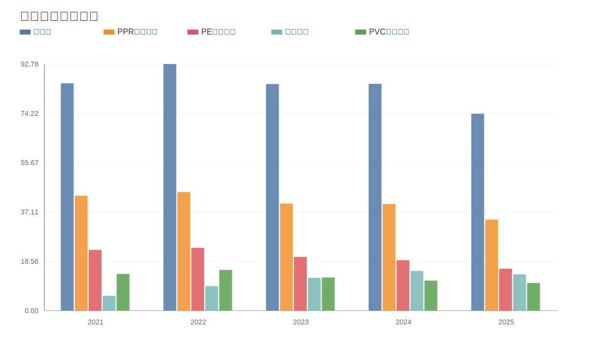

### 5. 分产品利润结构图
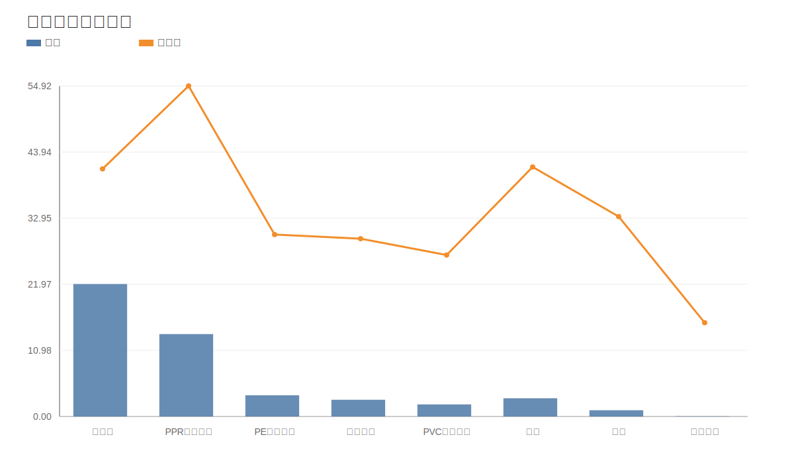

### 6. 分地区收入分布图
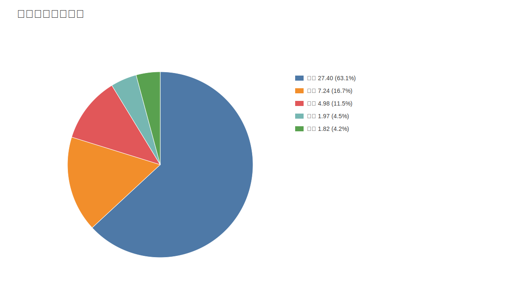

### 7. 资产负债表关键数据图
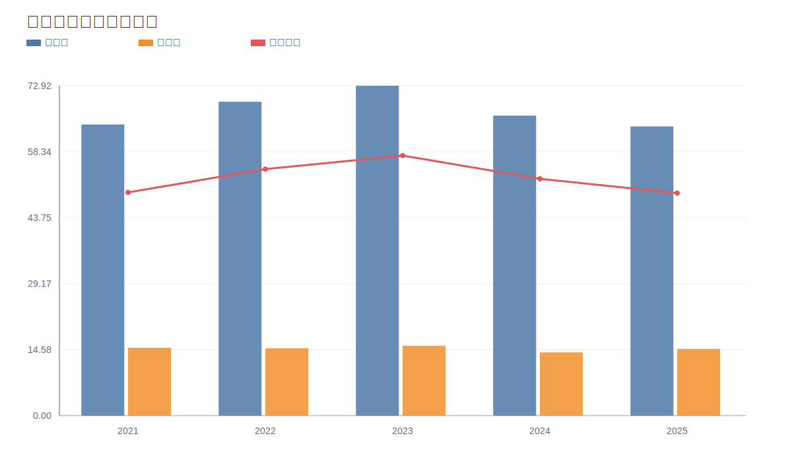

### 8. 自由现金流与经营现金流对比图
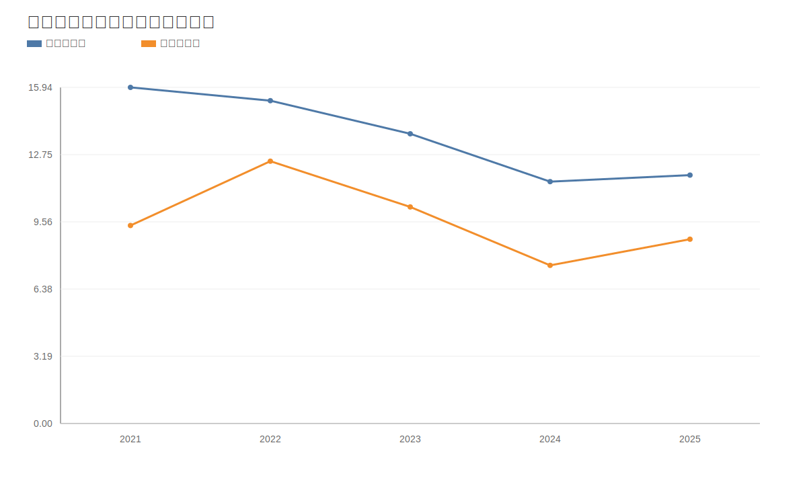

### 9. 股东回报分析图
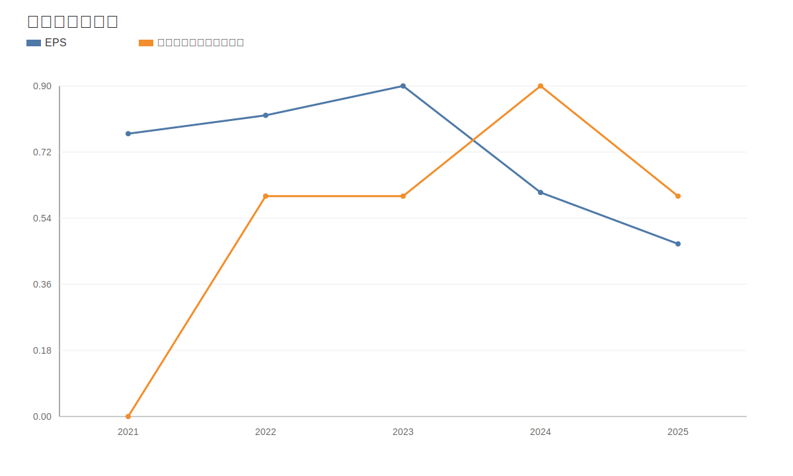

### 10. 财务比率分析图
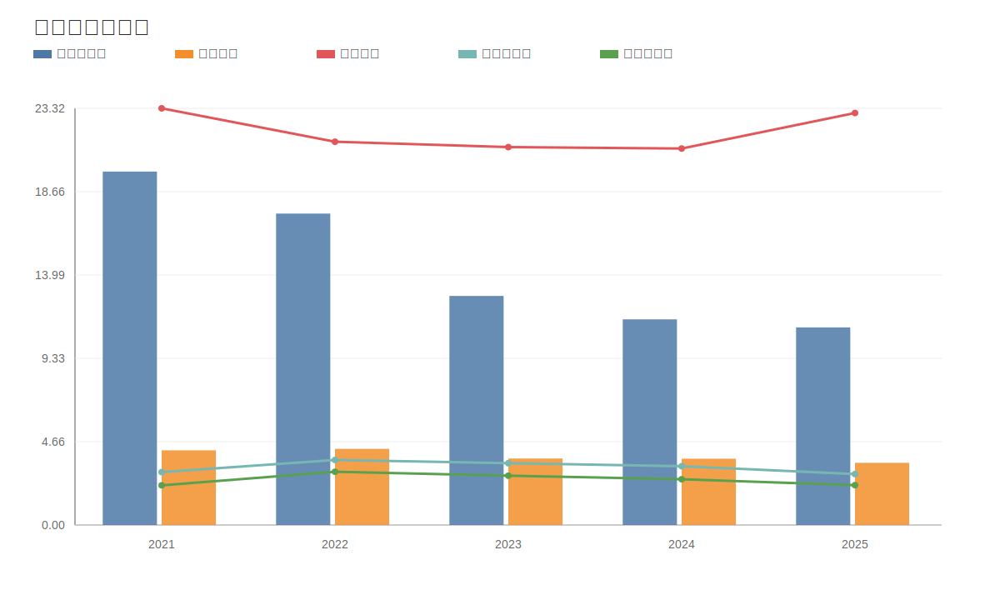

### 11. ROE与ROA对比图
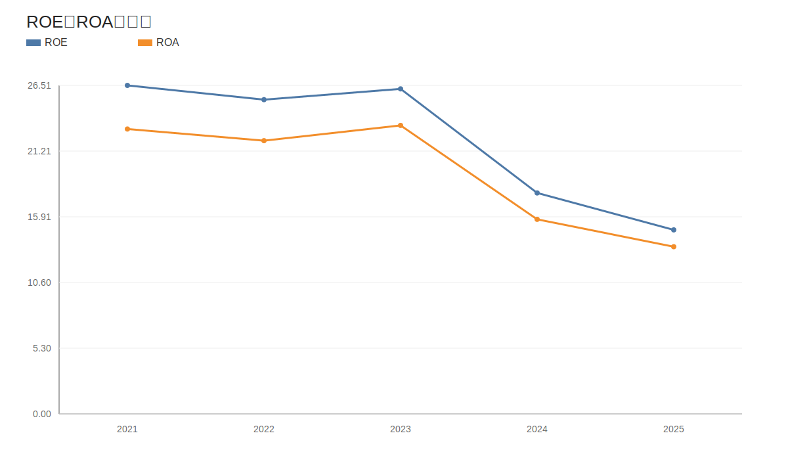
<!-- VALUE_CHARTS_END -->
