# 天齐锂业（002466.SZ）价值分析报告草稿

- 生成时间：2026-05-13 08:10:37
- 自动化脚本：`.agents/skills/value-report/value_report_scaffold.py`
- 数据口径：数据库字段定义以 `app/models/models.py` 为准
- 公司信息：行业 小金属｜地区 四川｜上市日期 20100831
- 管理层：董事长 蒋安琪｜总经理 夏浚诚｜员工 3451
- 主营业务：主要从事工业级碳酸锂,电池级碳酸锂,无水氯化锂,氢氧化锂等锂系列产品的研发,生产和销售.主要产品有工业级碳酸锂,电池级碳酸锂,无水氯化锂,氢氧化锂等.
- 提示：本文件已自动填充定量部分，定性模块请结合最新公告与行业资料补充。

## 自动填充数据（可直接引用）
### 最新估值
- 交易日：20260511
- 收盘价：77.37 元
- PE(TTM)：59.27 倍
- PB：2.86 倍
- PS(TTM)：10.27 倍
- 股息率(TTM)：N/A
- 总市值：1324.41 亿元

### 最新财务快照
- 报告期：20260331
- 营收：51.28亿（同比 98.44%）
- 归母净利润：18.76亿（同比 1699.12%）
- 经营现金流：2.59亿（同比 -72.77%）
- 自由现金流：20.19亿
- 毛利率：62.66%，净利率：55.40%
- ROE：4.23%，ROIC：4.19%
- 资产负债率：28.39%，流动比率：2.51
- 经营现金流/利润：6.94%
- 货币资金：84.04亿，有息负债：118.24亿，净现金：-34.20亿

### 近五年年报趋势
| 年度 | 营收 | 营收同比 | 归母净利 | 净利同比 | 毛利率 | 净利率 | ROE | ROIC | 资产负债率 | 经营现金流 | 自由现金流 | 现净比 |
| --- | --- | --- | --- | --- | --- | --- | --- | --- | --- | --- | --- | --- |
| 2025 | 103.46亿 | -20.80% | 4.63亿 | 105.85% | 39.47% | 29.02% | 1.10% | 5.06% | 28.04% | 29.61亿 | N/A | 639.94% |
| 2024 | 130.63亿 | -67.75% | -79.05亿 | -208.32% | 46.07% | -0.22% | -16.92% | -0.06% | 28.39% | 55.54亿 | -31.25亿 | -70.27% |
| 2023 | 405.03亿 | 0.13% | 72.97亿 | -69.75% | 84.99% | 63.36% | 14.59% | 40.39% | 25.93% | 226.88亿 | 216.83亿 | 310.91% |
| 2022 | 404.49亿 | 427.82% | 241.25亿 | 1060.47% | 85.12% | 76.91% | 78.77% | 63.22% | 25.09% | 202.98亿 | 195.53亿 | 84.14% |
| 2021 | 76.63亿 | N/A | 20.79亿 | N/A | 61.97% | 33.80% | 23.14% | 9.19% | 58.90% | 20.94亿 | 4.38亿 | 100.75% |

- 近五年营收CAGR：7.79%
- 近五年净利CAGR：-39.40%

### 分红与审计
#### 已实施分红
2024年已实施现金分红（税前）合计：每股 1.350 元
2023年已实施现金分红（税前）合计：每股 3.000 元

#### 审计意见
- 20241231：标准无保留意见（毕马威华振会计师事务所）
- 20231231：标准无保留意见（毕马威华振会计师事务所）
- 20221231：标准无保留意见（毕马威华振会计师事务所）
- 20211231：标准无保留意见（信永中和会计师事务所）
- 20201231：带强调事项段的无保留意见（信永中和会计师事务所）

## ECharts 图表数据（option）

- 说明：以下 `option` 可直接用于前端图表渲染；单位已在坐标轴标注。

### 1. 主营业务收入趋势图
```json
{
  "title": {
    "text": "主营业务收入趋势（近5年）"
  },
  "tooltip": {
    "trigger": "axis"
  },
  "legend": {
    "top": 24,
    "data": [
      "主营业务收入"
    ]
  },
  "xAxis": {
    "type": "category",
    "data": [
      "2021",
      "2022",
      "2023",
      "2024",
      "2025"
    ]
  },
  "yAxis": {
    "type": "value",
    "name": "亿元"
  },
  "series": [
    {
      "name": "主营业务收入",
      "type": "line",
      "smooth": true,
      "data": [
        76.63,
        404.49,
        405.03,
        130.63,
        103.46
      ]
    }
  ]
}
```

### 2. 净利润趋势图
```json
{
  "title": {
    "text": "净利润趋势（近5年）"
  },
  "tooltip": {
    "trigger": "axis"
  },
  "legend": {
    "top": 24,
    "data": [
      "净利润",
      "营业收入"
    ]
  },
  "xAxis": {
    "type": "category",
    "data": [
      "2021",
      "2022",
      "2023",
      "2024",
      "2025"
    ]
  },
  "yAxis": [
    {
      "type": "value",
      "name": "亿元"
    },
    {
      "type": "value",
      "name": "亿元"
    }
  ],
  "series": [
    {
      "name": "净利润",
      "type": "bar",
      "data": [
        20.79,
        241.25,
        72.97,
        -79.05,
        4.63
      ]
    },
    {
      "name": "营业收入",
      "type": "line",
      "yAxisIndex": 1,
      "data": [
        76.63,
        404.49,
        405.03,
        130.63,
        103.46
      ]
    }
  ]
}
```

### 3. 毛利率和净利率对比图
```json
{
  "title": {
    "text": "毛利率 vs 净利率"
  },
  "tooltip": {
    "trigger": "axis"
  },
  "legend": {
    "top": 24,
    "data": [
      "毛利率",
      "净利率"
    ]
  },
  "xAxis": {
    "type": "category",
    "data": [
      "2021",
      "2022",
      "2023",
      "2024",
      "2025"
    ]
  },
  "yAxis": {
    "type": "value",
    "name": "%"
  },
  "series": [
    {
      "name": "毛利率",
      "type": "bar",
      "data": [
        61.97,
        85.12,
        84.99,
        46.07,
        39.47
      ]
    },
    {
      "name": "净利率",
      "type": "bar",
      "data": [
        33.8,
        76.91,
        63.36,
        -0.22,
        29.02
      ]
    }
  ]
}
```

### 4. 分产品收入结构图
```json
{
  "title": {
    "text": "分产品收入结构（20251231）"
  },
  "tooltip": {
    "trigger": "item"
  },
  "legend": {
    "type": "scroll",
    "top": 24
  },
  "series": [
    {
      "type": "pie",
      "radius": "55%",
      "data": [
        {
          "name": "化学原料及化学制品制造业",
          "value": 56.97
        },
        {
          "name": "锂化合物及衍生品",
          "value": 56.97
        },
        {
          "name": "采选冶炼行业",
          "value": 46.29
        },
        {
          "name": "锂矿",
          "value": 46.29
        },
        {
          "name": "国外",
          "value": 8.71
        },
        {
          "name": "其他(行业)",
          "value": 0.2
        },
        {
          "name": "其他产品",
          "value": 0.2
        }
      ]
    }
  ]
}
```

### 4. 分产品收入变化图
```json
{
  "title": {
    "text": "分产品收入变化（近5年）"
  },
  "tooltip": {
    "trigger": "axis"
  },
  "legend": {
    "type": "scroll",
    "top": 24,
    "data": [
      "化学原料及化学制品制造业",
      "锂化合物及衍生品",
      "采选冶炼行业",
      "锂矿",
      "国外"
    ]
  },
  "xAxis": {
    "type": "category",
    "data": [
      "2021",
      "2022",
      "2023",
      "2024",
      "2025"
    ]
  },
  "yAxis": {
    "type": "value",
    "name": "亿元"
  },
  "series": [
    {
      "name": "化学原料及化学制品制造业",
      "type": "bar",
      "stack": "total",
      "data": [
        65.05,
        348.36,
        220.74,
        119.19,
        81.39
      ]
    },
    {
      "name": "锂化合物及衍生品",
      "type": "bar",
      "stack": "total",
      "data": [
        65.05,
        348.36,
        220.74,
        119.19,
        81.39
      ]
    },
    {
      "name": "采选冶炼行业",
      "type": "bar",
      "stack": "total",
      "data": [
        35.07,
        199.05,
        432.39,
        75.5,
        70.09
      ]
    },
    {
      "name": "锂矿",
      "type": "bar",
      "stack": "total",
      "data": [
        35.07,
        199.05,
        432.39,
        75.5,
        70.09
      ]
    },
    {
      "name": "国外",
      "type": "bar",
      "stack": "total",
      "data": [
        14.28,
        87.85,
        103.65,
        19.56,
        11.98
      ]
    }
  ]
}
```

### 5. 分产品利润结构图
```json
{
  "title": {
    "text": "分产品利润结构（20251231）"
  },
  "tooltip": {
    "trigger": "axis"
  },
  "legend": {
    "top": 24,
    "data": [
      "利润",
      "毛利率"
    ]
  },
  "xAxis": {
    "type": "category",
    "data": [
      "化学原料及化学制品制造业",
      "锂化合物及衍生品",
      "采选冶炼行业",
      "锂矿",
      "国外",
      "其他(行业)",
      "其他产品"
    ]
  },
  "yAxis": [
    {
      "type": "value",
      "name": "亿元"
    },
    {
      "type": "value",
      "name": "%"
    }
  ],
  "series": [
    {
      "name": "利润",
      "type": "bar",
      "data": [
        16.28,
        16.28,
        24.48,
        24.48,
        0.28,
        0.08,
        0.08
      ]
    },
    {
      "name": "毛利率",
      "type": "line",
      "yAxisIndex": 1,
      "data": [
        28.59,
        28.59,
        52.88,
        52.88,
        3.21,
        37.25,
        37.25
      ]
    }
  ]
}
```

### 6. 分地区收入分布图
```json
{
  "title": {
    "text": "分地区收入分布（20251231）"
  },
  "tooltip": {
    "trigger": "item"
  },
  "legend": {
    "type": "scroll",
    "top": 24
  },
  "series": [
    {
      "type": "pie",
      "radius": "55%",
      "data": [
        {
          "name": "中国大陆",
          "value": 94.75
        }
      ]
    }
  ]
}
```

### 7. 资产负债表关键数据图
```json
{
  "title": {
    "text": "资产负债表关键数据（近5年）"
  },
  "tooltip": {
    "trigger": "axis"
  },
  "legend": {
    "top": 24,
    "data": [
      "总资产",
      "总负债",
      "股东权益"
    ]
  },
  "xAxis": {
    "type": "category",
    "data": [
      "2021",
      "2022",
      "2023",
      "2024",
      "2025"
    ]
  },
  "yAxis": {
    "type": "value",
    "name": "亿元"
  },
  "series": [
    {
      "name": "总资产",
      "type": "bar",
      "stack": "capital",
      "data": [
        441.65,
        708.46,
        732.28,
        686.78,
        721.1
      ]
    },
    {
      "name": "总负债",
      "type": "bar",
      "stack": "capital",
      "data": [
        260.14,
        177.79,
        189.92,
        194.96,
        202.18
      ]
    },
    {
      "name": "股东权益",
      "type": "line",
      "data": [
        181.52,
        530.68,
        542.37,
        491.82,
        518.92
      ]
    }
  ]
}
```

### 8. 自由现金流与经营现金流对比图
```json
{
  "title": {
    "text": "自由现金流 vs 经营现金流"
  },
  "tooltip": {
    "trigger": "axis"
  },
  "legend": {
    "top": 24,
    "data": [
      "经营现金流",
      "自由现金流"
    ]
  },
  "xAxis": {
    "type": "category",
    "data": [
      "2021",
      "2022",
      "2023",
      "2024",
      "2025"
    ]
  },
  "yAxis": {
    "type": "value",
    "name": "亿元"
  },
  "series": [
    {
      "name": "经营现金流",
      "type": "line",
      "data": [
        20.94,
        202.98,
        226.88,
        55.54,
        29.61
      ]
    },
    {
      "name": "自由现金流",
      "type": "line",
      "data": [
        4.38,
        195.53,
        216.83,
        -31.25,
        null
      ]
    }
  ]
}
```

### 9. 股东回报分析图
```json
{
  "title": {
    "text": "股东回报（EPS/分红）"
  },
  "tooltip": {
    "trigger": "axis"
  },
  "legend": {
    "top": 24,
    "data": [
      "EPS",
      "每股现金分红（已实施）"
    ]
  },
  "xAxis": {
    "type": "category",
    "data": [
      "2021",
      "2022",
      "2023",
      "2024",
      "2025"
    ]
  },
  "yAxis": {
    "type": "value",
    "name": "元"
  },
  "series": [
    {
      "name": "EPS",
      "type": "line",
      "data": [
        1.41,
        15.52,
        4.45,
        -4.82,
        0.28
      ]
    },
    {
      "name": "每股现金分红（已实施）",
      "type": "line",
      "data": [
        0.0,
        0.0,
        3.0,
        1.35,
        0.0
      ]
    }
  ]
}
```

### 10. 财务比率分析图
```json
{
  "title": {
    "text": "关键财务比率（近5年）"
  },
  "tooltip": {
    "trigger": "axis"
  },
  "legend": {
    "type": "scroll",
    "top": 24,
    "data": [
      "资产负债率",
      "流动比率",
      "速动比率",
      "应收周转率",
      "存货周转率"
    ]
  },
  "xAxis": {
    "type": "category",
    "data": [
      "2021",
      "2022",
      "2023",
      "2024",
      "2025"
    ]
  },
  "yAxis": [
    {
      "type": "value",
      "name": "比率/%"
    },
    {
      "type": "value",
      "name": "周转率"
    }
  ],
  "series": [
    {
      "name": "资产负债率",
      "type": "line",
      "data": [
        58.9,
        25.09,
        25.93,
        28.39,
        28.04
      ]
    },
    {
      "name": "流动比率",
      "type": "line",
      "data": [
        0.47,
        3.44,
        2.95,
        2.55,
        2.78
      ]
    },
    {
      "name": "速动比率",
      "type": "line",
      "data": [
        0.41,
        3.16,
        2.47,
        2.09,
        2.22
      ]
    },
    {
      "name": "应收周转率",
      "type": "bar",
      "yAxisIndex": 1,
      "data": [
        17.4,
        10.08,
        6.93,
        5.39,
        14.95
      ]
    },
    {
      "name": "存货周转率",
      "type": "bar",
      "yAxisIndex": 1,
      "data": [
        3.38,
        3.99,
        2.3,
        2.59,
        2.67
      ]
    }
  ]
}
```

### 11. ROE与ROA对比图
```json
{
  "title": {
    "text": "ROE vs ROA（近5年）"
  },
  "tooltip": {
    "trigger": "axis"
  },
  "legend": {
    "top": 24,
    "data": [
      "ROE",
      "ROA"
    ]
  },
  "xAxis": {
    "type": "category",
    "data": [
      "2021",
      "2022",
      "2023",
      "2024",
      "2025"
    ]
  },
  "yAxis": {
    "type": "value",
    "name": "%"
  },
  "series": [
    {
      "name": "ROE",
      "type": "line",
      "data": [
        23.14,
        78.77,
        14.59,
        -16.92,
        1.1
      ]
    },
    {
      "name": "ROA",
      "type": "line",
      "data": [
        12.6,
        71.18,
        50.63,
        2.29,
        6.24
      ]
    }
  ]
}
```

## 1. 公司概况（商业模式优先）
- 公司是如何赚钱的？
- 收入来源构成（核心业务占比）
- 客户类型（To B / To C / 政府）
- 是否具备持续性收入（一次性 vs 订阅/复购）
- 是否依赖单一客户或区域

### 结论
- 商业模式是否简单、可理解
- 是否具备长期可持续性

## 2. 行业与竞争格局
- 行业空间（市场规模、天花板）
- 行业阶段（成长 / 成熟 / 衰退）
- 行业增速
- 主要竞争对手
- 市场份额与行业集中度
- 公司在产业链中的位置

### 结论
- 是否属于优质赛道
- 公司是否处于有利竞争位置
- 行业未来3-5年趋势

## 3. 护城河分析（含真伪辨别）
- 品牌优势
- 成本优势
- 网络效应
- 转换成本
- 技术壁垒
- 渠道优势

### 护城河真伪辨别
- 如果产品提价 5%，客户是否会流失？
- 客户是否对价格敏感？
- 是否存在“非它不可”的使用场景？
- 替代品是否容易出现？
- 客户更换供应商的成本高不高？

### 结论
- 护城河类型
- 护城河强度：强 / 中 / 弱 / 伪护城河
- 是否具备真实定价权

## 4. 管理层与资本配置（重点）
- 管理层背景与稳定性
- 是否存在诚信问题（造假 / 处罚 / 诉讼）
- 过往战略是否理性

### 资本配置历史
- 是否长期分红
- 是否进行回购注销（而非股权激励稀释）
- 并购历史（成功 / 失败 / 频繁）
- 是否存在盲目多元化扩张
- 资本开支是否合理

### 结论
- 管理层类型：价值创造者 / 中性 / 价值毁灭者
- 是否值得长期信任

## 5. 财务分析
### 5.1 成长性
- 营收增长率（近3-5年）
- 净利润增长率
- 增长是否稳定

### 结论
- 是否具备持续成长能力

### 5.2 盈利能力
- 毛利率
- 净利率
- ROE / ROIC

### 结论
- 是否具备定价权
- 盈利质量如何

### 5.3 财务健康
- 资产负债率
- 有息负债
- 现金储备
- 短期偿债能力

### 结论
- 是否存在财务风险

### 5.4 现金流质量
- 经营现金流
- 自由现金流
- 净利润与现金流是否匹配

### 结论
- 利润是否真实
- 是否具备造血能力

## 6. 成长驱动
- 未来3-5年增长来源
- 是否依赖提价 / 扩张 / 新业务
- 增长逻辑是否清晰

### 结论
- 成长是否可持续

## 7. 风险分析（含幸存者偏差）
- 政策风险
- 行业竞争风险
- 技术替代风险
- 财务风险
- 客户集中风险

### 幸存者偏差检验
- 行业历史最差时期是什么时候？
- 当时发生了什么（金融危机 / 疫情 / 监管）？
- 公司当时表现：是否大幅亏损 / 现金流断裂 / 接近破产？
- 公司在极端情况下是：变强 / 持平 / 衰退

### 结论
- 抗风险能力：强 / 中 / 弱
- 是否属于“穿越周期公司”

## 8. 估值分析
- PE / PB / PS / PEG / EV/EBITDA
- 当前估值 vs 历史估值
- 当前估值 vs 行业对比

### 结论
- 当前是否高估 / 低估 / 合理
- 是否具备安全边际

## 9. 投资判断
### 多头逻辑
1. 
2. 
3. 

### 空头逻辑
1. 
2. 
3. 

### 核心跟踪指标
1. 
2. 
3. 

## 最终结论
- 这是否是一家好公司？
- 是否具备长期投资价值？
- 当前价格是否值得买入？
- 投资建议：买入 / 观察 / 回避

## 总评分（100分）
- 商业模式：
- 护城河：
- 管理层：
- 财务：
- 风险：
- 估值：

**最终评分：__ / 100**

## 三个终极问题（必须回答）
1. 如果提价 5%，客户会不会流失？
2. 公司赚的钱有没有被管理层浪费？
3. 在行业最差年份，公司是怎么活下来的？

<!-- VALUE_CHARTS_START -->
## 图表图片（自动生成）

### 1. 主营业务收入趋势图
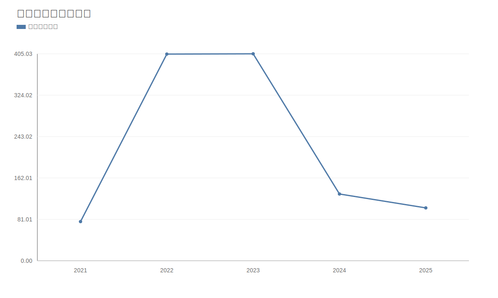

### 2. 净利润趋势图
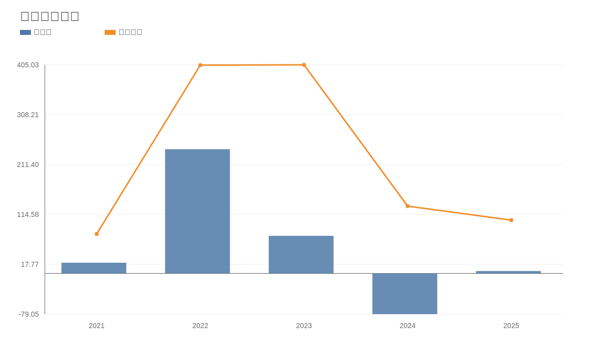

### 3. 毛利率和净利率对比图
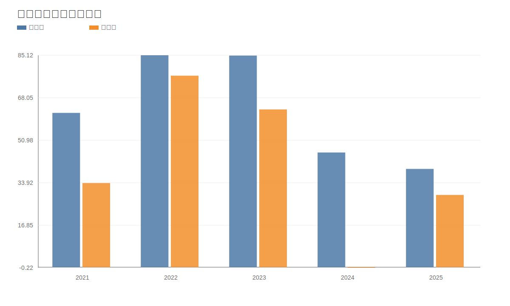

### 4. 分产品收入结构图
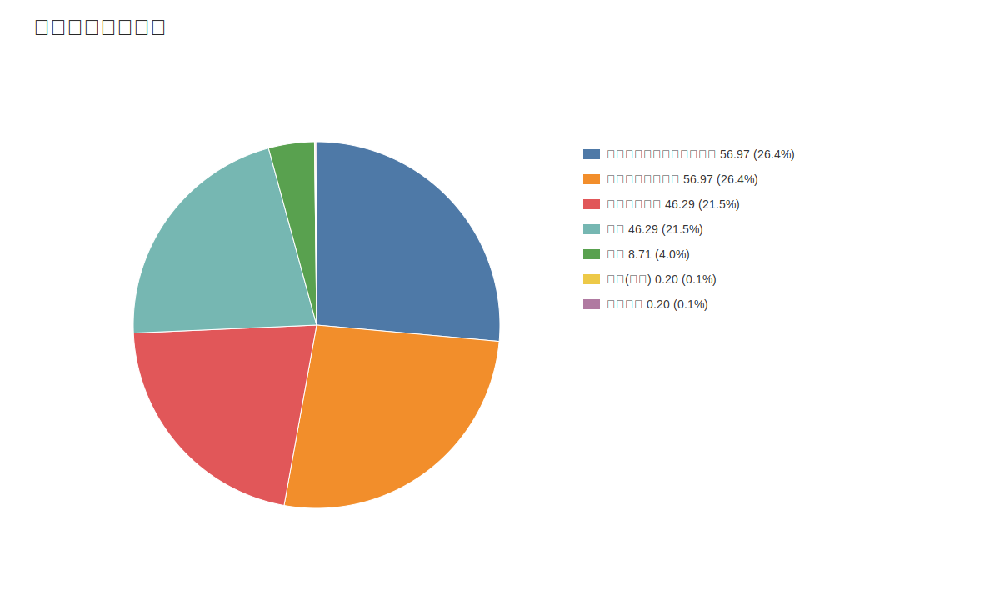

### 4. 分产品收入变化图
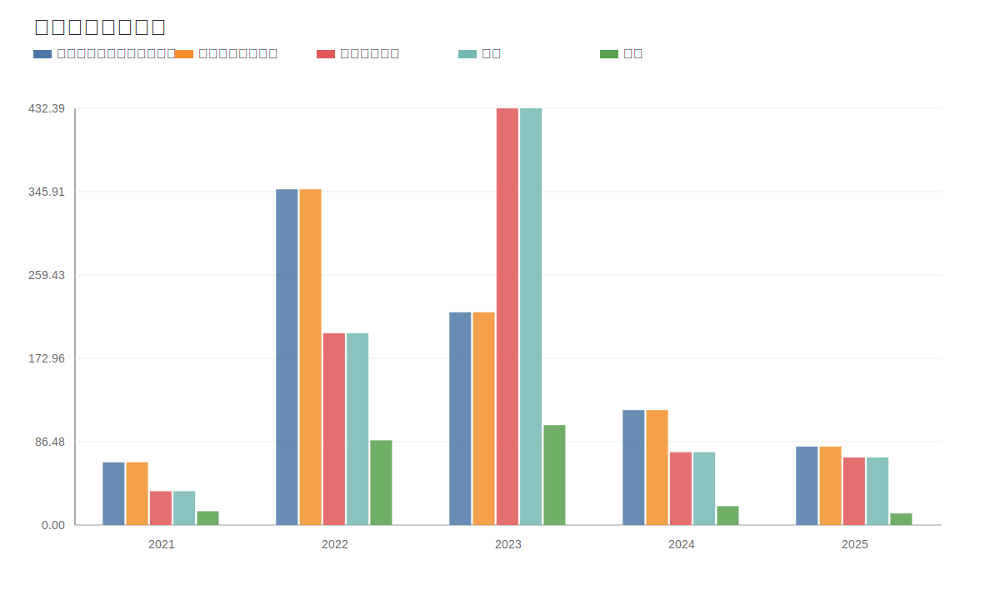

### 5. 分产品利润结构图
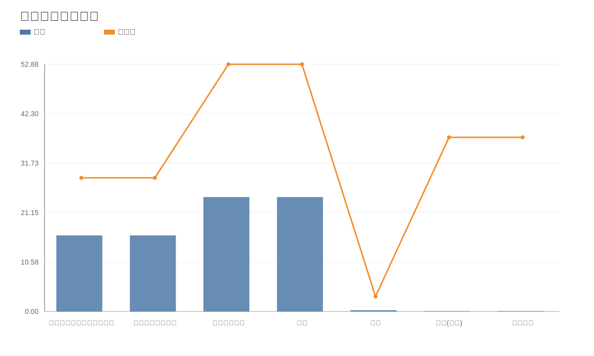

### 6. 分地区收入分布图
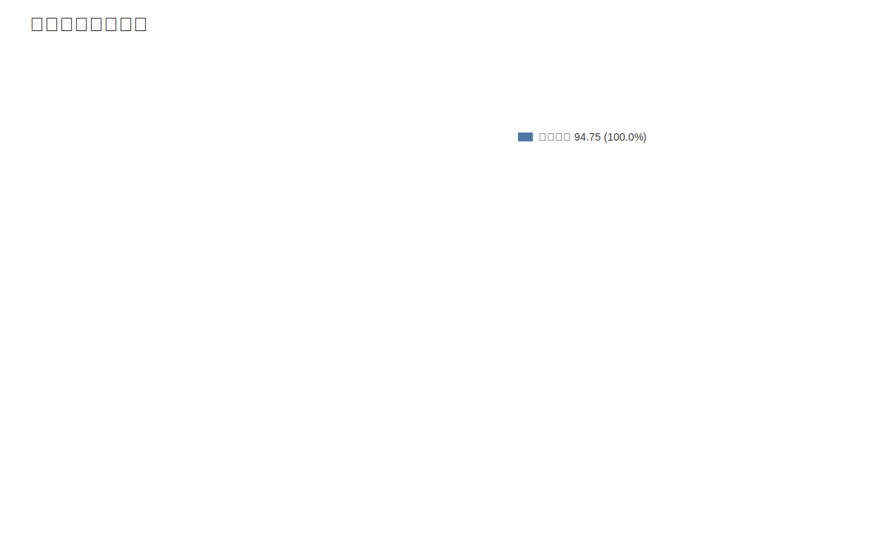

### 7. 资产负债表关键数据图
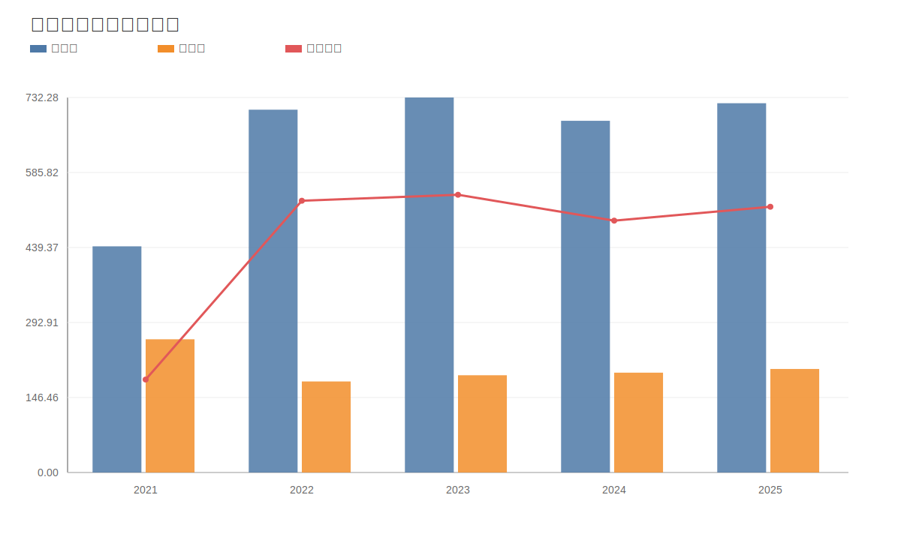

### 8. 自由现金流与经营现金流对比图
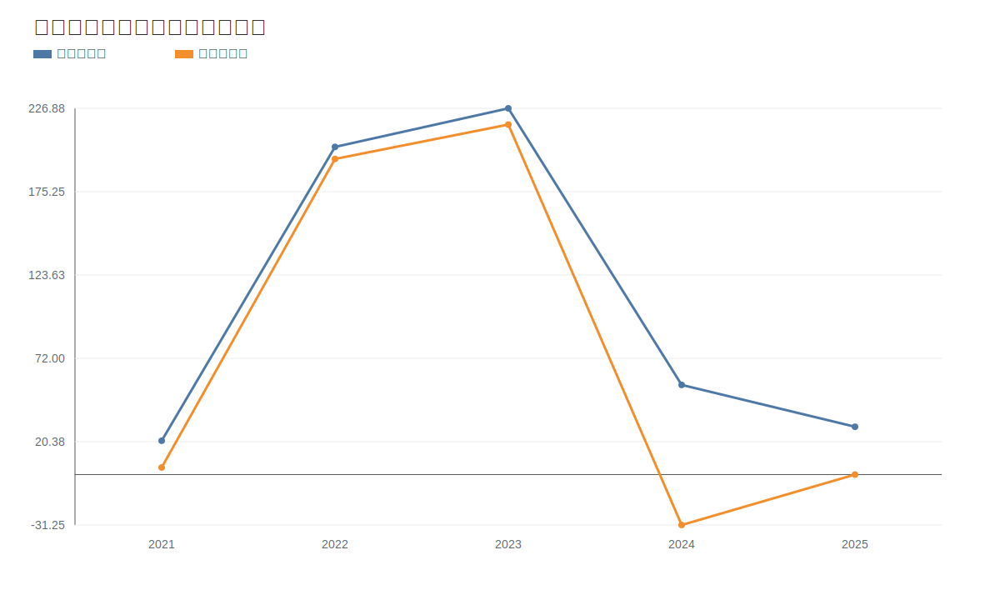

### 9. 股东回报分析图
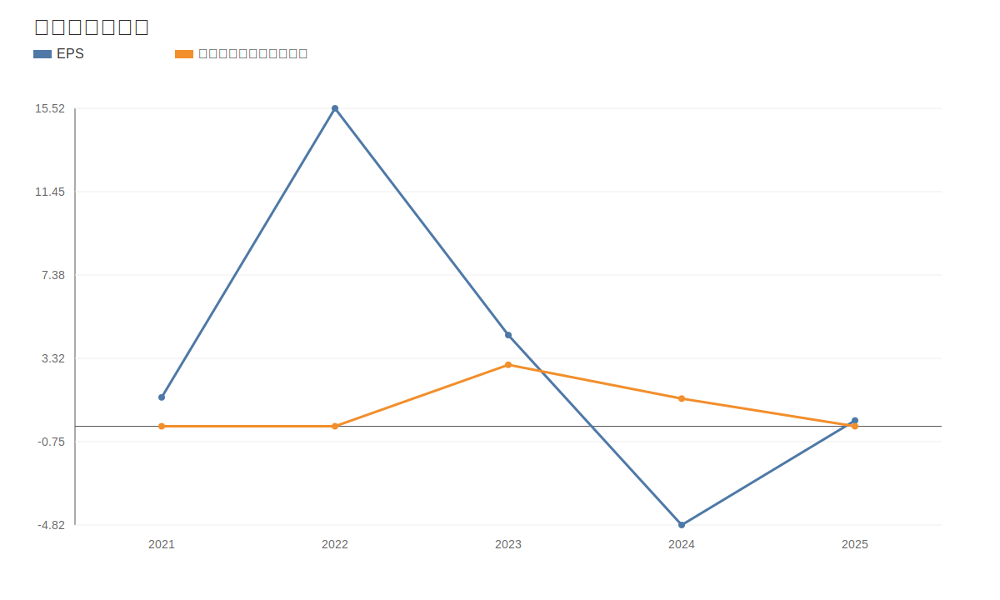

### 10. 财务比率分析图
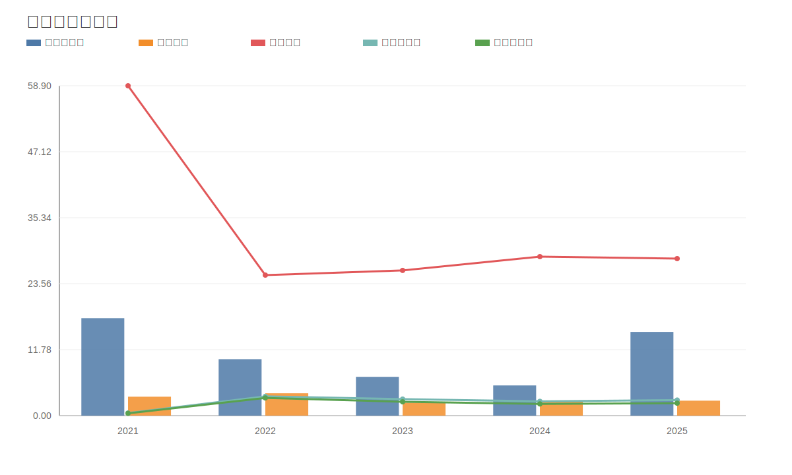

### 11. ROE与ROA对比图
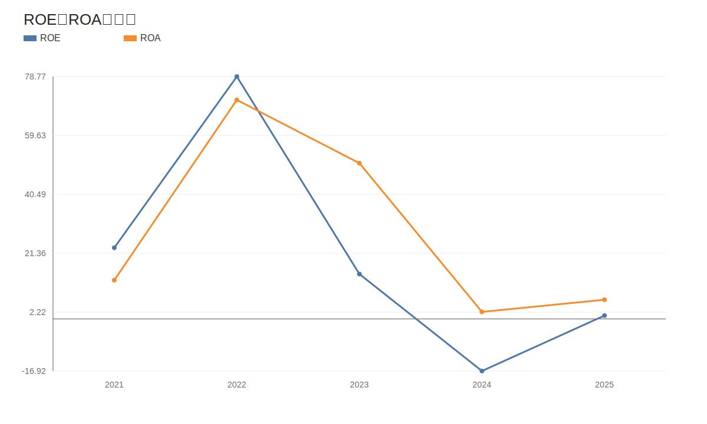
<!-- VALUE_CHARTS_END -->

## 困境反转专项判断（天齐锂业）
事实：
- 价格日期：20260511；财报日期：20260331。
- 当前收盘价 77.37 元，PE(TTM) 59.27，PB 2.86。
计算结果：
- 营收同比 -50.44%，净利润同比 305.52%，经营现金流同比 -91.25%。
- 资产负债率：最新 28.39%，上期 28.04%。
- 困境反转评分：1/3，状态：反转待确认。
推断：
- 若“盈利修复 + 现金流修复 + 杠杆缓解”连续两个报告期维持，则反转概率提升；若任一项再度恶化，应下调反转置信度。
