# 完美世界（002624.SZ）价值分析报告草稿

- 生成时间：2026-05-13 01:34:58
- 自动化脚本：`.agents/skills/value-report/value_report_scaffold.py`
- 数据口径：数据库字段定义以 `app/models/models.py` 为准
- 公司信息：行业 互联网｜地区 浙江｜上市日期 20111028
- 管理层：董事长 池宇峰｜总经理 顾黎明｜员工 3905
- 主营业务：电视剧(开发/制作/营销发行),电影(开发/制作/营销发行),综艺栏目,艺人经纪,商务广告,衍生经济及其他等各个影视业务板块.
- 提示：本文件已自动填充定量部分，定性模块请结合最新公告与行业资料补充。

## 自动填充数据（可直接引用）
### 最新估值
- 交易日：20260511
- 收盘价：16.82 元
- PE(TTM)：61.41 倍
- PB：4.53 倍
- PS(TTM)：5.62 倍
- 股息率(TTM)：1.34%
- 总市值：326.30 亿元

### 最新财务快照
- 报告期：20260331
- 营收：11.71亿（同比 -42.11%）
- 归母净利润：1.03亿（同比 -66.02%）
- 经营现金流：-1.50亿（同比 -174.93%）
- 自由现金流：-3.74亿
- 毛利率：66.71%，净利率：8.67%
- ROE：1.43%，ROIC：1.18%
- 资产负债率：30.17%，流动比率：2.23
- 经营现金流/利润：-121.35%
- 货币资金：31.64亿，有息负债：0.00亿，净现金：31.64亿

### 近五年年报趋势
| 年度 | 营收 | 营收同比 | 归母净利 | 净利同比 | 毛利率 | 净利率 | ROE | ROIC | 资产负债率 | 经营现金流 | 自由现金流 | 现净比 |
| --- | --- | --- | --- | --- | --- | --- | --- | --- | --- | --- | --- | --- |
| 2025 | 66.60亿 | 19.55% | 7.31亿 | 156.76% | 60.28% | 10.39% | 10.53% | 8.55% | 33.73% | 10.93亿 | 5.93亿 | 149.54% |
| 2024 | 55.70亿 | -28.50% | -12.88亿 | -361.98% | 57.87% | -25.13% | -16.39% | -15.67% | 39.56% | 5.77亿 | 4.74亿 | -44.78% |
| 2023 | 77.91亿 | 1.57% | 4.91亿 | -64.31% | 59.70% | 7.48% | 5.43% | 5.05% | 34.95% | 7.62亿 | -7.15亿 | 155.01% |
| 2022 | 76.70亿 | -9.95% | 13.77亿 | 273.07% | 68.45% | 18.25% | 14.16% | 11.83% | 39.40% | 11.55亿 | 19.33亿 | 83.88% |
| 2021 | 85.18亿 | N/A | 3.69亿 | N/A | 61.46% | 2.08% | 3.49% | 2.21% | 38.35% | 10.98亿 | 14.49亿 | 297.35% |

- 近五年营收CAGR：-5.97%
- 近五年净利CAGR：25.57%

### 分红与审计
#### 已实施分红
2025年已实施现金分红（税前）合计：每股 0.230 元
2024年已实施现金分红（税前）合计：每股 0.460 元
2023年已实施现金分红（税前）合计：每股 0.350 元
2022年已实施现金分红（税前）合计：每股 1.200 元
2021年已实施现金分红（税前）合计：每股 0.160 元

#### 审计意见
- 20241231：标准无保留意见（立信会计师事务所）
- 20231231：标准无保留意见（立信会计师事务所）
- 20221231：标准无保留意见（立信会计师事务所）
- 20211231：标准无保留意见（立信会计师事务所）
- 20201231：标准无保留意见（立信会计师事务所）

## ECharts 图表数据（option）

- 说明：以下 `option` 可直接用于前端图表渲染；单位已在坐标轴标注。

### 1. 主营业务收入趋势图
```json
{
  "title": {
    "text": "主营业务收入趋势（近5年）"
  },
  "tooltip": {
    "trigger": "axis"
  },
  "legend": {
    "top": 24,
    "data": [
      "主营业务收入"
    ]
  },
  "xAxis": {
    "type": "category",
    "data": [
      "2021",
      "2022",
      "2023",
      "2024",
      "2025"
    ]
  },
  "yAxis": {
    "type": "value",
    "name": "亿元"
  },
  "series": [
    {
      "name": "主营业务收入",
      "type": "line",
      "smooth": true,
      "data": [
        85.18,
        76.7,
        77.91,
        55.7,
        66.6
      ]
    }
  ]
}
```

### 2. 净利润趋势图
```json
{
  "title": {
    "text": "净利润趋势（近5年）"
  },
  "tooltip": {
    "trigger": "axis"
  },
  "legend": {
    "top": 24,
    "data": [
      "净利润",
      "营业收入"
    ]
  },
  "xAxis": {
    "type": "category",
    "data": [
      "2021",
      "2022",
      "2023",
      "2024",
      "2025"
    ]
  },
  "yAxis": [
    {
      "type": "value",
      "name": "亿元"
    },
    {
      "type": "value",
      "name": "亿元"
    }
  ],
  "series": [
    {
      "name": "净利润",
      "type": "bar",
      "data": [
        3.69,
        13.77,
        4.91,
        -12.88,
        7.31
      ]
    },
    {
      "name": "营业收入",
      "type": "line",
      "yAxisIndex": 1,
      "data": [
        85.18,
        76.7,
        77.91,
        55.7,
        66.6
      ]
    }
  ]
}
```

### 3. 毛利率和净利率对比图
```json
{
  "title": {
    "text": "毛利率 vs 净利率"
  },
  "tooltip": {
    "trigger": "axis"
  },
  "legend": {
    "top": 24,
    "data": [
      "毛利率",
      "净利率"
    ]
  },
  "xAxis": {
    "type": "category",
    "data": [
      "2021",
      "2022",
      "2023",
      "2024",
      "2025"
    ]
  },
  "yAxis": {
    "type": "value",
    "name": "%"
  },
  "series": [
    {
      "name": "毛利率",
      "type": "bar",
      "data": [
        61.46,
        68.45,
        59.7,
        57.87,
        60.28
      ]
    },
    {
      "name": "净利率",
      "type": "bar",
      "data": [
        2.08,
        18.25,
        7.48,
        -25.13,
        10.39
      ]
    }
  ]
}
```

### 4. 分产品收入结构图
```json
{
  "title": {
    "text": "分产品收入结构（20251231）"
  },
  "tooltip": {
    "trigger": "item"
  },
  "legend": {
    "type": "scroll",
    "top": 24
  },
  "series": [
    {
      "type": "pie",
      "radius": "55%",
      "data": [
        {
          "name": "游戏(行业)",
          "value": 57.11
        },
        {
          "name": "PC端网络游戏",
          "value": 34.95
        },
        {
          "name": "移动网络游戏",
          "value": 20.5
        },
        {
          "name": "影视剧(行业)",
          "value": 9.21
        },
        {
          "name": "电视剧及短剧",
          "value": 9.02
        },
        {
          "name": "国外",
          "value": 4.34
        },
        {
          "name": "游戏相关其他收入",
          "value": 1.36
        },
        {
          "name": "主机游戏",
          "value": 0.3
        }
      ]
    }
  ]
}
```

### 4. 分产品收入变化图
```json
{
  "title": {
    "text": "分产品收入变化（近5年）"
  },
  "tooltip": {
    "trigger": "axis"
  },
  "legend": {
    "type": "scroll",
    "top": 24,
    "data": [
      "游戏(行业)",
      "PC端网络游戏",
      "移动网络游戏",
      "影视剧(行业)",
      "电视剧及短剧"
    ]
  },
  "xAxis": {
    "type": "category",
    "data": [
      "2021",
      "2022",
      "2023",
      "2024",
      "2025"
    ]
  },
  "yAxis": {
    "type": "value",
    "name": "亿元"
  },
  "series": [
    {
      "name": "游戏(行业)",
      "type": "bar",
      "stack": "total",
      "data": [
        108.3,
        109.79,
        103.13,
        78.31,
        86.17
      ]
    },
    {
      "name": "PC端网络游戏",
      "type": "bar",
      "stack": "total",
      "data": [
        37.08,
        28.81,
        33.53,
        34.45,
        53.47
      ]
    },
    {
      "name": "移动网络游戏",
      "type": "bar",
      "stack": "total",
      "data": [
        63.65,
        76.85,
        64.3,
        39.98,
        30.18
      ]
    },
    {
      "name": "影视剧(行业)",
      "type": "bar",
      "stack": "total",
      "data": [
        16.82,
        4.41,
        17.99,
        4.39,
        16.88
      ]
    },
    {
      "name": "电视剧及短剧",
      "type": "bar",
      "stack": "total",
      "data": [
        16.05,
        4.06,
        17.65,
        3.58,
        16.5
      ]
    }
  ]
}
```

### 5. 分产品利润结构图
```json
{
  "title": {
    "text": "分产品利润结构（20251231）"
  },
  "tooltip": {
    "trigger": "axis"
  },
  "legend": {
    "top": 24,
    "data": [
      "利润",
      "毛利率"
    ]
  },
  "xAxis": {
    "type": "category",
    "data": [
      "游戏(行业)",
      "PC端网络游戏",
      "移动网络游戏",
      "影视剧(行业)",
      "电视剧及短剧",
      "国外",
      "游戏相关其他收入",
      "主机游戏"
    ]
  },
  "yAxis": [
    {
      "type": "value",
      "name": "亿元"
    },
    {
      "type": "value",
      "name": "%"
    }
  ],
  "series": [
    {
      "name": "利润",
      "type": "bar",
      "data": [
        38.96,
        23.37,
        15.09,
        1.11,
        1.08,
        3.09,
        0.3,
        0.21
      ]
    },
    {
      "name": "毛利率",
      "type": "line",
      "yAxisIndex": 1,
      "data": [
        68.21,
        66.86,
        73.61,
        12.01,
        11.95,
        71.28,
        21.69,
        68.61
      ]
    }
  ]
}
```

### 6. 分地区收入分布图
```json
{
  "title": {
    "text": "分地区收入分布（20251231）"
  },
  "tooltip": {
    "trigger": "item"
  },
  "legend": {
    "type": "scroll",
    "top": 24
  },
  "series": [
    {
      "type": "pie",
      "radius": "55%",
      "data": [
        {
          "name": "中国大陆",
          "value": 62.26
        }
      ]
    }
  ]
}
```

### 7. 资产负债表关键数据图
```json
{
  "title": {
    "text": "资产负债表关键数据（近5年）"
  },
  "tooltip": {
    "trigger": "axis"
  },
  "legend": {
    "top": 24,
    "data": [
      "总资产",
      "总负债",
      "股东权益"
    ]
  },
  "xAxis": {
    "type": "category",
    "data": [
      "2021",
      "2022",
      "2023",
      "2024",
      "2025"
    ]
  },
  "yAxis": {
    "type": "value",
    "name": "亿元"
  },
  "series": [
    {
      "name": "总资产",
      "type": "bar",
      "stack": "capital",
      "data": [
        170.4,
        156.36,
        144.89,
        113.66,
        104.68
      ]
    },
    {
      "name": "总负债",
      "type": "bar",
      "stack": "capital",
      "data": [
        65.35,
        61.6,
        50.64,
        44.96,
        35.31
      ]
    },
    {
      "name": "股东权益",
      "type": "line",
      "data": [
        105.04,
        94.76,
        94.25,
        68.7,
        69.37
      ]
    }
  ]
}
```

### 8. 自由现金流与经营现金流对比图
```json
{
  "title": {
    "text": "自由现金流 vs 经营现金流"
  },
  "tooltip": {
    "trigger": "axis"
  },
  "legend": {
    "top": 24,
    "data": [
      "经营现金流",
      "自由现金流"
    ]
  },
  "xAxis": {
    "type": "category",
    "data": [
      "2021",
      "2022",
      "2023",
      "2024",
      "2025"
    ]
  },
  "yAxis": {
    "type": "value",
    "name": "亿元"
  },
  "series": [
    {
      "name": "经营现金流",
      "type": "line",
      "data": [
        10.98,
        11.55,
        7.62,
        5.77,
        10.93
      ]
    },
    {
      "name": "自由现金流",
      "type": "line",
      "data": [
        14.49,
        19.33,
        -7.15,
        4.74,
        5.93
      ]
    }
  ]
}
```

### 9. 股东回报分析图
```json
{
  "title": {
    "text": "股东回报（EPS/分红）"
  },
  "tooltip": {
    "trigger": "axis"
  },
  "legend": {
    "top": 24,
    "data": [
      "EPS",
      "每股现金分红（已实施）"
    ]
  },
  "xAxis": {
    "type": "category",
    "data": [
      "2021",
      "2022",
      "2023",
      "2024",
      "2025"
    ]
  },
  "yAxis": {
    "type": "value",
    "name": "元"
  },
  "series": [
    {
      "name": "EPS",
      "type": "line",
      "data": [
        0.19,
        0.72,
        0.26,
        -0.68,
        0.39
      ]
    },
    {
      "name": "每股现金分红（已实施）",
      "type": "line",
      "data": [
        0.16,
        1.2,
        0.35,
        0.46,
        0.23
      ]
    }
  ]
}
```

### 10. 财务比率分析图
```json
{
  "title": {
    "text": "关键财务比率（近5年）"
  },
  "tooltip": {
    "trigger": "axis"
  },
  "legend": {
    "type": "scroll",
    "top": 24,
    "data": [
      "资产负债率",
      "流动比率",
      "速动比率",
      "应收周转率",
      "存货周转率"
    ]
  },
  "xAxis": {
    "type": "category",
    "data": [
      "2021",
      "2022",
      "2023",
      "2024",
      "2025"
    ]
  },
  "yAxis": [
    {
      "type": "value",
      "name": "比率/%"
    },
    {
      "type": "value",
      "name": "周转率"
    }
  ],
  "series": [
    {
      "name": "资产负债率",
      "type": "line",
      "data": [
        38.35,
        39.4,
        34.95,
        39.56,
        33.73
      ]
    },
    {
      "name": "流动比率",
      "type": "line",
      "data": [
        1.74,
        1.55,
        1.97,
        1.67,
        2.02
      ]
    },
    {
      "name": "速动比率",
      "type": "line",
      "data": [
        1.46,
        1.17,
        1.6,
        1.2,
        1.63
      ]
    },
    {
      "name": "应收周转率",
      "type": "bar",
      "yAxisIndex": 1,
      "data": [
        7.47,
        7.82,
        8.26,
        7.07,
        11.37
      ]
    },
    {
      "name": "存货周转率",
      "type": "bar",
      "yAxisIndex": 1,
      "data": [
        2.92,
        1.74,
        2.22,
        1.53,
        1.78
      ]
    }
  ]
}
```

### 11. ROE与ROA对比图
```json
{
  "title": {
    "text": "ROE vs ROA（近5年）"
  },
  "tooltip": {
    "trigger": "axis"
  },
  "legend": {
    "top": 24,
    "data": [
      "ROE",
      "ROA"
    ]
  },
  "xAxis": {
    "type": "category",
    "data": [
      "2021",
      "2022",
      "2023",
      "2024",
      "2025"
    ]
  },
  "yAxis": {
    "type": "value",
    "name": "%"
  },
  "series": [
    {
      "name": "ROE",
      "type": "line",
      "data": [
        3.49,
        14.16,
        5.43,
        -16.39,
        10.53
      ]
    },
    {
      "name": "ROA",
      "type": "line",
      "data": [
        1.73,
        9.77,
        6.1,
        -9.28,
        8.33
      ]
    }
  ]
}
```

## 1. 公司概况（商业模式优先）
- 公司是如何赚钱的？
- 收入来源构成（核心业务占比）
- 客户类型（To B / To C / 政府）
- 是否具备持续性收入（一次性 vs 订阅/复购）
- 是否依赖单一客户或区域

### 结论
- 商业模式是否简单、可理解
- 是否具备长期可持续性

## 2. 行业与竞争格局
- 行业空间（市场规模、天花板）
- 行业阶段（成长 / 成熟 / 衰退）
- 行业增速
- 主要竞争对手
- 市场份额与行业集中度
- 公司在产业链中的位置

### 结论
- 是否属于优质赛道
- 公司是否处于有利竞争位置
- 行业未来3-5年趋势

## 3. 护城河分析（含真伪辨别）
- 品牌优势
- 成本优势
- 网络效应
- 转换成本
- 技术壁垒
- 渠道优势

### 护城河真伪辨别
- 如果产品提价 5%，客户是否会流失？
- 客户是否对价格敏感？
- 是否存在“非它不可”的使用场景？
- 替代品是否容易出现？
- 客户更换供应商的成本高不高？

### 结论
- 护城河类型
- 护城河强度：强 / 中 / 弱 / 伪护城河
- 是否具备真实定价权

## 4. 管理层与资本配置（重点）
- 管理层背景与稳定性
- 是否存在诚信问题（造假 / 处罚 / 诉讼）
- 过往战略是否理性

### 资本配置历史
- 是否长期分红
- 是否进行回购注销（而非股权激励稀释）
- 并购历史（成功 / 失败 / 频繁）
- 是否存在盲目多元化扩张
- 资本开支是否合理

### 结论
- 管理层类型：价值创造者 / 中性 / 价值毁灭者
- 是否值得长期信任

## 5. 财务分析
### 5.1 成长性
- 营收增长率（近3-5年）
- 净利润增长率
- 增长是否稳定

### 结论
- 是否具备持续成长能力

### 5.2 盈利能力
- 毛利率
- 净利率
- ROE / ROIC

### 结论
- 是否具备定价权
- 盈利质量如何

### 5.3 财务健康
- 资产负债率
- 有息负债
- 现金储备
- 短期偿债能力

### 结论
- 是否存在财务风险

### 5.4 现金流质量
- 经营现金流
- 自由现金流
- 净利润与现金流是否匹配

### 结论
- 利润是否真实
- 是否具备造血能力

## 6. 成长驱动
- 未来3-5年增长来源
- 是否依赖提价 / 扩张 / 新业务
- 增长逻辑是否清晰

### 结论
- 成长是否可持续

## 7. 风险分析（含幸存者偏差）
- 政策风险
- 行业竞争风险
- 技术替代风险
- 财务风险
- 客户集中风险

### 幸存者偏差检验
- 行业历史最差时期是什么时候？
- 当时发生了什么（金融危机 / 疫情 / 监管）？
- 公司当时表现：是否大幅亏损 / 现金流断裂 / 接近破产？
- 公司在极端情况下是：变强 / 持平 / 衰退

### 结论
- 抗风险能力：强 / 中 / 弱
- 是否属于“穿越周期公司”

## 8. 估值分析
- PE / PB / PS / PEG / EV/EBITDA
- 当前估值 vs 历史估值
- 当前估值 vs 行业对比

### 结论
- 当前是否高估 / 低估 / 合理
- 是否具备安全边际

## 9. 投资判断
### 多头逻辑
1. 
2. 
3. 

### 空头逻辑
1. 
2. 
3. 

### 核心跟踪指标
1. 
2. 
3. 

## 最终结论
- 这是否是一家好公司？
- 是否具备长期投资价值？
- 当前价格是否值得买入？
- 投资建议：买入 / 观察 / 回避

## 总评分（100分）
- 商业模式：
- 护城河：
- 管理层：
- 财务：
- 风险：
- 估值：

**最终评分：__ / 100**

## 三个终极问题（必须回答）
1. 如果提价 5%，客户会不会流失？
2. 公司赚的钱有没有被管理层浪费？
3. 在行业最差年份，公司是怎么活下来的？

<!-- VALUE_CHARTS_START -->
## 图表图片（自动生成）

### 1. 主营业务收入趋势图
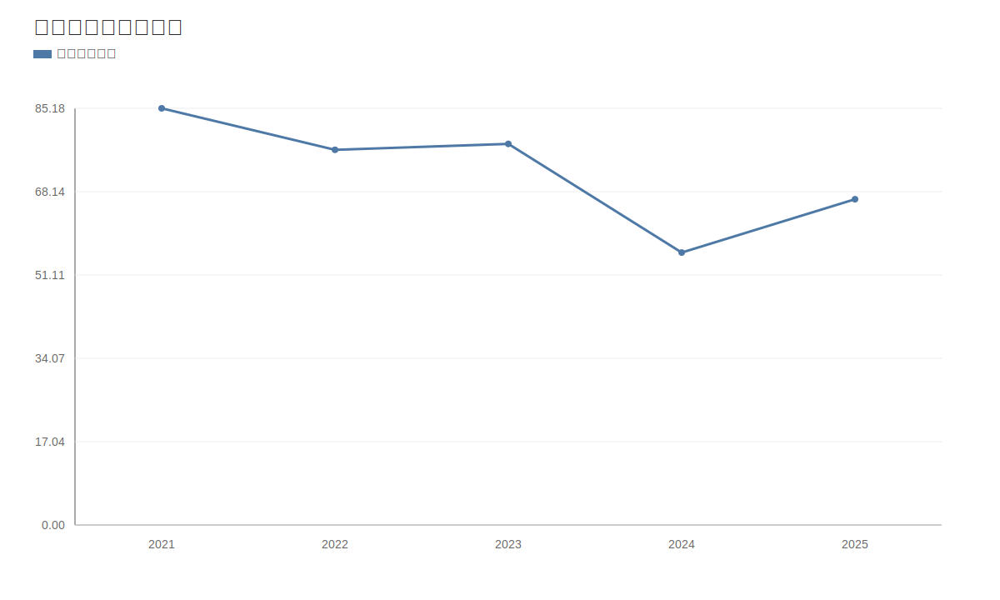

### 2. 净利润趋势图
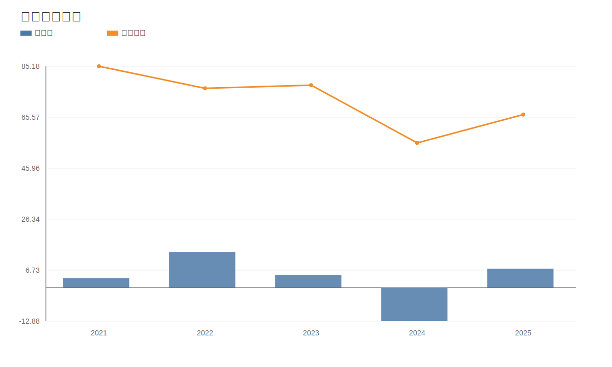

### 3. 毛利率和净利率对比图
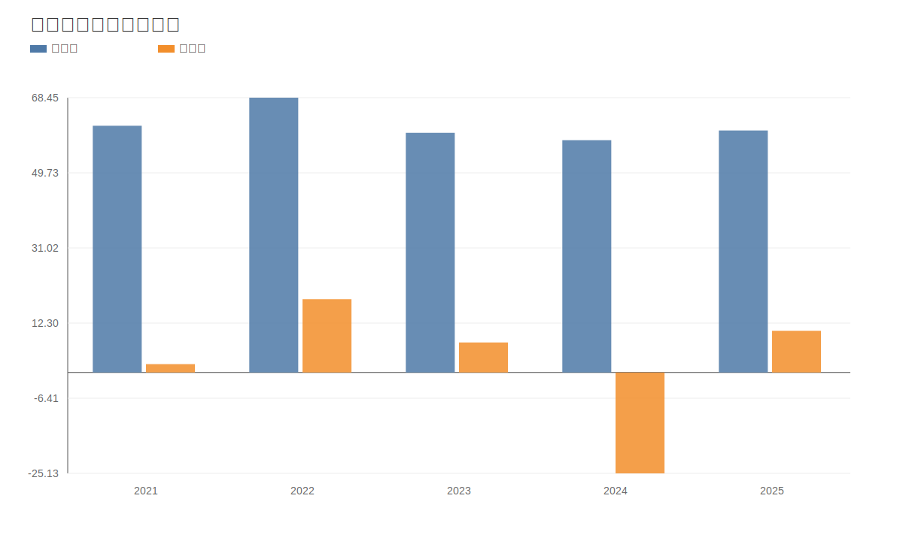

### 4. 分产品收入结构图
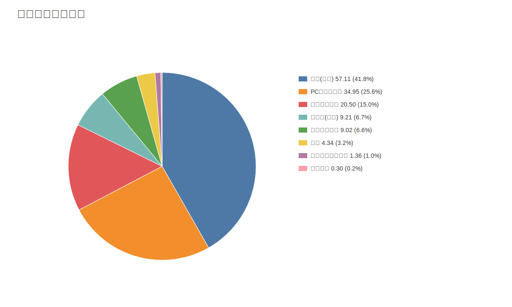

### 4. 分产品收入变化图
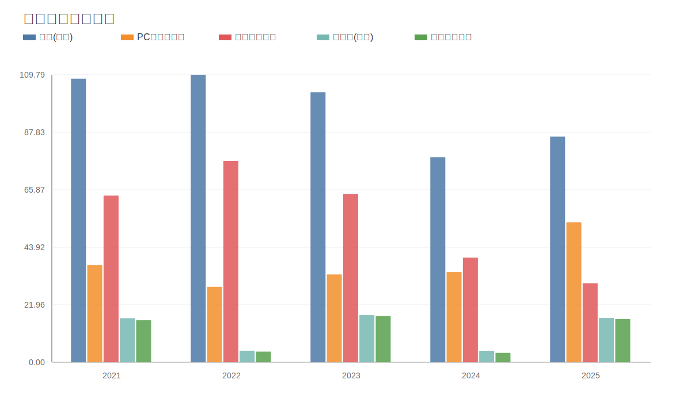

### 5. 分产品利润结构图
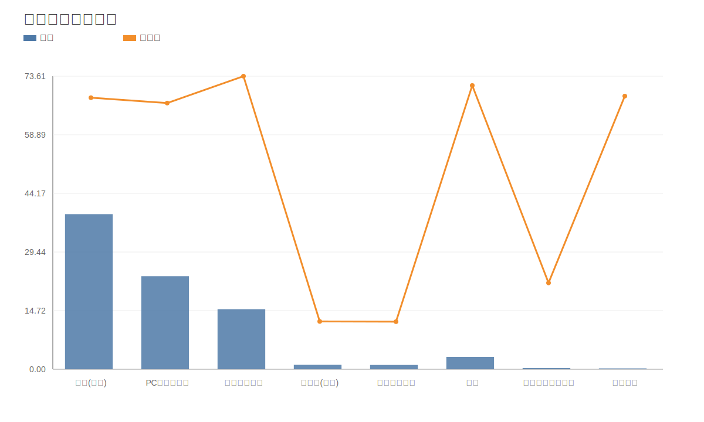

### 6. 分地区收入分布图


### 7. 资产负债表关键数据图
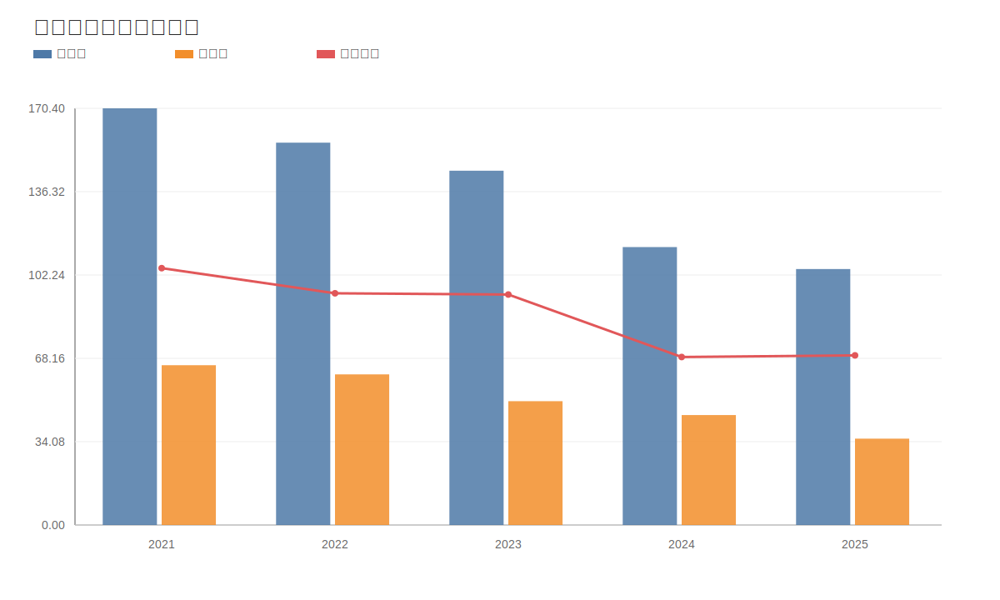

### 8. 自由现金流与经营现金流对比图
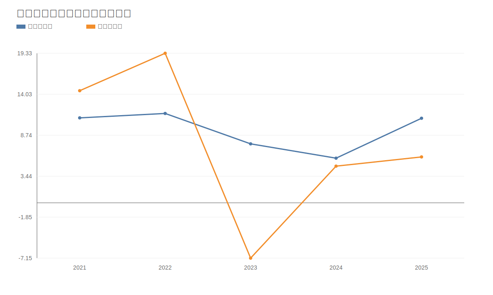

### 9. 股东回报分析图
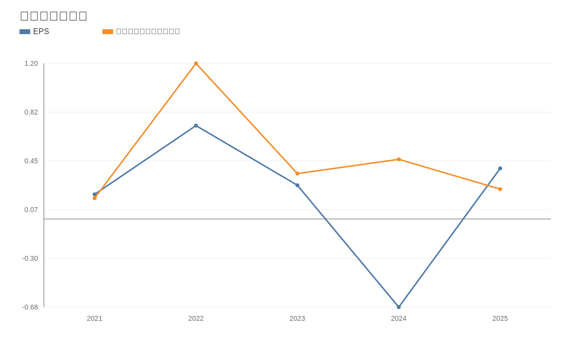

### 10. 财务比率分析图
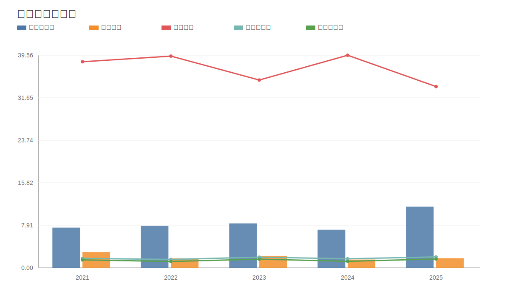

### 11. ROE与ROA对比图
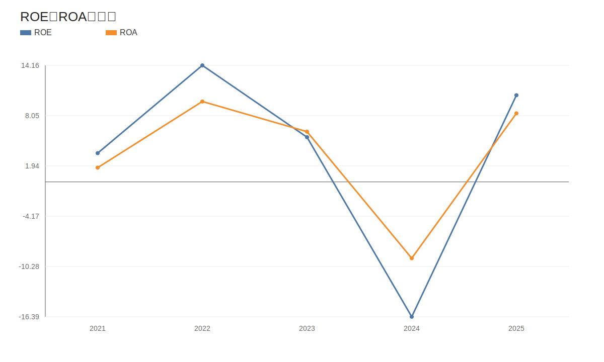
<!-- VALUE_CHARTS_END -->
