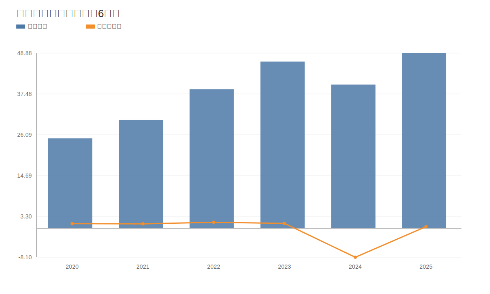
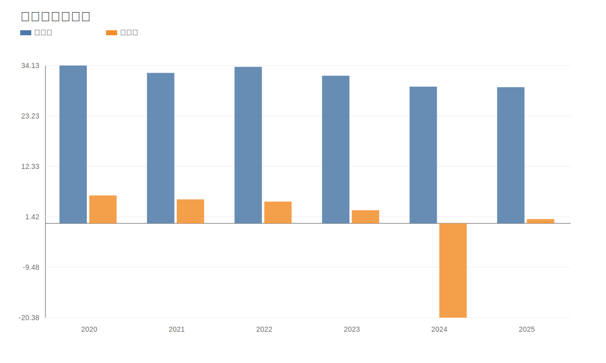
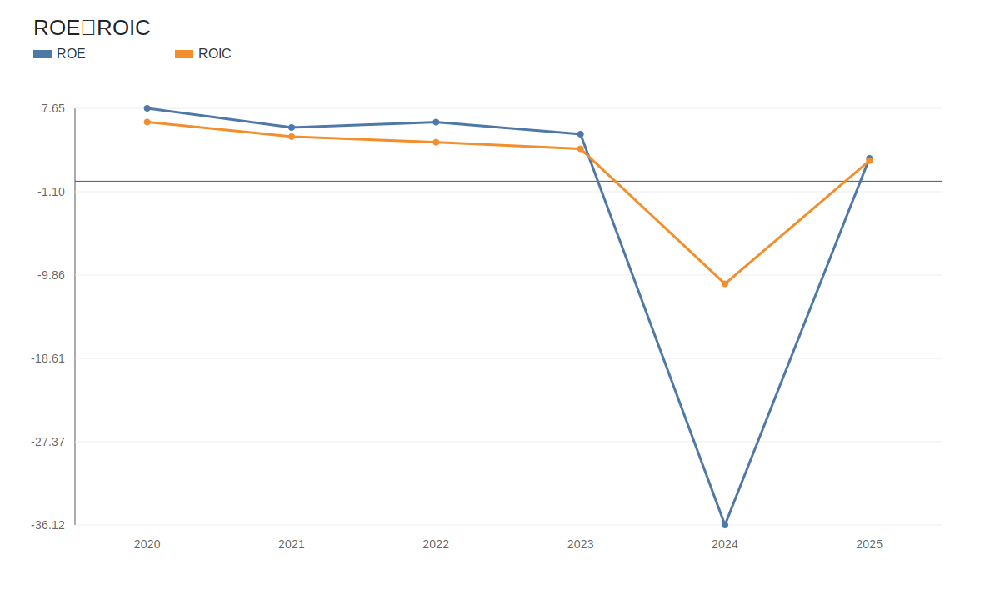
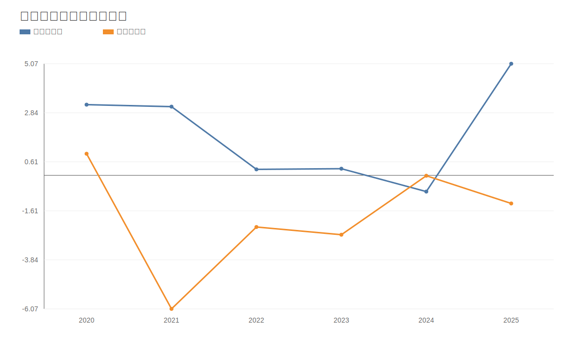
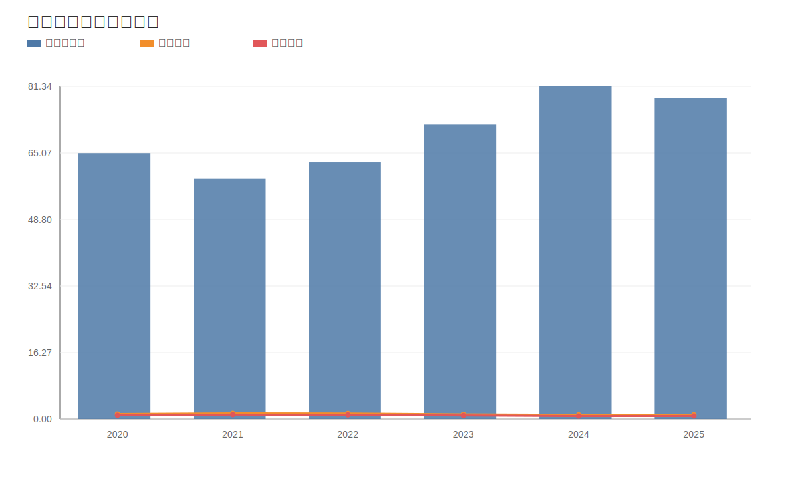
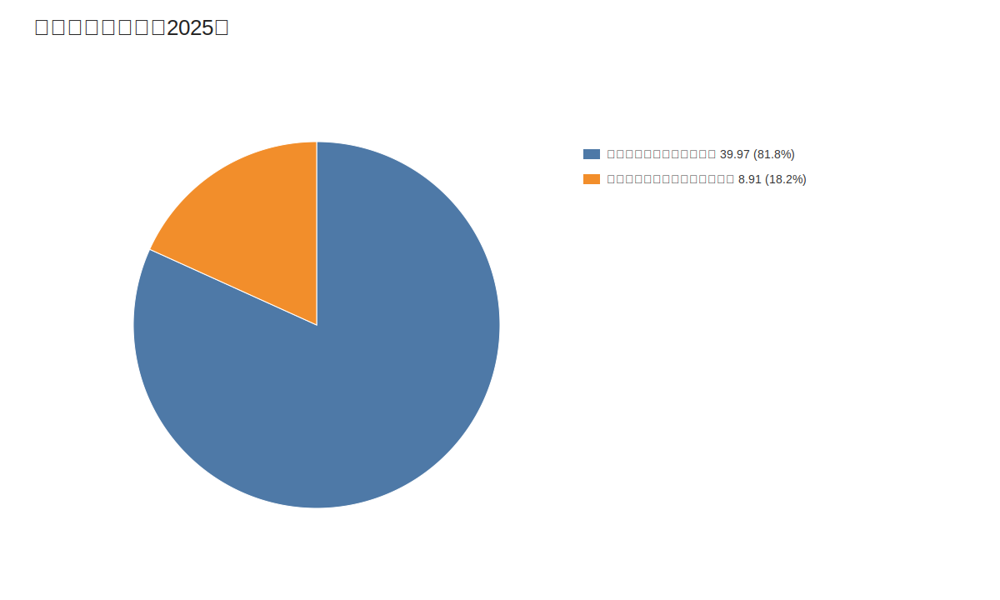
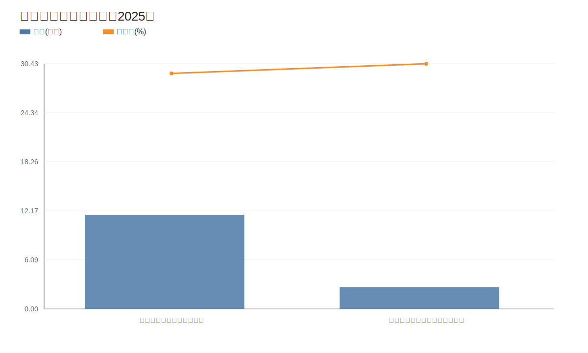
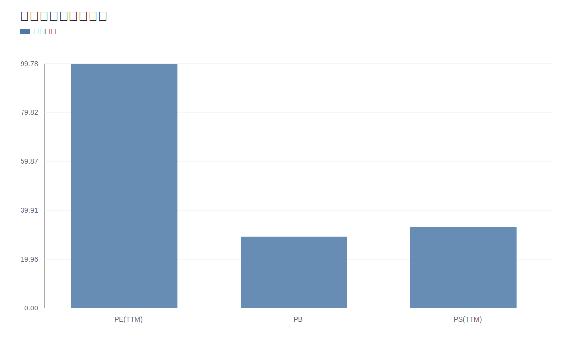

# 埃斯顿（002747.SZ）深度价值研究报告

- 报告时间：2026-04-22 14:59
- 价格日期（绝对日期）：2026-04-21
- 财报日期（绝对日期）：2025-12-31
- 数据口径：tushare-data（行情、估值、财务）+ 公司官网 + 审计意见
- 外部验证：公司官网 `www.estun.com`；最近年度审计意见为“标准无保留意见（中汇会计师事务所）”

## 图表总览
<!-- VALUE_CHARTS_START -->
## 图表图片（自动生成）

### 1. 营收与归母净利润（近6年）

### 2. 毛利率与净利率

### 3. ROE与ROIC

### 4. 经营现金流与自由现金流

### 5. 资产负债率与偿债指标

### 6. 分产品收入结构（2025）

### 7. 分产品利润与毛利率（2025）

### 8. 当前估值在历史分位

<!-- VALUE_CHARTS_END -->

## 1. 公司概况（商业模式优先）
公司收入由两大模块构成：工业机器人及智能制造系统（2025 年收入占比约 81.77%）和自动化核心部件及运动控制系统（约 18.23%）。本质是 ToB 工业自动化解决方案公司，受制造业资本开支周期影响较大。

结论：商业模式清晰、赛道具成长性，但周期属性较强。  
事实：2025 年营收 48.88 亿元，较 2024 年增长 21.93%。  
推断：若下游投资延续回暖，公司收入弹性可持续；若景气回落，利润端会放大波动。

## 2. 行业与竞争格局
公司处于国产工业自动化与机器人链条中段，面临国际品牌和本土厂商双重竞争。可比公司（汇川技术、绿的谐波、昊志机电等）估值与盈利分化明显。

结论：行业空间仍在，但竞争强度高。  
事实：可比样本 PS(TTM) 范围约 2.51x-68.74x，分化显著。  
推断：未来超额回报更依赖份额与盈利质量同步提升，而不只是规模增长。

## 3. 护城河分析（含真伪辨别）
公司护城河主要来自“部件+系统”协同、交付经验与行业 Know-how，而非强品牌溢价。客户切换成本存在，但不是不可替代。

结论：护城河评估为“中-偏弱”，偏工程能力型。  
事实：2025 年公司综合毛利率 29.45%，未体现显著超额定价权。  
推断：若未来 2-3 年 ROIC 不能持续抬升，护城河更可能停留在“可竞争”而非“宽护城河”。

## 4. 管理层与资本配置
管理层稳定，审计意见连续无保留。资本配置上，2024 年出现大额亏损，2025 年恢复盈利但净利率仍偏低，说明“扩张到兑现”的链条仍在修复。

结论：管理层评估为“中性”，仍需业绩连续兑现来证明配置效率。  
事实：2024 年归母净利润 -8.10 亿元，2025 年回到 +0.45 亿元。  
推断：若后续利润率和现金流未同步改善，市场会继续下调对资本配置质量的容忍度。

## 5. 财务分析（成长/盈利/健康/现金流）
### 5.1 成长性
2020-2025 年营收从 25.10 亿元增至 48.88 亿元，规模增长明确，但利润波动剧烈。

结论：收入成长成立，利润成长不稳定。  
事实：2025 年收入同比 +21.93%，但利润仍处修复期。  
推断：公司当前处于“增收先行、增利滞后”阶段。

### 5.2 盈利能力
2025 年毛利率 29.45%，净利率 0.93%，ROE 2.40%，ROIC 2.16%，显著低于高质量制造公司的常见区间。

结论：盈利质量偏弱。  
事实：毛利率较 2020 年（34.13%）下移，净利率仍低。  
推断：若费用率与产品结构不能改善，利润弹性将持续受限。

### 5.3 财务健康
截至 2025 年末，资产负债率 78.56%，流动比率 1.02，速动比率 0.74；有息负债约 24.94 亿元，货币资金约 8.96 亿元。

结论：杠杆偏高，流动性安全垫偏薄。  
事实：净债务约 15.98 亿元。  
推断：在需求波动或融资环境收紧时，财务约束会加大经营压力。

### 5.4 现金流质量
2025 年经营现金流 5.07 亿元，较 2024 年明显改善，但自由现金流仍为 -1.28 亿元。

结论：经营现金流修复是积极信号，但“可分配现金流”尚未形成闭环。  
事实：过去多年自由现金流多为负值。  
推断：高估值若要维持，必须看到 FCF 连续转正。

## 6. 成长驱动
增长驱动来自机器人渗透提升、国产替代、系统集成需求扩展与核心部件协同。当前最大看点是“收入增长向利润和现金流的转化效率”。

结论：成长逻辑存在，但兑现质量是关键。  
事实：两大主业在 2025 年共同贡献增量收入。  
推断：未来 3-5 年若仅“放量不提质”，估值上修空间有限。

## 7. 风险分析（含幸存者偏差）
核心风险包括：行业需求周期、价格竞争、技术迭代、杠杆压力、回款与现金流波动。

结论：抗风险能力评估“中-偏弱”。  
事实：2024 年公司经历深度亏损，2025 年虽修复但净利率仍低。  
推断：在行业低景气年份，公司利润端仍可能出现高波动。

## 8. 估值分析
2026-04-21 收盘价 21.18 元，对应 PE(TTM) 455.79x（历史分位约 99.78%）、PB 6.38x（约 29.17% 分位）、PS(TTM) 4.19x（约 33.07% 分位）。估值呈现“利润口径极贵、资产和收入口径中位”的分裂。

结论：当前安全边际不足，估值对未来盈利修复有较高预支。  
事实：反向 DCF（FCF 利润率 3%、WACC 9.5%、永续增速 2.5%）隐含未来 5 年收入 CAGR 约 50%。  
推断：若盈利修复不及预期，估值回撤风险较大。

## 9. 投资判断（多头/空头/跟踪指标）
多头逻辑：
1. 自动化和机器人长期渗透率提升。  
2. 公司具备“部件+系统”协同能力。  
3. 2025 年收入与经营现金流明显修复。

空头逻辑：
1. ROE/ROIC 与净利率仍偏低。  
2. 杠杆高、FCF 仍为负。  
3. 当前价格隐含较激进增长预期。

核心跟踪指标：
1. 单季净利率是否稳定回到 3%-5%。  
2. 自由现金流是否连续两个半年度转正。  
3. 资产负债率是否回落到 70%附近。

结论：当前更适合“持续跟踪”，不适合高仓位抢跑。  
事实：基本面修复尚处早期，估值不便宜。  
推断：等待盈利与现金流双确认后，风险回报比更优。

## 10. 最终结论
- 是否好公司：有产业价值与执行能力，但当前财务质量一般。  
- 是否具备长期投资价值：具备，但兑现路径仍需验证。  
- 当前价格是否值得买入：性价比偏弱。  
- 投资建议：**观察（偏谨慎）**。

结论：产业逻辑成立，估值逻辑仍需业绩兑现。  
事实：收入增长快于利润质量修复。  
推断：2026-2027 年是验证“增长转盈利”的关键窗口。

## 11. 总评分（100分）
- 商业模式（15%）：11 分  
- 护城河（20%）：11 分  
- 管理层与资本配置（15%）：8 分  
- 财务质量（20%）：7 分  
- 风险控制（15%）：6 分  
- 估值性价比（15%）：5 分  
- 最终总分：**48/100**

结论：处于“可跟踪、低确定性”区间。  
事实：扣分集中在财务质量与估值匹配。  
推断：若 FCF 与 ROIC 同步改善，总分才有系统性上行空间。

## 12. 三个终极问题（必须回答）
1. 如果提价 5%，客户会不会流失？  
结论：大概率会出现结构性流失。  
事实：当前利润率水平尚不足以证明强定价权。  
推断：只有在高附加值整线解决方案里，提价传导才可能更顺畅。

2. 公司赚的钱有没有被管理层浪费？  
结论：不能直接定性“浪费”，但资本效率偏弱。  
事实：2024 年大额亏损，2025 年恢复但 FCF 仍负。  
推断：若未来两年仍“增收不增现”，市场将继续施压估值。

3. 在行业最差年份，公司是怎么活下来的？  
结论：依靠规模、产业链位置与融资能力穿越压力。  
事实：2024 年深亏但审计意见仍为标准无保留。  
推断：公司生存能力尚可，但距离高韧性复利公司仍有差距。

---

数据缺口说明：
- `anns_d` 接口权限不足，公告细粒度验证有限。  
- `news` 接口存在频率限制，新闻样本不足。  
- 本报告外部验证以财务披露、审计信息和公司官网为主。
