# 德赛西威（002920.SZ）价值分析报告草稿

- 生成时间：2026-05-13 01:35:03
- 自动化脚本：`.agents/skills/value-report/value_report_scaffold.py`
- 数据口径：数据库字段定义以 `app/models/models.py` 为准
- 公司信息：行业 汽车配件｜地区 广东｜上市日期 20171226
- 管理层：董事长 高大鹏｜总经理 徐建｜员工 11940
- 主营业务：主要产品:车载信息娱乐系统,车载空调控制器,驾驶信息显示系统等.主营业务:汽车电子产品的研发设计,生产和销售.
- 提示：本文件已自动填充定量部分，定性模块请结合最新公告与行业资料补充。

## 自动填充数据（可直接引用）
### 最新估值
- 交易日：20260511
- 收盘价：104.47 元
- PE(TTM)：26.73 倍
- PB：4.32 倍
- PS(TTM)：1.93 倍
- 股息率(TTM)：1.19%
- 总市值：623.49 亿元

### 最新财务快照
- 报告期：20260331
- 营收：64.95亿（同比 -4.37%）
- 归母净利润：4.61亿（同比 -20.74%）
- 经营现金流：11.16亿（同比 83.97%）
- 自由现金流：11.08亿
- 毛利率：18.60%，净利率：7.20%
- ROE：3.02%，ROIC：2.83%
- 资产负债率：49.36%，流动比率：1.67
- 经营现金流/利润：197.25%
- 货币资金：17.90亿，有息负债：6.55亿，净现金：11.35亿

### 近五年年报趋势
| 年度 | 营收 | 营收同比 | 归母净利 | 净利同比 | 毛利率 | 净利率 | ROE | ROIC | 资产负债率 | 经营现金流 | 自由现金流 | 现净比 |
| --- | --- | --- | --- | --- | --- | --- | --- | --- | --- | --- | --- | --- |
| 2025 | 325.57亿 | 17.88% | 24.54亿 | 22.38% | 19.07% | 7.60% | 19.58% | 17.83% | 47.86% | 28.84亿 | 16.04亿 | 117.53% |
| 2024 | 276.18亿 | 26.06% | 20.05亿 | 29.62% | 19.88% | 7.31% | 22.79% | 20.25% | 54.54% | 14.94亿 | -2.88亿 | 74.49% |
| 2023 | 219.08亿 | 46.71% | 15.47亿 | 30.65% | 20.44% | 7.04% | 21.44% | 18.60% | 55.26% | 11.41亿 | 4.29亿 | 73.77% |
| 2022 | 149.33亿 | 56.05% | 11.84亿 | 42.13% | 23.03% | 7.84% | 20.04% | 17.48% | 52.44% | 6.10亿 | -5.20亿 | 51.49% |
| 2021 | 95.69亿 | N/A | 8.33亿 | N/A | 24.60% | 8.69% | 16.69% | 15.95% | 46.64% | 8.43亿 | 4.26亿 | 101.20% |

- 近五年营收CAGR：35.81%
- 近五年净利CAGR：31.01%

### 分红与审计
#### 已实施分红
2025年已实施现金分红（税前）合计：每股 1.200 元
2024年已实施现金分红（税前）合计：每股 0.840 元
2023年已实施现金分红（税前）合计：每股 0.550 元
2022年已实施现金分红（税前）合计：每股 0.450 元
2021年已实施现金分红（税前）合计：每股 0.300 元

#### 审计意见
- 20251231：标准无保留意见（容诚会计师事务所）
- 20241231：标准无保留意见（容诚会计师事务所）
- 20231231：标准无保留意见（容诚会计师事务所）
- 20221231：标准无保留意见（容诚会计师事务所）
- 20211231：标准无保留意见（容诚会计师事务所）

## ECharts 图表数据（option）

- 说明：以下 `option` 可直接用于前端图表渲染；单位已在坐标轴标注。

### 1. 主营业务收入趋势图
```json
{
  "title": {
    "text": "主营业务收入趋势（近5年）"
  },
  "tooltip": {
    "trigger": "axis"
  },
  "legend": {
    "top": 24,
    "data": [
      "主营业务收入"
    ]
  },
  "xAxis": {
    "type": "category",
    "data": [
      "2021",
      "2022",
      "2023",
      "2024",
      "2025"
    ]
  },
  "yAxis": {
    "type": "value",
    "name": "亿元"
  },
  "series": [
    {
      "name": "主营业务收入",
      "type": "line",
      "smooth": true,
      "data": [
        95.69,
        149.33,
        219.08,
        276.18,
        325.57
      ]
    }
  ]
}
```

### 2. 净利润趋势图
```json
{
  "title": {
    "text": "净利润趋势（近5年）"
  },
  "tooltip": {
    "trigger": "axis"
  },
  "legend": {
    "top": 24,
    "data": [
      "净利润",
      "营业收入"
    ]
  },
  "xAxis": {
    "type": "category",
    "data": [
      "2021",
      "2022",
      "2023",
      "2024",
      "2025"
    ]
  },
  "yAxis": [
    {
      "type": "value",
      "name": "亿元"
    },
    {
      "type": "value",
      "name": "亿元"
    }
  ],
  "series": [
    {
      "name": "净利润",
      "type": "bar",
      "data": [
        8.33,
        11.84,
        15.47,
        20.05,
        24.54
      ]
    },
    {
      "name": "营业收入",
      "type": "line",
      "yAxisIndex": 1,
      "data": [
        95.69,
        149.33,
        219.08,
        276.18,
        325.57
      ]
    }
  ]
}
```

### 3. 毛利率和净利率对比图
```json
{
  "title": {
    "text": "毛利率 vs 净利率"
  },
  "tooltip": {
    "trigger": "axis"
  },
  "legend": {
    "top": 24,
    "data": [
      "毛利率",
      "净利率"
    ]
  },
  "xAxis": {
    "type": "category",
    "data": [
      "2021",
      "2022",
      "2023",
      "2024",
      "2025"
    ]
  },
  "yAxis": {
    "type": "value",
    "name": "%"
  },
  "series": [
    {
      "name": "毛利率",
      "type": "bar",
      "data": [
        24.6,
        23.03,
        20.44,
        19.88,
        19.07
      ]
    },
    {
      "name": "净利率",
      "type": "bar",
      "data": [
        8.69,
        7.84,
        7.04,
        7.31,
        7.6
      ]
    }
  ]
}
```

### 4. 分产品收入结构图
```json
{
  "title": {
    "text": "分产品收入结构（20251231）"
  },
  "tooltip": {
    "trigger": "item"
  },
  "legend": {
    "type": "scroll",
    "top": 24
  },
  "series": [
    {
      "type": "pie",
      "radius": "55%",
      "data": [
        {
          "name": "汽车电子",
          "value": 325.57
        },
        {
          "name": "智能座舱",
          "value": 205.85
        },
        {
          "name": "智能驾驶",
          "value": 97.0
        },
        {
          "name": "国外",
          "value": 24.1
        },
        {
          "name": "其他主营业务",
          "value": 22.72
        }
      ]
    }
  ]
}
```

### 4. 分产品收入变化图
```json
{
  "title": {
    "text": "分产品收入变化（近5年）"
  },
  "tooltip": {
    "trigger": "axis"
  },
  "legend": {
    "type": "scroll",
    "top": 24,
    "data": [
      "汽车电子",
      "智能座舱",
      "智能驾驶",
      "国外",
      "其他主营业务"
    ]
  },
  "xAxis": {
    "type": "category",
    "data": [
      "2021",
      "2022",
      "2023",
      "2024",
      "2025"
    ]
  },
  "yAxis": {
    "type": "value",
    "name": "亿元"
  },
  "series": [
    {
      "name": "汽车电子",
      "type": "bar",
      "stack": "total",
      "data": [
        136.52,
        213.4,
        306.32,
        393.1,
        472.01
      ]
    },
    {
      "name": "智能座舱",
      "type": "bar",
      "stack": "total",
      "data": [
        112.31,
        169.99,
        220.53,
        261.95,
        300.45
      ]
    },
    {
      "name": "智能驾驶",
      "type": "bar",
      "stack": "total",
      "data": [
        19.58,
        34.34,
        63.24,
        99.81,
        138.47
      ]
    },
    {
      "name": "国外",
      "type": "bar",
      "stack": "total",
      "data": [
        11.85,
        15.87,
        23.2,
        24.66,
        34.48
      ]
    },
    {
      "name": "其他主营业务",
      "type": "bar",
      "stack": "total",
      "data": [
        4.63,
        9.06,
        22.56,
        31.35,
        33.1
      ]
    }
  ]
}
```

### 5. 分产品利润结构图
```json
{
  "title": {
    "text": "分产品利润结构（20251231）"
  },
  "tooltip": {
    "trigger": "axis"
  },
  "legend": {
    "top": 24,
    "data": [
      "利润",
      "毛利率"
    ]
  },
  "xAxis": {
    "type": "category",
    "data": [
      "汽车电子",
      "智能座舱",
      "智能驾驶",
      "国外",
      "其他主营业务"
    ]
  },
  "yAxis": [
    {
      "type": "value",
      "name": "亿元"
    },
    {
      "type": "value",
      "name": "%"
    }
  ],
  "series": [
    {
      "name": "利润",
      "type": "bar",
      "data": [
        62.08,
        38.76,
        15.86,
        6.57,
        7.45
      ]
    },
    {
      "name": "毛利率",
      "type": "line",
      "yAxisIndex": 1,
      "data": [
        19.07,
        18.83,
        16.36,
        27.28,
        32.81
      ]
    }
  ]
}
```

### 6. 分地区收入分布图
```json
{
  "title": {
    "text": "分地区收入分布（20251231）"
  },
  "tooltip": {
    "trigger": "item"
  },
  "legend": {
    "type": "scroll",
    "top": 24
  },
  "series": [
    {
      "type": "pie",
      "radius": "55%",
      "data": [
        {
          "name": "中国大陆",
          "value": 301.47
        },
        {
          "name": "其他业务(地区)",
          "value": 0.0
        }
      ]
    }
  ]
}
```

### 7. 资产负债表关键数据图
```json
{
  "title": {
    "text": "资产负债表关键数据（近5年）"
  },
  "tooltip": {
    "trigger": "axis"
  },
  "legend": {
    "top": 24,
    "data": [
      "总资产",
      "总负债",
      "股东权益"
    ]
  },
  "xAxis": {
    "type": "category",
    "data": [
      "2021",
      "2022",
      "2023",
      "2024",
      "2025"
    ]
  },
  "yAxis": {
    "type": "value",
    "name": "亿元"
  },
  "series": [
    {
      "name": "总资产",
      "type": "bar",
      "stack": "capital",
      "data": [
        101.52,
        137.56,
        180.14,
        214.83,
        298.45
      ]
    },
    {
      "name": "总负债",
      "type": "bar",
      "stack": "capital",
      "data": [
        47.35,
        72.13,
        99.54,
        117.18,
        142.83
      ]
    },
    {
      "name": "股东权益",
      "type": "line",
      "data": [
        54.16,
        65.43,
        80.6,
        97.66,
        155.63
      ]
    }
  ]
}
```

### 8. 自由现金流与经营现金流对比图
```json
{
  "title": {
    "text": "自由现金流 vs 经营现金流"
  },
  "tooltip": {
    "trigger": "axis"
  },
  "legend": {
    "top": 24,
    "data": [
      "经营现金流",
      "自由现金流"
    ]
  },
  "xAxis": {
    "type": "category",
    "data": [
      "2021",
      "2022",
      "2023",
      "2024",
      "2025"
    ]
  },
  "yAxis": {
    "type": "value",
    "name": "亿元"
  },
  "series": [
    {
      "name": "经营现金流",
      "type": "line",
      "data": [
        8.43,
        6.1,
        11.41,
        14.94,
        28.84
      ]
    },
    {
      "name": "自由现金流",
      "type": "line",
      "data": [
        4.26,
        -5.2,
        4.29,
        -2.88,
        16.04
      ]
    }
  ]
}
```

### 9. 股东回报分析图
```json
{
  "title": {
    "text": "股东回报（EPS/分红）"
  },
  "tooltip": {
    "trigger": "axis"
  },
  "legend": {
    "top": 24,
    "data": [
      "EPS",
      "每股现金分红（已实施）"
    ]
  },
  "xAxis": {
    "type": "category",
    "data": [
      "2021",
      "2022",
      "2023",
      "2024",
      "2025"
    ]
  },
  "yAxis": {
    "type": "value",
    "name": "元"
  },
  "series": [
    {
      "name": "EPS",
      "type": "line",
      "data": [
        1.51,
        2.15,
        2.81,
        3.63,
        4.35
      ]
    },
    {
      "name": "每股现金分红（已实施）",
      "type": "line",
      "data": [
        0.3,
        0.45,
        0.55,
        0.84,
        1.2
      ]
    }
  ]
}
```

### 10. 财务比率分析图
```json
{
  "title": {
    "text": "关键财务比率（近5年）"
  },
  "tooltip": {
    "trigger": "axis"
  },
  "legend": {
    "type": "scroll",
    "top": 24,
    "data": [
      "资产负债率",
      "流动比率",
      "速动比率",
      "应收周转率",
      "存货周转率"
    ]
  },
  "xAxis": {
    "type": "category",
    "data": [
      "2021",
      "2022",
      "2023",
      "2024",
      "2025"
    ]
  },
  "yAxis": [
    {
      "type": "value",
      "name": "比率/%"
    },
    {
      "type": "value",
      "name": "周转率"
    }
  ],
  "series": [
    {
      "name": "资产负债率",
      "type": "line",
      "data": [
        46.64,
        52.44,
        55.26,
        54.54,
        47.86
      ]
    },
    {
      "name": "流动比率",
      "type": "line",
      "data": [
        1.79,
        1.66,
        1.57,
        1.51,
        1.73
      ]
    },
    {
      "name": "速动比率",
      "type": "line",
      "data": [
        1.31,
        1.11,
        1.19,
        1.17,
        1.37
      ]
    },
    {
      "name": "应收周转率",
      "type": "bar",
      "yAxisIndex": 1,
      "data": [
        4.24,
        4.24,
        3.77,
        3.29,
        3.36
      ]
    },
    {
      "name": "存货周转率",
      "type": "bar",
      "yAxisIndex": 1,
      "data": [
        4.6,
        4.22,
        5.22,
        6.34,
        6.19
      ]
    }
  ]
}
```

### 11. ROE与ROA对比图
```json
{
  "title": {
    "text": "ROE vs ROA（近5年）"
  },
  "tooltip": {
    "trigger": "axis"
  },
  "legend": {
    "top": 24,
    "data": [
      "ROE",
      "ROA"
    ]
  },
  "xAxis": {
    "type": "category",
    "data": [
      "2021",
      "2022",
      "2023",
      "2024",
      "2025"
    ]
  },
  "yAxis": {
    "type": "value",
    "name": "%"
  },
  "series": [
    {
      "name": "ROE",
      "type": "line",
      "data": [
        16.69,
        20.04,
        21.44,
        22.79,
        19.58
      ]
    },
    {
      "name": "ROA",
      "type": "line",
      "data": [
        9.72,
        9.8,
        9.82,
        10.73,
        10.08
      ]
    }
  ]
}
```

## 1. 公司概况（商业模式优先）
- 公司是如何赚钱的？
- 收入来源构成（核心业务占比）
- 客户类型（To B / To C / 政府）
- 是否具备持续性收入（一次性 vs 订阅/复购）
- 是否依赖单一客户或区域

### 结论
- 商业模式是否简单、可理解
- 是否具备长期可持续性

## 2. 行业与竞争格局
- 行业空间（市场规模、天花板）
- 行业阶段（成长 / 成熟 / 衰退）
- 行业增速
- 主要竞争对手
- 市场份额与行业集中度
- 公司在产业链中的位置

### 结论
- 是否属于优质赛道
- 公司是否处于有利竞争位置
- 行业未来3-5年趋势

## 3. 护城河分析（含真伪辨别）
- 品牌优势
- 成本优势
- 网络效应
- 转换成本
- 技术壁垒
- 渠道优势

### 护城河真伪辨别
- 如果产品提价 5%，客户是否会流失？
- 客户是否对价格敏感？
- 是否存在“非它不可”的使用场景？
- 替代品是否容易出现？
- 客户更换供应商的成本高不高？

### 结论
- 护城河类型
- 护城河强度：强 / 中 / 弱 / 伪护城河
- 是否具备真实定价权

## 4. 管理层与资本配置（重点）
- 管理层背景与稳定性
- 是否存在诚信问题（造假 / 处罚 / 诉讼）
- 过往战略是否理性

### 资本配置历史
- 是否长期分红
- 是否进行回购注销（而非股权激励稀释）
- 并购历史（成功 / 失败 / 频繁）
- 是否存在盲目多元化扩张
- 资本开支是否合理

### 结论
- 管理层类型：价值创造者 / 中性 / 价值毁灭者
- 是否值得长期信任

## 5. 财务分析
### 5.1 成长性
- 营收增长率（近3-5年）
- 净利润增长率
- 增长是否稳定

### 结论
- 是否具备持续成长能力

### 5.2 盈利能力
- 毛利率
- 净利率
- ROE / ROIC

### 结论
- 是否具备定价权
- 盈利质量如何

### 5.3 财务健康
- 资产负债率
- 有息负债
- 现金储备
- 短期偿债能力

### 结论
- 是否存在财务风险

### 5.4 现金流质量
- 经营现金流
- 自由现金流
- 净利润与现金流是否匹配

### 结论
- 利润是否真实
- 是否具备造血能力

## 6. 成长驱动
- 未来3-5年增长来源
- 是否依赖提价 / 扩张 / 新业务
- 增长逻辑是否清晰

### 结论
- 成长是否可持续

## 7. 风险分析（含幸存者偏差）
- 政策风险
- 行业竞争风险
- 技术替代风险
- 财务风险
- 客户集中风险

### 幸存者偏差检验
- 行业历史最差时期是什么时候？
- 当时发生了什么（金融危机 / 疫情 / 监管）？
- 公司当时表现：是否大幅亏损 / 现金流断裂 / 接近破产？
- 公司在极端情况下是：变强 / 持平 / 衰退

### 结论
- 抗风险能力：强 / 中 / 弱
- 是否属于“穿越周期公司”

## 8. 估值分析
- PE / PB / PS / PEG / EV/EBITDA
- 当前估值 vs 历史估值
- 当前估值 vs 行业对比

### 结论
- 当前是否高估 / 低估 / 合理
- 是否具备安全边际

## 9. 投资判断
### 多头逻辑
1. 
2. 
3. 

### 空头逻辑
1. 
2. 
3. 

### 核心跟踪指标
1. 
2. 
3. 

## 最终结论
- 这是否是一家好公司？
- 是否具备长期投资价值？
- 当前价格是否值得买入？
- 投资建议：买入 / 观察 / 回避

## 总评分（100分）
- 商业模式：
- 护城河：
- 管理层：
- 财务：
- 风险：
- 估值：

**最终评分：__ / 100**

## 三个终极问题（必须回答）
1. 如果提价 5%，客户会不会流失？
2. 公司赚的钱有没有被管理层浪费？
3. 在行业最差年份，公司是怎么活下来的？

<!-- VALUE_CHARTS_START -->
## 图表图片（自动生成）

### 1. 主营业务收入趋势图
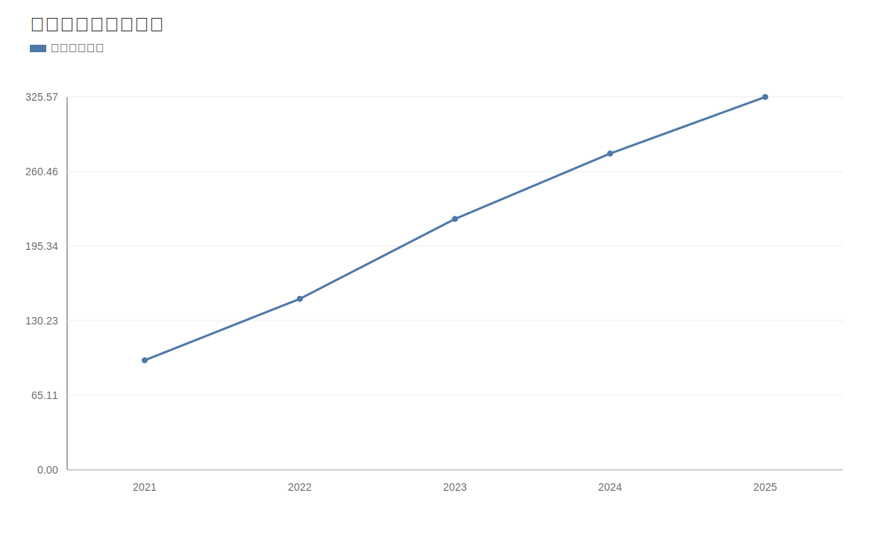

### 2. 净利润趋势图
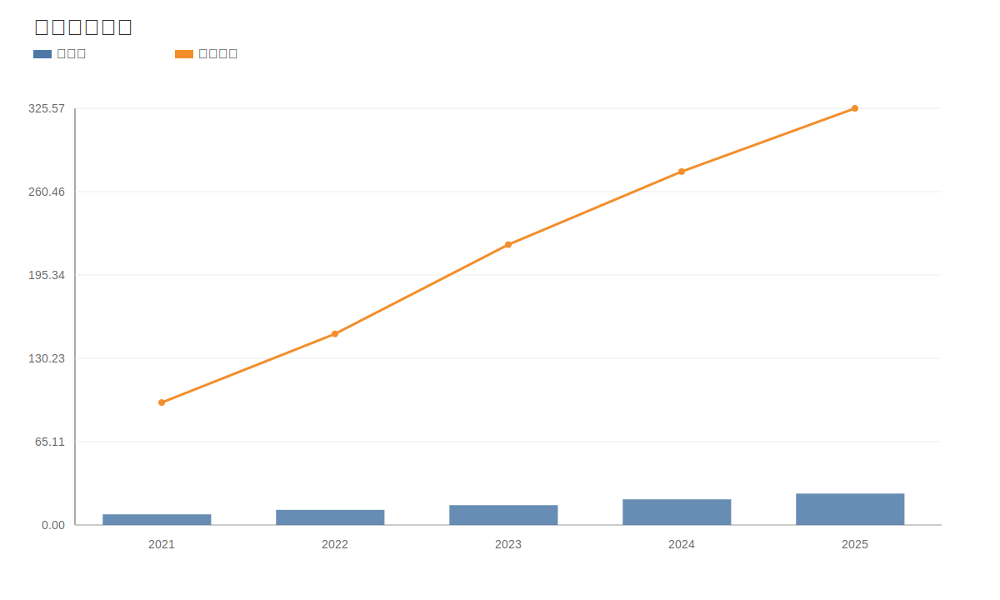

### 3. 毛利率和净利率对比图
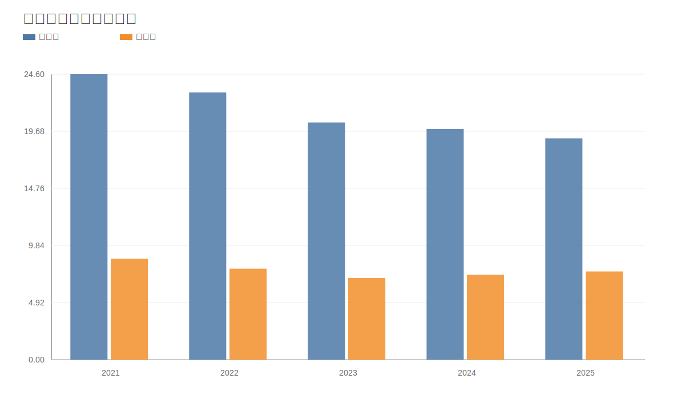

### 4. 分产品收入结构图
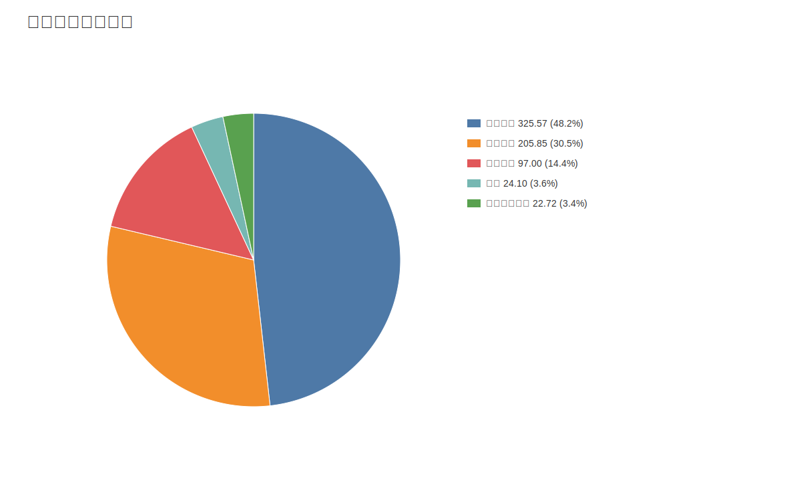

### 4. 分产品收入变化图
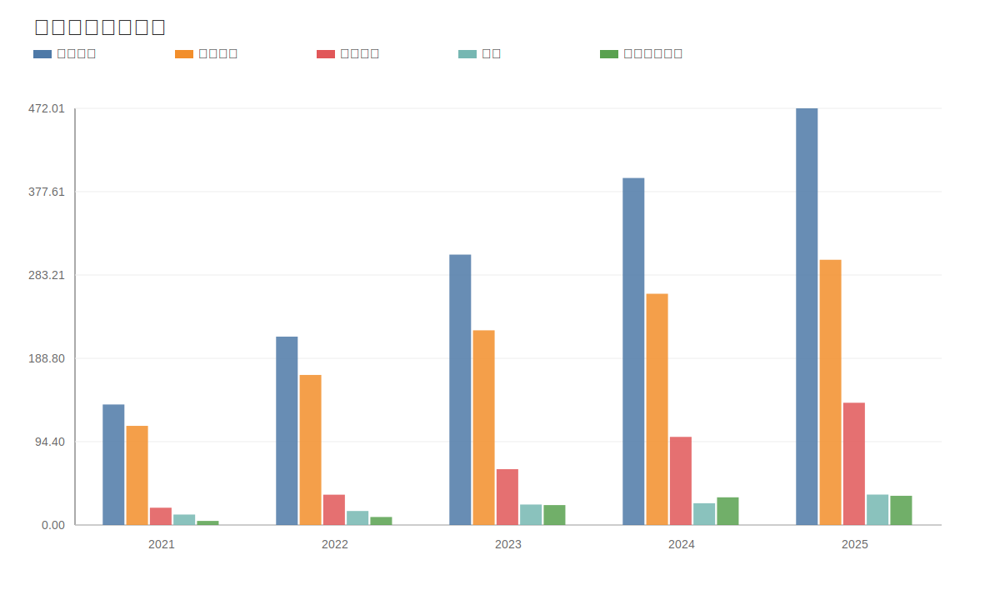

### 5. 分产品利润结构图
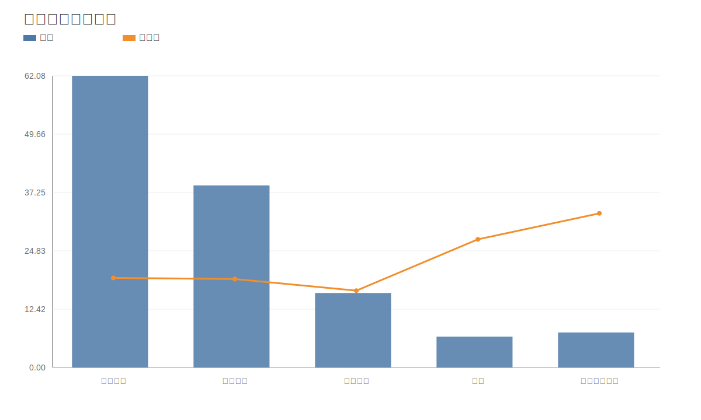

### 6. 分地区收入分布图
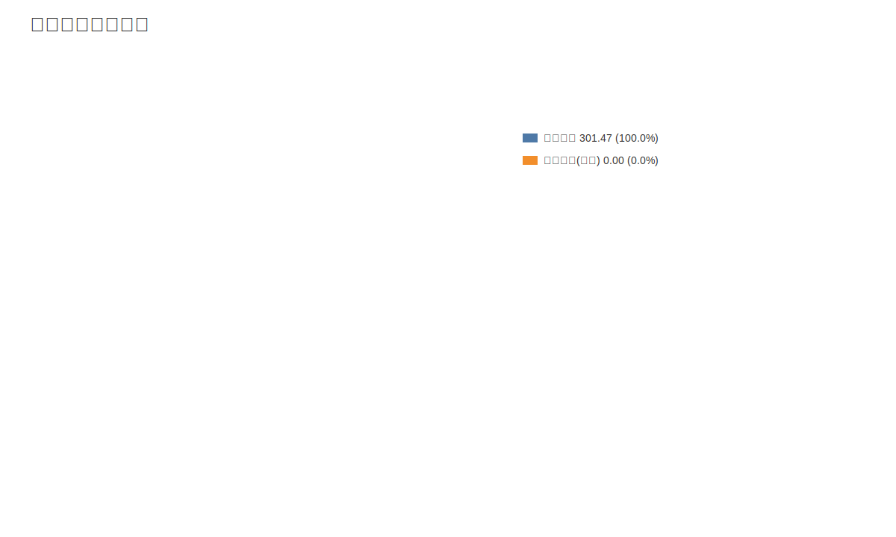

### 7. 资产负债表关键数据图
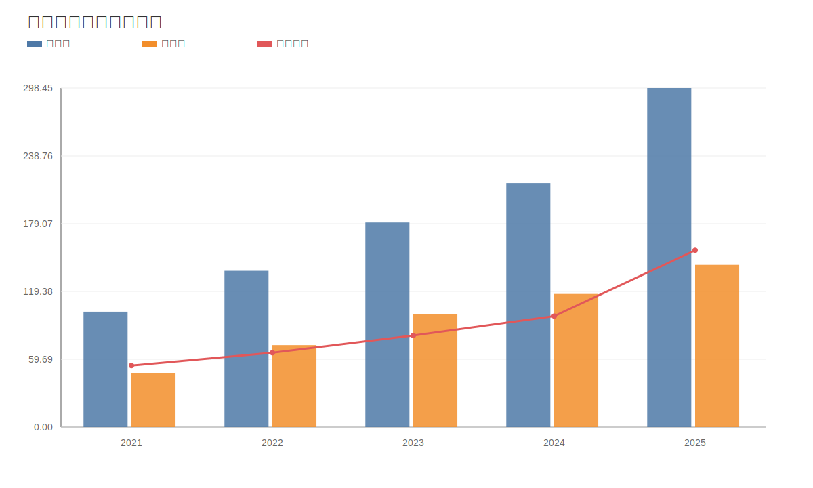

### 8. 自由现金流与经营现金流对比图
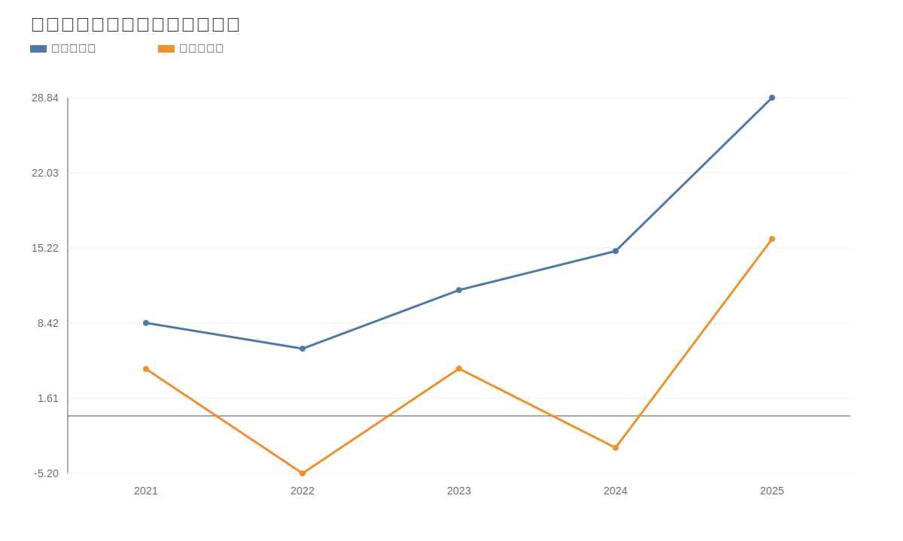

### 9. 股东回报分析图
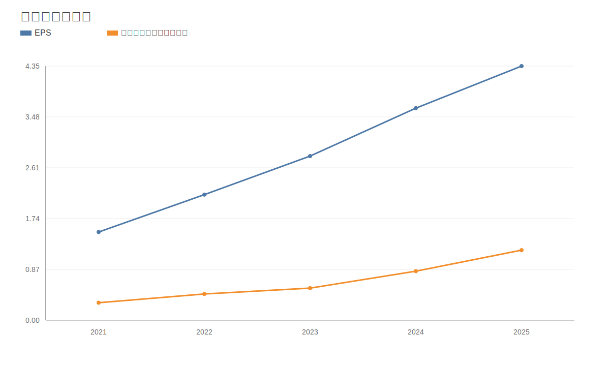

### 10. 财务比率分析图
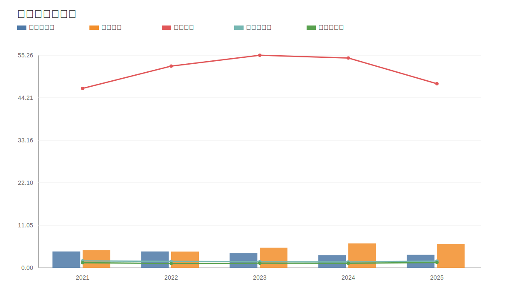

### 11. ROE与ROA对比图
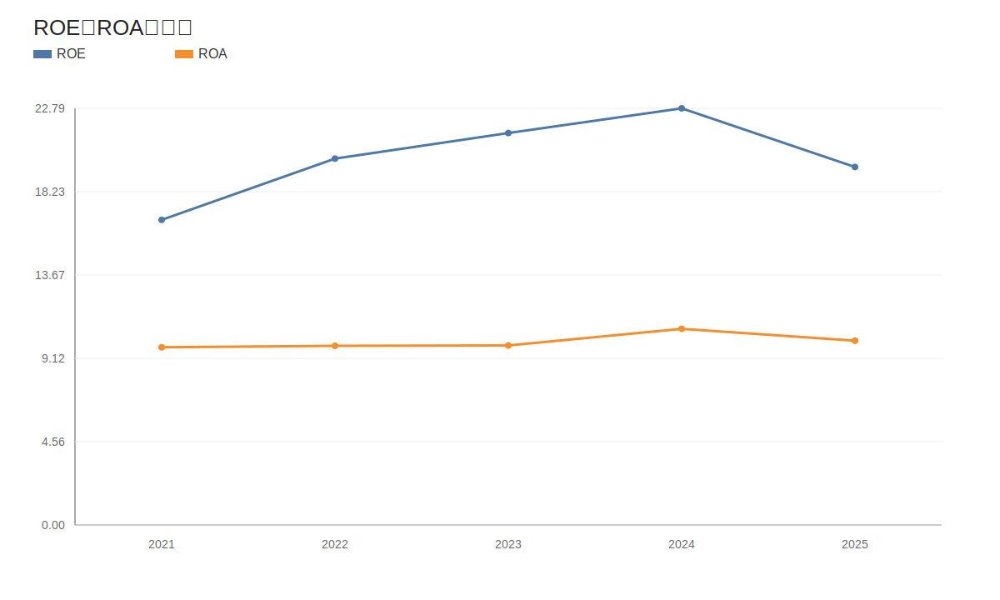
<!-- VALUE_CHARTS_END -->
