# 爱尔眼科（300015）深度价值研究报告

- 报告日期：2026-06-01
- 标的：爱尔眼科（300015.SZ）
- 数据截止：行情截至 2026-05-29；财务截至 2026-03-31（Q1）
- 口径说明：财务主口径来自本地数据库（Tushare落地库）；外部增量验证来自公司公告与交易所披露。

## 1. 公司概况
爱尔眼科是民营连锁眼科医疗龙头，收入核心来自眼科诊疗、手术服务与医学验光配镜。国内采用分级连锁模式，境外以并购和平台化运营扩张。

### 结论：
商业模式清晰、可复制，具备跨区域扩张能力，但对医疗质量与品牌口碑的持续维护要求极高。

### 事实：
- 2025年营收223.53亿元，同比增长6.53%；归母净利32.40亿元，同比下降8.88%。
- 截至2025-12-31，申请版本文件披露其全球运营842家眼科医疗机构（境内663家、境外179家）。
- 2025年门诊量1,889.17万人次，手术量168万例（来自年报摘要披露）。

### 推断：
- “规模+标准化管理+医生体系”仍是主增长引擎。
- 单店效率与学科能力升级比单纯扩张数量更关键，未来增长质量将取决于次新医院爬坡与成熟医院提效。

## 2. 行业与竞争格局
眼科服务处于“需求扩容+消费分层+技术升级”并行阶段，近视防控、白内障、屈光、慢病管理等赛道长期需求明确。

### 结论：
眼科仍是医疗服务里较好的细分赛道，爱尔在全国网络、品牌、学科覆盖和资本能力上处于第一梯队。

### 事实：
- 对比同类可比公司（华厦眼科、普瑞眼科）与消费医疗龙头（通策医疗），爱尔体量明显更大（总市值约850亿元，截至2026-05-29）。
- 爱尔2026Q1营收同比+6.15%、归母净利同比+12.46%，仍保持正增长。
- 公司在2026年推进H股相关事项，目标是增强国际化资本与运营平台能力。

### 推断：
- 行业集中度中长期仍可能提升，连锁龙头受益于品牌与转诊网络。
- 境外布局带来上行弹性，也带来汇率、监管与整合风险。

## 3. 护城河分析（含真伪辨别）
### 结论：
护城河为“品牌+网络+学科+数据平台”的复合型，强度评定为“中偏强”，但并非不可动摇。

### 事实：
- 品牌与网络：全国及海外多层级网络形成患者导流与医生协同。
- 技术与数据：2025年公司披露AI眼底辅助系统、病历质控系统等持续落地。
- 转换成本：在慢病复诊、术后随访和跨院协同场景中，患者迁移成本上升。

### 推断：
- 若提价5%，高敏感项目（价格可比强的屈光/配镜）客户流失概率高于刚需治疗项目。
- 护城河更依赖“服务质量与口碑复利”，而非单点技术垄断。
- 结论上，爱尔具备可持续竞争优势，但需持续投入维持。

## 4. 管理层与资本配置
### 结论：
管理层总体偏“扩张+平台化”，资本配置能力中性偏正；并购整合效果与股东回报平衡是后续关键观察点。

### 事实：
- 2026-04-23董事会通过H股发行上市相关议案（公告编号2026-034）。
- 2026-05-27披露已向港交所递交H股发行上市申请资料（公告编号2026-043）。
- 2025年度利润分配预案：每10股派现1元（含税），叠加中期分红，分红连续性较好。

### 推断：
- H股推进将提高融资灵活性，但也提高治理透明度与国际投资者考核压力。
- 若新增资本主要投入高ROIC区域与高壁垒专科，长期正反馈较强；若并购节奏过快，短期会压利润率与整合效率。

## 5. 财务分析（成长/盈利/健康/现金流）
### 5.1 成长性
- 2021-2025营收由150.01亿元增至223.53亿元，5年CAGR约10.49%。
- 2021-2025归母净利由23.23亿元增至32.40亿元，5年CAGR约11.67%。
- 2025年出现“增收不增利”，净利同比-8.88%。

### 结论：
成长仍在，但质量从“高增长”切换到“中速增长+效率优化”阶段。

### 事实：
- 2023年高增长后，2024-2025增速放缓。
- 2026Q1利润增速快于收入增速（12.46% vs 6.15%），短期修复迹象存在。

### 推断：
- 未来3年更可能是“结构性增长”，而非全线高增。

### 5.2 盈利能力
- 毛利率：2021年51.92% -> 2025年47.11%。
- 净利率：2021年16.47% -> 2025年15.54%。
- ROE：2021年21.96% -> 2025年15.18%。
- ROIC：2021年16.78% -> 2025年12.26%。

### 结论：
盈利能力仍属行业较好水平，但边际走弱趋势明确。

### 事实：
- 近5年毛利率、ROE、ROIC均回落。
- 2026Q1财务费用同比大增98.10%（公司解释含汇率波动影响）。

### 推断：
- 扩张与境外业务占比提升阶段，利润率承压是常见现象；关键看后续是否能通过运营效率对冲。

### 5.3 财务健康
- 资产负债率2025年约36.20%，较2021年44.05%改善，但较2023年略抬升。
- 2026Q1货币资金约61.63亿元，有息负债约18.79亿元，净现金约42.84亿元。
- 流动比率2025年1.24，速动比率1.12。

### 结论：
整体偿债安全性较好，短期流动性风险可控。

### 事实：
- 净现金为正，经营性现金流长期为正。
- 审计意见连续为标准无保留。

### 推断：
- 财务韧性足以支持中期扩张，但若并购加速、汇率波动加剧，短期波动会放大。

### 5.4 现金流质量
- 2025年经营现金流59.73亿元，同比提升。
- 2025年自由现金流50.47亿元，维持较好造血能力。
- 2026Q1经营现金流17.08亿元，同比-6.18%，但仍显著为正。

### 结论：
现金流质量总体良好，利润现金化能力尚可。

### 事实：
- 2021-2025经营现金流/归母净利大多高于1。
- Q1支付股利、并购尾款、理财进出等使报表波动增大。

### 推断：
- 中长期现金流大概率仍是公司“安全垫”，但季度口径的波动不应机械外推全年。

## 6. 成长驱动
### 结论：
未来3-5年驱动来自“内生提效+亚专科升级+国际化布局+AI赋能”，增长确定性中等偏高。

### 事实：
- 公司持续推进“AI+眼科”、远程阅片、数字化病历质控、专病门诊建设。
- H股路径已实质推进，为海外扩张和资本结构优化打开空间。

### 推断：
- 短期增长由成熟医院提效和次新院爬坡贡献；中期弹性来自国际化与并购整合。
- 若AI主要停留在展示层，对利润拉动有限；若能进入临床效率和获客转化核心流程，边际贡献会显著提升。

## 7. 风险分析（含幸存者偏差）
### 结论：
公司具备一定抗风险能力，但“监管+医疗纠纷舆情+并购整合+汇率”是四大核心风险。

### 事实：
- 医疗服务行业受监管、医保政策、合规要求影响较大。
- 公司在2026Q1披露财务费用受汇率波动影响明显。
- 2025年虽收入增长，但净利下滑，显示利润端并非单边上行。

### 推断：
- 幸存者偏差校验：不能只看龙头规模扩张，也要看在外部扰动期利润率与现金流是否持续稳健。
- 若出现经济下行+消费意愿减弱，非刚需眼科项目可能先受压。

## 8. 估值分析
截至2026-05-29（绝对日期）：
- 收盘价9.12元
- PE(TTM) 25.23x
- PB 3.69x
- PS(TTM) 3.74x
- 股息率(TTM) 2.62%
- 总市值约850.48亿元
- 近5年估值分位（PE/PB/PS）约3.5%（本地库测算）

PEG与EV/EBITDA：
- PEG（粗略，PE/近5年净利CAGR）≈2.16
- EV/EBITDA：本地数据库缺少统一口径EBITDA，暂不强行给出，避免误导。

同业对比（2026-05-29）：
- 华厦眼科PE约31.83x，普瑞眼科PE缺失（TTM净利口径波动），通策医疗PE约33.14x。
- 爱尔PE约25.23x，估值低于部分可比标的；PB与通策接近。

### 结论：
当前估值处于历史偏低区间，已反映一部分增长放缓与利润率压力；“便宜程度”有吸引力，但不是无风险便宜。

### 事实：
- 三项核心估值指标历史分位均约3.5%。
- 公司仍有正增长与正现金流，且净现金为正。

### 推断：
- 若2026年利润修复兑现，估值有均值回归空间。
- 若利润率继续下滑，低分位可能变成“价值陷阱”。

## 9. 投资判断（多头/空头/跟踪指标）
### 多头逻辑
1. 龙头规模与网络优势明确，竞争壁垒来自“品牌+学科+医生+数据+连锁管理”。
2. 现金流与资产负债表健康，具备穿越周期的基础。
3. 当前估值位于近5年低分位，风险收益比较此前改善。
4. H股推进和国际化有望打开中长期成长天花板。

### 空头逻辑
1. 2025年出现增收不增利，盈利能力指标连续回落。
2. 并购整合、境外扩张、汇率波动可能放大利润波动。
3. 眼科消费属性业务对宏观消费信心仍较敏感。
4. 医疗服务行业的合规、质量和舆情风险始终存在。

### 核心跟踪指标（季度）
1. 同店收入与手术量增速（分成熟院/次新院）。
2. 毛利率、净利率、ROE/ROIC是否止跌回升。
3. 经营现金流/归母净利比值是否持续>1。
4. H股推进节点与募资用途落地效率。
5. 海外业务收入占比、并购标的整合后利润兑现情况。

### 结论：
投资判断给出“观察（偏积极）”。

### 事实：
- 基本面仍稳，估值已不贵；但盈利质量拐点尚需继续验证。

### 推断：
- 更优策略是等待1-2个季度确认“利润率修复+现金流稳健”后提高仓位。

## 10. 最终结论
- 这是一家好公司吗：是，属于中国眼科医疗服务龙头。
- 是否具备长期投资价值：具备，但需要接受中速增长与阶段性波动。
- 当前价格是否值得买入：估值有吸引力，但建议以“验证式买入”而非一次性重仓。
- 投资建议：观察（偏积极，满足跟踪指标后可分批布局）。

### 结论：
高质量龙头+阶段性利润压力+低分位估值，当前更像“左侧观察区”而非“确定性右侧”。

### 事实：
- 2025年净利下滑，2026Q1利润恢复增长；估值处历史低位。

### 推断：
- 若后续利润率企稳，股价弹性可能大于悲观预期。

## 11. 总评分（100分）
- 商业模式（20%）：17
- 护城河（20%）：16
- 管理层与资本配置（15%）：11
- 财务质量（20%）：15
- 风险控制（10%）：7
- 估值性价比（15%）：12

**最终总分：78 / 100**

### 结论：
公司属于“优质但不完美”的长期资产，当前性价比较历史改善。

### 事实：
- 优势在规模与网络，短板在利润率下行与扩张波动。

### 推断：
- 估值修复空间存在，但需要业绩持续配合。

## 12. 三个终极问题（必须回答）
1. 如果提价5%，客户会不会流失？
会。不同业务线弹性不同：刚需治疗流失较小，价格敏感的消费属性项目流失更明显。整体看，不会“灾难性流失”，但会压制部分增速。

2. 公司赚的钱有没有被管理层浪费？
暂未看到“系统性浪费”的硬证据。公司有分红、现金流稳健、审计无保留，但并购与国际化扩张阶段天然更考验资本配置效率，需要持续跟踪并购回报与整合质量。

3. 在行业最差年份，公司是怎么活下来的？
从历史财务看，公司通过规模网络、现金流造血和组织管理韧性穿越波动期；若未来再遇外部冲击，关键仍是“现金流安全垫+医疗质量口碑+费用纪律”。

### 结论：
终极三问总体给出“可通过，但需动态复核”。

### 事实：
- 现金流、净现金和连锁网络是其抗压核心。

### 推断：
- 真正决定长期回报的，不是短期估值，而是利润率与资本配置能否重回上行。

## 图表区块（自动回插）
<!-- VALUE_CHARTS_START -->
## 图表图片（自动生成）

### 1. 主营业务收入趋势图
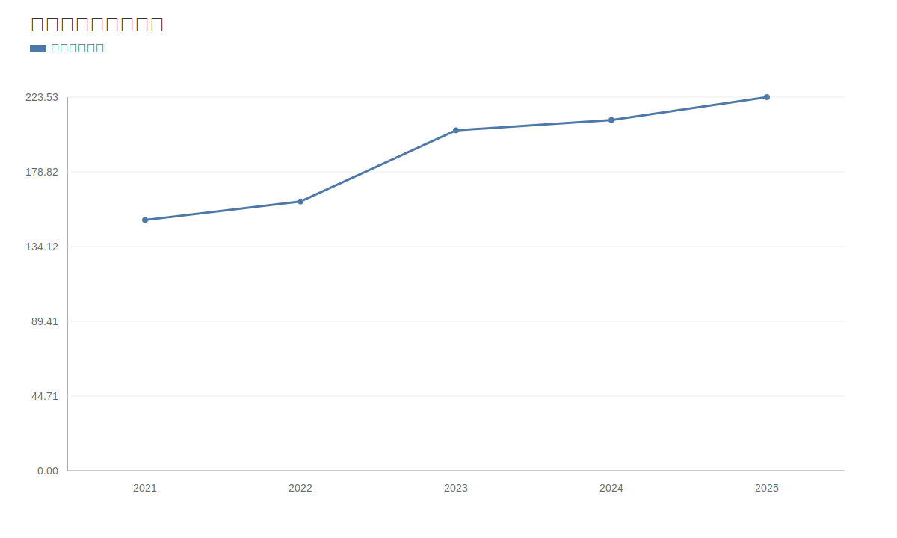

### 2. 净利润趋势图
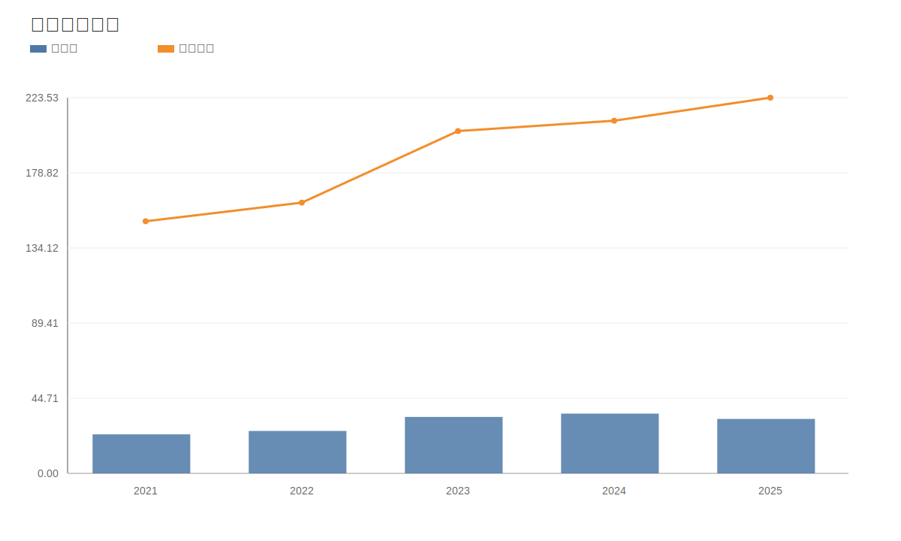

### 3. 毛利率和净利率对比图
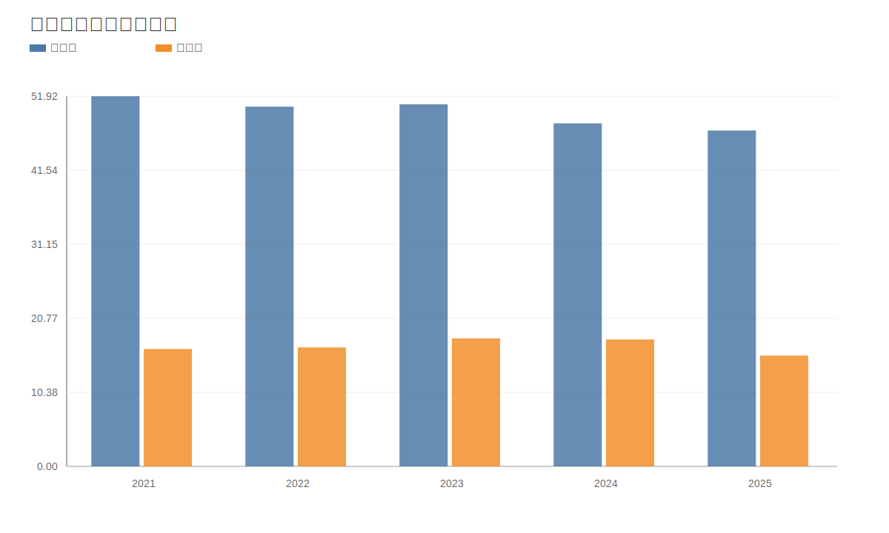

### 4. 分产品收入结构图
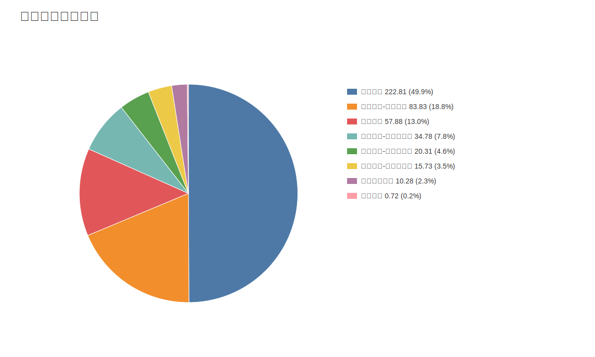

### 4. 分产品收入变化图
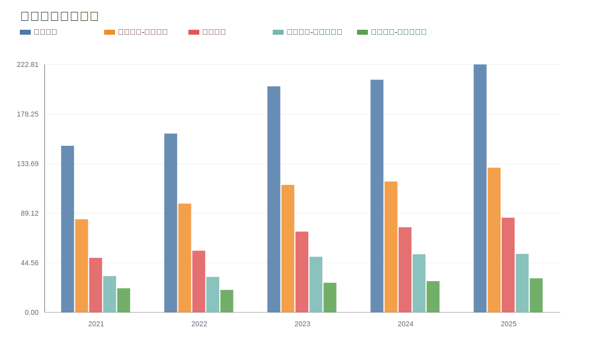

### 5. 分产品利润结构图
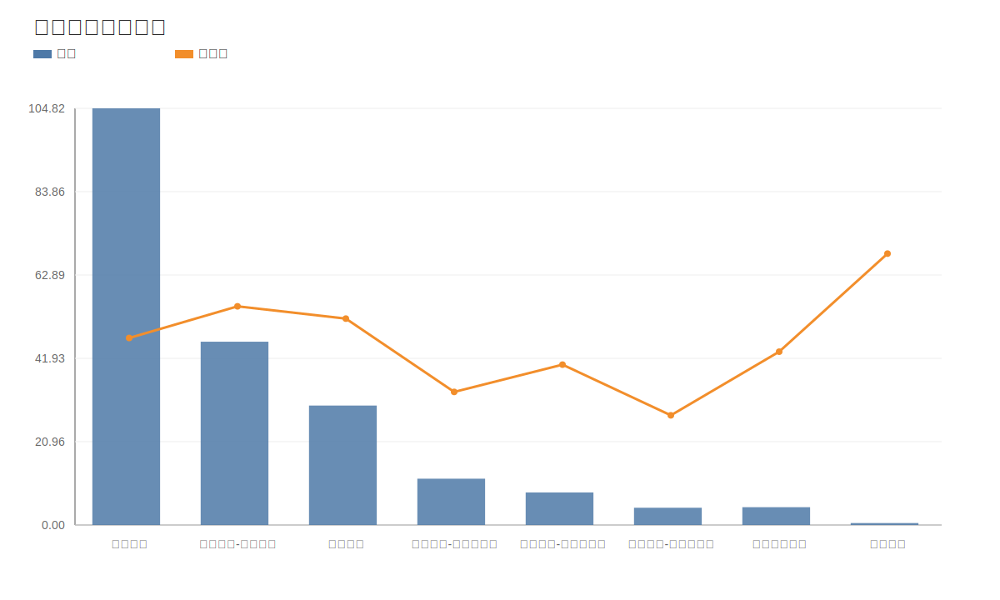

### 6. 分地区收入分布图
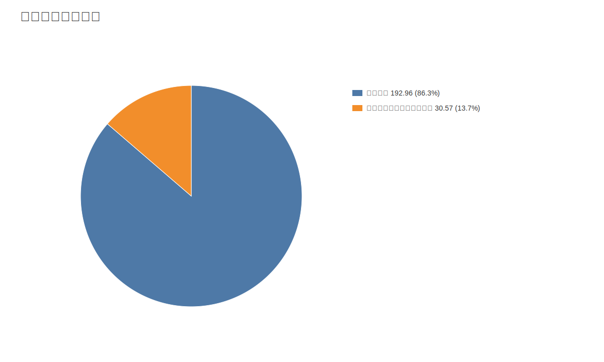

### 7. 资产负债表关键数据图
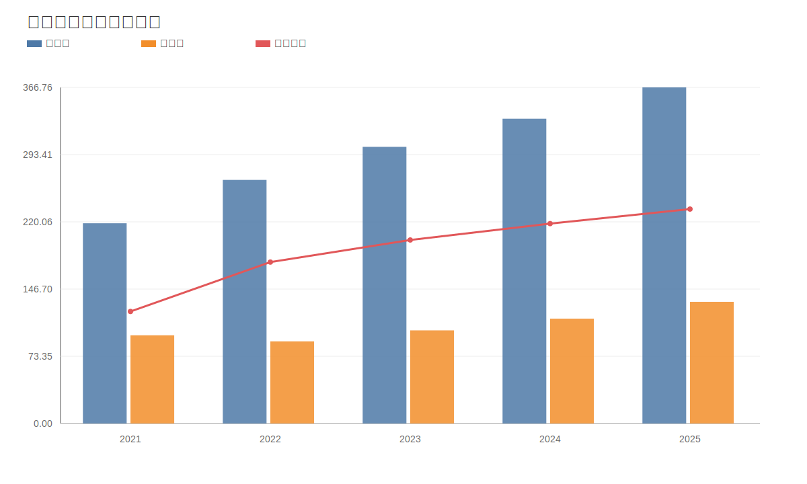

### 8. 自由现金流与经营现金流对比图
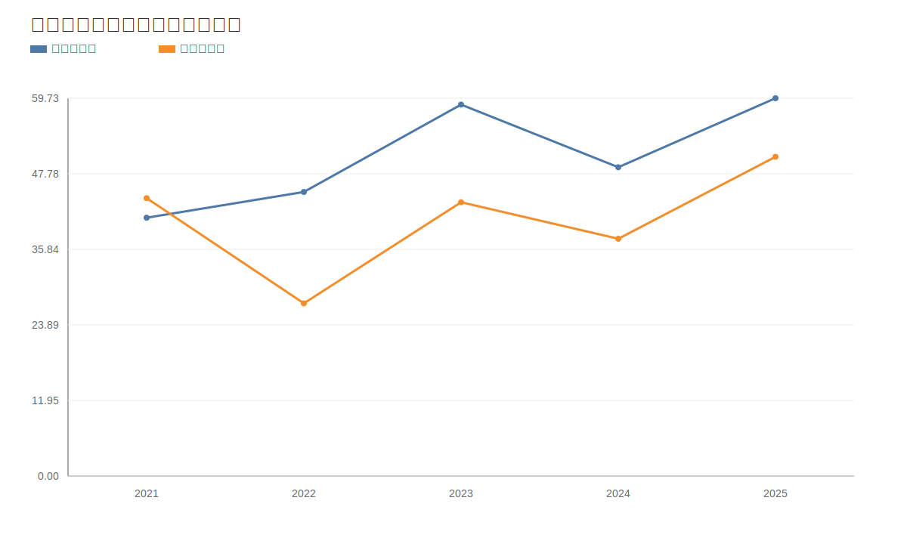

### 9. 股东回报分析图
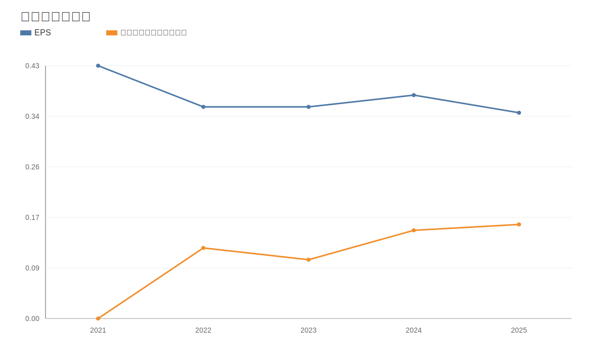

### 10. 财务比率分析图
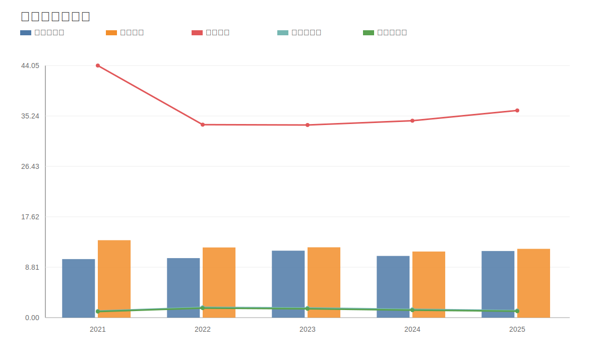

### 11. ROE与ROA对比图
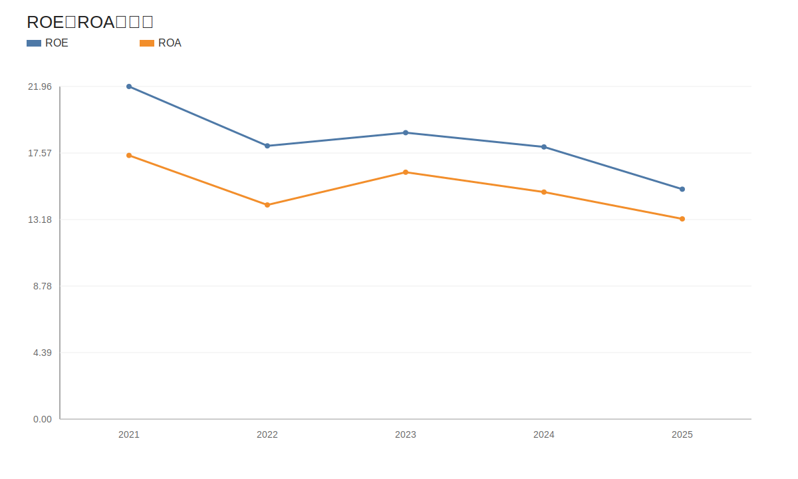
<!-- VALUE_CHARTS_END -->

## 参考来源
- 深交所季报：2026年第一季度报告（公告编号2026-017）。
- 公司公告：2026-04-23《关于筹划发行H股股票并上市相关事项的提示性公告》（公告编号2026-034）。
- 公司公告：2026-05-27《关于向香港联交所递交境外上市外资股（H股）发行并上市的申请并刊发申请资料的公告》（公告编号2026-043）。
- 港交所申请版本（中文）：Aier Eye Hospital Group Co., Ltd. 申请版本（2026-05-27刊发）。
