# 东方财富（300059）深度价值研究报告

- 研究对象：东方财富（300059.SZ）
- 报告时间：2026年5月23日
- 数据区间：以2021-2025年年报为主，结合2026年一季报
- 最新估值基准日：2026年5月13日（收盘价21.08元）

## 1. 公司概况

东方财富以互联网流量入口为基础，核心商业模式是“金融信息服务 + 证券业务 + 基金销售与资管生态变现”。收入端受市场活跃度（成交额、风险偏好）影响显著，利润端受经纪、两融、基金代销与利息净收入共同驱动。公司位于产业链流量与账户体系入口，具备较强用户触达能力，但业绩波动与资本市场景气度高度相关。

结论：公司是典型平台型券商，强在流量与线上效率，弱在对市场周期敏感。  
事实：2025年营收160.68亿元、归母净利120.85亿元；主营描述显示其以东方财富网流量和金融信息服务起家，并延展至证券与基金生态。  
推断：中长期竞争力来自“低成本获客+账户沉淀+产品扩展”，但盈利中枢仍受牛熊周期牵引。

## 2. 行业与竞争格局

证券与财富管理行业总空间取决于居民资产配置权益化趋势、资本市场制度改革与居民财富迁移。行业已从粗放增量转向存量竞争与集中度提升，龙头争夺用户资产留存、投顾能力与产品供给深度。东方财富的优势是线上化渗透率高、用户触达成本低，劣势是高净值服务能力和机构业务深度相较传统头部综合券商仍有差距。

结论：行业处于“成熟中的结构成长”阶段，公司在零售线上赛道具备头部位置。  
事实：2021-2025年公司营收复合增速约5.25%，净利复合增速约9.03%，表现出在行业波动中仍有正增长能力。  
推断：未来3-5年，若市场成交与财富管理需求回暖，公司仍有望通过份额提升实现快于行业的利润恢复。

## 3. 护城河分析（含真伪辨别）

东方财富潜在护城河主要来自品牌心智（大众投资者财经入口）、渠道流量（APP/网站高频触达）、账户体系与数据沉淀（交易与行为数据反馈）以及一定程度的转换成本（迁移账户与习惯成本）。但其护城河更偏“效率与网络规模”，而非不可替代的技术垄断。

对真伪辨别问题的判断：  
1) 提价5%：零售客户对交易和融资利率较敏感，若普遍提价，流失风险上升。  
2) 价格敏感度：中高，特别在同质化交易服务环节。  
3) 非它不可场景：在“低门槛线上开户+内容导流”有相对优势，但并非完全不可替代。  
4) 替代品难度：中等，同行互联网券商与传统券商数字化转型形成替代。  
5) 更换供应商成本：对普通零售客户中等偏低，对深度用户中等。

结论：护城河强度为“中”，属于可持续但非绝对垄断型。  
事实：公司长期保持高毛利率（2021-2025年约84%-88%），体现平台化规模效应。  
推断：护城河核心在运营效率与用户生态，若竞争加剧或监管压降费率，优势将被部分稀释。

## 4. 管理层与资本配置

公司管理层整体稳定，近年分红持续，审计意见连续为标准无保留，治理基础较稳。资本配置上，行业属性决定其资产负债表中金融资产、客户资金与利率敏感项占比较高，现金流波动较大并不完全等同经营恶化，需要结合业务扩张与市场环境解释。

结论：管理层总体偏“中性到价值创造者”，治理可信度较高。  
事实：2021-2025年持续实施现金分红（每股0.04-0.08元区间），2020-2024年审计意见均为标准无保留。  
推断：管理层当前资本配置未见明显激进多元化迹象，但仍需持续跟踪重资本业务扩张的风险收益匹配。

## 5. 财务分析（成长/盈利/健康/现金流）

### 5.1 成长性
2021-2025年营收与净利并非单边上行，2022-2023受市场低迷影响承压，2024-2025恢复明显，体现高beta属性。

### 5.2 盈利能力
公司毛利率长期高位（84%-88%），净利率口径显著高于一般工业企业，反映其轻资产平台属性与特定会计口径特征；ROE由2021年的22.16%下行至2025年的14.00%，盈利效率中枢有所回落。

### 5.3 财务健康
2026Q1资产负债率78.27%，流动比率1.33；货币资金1486.70亿元，有息负债359.92亿元，净现金1126.78亿元，短期偿付能力整体可控。

### 5.4 现金流质量
经营现金流年度波动大（2023、2025为负，2024大幅为正），与证券业务客户保证金、交易活跃度和资产配置结构变化相关；2026Q1经营现金流大幅改善，但单季波动不宜线性外推全年。

结论：财务画像是“高盈利弹性 + 现金流波动 + 偿债安全垫较厚”。  
事实：2025年营收160.68亿元、净利120.85亿元；2026Q1经营现金流304.33亿元且净现金规模超千亿元。  
推断：若市场活跃度维持回升，公司利润恢复可持续性增强，但现金流仍会保持金融行业特有的高波动特征。

## 6. 成长驱动

未来3-5年增长来源主要包括：  
1. 零售交易活跃度提升带来的经纪及两融贡献。  
2. 基金销售与财富管理渗透提升。  
3. 产品和服务矩阵扩展（投顾、工具、内容生态联动）。  
4. 存量用户ARPU提升与交叉销售。

结论：增长驱动以“市场贝塔+平台份额提升”双轮为主。  
事实：2024-2025公司营收与净利均明显修复，显示其在周期回暖阶段弹性较强。  
推断：若政策与市场环境保持温和，公司增长有望延续，但较难脱离资本市场周期独立高增。

## 7. 风险分析（含幸存者偏差）

主要风险包括：  
1. 政策监管风险：费率、适当性与业务规范变化可能压缩利润率。  
2. 行业竞争风险：同业线上化推进导致获客与留存竞争加剧。  
3. 技术替代风险：AI投顾、平台流量迁移可能改变入口格局。  
4. 财务与流动性风险：市场剧烈波动下，相关资产和业务波动传导至报表。  
5. 客户集中与行为风险：零售交易偏好变化快，活跃度回落将直接影响业绩。

幸存者偏差检验：以2022-2023行业压力期看，公司营收和利润均承压但未出现系统性失血，且审计口径稳定、分红延续，说明其在逆风期具备一定生存与修复能力。

结论：抗风险能力评估为“中”。  
事实：2022-2023年公司增速放缓甚至下滑，2024-2025实现恢复；审计持续无保留。  
推断：公司能穿越中等强度周期，但对极端长期熊市仍缺乏完全免疫力。

## 8. 估值分析

截至2026年5月13日，公司PE(TTM)约25.42倍、PB约3.54倍、PS(TTM)约88.04倍，股息率约0.47%。对券商与财富管理平台而言，估值通常取决于市场成交景气、权益风险偏好与中长期ROE预期。当前估值并非绝对便宜，隐含了对盈利修复和份额韧性的预期。

结论：估值判断为“合理偏中性”，安全边际一般。  
事实：当前PE与PB处于中高估值区间，且股息率偏低。  
推断：若后续盈利兑现超预期则估值可消化，否则存在阶段性回撤压力。

## 9. 投资判断（多头/空头/跟踪指标）

多头逻辑：  
1. 互联网流量入口与线上渠道效率构成长期竞争优势。  
2. 市场回暖阶段业绩弹性大，利润修复速度快。  
3. 净现金规模大，资产负债表安全垫相对充足。  
4. 分红与审计连续性较好，治理可预期性较高。

空头逻辑：  
1. 高度依赖资本市场景气，业绩周期性显著。  
2. 同业线上化加速，费用率和份额存在压力。  
3. 估值并不便宜，市场预期已计入部分修复。  
4. 现金流与利润存在阶段性背离，需警惕波动放大。

核心跟踪指标（季度）：  
1. 日均成交额与新增开户。  
2. 两融余额与市占率变化。  
3. 基金代销保有量与费率变化。  
4. ROE与经营现金流/净利润匹配度。  
5. 监管政策对费率和业务边界的影响。

结论：投资价值存在，但更适合“顺周期+估值纪律”框架。  
事实：2024-2025业绩恢复明显，显示公司在回暖期弹性突出。  
推断：若在景气上行与估值回落共振时布局，胜率高于高估值追涨。

## 10. 最终结论

东方财富是一家商业模式清晰、平台效率突出的好公司，但不是弱周期公司。它具备长期跟踪价值，是否值得买入取决于市场周期位置与估值安全边际。

投资建议：观察（偏积极观察）。

结论：公司长期可跟踪，当前更适合等待更优性价比或更强盈利确认。  
事实：公司盈利能力、审计质量、分红连续性整体良好，但估值与周期风险并存。  
推断：中长期可受益于居民财富管理需求提升，短中期仓位应遵循景气与估值匹配。

## 11. 总评分（100分）

- 商业模式（20%）：17/20
- 护城河（20%）：14/20
- 管理层与资本配置（15%）：12/15
- 财务质量（20%）：15/20
- 风险控制（15%）：10/15
- 估值性价比（10%）：6/10

最终总分：74/100

结论：综合评分对应“优质但周期敏感，估值中性”的画像。  
事实：公司在盈利能力与平台效率上得分较高，在抗周期与估值安全边际上扣分。  
推断：若估值回落或盈利进一步超预期，总分可提升至“更具进攻性配置”区间。

## 12. 三个终极问题（必须回答）

1. 如果提价5%，客户会不会流失？  
会，且在同质化交易服务领域流失概率不低；但若通过产品体验和服务增值对冲，流失可部分缓释。

2. 公司赚的钱有没有被管理层浪费？  
当前证据不支持“明显浪费”。分红持续、审计连续无保留，治理总体稳健；但仍需持续监督重资本业务扩张回报。

3. 在行业最差年份，公司是怎么活下来的？  
依靠线上渠道效率、较强现金头寸、业务多元收入来源与组织运营韧性，在低景气阶段承压但未失血失序，并在后续景气修复期快速回升。

结论：三问整体回答偏正面，但结论前提是“资本市场周期不出现超长极端下行”。  
事实：2022-2023年承压、2024-2025修复，且治理与审计口径稳定。  
推断：公司具备中期穿越能力，长期超额收益仍依赖买入估值与行业周期配合。

<!-- VALUE_CHARTS_START -->
## 图表图片（自动生成）

### 1. 主营业务收入趋势图
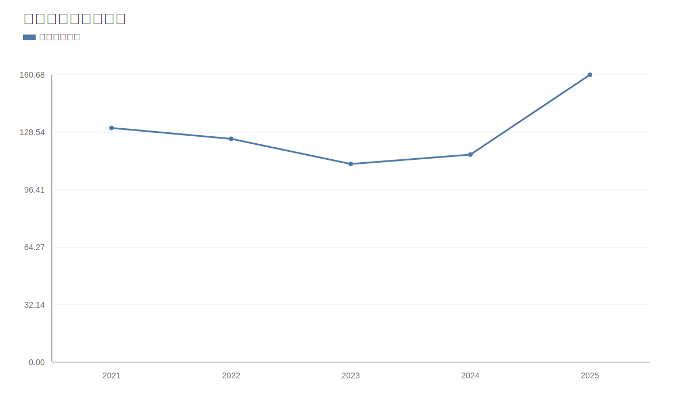

### 2. 净利润趋势图
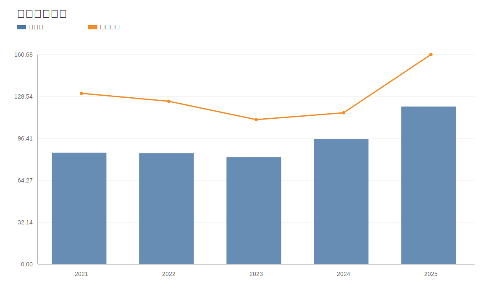

### 3. 毛利率和净利率对比图
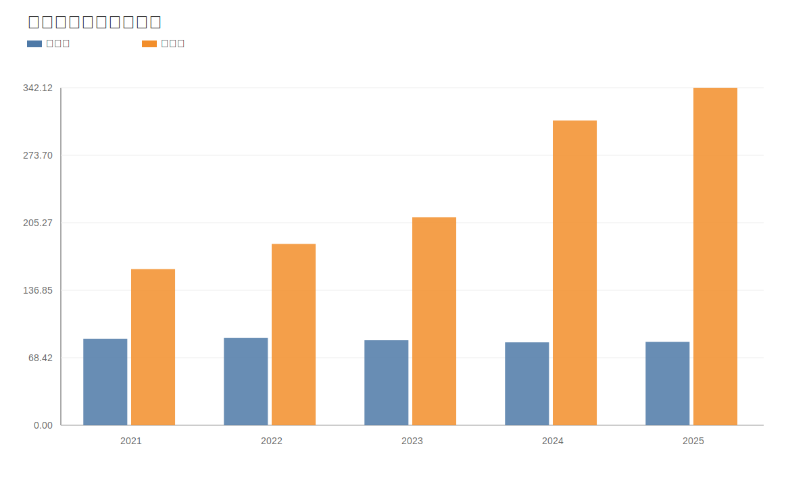

### 4. 分产品收入结构图
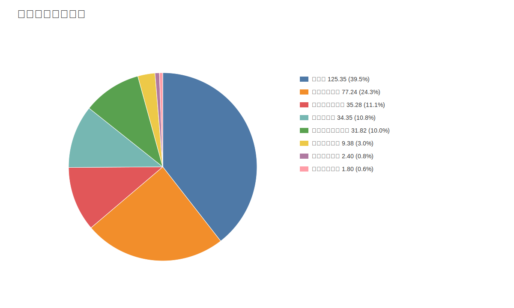

### 4. 分产品收入变化图
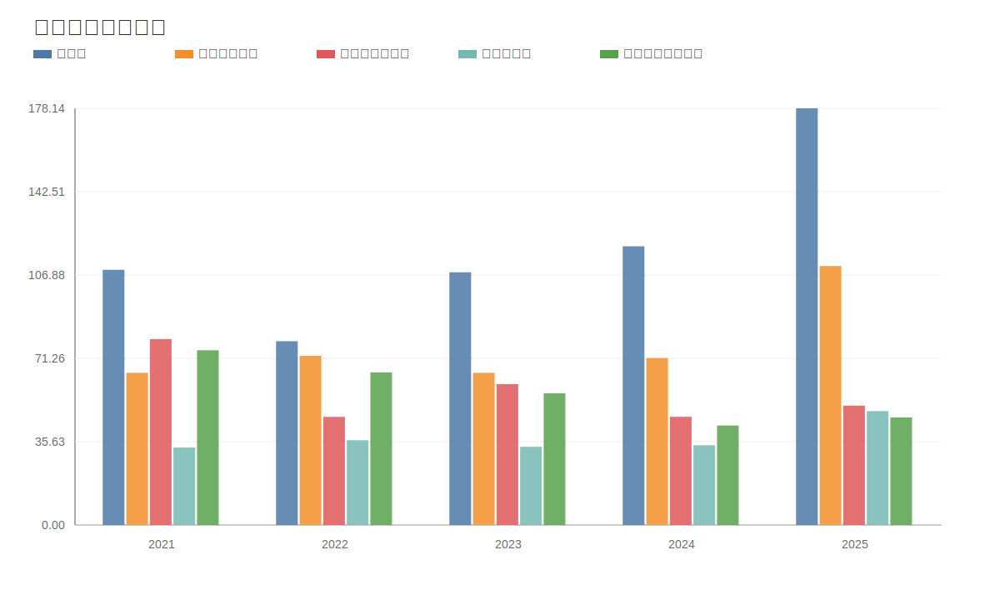

### 5. 分产品利润结构图
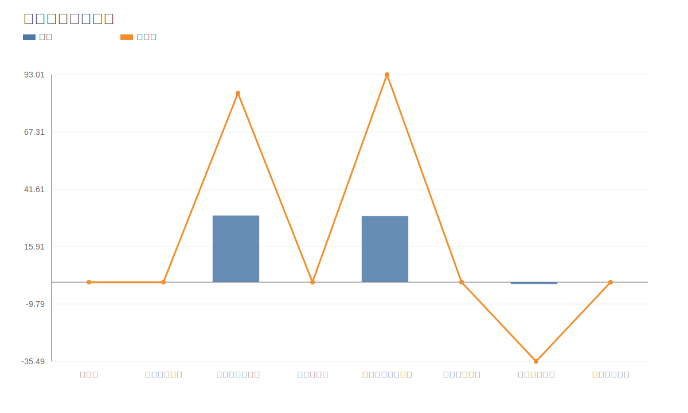

### 6. 分地区收入分布图

### 7. 资产负债表关键数据图
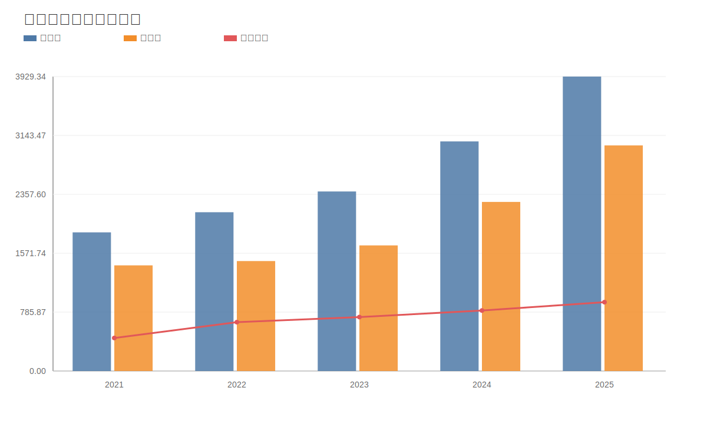

### 8. 自由现金流与经营现金流对比图
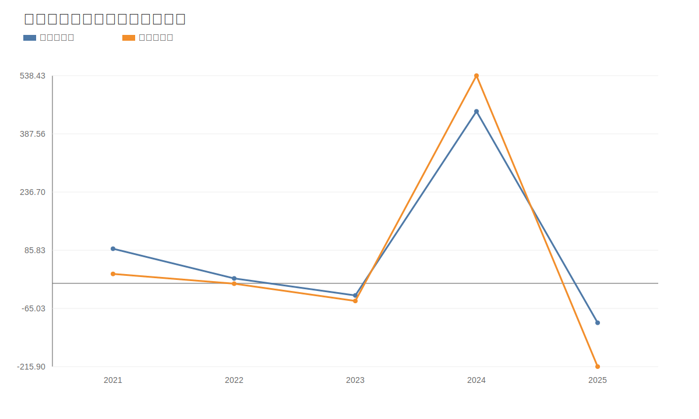

### 9. 股东回报分析图
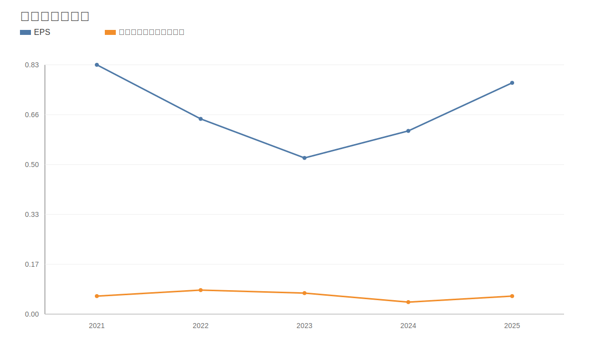

### 10. 财务比率分析图
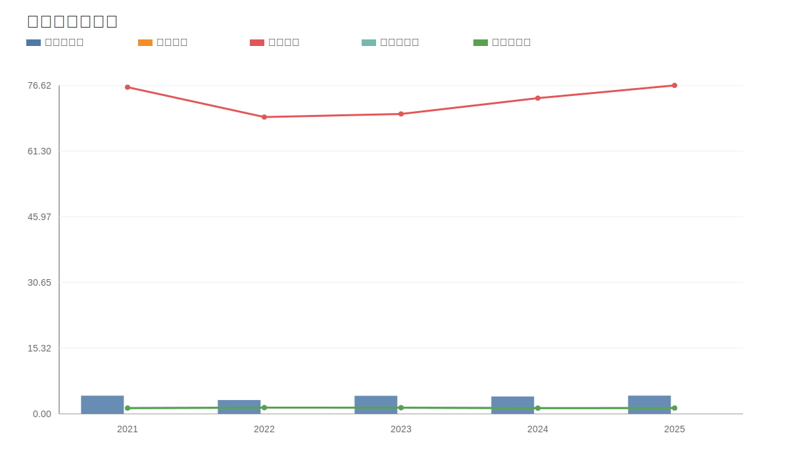

### 11. ROE与ROA对比图
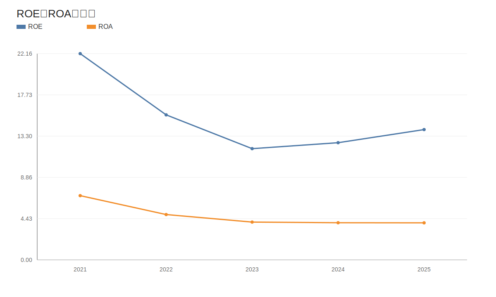
<!-- VALUE_CHARTS_END -->
