# 汇川技术（300124）深度价值研究报告

- 报告时间：2026-04-22 15:05（Asia/Shanghai）
- 标的：汇川技术（300124.SZ）
- 本地量化数据截止：2026-04-21（交易日）
- 最新财务快照：2025-09-30（三季报口径）
- 外部增量验证：2024年年报（2025-04-29披露）、2025年半年报（2025-08-26披露）、2025年三季报（2025-10-24披露）
- 说明：本文用于研究交流，不构成任何投资建议。

## 1. 公司概况（商业模式优先）

汇川技术本质上是“工业自动化+新能源汽车电驱电控”的平台型公司，核心收入来自ToB客户的关键部件与系统解决方案。

- 2024年分业务收入结构（公司披露口径，约值）：
  - 通用自动化约152亿元（同比约+1%）
  - 新能源汽车约160亿元（同比约+70%）
  - 智慧电梯约49亿元（同比约-7%）
  - 轨道交通约5.6亿元（同比约+2%）
- 收入性质：以项目制+批量交付为主，非订阅制，但有较强存量升级、备件和增购属性。
- 客户类型：以OEM与终端工业客户为主，面向制造业多行业（锂电、汽车、物流、机床、包装、纺织等）。
- 区域结构：国内仍是主战场，海外占比提升中（2024年海外收入约20亿元，占营收约6%；2025H1海外收入约13.2亿元，占比约6.4%）。

结论：公司商业模式清晰，属于“工程化能力+产品平台化”的工业底层能力型企业，具备跨周期经营基础。
事实：收入已形成“工控+电车”双轮驱动，2024年总营收370.41亿元，2025年前三季度延续增长。
推断：若海外占比和高附加值产品占比继续提升，收入质量与抗波动能力将优于单一赛道公司。

## 2. 行业与竞争格局

### 行业阶段与空间

- 工业自动化：2025H1处于“弱复苏”阶段。公司披露行业口径显示，低压变频器市场约136亿元（同比+8%）、通用伺服约113亿元（同比+7%）、PLC约84亿元（同比+5%）、工业机器人出货约16.3万台（同比+16%）。
- 新能源汽车零部件：仍处于高景气但竞争加剧阶段，增量来自车型放量、出海与技术迭代。
- 电梯：受地产链拖累，需求偏弱，存量改造与海外替代成为主要增量来源。

### 竞争格局

- 外资对手：西门子、ABB、安川、三菱等在高端市场仍具优势。
- 国内对手：埃斯顿、伟创电气、英威腾、鸣志电器、禾川科技等。
- 汇川定位：国产龙头之一，优势在多产品协同与本地化服务深度。

结论：公司所处行业“结构性景气+总量分化”，核心机会来自国产替代、出海和产品平台升级。
事实：通用自动化2024年仅小幅增长，但新能源汽车业务高增，已对冲部分传统板块压力。
推断：未来3-5年公司增速中枢将取决于电车业务盈利改善、工控复苏斜率和海外放量速度。

## 3. 护城河分析（含真伪辨别）

### 护城河来源

- 技术与产品矩阵：覆盖变频器、伺服、PLC、机器人、精密机械、电驱电控、电源系统，具备“单点产品+系统方案”能力。
- 规模与交付：新能源车业务产能爬坡后，形成较强交付保障能力。
- 渠道与服务网络：国内行业线+战区协同，海外渠道和本地服务体系持续完善。
- 组织能力：长期高研发投入+工程师文化+流程化管理（IPD/LTC等）提升执行上限。

### 真伪辨别

- 提价5%会否流失客户：标准化品类（如通用变频器）敏感度较高，系统方案型/验证周期长品类敏感度较低。
- 客户是否价格敏感：中端市场敏感，高端/定制化场景更看重可靠性与总拥有成本。
- 是否“非它不可”：在部分行业方案与国产替代场景有较强粘性，但整体并非绝对垄断。
- 替代品出现难度：中低端替代较容易，高性能控制+行业Know-how替代更难。
- 更换供应商成本：涉及认证、调参、停机、售后体系切换，综合成本中等偏高。

结论：护城河强度为“中偏强”，但仍是“持续投入型护城河”而非静态垄断型。
事实：公司在多个细分产品保持份额提升，并通过多产品组合提升客户粘性。
推断：若研发投入与交付能力持续领先，护城河将随时间加深；反之会被价格竞争稀释。

## 4. 管理层与资本配置

- 管理层：朱兴明长期担任核心管理角色，战略连续性较强。
- 治理与审计：2024年财报为标准无保留意见；报告期实际控制人未发生变更。
- 研发投入：
  - 2024年研发投入31.47亿元，研发费用率8.50%
  - 2025H1研发投入19.66亿元，研发费用率9.58%
- 股东回报：2024年度分红方案为每10股派4.1元（含税），现金分红约11.04亿元；近5年持续现金分红。
- 资本动作：联合动力推进分拆上市，利于新能源汽车业务融资与估值独立，但也增加治理与协同复杂度。

结论：管理层整体偏“价值创造者”，资本配置在“研发投入+业务扩张+股东回报”间取得了相对平衡。
事实：公司在高研发、分红、全球化投入三条线上同步推进，且审计意见持续稳定。
推断：若未来研发成果转化效率下降，当前高投入策略会转化为利润率压力；反之将强化长期竞争力。

## 5. 财务分析（成长/盈利/健康/现金流）

### 5.1 成长性

- 2020-2024营收：115.11亿 -> 370.41亿，5年CAGR约33.93%
- 2020-2024归母净利：21.00亿 -> 42.85亿，5年CAGR约19.52%
- 2025年前三季度：
  - 营收316.63亿元，同比+24.67%
  - 归母净利润42.54亿元，同比+26.84%

### 5.2 盈利能力

- 毛利率：2020年38.96%降至2024年28.70%
- 净利率：2020年18.95%降至2024年11.73%
- ROE：2021年26.95%高点回落至2024年16.33%
- ROIC：2021年23.51%回落至2024年13.84%

解读：增长质量仍好，但利润率和资本回报率在业务结构变化与竞争加剧下回落明显。

### 5.3 财务健康

- 资产负债率：2020年40.93%升至2024年50.28%
- 流动比率：2020年2.09降至2024年1.30，2025Q3回升至1.53
- 2025Q3货币资金69.08亿元，有息负债36.96亿元，净现金32.12亿元

解读：杠杆边际抬升但仍可控，净现金状态对抗周期有帮助。

### 5.4 现金流质量

- 2024年经营现金流72.00亿元，自由现金流43.11亿元，现金质量明显改善
- 2025Q3经营现金流39.31亿元，同比+1.92%，经营现金流/利润约87.9%
- 2025Q3自由现金流为-7.43亿元，阶段性受产能建设与营运资本影响

结论：公司处于“高增长+利润率回落+现金流仍可验证”的阶段，财务韧性好于多数高成长制造企业。
事实：收入和利润延续双位数增长，净现金为正，现金流与利润整体匹配。
推断：若未来1-2年毛利率企稳回升，估值弹性将主要来自利润率修复而非单纯收入扩张。

## 6. 成长驱动

未来3-5年核心增长来源：

- 新能源汽车：客户定点转SOP放量、海外项目与新平台迭代。
- 通用自动化：国产替代深化、流程工业与高端装备渗透、多产品组合销售。
- 海外化：从“借船出海”到本地化经营，海外子公司/服务中心/工厂逐步完善。
- 数字化与能源管理：InoCube相关方案在制造业节能和数字化升级中形成新增量。

增长来源拆解判断：短中期以“放量+结构优化”为主，长期看“新品类与平台化”贡献增量。

结论：成长逻辑成立，且具备可验证路径（订单、定点、海外收入、产品迭代节奏）。
事实：2025H1新能源汽车收入同比约+50%，通用自动化同比约+17%，海外收入同比约+39%。
推断：公司未来增速大概率从“高波动高增”向“中高增+质量改善”演进。

## 7. 风险分析（含幸存者偏差）

### 主要风险

- 宏观与制造业资本开支波动风险。
- 工控与电车赛道价格竞争加剧，毛利率承压风险。
- 电梯业务受地产拖累的持续性风险。
- 应收与存货管理压力：扩张期若需求不及预期，可能触发减值压力。
- 海外扩张风险：地缘政治、汇率、合规与本地化执行风险。

### 幸存者偏差检验

- 行业低谷与外部冲击：2024年地产链下行、竞争加剧、部分工业需求偏弱。
- 公司表现：2024年仍实现营收同比+21.77%，经营现金流72亿元，净利润保持正值；2025年前三季度增长延续。
- 极端环境下生存机制：多业务分散、净现金缓冲、持续研发投入、组织效率改进。

结论：抗风险能力为“中偏强”，但不属于完全免疫周期的资产。
事实：公司在行业分化期仍保持正向盈利与现金流，且多元业务有对冲效应。
推断：若单一高景气板块（如电车）增速下台阶，公司估值中枢将下修但不至于出现经营性失速。

## 8. 估值分析

### 当前估值（2026-04-21）

- 收盘价：66.04元
- PE(TTM)：34.48倍
- PB：5.20倍
- PS(TTM)：4.13倍
- 总市值：约1787.85亿元

### 历史分位（本地库近5年样本）

- PE分位约9.8%
- PB分位约9.8%
- PS分位约9.8%

说明：当前估值在公司近5年区间处于偏低分位。

### 同业横向（2026-04-21）

- 英威腾：PE 46.54，PB 2.18，PS 1.47
- 伟创电气：PE 56.24，PB 6.29，PS 7.59
- 埃斯顿：PE 455.79，PB 6.38，PS 4.19
- 鸣志电器：PE 304.97，PB 8.28，PS 9.33

横向看，汇川技术估值不算最便宜，但相对其龙头地位、盈利能力和现金流质量，估值具备一定性价比。

结论：估值判断为“合理偏低估”（历史维度），但不是“绝对低估”。
事实：公司当前估值在自身历史低分位，同时仍维持双位数增长。
推断：未来回报更依赖“利润率修复+海外占比提升”兑现，而非估值单边扩张。

## 9. 投资判断（多头/空头/跟踪指标）

### 多头逻辑

1. 工控+电车双轮驱动，单赛道波动被部分对冲。  
2. 平台化产品矩阵与行业解决方案能力，具备长期份额提升基础。  
3. 研发强度高，且研发成果向量产与订单转化路径清晰。  
4. 海外业务仍处早期，具备中长期成长弹性。  
5. 当前估值在自身历史低分位，安全垫较过去两年更好。  

### 空头逻辑

1. 毛利率与ROE较历史高点明显下台阶，盈利质量尚未完全修复。  
2. 电车产业链竞争激烈，价格战可能压制利润释放。  
3. 电梯业务受地产影响仍偏弱，拖累整体利润结构。  
4. 海外扩张需要持续投入，短期可能摊薄效率。  
5. 若制造业复苏不及预期，工控订单节奏存在波动。  

### 核心跟踪指标（季度）

1. 通用自动化收入增速与毛利率（看工控复苏与份额变化）。
2. 新能源汽车业务毛利率与净利率（看“增收”能否转化为“增利”）。
3. 海外收入占比及增速（看第二增长曲线兑现度）。
4. 经营现金流/净利润与自由现金流（看利润含金量）。
5. 存货/应收周转与减值变化（看增长质量）。

结论：公司具备长期配置价值，但短期受行业节奏与利润率扰动影响，适合“跟踪验证型持有”。
事实：增长趋势稳健、估值分位较低、但盈利指标处在修复阶段。
推断：未来12个月的关键不是“有没有增长”，而是“增长质量能否继续改善”。

## 10. 最终结论

- 这是否是一家好公司：是。它具备平台型产品能力、研发驱动和组织执行力。  
- 是否具备长期投资价值：具备，但属于“需要持续跟踪验证”的成长价值标的。  
- 当前价格是否值得买入：从历史分位看吸引力提升，但应结合盈利修复进度分批决策。  
- 投资建议：**观察**（中长期可在估值回落或业绩超预期时分批提高仓位）。

结论：中长期逻辑成立，短中期关键看利润率与现金流质量持续验证。
事实：2025年前三季度收入与利润仍保持较快增长，估值处历史低分位。
推断：若2026年毛利率与ROE止跌回升，评级可上修至更积极的“买入”框架。

## 11. 总评分（100分）

- 商业模式（权重20）：17
- 护城河（权重20）：16
- 管理层与资本配置（权重15）：13
- 财务质量（权重20）：15
- 风险控制（权重10）：7
- 估值性价比（权重15）：12

**最终总分：80 / 100**

结论：80分对应“优质但非无瑕疵”的成长价值公司。
事实：公司在增长、研发、治理方面表现较强，但盈利能力较历史高点回落。
推断：分数上修空间主要取决于利润率修复与海外业务规模化兑现。

## 12. 三个终极问题（必须回答）

1. 如果提价 5%，客户会不会流失？  
会分化。标准化产品客户对价格更敏感，可能有一定流失；但在系统方案、稳定交付和高可靠场景，流失率预计可控。

2. 公司赚的钱有没有被管理层浪费？  
当前证据显示“整体没有系统性浪费”。公司持续高研发+持续分红+推进效率改善，资本配置总体偏理性；但新业务投入回报率仍需时间验证。

3. 在行业最差年份，公司是怎么活下来的？  
靠多业务对冲、现金流管理、研发不停投和组织效率提升。即使在需求分化阶段，仍能维持正利润与较强经营现金流，并通过产品结构调整穿越周期。

结论：终极三问下，公司整体通过测试，但需继续观察“提价能力和利润率修复”这两个关键变量。
事实：公司在2024-2025阶段已展示出经营韧性与现金流韧性。
推断：若未来两年在竞争加剧中仍能稳住ROIC，公司护城河将被进一步验证。

<!-- VALUE_CHARTS_START -->
## 图表图片（自动生成）

### 1. 主营业务收入趋势图
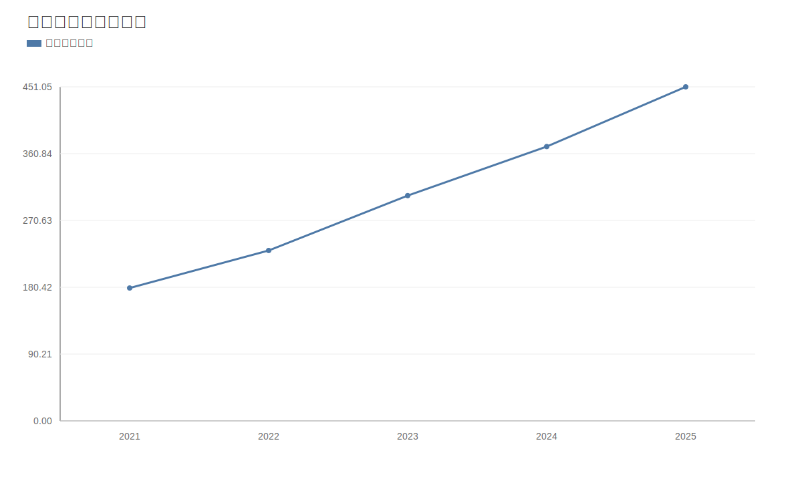

### 2. 净利润趋势图
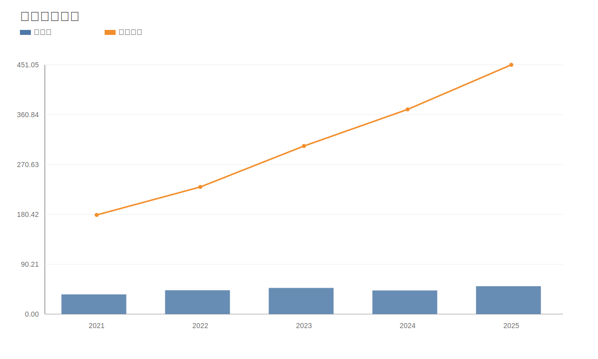

### 3. 毛利率和净利率对比图
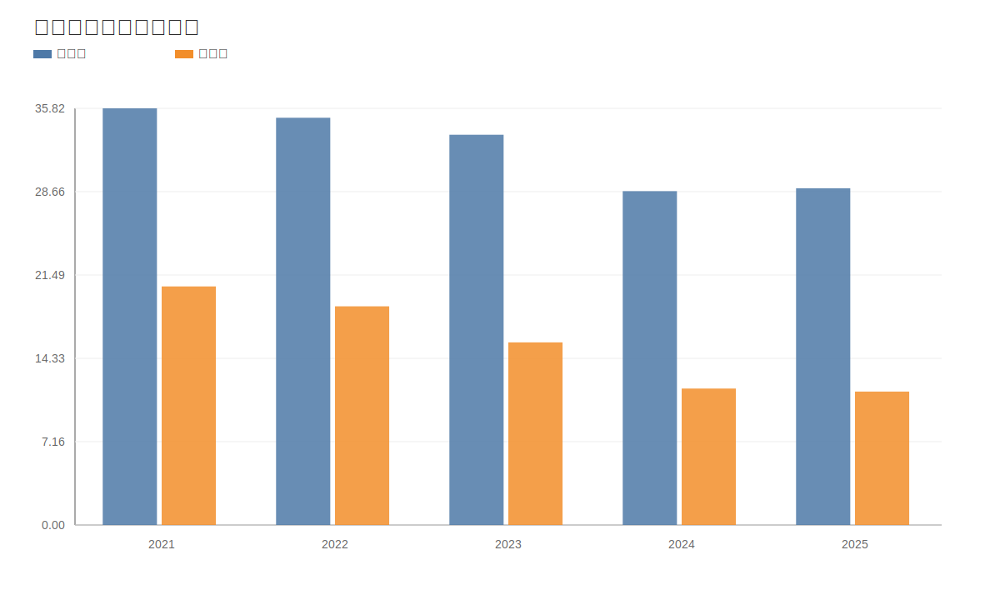

### 4. 分产品收入结构图
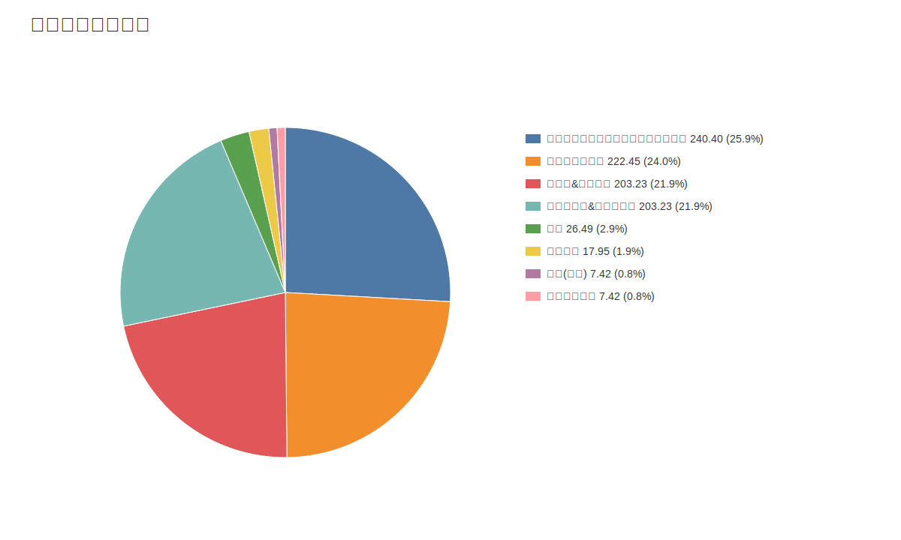

### 4. 分产品收入变化图
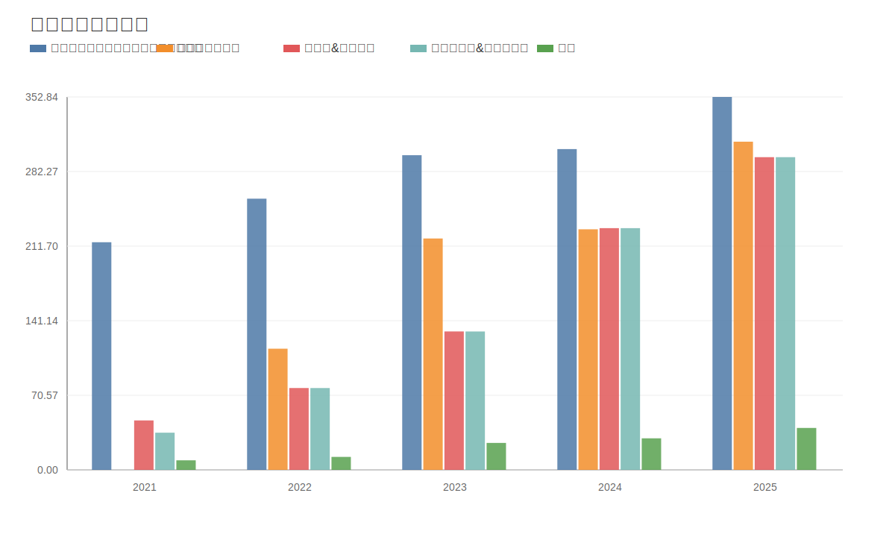

### 5. 分产品利润结构图
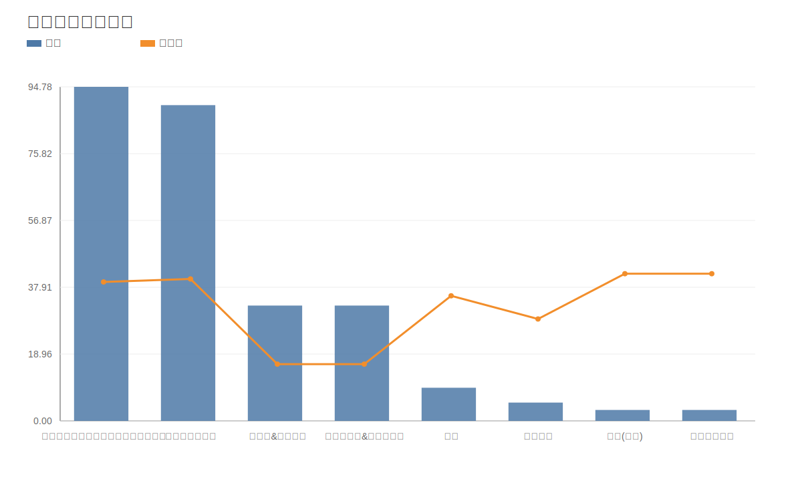

### 6. 分地区收入分布图

### 7. 资产负债表关键数据图
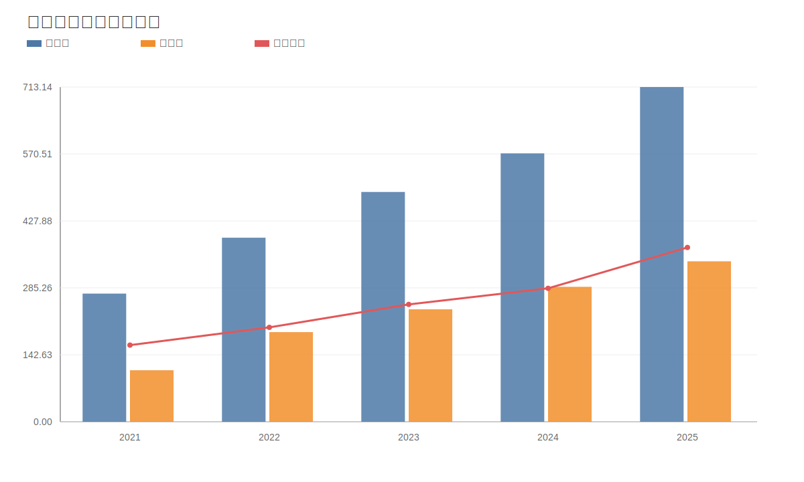

### 8. 自由现金流与经营现金流对比图
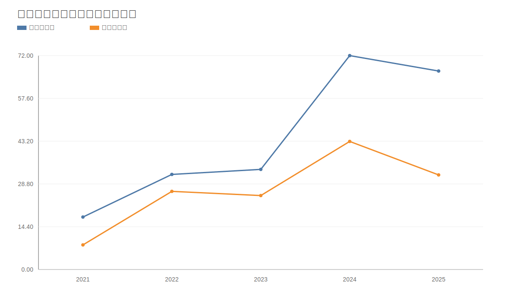

### 9. 股东回报分析图
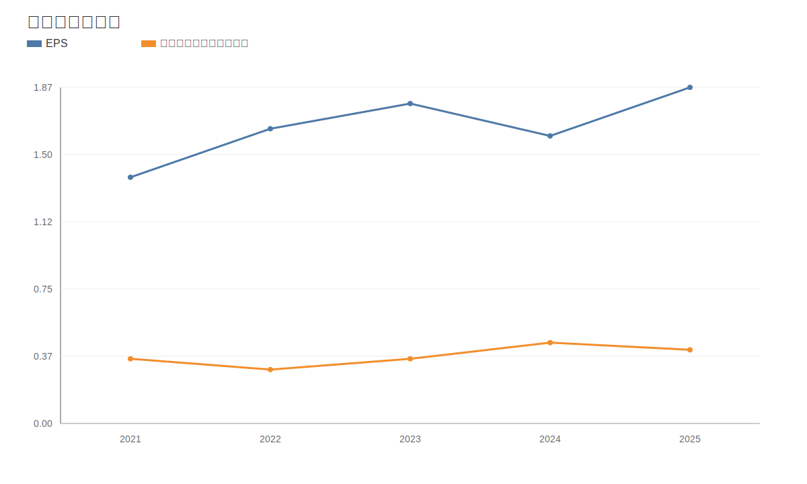

### 10. 财务比率分析图
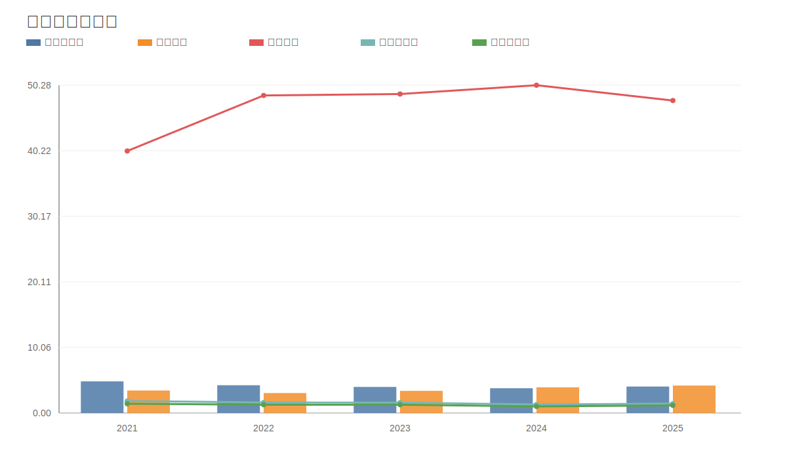

### 11. ROE与ROA对比图
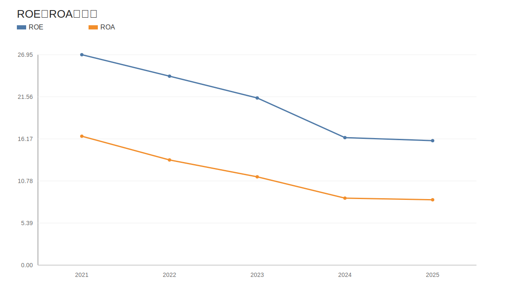
<!-- VALUE_CHARTS_END -->
