# 洲明科技（300232）深度价值研究报告

- 报告日期：2026年4月17日
- 数据截止：
  - 财务数据：2025年9月30日（最新报告期）
  - 市场估值：2026年4月15日（最新交易日）
- 数据口径：本地数据库 `income/balancesheet/cashflow/fina_indicator/daily_basic/dividend/fina_audit/stock_company`
- 外部增量验证：公司官网新闻、深交所公告、TrendForce 行业资讯（仅作定性补充）

## 1. 公司概况（商业模式优先）
洲明科技核心收入来自 LED 显示与照明应用，典型商业模式是“标准化产品+项目交付+渠道出海”。公司客户以 ToB 为主，覆盖商业显示、租赁舞台、体育场馆、会议、文旅夜游等场景。收入并非纯订阅型，带有项目型特征，但在海外渠道和细分行业形成一定复购。

从公司信息看，洲明科技上市于 2011 年，注册地深圳，董事长兼总经理为林洺锋。业务上属于硬件+方案集成，周期属性较强，但场景广泛，且具备全球出货能力。

结论：公司商业模式可理解，属于“制造+渠道+方案”型，不是强粘性订阅模式。
事实：2024 年收入 77.74 亿元；主营描述覆盖 LED 显示屏、专业照明与景观照明；员工约 5638 人。
推断：公司收入韧性更多来自渠道与产品迭代，而非高切换成本的软件生态。

## 2. 行业与竞争格局
LED 显示行业整体受益于小间距、Mini/Micro LED、商显与虚拟拍摄等需求扩张，但竞争者多、价格战阶段性反复。TrendForce 资讯显示，LED 显示市场规模仍处增长区间，行业并非衰退赛道。

公司层面，2026年4月15日同日可比公司估值显示：艾比森（300389）PB 4.50、PS 1.77，利亚德（300296）PB 2.58、PS 2.98，雷曼光电（300162）PB 4.44、PS 3.38；洲明科技 PB 1.62、PS 0.94，处于可比组低位。

结论：行业处于“结构成长+价格竞争”并存阶段，洲明在规模与全球化上有位次，但议价力并非绝对强势。
事实：截至 2026年4月15日，洲明科技 PB/PS 显著低于 LED 显示可比公司。
推断：市场给予折价，反映对其利润率可持续性的疑虑，而非对收入规模的否定。

## 3. 护城河分析（含真伪辨别）
潜在护城河来自三点：
1. 全球渠道网络和交付能力。
2. 产品矩阵覆盖多场景（专业显示、租赁、商显、体育、文旅）。
3. 技术与制造积累（小间距/Mini LED 等方向持续迭代）。

但其护城河更偏“规模与执行效率”，而非不可替代型。行业中客户通常可在多个品牌间切换，价格、交期、服务能力均是决策变量。

提价 5% 压力测试：若无同步技术或服务差异化，标准化项目可能出现客户分流；高端方案或项目制交付中，流失率会相对可控。

结论：护城河强度评估为“中”。
事实：公司在全球 LED 显示收入规模上有领先地位，但行业存在多家同类供应商。
推断：其“护城河”更接近渠道与运营效率，不是绝对定价权护城河。

## 4. 管理层与资本配置
管理层层面，林洺锋长期担任董事长兼总经理，治理延续性较强。深交所 2025年8月12日公告显示公司已完成董事会换届并续聘核心高管，组织连续性较好。

资本配置方面：
- 审计：2017-2024 年连续标准无保留意见（天健会计师事务所）。
- 分红：近年有现金分红实施记录，2022-2025（实施口径）每股现金分红约 0.025、0.015、0.050、0.240 元，股东回报强度在提升。
- 杠杆：2024 年末货币资金约 17.49 亿元，有息负债约 6.34 亿元，净现金约 11.15 亿元。

结论：管理层与资本配置评估为“中性偏正面（价值创造者候选）”。
事实：治理团队延续、审计意见稳定、分红连续、净现金为正。
推断：若后续继续将现金用于研发与高回报订单获取，而非低效扩张，则资本配置可进一步加分。

## 5. 财务分析（成长/盈利/健康/现金流）
### 5.1 成长性
2020-2024 年收入从 49.62 亿元增长至 77.74 亿元，5 年 CAGR 约 11.88%；但归母净利润 5 年 CAGR 约 -4.04%，增收不增利特征明显。

### 5.2 盈利能力
2024 年毛利率 29.11%，较 2021 年（24.27%）明显改善；但净利率仅 1.07%，ROE 2.10%、ROIC 1.50%，盈利质量偏弱。

### 5.3 财务健康
资产负债率近五年约 53%-57%，整体可控；截至 2024 年末净现金为正，短期偿债压力不大。

### 5.4 现金流质量
2022-2024 年经营现金流分别约 7.03/8.17/8.36 亿元，显著高于同期净利润；2025 年前三季度经营现金流同比下滑较快，需关注是否为项目回款节奏波动。

结论：财务画像是“收入增长稳、利润率偏薄、现金流近年较强但波动大”。
事实：2024 年净利率 1.07%，ROE 2.10%，经营现金流 8.36 亿元；2025Q3 经营现金流同比约 -67.77%。
推断：公司已走出纯规模扩张阶段，但尚未形成高质量利润的稳定台阶。

## 6. 成长驱动
未来 3-5 年增长驱动主要来自：
1. 海外渠道渗透与重点区域放量。
2. 小间距、Mini LED 等高附加值产品结构占比提升。
3. 文旅、体育、虚拟拍摄、会议商显等场景扩张。

公司官网 2025年4月29日披露口径显示，2024 年海外收入约 47.77 亿元、同比增长约 18.33%，海外收入占比较高，说明增长更多来自全球化而非单一区域内卷。

结论：成长驱动有效，但关键约束在“规模增长能否转化为持续净利率提升”。
事实：海外业务在 2024 年仍保持双位数增长（公司官网披露）。
推断：若高毛利产品和海外项目占比继续提升，利润弹性有望好于收入弹性。

## 7. 风险分析（含幸存者偏差）
主要风险：
1. 行业竞争与价格战导致毛利承压。
2. 海外经营中的汇率、地缘、渠道信用风险。
3. 技术路线迭代（MiP/COB/Mini/Micro LED）带来的研发与库存风险。
4. 项目制业务导致回款与现金流季节性波动。

幸存者偏差检验（以 2022-2024 与 2025Q1-Q3 数据观察）：
- 公司在盈利低谷年份仍保持正净利润与正经营现金流（年报口径）。
- 2021 年出现自由现金流为负，但之后修复；2025 年季度现金流再次出现压力，显示周期波动尚未消失。

结论：抗风险能力评估为“中”。
事实：未出现连续大额亏损或明显债务危机，净现金长期为正。
推断：公司能穿越中等景气波动，但对激烈价格战和回款周期仍较敏感。

## 8. 估值分析
截至 2026年4月15日：
- PE(TTM)：76.41
- PB：1.62
- PS(TTM)：0.94
- 股息率(TTM)：3.47%
- 总市值：约 75.14 亿元

历史分位（近 5 年日度样本）：PE/PB/PS 当前大约处于 11% 分位，说明相对历史并不贵；但 PE 绝对值偏高，反映当前盈利基数仍薄。可得数据下，PEG 与 EV/EBITDA 暂不稳定/不可得，不作为核心定价锚。

同业横向（2026年4月15日）：洲明 PB、PS 均明显低于 LED 显示可比公司组。

结论：估值判断为“合理偏低估（PB/PS 维度），但存在盈利修复不确定性折价”。
事实：PB=1.62、PS=0.94，均低于主要可比公司；近5年分位约 11%。
推断：若净利率修复失败，低 PB/PS 可能演化为长期价值陷阱；若修复成功，估值有上修空间。

## 9. 投资判断（多头/空头/跟踪指标）
### 多头逻辑
1. 全球化能力与规模领先，收入中枢具备韧性。
2. 毛利率趋势改善，产品结构升级方向明确。
3. 资产负债结构稳健，净现金为正，分红能力在增强。
4. PB/PS 处于低位，估值对悲观预期已有反映。

### 空头逻辑
1. 净利率与 ROE 长期偏低，盈利修复尚未被验证。
2. 行业价格竞争激烈，提价能力有限。
3. 经营现金流季度波动较大，项目制回款风险仍在。
4. 海外业务占比提升后，汇率与国际经营风险放大。

### 核心跟踪指标（季度）
1. 净利率是否稳定回到 3%-5% 区间。
2. 经营现金流/净利润是否持续高于 100%。
3. 海外收入增速与海外毛利率变化。
4. 应收账款与存货周转天数变化。
5. 重点技术产品（小间距/Mini LED）收入占比。

结论：现阶段更适合“利润修复交易”而非“高确定性复利持有”。
事实：收入规模稳定，但利润率与现金流季度波动尚未完全收敛。
推断：投资胜率高度依赖未来 4-6 个季度的利润率兑现。

## 10. 最终结论
这是一家在 LED 显示赛道具备全球竞争力、但盈利质量仍需强化的公司。公司不是弱资产故事，而是典型制造与渠道驱动企业，估值已反映部分担忧，但业绩弹性兑现是关键。

- 是否是一家好公司：是（中等偏上）
- 是否具备长期投资价值：有，但取决于利润率改善可持续性
- 当前价格是否值得买入：赔率尚可，确定性一般
- 投资建议：观察

结论：建议“观察”，等待盈利质量进一步确认后再提高仓位。
事实：PB/PS 低位、净现金为正，但 ROE/净利率偏低且季度现金流有波动。
推断：若未来一年利润率和现金流同步改善，评级可上调至“买入”。

## 11. 总评分（100分）
- 商业模式（20%）：14/20
- 护城河（20%）：12/20
- 管理层与资本配置（15%）：11/15
- 财务质量（20%）：11/20
- 风险控制（15%）：9/15
- 估值性价比（10%）：8/10

**最终总分：65/100**

结论：综合评分 65 分，对应“可跟踪、等待确认”的中性偏多区间。
事实：估值与资产负债表提供一定安全垫，但盈利质量与行业竞争拖累总分。
推断：评分上修触发器是 ROE 与净利率中枢抬升；下修触发器是现金流持续走弱。

## 12. 三个终极问题（必须回答）
1. 如果提价 5%，客户会不会流失？
会，且在标准化项目中流失概率不低；在高端场景与强交付能力项目中流失可控。

2. 公司赚的钱有没有被管理层浪费？
目前看没有明显“系统性浪费”证据。审计意见持续标准无保留、分红持续、净现金为正；但若未来出现高溢价低回报并购，需要警惕。

3. 在行业最差年份，公司是怎么活下来的？
依靠规模、渠道、现金流管理和正净现金结构扛过波动。公司在盈利低谷期仍保持正利润和正经营现金流（年报口径），未出现偿债危机。

结论：三问结果总体偏正面，但第一问（提价能力）给出的答案限制了估值上限。
事实：审计与现金结构稳健，盈利中枢偏低且竞争压力长期存在。
推断：公司更像“可经营、可改进”的中等护城河企业，而非高壁垒垄断型公司。

## 外部增量验证来源
- 公司官网（2025年4月29日，公司新闻）：https://www.unilumin.com/news/company-news/unilumin-2024-global-led-solutions-leader-with-record-achievements.html
- 深交所公告（2025年8月12日，董事会换届及高管聘任）：https://disc.static.szse.cn/disc/disk03/finalpage/2025-08-12/13eed717-19cd-45a5-bc9a-6c4f15b2d4fa.PDF
- TrendForce 资讯（2024年10月1日，LED 显示市场规模与 CAGR 参考）：https://www.trendforce.com/news/2024/10/01/trends-of-the-four-major-segments-in-the-display-industry-a-comprehensive-overview/

<!-- VALUE_CHARTS_START -->
## 图表图片（自动生成）

### 1. 主营业务收入趋势图
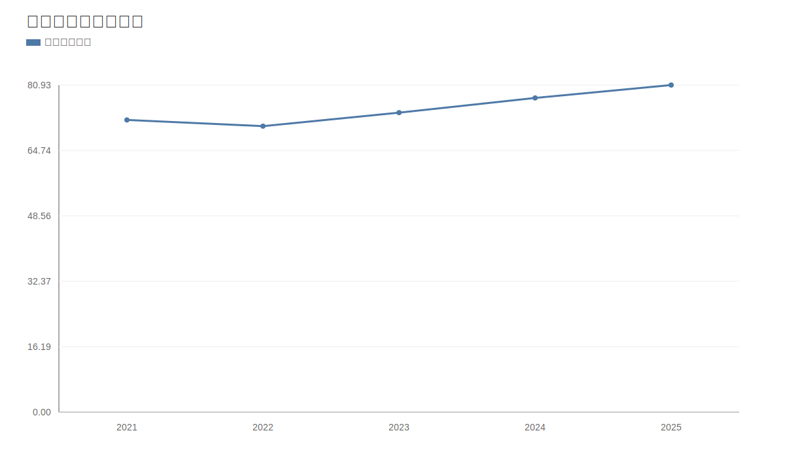

### 2. 净利润趋势图
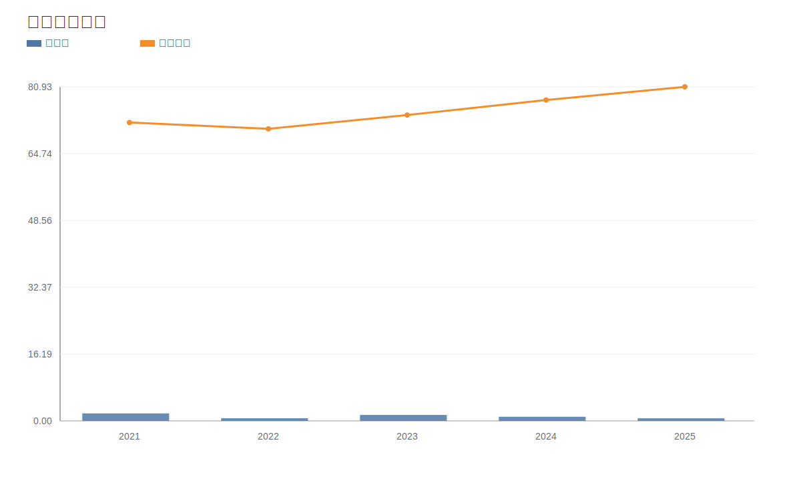

### 3. 毛利率和净利率对比图
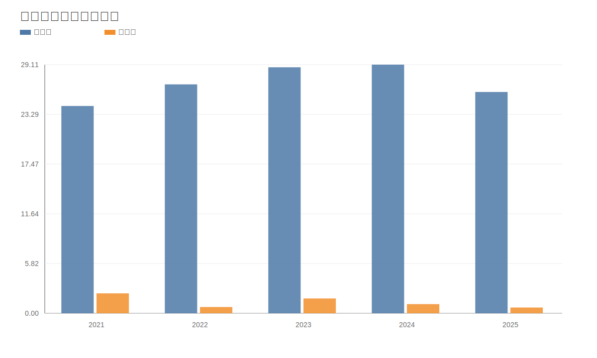

### 4. 分产品收入结构图
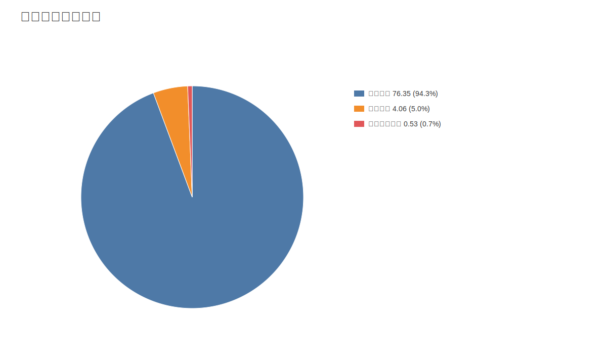

### 4. 分产品收入变化图
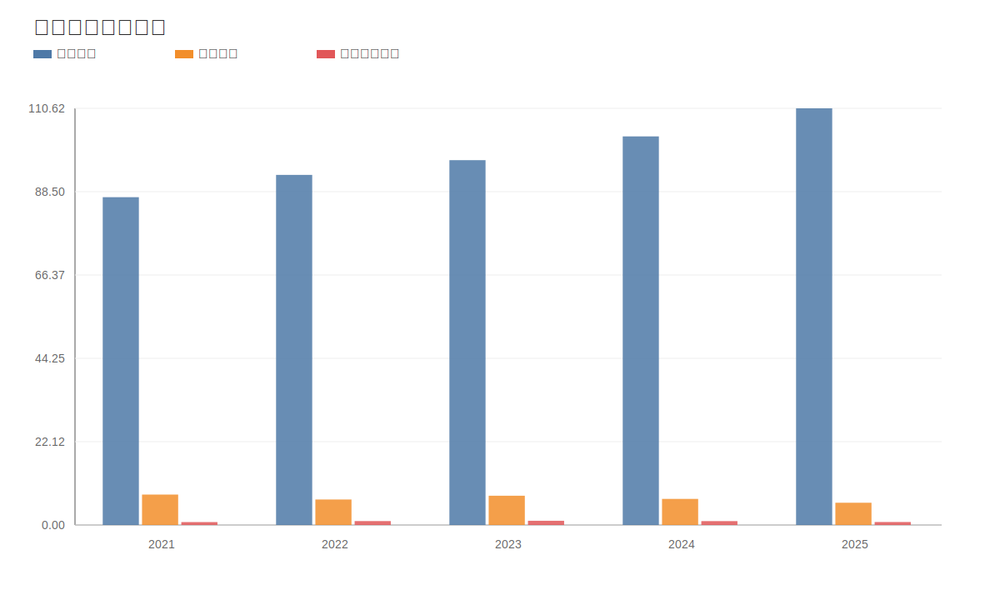

### 5. 分产品利润结构图
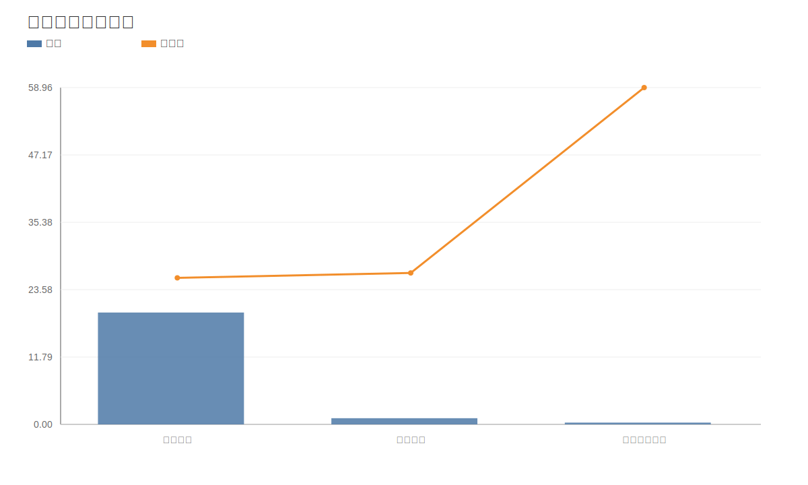

### 6. 分地区收入分布图
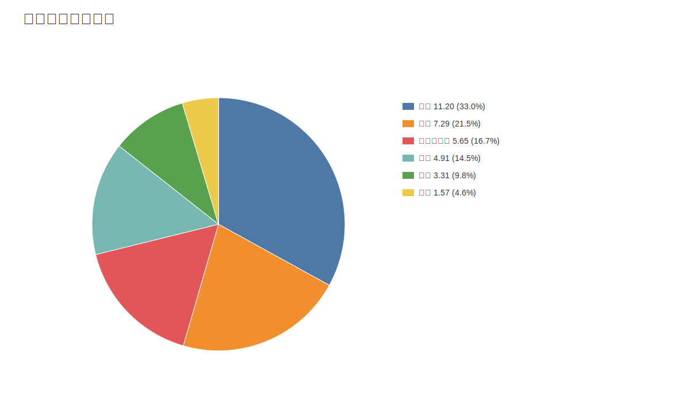

### 7. 资产负债表关键数据图
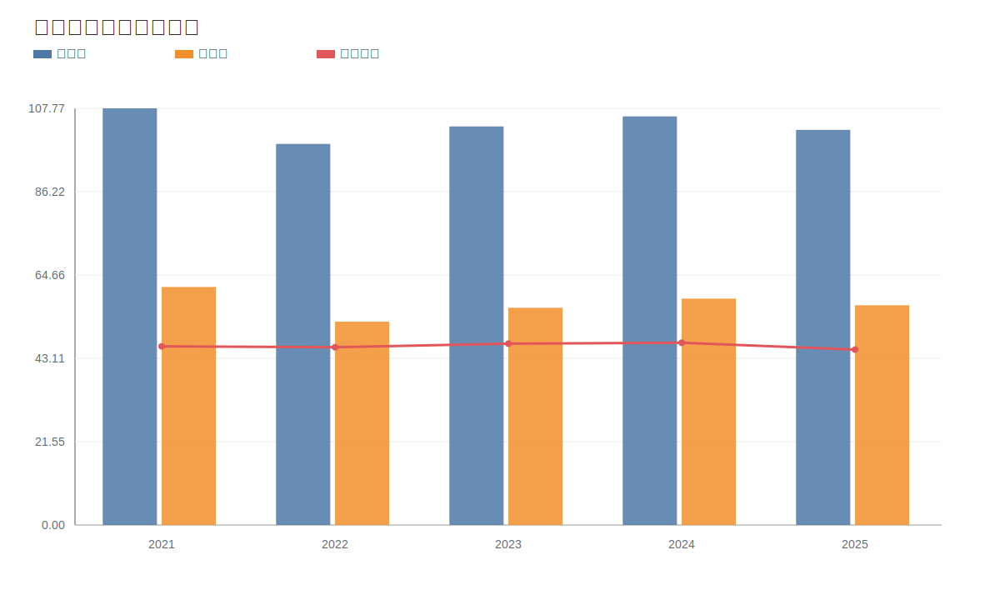

### 8. 自由现金流与经营现金流对比图
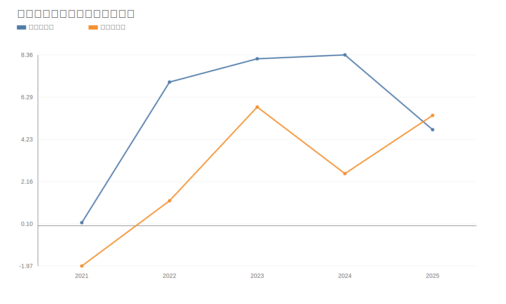

### 9. 股东回报分析图
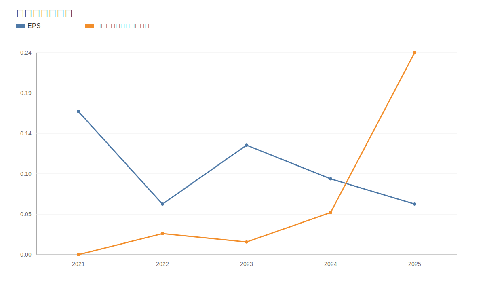

### 10. 财务比率分析图
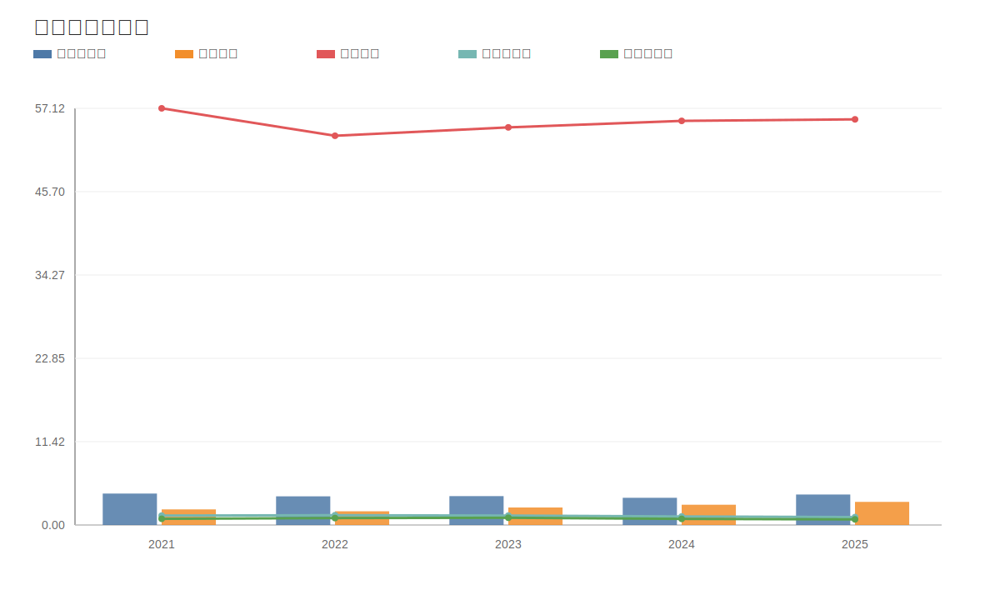

### 11. ROE与ROA对比图
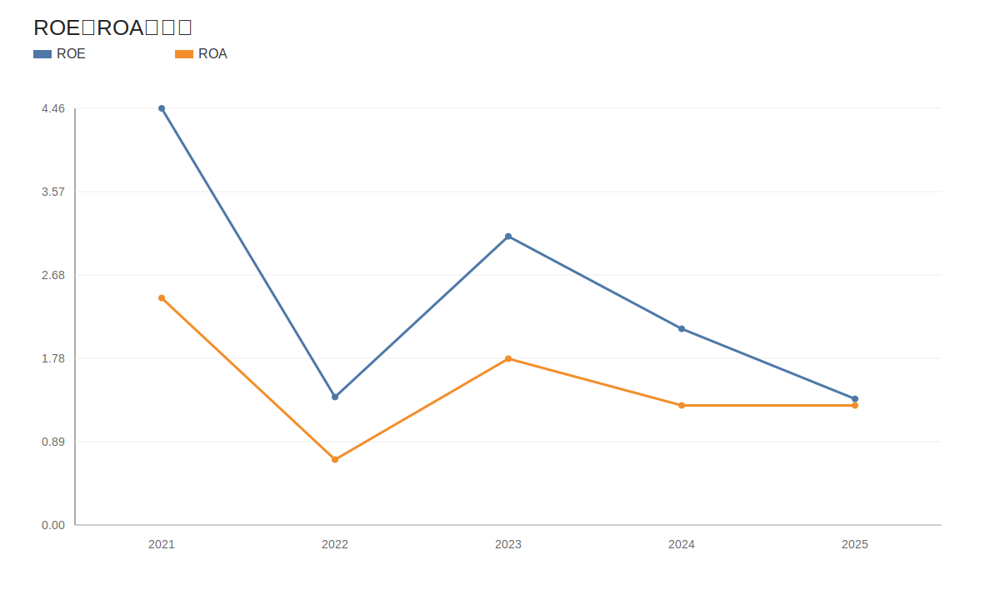
<!-- VALUE_CHARTS_END -->
