# 阳光电源（300274）深度价值研究报告

- 报告日期：2026年4月17日
- 数据截止：
  - 财务：2025年12月31日（年报口径）
  - 估值：2026年4月16日（最新交易日）
- 本地库主口径：`income/balancesheet/cashflow/fina_indicator/daily_basic/dividend/fina_audit/stock_company`
- 外部增量验证：巨潮年报/公告、国家能源局、公司官网新闻

## 1. 公司概况（商业模式优先）
阳光电源的核心商业模式是“电力电子设备（逆变器/储能系统）+全球渠道服务+电站系统解决方案”。收入主体为 ToB（电站开发商、工商业客户、渠道伙伴、海外 EPC），并通过服务网点和本地化交付增强复购。公司在光伏逆变器、储能系统、风电变流器及新能源电源设备上形成多产品线协同，且持续扩展 AIDC 电源相关布局。

公司基本面信息显示：上市时间 2011年11月2日，董事长兼总经理为曹仁贤；主营明确聚焦光伏逆变器与风能变流器，员工规模约 1.73 万人，属于“技术制造+全球销售+持续服务”型企业。

结论：阳光电源商业模式清晰，收入来源具备“设备交付+持续服务”复合属性，优于一次性纯项目制公司。
事实：截至 2025 年末，公司年营收约 891.84 亿元；公司官网披露全球服务网络覆盖广、海外布局持续深化。
推断：其长期竞争力不仅取决于产品性能，也取决于全球化交付和服务执行能力。

## 2. 行业与竞争格局
行业端仍处高景气扩容。国家能源局 2026年2月12日披露：2025 年全国光伏新增装机 3.17 亿千瓦、累计装机 12 亿千瓦，继续维持高增长。阳光电源 2025 年年报也引用第三方口径显示全球储能新增装机保持较快增速。

竞争格局方面，逆变器与储能设备赛道同时具备成长性与价格竞争压力。公司在年报披露 2025 年光伏逆变器全球发货量为 143GW，维持全球头部地位之一；但行业内仍有上能电气、锦浪科技、德业股份、固德威等多维竞争。

结论：赛道空间仍在扩张，但行业“技术迭代+价格竞争”并行，龙头也需要持续投入维持份额。
事实：2025 年我国光伏新增装机 3.17 亿千瓦（国家能源局）；公司披露 2025 年逆变器全球发货 143GW。
推断：阳光电源具备吃到行业增量的能力，但中长期回报率将更依赖产品结构和成本效率。

## 3. 护城河分析（含真伪辨别）
阳光电源护城河来源主要有四层：
1. 技术与产品代际能力（逆变器、储能系统、电力电子平台化研发）。
2. 全球渠道与服务网络（海外机构、服务网点、本地化交付）。
3. 规模效应带来的供应链与制造成本优势。
4. 品牌与项目业绩背书（大型项目经验累积）。

护城河真伪辨别：
- 提价 5% 会否流失客户：在标准化招标项目中会有流失压力；在高可靠性/高并网友好性要求的项目中，流失率相对可控。
- 客户是否价格敏感：中高敏感，尤其在同质化产品段。
- 是否“非它不可”：在部分复杂场景与大型项目存在替代门槛，但并非全面不可替代。
- 替代难度与切换成本：硬件切换成本中等，系统集成和后续运维切换成本较高。

结论：护城河强度评估为“中偏强”。
事实：公司具备全球发货规模、研发投入与服务网络优势，同时行业内存在多个强竞争对手。
推断：其护城河更接近“规模+技术+服务网络”的复合护城河，而非单一垄断护城河。

## 4. 管理层与资本配置
管理层层面，曹仁贤长期掌舵，战略连续性较强。公司治理方面，2025 年内有董事会与高管岗位调整，但公司治理制度更新和信息披露体系保持规范，年报披露公司在深交所信息披露考核连续保持高评级。

资本配置方面：
- 分红：2024 年度每 10 股派现 10.80 元（公告编号 2025-022），2025 年中期分红已实施，近年现金回报增强。
- 审计：近年审计意见持续“标准无保留”。
- 资金结构：2025 年末货币资金约 228.31 亿元，有息负债约 54.87 亿元，净现金约 173.43 亿元。

结论：管理层与资本配置评估为“价值创造者（中高置信）”。
事实：分红持续、审计意见稳定、净现金显著为正。
推断：若后续继续维持高研发强度并控制非核心资本开支，资本配置仍有上行空间。

## 5. 财务分析（成长/盈利/健康/现金流）
### 5.1 成长性
2021-2025 年营收从 241.37 亿元升至 891.84 亿元，5 年 CAGR 约 38.64%；归母净利润从 15.83 亿元升至 134.61 亿元，5 年 CAGR 约 70.77%，呈现高成长。

### 5.2 盈利能力
2024 年毛利率 29.94%、净利率 14.47%、ROE 34.16%、ROIC 25.39%，盈利质量显著优于多数制造业公司。2025 年年报主表显示利润继续增长，但本地 `fina_indicator` 的 2025 年年报口径尚未完全落库，因此最新比率以 2025Q3（毛利率 34.88%、净利率 18.00%、ROE 29.02%、ROIC 21.75%）作趋势参考。

### 5.3 财务健康
资产负债率处于可管理区间（2024 年约 65.07%），流动性指标稳定，且净现金规模较大，偿债冗余充足。

### 5.4 现金流质量
2025 年经营现金流净额约 169.18 亿元，同比增长约 40.18%，经营现金流/归母净利约 1.26 倍，自由现金流约 148.59 亿元，现金流与利润匹配较好。

结论：阳光电源财务质量属于“高成长+较高盈利+强现金流”组合。
事实：2025 年营收、净利、经营现金流均创新高，且现金流增速快于营收增速。
推断：若储能与海外业务维持结构优化，利润中枢仍有抬升可能。

## 6. 成长驱动
未来 3-5 年增长驱动可拆解为：
1. 全球光伏与储能装机扩容（需求端）。
2. 高功率逆变器、储能系统、构网型产品升级（产品端）。
3. 海外本地化组织与服务网络深化（渠道端）。
4. AIDC 电源等新方向（增量端，但仍处验证期）。

公司年报披露在欧洲、美洲、亚太、中东非等市场持续布局，逆变器新品迭代和储能场景落地在推进。成长路径更偏“全球新能源基础设施红利+产品技术迭代”。

结论：成长驱动以“放量+结构升级+全球化”三因子共振，具备中期持续性。
事实：行业新增装机仍高、公司发货规模与海外布局延续扩张。
推断：未来增长斜率可能低于 2022-2024 的高弹性阶段，但高于行业平均的概率仍较大。

## 7. 风险分析（含幸存者偏差）
核心风险：
1. 行业价格竞争导致毛利波动。
2. 海外贸易政策与汇率波动风险（公司年报明确提示）。
3. 原材料与供应链周期波动。
4. 新能源项目市场化竞价后（政策口径变化）对收益率的扰动。
5. 大规模扩张下的组织管理与应收回款管理压力。

幸存者偏差检验：
- 行业低景气与价格波动阶段（如 2021 年现金流承压）公司出现过阶段性自由现金流为负，但随后快速修复，2023-2025 再次回到高现金流区间。
- 公司在快速扩张中未出现持续亏损或明显资金链风险，说明穿越波动能力较强。

结论：抗风险能力评估为“中偏强”。
事实：公司经历过现金流压力期，但已恢复至高现金流状态，且净现金充足。
推断：最大风险不是生存风险，而是估值与利润率波动风险。

## 8. 估值分析
截至 2026年4月16日：
- 收盘价：133.90 元
- PE(TTM)：20.62
- PB：5.96
- PS(TTM)：3.11
- 股息率(TTM)：1.50%
- 总市值：约 2,776.03 亿元

历史分位（近 5 年）：
- PE 分位约 46.7%
- PB 分位约 17.8%
- PS 分位约 17.8%

同业横向（2026年4月16日，可比逆变器/储能）：
- 锦浪科技 PE 41.87 / PB 4.08 / PS 5.28
- 上能电气 PE 49.62 / PB 5.24 / PS 4.03
- 德业股份 PE 40.15 / PB 12.30 / PS 10.41
- 固德威 PE 155.25 / PB 7.70 / PS 2.38
- 阳光电源 PE 20.62 / PB 5.96 / PS 3.11

结论：估值判断为“合理偏低估（相对成长性与同业）”。
事实：阳光电源 PE 明显低于主要可比公司，PB/PS 历史分位偏低。
推断：市场给到折价，主要反映对行业波动与未来增速回落的担忧，而非龙头地位弱化。

## 9. 投资判断（多头/空头/跟踪指标）
### 多头逻辑
1. 光伏+储能双赛道景气延续，龙头受益确定性高。
2. 规模化与全球化能力突出，发货与交付体系成熟。
3. 盈利能力和现金流质量在制造业中处于优等。
4. 估值相对可比公司仍有安全垫。

### 空头逻辑
1. 海外贸易政策与汇率不确定性可能侵蚀利润。
2. 行业竞争加剧，价格战或压制毛利中枢。
3. 高成长阶段后增速回落，估值弹性可能下降。
4. 新业务（如 AIDC 电源）兑现节奏不确定。

### 核心跟踪指标（季度）
1. 储能与逆变器分业务毛利率趋势。
2. 经营现金流/净利润比值是否持续 >1。
3. 海外收入占比及海外利润率变化。
4. 应收账款周转与存货周转天数。
5. 大额订单交付节奏与汇兑损益波动。

结论：当前属于“高质量龙头+估值尚可”的配置区间。
事实：公司基本面强、估值并未显著透支增长。
推断：中长期胜率较高，但路径上会伴随行业与政策波动。

## 10. 最终结论
阳光电源是新能源电力电子领域的全球头部企业，兼具规模、技术与全球服务网络优势。其财务表现体现出较强的成长性与现金创造能力，且资本结构稳健。尽管行业竞争和政策扰动仍在，但公司具备穿越周期的经营底盘。

- 是否是一家好公司：是（高质量）
- 是否具备长期投资价值：是
- 当前价格是否值得买入：是（更适合分批而非追高）
- 投资建议：买入

结论：给出“买入”建议，前提是接受新能源行业波动并采用中期持有视角。
事实：2025 年营收、净利、经营现金流均创历史新高，估值横向不贵。
推断：若公司维持技术迭代和全球化执行力，未来 3 年仍有超额收益潜力。

## 11. 总评分（100分）
- 商业模式（20%）：17/20
- 护城河（20%）：16/20
- 管理层与资本配置（15%）：13/15
- 财务质量（20%）：18/20
- 风险控制（15%）：11/15
- 估值性价比（10%）：8/10

**最终总分：83/100**

结论：83 分对应“高质量、可长期跟踪并可配置”的区间。
事实：公司在成长、盈利、现金流、治理上表现均衡，短板主要在外部风险暴露。
推断：若行业竞争缓和或公司进一步提升储能盈利占比，评分仍有上修空间。

## 12. 三个终极问题（必须回答）
1. 如果提价 5%，客户会不会流失？
会有部分流失，尤其在标准化集中采购项目；但在高可靠性和复杂场景项目中，客户更看重综合性能和服务，流失可控。

2. 公司赚的钱有没有被管理层浪费？
目前证据不支持“系统性浪费”。分红持续、研发投入高、现金流强、净现金充足，资本配置总体有效。

3. 在行业最差年份，公司是怎么活下来的？
靠产品竞争力、全球化订单分散、现金管理和供应链效率。即使在现金流承压阶段，也未出现持续亏损和偿债失衡，随后恢复明显。

结论：三问总体给出偏正面答案，核心约束在行业波动而非公司生存能力。
事实：公司具备周期内修复能力与资金安全垫。
推断：其投资逻辑属于“强公司+波动行业”，关键是买入价格与持有纪律。

## 外部增量验证来源
- 阳光电源 2025 年年度报告全文（巨潮，2026-04-01）：https://static.cninfo.com.cn/finalpage/2026-04-01/1225066678.PDF
- 阳光电源第五届董事会第十七次会议决议公告（深交所披露，2025-04-26）：https://disc.static.szse.cn/disc/disk03/finalpage/2025-04-26/167006dc-870c-4fc2-a20f-8ebfb386ec78.PDF
- 国家能源局《2025年可再生能源并网运行情况》（2026-02-12）：https://www.nea.gov.cn/20260212/742b8c6a078347b0b39de676c05c5d58/c.html
- Sungrow 官网新闻（Intersolar Europe 2025，2025-05-09）：https://www.sungrowpower.com/en/newsdetail/6401
- Sungrow 官网新闻（2025 SEA Distribution Summit，含全球累计装机口径）：https://en.sungrowpower.com/newsDetail/6612/sungrow-strengthens-regional-commitment-at-2025-southeast-asia-distribution-summit

<!-- VALUE_CHARTS_START -->
## 图表图片（自动生成）

### 1. 主营业务收入趋势图
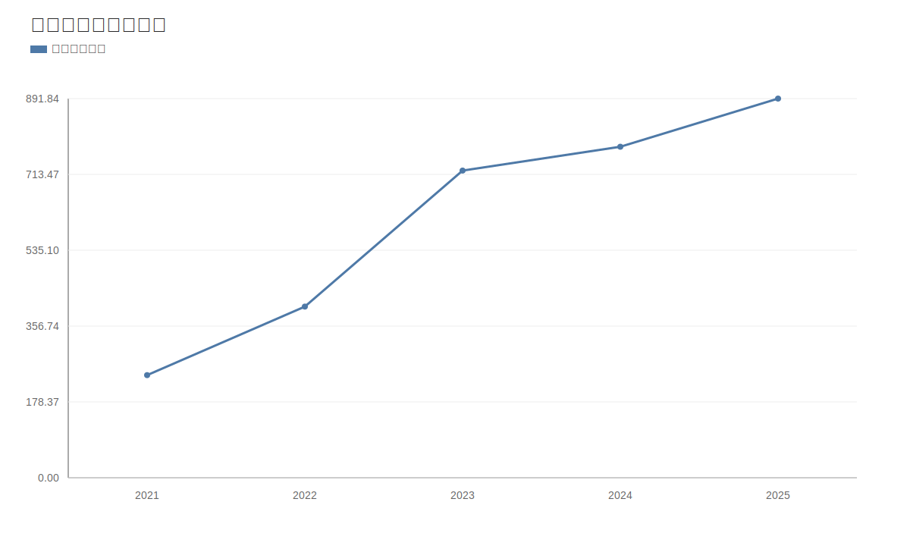

### 2. 净利润趋势图
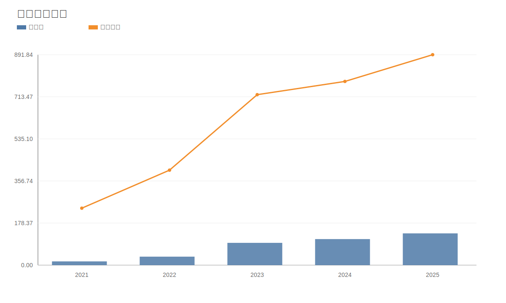

### 3. 毛利率和净利率对比图
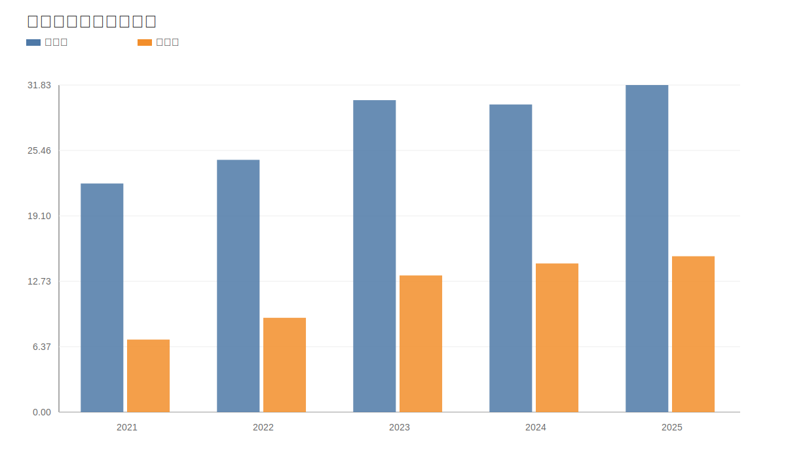

### 4. 分产品收入结构图
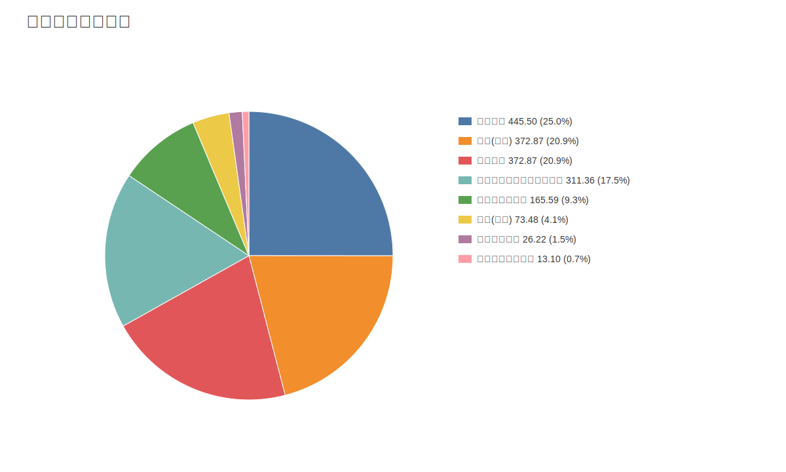

### 4. 分产品收入变化图
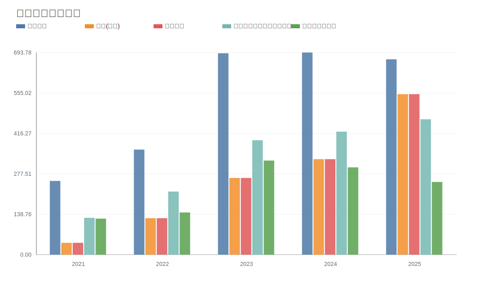

### 5. 分产品利润结构图
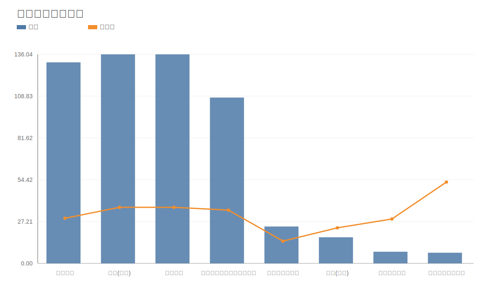

### 6. 分地区收入分布图
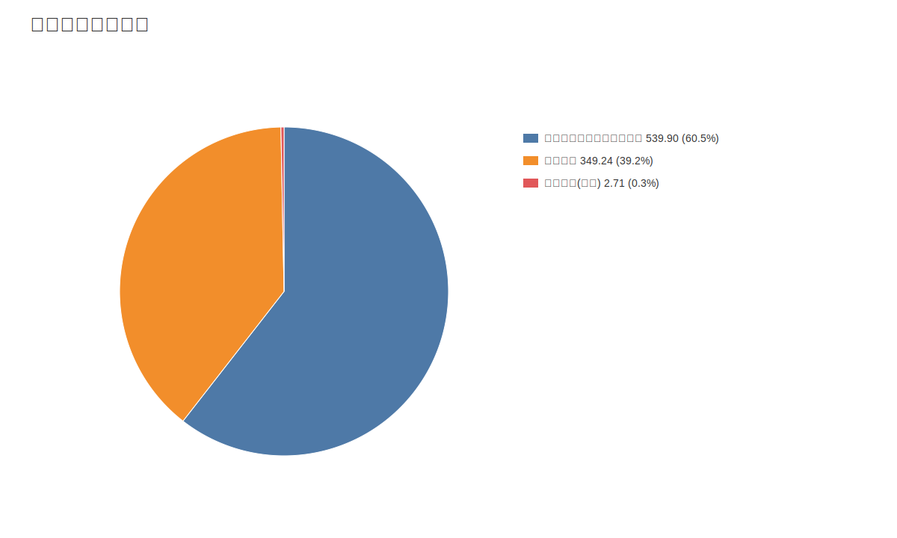

### 7. 资产负债表关键数据图
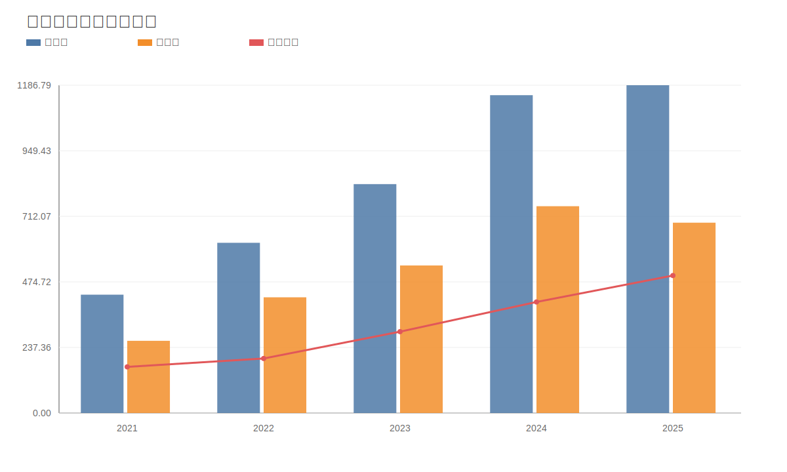

### 8. 自由现金流与经营现金流对比图
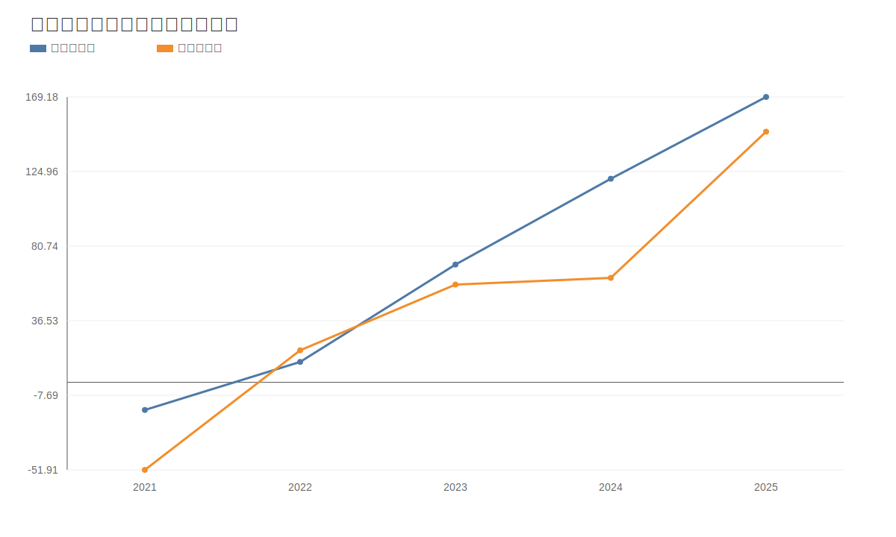

### 9. 股东回报分析图
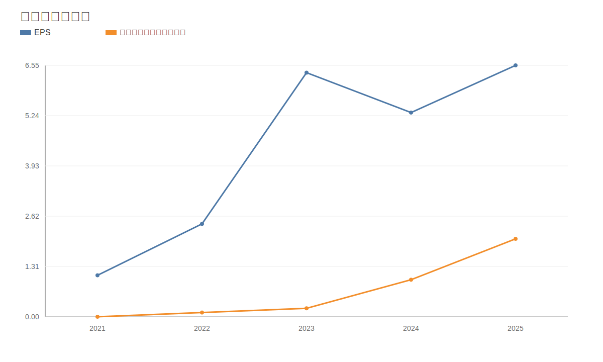

### 10. 财务比率分析图
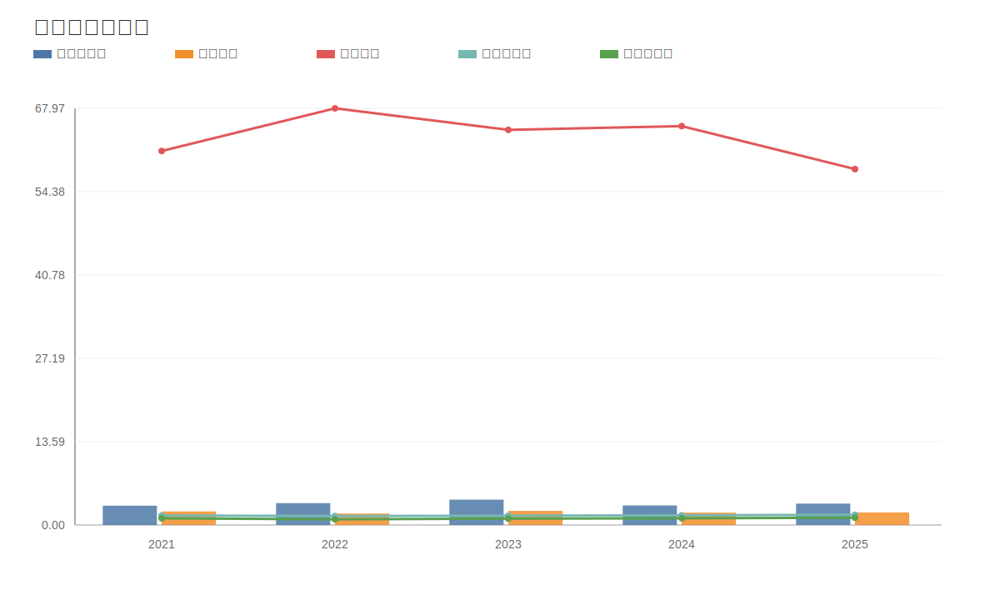

### 11. ROE与ROA对比图
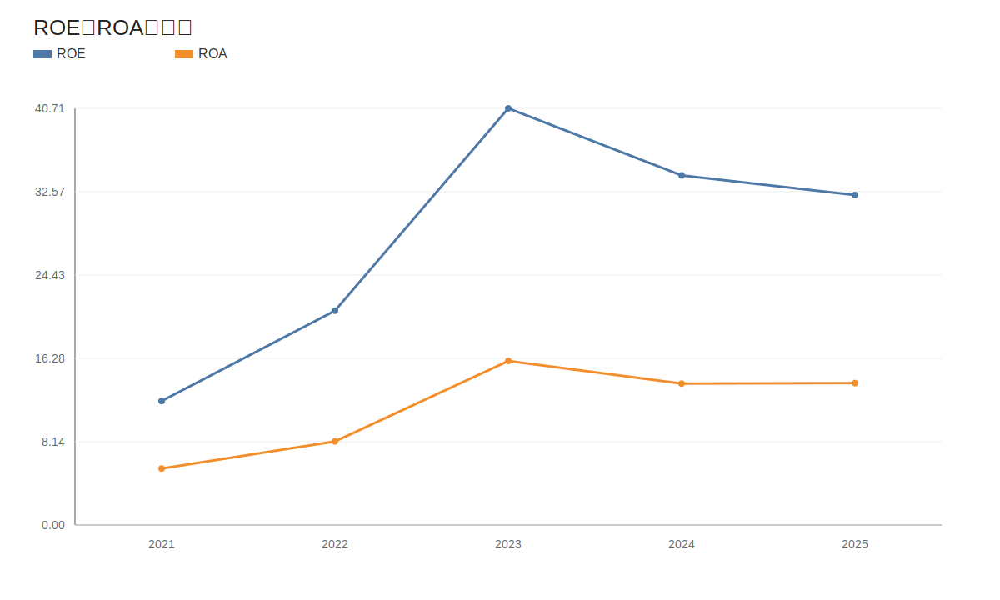
<!-- VALUE_CHARTS_END -->
