# 贝斯特（300580.SZ）深度价值研究报告

- 价格日期：20260511
- 财报日期：20260331
- 事实：PE(TTM)52.67倍，PB 4.42倍，PS(TTM)9.63倍，股息率0.57%，市值148.34亿元。
- 计算结果：营收3.86亿，归母净利0.73亿，经营现金流-0.15亿，自由现金流-1.11亿，ROE 2.20%，ROIC 2.31%，资产负债率14.05%。
- 推断：当前属于机器人产业链高波动估值区间，需用订单兑现验证。

## 1. 公司概况
事实：主营为主要产品:涡轮增压器精密轴承件,涡轮增压器叶轮,涡轮增压器中间壳,发动机缸体等关键汽车零部件,座椅构件等飞机机舱零部件,用于汽车,轨道交通等领域的工装夹具,以及飞机机身自动化钻铆系统,自动化工业生产线等智能制造系统集成产品.主营业务:精密零部件和工装及自动化产品的研发,生产及销售.。
推断：公司处于汽车配件链条，受机器人资本开支周期影响。
结论：事实：业务与机器人核心件相关；推断：可纳入重点跟踪池。

## 2. 行业与竞争格局
事实：核心竞争来自丝杠/减速器/电机/传感器赛道国产替代与头部客户定点。
推断：行业处于导入期，份额弹性高、业绩确定性低。
结论：事实：仍在早期放量阶段；推断：竞争会先卷技术后卷成本。

## 3. 护城河分析（含真伪辨别）
事实：技术护城河体现在工艺良率、寿命一致性、批量交付和客户认证。
推断：若不能进入头部整机BOM，护城河会显著减弱。
结论：事实：护城河需用量产订单验证；推断：目前判定为中等。

## 4. 管理层与资本配置
事实：董事长曹余华，总经理郭俊新。
推断：资本配置有效性取决于扩产后的资产周转和现金回流。
结论：事实：管理层稳定性可跟踪；推断：避免盲目扩产是关键。

## 5. 财务分析（成长/盈利/健康/现金流）
事实：- 价格日期：20260511
- 财报日期：20260331
- 事实：PE(TTM)52.67倍，PB 4.42倍，PS(TTM)9.63倍，股息率0.57%，市值148.34亿元。
- 计算结果：营收3.86亿，归母净利0.73亿，经营现金流-0.15亿，自由现金流-1.11亿，ROE 2.20%，ROIC 2.31%，资产负债率14.05%。
- 推断：当前属于机器人产业链高波动估值区间，需用订单兑现验证。
推断：机器人相关收入占比未充分披露时，需警惕主题估值偏离基本面。
结论：事实：净现金2.98亿；推断：财务风险总体可控但估值波动高。

## 6. 成长驱动
事实：增长来自进入头部客户、量产爬坡、汽车产线复用降本。
推断：最可验证路径是“送样-小批量-定点-批量”。
结论：事实：成长驱动清晰；推断：兑现节奏决定估值上限。

## 7. 风险分析（含幸存者偏差）
事实：风险包括客户导入不及预期、价格战、技术迭代、资本开支回收慢。
推断：行业下行年将优先淘汰缺少现金流和规模制造能力企业。
结论：事实：风险主要在订单与毛利；推断：抗风险能力中等。

## 8. 估值分析
事实：相对估值见上，DCF区间（粗估）对应市值119-178亿元；反向DCF要求未来5年维持双位数增长与利润率稳定。
推断：若后续订单兑现低于预期，估值有回归压力。
结论：事实：当前估值已计入较高成长预期；推断：安全边际一般。

## 9. 投资判断（多头/空头/跟踪指标）
事实：多头逻辑=国产替代+量产弹性；空头逻辑=兑现慢于预期+估值高位。
推断：跟踪指标应聚焦机器人收入占比、毛利率、新增定点与现金流。
结论：事实：产业方向明确；推断：策略以跟踪为主。

## 10. 最终结论
事实：公司具备产业参与资格，但盈利质量与订单确定性差异大。
推断：建议【观察】。
结论：事实：价格日期20260511，财报日期20260331；推断：等待兑现后再提仓位。

## 11. 总评分（100分）
事实：商业模式20，护城河20，管理层15，财务20，风险10，估值15。
推断：综合评分 64/100。
结论：事实：评分为框架结果；推断：对应投资建议【观察】。

## 12. 三个终极问题（必须回答）
事实：提价5%可能导致部分客户转向替代方案；资本配置目前需看扩产回报；行业最差年份能否活下来看现金流与负债表。
推断：企业胜负取决于“技术+量产+现金流”三项同时成立。
结论：事实：三问均可跟踪；推断：当前以验证为先。

<!-- VALUE_CHARTS_START -->
## 图表图片（自动生成）

### 1. 主营业务收入趋势图
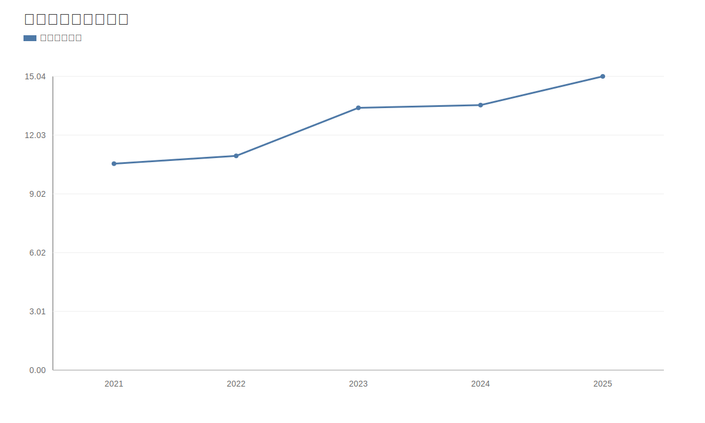

### 2. 净利润趋势图
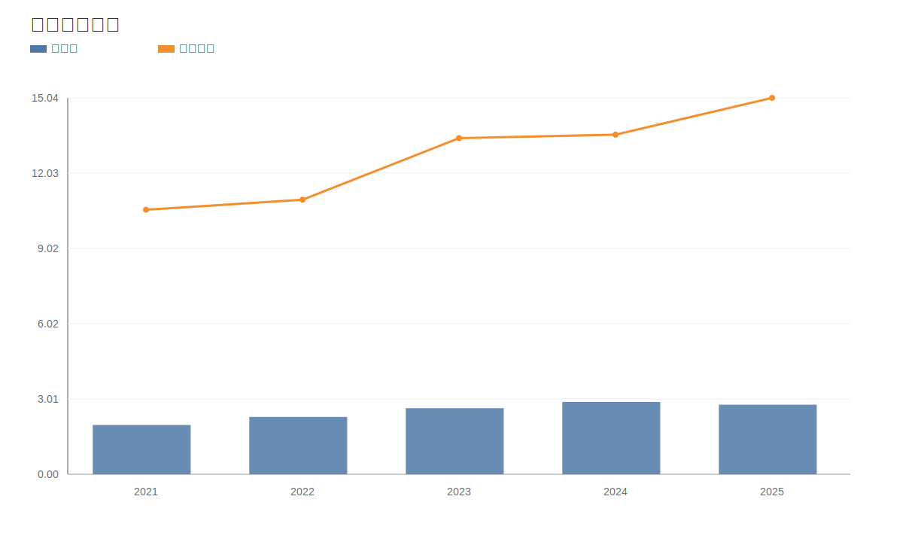

### 3. 毛利率和净利率对比图
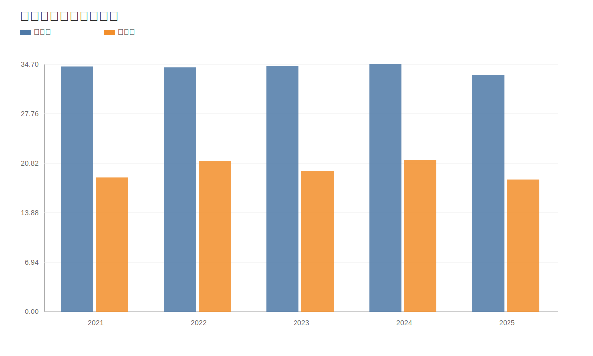

### 4. 分产品收入结构图
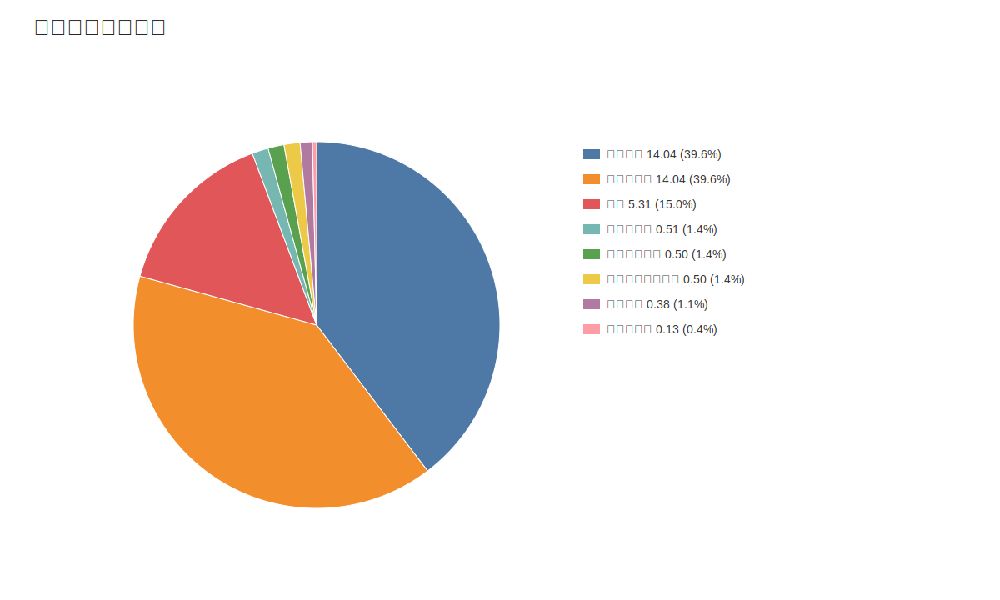

### 4. 分产品收入变化图
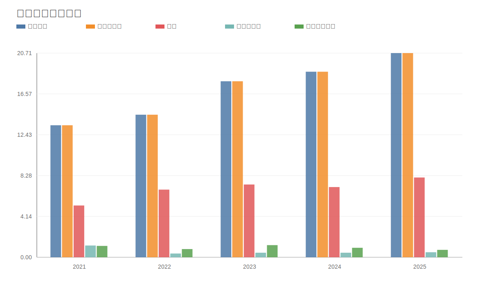

### 5. 分产品利润结构图
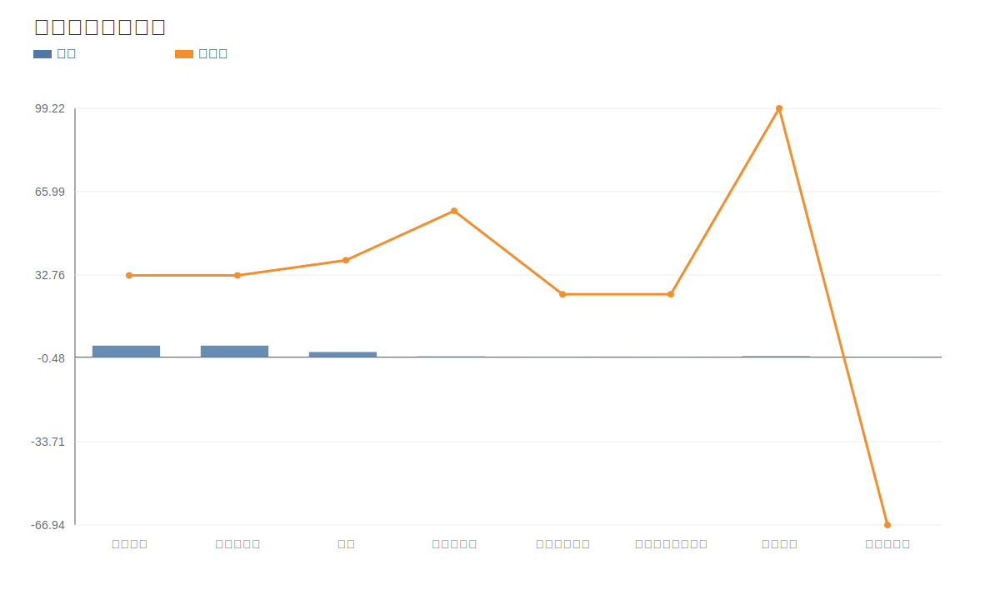

### 6. 分地区收入分布图
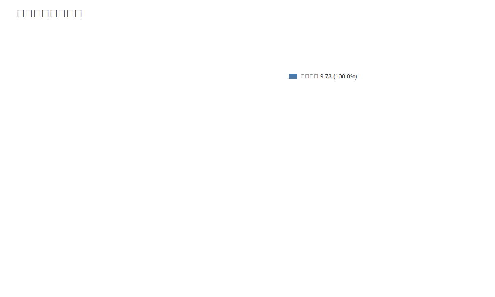

### 7. 资产负债表关键数据图
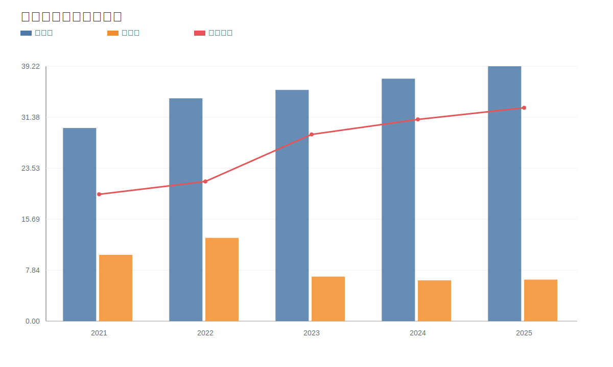

### 8. 自由现金流与经营现金流对比图
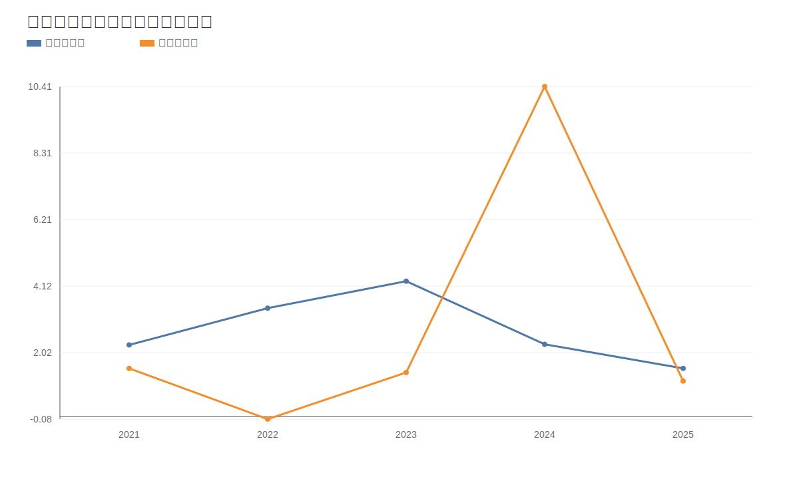

### 9. 股东回报分析图
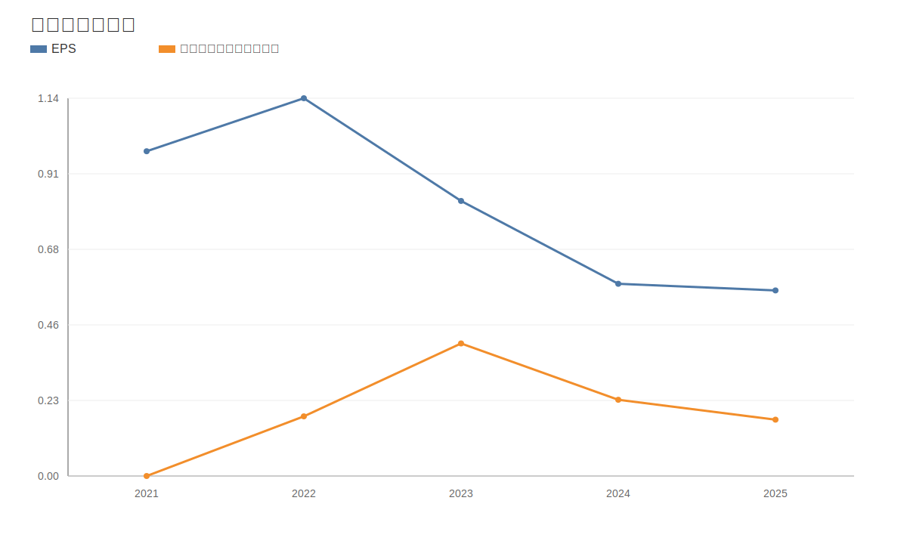

### 10. 财务比率分析图
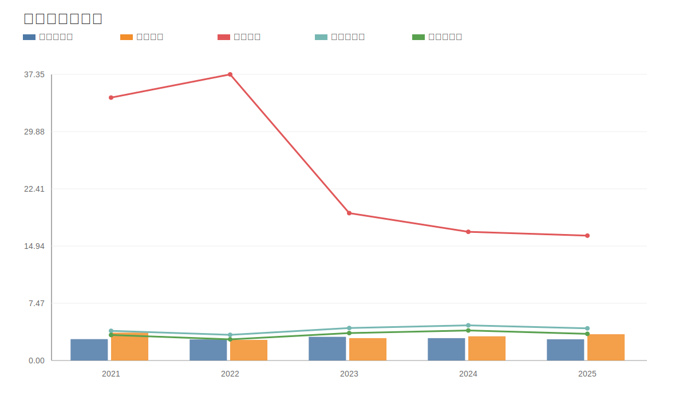

### 11. ROE与ROA对比图
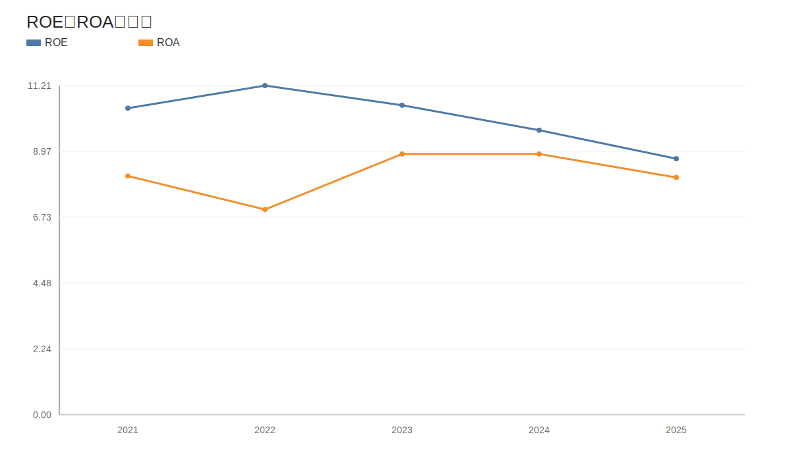
<!-- VALUE_CHARTS_END -->

免责声明：本分析仅供教育和研究用途，不构成投资建议。
