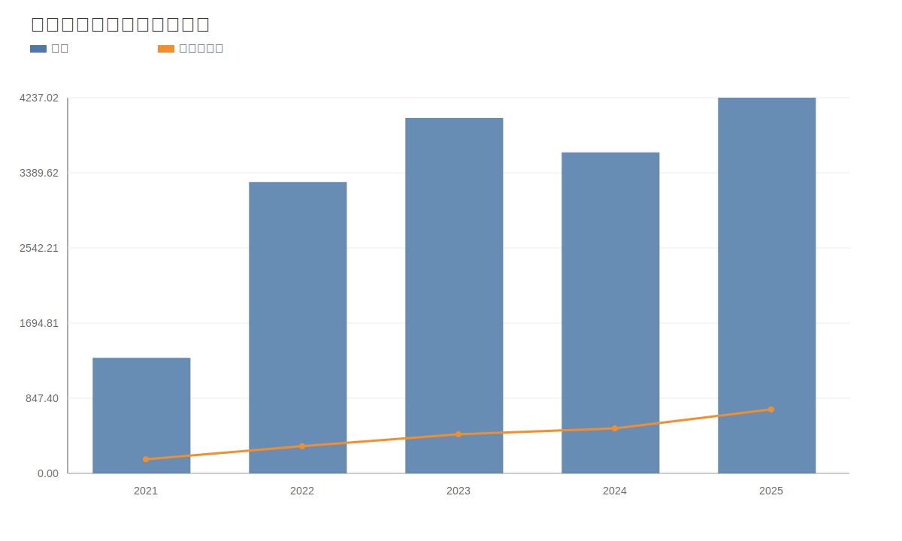
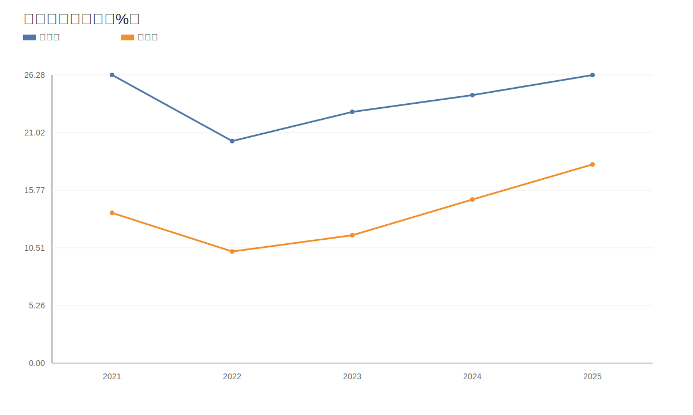
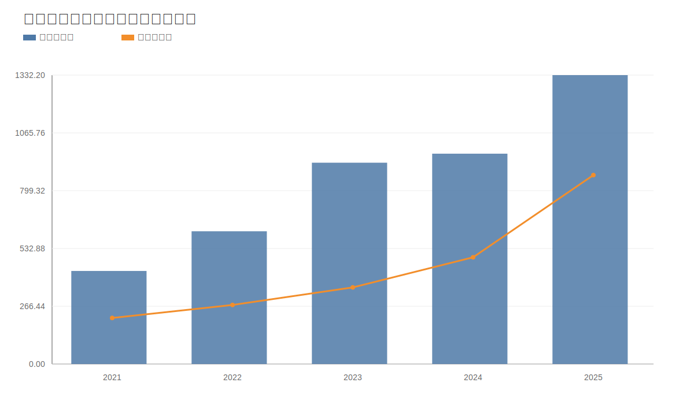
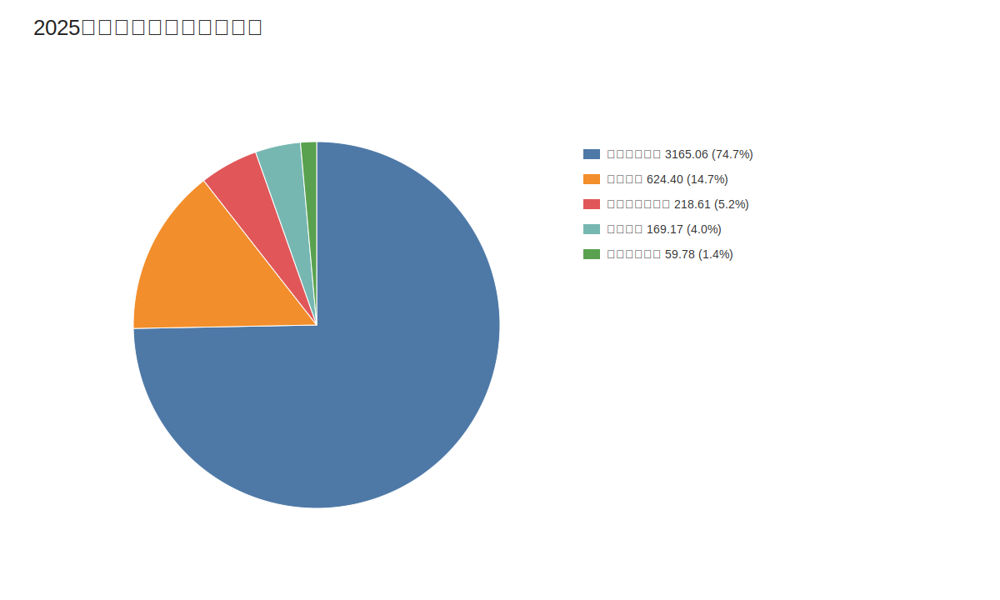

# 宁德时代（300750）深度价值研究报告（巴菲特+芒格框架）

价格日期：2026-04-17  
财报日期：2025-12-31

## 1. 公司概况（商业模式优先）
宁德时代通过动力电池和储能系统双主业变现，并用材料回收与矿产资源业务增强产业链闭环。客户结构以整车厂和储能集成商为主，收入既有量增逻辑也有技术溢价逻辑。

结论：商业模式质量高，具备规模化与平台化特征。  
事实：2025年收入4237.02亿元，动力电池占比约74.7%，储能占比约14.7%。  
推断：公司已进入“车储并举”阶段，单一市场波动风险较早期下降。

## 2. 行业与竞争格局
动力电池行业仍处成长与整合并行阶段，储能需求扩张带来新增空间，但价格竞争持续。龙头企业之间竞争焦点从单纯产能扩张转向技术、成本和全球交付体系。

结论：行业有空间但竞争不温和，龙头优势需要持续投入维护。  
事实：同业估值中，比亚迪PE约29x、亿纬锂能约36x、国轩高科约22x、宁德时代约26x。  
推断：行业将从“高增速阶段”转向“高质量增长阶段”。

## 3. 护城河分析（含真伪辨别）
护城河来源包括：成本优势（规模采购与制造）、技术迭代（体系和工艺能力）、渠道与客户认证（全球客户黏性）、有效规模（全球产能与交付网络）。

结论：护城河强度为“中偏强”，但需警惕技术代际重置。  
事实：2025年ROIC约15.56%，ROE约24.72%，反映资本效率较高。  
推断：若新技术路线出现突变且公司跟进不及，护城河会阶段性变窄。

## 4. 管理层与资本配置
管理层长期由核心创始团队主导，战略连续性高。资本配置特征是“高研发+高资本开支+全球布局”，目标是抢占中长期份额与技术制高点。

结论：管理层偏进攻但执行力强，资本配置总体有效。  
事实：2025年研发投入221.47亿元，占营收5.23%。  
推断：只要资本开支回报率维持，重投入战略可持续。

## 5. 财务分析（成长/盈利/健康/现金流）
成长性：2021-2025营收CAGR约34.3%，净利CAGR约45.9%。
盈利能力：2025年毛利率26.27%，净利率18.12%，较2024改善。
财务健康：资产负债率61.94%，流动比率1.60。
现金流：2025年经营现金流1332.20亿元，自由现金流871.15亿元，利润现金化良好。

结论：财务质量优秀，现金流是核心安全垫。  
事实：2025年净现金约2388.99亿元。  
推断：公司具备穿越周期并持续投入研发的财务条件。

## 6. 成长驱动
未来增长来自三条线：储能加速放量、海外市场拓展、产品结构升级（高附加值产品占比提升）。

结论：中期增长驱动存在，但增速可能较前高增长阶段更趋稳健。  
事实：2025年海外收入占比约30.6%，储能收入占比约14.7%。  
推断：若储能和海外同时兑现，成长中枢可维持双位数。

## 7. 风险分析（含幸存者偏差）
风险包括：价格战、技术路线变迁、政策与地缘摩擦、海外合规、资本开支回报不及预期。幸存者偏差检验要看公司在行业低谷期的现金流和偿债能力。

结论：抗风险能力“中偏强”，但不应忽视行业周期冲击。  
事实：2023-2024行业价格压力阶段，公司经营现金流仍保持在928.26-969.90亿元区间。  
推断：公司能抗压，但若长期价格下行超预期，利润中枢仍会下移。

## 8. 估值分析
相对估值：当前PE25.67x，PB5.67x，PS4.33x，处于历史中位附近。
绝对估值（DCF）：保守/基准/乐观分别约358/399/444元。
反向DCF：当前价格隐含未来5年FCF增速约11.0%。

结论：估值“合理偏中性”，并非明显低估。  
事实：若未来5年增速低于11.0%，当前估值安全边际将下降。  
推断：估值回报更依赖盈利兑现，而非估值扩张。

## 9. 投资判断（多头/空头/跟踪指标）
多头逻辑：
- 全球龙头地位与规模优势。
- 储能成为第二增长曲线。
- 强现金流支持研发和全球化布局。

空头逻辑：
- 行业价格竞争持续压缩盈利。
- 技术路线切换风险。
- 海外政策与贸易摩擦不确定性。

跟踪指标：
- 单Wh毛利与净利。
- 储能收入占比和毛利率。
- 海外收入增速与区域利润率。
- 经营现金流/净利润匹配度。

结论：中长期可配置，但需要严格跟踪兑现节奏。  
事实：当前估值未明显低估。  
推断：更适合“长期分批+动态跟踪”策略。

## 10. 最终结论
宁德时代是A股稀缺的全球化制造龙头，基本面强，财务韧性高，但估值并非无风险区。

结论：公司质量高，长期价值明确，当前价格建议“观察偏积极/分批”。  
事实：PE约25.7x，DCF基准约399元接近现价。  
推断：若业绩持续高于市场隐含增速，仍有上修空间。

## 11. 总评分（100分）
- 商业模式（20）：18
- 护城河（20）：17
- 管理层与资本配置（15）：13
- 财务质量（20）：18
- 风险控制（10）：7
- 估值性价比（15）：9
- 总分：82/100

结论：属于“高质量核心资产”，但性价比取决于买入节奏。  
事实：总分82分，强项在财务和商业模式，短板在估值与周期风险。  
推断：建议长期跟踪并在估值回调时提高仓位。

## 12. 三个终极问题（必须回答）
1. 如果提价5%，客户会不会流失？
- 答：短期有压力，但龙头在核心客户中仍具备一定议价能力，实际更可能通过产品结构与成本优化实现“变相提价”。

2. 公司赚的钱有没有被管理层浪费？
- 答：目前看没有明显浪费。高研发和资本开支与行业地位匹配，且现金流与回报率保持较好水平。

3. 在行业最差年份，公司是怎么活下来的？
- 答：靠规模成本优势、客户黏性与强现金流。即使在价格压力阶段，经营现金流仍维持高位。

结论：终极三问下，宁德时代仍满足“可长期跟踪的高质量标的”标准。  
事实：现金流、ROIC、全球份额是关键支撑。  
推断：只要技术和成本领先维持，长期竞争力仍在。

<!-- VALUE_CHARTS_START -->
## 图表图片（自动生成）

### 1. 营收与归母净利润（亿元）

### 2. 毛利率与净利率（%）

### 3. 经营现金流与自由现金流（亿元）

### 4. 2025分业务收入结构（亿元）

<!-- VALUE_CHARTS_END -->

> ⚠️ 免责声明：本分析仅供教育和研究用途，不构成投资建议。
