# 迈瑞医疗（300760）深度价值研究报告

- 生成时间：2026-04-17 22:00（Asia/Shanghai）
- 数据主口径：本地库（`income`、`balancesheet`、`cashflow`、`fina_indicator`、`daily_basic`、`dividend`、`fina_audit`、`stock_company`）
- 最新日期校验：`tushare-data`
- 口径说明：本地库估值最新交易日为 2026-04-16，`tushare` 最新交易日为 2026-04-17；本文价格与估值统一采用 2026-04-17。

## 1. 公司概况（商业模式优先）
迈瑞医疗是平台型医疗器械公司，核心在“设备装机 + 耗材/试剂复购 + 全球渠道放量”。

- 公司如何赚钱：生命信息与支持、体外诊断（IVD）、医学影像三大板块销售设备与配套耗材。
- 收入结构（2025-12-31）：IVD 约 37.5%，生命信息与支持约 36.9%，医学影像约 20.4%，其余约 5.2%。
- 图表口径说明：由于本地 `fina_mainbz` 缺失最新分项，图 4-6 使用本地空模板；本节收入结构数字采用 `tushare` 的 2025-12-31 口径。
- 客户类型：以医院/检验机构等 ToB 客户为主，具备医院流程绑定属性。
- 收入持续性：设备属于一次性销售，试剂与服务具有持续性复购；整体是“一次性+持续性”的混合模型。
- 区域与客户集中：公司具备全球布局，但本文未取得最新分地区收入完整口径，需在后续年报附注中继续跟踪。

结论：商业模式清晰，平台化特征明显，具备可理解的长期复利基础。  
事实：2025 年收入仍达 332.82 亿元，三大主业占比合计约 94.8%。  
推断：若装机规模继续扩张，耗材与服务占比提升将增强收入韧性。

## 2. 行业与竞争格局
- 行业属性：医疗器械属于政策与技术双驱动行业，长期受人口老龄化、医疗服务升级、国产替代推动。
- 行业阶段：核心赛道仍在结构性成长阶段，但短期受医院预算、集采与招投标节奏影响。
- 竞争对手（A 股可比）：联影医疗（影像）、新产业（IVD）、理邦仪器、迈克生物等。
- 产业链位置：迈瑞覆盖“监护+IVD+影像”多平台，属于综合型上游设备与解决方案供应商。
- 议价能力：相对单产品厂商更强，但在宏观弱周期与强竞争阶段，利润率仍会承压。

结论：赛道中长期仍优，但公司已从“高景气顺风”进入“份额与效率并重”阶段。  
事实：2025 年收入同比 -9.38%，净利润同比 -30.28%，显示行业与竞争压力已反映到报表。  
推断：未来 3-5 年行业增速中枢可能下移，公司超额收益将更多依赖产品升级与海外执行力。

## 3. 护城河分析（含真伪辨别）
- 品牌与临床认知：在国内中高端医院形成较强品牌心智。
- 技术与产品线：多平台协同降低单产品风险，形成交叉销售能力。
- 渠道与服务：装机后服务体系和临床流程适配提高替换门槛。
- 转换成本：医院替换设备与系统存在培训、验证、流程重构成本。
- 网络效应：弱于互联网平台，但在“设备-试剂-服务”生态有局部网络效应。

护城河真伪辨别：
- 提价 5% 会否流失客户：在刚需科室与高依赖场景，短期流失有限；在预算紧张或同质化细分领域，价格敏感度会上升。
- 是否“非它不可”：在部分高可靠性临床场景具备优势，但并非全场景不可替代。
- 替代品出现难度：中低端替代不难，高端系统级替代仍有门槛。
- 更换供应商成本：中高，尤其涉及全院流程与质控体系时。

结论：护城河为“中偏强”，但不是免疫竞争的绝对护城河。  
事实：公司仍保持较高 ROE/ROIC（2025 年 ROE 22.00%，ROIC 19.08%），且三大业务平台仍具规模。  
推断：若未来两年毛利率与净利率继续下行，护城河强度需从“中偏强”下修为“中等”。

## 4. 管理层与资本配置
- 管理层稳定性：董事长李西廷、总经理吴昊，核心管理层稳定。
- 诚信与审计：近年审计意见均为标准无保留（截至 2024 年报）。
- 分红连续性：近三年均有实施现金分红（2023 年每股约 4.30 元，2024 年约 8.86 元，2025 年约 4.63 元，税前口径）。
- 资本结构：截至 2025-12-31，货币资金约 176.90 亿元，有息负债极低（约 0.04 亿元，来自本地库口径）。
- 并购/回购：本报告口径未覆盖完整并购复盘与回购注销明细，结论以审慎中性处理。

结论：管理层总体表现为“偏价值创造者”，资本配置偏稳健。  
事实：持续分红、低杠杆、无保留审计意见构成管理质量的硬证据。  
推断：若公司在利润承压周期仍能维持研发与现金回报平衡，长期资本配置评价可继续上修。

## 5. 财务分析（成长/盈利/健康/现金流）
### 5.1 成长性
- 2020-2024（剔除 2025 下行冲击）收入 CAGR 约 14.96%，归母净利 CAGR 约 15.06%。
- 2025 年单年：收入 -9.38%，归母净利 -30.28%，经营现金流 -18.40%。
- 季度拐点：2025Q1/Q2/Q3/Q4 的利润同比分别约 -14.84%/-42.45%/-17.45%/-38.54%，恢复不连续。

### 5.2 盈利能力
- 2025 年毛利率 60.32%，净利率 25.39%，较 2024 年（63.11%/31.97%）明显回落。
- 2025 年 ROE 22.00%、ROIC 19.08%，绝对值仍高，但与历史高位相比已下台阶。

### 5.3 财务健康
- 2025 年资产负债率 27.43%，流动比率约 2.54（本地口径），短债压力可控。
- 货币资金 176.90 亿元，净现金状态明显。

### 5.4 现金流质量
- 2025 年经营现金流 101.45 亿元，自由现金流 86.44 亿元，均为正。
- 经营现金流/归母净利约 124.7%，利润现金化能力仍强。

结论：财务质量从“高增高质”转为“增速回落但底盘稳健”。  
事实：利润率和增速显著回落，但资产负债表与现金流仍保持健康。  
推断：若 2026 年利润不再下滑且现金流保持正向，市场将把当前下行视为周期扰动而非结构恶化。

## 6. 成长驱动
未来 3-5 年主要看四条线：
1. 国内医院设备更新与县域扩容节奏。
2. 海外市场渗透与本地化交付能力。
3. IVD 装机后的试剂放量与菜单升级。
4. 新业务（如微创外科、动物医疗等）从投入期到贡献期的转化效率。

建议跟踪的可验证信号：
- 单季度收入同比是否回到正增长并稳定。
- 毛利率是否止跌并回升到 61%+ 区间。
- 海外收入与高端产品占比是否持续提升。

结论：成长逻辑仍在，但短期需要“数据再证明”。  
事实：公司具备平台、渠道与现金流基础，且仍有多条业务增量线。  
推断：最可能的路径是“先利润率修复，再估值修复”，而非先估值大幅扩张。

## 7. 风险分析（含幸存者偏差）
- 政策/监管风险：集采、医保控费、医院预算收紧会压缩价格与盈利。
- 竞争风险：同业在影像和 IVD 细分持续追赶，价格竞争可能长期化。
- 技术替代风险：高端设备和检测技术迭代快，研发效率决定长期胜负。
- 财务与流动性风险：当前较低，但若利润长期承压将影响资本回报质量。
- 客户集中风险：医院端需求节奏波动会直接影响短期业绩。

幸存者偏差检验：
- 行业最差环境（上市后样本）：2025 年下行周期可视为压力测试年。
- 极端下公司表现：尽管利润下滑，经营现金流和自由现金流仍为正，且净现金为正。
- 结论：公司没有出现“利润下滑即现金流断裂”的脆弱特征。

结论：抗风险能力评估为“中偏强”，但盈利波动容忍度要下调。  
事实：2025 年利润下滑 30%+ 仍维持正自由现金流与净现金。  
推断：若 2026 年再现利润深度下滑，市场将从“周期下行”转向“护城河弱化”定价。

## 8. 估值分析
估值日期：2026-04-17。

- PE(TTM)：23.36x
- PB：4.99x
- PS(TTM)：5.71x
- PEG：
  - 以 2020-2024 净利 CAGR（15.06%）粗算，PEG ≈ 1.55。
  - 以 2025 当年增速口径（负增长）则 PEG 不具解释力。
- EV/EBITDA：
  - 市值约 1900.50 亿元（2026-04-17）
  - EV 约 1723.64 亿元（EV≈市值+有息负债-货币资金）
  - EBITDA（2025 年）约 109.65 亿元
  - EV/EBITDA ≈ 15.72x
- 历史分位（样本区间 2021-01-01 至 2026-04-17）：PE 分位约 4.4%，PB 分位约 0.16%。
- 同业对比（2026-04-17）：
  - 联影医疗 PE 49.32x / PB 4.31x
  - 新产业 PE 21.65x / PB 4.08x
  - 理邦仪器 PE 27.71x / PB 3.86x

结论：估值处于历史偏低区，但尚未到“深度低估无争议”区间。  
事实：PE/PB 历史分位已很低，但 EV/EBITDA 仍反映市场对恢复有一定预期。  
推断：估值弹性将主要取决于盈利修复速度，而非纯粹估值均值回归。

## 9. 投资判断（多头/空头/跟踪指标）
### 多头逻辑
1. 平台化产品矩阵与渠道能力仍在，长期竞争地位未被证伪。
2. 资产负债表稳健、净现金充足，抗波动能力强。
3. 当前估值分位处于历史低区，向下安全垫较前期提升。
4. 若利润率回稳，估值与业绩可能迎来“双修复”。

### 空头逻辑
1. 2025 年利润显著下滑，且季度修复不连续，基本面拐点未确认。
2. 医院预算与价格竞争压力可能延续，压制毛利率中枢。
3. 海外扩张与新品放量存在执行不确定性。
4. 市场对“平台龙头”仍保留溢价，一旦修复不及预期将继续去溢价。

### 核心跟踪指标（季度）
1. 单季度营收同比与归母净利同比是否连续两个季度转正。
2. 毛利率/净利率是否回升并稳定。
3. 经营现金流与净利润匹配度是否维持在 90% 以上。
4. 海外收入占比、高端产品占比变化。

结论：当前更适合“有条件观察”，等待盈利拐点确认后提高仓位确定性。  
事实：估值已回落，但盈利端尚未给出连续修复证据。  
推断：若未来 2-3 个季度出现“收入转正+利润率止跌+现金流稳定”，风险收益比将明显改善。

## 10. 最终结论
- 这是否是一家好公司：是，且属于 A 股医疗器械中的高质量平台公司。
- 是否具备长期投资价值：具备，但进入“再验证期”。
- 当前价格是否值得买入：可以研究和分批跟踪，不宜一次性重仓押注复苏斜率。
- 投资建议：**观察**。

结论：公司长期质量仍高，短期确定性不足，策略上应“重跟踪、轻预判”。  
事实：2025 年报显示盈利能力回落明显，而现金流与资产负债表仍稳健。  
推断：投资胜率取决于 2026 年利润率与增长恢复程度。

## 11. 总评分（100分）
- 商业模式（20%）：17/20
- 护城河（20%）：15/20
- 管理层与资本配置（15%）：12/15
- 财务质量（20%）：15/20
- 风险控制（10%）：7/10
- 估值性价比（15%）：11/15

**最终总分：77/100**

结论：77 分对应“优质公司、但非无脑买点”的区间。  
事实：高质量底盘与低估值分位并存，同时利润下行风险未完全解除。  
推断：分数向上或向下的关键在于 2026 年盈利恢复斜率。

## 12. 三个终极问题（必须回答）
1. 如果提价 5%，客户会不会流失？  
在核心临床场景和已深度装机医院，短期流失有限；在预算敏感和替代充分细分，订单会更敏感。

2. 公司赚的钱有没有被管理层浪费？  
当前证据看“未明显浪费”：长期分红、低杠杆、正自由现金流、无保留审计意见；但仍需跟踪新业务投入回报。

3. 在行业最差年份，公司是怎么活下来的？  
靠的是高毛利业务底盘、持续正现金流和净现金资产负债表。2025 年虽利润下滑，但没有出现现金流断裂与偿债压力。

结论：迈瑞通过“经营现金流 + 资产负债表 + 平台化产品”穿越了阶段性压力。  
事实：2025 年利润下滑 30%+ 时，经营现金流仍超 100 亿元、自由现金流仍为正。  
推断：只要研发与渠道能力未失真，公司仍具备中长期修复能力。

> ⚠️ **免责声明**：本分析仅供教育和研究用途，不构成投资建议。报告中的判断基于截至 2026-04-17 可得数据，后续需随新披露持续更新。

<!-- VALUE_CHARTS_START -->
## 图表图片（自动生成）

### 1. 主营业务收入趋势图
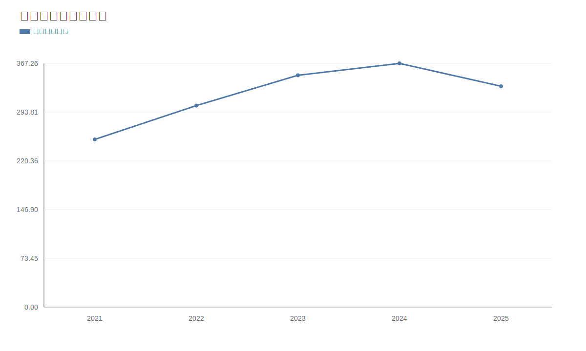

### 2. 净利润趋势图
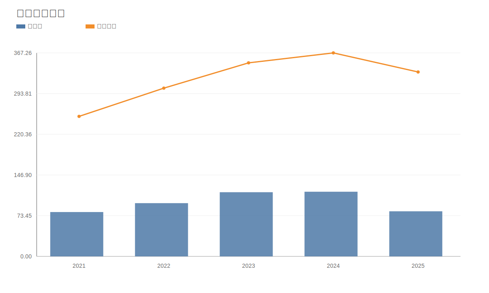

### 3. 毛利率和净利率对比图
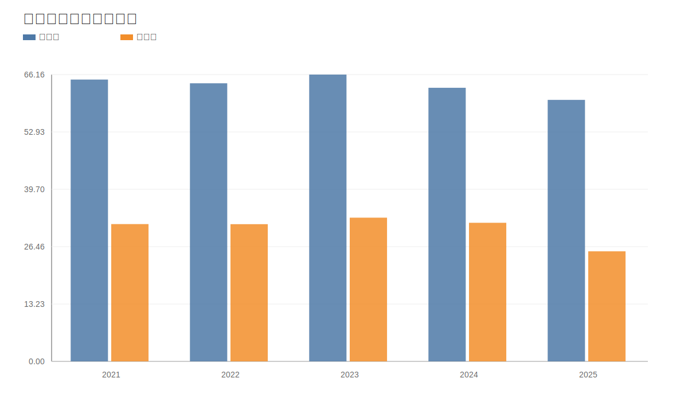

### 4. 分产品收入结构图
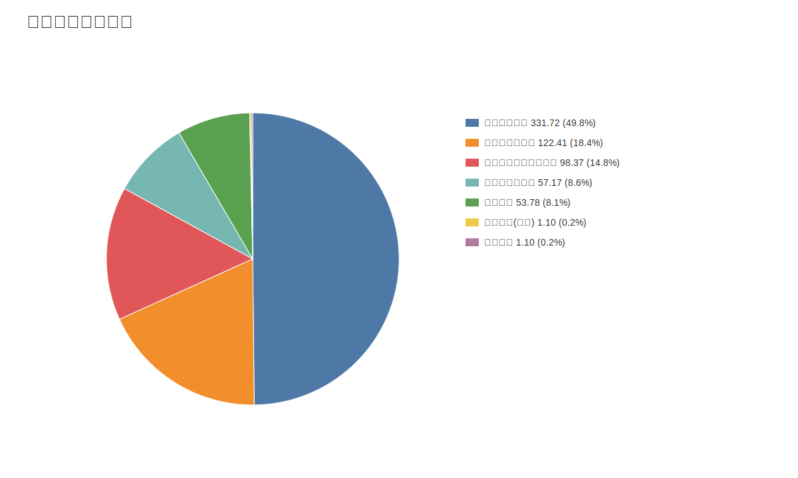

### 4. 分产品收入变化图
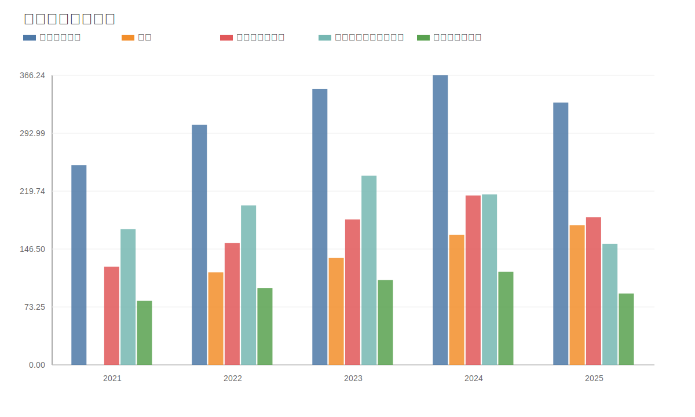

### 5. 分产品利润结构图
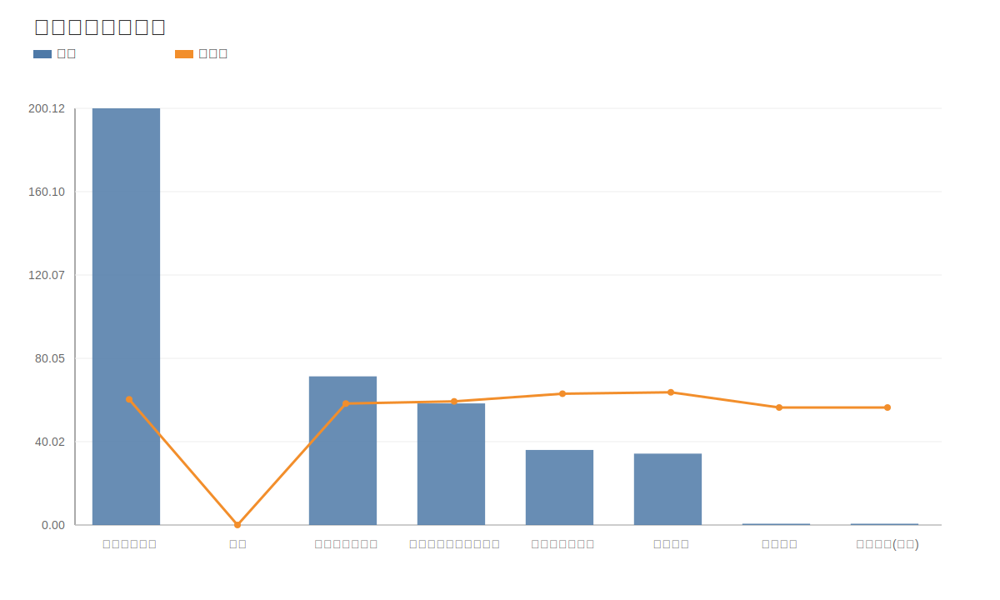

### 6. 分地区收入分布图
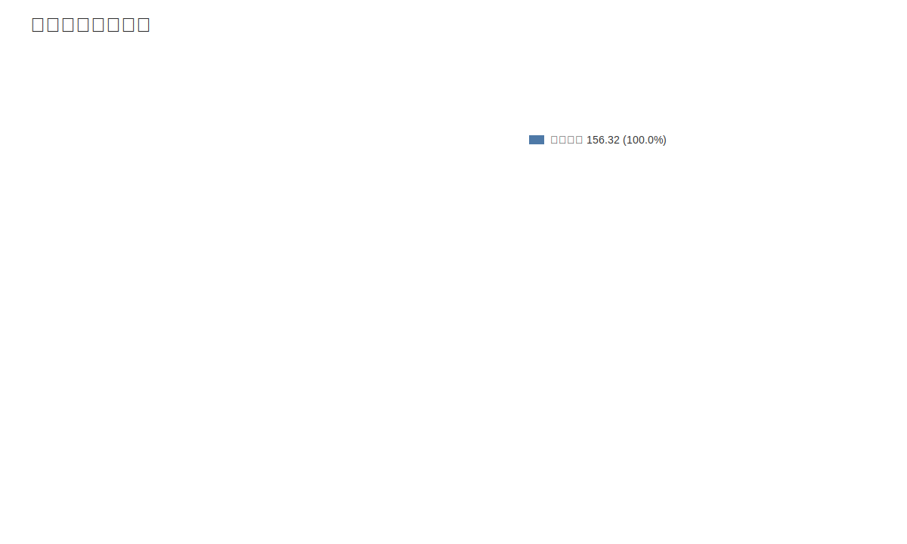

### 7. 资产负债表关键数据图
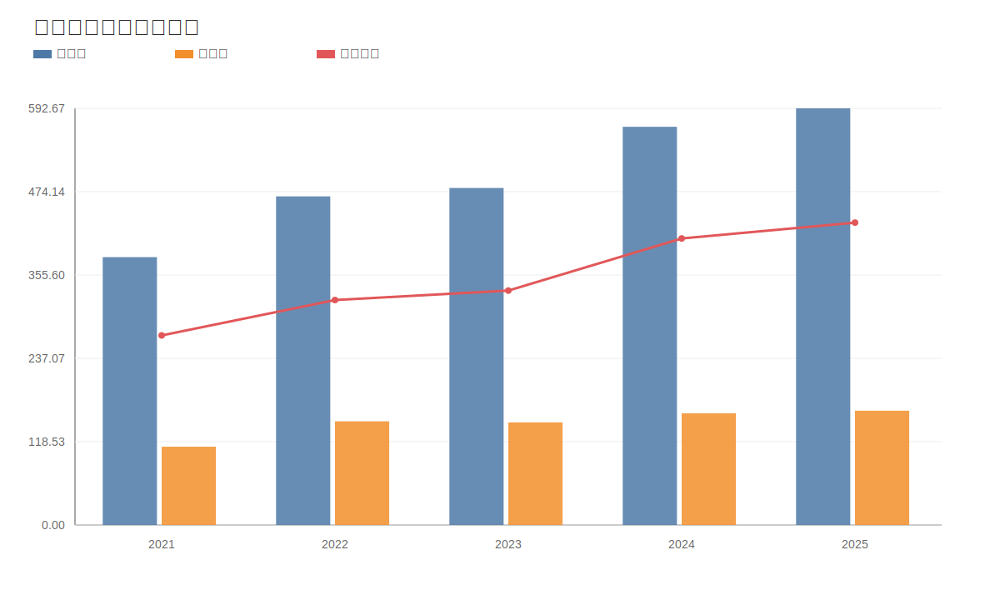

### 8. 自由现金流与经营现金流对比图
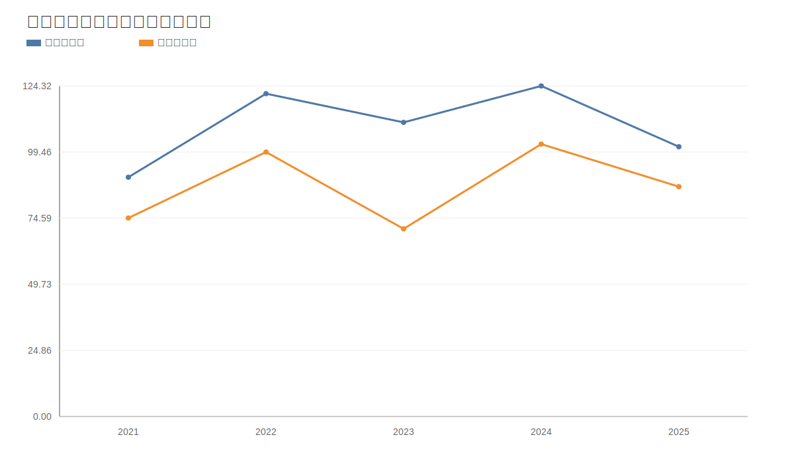

### 9. 股东回报分析图
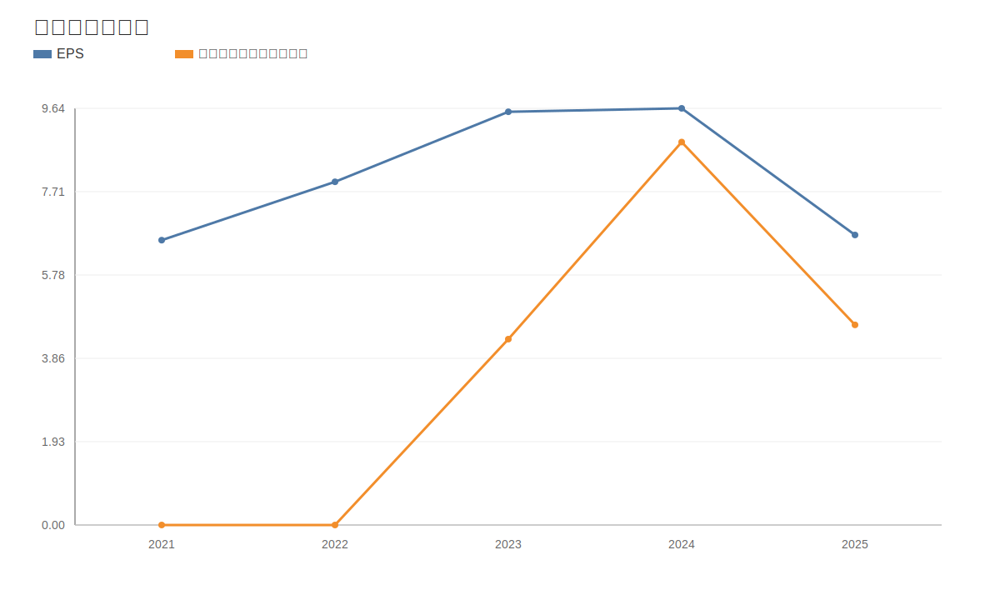

### 10. 财务比率分析图
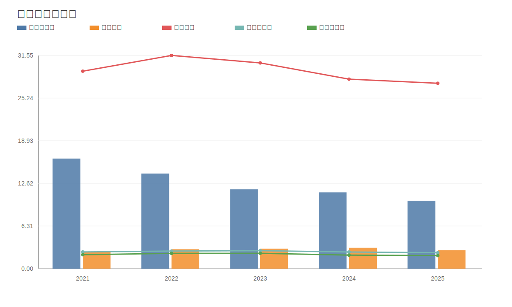

### 11. ROE与ROA对比图
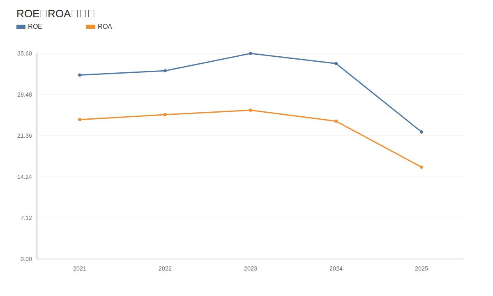
<!-- VALUE_CHARTS_END -->
