# 稳健医疗（300888.SZ）价值分析报告草稿

- 生成时间：2026-05-13 01:36:24
- 自动化脚本：`.agents/skills/value-report/value_report_scaffold.py`
- 数据口径：数据库字段定义以 `app/models/models.py` 为准
- 公司信息：行业 医疗保健｜地区 深圳｜上市日期 20200917
- 管理层：董事长 李建全｜总经理 李建全｜员工 15642
- 主营业务：主营业务:研发,生产和销售以棉花为主要原材料的医用敷料和日用消费品;主要产品::winner品牌下医用敷料六大系列产品,全棉时代品牌下日用消费产品四大系列产品以及自有专利技术生产的工业中间产品—全棉无纺布卷材.
- 提示：本文件已自动填充定量部分，定性模块请结合最新公告与行业资料补充。

## 自动填充数据（可直接引用）
### 最新估值
- 交易日：20260511
- 收盘价：32.16 元
- PE(TTM)：24.29 倍
- PB：1.59 倍
- PS(TTM)：1.70 倍
- 股息率(TTM)：2.18%
- 总市值：187.28 亿元

### 最新财务快照
- 报告期：20260331
- 营收：26.79亿（同比 2.84%）
- 归母净利润：2.51亿（同比 1.18%）
- 经营现金流：-1.32亿（同比 42.62%）
- 自由现金流：-8.06亿
- 毛利率：48.92%，净利率：10.11%
- ROE：2.16%，ROIC：1.76%
- 资产负债率：32.11%，流动比率：1.86
- 经营现金流/利润：-37.48%
- 货币资金：16.84亿，有息负债：21.34亿，净现金：-4.49亿

### 近五年年报趋势
| 年度 | 营收 | 营收同比 | 归母净利 | 净利同比 | 毛利率 | 净利率 | ROE | ROIC | 资产负债率 | 经营现金流 | 自由现金流 | 现净比 |
| --- | --- | --- | --- | --- | --- | --- | --- | --- | --- | --- | --- | --- |
| 2025 | 109.49亿 | 21.96% | 7.68亿 | 10.44% | 47.64% | 7.44% | 6.78% | 5.37% | 33.21% | 16.66亿 | 6.46亿 | 216.89% |
| 2024 | 89.78亿 | 9.69% | 6.95亿 | 19.81% | 47.32% | 8.25% | 6.13% | 4.75% | 35.43% | 12.66亿 | 0.34亿 | 182.02% |
| 2023 | 81.85亿 | -27.89% | 5.80亿 | -64.84% | 49.00% | 7.68% | 5.00% | 3.89% | 29.23% | 10.63亿 | 2.67亿 | 183.20% |
| 2022 | 113.51亿 | 41.23% | 16.51亿 | 33.18% | 47.38% | 14.75% | 14.75% | 12.24% | 33.20% | 29.83亿 | 5.05亿 | 180.75% |
| 2021 | 80.37亿 | N/A | 12.39亿 | N/A | 49.88% | 15.40% | 11.73% | 10.24% | 19.44% | 8.72亿 | 12.67亿 | 70.34% |

- 近五年营收CAGR：8.04%
- 近五年净利CAGR：-11.28%

### 分红与审计
#### 已实施分红
2025年已实施现金分红（税前）合计：每股 0.700 元
2024年已实施现金分红（税前）合计：每股 0.900 元
2023年已实施现金分红（税前）合计：每股 1.900 元
2022年已实施现金分红（税前）合计：每股 0.900 元

#### 审计意见
- 20241231：标准无保留意见（安永华明会计师事务所）
- 20231231：标准无保留意见（立信会计师事务所）
- 20221231：标准无保留意见（立信会计师事务所）
- 20211231：标准无保留意见（立信会计师事务所）
- 20201231：标准无保留意见（立信会计师事务所）

## ECharts 图表数据（option）

- 说明：以下 `option` 可直接用于前端图表渲染；单位已在坐标轴标注。

### 1. 主营业务收入趋势图
```json
{
  "title": {
    "text": "主营业务收入趋势（近5年）"
  },
  "tooltip": {
    "trigger": "axis"
  },
  "legend": {
    "top": 24,
    "data": [
      "主营业务收入"
    ]
  },
  "xAxis": {
    "type": "category",
    "data": [
      "2021",
      "2022",
      "2023",
      "2024",
      "2025"
    ]
  },
  "yAxis": {
    "type": "value",
    "name": "亿元"
  },
  "series": [
    {
      "name": "主营业务收入",
      "type": "line",
      "smooth": true,
      "data": [
        80.37,
        113.51,
        81.85,
        89.78,
        109.49
      ]
    }
  ]
}
```

### 2. 净利润趋势图
```json
{
  "title": {
    "text": "净利润趋势（近5年）"
  },
  "tooltip": {
    "trigger": "axis"
  },
  "legend": {
    "top": 24,
    "data": [
      "净利润",
      "营业收入"
    ]
  },
  "xAxis": {
    "type": "category",
    "data": [
      "2021",
      "2022",
      "2023",
      "2024",
      "2025"
    ]
  },
  "yAxis": [
    {
      "type": "value",
      "name": "亿元"
    },
    {
      "type": "value",
      "name": "亿元"
    }
  ],
  "series": [
    {
      "name": "净利润",
      "type": "bar",
      "data": [
        12.39,
        16.51,
        5.8,
        6.95,
        7.68
      ]
    },
    {
      "name": "营业收入",
      "type": "line",
      "yAxisIndex": 1,
      "data": [
        80.37,
        113.51,
        81.85,
        89.78,
        109.49
      ]
    }
  ]
}
```

### 3. 毛利率和净利率对比图
```json
{
  "title": {
    "text": "毛利率 vs 净利率"
  },
  "tooltip": {
    "trigger": "axis"
  },
  "legend": {
    "top": 24,
    "data": [
      "毛利率",
      "净利率"
    ]
  },
  "xAxis": {
    "type": "category",
    "data": [
      "2021",
      "2022",
      "2023",
      "2024",
      "2025"
    ]
  },
  "yAxis": {
    "type": "value",
    "name": "%"
  },
  "series": [
    {
      "name": "毛利率",
      "type": "bar",
      "data": [
        49.88,
        47.38,
        49.0,
        47.32,
        47.64
      ]
    },
    {
      "name": "净利率",
      "type": "bar",
      "data": [
        15.4,
        14.75,
        7.68,
        8.25,
        7.44
      ]
    }
  ]
}
```

### 4. 分产品收入结构图
```json
{
  "title": {
    "text": "分产品收入结构（20251231）"
  },
  "tooltip": {
    "trigger": "item"
  },
  "legend": {
    "type": "scroll",
    "top": 24
  },
  "series": [
    {
      "type": "pie",
      "radius": "55%",
      "data": [
        {
          "name": "健康生活消费品(行业)",
          "value": 57.49
        },
        {
          "name": "医用耗材(行业)",
          "value": 51.14
        },
        {
          "name": "国外",
          "value": 31.32
        },
        {
          "name": "干湿棉柔巾",
          "value": 17.61
        },
        {
          "name": "手术室耗材产品",
          "value": 15.15
        },
        {
          "name": "成人服饰",
          "value": 11.34
        },
        {
          "name": "伤口与包扎护理产品",
          "value": 11.3
        },
        {
          "name": "卫生巾",
          "value": 10.18
        }
      ]
    }
  ]
}
```

### 4. 分产品收入变化图
```json
{
  "title": {
    "text": "分产品收入变化（近5年）"
  },
  "tooltip": {
    "trigger": "axis"
  },
  "legend": {
    "type": "scroll",
    "top": 24,
    "data": [
      "健康生活消费品(行业)",
      "医用耗材(行业)",
      "国外",
      "干湿棉柔巾",
      "手术室耗材产品"
    ]
  },
  "xAxis": {
    "type": "category",
    "data": [
      "2021",
      "2022",
      "2023",
      "2024",
      "2025"
    ]
  },
  "yAxis": {
    "type": "value",
    "name": "亿元"
  },
  "series": [
    {
      "name": "健康生活消费品(行业)",
      "type": "bar",
      "stack": "total",
      "data": [
        58.45,
        59.36,
        63.26,
        72.73,
        84.94
      ]
    },
    {
      "name": "医用耗材(行业)",
      "type": "bar",
      "stack": "total",
      "data": [
        60.49,
        104.36,
        60.35,
        56.57,
        76.3
      ]
    },
    {
      "name": "国外",
      "type": "bar",
      "stack": "total",
      "data": [
        28.03,
        20.53,
        22.94,
        30.03,
        46.69
      ]
    },
    {
      "name": "干湿棉柔巾",
      "type": "bar",
      "stack": "total",
      "data": [
        0.0,
        11.55,
        17.32,
        22.38,
        25.74
      ]
    },
    {
      "name": "手术室耗材产品",
      "type": "bar",
      "stack": "total",
      "data": [
        0.0,
        4.72,
        8.26,
        8.26,
        22.58
      ]
    }
  ]
}
```

### 5. 分产品利润结构图
```json
{
  "title": {
    "text": "分产品利润结构（20251231）"
  },
  "tooltip": {
    "trigger": "axis"
  },
  "legend": {
    "top": 24,
    "data": [
      "利润",
      "毛利率"
    ]
  },
  "xAxis": {
    "type": "category",
    "data": [
      "健康生活消费品(行业)",
      "医用耗材(行业)",
      "国外",
      "干湿棉柔巾",
      "手术室耗材产品",
      "成人服饰",
      "伤口与包扎护理产品",
      "卫生巾"
    ]
  },
  "yAxis": [
    {
      "type": "value",
      "name": "亿元"
    },
    {
      "type": "value",
      "name": "%"
    }
  ],
  "series": [
    {
      "name": "利润",
      "type": "bar",
      "data": [
        32.95,
        18.97,
        11.78,
        8.48,
        4.59,
        7.6,
        3.71,
        6.93
      ]
    },
    {
      "name": "毛利率",
      "type": "line",
      "yAxisIndex": 1,
      "data": [
        57.31,
        37.1,
        37.61,
        48.14,
        30.31,
        66.99,
        32.84,
        68.04
      ]
    }
  ]
}
```

### 6. 分地区收入分布图
```json
{
  "title": {
    "text": "分地区收入分布（20251231）"
  },
  "tooltip": {
    "trigger": "item"
  },
  "legend": {
    "type": "scroll",
    "top": 24
  },
  "series": [
    {
      "type": "pie",
      "radius": "55%",
      "data": [
        {
          "name": "中国大陆",
          "value": 78.17
        }
      ]
    }
  ]
}
```

### 7. 资产负债表关键数据图
```json
{
  "title": {
    "text": "资产负债表关键数据（近5年）"
  },
  "tooltip": {
    "trigger": "axis"
  },
  "legend": {
    "top": 24,
    "data": [
      "总资产",
      "总负债",
      "股东权益"
    ]
  },
  "xAxis": {
    "type": "category",
    "data": [
      "2021",
      "2022",
      "2023",
      "2024",
      "2025"
    ]
  },
  "yAxis": {
    "type": "value",
    "name": "亿元"
  },
  "series": [
    {
      "name": "总资产",
      "type": "bar",
      "stack": "capital",
      "data": [
        132.67,
        182.38,
        171.12,
        183.92,
        184.05
      ]
    },
    {
      "name": "总负债",
      "type": "bar",
      "stack": "capital",
      "data": [
        25.8,
        60.55,
        50.02,
        65.16,
        61.12
      ]
    },
    {
      "name": "股东权益",
      "type": "line",
      "data": [
        106.87,
        121.83,
        121.1,
        118.76,
        122.93
      ]
    }
  ]
}
```

### 8. 自由现金流与经营现金流对比图
```json
{
  "title": {
    "text": "自由现金流 vs 经营现金流"
  },
  "tooltip": {
    "trigger": "axis"
  },
  "legend": {
    "top": 24,
    "data": [
      "经营现金流",
      "自由现金流"
    ]
  },
  "xAxis": {
    "type": "category",
    "data": [
      "2021",
      "2022",
      "2023",
      "2024",
      "2025"
    ]
  },
  "yAxis": {
    "type": "value",
    "name": "亿元"
  },
  "series": [
    {
      "name": "经营现金流",
      "type": "line",
      "data": [
        8.72,
        29.83,
        10.63,
        12.66,
        16.66
      ]
    },
    {
      "name": "自由现金流",
      "type": "line",
      "data": [
        12.67,
        5.05,
        2.67,
        0.34,
        6.46
      ]
    }
  ]
}
```

### 9. 股东回报分析图
```json
{
  "title": {
    "text": "股东回报（EPS/分红）"
  },
  "tooltip": {
    "trigger": "axis"
  },
  "legend": {
    "top": 24,
    "data": [
      "EPS",
      "每股现金分红（已实施）"
    ]
  },
  "xAxis": {
    "type": "category",
    "data": [
      "2021",
      "2022",
      "2023",
      "2024",
      "2025"
    ]
  },
  "yAxis": {
    "type": "value",
    "name": "元"
  },
  "series": [
    {
      "name": "EPS",
      "type": "line",
      "data": [
        2.91,
        3.9,
        0.98,
        1.19,
        1.32
      ]
    },
    {
      "name": "每股现金分红（已实施）",
      "type": "line",
      "data": [
        0.0,
        0.9,
        1.9,
        0.9,
        0.7
      ]
    }
  ]
}
```

### 10. 财务比率分析图
```json
{
  "title": {
    "text": "关键财务比率（近5年）"
  },
  "tooltip": {
    "trigger": "axis"
  },
  "legend": {
    "type": "scroll",
    "top": 24,
    "data": [
      "资产负债率",
      "流动比率",
      "速动比率",
      "应收周转率",
      "存货周转率"
    ]
  },
  "xAxis": {
    "type": "category",
    "data": [
      "2021",
      "2022",
      "2023",
      "2024",
      "2025"
    ]
  },
  "yAxis": [
    {
      "type": "value",
      "name": "比率/%"
    },
    {
      "type": "value",
      "name": "周转率"
    }
  ],
  "series": [
    {
      "name": "资产负债率",
      "type": "line",
      "data": [
        19.44,
        33.2,
        29.23,
        35.43,
        33.21
      ]
    },
    {
      "name": "流动比率",
      "type": "line",
      "data": [
        4.99,
        2.21,
        2.47,
        1.53,
        1.74
      ]
    },
    {
      "name": "速动比率",
      "type": "line",
      "data": [
        4.22,
        1.93,
        2.14,
        1.16,
        1.32
      ]
    },
    {
      "name": "应收周转率",
      "type": "bar",
      "yAxisIndex": 1,
      "data": [
        9.92,
        13.29,
        9.62,
        10.27,
        10.83
      ]
    },
    {
      "name": "存货周转率",
      "type": "bar",
      "yAxisIndex": 1,
      "data": [
        2.86,
        3.78,
        2.79,
        2.79,
        2.89
      ]
    }
  ]
}
```

### 11. ROE与ROA对比图
```json
{
  "title": {
    "text": "ROE vs ROA（近5年）"
  },
  "tooltip": {
    "trigger": "axis"
  },
  "legend": {
    "top": 24,
    "data": [
      "ROE",
      "ROA"
    ]
  },
  "xAxis": {
    "type": "category",
    "data": [
      "2021",
      "2022",
      "2023",
      "2024",
      "2025"
    ]
  },
  "yAxis": {
    "type": "value",
    "name": "%"
  },
  "series": [
    {
      "name": "ROE",
      "type": "line",
      "data": [
        11.73,
        14.75,
        5.0,
        6.13,
        6.78
      ]
    },
    {
      "name": "ROA",
      "type": "line",
      "data": [
        10.1,
        11.72,
        3.84,
        4.77,
        5.55
      ]
    }
  ]
}
```

## 1. 公司概况（商业模式优先）
- 公司是如何赚钱的？
- 收入来源构成（核心业务占比）
- 客户类型（To B / To C / 政府）
- 是否具备持续性收入（一次性 vs 订阅/复购）
- 是否依赖单一客户或区域

### 结论
- 商业模式是否简单、可理解
- 是否具备长期可持续性

## 2. 行业与竞争格局
- 行业空间（市场规模、天花板）
- 行业阶段（成长 / 成熟 / 衰退）
- 行业增速
- 主要竞争对手
- 市场份额与行业集中度
- 公司在产业链中的位置

### 结论
- 是否属于优质赛道
- 公司是否处于有利竞争位置
- 行业未来3-5年趋势

## 3. 护城河分析（含真伪辨别）
- 品牌优势
- 成本优势
- 网络效应
- 转换成本
- 技术壁垒
- 渠道优势

### 护城河真伪辨别
- 如果产品提价 5%，客户是否会流失？
- 客户是否对价格敏感？
- 是否存在“非它不可”的使用场景？
- 替代品是否容易出现？
- 客户更换供应商的成本高不高？

### 结论
- 护城河类型
- 护城河强度：强 / 中 / 弱 / 伪护城河
- 是否具备真实定价权

## 4. 管理层与资本配置（重点）
- 管理层背景与稳定性
- 是否存在诚信问题（造假 / 处罚 / 诉讼）
- 过往战略是否理性

### 资本配置历史
- 是否长期分红
- 是否进行回购注销（而非股权激励稀释）
- 并购历史（成功 / 失败 / 频繁）
- 是否存在盲目多元化扩张
- 资本开支是否合理

### 结论
- 管理层类型：价值创造者 / 中性 / 价值毁灭者
- 是否值得长期信任

## 5. 财务分析
### 5.1 成长性
- 营收增长率（近3-5年）
- 净利润增长率
- 增长是否稳定

### 结论
- 是否具备持续成长能力

### 5.2 盈利能力
- 毛利率
- 净利率
- ROE / ROIC

### 结论
- 是否具备定价权
- 盈利质量如何

### 5.3 财务健康
- 资产负债率
- 有息负债
- 现金储备
- 短期偿债能力

### 结论
- 是否存在财务风险

### 5.4 现金流质量
- 经营现金流
- 自由现金流
- 净利润与现金流是否匹配

### 结论
- 利润是否真实
- 是否具备造血能力

## 6. 成长驱动
- 未来3-5年增长来源
- 是否依赖提价 / 扩张 / 新业务
- 增长逻辑是否清晰

### 结论
- 成长是否可持续

## 7. 风险分析（含幸存者偏差）
- 政策风险
- 行业竞争风险
- 技术替代风险
- 财务风险
- 客户集中风险

### 幸存者偏差检验
- 行业历史最差时期是什么时候？
- 当时发生了什么（金融危机 / 疫情 / 监管）？
- 公司当时表现：是否大幅亏损 / 现金流断裂 / 接近破产？
- 公司在极端情况下是：变强 / 持平 / 衰退

### 结论
- 抗风险能力：强 / 中 / 弱
- 是否属于“穿越周期公司”

## 8. 估值分析
- PE / PB / PS / PEG / EV/EBITDA
- 当前估值 vs 历史估值
- 当前估值 vs 行业对比

### 结论
- 当前是否高估 / 低估 / 合理
- 是否具备安全边际

## 9. 投资判断
### 多头逻辑
1. 
2. 
3. 

### 空头逻辑
1. 
2. 
3. 

### 核心跟踪指标
1. 
2. 
3. 

## 最终结论
- 这是否是一家好公司？
- 是否具备长期投资价值？
- 当前价格是否值得买入？
- 投资建议：买入 / 观察 / 回避

## 总评分（100分）
- 商业模式：
- 护城河：
- 管理层：
- 财务：
- 风险：
- 估值：

**最终评分：__ / 100**

## 三个终极问题（必须回答）
1. 如果提价 5%，客户会不会流失？
2. 公司赚的钱有没有被管理层浪费？
3. 在行业最差年份，公司是怎么活下来的？

<!-- VALUE_CHARTS_START -->
## 图表图片（自动生成）

### 1. 主营业务收入趋势图
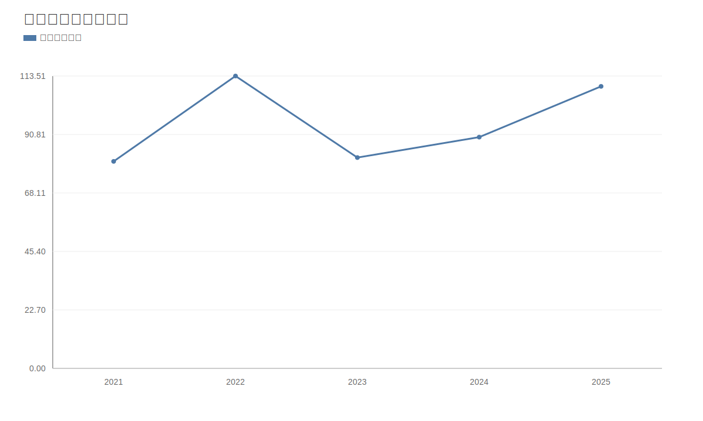

### 2. 净利润趋势图
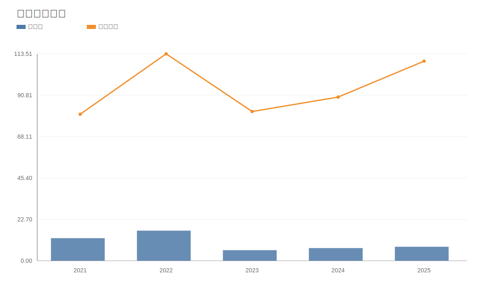

### 3. 毛利率和净利率对比图
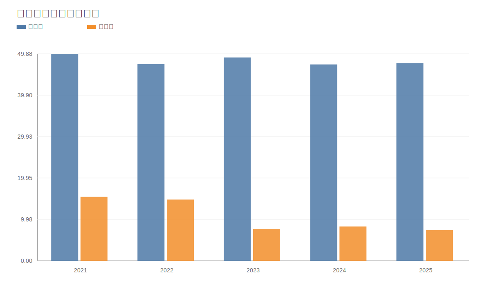

### 4. 分产品收入结构图
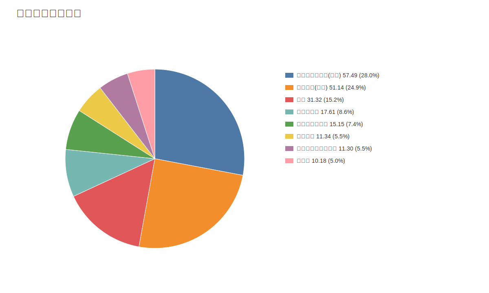

### 4. 分产品收入变化图
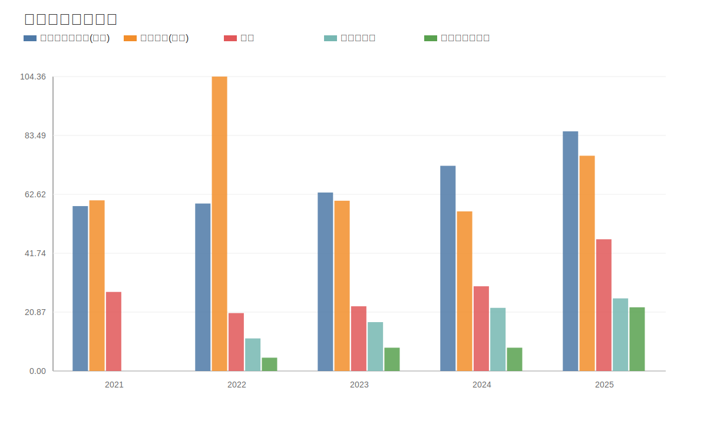

### 5. 分产品利润结构图
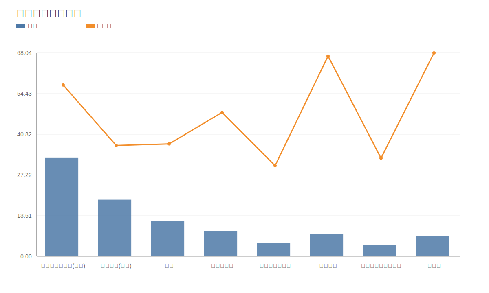

### 6. 分地区收入分布图
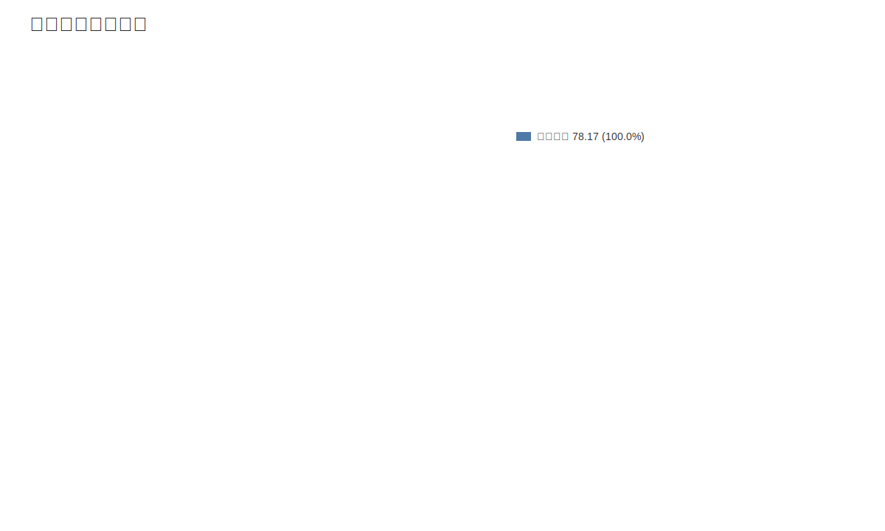

### 7. 资产负债表关键数据图
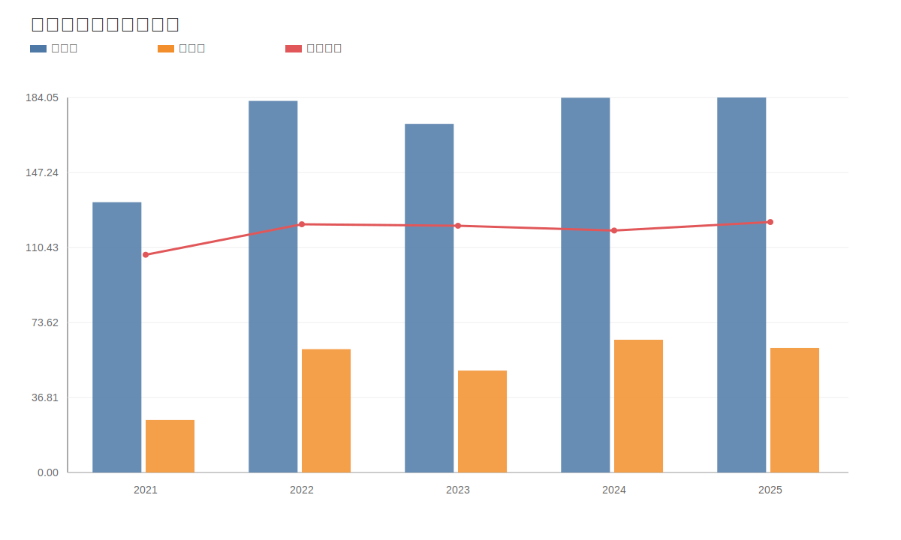

### 8. 自由现金流与经营现金流对比图
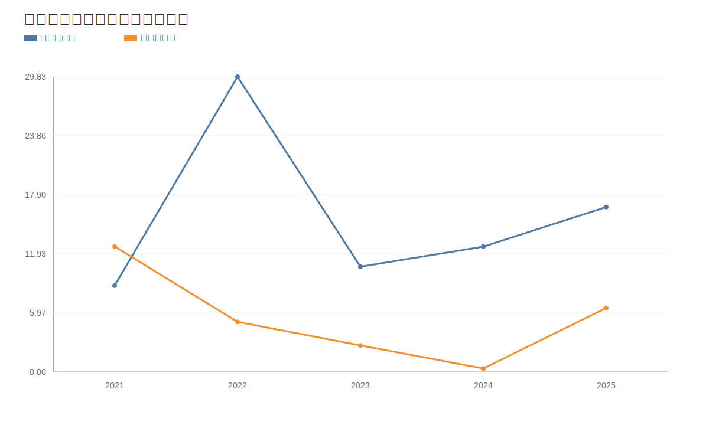

### 9. 股东回报分析图
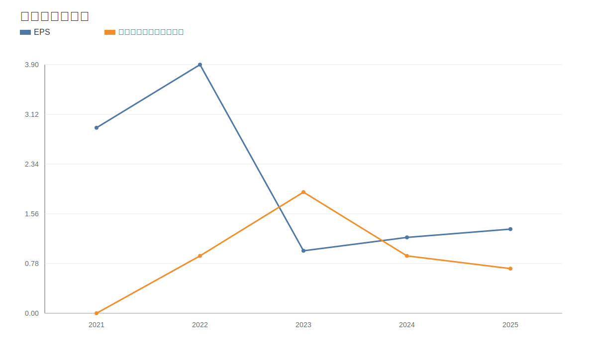

### 10. 财务比率分析图
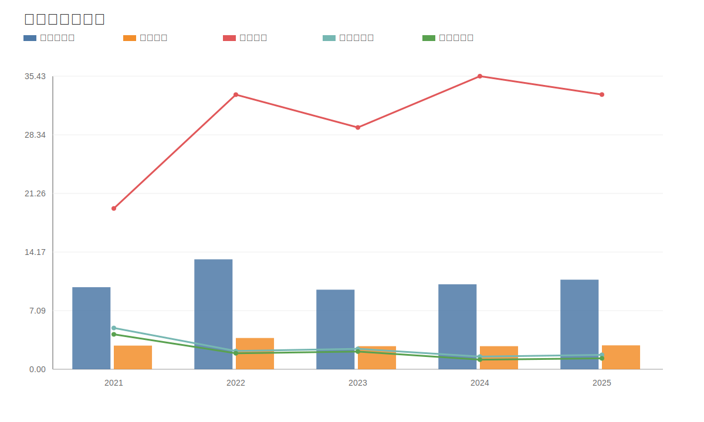

### 11. ROE与ROA对比图
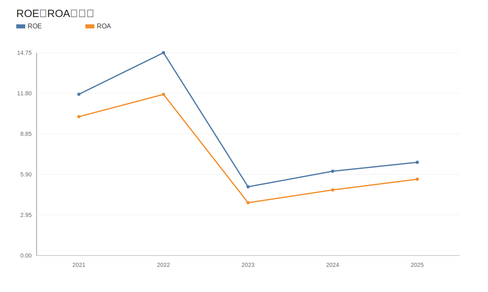
<!-- VALUE_CHARTS_END -->
