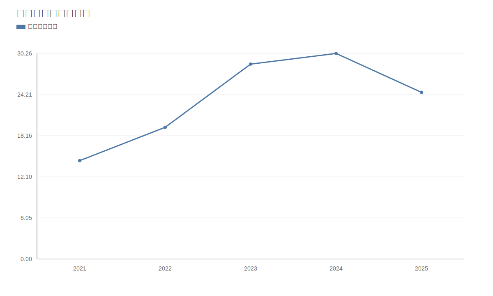
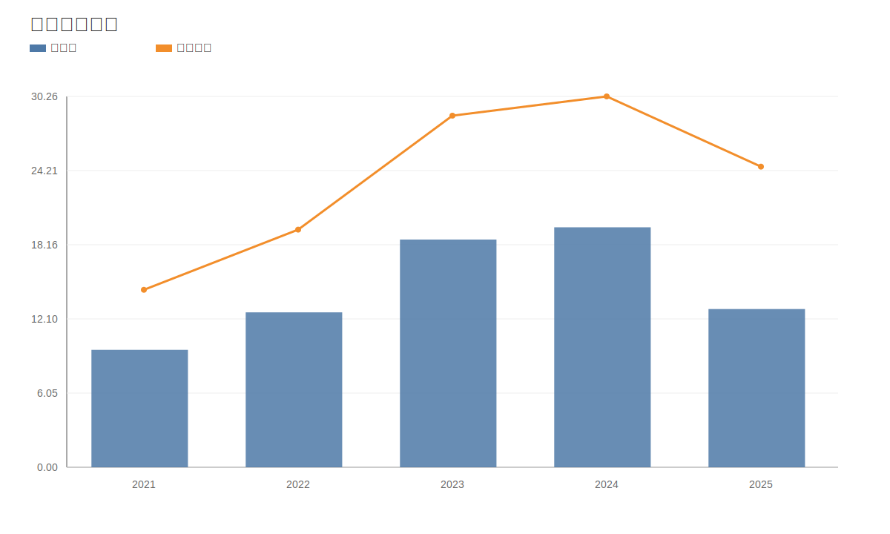
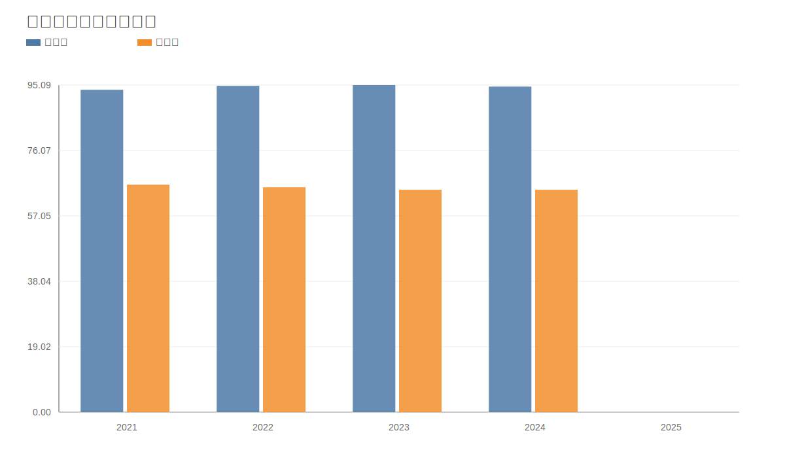
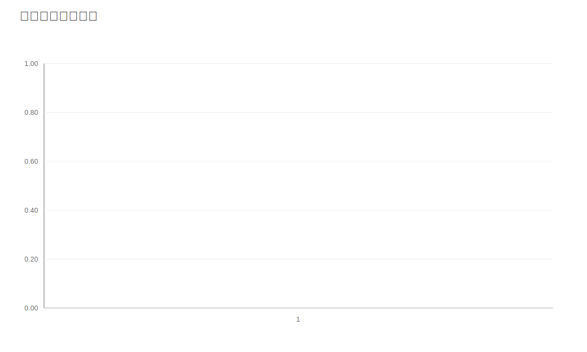
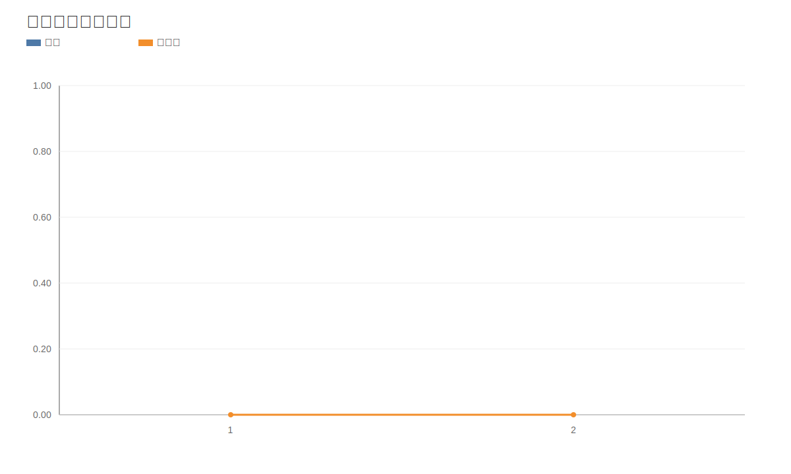
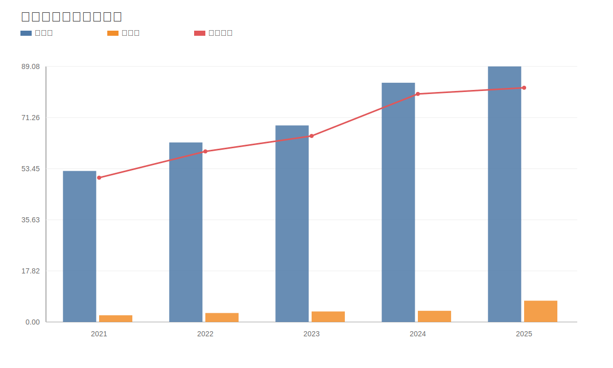
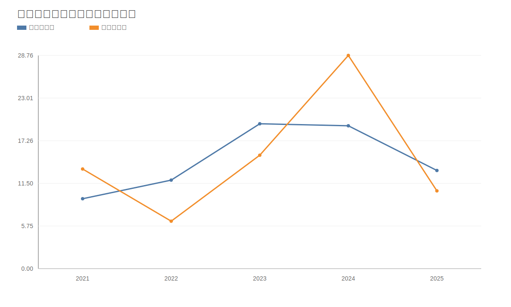
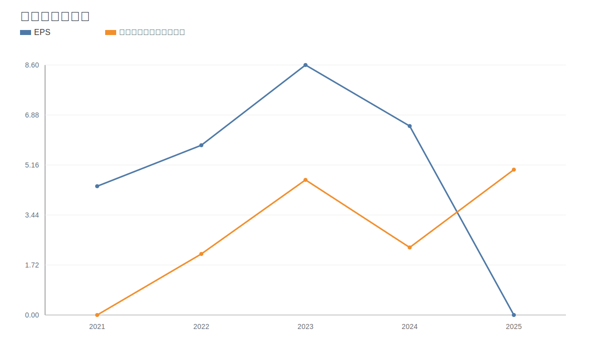
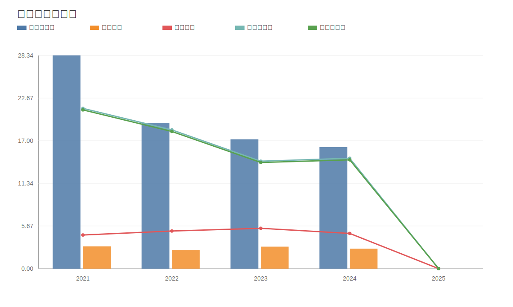
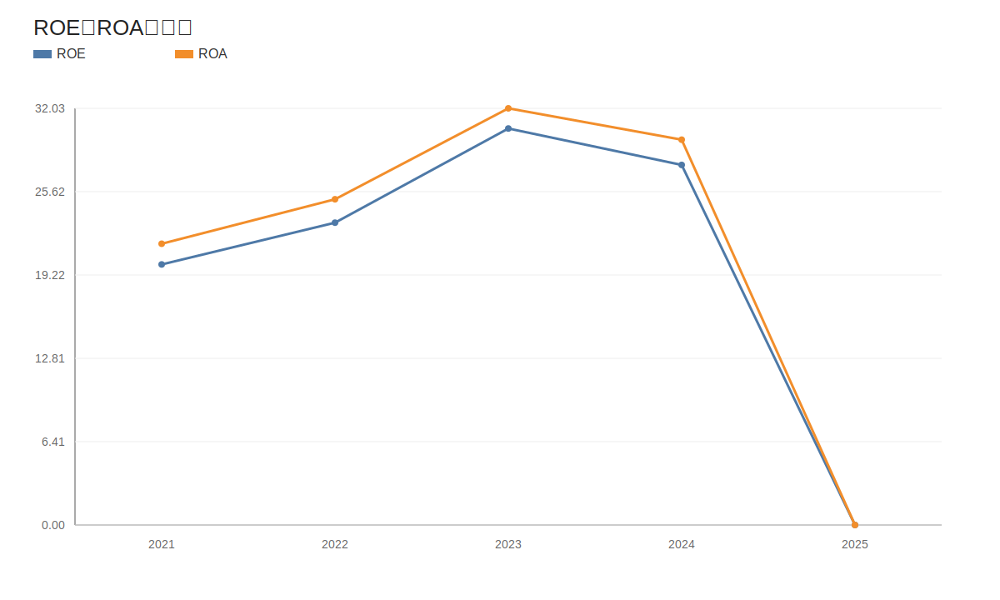

# 爱美客（300896）深度价值研究报告

- 报告日期：2026年4月20日
- 数据截止：
  - 财务：2025年12月31日（年报口径）
  - 估值：2026年4月20日（最新交易日）
- 本地库主口径：`income/balancesheet/cashflow/fina_indicator/daily_basic/dividend/fina_audit/stock_company`
- 外部增量验证：年报全文、半年报全文、一季报新闻披露

## 1. 公司概况（商业模式优先）
爱美客主营生物医用材料与医美注射产品，核心在注射类产品矩阵及医生端渠道渗透。收入主要来自高复购医疗美容场景，客户以医疗机构和终端消费者需求传导为主。

结论：公司是医美耗材赛道的高壁垒平台型企业。
事实：2025 年营收 24.53 亿元，归母净利 12.91 亿元。
推断：长期竞争优势仍在，但短期增长节奏进入调整期。

## 2. 行业与竞争格局
医美行业长期空间仍在，但短期受消费环境、监管节奏和竞争策略影响较大。公司在国内注射类医美产品中具备先发和品牌优势，但同业新品迭代与价格竞争正在增强。

结论：行业中长期向好，短中期竞争和波动加剧。
事实：可比样本中爱美客估值低于多数医美/医疗消费公司。
推断：市场对其长期价值认可，但对短期业绩恢复保持谨慎。

## 3. 护城河分析（含真伪辨别）
护城河来源：
1. 产品注册与临床验证壁垒。
2. 医生端和机构端渠道沉淀。
3. 高毛利产品组合与品牌认知。
4. 持续研发和新品管线。

真伪辨别：
- 提价 5% 是否流失：高端客群和核心场景流失可控，边际客群更敏感。
- 客户是否价格敏感：中等偏高。
- 是否存在“非它不可”场景：在部分注射场景具备较强替代门槛。
- 替代品出现难度：中等。
- 更换供应商成本：对机构和医生端中等偏高。

结论：护城河强度为“中偏强到强”。
事实：毛利率长期维持 90%+，盈利质量突出。
推断：护城河可持续，但需要新品持续迭代巩固。

## 4. 管理层与资本配置
管理层稳定，审计意见持续无保留。资本配置在研发投入、渠道扩展与分红之间保持平衡。分红连续且绝对额提升，体现回报意识。

结论：管理层属于“价值创造者（中高置信）”。
事实：2025 年中报分红每股税前 1.2 元，TTM 股息率约 4.33%。
推断：若业绩恢复，分红与研发并行策略仍可延续。

## 5. 财务分析（成长/盈利/健康/现金流）
### 5.1 成长性
2021-2025 年营收 CAGR 14.08%，净利 CAGR 7.75%。但 2025 年出现阶段性下滑（收入 -18.94%、净利 -34.05%）。

### 5.2 盈利能力
2025Q3 毛利率 93.36%、净利率 59.38%、ROE 14.40%、ROIC 13.66，盈利能力仍显著领先同业。

### 5.3 财务健康
2025 年总资产 89.08 亿元，总负债 7.43 亿元；资产负债率低，流动比率 10.03，速动比率 9.79。

### 5.4 现金流质量
2025 年经营现金流 13.24 亿元，自由现金流 10.49 亿元，经营现金流/净利润约 1.03 倍。

结论：财务极稳健，短期盈利波动未破坏资产负债表安全性。
事实：负债水平低、现金流覆盖利润能力仍在。
推断：公司具备较强穿越短期周期波动的能力。

## 6. 成长驱动
未来 3-5 年增长驱动：
1. 新品放量与产品矩阵完善。
2. 医生端渠道渗透和学术推广恢复。
3. 海外拓展与并购协同。
4. 消费医美需求修复。

结论：成长驱动存在，但兑现节奏不确定。
事实：短期业绩承压而研发和渠道投入持续。
推断：一旦需求端改善，利润弹性可能较大。

## 7. 风险分析（含幸存者偏差）
主要风险：监管政策变化、需求恢复慢于预期、竞品替代、渠道库存与营销效率下滑。

幸存者偏差检验：公司历史上高盈利和高增速阶段显著，当前回撤提醒不能线性外推过去高增长。

结论：抗风险能力中等偏强。
事实：公司财务结构稳健，现金流仍为正。
推断：估值波动风险高于生存风险。

## 8. 估值分析
当前估值（2026-04-20）：PE 26.93、PB 4.58、PS 14.18、股息率 4.33%。

历史分位（近一年）：PE/PB/PS 均约 12.77%。

同业比较（2026-04-20）：
- 爱尔眼科 PE 28.01
- 爱美客 PE 26.93
- 昊海生科 PE 35.98
- 贝泰妮 PE 43.36
- 威高骨科 PE 44.83

估值模型：
- 相对估值（PE 分位）约 115.91-128.64 元
- DCF 约 53.22-93.52 元
- 反向 DCF 隐含未来 5 年 FCFE 年化增速约 21.18%

结论：安全边际判断为“相对偏低估、绝对偏谨慎”。
事实：估值分位明显低于历史中枢。
推断：若增长恢复慢于预期，估值修复节奏会放缓。

## 9. 投资判断（多头/空头/跟踪指标）
### 多头逻辑
1. 高毛利和高壁垒产品体系。
2. 财务结构极稳健，现金流健康。
3. 估值处于历史偏低区间。
4. 分红与研发并行体现长期经营能力。

### 空头逻辑
1. 2025 年业绩显著下滑，恢复节奏不确定。
2. 医美消费需求和监管变量仍有扰动。
3. 行业竞争加剧可能压制利润率。
4. 估值仍需要中高速增长兑现支撑。

### 核心跟踪指标（季度）
1. 单季收入与净利同比。
2. 核心产品与新品收入贡献。
3. 经营现金流/净利润。
4. 库存周转与应收周转。
5. 毛利率与净利率趋势。

结论：适合“分批跟踪验证”而非一次性重仓。
事实：基本面质量高但短期增速受压。
推断：回报上限取决于增长恢复速度。

## 10. 最终结论
爱美客是一家高质量医美龙头，公司长期价值基础未被破坏。当前价格处于历史偏低分位，具备中长期跟踪价值，但短期仍需业绩恢复验证。

- 这是否是一家好公司：是
- 是否具备长期投资价值：是
- 当前价格是否值得买入：可分批
- 投资建议：观察（偏积极）

结论：建议“观察（偏积极）”。
事实：高质量财务与护城河仍在。
推断：业绩恢复确认后，估值修复空间更清晰。

## 11. 总评分（100分）
- 商业模式（20%）：17/20
- 护城河（20%）：17/20
- 管理层与资本配置（15%）：13/15
- 财务质量（20%）：18/20
- 风险控制（15%）：10/15
- 估值性价比（10%）：7/10

**最终总分：82/100**

结论：82 分对应“高质量但短期波动型标的”。
事实：核心优势仍在，短板在增长节奏不稳。
推断：评分上修依赖连续季度修复兑现。

## 12. 三个终极问题（必须回答）
1. 如果提价 5%，客户会不会流失？
在高端核心场景流失有限，在价格敏感边际客群会有一定流失。

2. 公司赚的钱有没有被管理层浪费？
当前证据不支持系统性浪费，研发投入与分红并行，资本配置整体合理。

3. 在行业最差年份，公司是怎么活下来的？
依靠高毛利产品、低负债资产负债表和稳定现金流穿越需求波动。

结论：三问结果偏正面，核心矛盾在增速而非生存。
事实：公司财务安全垫充足且经营连续性强。
推断：长期价值成立，但路径会有阶段性波动。

## 外部增量验证来源
- [爱美客 2024 年年度报告全文（2025-03-20）](https://static.cninfo.com.cn/finalpage/2025-03-20/1222846415.PDF)
- [爱美客 2025 年半年度报告全文（2025-08-19）](https://static.cninfo.com.cn/finalpage/2025-08-19/1224504170.pdf)
- [爱美客 2025 年一季报业绩快讯（东方财富）](https://finance.eastmoney.com/a/202504253388509391.html)

<!-- VALUE_CHARTS_START -->
## 图表图片（自动生成）

### 1. 主营业务收入趋势图

### 2. 净利润趋势图

### 3. 毛利率和净利率对比图

### 4. 分产品收入结构图

### 4. 分产品收入变化图

### 5. 分产品利润结构图

### 6. 分地区收入分布图

### 7. 资产负债表关键数据图

### 8. 自由现金流与经营现金流对比图

### 9. 股东回报分析图

### 10. 财务比率分析图

### 11. ROE与ROA对比图

<!-- VALUE_CHARTS_END -->
