# 上海机场（600009.SH）深度价值研究报告

- 报告日期：2026-05-14
- 标的代码：600009（上海机场）
- 数据主口径：本地数据库（`income`、`balancesheet`、`cashflow`、`fina_indicator`、`daily_basic`、`dividend`、`fina_audit`、`stock_company`）
- 外部增量核验口径：上交所公告、民航局公开统计（见文末来源）
- 价格时点：截至 2026-05-13 收盘
- 财报时点：截至 2026-03-31（2026年一季报）

## 1. 公司概况
上海机场的盈利模式是“航空性业务+非航空性业务”双轮驱动。航空性业务来自架次、旅客及货邮相关保障服务；非航空性业务来自商业餐饮、租赁、广告、物流与延伸服务。机场本质上是高固定成本、强枢纽属性的基础设施经营体，利润弹性通常来自吞吐量恢复、单位非航收入提升和成本摊薄。

按本地库 `fina_mainbz` 的最新年报口径（2025-12-31），公司行业维度收入主要为“航空及相关服务收入”125.54亿元，“其他”7.92亿元。客户类型以航司与旅客生态为主（ToB+ToC 混合），并含一定政府监管框架约束。收入持续性中，航司保障和商业租赁具连续性，疫情/宏观扰动会带来阶段波动。

区域维度拆分在本次可得数据中不完整（分地区图表为空），但公司核心资产位于上海国际航空枢纽，天然绑定长三角与国际中转流量。

结论：上海机场是典型“枢纽基础设施+流量变现”模型，商业模式清晰且可验证。
事实：2025年收入 133.46亿元、归母净利 21.17亿元；业务结构以航空及相关服务为主，非航为增厚利润的重要抓手。
推断：若国际与中转流量延续修复，非航单位产出仍有提升空间，但增速大概率由高恢复期回归中速。

## 2. 行业与竞争格局
机场行业属于强监管、重资产、区域垄断属性较强的基础设施行业，长期天花板由区域经济活力、国际航线供给、航空出行渗透率共同决定。中国机场行业已从“总量高增长”逐步转向“枢纽分化+效率提升”阶段。

根据民航局 2026-02-27 发布的《2025年全国民用运输机场生产统计公报》，2025年全国完成旅客吞吐量 152904.6 万人次，同比增长 4.8%；其中年旅客吞吐量超 6000 万人次机场共 4 个，上海浦东机场在列，且首次突破 8000 万人次。

竞争格局上，A股机场主要可比包括白云机场、深圳机场、厦门空港、海南机场。上海机场核心优势在于国际航线和高能级城市枢纽地位；短板在于估值通常高于多数可比，且对宏观与国际流量更敏感。

结论：行业已进入“增速放缓但头部枢纽集中受益”的阶段，上海机场仍处产业链强势位置。
事实：2025年民航全行业旅客吞吐量同比增长 4.8%，浦东机场位于全国第一梯队且突破 8000 万人次。
推断：未来 3-5 年行业更可能是结构性增长而非普涨，上海机场有望跑赢行业均值但难回疫情后早期的高弹性斜率。

## 3. 护城河分析（含真伪辨别）
护城河来源主要是区位稀缺性、航线网络与时刻资源、商业生态聚集效应和长期运营能力。机场不是“技术专利垄断”，而是“枢纽位势+运营体系”复合护城河。

真伪辨别：
- 提价 5% 是否流失客户：航空性收费受监管与竞争约束，直接提价空间有限；非航端具备一定提价能力但受旅客消费景气影响。
- 客户价格敏感度：航司对成本敏感，但优质枢纽替代性低；旅客对机场整体价格敏感中等，对便利性更敏感。
- 是否存在“非它不可”场景：上海国际枢纽地位决定大量国际/中转需求具刚性。
- 替代品难度：短期难以复制同等级国际门户机场。
- 更换供应商成本：对航司与国际航线网络而言迁移成本高。

结论：护城河强度为“中偏强”，属于真护城河但不是无限定价权护城河。
事实：枢纽资源与国际网络不可快速复制，且浦东机场在全国客货枢纽中持续前列。
推断：护城河会长期存在，但盈利上限更多受政策、航线结构和消费周期约束，而非单纯垄断带来的高提价。

## 4. 管理层与资本配置
管理层稳定性较好，审计意见连续多年为标准无保留。分红政策具持续性：本地库显示 2024 年已实施每股 0.22 元、2025 年已实施每股 0.51 元（税前口径），同时 2026-04-30 公告披露了 2025 年末利润分配方案。

资本结构非常稳健。截至 2026-03-31，公司货币资金 175.12 亿元，有息负债仅约 0.07 亿元，净现金约 175.05 亿元，财务安全垫较厚。并购和资本开支方面，历史上存在重大资产整合事项，但当前阶段更强调经营质量、分红回报与效率提升。

结论：管理层与资本配置偏“稳健型价值创造者”。
事实：连续无保留审计、持续现金分红、净现金头寸显著为正。
推断：未来大概率继续以“稳分红+稳经营+谨慎扩张”为主，激进高杠杆扩张概率较低。

## 5. 财务分析（成长/盈利/健康/现金流）
### 5.1 成长性
2021-2025 年收入从 37.28 亿元恢复至 133.46 亿元，归母净利从亏损修复到 21.17 亿元。2025 年营收同比 +7.90%，归母净利同比 +9.45%；2026Q1 营收同比 +0.81%，归母净利同比 +11.33%，呈现“收入平稳、利润韧性略强”的特征。

### 5.2 盈利能力
2025 年毛利率 27.51%、净利率 18.06%、ROE 5.03%、ROIC 4.19%。与 2022 年亏损期相比已显著修复，但相较部分轻资产消费龙头仍属中等回报水平。

### 5.3 财务健康
截至 2026-03-31，资产负债率 36.51%，流动比率 2.73，货币资金远高于有息负债，偿债与流动性安全边际高。

### 5.4 现金流质量
2023-2025 年经营现金流分别为 40.20/55.31/59.82 亿元，明显高于同期净利润，利润现金化质量较好。2026Q1 经营现金流 6.60 亿元，同比 -6.27%，短期受经营节奏波动，但未破坏中期质量判断。

结论：财务画像是“修复完成后进入稳态”，质量良好、弹性下降。
事实：2025 年净利同比 +9.45%，ROE 5.03%，资产负债率 36.51%，净现金 175.05 亿元。
推断：后续利润增长更依赖单位产出和结构优化，而非纯吞吐量反弹。

## 6. 成长驱动
未来 3-5 年增长来源主要有三类：
- 国际与中转客流恢复后的商业变现提升（免税、餐饮、广告、租赁效率）。
- 航空主业在高基数上的效率优化（时刻利用率、流程数字化、运营成本优化）。
- 枢纽协同与货运价值链延伸（尤其在高货值航空货运景气阶段）。

增长可持续性方面，机场作为成熟行业基础设施，长期增长斜率通常低于新兴成长行业，但现金流可预测性更强。

结论：上海机场的增长逻辑是“中速增长+高确定性”，不是高弹性成长股逻辑。
事实：2025 年后公司已从业绩修复切换到稳态经营，Q1 利润仍保持同比正增长。
推断：若宏观与国际航线景气平稳，未来 3-5 年公司更可能实现温和复利而非高增爆发。

## 7. 风险分析（含幸存者偏差）
主要风险：
- 政策与监管风险：航空性收费和重大商业安排受政策影响较大。
- 竞争风险：枢纽间国际航线、航司资源和高价值客群竞争持续。
- 技术替代风险：短中期弱，但远程办公与线上会议会抑制部分商务出行需求。
- 财务与流动性风险：当前偏低，但大规模资本开支周期可能抬升波动。
- 客户集中风险：航司客户结构集中，单一大型航司策略变化会影响边际收益。

幸存者偏差检验（行业最差年份回顾）：2022 年公司归母净利 -29.95 亿元、经营现金流 -1.17 亿元，处于极端压力测试环境；但其后通过枢纽流量修复和非航恢复，在 2023-2025 年快速回到盈利与高现金流状态，体现了“重资产枢纽在极端周期中的生存能力”。

结论：抗风险能力评估为“中偏强”。
事实：2022 年深度亏损，2023-2025 年持续修复并恢复高现金流，且当前净现金充足。
推断：下行周期中公司会经历盈利波动，但发生流动性危机的概率较低。

## 8. 估值分析
截至 2026-05-13：PE(TTM) 30.69 倍，PB 1.55 倍，PS(TTM) 4.99 倍，股息率(TTM) 约 1.90%，总市值约 667.61 亿元。

历史分位（样本区间：2021-01-01 至 2026-05-13，本地库日频）：
- PE 分位约 44.4%（区间中位附近）。
- PB 分位约 1.9%（低分位）。
- PS 分位约 1.9%（低分位）。

同业横向（截至 2026-05-13）：
- 白云机场：PE 16.38，PB 1.04，PS 2.71。
- 深圳机场：PE 22.71，PB 1.19，PS 2.70。
- 厦门空港：PE 12.98，PB 1.33，PS 3.19。
- 上海机场：PE 30.69，PB 1.55，PS 4.99。

解读：上海机场相对同业仍有明显“枢纽溢价”，但 PB/PS 自身历史位置偏低，说明估值“贵在横向、便宜在纵向”。

结论：安全边际判断为“合理偏谨慎”，非深度低估。
事实：公司 PE 高于主要同业，但 PB/PS 处于自身近五年低分位。
推断：若基本面继续稳健，估值有修复空间；若流量或消费不及预期，高估值溢价也可能被压缩。

## 9. 投资判断（多头/空头/跟踪指标）
多头逻辑：
- 上海国际枢纽稀缺性高，核心资产长期不可替代。
- 财务结构稳健，净现金充足，抗波动能力强。
- 非航业务仍有单客价值提升空间。
- 行业总量仍增长，且头部枢纽受益集中。

空头逻辑：
- 估值相对同业不便宜，业绩需持续兑现才能支撑溢价。
- 行业进入中低速阶段，难回高弹性增长。
- 国际航线、消费力、免税链条恢复节奏存在不确定性。
- 监管与政策变量对盈利弹性影响较大。

核心跟踪指标（季度）：
- 旅客吞吐量与国际航线恢复斜率。
- 非航收入增速与单客非航贡献。
- 毛利率、净利率、经营现金流/净利润。
- 分红执行率与资本开支节奏。

结论：当前更适合“中长期跟踪+回调配置”，而非追涨。
事实：公司基本面稳健但估值溢价仍在，驱动逻辑从修复转向效率。
推断：若未来 2-3 个季度持续兑现利润与现金流，估值中枢可上移；反之易进入震荡消化。

## 10. 最终结论
是否是好公司：是，属于中国高能级机场资产中的优质标的。
是否具备长期投资价值：具备，前提是接受“中速增长、稳健复利”的收益特征。
当前价格是否值得买入：截至 2026-05-13，处于“可跟踪、可分批、但非明显低估区”。

投资建议：观察（偏积极观察，等待更高安全边际或更强基本面催化）。

结论：上海机场是好资产，但当前更接近“好公司合理价”而非“好公司便宜价”。
事实：盈利、现金流、资产负债表均健康，行业地位稳固。
推断：投资胜率主要取决于买入价格纪律与后续国际客流/非航兑现节奏。

## 11. 总评分（100分）
评分框架：
- 商业模式（20%）：16/20
- 护城河（20%）：16/20
- 管理层与资本配置（15%）：12/15
- 财务质量（20%）：16/20
- 风险控制（10%）：7/10
- 估值性价比（15%）：9/15

最终总分：76/100

评分解释：
- 加分项：枢纽稀缺性、现金流质量、资产负债表安全。
- 扣分项：估值横向偏贵、行业增速放缓、政策与外部变量敏感。

结论：综合评级为“中上质量、估值中性偏贵”。
事实：公司经营质量已恢复并稳住，财务安全边际高。
推断：若估值回落或基本面继续超预期，评分可提升至 80 分以上。

## 12. 三个终极问题（必须回答）
问题1：如果提价 5%，客户会不会流失？
- 回答：会有分化。航空性业务提价受监管约束，直接提价空间有限；非航部分可通过结构性提价实现，但对价格敏感客群会有边际流失。整体看，5%全面提价并不现实，结构性提价更可行。

问题2：公司赚的钱有没有被管理层浪费？
- 回答：当前证据不支持“明显浪费”。分红持续、净现金充足、审计连续无保留，显示资本配置总体克制。仍需持续跟踪大额资本开支回报。

问题3：在行业最差年份，公司是怎么活下来的？
- 回答：依靠枢纽资产韧性和资产负债表安全垫。2022 年虽出现大额亏损，但随后在流量恢复周期中迅速修复盈利与现金流，体现了重资产枢纽在极端冲击下“先承压、后修复”的生存机制。

结论：三问合并后的答案是“护城河真实、管理层总体克制、但收益率受周期与价格约束”。
事实：2022 年亏损、2023-2025 年修复、2026Q1 延续盈利，且净现金充裕。
推断：长期可投性成立，但超额收益更依赖买点和周期位置，而非单边成长叙事。

## 外部增量核验来源
- 民航局《2025年全国民用运输机场生产统计公报》发布（2026-02-27）：https://www.caac.gov.cn/PHONE/XWZX/MHYW/202602/t20260227_230131.html
- 上交所公告：上海机场 2025 年年度报告（公告日期 2026-04-30）：http://static.sse.com.cn/disclosure/listedinfo/announcement/c/new/2026-04-30/600009_20260430_BK10.pdf
- 上交所公告：上海机场 2026 年第一季度报告（公告日期 2026-04-30）：http://static.sse.com.cn/disclosure/listedinfo/announcement/c/new/2026-04-30/600009_20260430_ZPQP.pdf
- 上交所公告：上海机场 2026 年 3 月运输生产情况简报（公告日期 2026-04-15）：http://static.sse.com.cn/disclosure/listedinfo/announcement/c/new/2026-04-15/600009_20260415_OYKF.pdf
- 上交所公告：上海机场 2025 年末利润分配方案公告（公告日期 2026-04-30）：http://static.sse.com.cn/disclosure/listedinfo/announcement/c/new/2026-04-30/600009_20260430_NEN6.pdf

> 免责声明：本报告仅用于研究与学习，不构成任何投资建议。

<!-- VALUE_CHARTS_START -->
## 图表图片（自动生成）

### 1. 主营业务收入趋势图
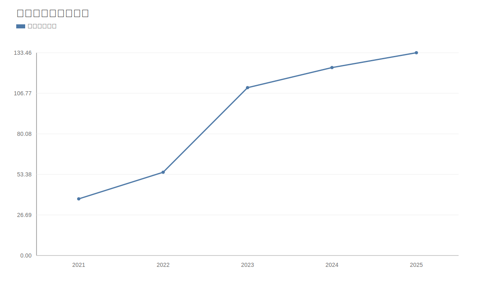

### 2. 净利润趋势图
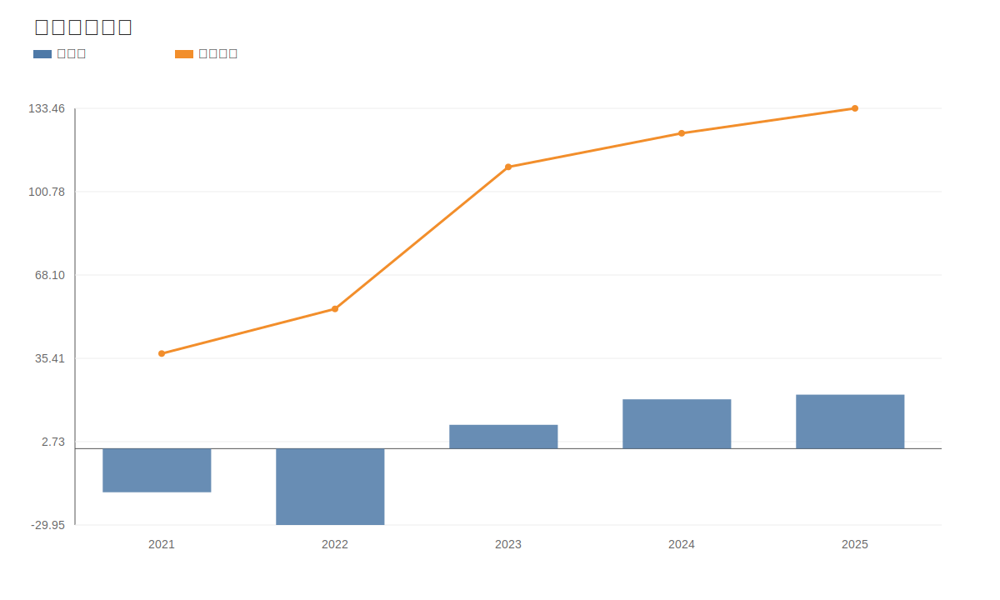

### 3. 毛利率和净利率对比图
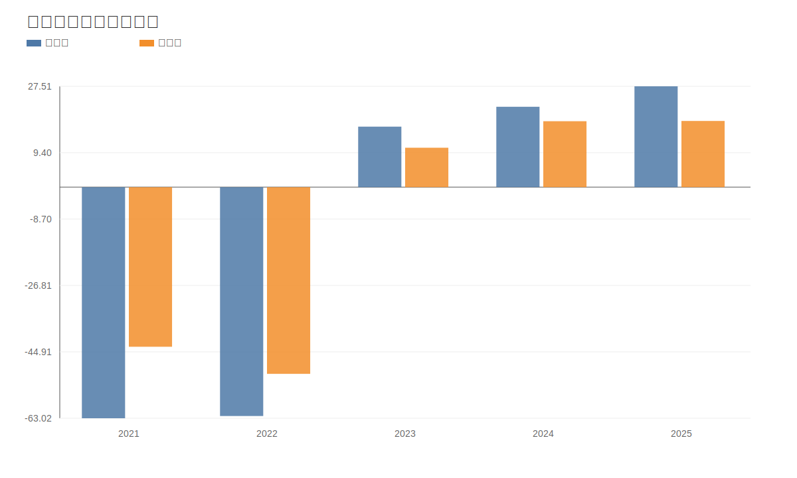

### 4. 分产品收入结构图
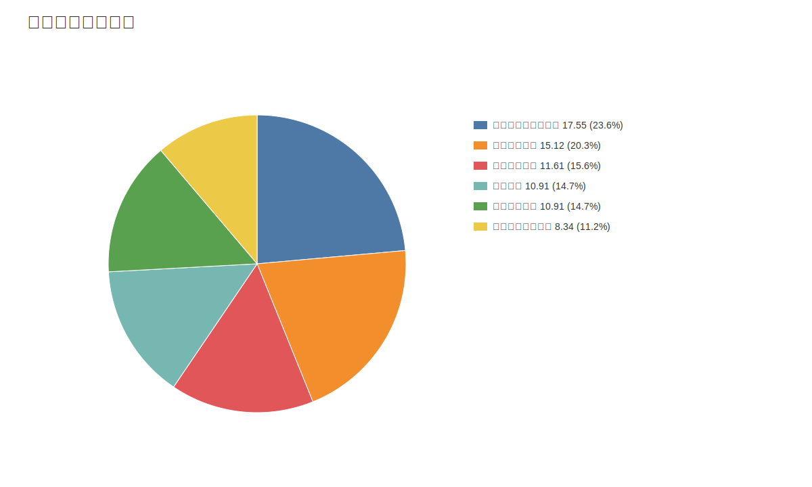

### 4. 分产品收入变化图
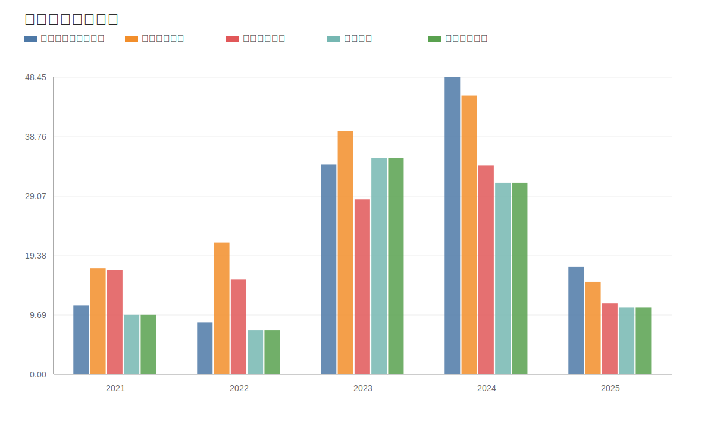

### 5. 分产品利润结构图
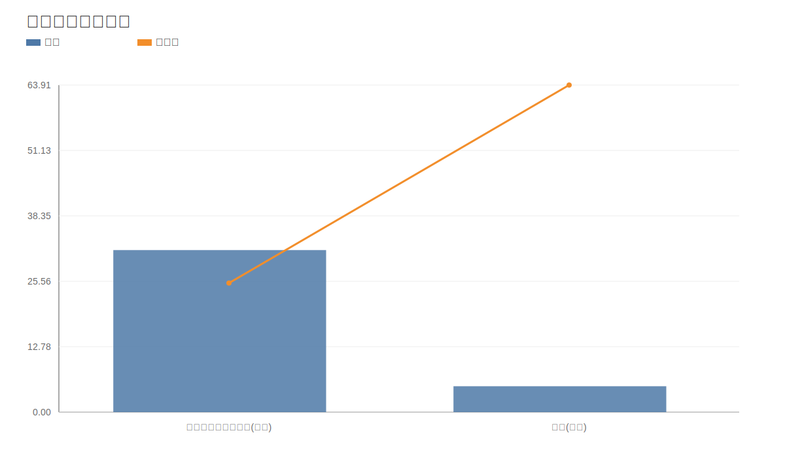

### 6. 分地区收入分布图

### 7. 资产负债表关键数据图
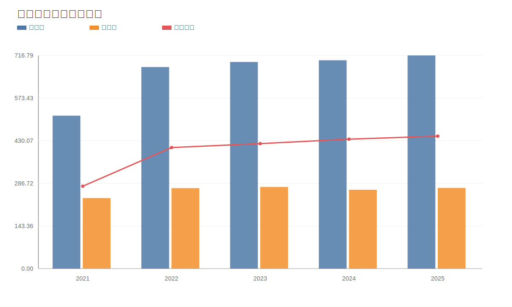

### 8. 自由现金流与经营现金流对比图
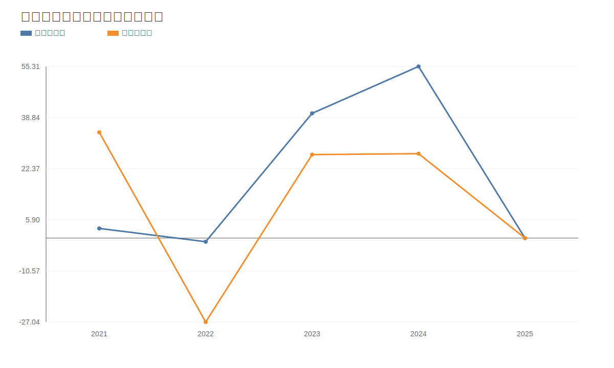

### 9. 股东回报分析图
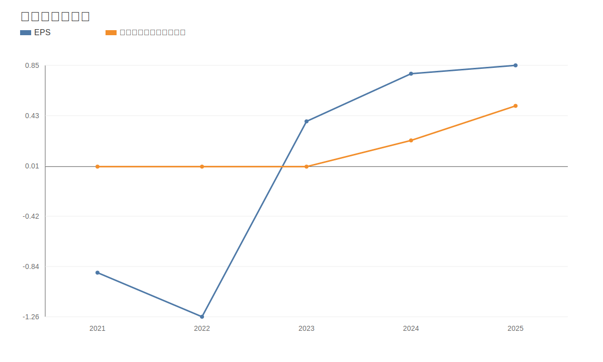

### 10. 财务比率分析图
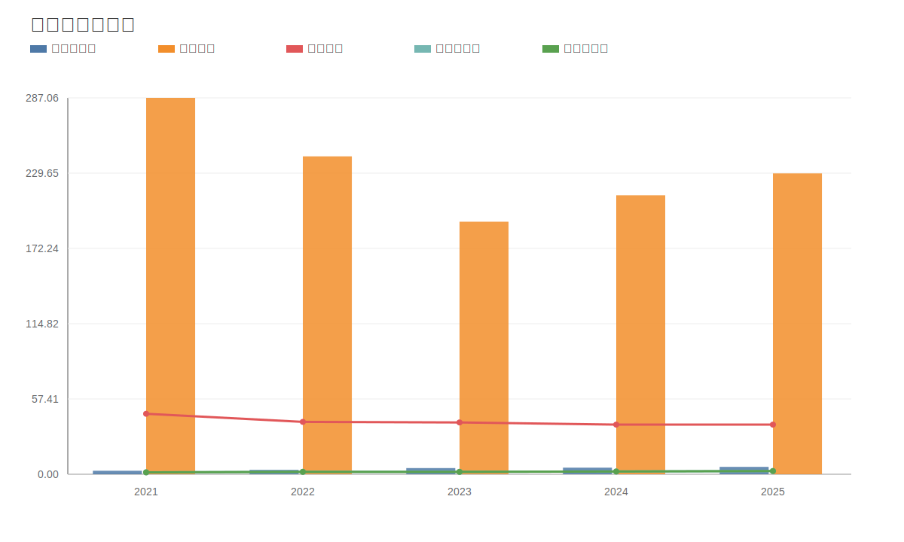

### 11. ROE与ROA对比图
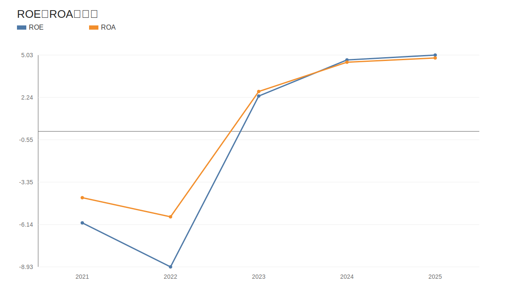
<!-- VALUE_CHARTS_END -->
