# 南方航空（600029.SH）价值分析报告草稿

- 生成时间：2026-05-13 08:10:36
- 自动化脚本：`.agents/skills/value-report/value_report_scaffold.py`
- 数据口径：数据库字段定义以 `app/models/models.py` 为准
- 公司信息：行业 空运｜地区 广东｜上市日期 20030725
- 管理层：董事长 马须伦｜总经理 韩文胜｜员工 108176
- 主营业务：主要业务:(1)提供国内,地区和国际定期及不定期航空客,货,邮,行李运输服务;(2)提供通用航空服务;(3)提供航空器维修服务;(4)经营国内外航空公司的代理业务;(5)提供航空配餐服务(仅限分支机构经营);(6)进行其他航空业务及相关业务,包括为该等业务进行广告宣传;(7)进行其他航空业务及相关业务(限保险兼业代理业务:人身意外伤害险);航空地面延伸业务;民用航空器机型培训(限分支机构凭许可证经营);资产租赁;工程管理与技术咨询;航材销售;旅游代理服务;商品零售批发.
- 提示：本文件已自动填充定量部分，定性模块请结合最新公告与行业资料补充。

## 自动填充数据（可直接引用）
### 最新估值
- 交易日：20260511
- 收盘价：5.65 元
- PE(TTM)：33.19 倍
- PB：2.76 倍
- PS(TTM)：0.55 倍
- 股息率(TTM)：N/A
- 总市值：1023.83 亿元

### 最新财务快照
- 报告期：20260331
- 营收：477.82亿（同比 10.08%）
- 归母净利润：14.81亿（同比 298.26%）
- 经营现金流：48.52亿（同比 9.48%）
- 自由现金流：196.05亿
- 毛利率：10.82%，净利率：4.50%
- ROE：4.08%，ROIC：1.11%
- 资产负债率：83.97%，流动比率：0.28
- 经营现金流/利润：193.31%
- 货币资金：170.17亿，有息负债：820.34亿，净现金：-650.17亿

### 近五年年报趋势
| 年度 | 营收 | 营收同比 | 归母净利 | 净利同比 | 毛利率 | 净利率 | ROE | ROIC | 资产负债率 | 经营现金流 | 自由现金流 | 现净比 |
| --- | --- | --- | --- | --- | --- | --- | --- | --- | --- | --- | --- | --- |
| 2025 | 1822.56亿 | 4.61% | 8.57亿 | 150.53% | 10.14% | 1.47% | 2.44% | 1.94% | 84.27% | 382.09亿 | 179.87亿 | 4458.46% |
| 2024 | 1742.24亿 | 8.94% | -16.96亿 | 59.71% | 8.41% | 0.09% | -4.74% | 0.26% | 84.05% | 314.45亿 | 170.24亿 | -1854.07% |
| 2023 | 1599.29亿 | 83.70% | -42.09亿 | 87.12% | 7.72% | -1.93% | -10.81% | 2.73% | 83.18% | 401.34亿 | 134.30亿 | -953.53% |
| 2022 | 870.59亿 | -14.35% | -326.82亿 | -170.03% | -21.60% | -38.71% | -60.15% | -9.91% | 82.34% | 34.65亿 | -156.29亿 | -10.60% |
| 2021 | 1016.44亿 | N/A | -121.03亿 | N/A | -2.54% | -10.83% | -17.67% | -2.91% | 73.91% | 133.71亿 | 99.83亿 | -110.48% |

- 近五年营收CAGR：15.72%
- 近五年净利CAGR：N/A

### 分红与审计
#### 已实施分红
有分红预案，但暂无已实施除权记录

#### 审计意见
- 20241231：标准无保留意见（毕马威华振会计师事务所）
- 20231231：标准无保留意见（毕马威华振会计师事务所）
- 20221231：标准无保留意见（毕马威华振会计师事务所）
- 20211231：标准无保留意见（毕马威华振会计师事务所）
- 20201231：标准无保留意见（毕马威华振会计师事务所）

## ECharts 图表数据（option）

- 说明：以下 `option` 可直接用于前端图表渲染；单位已在坐标轴标注。

### 1. 主营业务收入趋势图
```json
{
  "title": {
    "text": "主营业务收入趋势（近5年）"
  },
  "tooltip": {
    "trigger": "axis"
  },
  "legend": {
    "top": 24,
    "data": [
      "主营业务收入"
    ]
  },
  "xAxis": {
    "type": "category",
    "data": [
      "2021",
      "2022",
      "2023",
      "2024",
      "2025"
    ]
  },
  "yAxis": {
    "type": "value",
    "name": "亿元"
  },
  "series": [
    {
      "name": "主营业务收入",
      "type": "line",
      "smooth": true,
      "data": [
        1016.44,
        870.59,
        1599.29,
        1742.24,
        1822.56
      ]
    }
  ]
}
```

### 2. 净利润趋势图
```json
{
  "title": {
    "text": "净利润趋势（近5年）"
  },
  "tooltip": {
    "trigger": "axis"
  },
  "legend": {
    "top": 24,
    "data": [
      "净利润",
      "营业收入"
    ]
  },
  "xAxis": {
    "type": "category",
    "data": [
      "2021",
      "2022",
      "2023",
      "2024",
      "2025"
    ]
  },
  "yAxis": [
    {
      "type": "value",
      "name": "亿元"
    },
    {
      "type": "value",
      "name": "亿元"
    }
  ],
  "series": [
    {
      "name": "净利润",
      "type": "bar",
      "data": [
        -121.03,
        -326.82,
        -42.09,
        -16.96,
        8.57
      ]
    },
    {
      "name": "营业收入",
      "type": "line",
      "yAxisIndex": 1,
      "data": [
        1016.44,
        870.59,
        1599.29,
        1742.24,
        1822.56
      ]
    }
  ]
}
```

### 3. 毛利率和净利率对比图
```json
{
  "title": {
    "text": "毛利率 vs 净利率"
  },
  "tooltip": {
    "trigger": "axis"
  },
  "legend": {
    "top": 24,
    "data": [
      "毛利率",
      "净利率"
    ]
  },
  "xAxis": {
    "type": "category",
    "data": [
      "2021",
      "2022",
      "2023",
      "2024",
      "2025"
    ]
  },
  "yAxis": {
    "type": "value",
    "name": "%"
  },
  "series": [
    {
      "name": "毛利率",
      "type": "bar",
      "data": [
        -2.54,
        -21.6,
        7.72,
        8.41,
        10.14
      ]
    },
    {
      "name": "净利率",
      "type": "bar",
      "data": [
        -10.83,
        -38.71,
        -1.93,
        0.09,
        1.47
      ]
    }
  ]
}
```

### 4. 分产品收入结构图
```json
{
  "title": {
    "text": "分产品收入结构（20251231）"
  },
  "tooltip": {
    "trigger": "item"
  },
  "legend": {
    "type": "scroll",
    "top": 24
  },
  "series": [
    {
      "type": "pie",
      "radius": "55%",
      "data": [
        {
          "name": "客运及客运相关服务",
          "value": 1566.88
        },
        {
          "name": "国外",
          "value": 576.03
        },
        {
          "name": "货运及邮运",
          "value": 196.7
        },
        {
          "name": "其他主营业务",
          "value": 45.12
        },
        {
          "name": "酒店及旅游业务",
          "value": 7.78
        },
        {
          "name": "航空配餐业务",
          "value": 6.08
        }
      ]
    }
  ]
}
```

### 4. 分产品收入变化图
```json
{
  "title": {
    "text": "分产品收入变化（近5年）"
  },
  "tooltip": {
    "trigger": "axis"
  },
  "legend": {
    "type": "scroll",
    "top": 24,
    "data": [
      "客运及客运相关服务",
      "国外",
      "货运及邮运",
      "其他主营业务",
      "酒店及旅游业务"
    ]
  },
  "xAxis": {
    "type": "category",
    "data": [
      "2021",
      "2022",
      "2023",
      "2024",
      "2025"
    ]
  },
  "yAxis": {
    "type": "value",
    "name": "亿元"
  },
  "series": [
    {
      "name": "客运及客运相关服务",
      "type": "bar",
      "stack": "total",
      "data": [
        1150.83,
        867.49,
        2002.92,
        2214.75,
        2297.6
      ]
    },
    {
      "name": "国外",
      "type": "bar",
      "stack": "total",
      "data": [
        355.86,
        437.01,
        492.33,
        730.75,
        834.28
      ]
    },
    {
      "name": "货运及邮运",
      "type": "bar",
      "stack": "total",
      "data": [
        287.53,
        320.27,
        224.55,
        274.25,
        287.5
      ]
    },
    {
      "name": "其他主营业务",
      "type": "bar",
      "stack": "total",
      "data": [
        48.13,
        36.73,
        14.23,
        16.2,
        60.1
      ]
    },
    {
      "name": "酒店及旅游业务",
      "type": "bar",
      "stack": "total",
      "data": [
        0.0,
        0.0,
        0.0,
        0.0,
        7.78
      ]
    }
  ]
}
```

### 5. 分产品利润结构图
```json
{
  "title": {
    "text": "分产品利润结构（20251231）"
  },
  "tooltip": {
    "trigger": "axis"
  },
  "legend": {
    "top": 24,
    "data": [
      "利润",
      "毛利率"
    ]
  },
  "xAxis": {
    "type": "category",
    "data": [
      "客运及客运相关服务",
      "国外",
      "货运及邮运",
      "其他主营业务",
      "酒店及旅游业务",
      "航空配餐业务"
    ]
  },
  "yAxis": [
    {
      "type": "value",
      "name": "亿元"
    },
    {
      "type": "value",
      "name": "%"
    }
  ],
  "series": [
    {
      "name": "利润",
      "type": "bar",
      "data": [
        97.81,
        0.0,
        59.21,
        24.93,
        2.12,
        0.69
      ]
    },
    {
      "name": "毛利率",
      "type": "line",
      "yAxisIndex": 1,
      "data": [
        6.24,
        0.0,
        30.1,
        55.25,
        27.25,
        11.35
      ]
    }
  ]
}
```

### 6. 分地区收入分布图
```json
{
  "title": {
    "text": "分地区收入分布（20251231）"
  },
  "tooltip": {
    "trigger": "item"
  },
  "legend": {
    "type": "scroll",
    "top": 24
  },
  "series": [
    {
      "type": "pie",
      "radius": "55%",
      "data": [
        {
          "name": "中国大陆",
          "value": 1164.93
        },
        {
          "name": "其他业务(地区)",
          "value": 58.98
        },
        {
          "name": "中国港澳台地区",
          "value": 22.62
        }
      ]
    }
  ]
}
```

### 7. 资产负债表关键数据图
```json
{
  "title": {
    "text": "资产负债表关键数据（近5年）"
  },
  "tooltip": {
    "trigger": "axis"
  },
  "legend": {
    "top": 24,
    "data": [
      "总资产",
      "总负债",
      "股东权益"
    ]
  },
  "xAxis": {
    "type": "category",
    "data": [
      "2021",
      "2022",
      "2023",
      "2024",
      "2025"
    ]
  },
  "yAxis": {
    "type": "value",
    "name": "亿元"
  },
  "series": [
    {
      "name": "总资产",
      "type": "bar",
      "stack": "capital",
      "data": [
        3229.48,
        3120.01,
        3092.26,
        3297.38,
        3498.14
      ]
    },
    {
      "name": "总负债",
      "type": "bar",
      "stack": "capital",
      "data": [
        2387.03,
        2568.87,
        2572.29,
        2771.43,
        2948.03
      ]
    },
    {
      "name": "股东权益",
      "type": "line",
      "data": [
        842.45,
        551.14,
        519.97,
        525.95,
        550.11
      ]
    }
  ]
}
```

### 8. 自由现金流与经营现金流对比图
```json
{
  "title": {
    "text": "自由现金流 vs 经营现金流"
  },
  "tooltip": {
    "trigger": "axis"
  },
  "legend": {
    "top": 24,
    "data": [
      "经营现金流",
      "自由现金流"
    ]
  },
  "xAxis": {
    "type": "category",
    "data": [
      "2021",
      "2022",
      "2023",
      "2024",
      "2025"
    ]
  },
  "yAxis": {
    "type": "value",
    "name": "亿元"
  },
  "series": [
    {
      "name": "经营现金流",
      "type": "line",
      "data": [
        133.71,
        34.65,
        401.34,
        314.45,
        382.09
      ]
    },
    {
      "name": "自由现金流",
      "type": "line",
      "data": [
        99.83,
        -156.29,
        134.3,
        170.24,
        179.87
      ]
    }
  ]
}
```

### 9. 股东回报分析图
```json
{
  "title": {
    "text": "股东回报（EPS/分红）"
  },
  "tooltip": {
    "trigger": "axis"
  },
  "legend": {
    "top": 24,
    "data": [
      "EPS",
      "每股现金分红（已实施）"
    ]
  },
  "xAxis": {
    "type": "category",
    "data": [
      "2021",
      "2022",
      "2023",
      "2024",
      "2025"
    ]
  },
  "yAxis": {
    "type": "value",
    "name": "元"
  },
  "series": [
    {
      "name": "EPS",
      "type": "line",
      "data": [
        -0.75,
        -1.9,
        -0.23,
        -0.09,
        0.05
      ]
    },
    {
      "name": "每股现金分红（已实施）",
      "type": "line",
      "data": [
        0.0,
        0.0,
        0.0,
        0.0,
        0.0
      ]
    }
  ]
}
```

### 10. 财务比率分析图
```json
{
  "title": {
    "text": "关键财务比率（近5年）"
  },
  "tooltip": {
    "trigger": "axis"
  },
  "legend": {
    "type": "scroll",
    "top": 24,
    "data": [
      "资产负债率",
      "流动比率",
      "速动比率",
      "应收周转率",
      "存货周转率"
    ]
  },
  "xAxis": {
    "type": "category",
    "data": [
      "2021",
      "2022",
      "2023",
      "2024",
      "2025"
    ]
  },
  "yAxis": [
    {
      "type": "value",
      "name": "比率/%"
    },
    {
      "type": "value",
      "name": "周转率"
    }
  ],
  "series": [
    {
      "name": "资产负债率",
      "type": "line",
      "data": [
        73.91,
        82.34,
        83.18,
        84.05,
        84.27
      ]
    },
    {
      "name": "流动比率",
      "type": "line",
      "data": [
        0.34,
        0.23,
        0.21,
        0.27,
        0.28
      ]
    },
    {
      "name": "速动比率",
      "type": "line",
      "data": [
        0.33,
        0.22,
        0.2,
        0.26,
        0.26
      ]
    },
    {
      "name": "应收周转率",
      "type": "bar",
      "yAxisIndex": 1,
      "data": [
        37.38,
        31.37,
        53.51,
        51.36,
        49.15
      ]
    },
    {
      "name": "存货周转率",
      "type": "bar",
      "yAxisIndex": 1,
      "data": [
        61.1,
        69.67,
        99.99,
        89.47,
        61.8
      ]
    }
  ]
}
```

### 11. ROE与ROA对比图
```json
{
  "title": {
    "text": "ROE vs ROA（近5年）"
  },
  "tooltip": {
    "trigger": "axis"
  },
  "legend": {
    "top": 24,
    "data": [
      "ROE",
      "ROA"
    ]
  },
  "xAxis": {
    "type": "category",
    "data": [
      "2021",
      "2022",
      "2023",
      "2024",
      "2025"
    ]
  },
  "yAxis": {
    "type": "value",
    "name": "%"
  },
  "series": [
    {
      "name": "ROE",
      "type": "line",
      "data": [
        -17.67,
        -60.15,
        -10.81,
        -4.74,
        2.44
      ]
    },
    {
      "name": "ROA",
      "type": "line",
      "data": [
        -2.58,
        -8.18,
        1.26,
        2.23,
        2.95
      ]
    }
  ]
}
```

## 1. 公司概况（商业模式优先）
- 公司是如何赚钱的？
- 收入来源构成（核心业务占比）
- 客户类型（To B / To C / 政府）
- 是否具备持续性收入（一次性 vs 订阅/复购）
- 是否依赖单一客户或区域

### 结论
- 商业模式是否简单、可理解
- 是否具备长期可持续性

## 2. 行业与竞争格局
- 行业空间（市场规模、天花板）
- 行业阶段（成长 / 成熟 / 衰退）
- 行业增速
- 主要竞争对手
- 市场份额与行业集中度
- 公司在产业链中的位置

### 结论
- 是否属于优质赛道
- 公司是否处于有利竞争位置
- 行业未来3-5年趋势

## 3. 护城河分析（含真伪辨别）
- 品牌优势
- 成本优势
- 网络效应
- 转换成本
- 技术壁垒
- 渠道优势

### 护城河真伪辨别
- 如果产品提价 5%，客户是否会流失？
- 客户是否对价格敏感？
- 是否存在“非它不可”的使用场景？
- 替代品是否容易出现？
- 客户更换供应商的成本高不高？

### 结论
- 护城河类型
- 护城河强度：强 / 中 / 弱 / 伪护城河
- 是否具备真实定价权

## 4. 管理层与资本配置（重点）
- 管理层背景与稳定性
- 是否存在诚信问题（造假 / 处罚 / 诉讼）
- 过往战略是否理性

### 资本配置历史
- 是否长期分红
- 是否进行回购注销（而非股权激励稀释）
- 并购历史（成功 / 失败 / 频繁）
- 是否存在盲目多元化扩张
- 资本开支是否合理

### 结论
- 管理层类型：价值创造者 / 中性 / 价值毁灭者
- 是否值得长期信任

## 5. 财务分析
### 5.1 成长性
- 营收增长率（近3-5年）
- 净利润增长率
- 增长是否稳定

### 结论
- 是否具备持续成长能力

### 5.2 盈利能力
- 毛利率
- 净利率
- ROE / ROIC

### 结论
- 是否具备定价权
- 盈利质量如何

### 5.3 财务健康
- 资产负债率
- 有息负债
- 现金储备
- 短期偿债能力

### 结论
- 是否存在财务风险

### 5.4 现金流质量
- 经营现金流
- 自由现金流
- 净利润与现金流是否匹配

### 结论
- 利润是否真实
- 是否具备造血能力

## 6. 成长驱动
- 未来3-5年增长来源
- 是否依赖提价 / 扩张 / 新业务
- 增长逻辑是否清晰

### 结论
- 成长是否可持续

## 7. 风险分析（含幸存者偏差）
- 政策风险
- 行业竞争风险
- 技术替代风险
- 财务风险
- 客户集中风险

### 幸存者偏差检验
- 行业历史最差时期是什么时候？
- 当时发生了什么（金融危机 / 疫情 / 监管）？
- 公司当时表现：是否大幅亏损 / 现金流断裂 / 接近破产？
- 公司在极端情况下是：变强 / 持平 / 衰退

### 结论
- 抗风险能力：强 / 中 / 弱
- 是否属于“穿越周期公司”

## 8. 估值分析
- PE / PB / PS / PEG / EV/EBITDA
- 当前估值 vs 历史估值
- 当前估值 vs 行业对比

### 结论
- 当前是否高估 / 低估 / 合理
- 是否具备安全边际

## 9. 投资判断
### 多头逻辑
1. 
2. 
3. 

### 空头逻辑
1. 
2. 
3. 

### 核心跟踪指标
1. 
2. 
3. 

## 最终结论
- 这是否是一家好公司？
- 是否具备长期投资价值？
- 当前价格是否值得买入？
- 投资建议：买入 / 观察 / 回避

## 总评分（100分）
- 商业模式：
- 护城河：
- 管理层：
- 财务：
- 风险：
- 估值：

**最终评分：__ / 100**

## 三个终极问题（必须回答）
1. 如果提价 5%，客户会不会流失？
2. 公司赚的钱有没有被管理层浪费？
3. 在行业最差年份，公司是怎么活下来的？

<!-- VALUE_CHARTS_START -->
## 图表图片（自动生成）

### 1. 主营业务收入趋势图
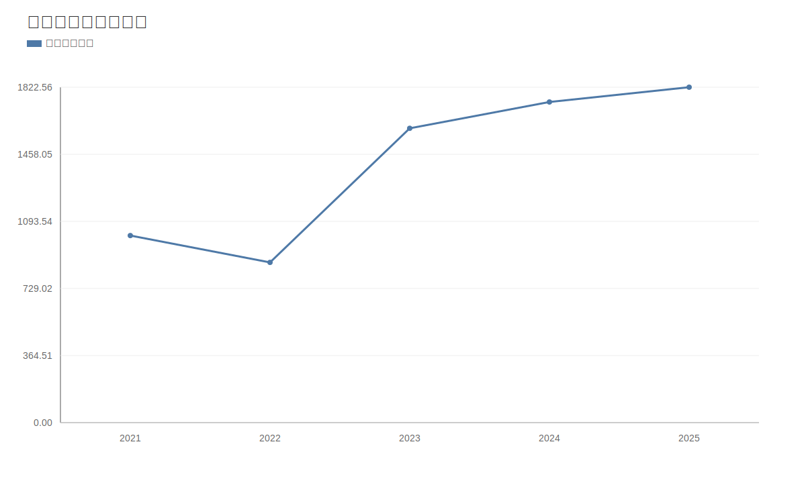

### 2. 净利润趋势图
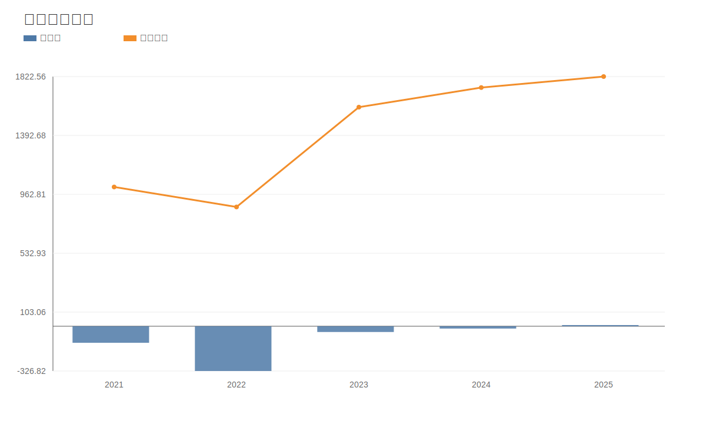

### 3. 毛利率和净利率对比图
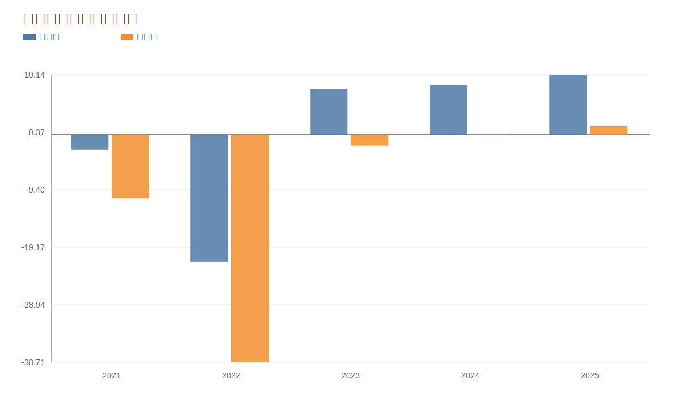

### 4. 分产品收入结构图
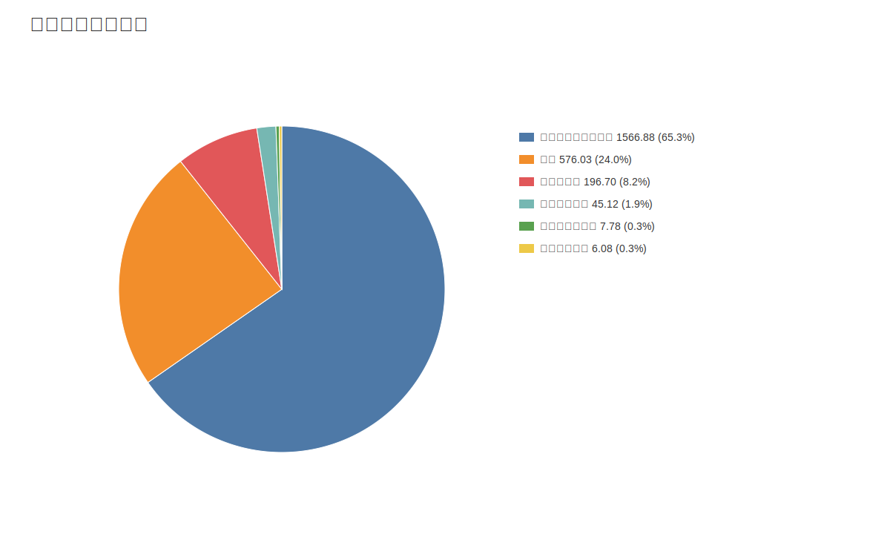

### 4. 分产品收入变化图
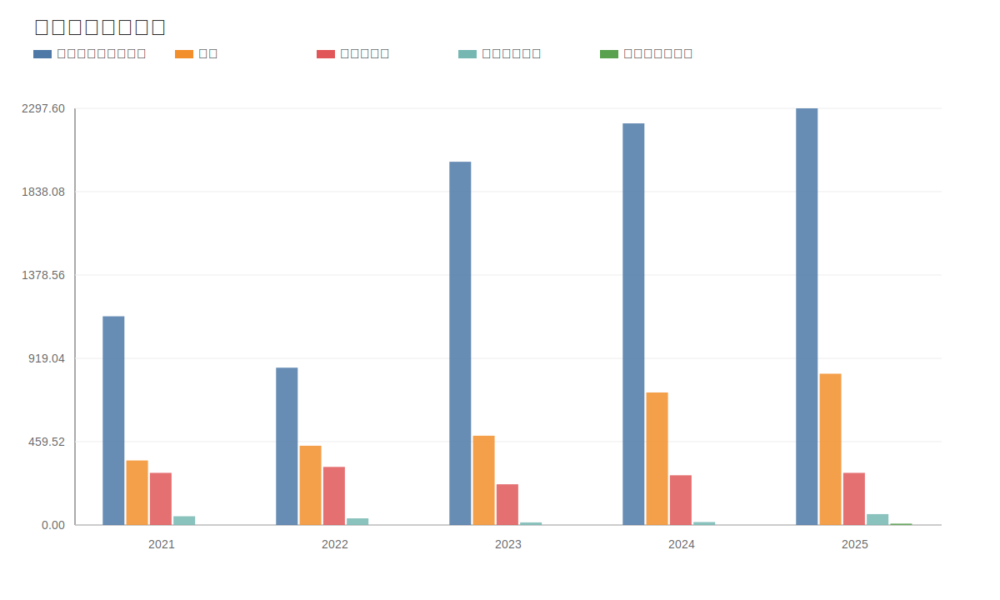

### 5. 分产品利润结构图
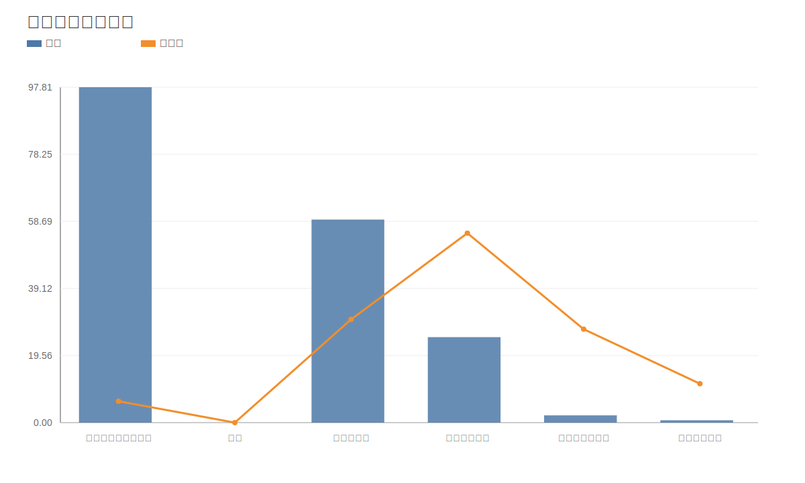

### 6. 分地区收入分布图
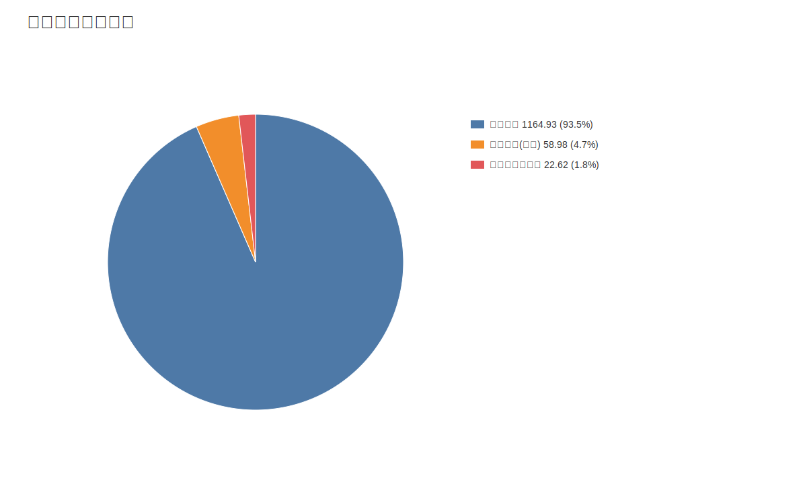

### 7. 资产负债表关键数据图
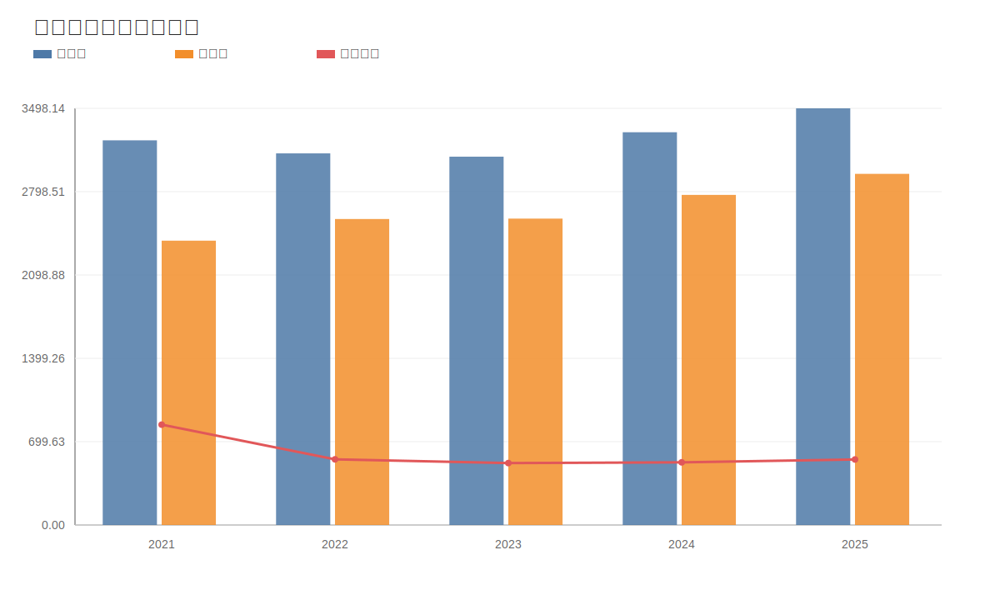

### 8. 自由现金流与经营现金流对比图
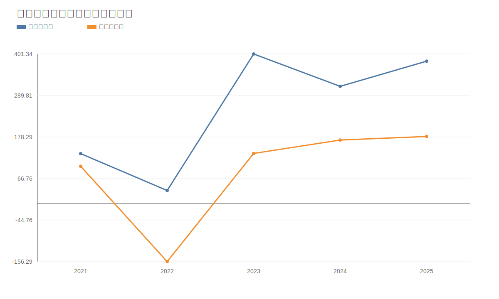

### 9. 股东回报分析图
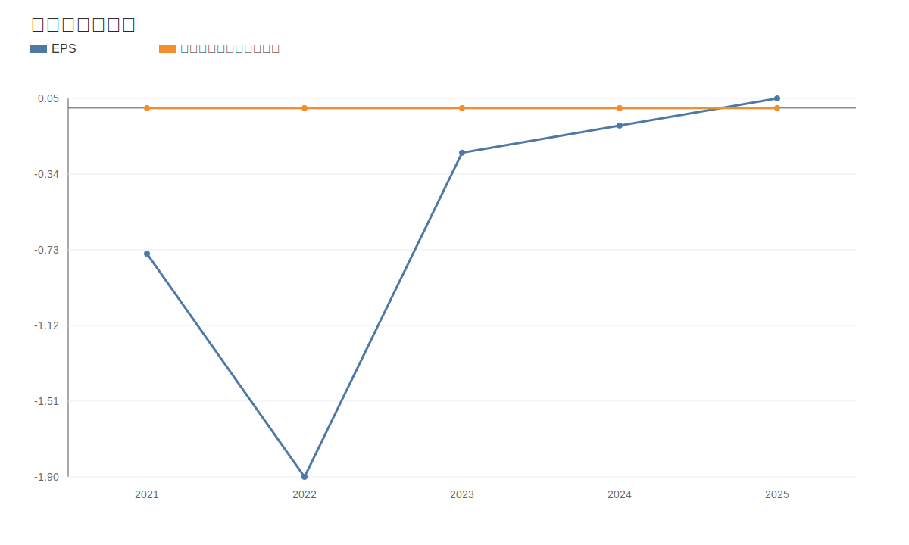

### 10. 财务比率分析图
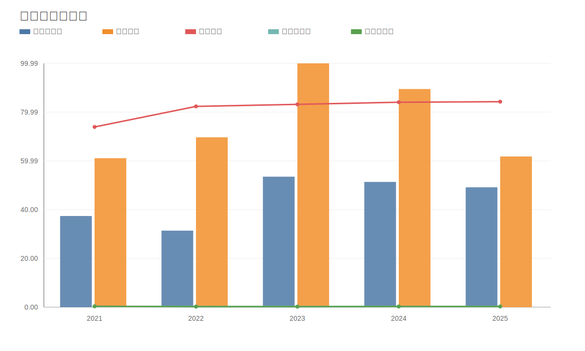

### 11. ROE与ROA对比图
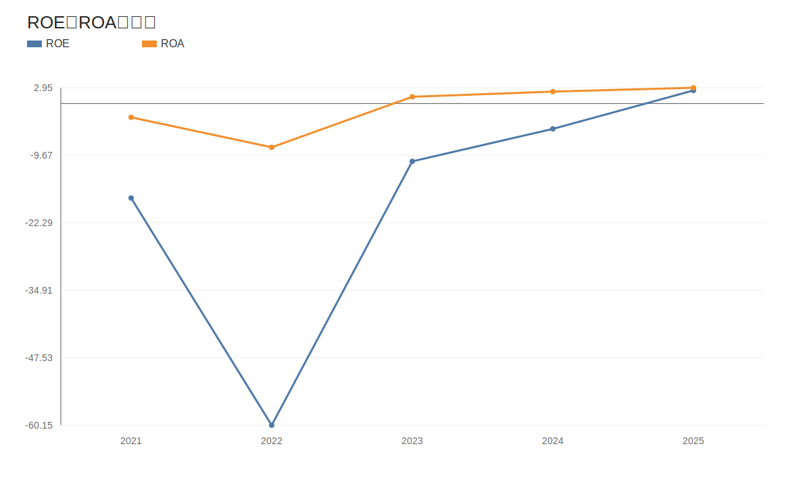
<!-- VALUE_CHARTS_END -->

## 困境反转专项判断（南方航空）
事实：
- 价格日期：20260511；财报日期：20260331。
- 当前收盘价 5.65 元，PE(TTM) 33.19，PB 2.76。
计算结果：
- 营收同比 -73.78%，净利润同比 72.81%，经营现金流同比 -87.30%。
- 资产负债率：最新 83.97%，上期 84.27%。
- 困境反转评分：2/3，状态：反转进行中。
推断：
- 若“盈利修复 + 现金流修复 + 杠杆缓解”连续两个报告期维持，则反转概率提升；若任一项再度恶化，应下调反转置信度。
