# 三峡水利（600116.SH）价值分析报告草稿

- 生成时间：2026-05-13 08:10:35
- 自动化脚本：`.agents/skills/value-report/value_report_scaffold.py`
- 数据口径：数据库字段定义以 `app/models/models.py` 为准
- 公司信息：行业 水力发电｜地区 重庆｜上市日期 19970804
- 管理层：董事长 林峰｜总经理 江建峰｜员工 3370
- 主营业务：主要业务:发电,供电.
- 提示：本文件已自动填充定量部分，定性模块请结合最新公告与行业资料补充。

## 自动填充数据（可直接引用）
### 最新估值
- 交易日：20260511
- 收盘价：6.78 元
- PE(TTM)：27.43 倍
- PB：1.14 倍
- PS(TTM)：1.24 倍
- 股息率(TTM)：1.31%
- 总市值：129.64 亿元

### 最新财务快照
- 报告期：20260331
- 营收：25.89亿（同比 13.99%）
- 归母净利润：0.32亿（同比 846.96%）
- 经营现金流：-1.54亿（同比 -224.23%）
- 自由现金流：1.22亿
- 毛利率：8.73%，净利率：1.07%
- ROE：0.29%，ROIC：0.27%
- 资产负债率：53.33%，流动比率：0.76
- 经营现金流/利润：-311.25%
- 货币资金：14.33亿，有息负债：82.73亿，净现金：-68.40亿

### 近五年年报趋势
| 年度 | 营收 | 营收同比 | 归母净利 | 净利同比 | 毛利率 | 净利率 | ROE | ROIC | 资产负债率 | 经营现金流 | 自由现金流 | 现净比 |
| --- | --- | --- | --- | --- | --- | --- | --- | --- | --- | --- | --- | --- |
| 2025 | 101.73亿 | -1.44% | 4.36亿 | 40.75% | 12.54% | 4.10% | 3.90% | 2.61% | 54.43% | 13.96亿 | 0.22亿 | 320.31% |
| 2024 | 103.22亿 | -7.65% | 3.10亿 | -39.94% | 10.31% | 2.75% | 2.79% | 2.29% | 55.37% | 8.98亿 | -8.92亿 | 290.05% |
| 2023 | 111.77亿 | 0.76% | 5.16亿 | 8.28% | 10.27% | 4.44% | 4.64% | 3.49% | 51.47% | 12.67亿 | -5.28亿 | 245.62% |
| 2022 | 110.93亿 | 9.00% | 4.76亿 | -44.94% | 10.50% | 4.24% | 4.34% | 3.59% | 48.32% | 8.55亿 | 7.05亿 | 179.45% |
| 2021 | 101.77亿 | N/A | 8.65亿 | N/A | 16.52% | 8.58% | 8.19% | 6.13% | 47.25% | 13.15亿 | -7.37亿 | 151.99% |

- 近五年营收CAGR：-0.01%
- 近五年净利CAGR：-15.74%

### 分红与审计
#### 已实施分红
2025年已实施现金分红（税前）合计：每股 0.140 元
2024年已实施现金分红（税前）合计：每股 0.150 元
2023年已实施现金分红（税前）合计：每股 0.150 元

#### 审计意见
- 20241231：标准无保留意见（大华会计师事务所）
- 20231231：标准无保留意见（大华会计师事务所）
- 20221231：标准无保留意见（大华会计师事务所）
- 20211231：标准无保留意见（大华会计师事务所）
- 20201231：标准无保留意见（大华会计师事务所）

## ECharts 图表数据（option）

- 说明：以下 `option` 可直接用于前端图表渲染；单位已在坐标轴标注。

### 1. 主营业务收入趋势图
```json
{
  "title": {
    "text": "主营业务收入趋势（近5年）"
  },
  "tooltip": {
    "trigger": "axis"
  },
  "legend": {
    "top": 24,
    "data": [
      "主营业务收入"
    ]
  },
  "xAxis": {
    "type": "category",
    "data": [
      "2021",
      "2022",
      "2023",
      "2024",
      "2025"
    ]
  },
  "yAxis": {
    "type": "value",
    "name": "亿元"
  },
  "series": [
    {
      "name": "主营业务收入",
      "type": "line",
      "smooth": true,
      "data": [
        101.77,
        110.93,
        111.77,
        103.22,
        101.73
      ]
    }
  ]
}
```

### 2. 净利润趋势图
```json
{
  "title": {
    "text": "净利润趋势（近5年）"
  },
  "tooltip": {
    "trigger": "axis"
  },
  "legend": {
    "top": 24,
    "data": [
      "净利润",
      "营业收入"
    ]
  },
  "xAxis": {
    "type": "category",
    "data": [
      "2021",
      "2022",
      "2023",
      "2024",
      "2025"
    ]
  },
  "yAxis": [
    {
      "type": "value",
      "name": "亿元"
    },
    {
      "type": "value",
      "name": "亿元"
    }
  ],
  "series": [
    {
      "name": "净利润",
      "type": "bar",
      "data": [
        8.65,
        4.76,
        5.16,
        3.1,
        4.36
      ]
    },
    {
      "name": "营业收入",
      "type": "line",
      "yAxisIndex": 1,
      "data": [
        101.77,
        110.93,
        111.77,
        103.22,
        101.73
      ]
    }
  ]
}
```

### 3. 毛利率和净利率对比图
```json
{
  "title": {
    "text": "毛利率 vs 净利率"
  },
  "tooltip": {
    "trigger": "axis"
  },
  "legend": {
    "top": 24,
    "data": [
      "毛利率",
      "净利率"
    ]
  },
  "xAxis": {
    "type": "category",
    "data": [
      "2021",
      "2022",
      "2023",
      "2024",
      "2025"
    ]
  },
  "yAxis": {
    "type": "value",
    "name": "%"
  },
  "series": [
    {
      "name": "毛利率",
      "type": "bar",
      "data": [
        16.52,
        10.5,
        10.27,
        10.31,
        12.54
      ]
    },
    {
      "name": "净利率",
      "type": "bar",
      "data": [
        8.58,
        4.24,
        4.44,
        2.75,
        4.1
      ]
    }
  ]
}
```

### 4. 分产品收入结构图
```json
{
  "title": {
    "text": "分产品收入结构（20251231）"
  },
  "tooltip": {
    "trigger": "item"
  },
  "legend": {
    "type": "scroll",
    "top": 24
  },
  "series": [
    {
      "type": "pie",
      "radius": "55%",
      "data": [
        {
          "name": "电力",
          "value": 68.9
        },
        {
          "name": "电力销售(行业)",
          "value": 68.84
        },
        {
          "name": "其他主营业务",
          "value": 18.66
        },
        {
          "name": "其他主营业务(行业)",
          "value": 16.87
        },
        {
          "name": "综合能源业务",
          "value": 16.06
        },
        {
          "name": "综合能源(行业)",
          "value": 15.41
        },
        {
          "name": "其他业务",
          "value": 0.61
        },
        {
          "name": "其他业务(行业)",
          "value": 0.61
        }
      ]
    }
  ]
}
```

### 4. 分产品收入变化图
```json
{
  "title": {
    "text": "分产品收入变化（近5年）"
  },
  "tooltip": {
    "trigger": "axis"
  },
  "legend": {
    "type": "scroll",
    "top": 24,
    "data": [
      "电力",
      "电力销售(行业)",
      "其他主营业务",
      "其他主营业务(行业)",
      "综合能源业务"
    ]
  },
  "xAxis": {
    "type": "category",
    "data": [
      "2021",
      "2022",
      "2023",
      "2024",
      "2025"
    ]
  },
  "yAxis": {
    "type": "value",
    "name": "亿元"
  },
  "series": [
    {
      "name": "电力",
      "type": "bar",
      "stack": "total",
      "data": [
        85.23,
        30.57,
        102.38,
        102.09,
        102.08
      ]
    },
    {
      "name": "电力销售(行业)",
      "type": "bar",
      "stack": "total",
      "data": [
        85.23,
        66.62,
        69.11,
        69.56,
        68.84
      ]
    },
    {
      "name": "其他主营业务",
      "type": "bar",
      "stack": "total",
      "data": [
        8.71,
        5.14,
        51.75,
        34.56,
        28.15
      ]
    },
    {
      "name": "其他主营业务(行业)",
      "type": "bar",
      "stack": "total",
      "data": [
        8.31,
        0.0,
        28.9,
        17.44,
        16.87
      ]
    },
    {
      "name": "综合能源业务",
      "type": "bar",
      "stack": "total",
      "data": [
        0.0,
        0.0,
        20.66,
        23.47,
        23.07
      ]
    }
  ]
}
```

### 5. 分产品利润结构图
```json
{
  "title": {
    "text": "分产品利润结构（20251231）"
  },
  "tooltip": {
    "trigger": "axis"
  },
  "legend": {
    "top": 24,
    "data": [
      "利润",
      "毛利率"
    ]
  },
  "xAxis": {
    "type": "category",
    "data": [
      "电力",
      "电力销售(行业)",
      "其他主营业务",
      "其他主营业务(行业)",
      "综合能源业务",
      "综合能源(行业)",
      "其他业务",
      "其他业务(行业)"
    ]
  },
  "yAxis": [
    {
      "type": "value",
      "name": "亿元"
    },
    {
      "type": "value",
      "name": "%"
    }
  ],
  "series": [
    {
      "name": "利润",
      "type": "bar",
      "data": [
        8.27,
        8.28,
        1.8,
        1.59,
        2.6,
        2.64,
        0.24,
        0.24
      ]
    },
    {
      "name": "毛利率",
      "type": "line",
      "yAxisIndex": 1,
      "data": [
        12.0,
        12.03,
        9.67,
        9.44,
        16.18,
        17.14,
        40.23,
        40.23
      ]
    }
  ]
}
```

### 6. 分地区收入分布图
```json
{
  "title": {
    "text": "分地区收入分布（20251231）"
  },
  "tooltip": {
    "trigger": "item"
  },
  "legend": {
    "type": "scroll",
    "top": 24
  },
  "series": [
    {
      "type": "pie",
      "radius": "55%",
      "data": [
        {
          "name": "西南",
          "value": 100.24
        },
        {
          "name": "其他业务(地区)",
          "value": 0.61
        },
        {
          "name": "华东",
          "value": 0.56
        },
        {
          "name": "华南",
          "value": 0.32
        }
      ]
    }
  ]
}
```

### 7. 资产负债表关键数据图
```json
{
  "title": {
    "text": "资产负债表关键数据（近5年）"
  },
  "tooltip": {
    "trigger": "axis"
  },
  "legend": {
    "top": 24,
    "data": [
      "总资产",
      "总负债",
      "股东权益"
    ]
  },
  "xAxis": {
    "type": "category",
    "data": [
      "2021",
      "2022",
      "2023",
      "2024",
      "2025"
    ]
  },
  "yAxis": {
    "type": "value",
    "name": "亿元"
  },
  "series": [
    {
      "name": "总资产",
      "type": "bar",
      "stack": "capital",
      "data": [
        212.52,
        218.6,
        235.37,
        252.02,
        251.69
      ]
    },
    {
      "name": "总负债",
      "type": "bar",
      "stack": "capital",
      "data": [
        100.42,
        105.64,
        121.14,
        139.54,
        137.0
      ]
    },
    {
      "name": "股东权益",
      "type": "line",
      "data": [
        112.1,
        112.97,
        114.23,
        112.48,
        114.69
      ]
    }
  ]
}
```

### 8. 自由现金流与经营现金流对比图
```json
{
  "title": {
    "text": "自由现金流 vs 经营现金流"
  },
  "tooltip": {
    "trigger": "axis"
  },
  "legend": {
    "top": 24,
    "data": [
      "经营现金流",
      "自由现金流"
    ]
  },
  "xAxis": {
    "type": "category",
    "data": [
      "2021",
      "2022",
      "2023",
      "2024",
      "2025"
    ]
  },
  "yAxis": {
    "type": "value",
    "name": "亿元"
  },
  "series": [
    {
      "name": "经营现金流",
      "type": "line",
      "data": [
        13.15,
        8.55,
        12.67,
        8.98,
        13.96
      ]
    },
    {
      "name": "自由现金流",
      "type": "line",
      "data": [
        -7.37,
        7.05,
        -5.28,
        -8.92,
        0.22
      ]
    }
  ]
}
```

### 9. 股东回报分析图
```json
{
  "title": {
    "text": "股东回报（EPS/分红）"
  },
  "tooltip": {
    "trigger": "axis"
  },
  "legend": {
    "top": 24,
    "data": [
      "EPS",
      "每股现金分红（已实施）"
    ]
  },
  "xAxis": {
    "type": "category",
    "data": [
      "2021",
      "2022",
      "2023",
      "2024",
      "2025"
    ]
  },
  "yAxis": {
    "type": "value",
    "name": "元"
  },
  "series": [
    {
      "name": "EPS",
      "type": "line",
      "data": [
        0.45,
        0.25,
        0.27,
        0.16,
        0.23
      ]
    },
    {
      "name": "每股现金分红（已实施）",
      "type": "line",
      "data": [
        0.0,
        0.0,
        0.15,
        0.15,
        0.14
      ]
    }
  ]
}
```

### 10. 财务比率分析图
```json
{
  "title": {
    "text": "关键财务比率（近5年）"
  },
  "tooltip": {
    "trigger": "axis"
  },
  "legend": {
    "type": "scroll",
    "top": 24,
    "data": [
      "资产负债率",
      "流动比率",
      "速动比率",
      "应收周转率",
      "存货周转率"
    ]
  },
  "xAxis": {
    "type": "category",
    "data": [
      "2021",
      "2022",
      "2023",
      "2024",
      "2025"
    ]
  },
  "yAxis": [
    {
      "type": "value",
      "name": "比率/%"
    },
    {
      "type": "value",
      "name": "周转率"
    }
  ],
  "series": [
    {
      "name": "资产负债率",
      "type": "line",
      "data": [
        47.25,
        48.32,
        51.47,
        55.37,
        54.43
      ]
    },
    {
      "name": "流动比率",
      "type": "line",
      "data": [
        0.95,
        0.91,
        0.62,
        0.59,
        0.71
      ]
    },
    {
      "name": "速动比率",
      "type": "line",
      "data": [
        0.87,
        0.86,
        0.58,
        0.54,
        0.66
      ]
    },
    {
      "name": "应收周转率",
      "type": "bar",
      "yAxisIndex": 1,
      "data": [
        15.24,
        13.11,
        10.86,
        9.05,
        9.23
      ]
    },
    {
      "name": "存货周转率",
      "type": "bar",
      "yAxisIndex": 1,
      "data": [
        10.59,
        12.12,
        12.56,
        11.68,
        13.2
      ]
    }
  ]
}
```

### 11. ROE与ROA对比图
```json
{
  "title": {
    "text": "ROE vs ROA（近5年）"
  },
  "tooltip": {
    "trigger": "axis"
  },
  "legend": {
    "top": 24,
    "data": [
      "ROE",
      "ROA"
    ]
  },
  "xAxis": {
    "type": "category",
    "data": [
      "2021",
      "2022",
      "2023",
      "2024",
      "2025"
    ]
  },
  "yAxis": {
    "type": "value",
    "name": "%"
  },
  "series": [
    {
      "name": "ROE",
      "type": "line",
      "data": [
        8.19,
        4.34,
        4.64,
        2.79,
        3.9
      ]
    },
    {
      "name": "ROA",
      "type": "line",
      "data": [
        6.77,
        3.59,
        3.74,
        2.49,
        3.54
      ]
    }
  ]
}
```

## 1. 公司概况（商业模式优先）
- 公司是如何赚钱的？
- 收入来源构成（核心业务占比）
- 客户类型（To B / To C / 政府）
- 是否具备持续性收入（一次性 vs 订阅/复购）
- 是否依赖单一客户或区域

### 结论
- 商业模式是否简单、可理解
- 是否具备长期可持续性

## 2. 行业与竞争格局
- 行业空间（市场规模、天花板）
- 行业阶段（成长 / 成熟 / 衰退）
- 行业增速
- 主要竞争对手
- 市场份额与行业集中度
- 公司在产业链中的位置

### 结论
- 是否属于优质赛道
- 公司是否处于有利竞争位置
- 行业未来3-5年趋势

## 3. 护城河分析（含真伪辨别）
- 品牌优势
- 成本优势
- 网络效应
- 转换成本
- 技术壁垒
- 渠道优势

### 护城河真伪辨别
- 如果产品提价 5%，客户是否会流失？
- 客户是否对价格敏感？
- 是否存在“非它不可”的使用场景？
- 替代品是否容易出现？
- 客户更换供应商的成本高不高？

### 结论
- 护城河类型
- 护城河强度：强 / 中 / 弱 / 伪护城河
- 是否具备真实定价权

## 4. 管理层与资本配置（重点）
- 管理层背景与稳定性
- 是否存在诚信问题（造假 / 处罚 / 诉讼）
- 过往战略是否理性

### 资本配置历史
- 是否长期分红
- 是否进行回购注销（而非股权激励稀释）
- 并购历史（成功 / 失败 / 频繁）
- 是否存在盲目多元化扩张
- 资本开支是否合理

### 结论
- 管理层类型：价值创造者 / 中性 / 价值毁灭者
- 是否值得长期信任

## 5. 财务分析
### 5.1 成长性
- 营收增长率（近3-5年）
- 净利润增长率
- 增长是否稳定

### 结论
- 是否具备持续成长能力

### 5.2 盈利能力
- 毛利率
- 净利率
- ROE / ROIC

### 结论
- 是否具备定价权
- 盈利质量如何

### 5.3 财务健康
- 资产负债率
- 有息负债
- 现金储备
- 短期偿债能力

### 结论
- 是否存在财务风险

### 5.4 现金流质量
- 经营现金流
- 自由现金流
- 净利润与现金流是否匹配

### 结论
- 利润是否真实
- 是否具备造血能力

## 6. 成长驱动
- 未来3-5年增长来源
- 是否依赖提价 / 扩张 / 新业务
- 增长逻辑是否清晰

### 结论
- 成长是否可持续

## 7. 风险分析（含幸存者偏差）
- 政策风险
- 行业竞争风险
- 技术替代风险
- 财务风险
- 客户集中风险

### 幸存者偏差检验
- 行业历史最差时期是什么时候？
- 当时发生了什么（金融危机 / 疫情 / 监管）？
- 公司当时表现：是否大幅亏损 / 现金流断裂 / 接近破产？
- 公司在极端情况下是：变强 / 持平 / 衰退

### 结论
- 抗风险能力：强 / 中 / 弱
- 是否属于“穿越周期公司”

## 8. 估值分析
- PE / PB / PS / PEG / EV/EBITDA
- 当前估值 vs 历史估值
- 当前估值 vs 行业对比

### 结论
- 当前是否高估 / 低估 / 合理
- 是否具备安全边际

## 9. 投资判断
### 多头逻辑
1. 
2. 
3. 

### 空头逻辑
1. 
2. 
3. 

### 核心跟踪指标
1. 
2. 
3. 

## 最终结论
- 这是否是一家好公司？
- 是否具备长期投资价值？
- 当前价格是否值得买入？
- 投资建议：买入 / 观察 / 回避

## 总评分（100分）
- 商业模式：
- 护城河：
- 管理层：
- 财务：
- 风险：
- 估值：

**最终评分：__ / 100**

## 三个终极问题（必须回答）
1. 如果提价 5%，客户会不会流失？
2. 公司赚的钱有没有被管理层浪费？
3. 在行业最差年份，公司是怎么活下来的？

<!-- VALUE_CHARTS_START -->
## 图表图片（自动生成）

### 1. 主营业务收入趋势图
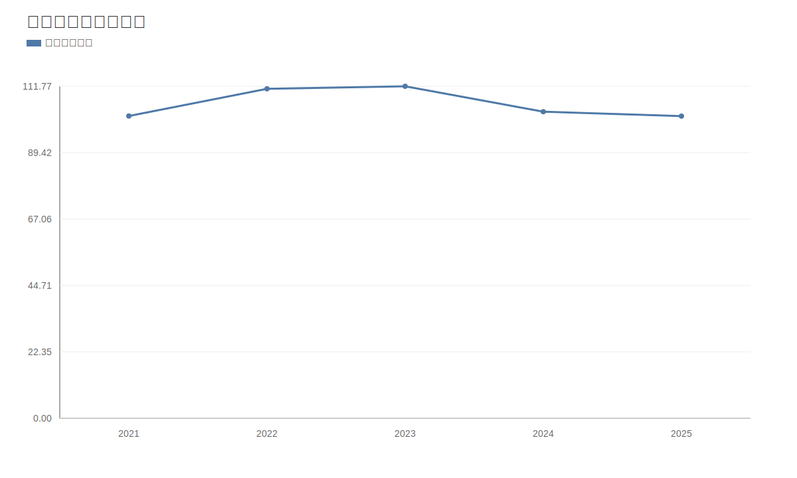

### 2. 净利润趋势图
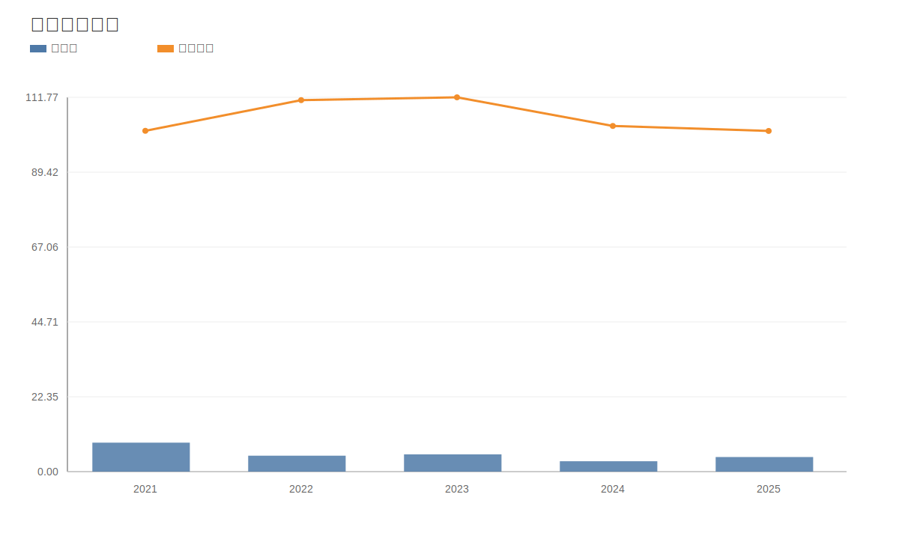

### 3. 毛利率和净利率对比图
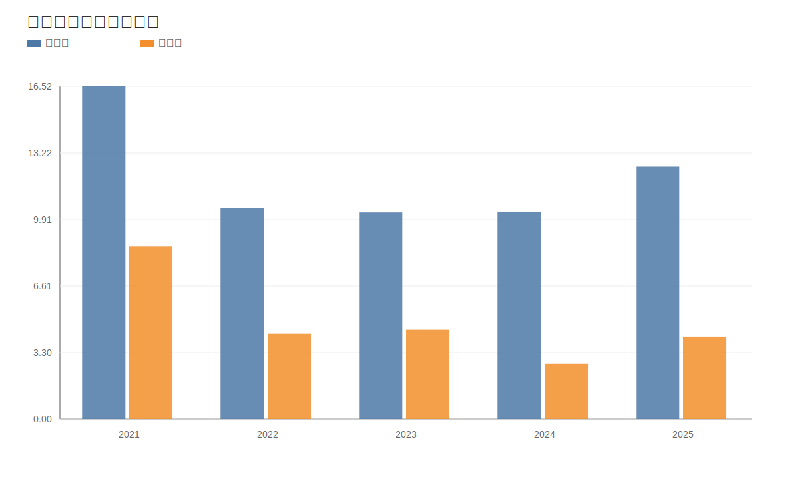

### 4. 分产品收入结构图
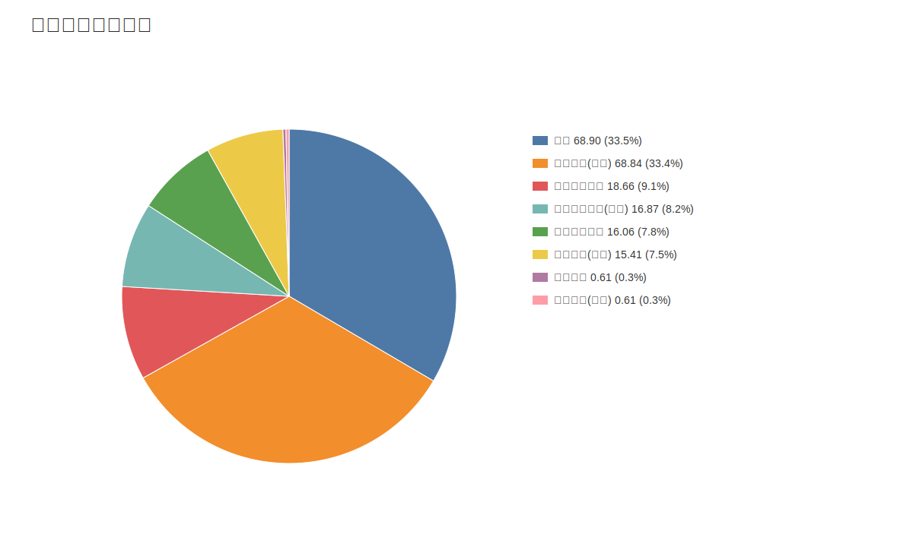

### 4. 分产品收入变化图
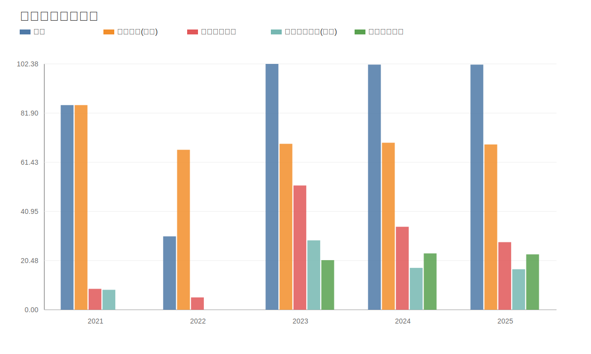

### 5. 分产品利润结构图
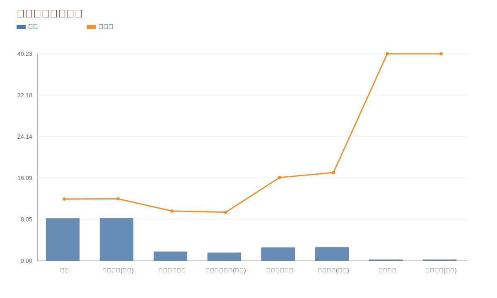

### 6. 分地区收入分布图
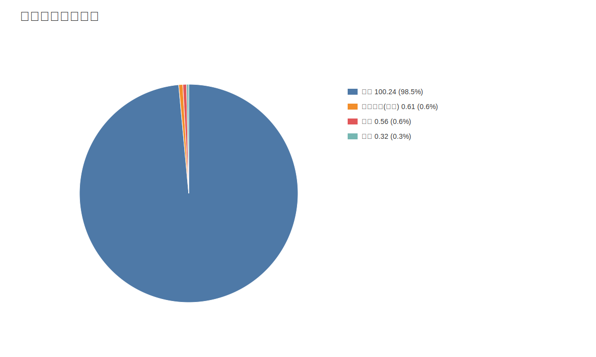

### 7. 资产负债表关键数据图
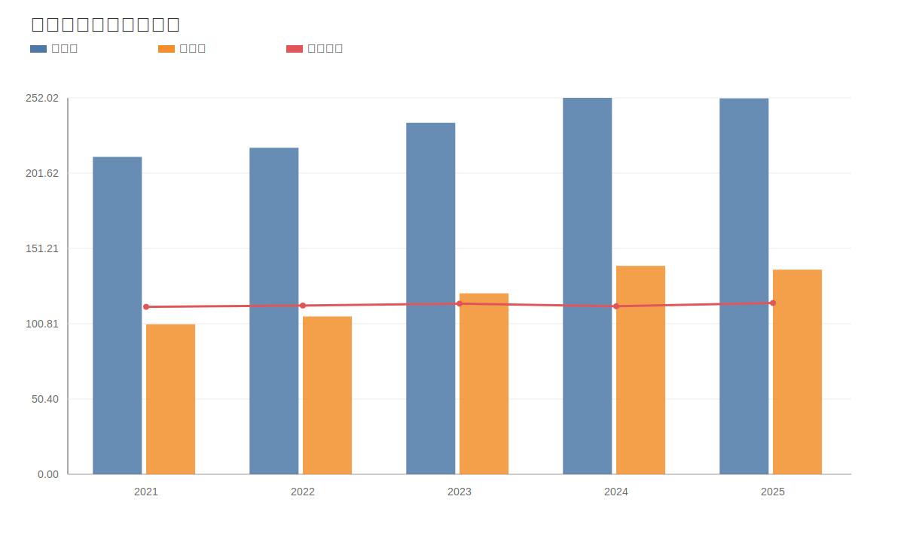

### 8. 自由现金流与经营现金流对比图
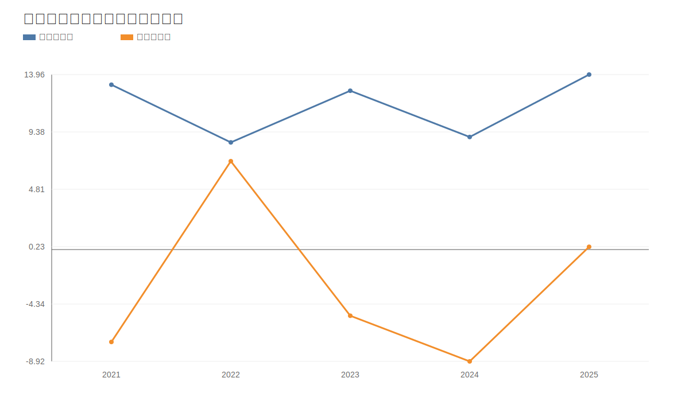

### 9. 股东回报分析图
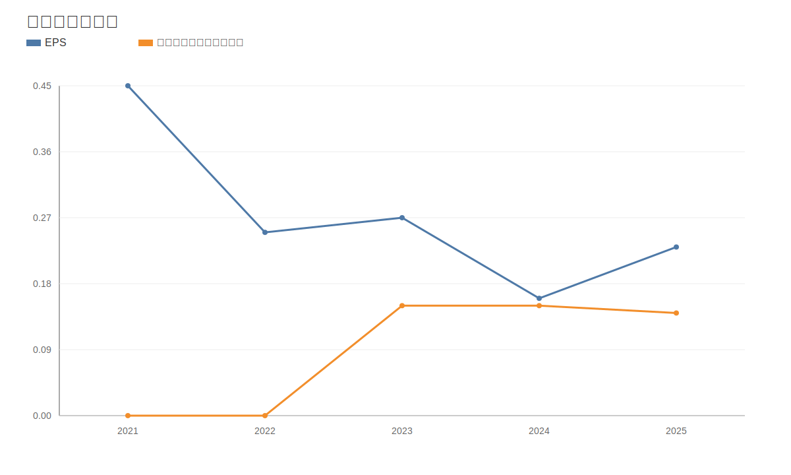

### 10. 财务比率分析图
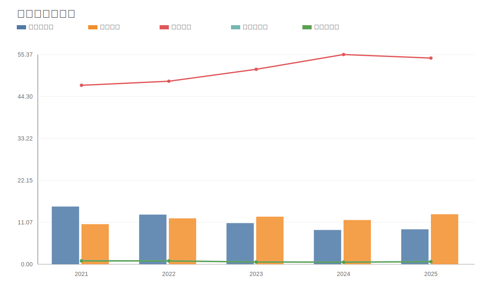

### 11. ROE与ROA对比图
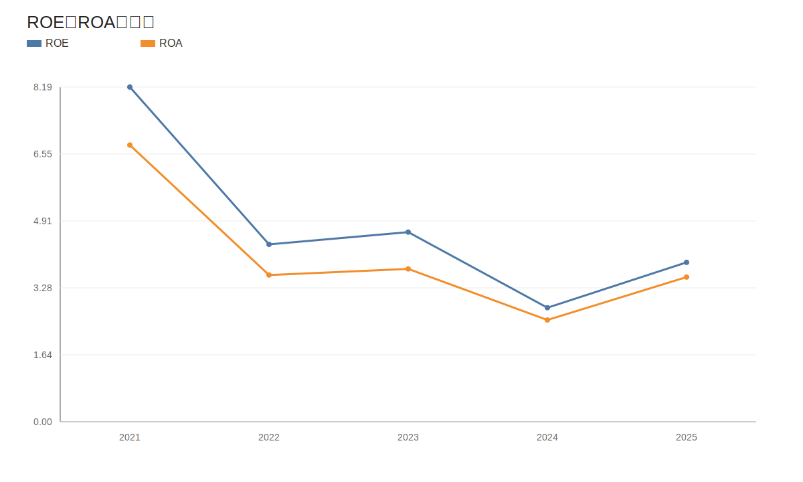
<!-- VALUE_CHARTS_END -->

## 困境反转专项判断（三峡水利）
事实：
- 价格日期：20260511；财报日期：20260331。
- 当前收盘价 6.78 元，PE(TTM) 27.43，PB 1.14。
计算结果：
- 营收同比 -74.55%，净利润同比 -92.58%，经营现金流同比 -111.04%。
- 资产负债率：最新 53.33%，上期 54.43%。
- 困境反转评分：1/3，状态：反转待确认。
推断：
- 若“盈利修复 + 现金流修复 + 杠杆缓解”连续两个报告期维持，则反转概率提升；若任一项再度恶化，应下调反转置信度。
