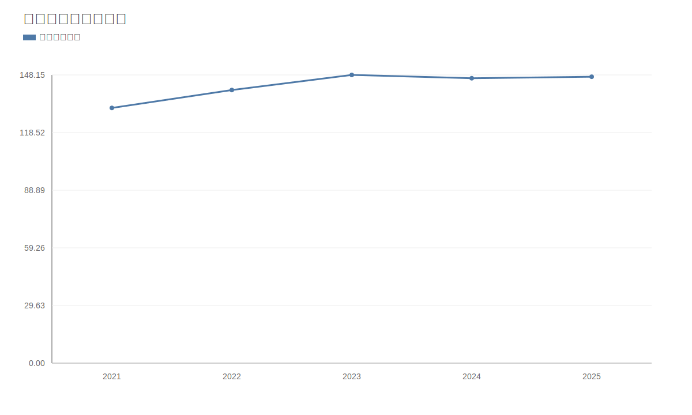
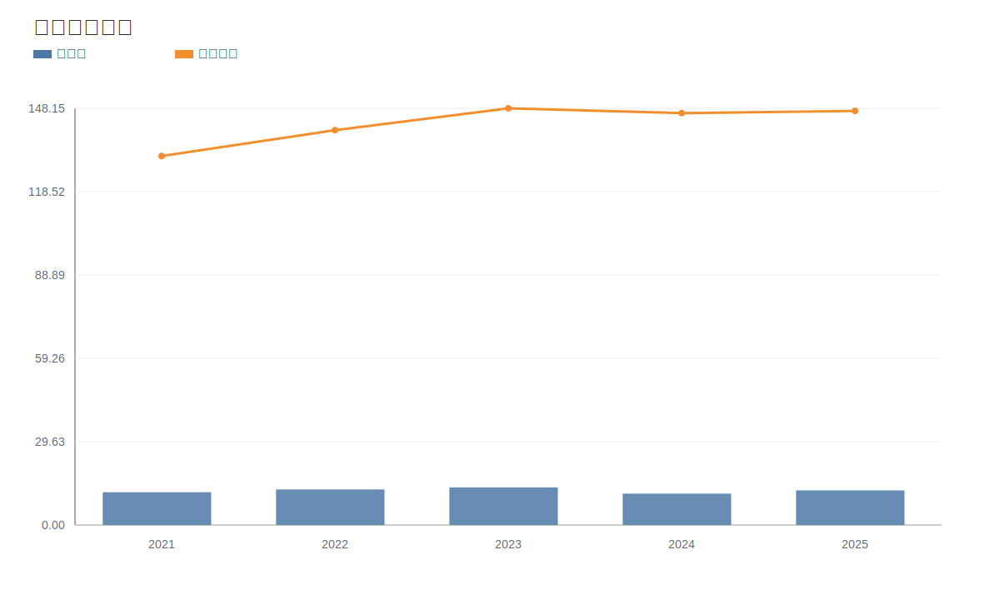
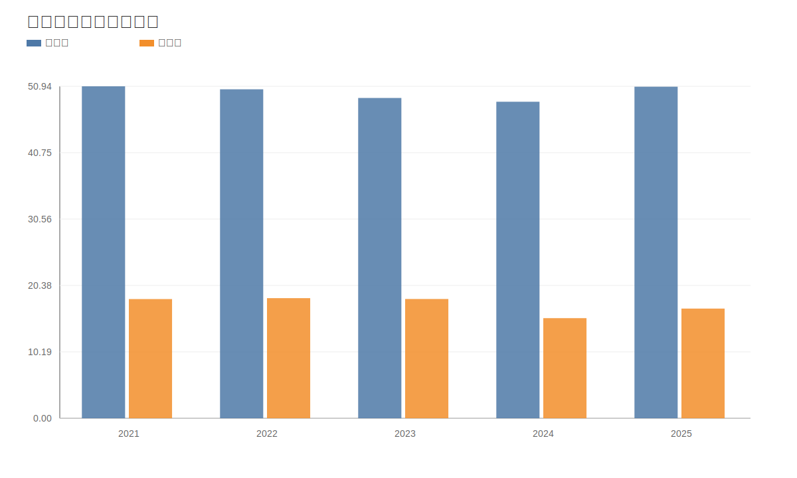
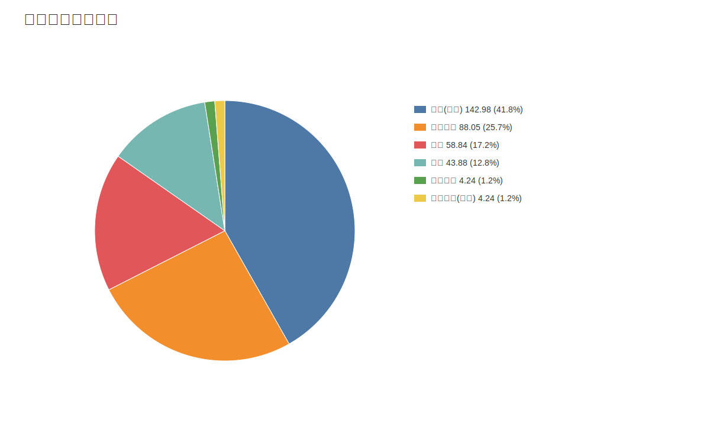

# 重庆啤酒（600132）深度价值研究报告（巴菲特+芒格框架）

价格日期：2026-04-17  
财报日期：2025-12-31

## 1. 公司概况（商业模式优先）
重庆啤酒的核心商业模式是“品牌矩阵+区域深耕+渠道分销”，通过本土品牌守住基盘、国际品牌提升结构和吨价。客户类型以终端消费者为主，销售通过经销体系实现广覆盖。

结论：公司属于现金流较稳的成熟消费品企业。  
事实：2025年收入147.22亿元，归母净利润12.31亿元。  
推断：未来回报更依赖结构优化与运营效率，而非行业高增长。

## 2. 行业与竞争格局
啤酒行业整体处于成熟期，行业总量波动不大，竞争焦点转向高端化、渠道掌控和品牌运营效率。

结论：行业进入“低增速、重竞争质量”阶段。  
事实：可比公司PE区间约13-24倍，显示市场对行业成长预期整体克制。  
推断：头部企业的超额收益将更多来自管理效率差异。

## 3. 护城河分析（含真伪辨别）
护城河来源：品牌资产、渠道网络、区域运营经验。护城河短板：产品可替代性较强，竞争对手持续促销会侵蚀份额与利润。

结论：护城河强度为“中等”。  
事实：2025年本土品牌收入占比约59.8%，国际品牌占比约37.3%。  
推断：品牌组合是优势，但并不足以保证无周期波动的超额收益。

## 4. 管理层与资本配置
管理层风格偏稳健，资本开支相对克制，强调股东回报和经营效率。研发投入在啤酒行业中占比不高，符合行业属性。

结论：资本配置偏防守，股东回报导向明确。  
事实：2025年销售费用率约18.03%，研发费用率约0.11%。  
推断：未来关键在“费用效率提升”，而非大规模扩产。

## 5. 财务分析（成长/盈利/健康/现金流）
成长性：2021-2025营收CAGR约2.9%，净利CAGR约1.4%。
盈利能力：2025年毛利率50.88%，净利率16.83%。
财务健康：资产负债率73.24%，净现金约7.53亿元。
现金流质量：2025年经营现金流26.24亿元，自由现金流24.21亿元。

结论：财务稳健，现金流质量较好。  
事实：经营现金流与利润匹配度持续较高。  
推断：公司具备持续分红能力，但高增长属性有限。

## 6. 成长驱动
增长驱动来自高端化渗透、渠道效率改善、区域精细化运营。增量更偏“质量升级”，而非“规模爆发”。

结论：增长驱动存在，但中枢偏温和。  
事实：2024年收入下滑后，2025年收入和利润恢复增长。  
推断：若费用控制和高端化同时改善，利润弹性可继续释放。

## 7. 风险分析（含幸存者偏差）
风险包括：消费疲弱、渠道竞争加剧、费用率上行、区域集中风险。幸存者偏差检验看低迷周期的现金流韧性。

结论：抗风险能力“中偏强”。  
事实：2021-2025经营现金流均在26亿元以上。  
推断：公司“活得稳”，但估值提升需要增长再确认。

## 8. 估值分析
当前估值：PE 21.22x，PB 18.97x，PS 1.77x。
历史分位：PE 5.8% / PB 36.8% / PS 4.8%。
相对估值：PE低于部分可比，处于中低区间。
DCF：保守/基准/乐观估值约72.07/81.69/92.39元。
反向DCF：当前价格隐含未来5年FCF增速约-4.7%。

结论：估值偏谨慎，具一定安全边际。  
事实：反向DCF隐含负增长预期。  
推断：若公司实现温和增长，估值修复概率较高。

## 9. 投资判断（多头/空头/跟踪指标）
多头逻辑：
- 现金流和分红能力强。
- 估值中低位，市场预期保守。
- 品牌矩阵与区域运营能力稳定。

空头逻辑：
- 行业成熟，增长天花板明显。
- 渠道和促销竞争可能压缩利润。
- 区域集中度较高。

跟踪指标：
- 高端产品占比和吨价
- 销售费用率与净利率
- 区域份额和渠道库存
- 经营现金流与分红率

结论：更适合作为稳健消费仓位配置。  
事实：估值并不激进。  
推断：上行弹性取决于增长改善幅度。

## 10. 最终结论
重庆啤酒是成熟行业中的优质经营型公司，当前价格反映了较谨慎预期。若盈利稳步提升，估值有修复空间。

结论：投资建议“观察偏积极/分批配置”。  
事实：PE和PS处历史低位分位。  
推断：风险收益比对中长期投资者较友好。

## 11. 总评分（100分）
- 商业模式（20）：16
- 护城河（20）：14
- 管理层与资本配置（15）：12
- 财务质量（20）：17
- 风险控制（10）：7
- 估值性价比（15）：12
- 最终总分：78/100

结论：属于“稳健现金流型消费标的”。  
事实：强项在现金流与经营稳定，弱项在成长弹性。  
推断：适合偏防守策略而非高成长策略。

## 12. 三个终极问题（必须回答）
1. 如果提价5%，客户会不会流失？
- 在核心品牌和强势区域，短期流失有限；在竞争激烈区域，可能需要促销对冲。

2. 公司赚的钱有没有被管理层浪费？
- 目前看没有明显浪费，资本开支克制、现金流充沛、分红能力较强。

3. 在行业最差年份，公司是怎么活下来的？
- 依靠品牌和渠道基础、稳定现金流以及较强费用管控能力穿越周期。

结论：终极三问下，公司符合“可长期跟踪的防守型消费股”。  
事实：经营现金流与分红能力是核心安全垫。  
推断：增长改善将决定估值弹性上限。

<!-- VALUE_CHARTS_START -->
## 图表图片（自动生成）

### 1. 营收与归母净利润（亿元）

### 2. 毛利率与净利率（%）

### 3. 经营现金流与自由现金流（亿元）

### 4. 2025分品牌收入结构（亿元）

<!-- VALUE_CHARTS_END -->

> ⚠️ 免责声明：本分析仅供教育和研究用途，不构成投资建议。
