# 恒瑞医药（600276.SH）深度价值研究报告

- 报告日期：2026-06-02
- 标的：恒瑞医药（600276.SH）
- 数据截止：行情截至 2026-05-29；财务截至 2026-03-31；公告截至 2026-05-12
- 数据口径：本地数据库 + 公司年报/季报/公告公开披露

## 1. 公司概况
恒瑞医药是国内最典型的创新药龙头之一，核心业务覆盖肿瘤、神经科学、造影剂、代谢与心血管、免疫和呼吸等方向。公司的收入不是靠单一大单品，而是靠“研发管线 + 商业化能力 + 学术推广 + 对外许可”共同驱动。

### 结论
这是一个典型的“高研发投入、强管线、强商业化”的创新药平台型公司，不是传统意义上的仿制药公司。

### 事实
- 2025年营业收入316.29亿元，同比增长13.02%；归母净利润77.11亿元，同比增长21.69%。
- 2026年一季度营业收入81.41亿元，同比增长12.98%；归母净利润22.82亿元，同比增长21.78%。
- 2025年创新药销售收入163.42亿元，同比增长26.09%。
- 2026年一季度创新药销售收入45.26亿元，同比增长25.75%，占药品销售收入的61.69%。

### 推断
- 公司已经从“靠单点爆品”转向“靠多管线、多适应症、多区域授权”驱动。
- 未来最重要的不是单纯收入规模，而是创新药商业化效率和全球BD兑现能力。

## 2. 行业与竞争格局
中国创新药行业仍处于“政策约束 + 产业升级 + 全球授权”并存阶段。集采对仿制药利润形成压制，但也倒逼企业把资源集中到真正有壁垒的创新药上。

### 结论
恒瑞所处赛道是中国医药里长期最有想象力的赛道之一，但竞争也最激烈。

### 事实
- 行业内既有成熟大药企，也有高成长Biotech，竞争维度从“仿制药规模”切换到“管线质量、临床效率、海外授权、商业化效率”。
- A股可比公司中，复星医药更偏综合平台，贝达药业更偏单品和肿瘤，百济神州更偏全球化Biotech。
- 2026-05-29恒瑞A股市值约3331亿元，明显高于大多数A股药企，但仍低于全球化Biotech百济神州A股市值约3760亿元的估值想象空间。

### 推断
- 未来3到5年，行业胜负手不再只是“谁的药多”，而是谁能把高质量管线转成可持续现金流。
- 恒瑞在国内创新药龙头里处于第一梯队，但海外商业化能力仍是上限变量。

## 3. 护城河分析（含真伪辨别）
恒瑞的护城河不是单一维度，而是“研发平台、商业化组织、品牌认知、注册申报、BD能力”叠加形成。

### 结论
护城河强度评定为“强”，但不是不可被追赶的绝对垄断。

### 事实
- 2025年产品结构中，肿瘤类收入约166.71亿元，占总收入52.71%。神经科学约42.92亿元，占13.57%。造影剂约29.93亿元，占9.46%。代谢和心血管约24.36亿元，占7.70%。
- 2025年创新药销售收入163.42亿元，占比已成为利润与增长核心。
- 2026年5月12日，公司与BMS签署全球战略合作及许可协议，合作覆盖13个早期项目，潜在总交易额可达约152亿美元，首付款和周年付款最高可达9.5亿美元。

### 真伪辨别
- 如果给产品提价5%，在仿制药或高替代场景里客户更敏感，但恒瑞核心创新药更多依赖临床价值与医保准入，不是纯价格商品。
- 在“非替代性较强、临床价值更高”的创新药场景里，客户流失不太会因为小幅提价而立刻发生。
- 真正的护城河不是“别人做不出药”，而是“别人做出来后，能否更快商业化、更快进医保、更快放量”。

### 推断
- 恒瑞的护城河属于“强但需要持续投入维护”的类型，靠长期研发和组织执行，而不是一次性技术壁垒。

## 4. 管理层与资本配置
恒瑞的管理层长期稳定，且已经从“国内龙头”进入“A+H双平台+全球BD”阶段。资本配置的核心，不是追求短期财务杠杆，而是把钱投到高回报研发资产和国际合作上。

### 结论
管理层整体偏稳健，资本配置质量中上，最值得观察的是对外许可和海外合作的兑现效率。

### 事实
- 董事长为孙飘扬，管理层长期稳定。
- 2025年公司发行H股258,197,600股，募集资金净额102.85亿元。
- 2026年一季度末普通股股东总数458,321户，其中A股458,309户，H股登记股东12户，说明A+H投资者结构已经形成。
- 2025年现金分红历史延续，但分红强度并不属于高股息模型。

### 推断
- 发行H股后，公司资金弹性和国际资本市场可达性增强，后续研发和BD会更有底气。
- 资本配置是否优秀，要看这些资金最终能否转化为更高质量的管线、更快的注册进度和更高的海外授权回报。

## 5. 财务分析（成长/盈利/健康/现金流）

### 5.1 成长性
- 2021到2025年营业收入由259.06亿元增至316.29亿元，5年CAGR约5.1%。
- 2021到2025年归母净利润由45.30亿元增至77.11亿元，5年CAGR约14.4%。
- 2025年净利润同比增长21.69%，高于收入增速，说明利润修复明显。
- 2026年一季度收入和净利润分别同比增长12.98%和21.78%，增长仍在加速。

### 结论
恒瑞不是高频爆发型增长股，但它已经证明自己具备“中速增长 + 利润持续抬升”的能力。

### 事实
- 2025年四个季度收入分别为72.06亿元、85.56亿元、74.27亿元、84.41亿元。
- 2025年四个季度归母净利润分别为18.74亿元、25.76亿元、13.01亿元、19.60亿元。
- 2026年一季度经营活动现金流净额7.86亿元，同比增长41.66%。

### 推断
- 公司的增长质量正在从“收入扩张”切换到“收入 + 利润 + 现金流”三者一起改善。
- 若后续创新药销售继续维持30%以上增长，市场会更容易给出更高的估值锚。

### 5.2 盈利能力
- 2021年销售毛利率约85.56%，销售净利率约17.31%。
- 2024年销售毛利率约86.25%，销售净利率约22.64%，ROE约14.74%，ROIC约13.31%。
- 2025年按净利润/收入粗算，净利率约24.37%，盈利能力继续改善。

### 结论
盈利能力在A股医药公司里属于很强的一档，而且不是靠财务杠杆堆出来的。

### 事实
- 高毛利、高研发、高销售费用是创新药公司常态，但恒瑞已经把创新药收入做到了足够规模。
- 2025年研发费用69.61亿元，占收入约22.0%。

### 推断
- 研发投入强度高，但不是“烧钱换规模”的那种弱模型，而是较为成熟的创新药转化模型。

### 5.3 财务健康
- 2025年总资产698.67亿元，归母净资产612.72亿元，资产负债结构非常稳。
- 2026年一季度总资产712.94亿元，归母净资产636.26亿元，资本实力进一步增强。
- 2025年末货币资金约409.55亿元，现金非常充裕。

### 结论
财务健康度很强，杠杆压力很小，短期偿债风险极低。

### 事实
- 2024年资产负债率约8.07%，流动比率约9.72，速动比率约9.05。
- 2025年经营现金流112.35亿元，自由现金流81.12亿元。
- 2025年经营现金流/归母净利约1.46倍，利润有较好的现金支撑。

### 推断
- 恒瑞不是靠“财技”支撑的公司，而是靠真正的经营现金流和融资弹性支撑。

### 5.4 现金流质量
- 2025年经营现金流112.35亿元，同比增长51.36%。
- 2025年自由现金流81.12亿元，造血能力较强。
- 2026年一季度经营现金流7.86亿元，同比增长41.66%。

### 结论
现金流质量优秀，利润真实性较强。

### 事实
- 经营现金流长期保持正向，且和净利润基本方向一致。
- 2026年一季度现金流仍然改善，说明订单、回款和运营并未出现明显恶化。

### 推断
- 现金流是恒瑞最重要的安全垫之一，也是它能持续推进研发和BD的底层原因。

## 6. 成长驱动
恒瑞未来3到5年的核心驱动，不是单纯靠提价，而是靠创新药放量、对外授权、海外合作和新适应症的持续放行。

### 结论
公司的增长驱动非常清晰，而且具备可验证性。

### 事实
- 2025年创新药销售收入163.42亿元，同比增长26.09%。
- 2026年一季度创新药销售收入45.26亿元，同比增长25.75%。
- 2026年一季度对外许可业务确认收入7.87亿元，主要来自GSK按履约进度确认收入。
- 2026年5月12日与BMS签署全球战略合作及许可协议，覆盖13个早期项目，潜在总交易额可达约152亿美元。

### 推断
- 创新药商业化和海外BD已经从“讲故事”变成“能落账”的阶段。
- 未来最大的弹性，来自高价值项目的临床推进和海外授权的继续兑现。

## 7. 风险分析（含幸存者偏差）

### 结论
恒瑞的抗风险能力强，但仍然面临监管、研发失败、海外合作不确定性和行业竞争四重风险。

### 事实
- 创新药研发周期长、失败率高，BMS协议里明确提示了审批和里程碑不确定性。
- 仿制药销售收入在2026年一季度有所下滑，受集采和资源收缩影响。
- 高销售费用和高研发投入会让利润表对执行效率非常敏感。

### 推断
- 幸存者偏差校验的关键，不是只看龙头成功时的辉煌，而是看它在行业最差年份里是否还能保持正现金流、正利润和组织韧性。
- 恒瑞的历史数据表明，它在压力环境下仍能维持盈利和现金流，这一点很重要。

## 8. 估值分析
截至2026-05-29：
- 收盘价50.19元
- PE(TTM) 41.03x
- PB 5.35x
- PS(TTM) 10.23x
- 股息率(TTM) 0.40%
- 总市值约3331亿元
- 近5年PE/PB/PS分位约5.26%

同业对比（同日）：
- 复星医药：PE约17.86x，PB约1.26x，PS约1.47x。
- 贝达药业：PE约50.24x，PB约3.26x，PS约5.94x。
- 百济神州：PE约118.87x，PB约11.38x，PS约9.23x。

### 结论
恒瑞的估值在历史分位上偏低，但绝对估值并不便宜。它更像是“高质量龙头的合理偏贵”，不是纯便宜股。

### 事实
- 市场已经给了恒瑞一定的创新药龙头溢价。
- 但当前估值分位很低，说明过去一段时间的增长放缓和监管担忧已经被价格消化了一部分。

### 推断
- 若2026年创新药放量和对外许可继续兑现，估值有修复空间。
- 若利润率和BD兑现不及预期，当前高PS和41倍PE仍会让股价承压。

## 9. 投资判断（多头/空头/跟踪指标）

### 多头逻辑
1. 创新药收入已经成为公司最核心、最可持续的增长来源。
2. 现金流强、资产负债表极稳，具备长期研发和全球BD的耐力。
3. A+H双平台和国际合作，打开了更大的资本和商业化空间。
4. 当前估值处于近5年低分位，市场对它的悲观预期已部分反映。

### 空头逻辑
1. 绝对估值仍高，不是“闭眼买”的便宜货。
2. 研发和授权项目存在显著不确定性，里程碑兑现并不保证。
3. 仿制药业务下滑会拖累整体收入结构。
4. 海外合作、审批和商业化都可能受外部环境变化影响。

### 核心跟踪指标
1. 创新药销售收入增速是否持续高于20%到30%。
2. 对外许可收入能否持续确认，且不只是一次性收入。
3. 经营现金流是否长期高于归母净利润。
4. 研发费用占比是否维持在合理高位，同时转化率提升。
5. BMS合作及后续海外BD的里程碑进展。

### 结论
投资判断：观察，偏积极。适合分批跟踪，不适合追高冲动买入。

## 10. 最终结论
- 这是一家好公司吗：是，而且是A股医药里最典型、最成熟的创新药龙头之一。
- 是否具备长期投资价值：具备，价值来自管线、现金流和全球化授权能力。
- 当前价格是否值得买入：有吸引力，但更适合分批布局，而不是一次性重仓。
- 投资建议：观察，偏积极。

### 结论
恒瑞医药的核心问题已经不是“能不能活下来”，而是“能不能把全球化创新药平台做得更大、更稳、更高效”。

### 事实
- 公司已经证明了自己有稳定造血能力，也证明了创新药商业化不是纸面故事。

### 推断
- 如果后续两到三个季度里创新药销售和对外许可继续兑现，这家公司有机会从“优秀龙头”进一步迈向“国际化平台型药企”。

## 11. 总评分（100分）
- 商业模式（20%）：18
- 护城河（20%）：17
- 管理层与资本配置（15%）：13
- 财务质量（20%）：17
- 风险控制（10%）：7
- 估值性价比（15%）：10

**最终总分：82 / 100**

### 结论
恒瑞属于“高质量、强研发、强现金流、估值不算便宜但历史分位偏低”的龙头公司。

### 事实
- 它不是最便宜的医药股，但通常是最值得长期跟踪的医药龙头之一。

### 推断
- 如果你偏好“确定性 + 成长 + 全球化”这类组合，恒瑞的研究价值很高。

## 12. 三个终极问题（必须回答）

1. 如果提价5%，客户会不会流失？
- 创新药核心产品未必会因为5%的提价出现大规模流失，尤其在临床价值更强、医保和医院准入更稳定的品种上。
- 但对仿制药、替代性强的品种、以及价格敏感型场景，客户敏感度会明显更高。
- 结论是：不会“立刻崩”，但也不能想当然地把价格能力看得过高。

2. 公司赚的钱有没有被管理层浪费？
- 目前没有看到系统性浪费的硬证据。
- 相反，资金更多被投向研发、海外合作和组织扩张。
- 但需要持续跟踪：海外授权的里程碑兑现是否足够高效，是否存在“高投入、低转化”的风险。

3. 在行业最差年份，公司是怎么活下来的？
- 靠研发平台、现金流、安全的资产负债表和多管线布局活下来。
- 2022年行业承压时，公司收入下滑，但利润和现金流仍保持正值。
- 结论是：它不是靠运气，而是靠组织和财务韧性穿越周期。

### 结论
终极三问整体回答：能活、能赚、能扩张，但必须持续验证研发和全球BD的兑现质量。

## 图表区块
<!-- VALUE_CHARTS_START -->
## 图表图片（自动生成）

### 1. 主营业务收入趋势图
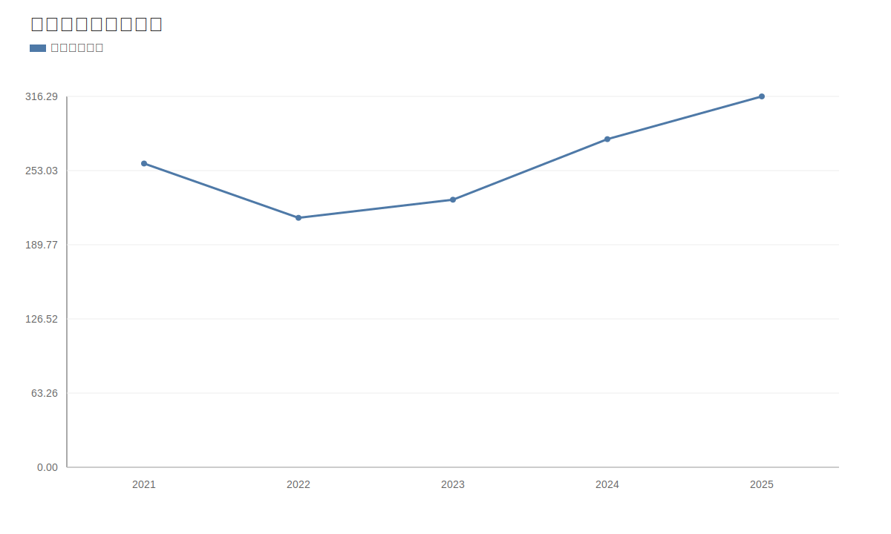

### 2. 净利润趋势图
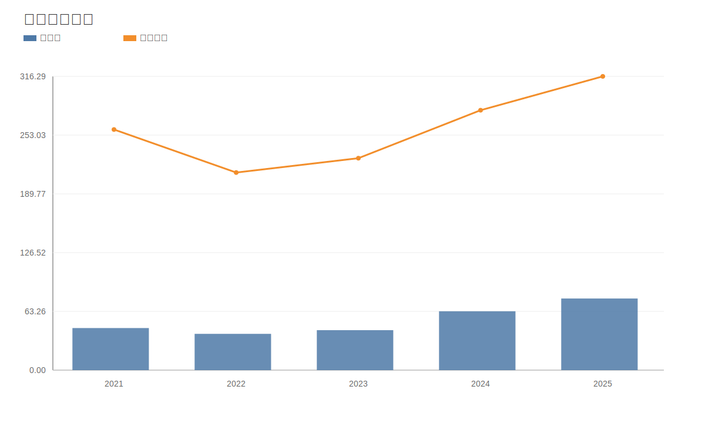

### 3. 毛利率和净利率对比图
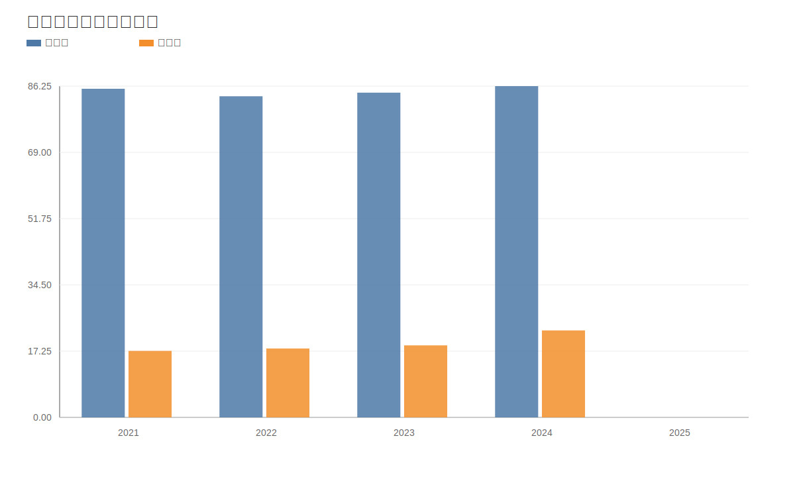

### 4. 分产品收入结构图
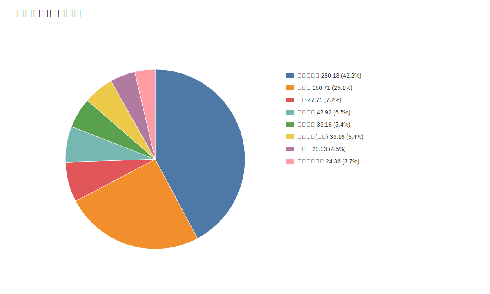

### 4. 分产品收入变化图
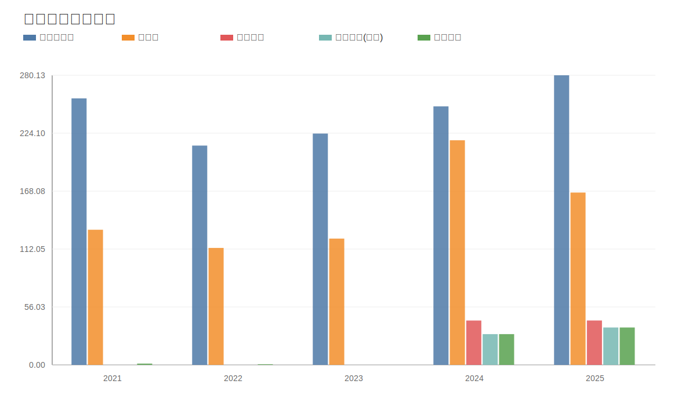

### 5. 分产品利润结构图
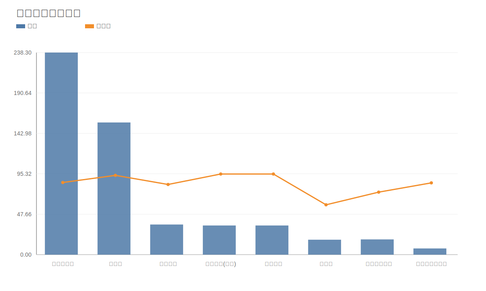

### 6. 分地区收入分布图
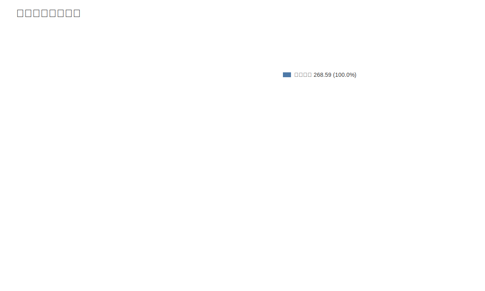

### 7. 资产负债表关键数据图
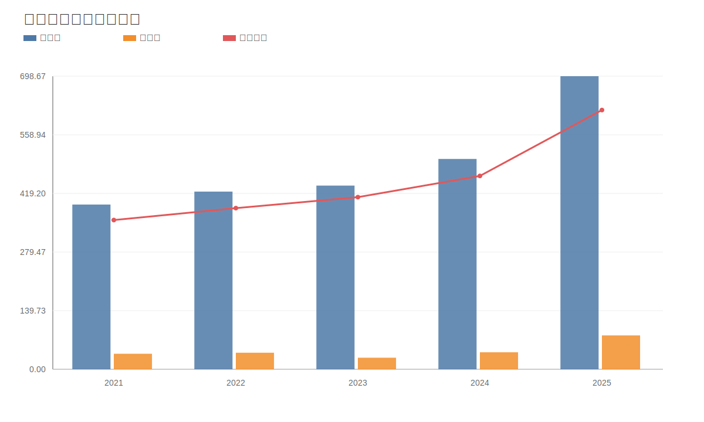

### 8. 自由现金流与经营现金流对比图
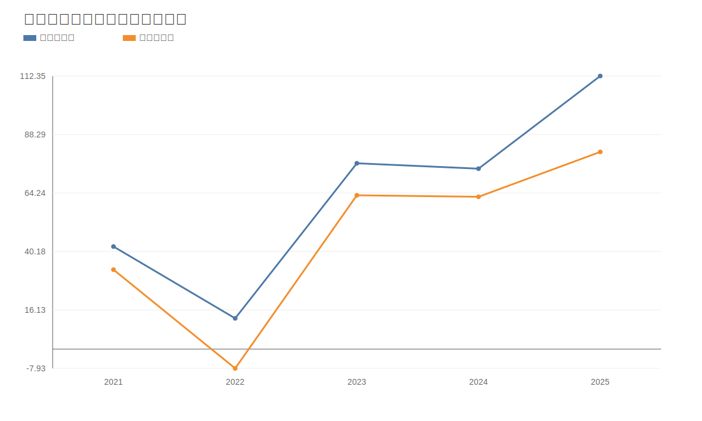

### 9. 股东回报分析图
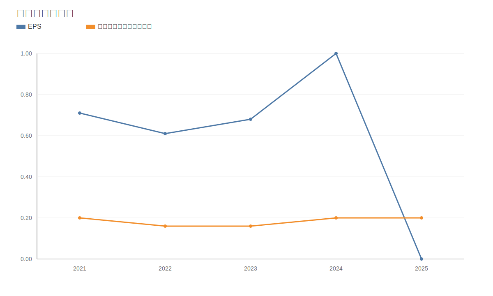

### 10. 财务比率分析图
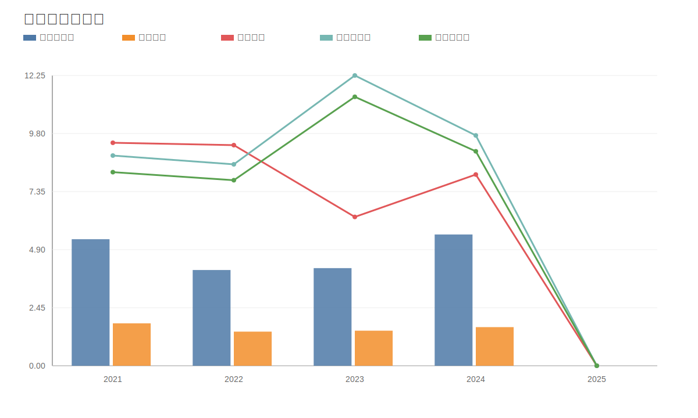

### 11. ROE与ROA对比图
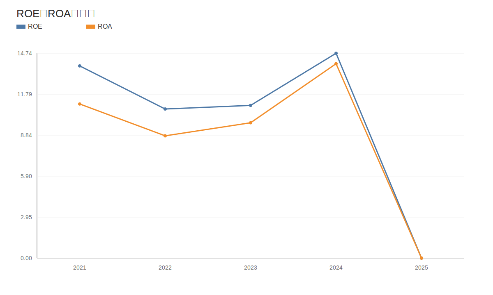
<!-- VALUE_CHARTS_END -->

## 参考来源
- [江苏恒瑞医药股份有限公司2025年年度报告](https://static.cninfo.com.cn/finalpage/2026-03-26/1225032585.PDF)
- [江苏恒瑞医药股份有限公司2026年第一季度报告](https://stockmc.xueqiu.com/202604/600276_20260423_22NN.pdf)
- [关于与百时美施贵宝公司签署战略合作及许可协议的公告](https://static.cninfo.com.cn/finalpage/2026-05-12/1225300018.PDF)
