# 安琪酵母（600298）深度价值研究报告

- 报告日期：2026年4月19日
- 数据截止：
  - 财务：2025年12月31日（年报口径）
  - 估值：2026年4月17日（最新交易日）
- 本地库主口径：`income/balancesheet/cashflow/fina_indicator/daily_basic/dividend/fina_audit/stock_company`
- 外部增量验证：公司官网定期报告、定期报告 PDF、公开交易所披露页面

## 1. 公司概况（商业模式优先）
安琪酵母的核心业务是酵母及深加工产品，同时向营养健康、生物农业、生物技术延伸。客户覆盖 ToB 工业客户与部分 ToC 场景，收入具备复购属性。商业模式本质是“技术配方 + 规模制造 + 渠道国际化”的复合体系。

结论：公司属于可理解且具产业壁垒的食品配料型企业。
事实：2025 年营业收入 167.29 亿元，同比增长 10.08%；主业仍以酵母及深加工产品为核心。
推断：未来成长不会是纯高弹性模式，更偏“稳态成长+结构升级”。

## 2. 行业与竞争格局
行业维度上，公司位于食品工业配料和发酵技术链条，竞争来自调味、乳品、速冻食品等食品龙头在上下游的协同能力。安琪在酵母细分拥有领先地位，但在资本市场定价上仍受食品行业整体增速中枢影响。

结论：赛道中长期稳定，竞争重点是效率与国际化而非单纯产能。
事实：2026-04-17 可比样本中，公司市值约 345 亿元，估值位于食品龙头中枢区。
推断：公司未来 3-5 年的估值重估依赖“盈利确定性提升”而不是行业普涨。

## 3. 护城河分析（含真伪辨别）
护城河构成：
1. 发酵工艺与菌种技术积累。
2. 规模制造与供应链效率。
3. 品牌与渠道网络（国内+海外）。
4. 下游多场景应用（烘焙、调味、营养等）。

真伪辨别：
- 提价 5% 是否流失：工业端会有一定压力，但高品质应用场景粘性较强。
- 客户价格敏感度：中等偏高，受原料替代与竞品策略影响。
- 非它不可场景：在部分专业发酵与配方环节存在替代门槛。
- 替代品难度：中等，长期可替代但短期切换成本不低。
- 更换供应商成本：对大客户中等，对小客户偏低。

结论：护城河强度为“中偏强”。
事实：公司保持稳定盈利和较高现金流覆盖，说明护城河并非伪命题。
推断：护城河的持续性依赖研发与海外本地化执行，不是一次性优势。

## 4. 管理层与资本配置
管理层稳定，审计意见长期为标准无保留。资本配置表现为“稳健分红 + 持续研发 + 产能投入”。但从结果看，公司仍处净负债状态，说明资本开支阶段对现金流形成挤压。

结论：管理层总体偏“价值创造者（中等偏上）”。
事实：2022-2025 年分红持续（每股税前约 0.50-0.55 元），研发费用连续增长。
推断：若后续资本开支边际放缓并改善净负债，管理层资本配置评分将上行。

## 5. 财务分析（成长/盈利/健康/现金流）
### 5.1 成长性
2021-2025 年营收 CAGR 约 11.88%，归母净利 CAGR 约 4.23%，增长稳健但利润弹性偏弱。

### 5.2 盈利能力
2025Q3 毛利率 25.54%、净利率 9.77%、ROE 9.97%、ROIC 6.54%。与食品强势龙头相比仍有差距。

### 5.3 财务健康
2025 年总资产 254.58 亿元，总负债 125.61 亿元，资产负债率约 48.85%；有息债务约 66.42 亿元，货币资金约 28.12 亿元，净现金约 -38.31 亿元。

### 5.4 现金流质量
2025 年经营现金流 24.78 亿元，自由现金流 4.55 亿元，经营现金流/净利润约 1.60 倍，利润现金化较好，但自由现金流弹性有限。

结论：财务韧性尚可，关键短板是净负债与自由现金流偏低。
事实：利润与经营现金流同步改善。
推断：若资本开支强度下降，财务质量将进入再改善区间。

## 6. 成长驱动
成长来源可拆解为：
1. 海外市场份额提升。
2. 酵母深加工与附加值产品占比提高。
3. 成本优化（原料、能耗、制造效率）。
4. 产业链延伸业务贡献。

结论：增长驱动可验证，但增速中枢偏中速。
事实：2025 年营收和净利均实现双位数增长。
推断：增长持续性强于高弹性，适合中长期跟踪而非短周期博弈。

## 7. 风险分析（含幸存者偏差）
主要风险：原材料成本波动、海外经营与汇率风险、负债结构压力、需求波动、估值压缩。

幸存者偏差检验：公司在近几年行业波动中仍保持盈利和分红，体现抗波动能力；但历史自由现金流并不稳定，说明“活下来”与“高回报”不是同一件事。

结论：抗风险能力中等偏强。
事实：公司连续盈利，审计意见稳定，无明显治理失范。
推断：未来最大风险是利润率波动而非生存风险。

## 8. 估值分析
当前估值（2026-04-17）：PE 22.34、PB 2.87、PS 2.06、股息率 1.38%。

历史分位（近一年）：PE/PB/PS 均约 4.35%，处于低分位。

同业对比：
- 海天味业 PE 33.21
- 伊利股份 PE 20.05
- 安井食品 PE 22.75
- 中炬高新 PE 21.81
- 涪陵榨菜 PE 18.48
- 安琪酵母 PE 22.34

绝对估值：
- DCF 区间约 6.28-10.26 元
- 反向 DCF 隐含未来 5 年 FCFE 年化增速约 49.0%

结论：安全边际判断为“分歧型：相对低估、绝对偏贵”。
事实：公司估值处于历史低分位。
推断：若现金流修复不及预期，估值修复速度将受限。

## 9. 投资判断（多头/空头/跟踪指标）
### 多头逻辑
1. 细分行业龙头地位稳固，技术与规模基础扎实。
2. 2025 年利润与经营现金流同步修复。
3. 当前估值处于历史低分位，情绪层面有修复空间。
4. 分红持续，治理结构稳定。

### 空头逻辑
1. 自由现金流仍偏弱，DCF 支撑有限。
2. 净负债规模不低，债务结构约束财务弹性。
3. 成本与海外变量对利润率扰动较大。
4. 主营结构明细存在数据缺口，精细化验证受限。

### 核心跟踪指标（季度）
1. 经营现金流/净利润比值（是否持续 >1）。
2. 有息债务净额变化。
3. 存货周转天数与应收周转天数。
4. 海外收入增速与毛利率。
5. 分红率与资本开支节奏。

结论：更适合“分批跟踪型配置”，不适合纯估值驱动激进买入。
事实：基本面稳、估值低分位。
推断：股价弹性取决于现金流与负债结构改善。

## 10. 最终结论
安琪酵母是一家有长期经营价值的食品配料龙头，业务稳健、治理合规、盈利修复在路上。当前价格具有一定相对估值吸引力，但绝对估值对现金流恢复提出较高要求。

- 这是否是一家好公司：是
- 是否具备长期投资价值：是
- 当前价格是否值得买入：可分批跟踪
- 投资建议：观察（偏积极）

结论：投资建议为“观察（偏积极）”。
事实：经营数据改善与估值低分位并存。
推断：确认现金流与负债改善后，性价比会更清晰。

## 11. 总评分（100分）
- 商业模式（20%）：16/20
- 护城河（20%）：15/20
- 管理层与资本配置（15%）：12/15
- 财务质量（20%）：14/20
- 风险控制（15%）：11/15
- 估值性价比（10%）：7/10

**最终总分：75/100**

结论：75 分对应“中上质量、可跟踪配置”。
事实：优势在稳健经营与行业地位，短板在自由现金流与净负债。
推断：若现金流改善持续，评分可上修到 80+。

## 12. 三个终极问题（必须回答）
1. 如果提价 5%，客户会不会流失？
会有一定流失，特别是在价格敏感工业客户，但关键应用场景流失可控。

2. 公司赚的钱有没有被管理层浪费？
当前证据不支持系统性浪费，分红和研发投入都较稳定，但资本开支效率仍需验证。

3. 在行业最差年份，公司是怎么活下来的？
靠酵母主业刚需属性、渠道与产品结构调整、现金流管理与审慎财务策略保持盈利连续性。

结论：三问结果偏正面，核心矛盾在回报率而非生存能力。
事实：公司长期盈利、审计稳定、分红持续。
推断：长期价值成立，但需要更强现金流质量支撑估值中枢上行。

## 外部增量验证来源
- [安琪酵母投资者关系定期报告页](https://www.angelyeast.com/report.html)
- [安琪酵母 2025 年半年度报告（公司官网 PDF）](https://www.angelyeast.com/upload/files/2025/9/600298_%E5%AE%89%E7%90%AA%E9%85%B5%E6%AF%8D_2025-08-15_%E5%AE%89%E7%90%AA%E9%85%B5%E6%AF%8D%EF%BC%9A%E5%AE%89%E7%90%AA%E9%85%B5%E6%AF%8D%E8%82%A1%E4%BB%BD%E6%9C%89%E9%99%90%E5%85%AC%E5%8F%B82025%E5%B9%B4%E5%8D%8A%E5%B9%B4%E5%BA%A6%E6%8A%A5%E5%91%8A.pdf)
- [安琪酵母 2025 年第三季度报告（公司官网 PDF）](https://www.angelyeast.com/upload/files/2025/11/600298_%E5%AE%89%E7%90%AA%E9%85%B5%E6%AF%8D_2025-10-30_%E5%AE%89%E7%90%AA%E9%85%B5%E6%AF%8D%EF%BC%9A%E5%AE%89%E7%90%AA%E9%85%B5%E6%AF%8D%E8%82%A1%E4%BB%BD%E6%9C%89%E9%99%90%E5%85%AC%E5%8F%B82025%E5%B9%B4%E7%AC%AC%E4%B8%89%E5%AD%A3%E5%BA%A6%E6%8A%A5%E5%91%8A.pdf)
- [安琪酵母 2024 年年度报告（公司官网 PDF）](https://www.angelyeast.com/upload/files/2025/4/%E5%AE%89%E7%90%AA%E9%85%B5%E6%AF%8D2024%E5%B9%B4%E5%B9%B4%E5%BA%A6%E6%8A%A5%E5%91%8A2025.04.08.pdf)

<!-- VALUE_CHARTS_START -->
## 图表图片（自动生成）

### 1. 主营业务收入趋势图
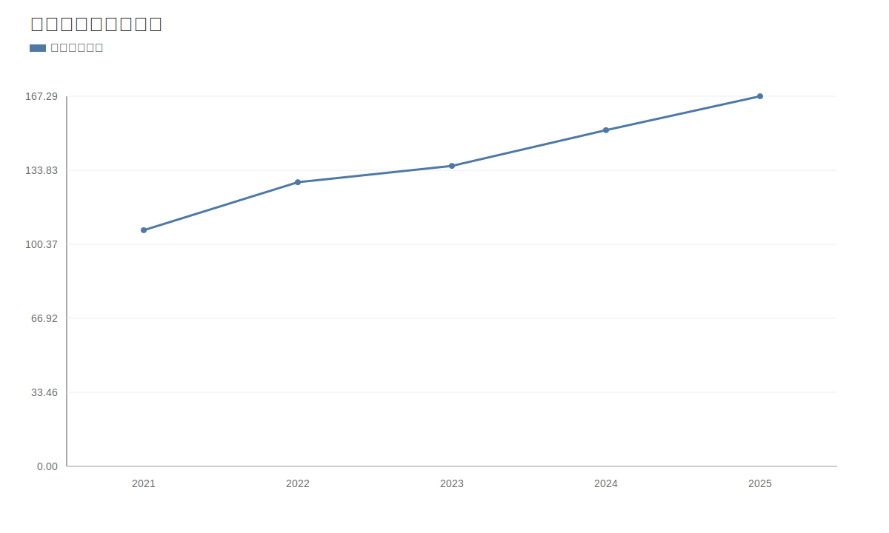

### 2. 净利润趋势图
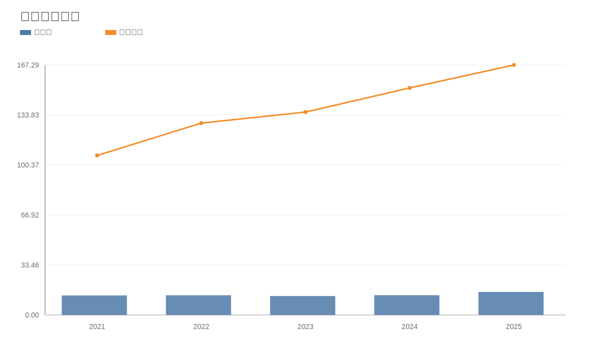

### 3. 毛利率和净利率对比图
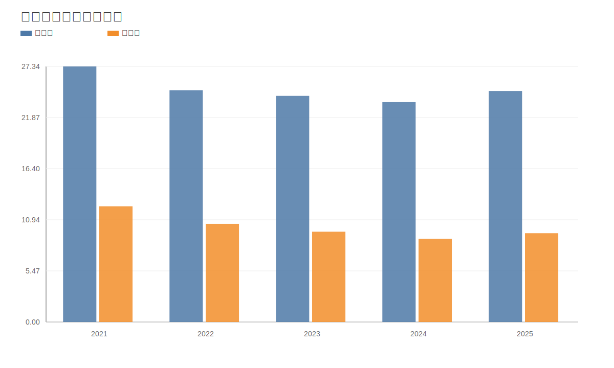

### 4. 分产品收入结构图
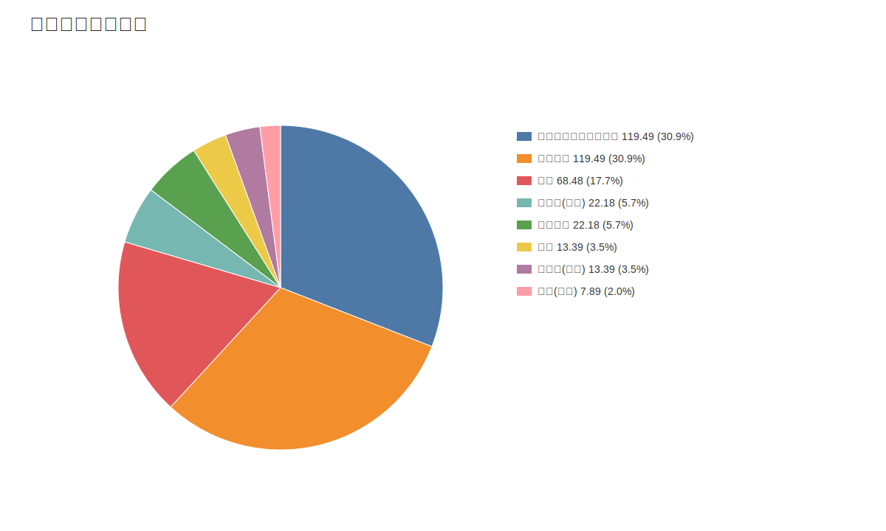

### 4. 分产品收入变化图
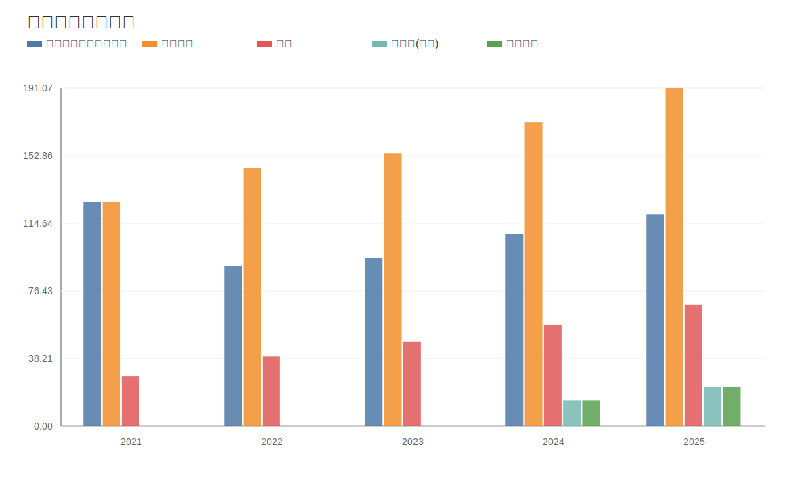

### 5. 分产品利润结构图
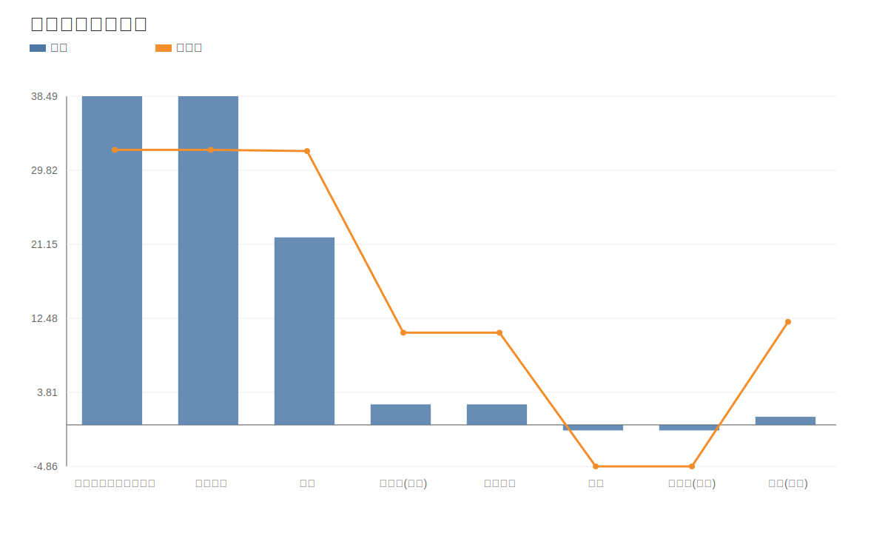

### 6. 分地区收入分布图
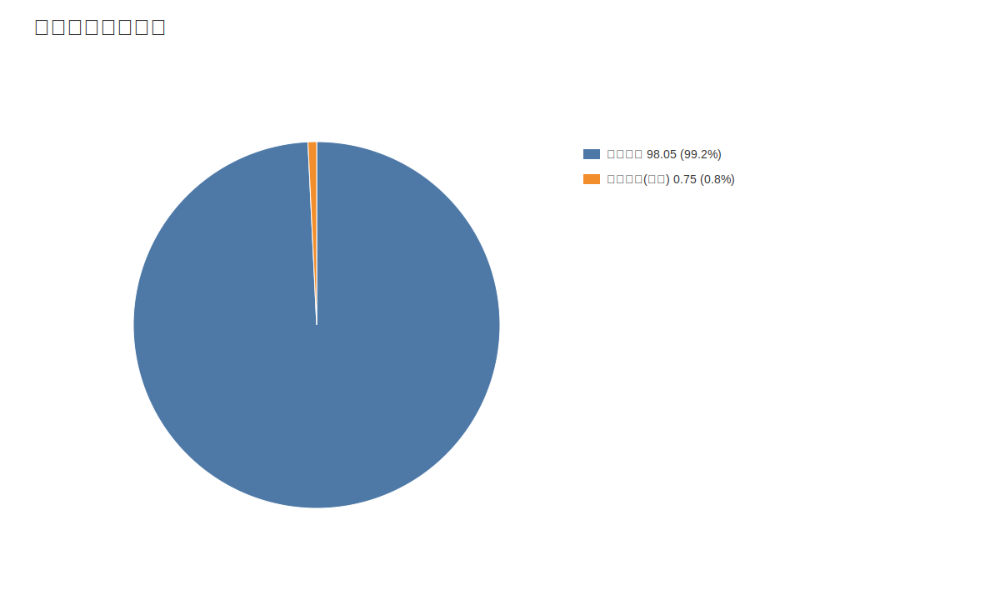

### 7. 资产负债表关键数据图
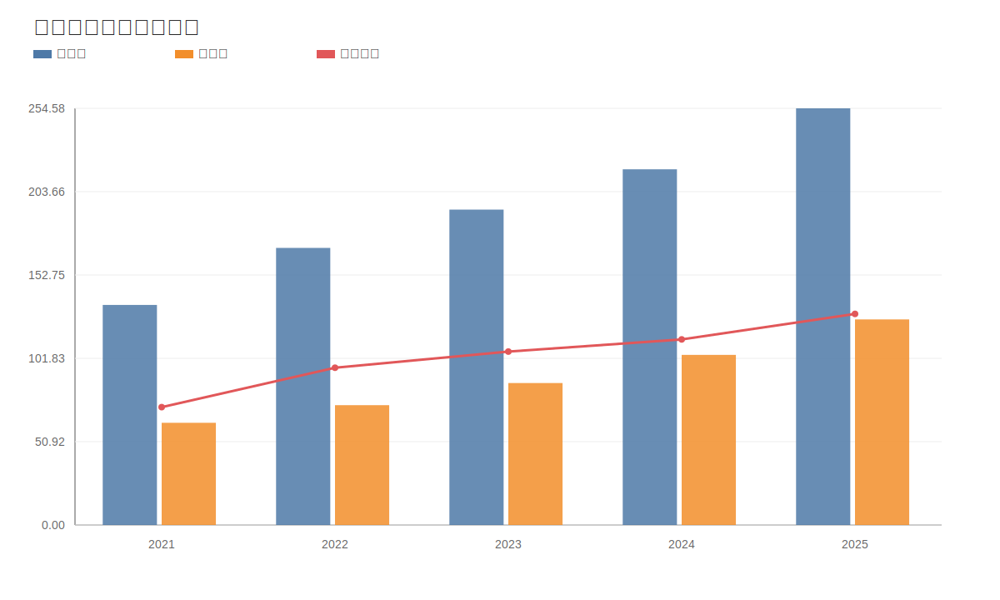

### 8. 自由现金流与经营现金流对比图
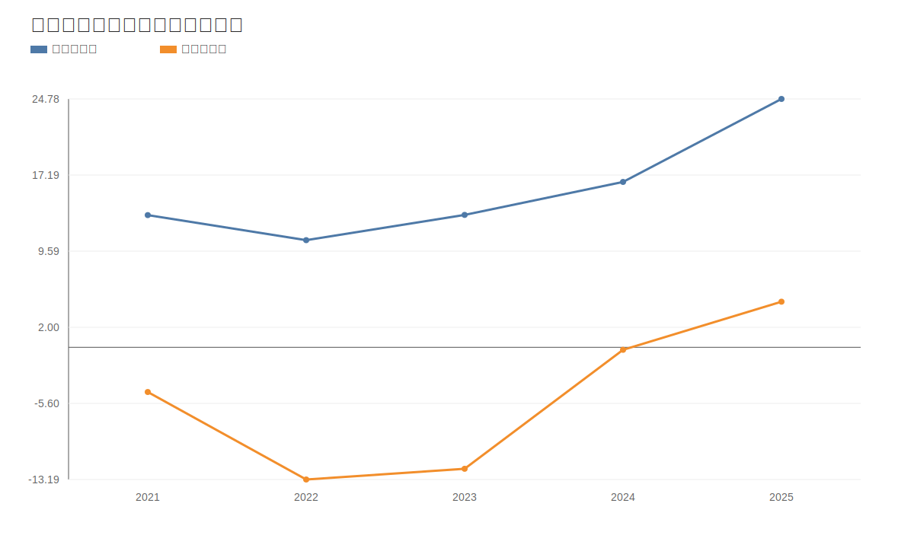

### 9. 股东回报分析图
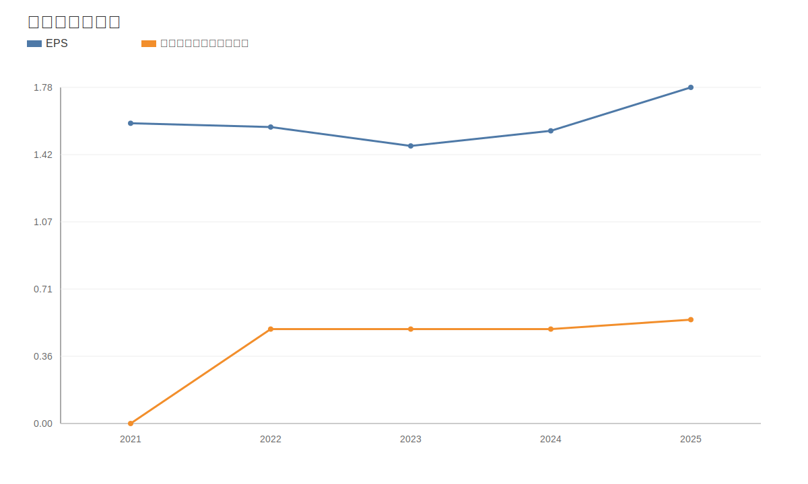

### 10. 财务比率分析图
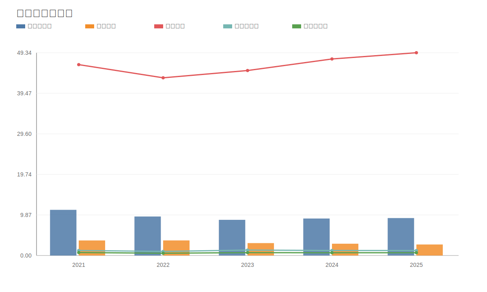

### 11. ROE与ROA对比图
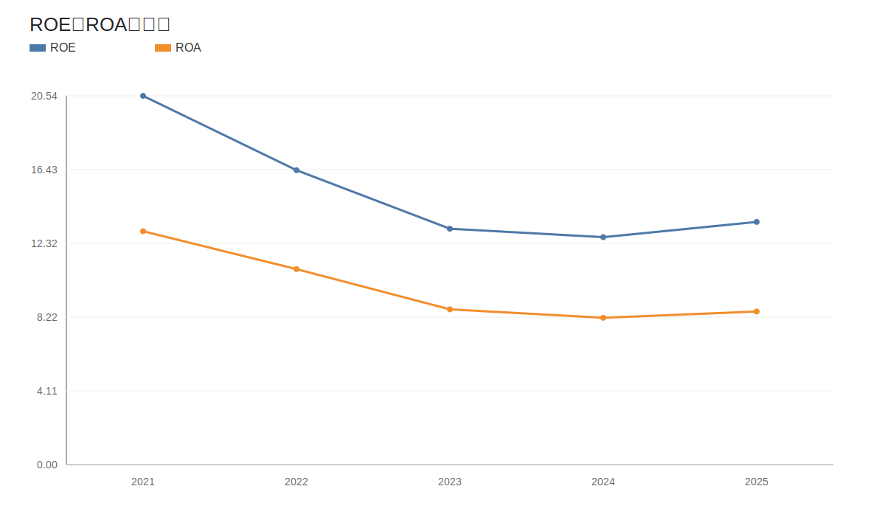
<!-- VALUE_CHARTS_END -->
