# 片仔癀（600436.SH）价值分析报告草稿

- 生成时间：2026-05-13 01:36:01
- 自动化脚本：`.agents/skills/value-report/value_report_scaffold.py`
- 数据口径：数据库字段定义以 `app/models/models.py` 为准
- 公司信息：行业 中成药｜地区 福建｜上市日期 20030616
- 管理层：董事长 林志辉｜总经理 黄进明｜员工 2839
- 主营业务：主要产品为片仔癀及其系列产品.
- 提示：本文件已自动填充定量部分，定性模块请结合最新公告与行业资料补充。

## 自动填充数据（可直接引用）
### 最新估值
- 交易日：20260511
- 收盘价：140.90 元
- PE(TTM)：44.69 倍
- PB：5.59 倍
- PS(TTM)：9.88 倍
- 股息率(TTM)：2.29%
- 总市值：850.07 亿元

### 最新财务快照
- 报告期：20260331
- 营收：27.41亿（同比 -12.74%）
- 归母净利润：7.43亿（同比 -25.64%）
- 经营现金流：12.90亿（同比 40.84%）
- 自由现金流：6.47亿
- 毛利率：38.93%，净利率：28.66%
- ROE：14.82%，ROIC：13.33%
- 资产负债率：13.95%，流动比率：5.00
- 经营现金流/利润：19.52%
- 货币资金：19.57亿，有息负债：8.94亿，净现金：10.63亿

### 近五年年报趋势
| 年度 | 营收 | 营收同比 | 归母净利 | 净利同比 | 毛利率 | 净利率 | ROE | ROIC | 资产负债率 | 经营现金流 | 自由现金流 | 现净比 |
| --- | --- | --- | --- | --- | --- | --- | --- | --- | --- | --- | --- | --- |
| 2025 | 90.01亿 | -16.56% | 21.59亿 | -27.49% | N/A | N/A | N/A | N/A | N/A | 0.77亿 | 18.99亿 | 3.57% |
| 2024 | 107.88亿 | 7.25% | 29.77亿 | 6.42% | 42.74% | 27.77% | 21.54% | 19.28% | 15.40% | 13.14亿 | 56.20亿 | 44.13% |
| 2023 | 100.58亿 | 15.69% | 27.97亿 | 13.15% | 46.76% | 28.35% | 22.64% | 20.31% | 18.50% | 22.07亿 | -6.44亿 | 78.88% |
| 2022 | 86.94亿 | 8.38% | 24.72亿 | 1.68% | 45.64% | 29.02% | 23.51% | 20.65% | 19.04% | 68.73亿 | -41.78亿 | 278.00% |
| 2021 | 80.22亿 | N/A | 24.31亿 | N/A | 50.72% | 30.72% | 27.68% | 23.85% | 18.88% | 4.62亿 | 22.80亿 | 19.01% |

- 近五年营收CAGR：2.92%
- 近五年净利CAGR：-2.93%

### 分红与审计
#### 已实施分红
2025年已实施现金分红（税前）合计：每股 3.220 元
2024年已实施现金分红（税前）合计：每股 3.470 元
2023年已实施现金分红（税前）合计：每股 1.250 元
2022年已实施现金分红（税前）合计：每股 1.210 元

#### 审计意见
- 20241231：标准无保留意见（致同会计师事务所）
- 20231231：标准无保留意见（华兴会计师事务所）
- 20221231：标准无保留意见（华兴会计师事务所）
- 20211231：标准无保留意见（华兴会计师事务所）
- 20201231：标准无保留意见（华兴会计师事务所）

## ECharts 图表数据（option）

- 说明：以下 `option` 可直接用于前端图表渲染；单位已在坐标轴标注。

### 1. 主营业务收入趋势图
```json
{
  "title": {
    "text": "主营业务收入趋势（近5年）"
  },
  "tooltip": {
    "trigger": "axis"
  },
  "legend": {
    "top": 24,
    "data": [
      "主营业务收入"
    ]
  },
  "xAxis": {
    "type": "category",
    "data": [
      "2021",
      "2022",
      "2023",
      "2024",
      "2025"
    ]
  },
  "yAxis": {
    "type": "value",
    "name": "亿元"
  },
  "series": [
    {
      "name": "主营业务收入",
      "type": "line",
      "smooth": true,
      "data": [
        80.22,
        86.94,
        100.58,
        107.88,
        90.01
      ]
    }
  ]
}
```

### 2. 净利润趋势图
```json
{
  "title": {
    "text": "净利润趋势（近5年）"
  },
  "tooltip": {
    "trigger": "axis"
  },
  "legend": {
    "top": 24,
    "data": [
      "净利润",
      "营业收入"
    ]
  },
  "xAxis": {
    "type": "category",
    "data": [
      "2021",
      "2022",
      "2023",
      "2024",
      "2025"
    ]
  },
  "yAxis": [
    {
      "type": "value",
      "name": "亿元"
    },
    {
      "type": "value",
      "name": "亿元"
    }
  ],
  "series": [
    {
      "name": "净利润",
      "type": "bar",
      "data": [
        24.31,
        24.72,
        27.97,
        29.77,
        21.59
      ]
    },
    {
      "name": "营业收入",
      "type": "line",
      "yAxisIndex": 1,
      "data": [
        80.22,
        86.94,
        100.58,
        107.88,
        90.01
      ]
    }
  ]
}
```

### 3. 毛利率和净利率对比图
```json
{
  "title": {
    "text": "毛利率 vs 净利率"
  },
  "tooltip": {
    "trigger": "axis"
  },
  "legend": {
    "top": 24,
    "data": [
      "毛利率",
      "净利率"
    ]
  },
  "xAxis": {
    "type": "category",
    "data": [
      "2021",
      "2022",
      "2023",
      "2024",
      "2025"
    ]
  },
  "yAxis": {
    "type": "value",
    "name": "%"
  },
  "series": [
    {
      "name": "毛利率",
      "type": "bar",
      "data": [
        50.72,
        45.64,
        46.76,
        42.74,
        null
      ]
    },
    {
      "name": "净利率",
      "type": "bar",
      "data": [
        30.72,
        29.02,
        28.35,
        27.77,
        null
      ]
    }
  ]
}
```

### 4. 分产品收入结构图
```json
{
  "title": {
    "text": "分产品收入结构（20251231）"
  },
  "tooltip": {
    "trigger": "item"
  },
  "legend": {
    "type": "scroll",
    "top": 24
  },
  "series": [
    {
      "type": "pie",
      "radius": "55%",
      "data": [
        {
          "name": "医药制造",
          "value": 44.41
        },
        {
          "name": "肝病用药",
          "value": 42.68
        },
        {
          "name": "医药商业",
          "value": 37.55
        },
        {
          "name": "医药流通业",
          "value": 37.55
        },
        {
          "name": "化妆品、护肤品",
          "value": 5.67
        },
        {
          "name": "日用品、化妆品销售",
          "value": 5.67
        },
        {
          "name": "国外",
          "value": 4.15
        },
        {
          "name": "其他(行业)",
          "value": 2.06
        }
      ]
    }
  ]
}
```

### 4. 分产品收入变化图
```json
{
  "title": {
    "text": "分产品收入变化（近5年）"
  },
  "tooltip": {
    "trigger": "axis"
  },
  "legend": {
    "type": "scroll",
    "top": 24,
    "data": [
      "医药制造",
      "肝病用药",
      "医药商业",
      "医药流通业",
      "化妆品、护肤品"
    ]
  },
  "xAxis": {
    "type": "category",
    "data": [
      "2021",
      "2022",
      "2023",
      "2024",
      "2025"
    ]
  },
  "yAxis": {
    "type": "value",
    "name": "亿元"
  },
  "series": [
    {
      "name": "医药制造",
      "type": "bar",
      "stack": "total",
      "data": [
        90.05,
        59.27,
        72.8,
        85.57,
        74.27
      ]
    },
    {
      "name": "肝病用药",
      "type": "bar",
      "stack": "total",
      "data": [
        84.02,
        55.61,
        67.14,
        79.5,
        71.64
      ]
    },
    {
      "name": "医药商业",
      "type": "bar",
      "stack": "total",
      "data": [
        70.03,
        59.32,
        63.15,
        63.52,
        57.33
      ]
    },
    {
      "name": "医药流通业",
      "type": "bar",
      "stack": "total",
      "data": [
        70.03,
        59.32,
        63.15,
        63.52,
        57.33
      ]
    },
    {
      "name": "化妆品、护肤品",
      "type": "bar",
      "stack": "total",
      "data": [
        18.32,
        9.84,
        9.8,
        11.38,
        8.87
      ]
    }
  ]
}
```

### 5. 分产品利润结构图
```json
{
  "title": {
    "text": "分产品利润结构（20251231）"
  },
  "tooltip": {
    "trigger": "axis"
  },
  "legend": {
    "top": 24,
    "data": [
      "利润",
      "毛利率"
    ]
  },
  "xAxis": {
    "type": "category",
    "data": [
      "医药制造",
      "肝病用药",
      "医药商业",
      "医药流通业",
      "化妆品、护肤品",
      "日用品、化妆品销售",
      "国外",
      "其他(行业)"
    ]
  },
  "yAxis": [
    {
      "type": "value",
      "name": "亿元"
    },
    {
      "type": "value",
      "name": "%"
    }
  ],
  "series": [
    {
      "name": "利润",
      "type": "bar",
      "data": [
        26.34,
        26.16,
        2.86,
        2.86,
        3.26,
        3.26,
        2.86,
        0.27
      ]
    },
    {
      "name": "毛利率",
      "type": "line",
      "yAxisIndex": 1,
      "data": [
        59.29,
        61.29,
        7.62,
        7.62,
        57.54,
        57.54,
        68.99,
        13.01
      ]
    }
  ]
}
```

### 6. 分地区收入分布图
```json
{
  "title": {
    "text": "分地区收入分布（20251231）"
  },
  "tooltip": {
    "trigger": "item"
  },
  "legend": {
    "type": "scroll",
    "top": 24
  },
  "series": [
    {
      "type": "pie",
      "radius": "55%",
      "data": [
        {
          "name": "华东",
          "value": 60.85
        },
        {
          "name": "华南",
          "value": 11.32
        },
        {
          "name": "华北",
          "value": 4.57
        },
        {
          "name": "华中",
          "value": 4.19
        },
        {
          "name": "西南",
          "value": 2.31
        },
        {
          "name": "西北",
          "value": 1.21
        },
        {
          "name": "东北",
          "value": 1.07
        },
        {
          "name": "其他业务(地区)",
          "value": 0.32
        }
      ]
    }
  ]
}
```

### 7. 资产负债表关键数据图
```json
{
  "title": {
    "text": "资产负债表关键数据（近5年）"
  },
  "tooltip": {
    "trigger": "axis"
  },
  "legend": {
    "top": 24,
    "data": [
      "总资产",
      "总负债",
      "股东权益"
    ]
  },
  "xAxis": {
    "type": "category",
    "data": [
      "2021",
      "2022",
      "2023",
      "2024",
      "2025"
    ]
  },
  "yAxis": {
    "type": "value",
    "name": "亿元"
  },
  "series": [
    {
      "name": "总资产",
      "type": "bar",
      "stack": "capital",
      "data": [
        124.95,
        146.04,
        170.8,
        175.4,
        175.6
      ]
    },
    {
      "name": "总负债",
      "type": "bar",
      "stack": "capital",
      "data": [
        23.59,
        27.8,
        31.6,
        27.01,
        24.72
      ]
    },
    {
      "name": "股东权益",
      "type": "line",
      "data": [
        101.37,
        118.24,
        139.2,
        148.39,
        150.88
      ]
    }
  ]
}
```

### 8. 自由现金流与经营现金流对比图
```json
{
  "title": {
    "text": "自由现金流 vs 经营现金流"
  },
  "tooltip": {
    "trigger": "axis"
  },
  "legend": {
    "top": 24,
    "data": [
      "经营现金流",
      "自由现金流"
    ]
  },
  "xAxis": {
    "type": "category",
    "data": [
      "2021",
      "2022",
      "2023",
      "2024",
      "2025"
    ]
  },
  "yAxis": {
    "type": "value",
    "name": "亿元"
  },
  "series": [
    {
      "name": "经营现金流",
      "type": "line",
      "data": [
        4.62,
        68.73,
        22.07,
        13.14,
        0.77
      ]
    },
    {
      "name": "自由现金流",
      "type": "line",
      "data": [
        22.8,
        -41.78,
        -6.44,
        56.2,
        18.99
      ]
    }
  ]
}
```

### 9. 股东回报分析图
```json
{
  "title": {
    "text": "股东回报（EPS/分红）"
  },
  "tooltip": {
    "trigger": "axis"
  },
  "legend": {
    "top": 24,
    "data": [
      "EPS",
      "每股现金分红（已实施）"
    ]
  },
  "xAxis": {
    "type": "category",
    "data": [
      "2021",
      "2022",
      "2023",
      "2024",
      "2025"
    ]
  },
  "yAxis": {
    "type": "value",
    "name": "元"
  },
  "series": [
    {
      "name": "EPS",
      "type": "line",
      "data": [
        4.03,
        4.1,
        4.64,
        4.93,
        null
      ]
    },
    {
      "name": "每股现金分红（已实施）",
      "type": "line",
      "data": [
        0.0,
        1.21,
        1.25,
        3.47,
        3.22
      ]
    }
  ]
}
```

### 10. 财务比率分析图
```json
{
  "title": {
    "text": "关键财务比率（近5年）"
  },
  "tooltip": {
    "trigger": "axis"
  },
  "legend": {
    "type": "scroll",
    "top": 24,
    "data": [
      "资产负债率",
      "流动比率",
      "速动比率",
      "应收周转率",
      "存货周转率"
    ]
  },
  "xAxis": {
    "type": "category",
    "data": [
      "2021",
      "2022",
      "2023",
      "2024",
      "2025"
    ]
  },
  "yAxis": [
    {
      "type": "value",
      "name": "比率/%"
    },
    {
      "type": "value",
      "name": "周转率"
    }
  ],
  "series": [
    {
      "name": "资产负债率",
      "type": "line",
      "data": [
        18.88,
        19.04,
        18.5,
        15.4,
        null
      ]
    },
    {
      "name": "流动比率",
      "type": "line",
      "data": [
        4.98,
        5.06,
        5.24,
        4.77,
        null
      ]
    },
    {
      "name": "速动比率",
      "type": "line",
      "data": [
        3.84,
        4.01,
        4.07,
        2.68,
        null
      ]
    },
    {
      "name": "应收周转率",
      "type": "bar",
      "yAxisIndex": 1,
      "data": [
        14.3,
        12.82,
        12.15,
        12.76,
        null
      ]
    },
    {
      "name": "存货周转率",
      "type": "bar",
      "yAxisIndex": 1,
      "data": [
        1.71,
        1.87,
        1.78,
        1.48,
        null
      ]
    }
  ]
}
```

### 11. ROE与ROA对比图
```json
{
  "title": {
    "text": "ROE vs ROA（近5年）"
  },
  "tooltip": {
    "trigger": "axis"
  },
  "legend": {
    "top": 24,
    "data": [
      "ROE",
      "ROA"
    ]
  },
  "xAxis": {
    "type": "category",
    "data": [
      "2021",
      "2022",
      "2023",
      "2024",
      "2025"
    ]
  },
  "yAxis": {
    "type": "value",
    "name": "%"
  },
  "series": [
    {
      "name": "ROE",
      "type": "line",
      "data": [
        27.68,
        23.51,
        22.64,
        21.54,
        null
      ]
    },
    {
      "name": "ROA",
      "type": "line",
      "data": [
        24.46,
        21.55,
        21.22,
        20.45,
        null
      ]
    }
  ]
}
```

## 1. 公司概况（商业模式优先）
- 公司是如何赚钱的？
- 收入来源构成（核心业务占比）
- 客户类型（To B / To C / 政府）
- 是否具备持续性收入（一次性 vs 订阅/复购）
- 是否依赖单一客户或区域

### 结论
- 商业模式是否简单、可理解
- 是否具备长期可持续性

## 2. 行业与竞争格局
- 行业空间（市场规模、天花板）
- 行业阶段（成长 / 成熟 / 衰退）
- 行业增速
- 主要竞争对手
- 市场份额与行业集中度
- 公司在产业链中的位置

### 结论
- 是否属于优质赛道
- 公司是否处于有利竞争位置
- 行业未来3-5年趋势

## 3. 护城河分析（含真伪辨别）
- 品牌优势
- 成本优势
- 网络效应
- 转换成本
- 技术壁垒
- 渠道优势

### 护城河真伪辨别
- 如果产品提价 5%，客户是否会流失？
- 客户是否对价格敏感？
- 是否存在“非它不可”的使用场景？
- 替代品是否容易出现？
- 客户更换供应商的成本高不高？

### 结论
- 护城河类型
- 护城河强度：强 / 中 / 弱 / 伪护城河
- 是否具备真实定价权

## 4. 管理层与资本配置（重点）
- 管理层背景与稳定性
- 是否存在诚信问题（造假 / 处罚 / 诉讼）
- 过往战略是否理性

### 资本配置历史
- 是否长期分红
- 是否进行回购注销（而非股权激励稀释）
- 并购历史（成功 / 失败 / 频繁）
- 是否存在盲目多元化扩张
- 资本开支是否合理

### 结论
- 管理层类型：价值创造者 / 中性 / 价值毁灭者
- 是否值得长期信任

## 5. 财务分析
### 5.1 成长性
- 营收增长率（近3-5年）
- 净利润增长率
- 增长是否稳定

### 结论
- 是否具备持续成长能力

### 5.2 盈利能力
- 毛利率
- 净利率
- ROE / ROIC

### 结论
- 是否具备定价权
- 盈利质量如何

### 5.3 财务健康
- 资产负债率
- 有息负债
- 现金储备
- 短期偿债能力

### 结论
- 是否存在财务风险

### 5.4 现金流质量
- 经营现金流
- 自由现金流
- 净利润与现金流是否匹配

### 结论
- 利润是否真实
- 是否具备造血能力

## 6. 成长驱动
- 未来3-5年增长来源
- 是否依赖提价 / 扩张 / 新业务
- 增长逻辑是否清晰

### 结论
- 成长是否可持续

## 7. 风险分析（含幸存者偏差）
- 政策风险
- 行业竞争风险
- 技术替代风险
- 财务风险
- 客户集中风险

### 幸存者偏差检验
- 行业历史最差时期是什么时候？
- 当时发生了什么（金融危机 / 疫情 / 监管）？
- 公司当时表现：是否大幅亏损 / 现金流断裂 / 接近破产？
- 公司在极端情况下是：变强 / 持平 / 衰退

### 结论
- 抗风险能力：强 / 中 / 弱
- 是否属于“穿越周期公司”

## 8. 估值分析
- PE / PB / PS / PEG / EV/EBITDA
- 当前估值 vs 历史估值
- 当前估值 vs 行业对比

### 结论
- 当前是否高估 / 低估 / 合理
- 是否具备安全边际

## 9. 投资判断
### 多头逻辑
1. 
2. 
3. 

### 空头逻辑
1. 
2. 
3. 

### 核心跟踪指标
1. 
2. 
3. 

## 最终结论
- 这是否是一家好公司？
- 是否具备长期投资价值？
- 当前价格是否值得买入？
- 投资建议：买入 / 观察 / 回避

## 总评分（100分）
- 商业模式：
- 护城河：
- 管理层：
- 财务：
- 风险：
- 估值：

**最终评分：__ / 100**

## 三个终极问题（必须回答）
1. 如果提价 5%，客户会不会流失？
2. 公司赚的钱有没有被管理层浪费？
3. 在行业最差年份，公司是怎么活下来的？

<!-- VALUE_CHARTS_START -->
## 图表图片（自动生成）

### 1. 主营业务收入趋势图
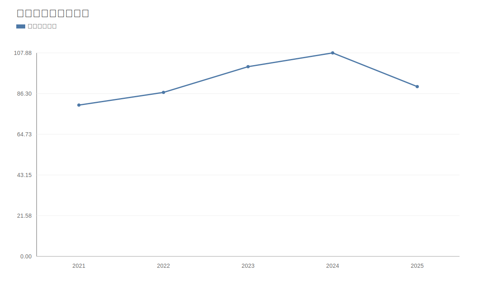

### 2. 净利润趋势图
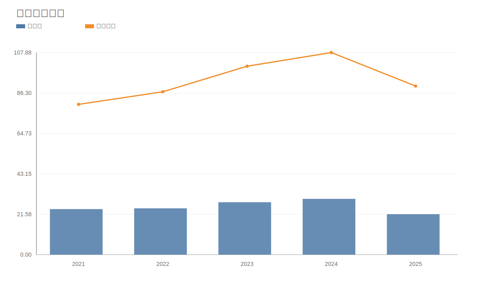

### 3. 毛利率和净利率对比图
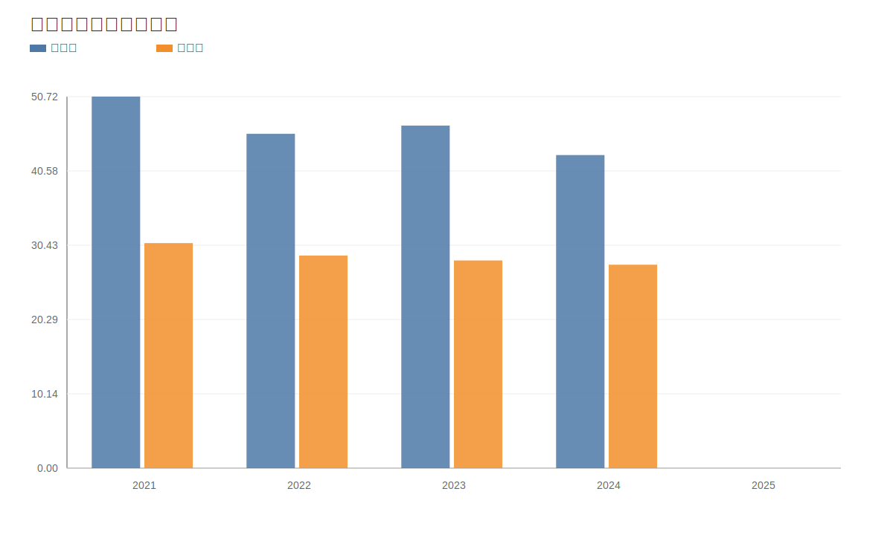

### 4. 分产品收入结构图
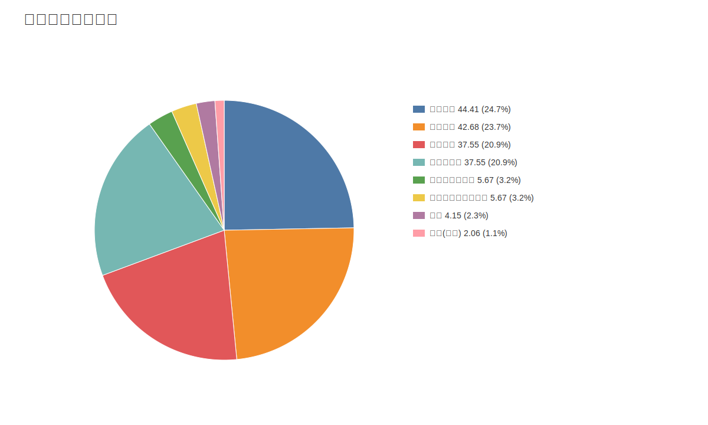

### 4. 分产品收入变化图
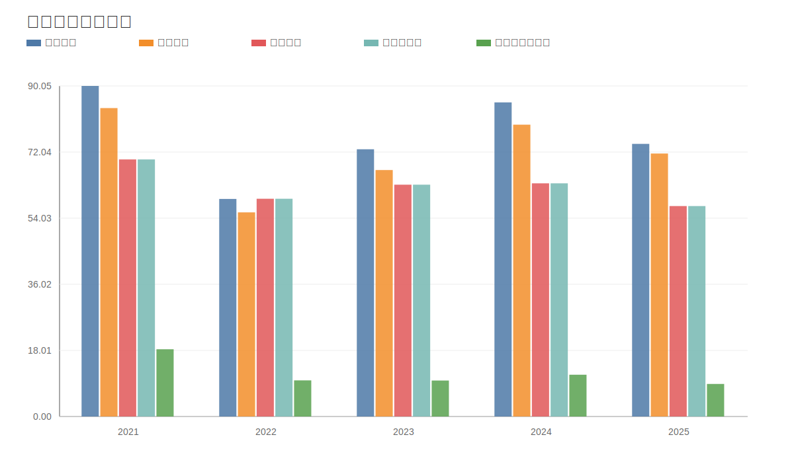

### 5. 分产品利润结构图
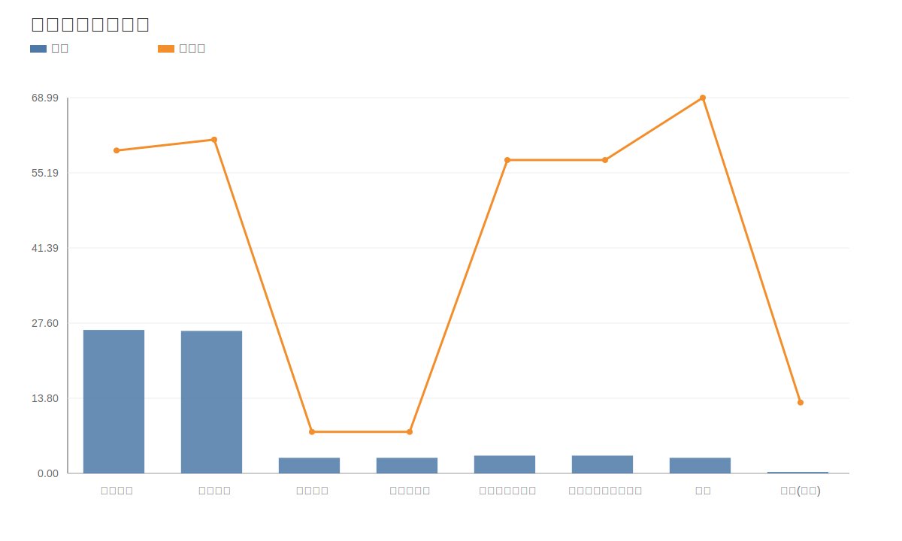

### 6. 分地区收入分布图
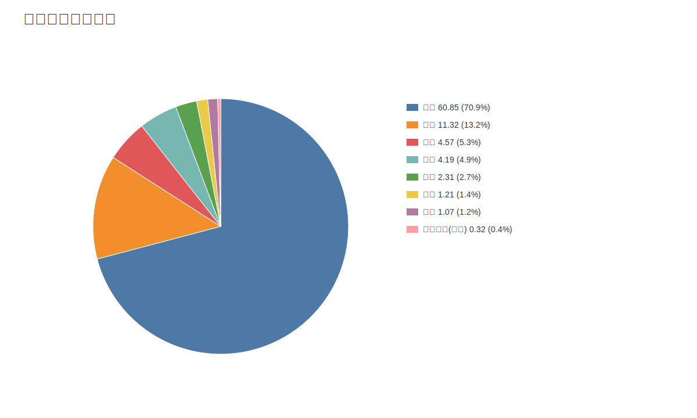

### 7. 资产负债表关键数据图
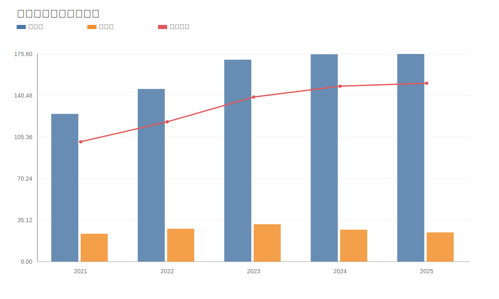

### 8. 自由现金流与经营现金流对比图
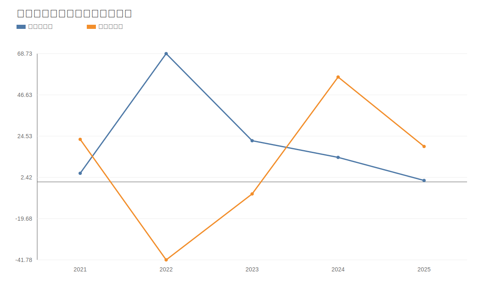

### 9. 股东回报分析图
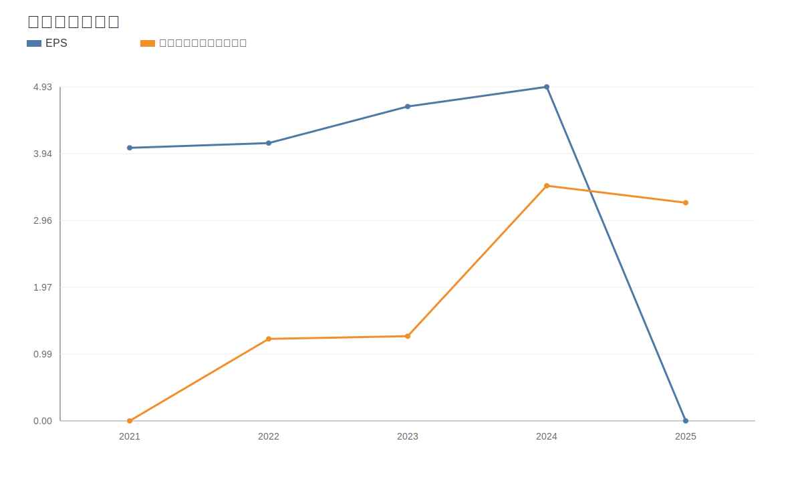

### 10. 财务比率分析图
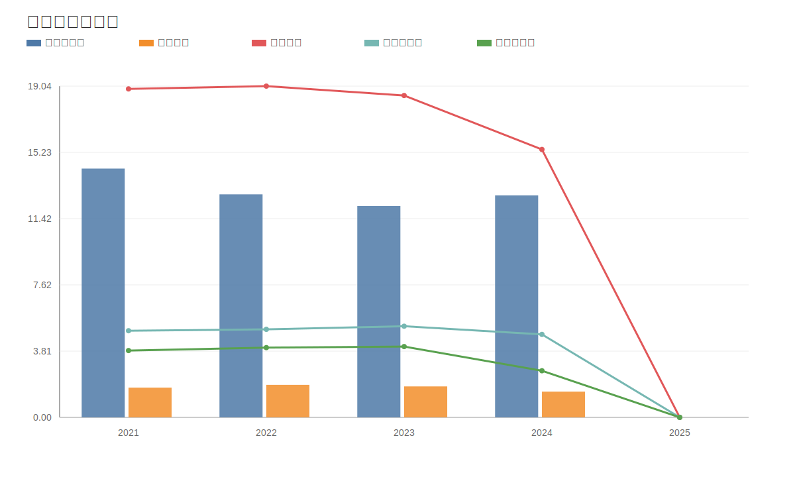

### 11. ROE与ROA对比图
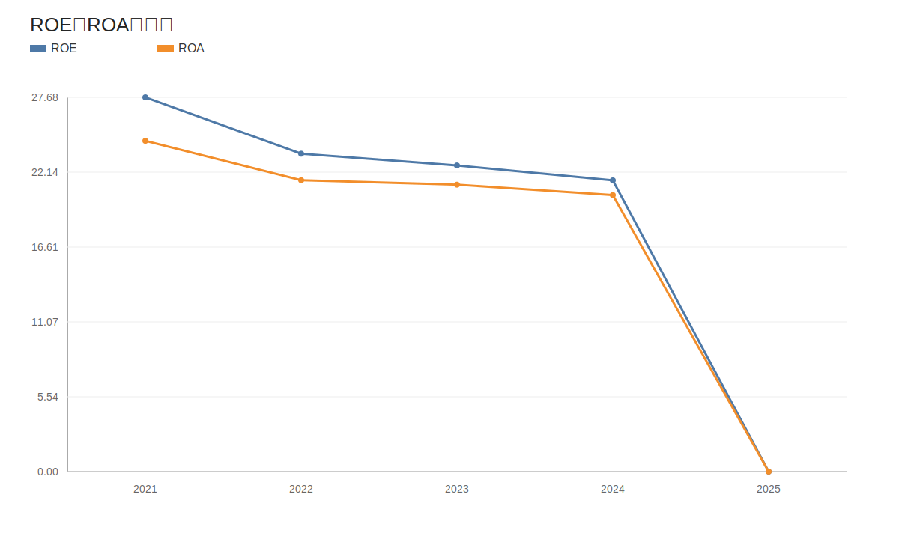
<!-- VALUE_CHARTS_END -->
