# 贵州茅台（600519）深度价值研究报告

- 报告日期：2026年4月22日
- 数据截止：
  - 财务：2024年12月31日（完整年报口径）+ 2025年9月30日（季度趋势口径）
  - 估值：2026年4月20日（最新交易日）
- 本地库主口径：`income/balancesheet/cashflow/fina_indicator/daily_basic/dividend/fina_audit/stock_company`
- 外部增量验证：上交所年报、半年报、三季报

## 1. 公司概况（商业模式优先）
贵州茅台通过高端品牌白酒（茅台酒+系列酒）实现高毛利、高现金回流与高分红。客户实质以消费终端为基础，通过经销与直营渠道触达，收入具备较强复购属性与场景粘性。

结论：公司商业模式极强、可理解且具备长期持续性。
事实：2024 年营收 1741.44 亿元、归母净利 862.28 亿元，毛利率 91.93%。
推断：品牌稀缺性与渠道治理能力共同构成其长期利润护城河。

## 2. 行业与竞争格局
白酒行业进入“总量放缓、结构升级、龙头集中”阶段。贵州茅台在高端白酒中具备绝对品牌优势，主要竞争对手为五粮液、山西汾酒、泸州老窖等。

结论：行业整体趋稳，茅台在产业链议价能力最强。
事实：2026-04-20 可比 PE：茅台 21.46、五粮液 13.84、汾酒 13.78、泸州老窖 11.72。
推断：公司享受确定性溢价，但也意味着估值对预期变化更敏感。

## 3. 护城河分析（含真伪辨别）
护城河构成：
1. 品牌与文化符号壁垒。
2. 渠道与配额管理能力。
3. 高端消费场景稳定性。
4. 长期高现金流带来的资本配置弹性。

真伪辨别：
- 提价 5% 是否流失：核心消费群体流失有限，边际需求会有阶段性扰动。
- 客户价格敏感性：整体偏低于大众消费品，但受宏观周期影响。
- 非它不可场景：礼赠与高端商务场景存在较强“非它不可”。
- 替代品难度：高端品牌替代难度高。
- 换供应商成本：渠道端与消费心智端转换成本较高。

结论：护城河强度为“强”。
事实：2020-2024 年毛利率长期稳定在 91% 以上。
推断：短期波动更多来自需求节奏，而非护城河本身松动。

## 4. 管理层与资本配置
管理层延续稳健经营路线，审计持续无保留。资本配置以分红回报为主，兼顾渠道与品牌投入，未见激进多元化扩张。

结论：管理层可归类为“价值创造者（中高置信）”。
事实：2023-2025 年已实施现金分红分别约每股 45.017/54.758/51.630 元。
推断：公司更强调长期稳态回报，而非短期高杠杆扩张。

## 5. 财务分析（成长/盈利/健康/现金流）
### 5.1 成长性
2020-2024 年营收 CAGR 15.46%，净利 CAGR 16.57%，处于高基数下的高质量增长。

### 5.2 盈利能力
2025Q3 毛利率 91.29%，净利率 52.08%，ROE 26.37%，ROIC 24.33%，盈利质量仍在高位。

### 5.3 财务健康
2025Q3 资产负债率 12.81%，流动比率 6.62；2024 年末货币资金约 592.96 亿元，有息负债接近 0。

### 5.4 现金流质量
2024 年经营现金流 924.64 亿元，自由现金流 458.42 亿元；2025Q3 经营现金流同比下滑，需继续跟踪回款节奏。

结论：财务稳健性极强，现金流阶段扰动不改长期质量。
事实：净现金充裕、杠杆极低、现金创造能力持续领先。
推断：公司抗周期能力强，主要矛盾不在财务安全而在估值匹配。

## 6. 成长驱动
未来 3-5 年增长来源：
1. 价格与产品结构优化。
2. 直营与渠道效率提升。
3. 系列酒放量与品牌梯度完善。
4. 海外与新消费场景渗透。

结论：成长驱动仍在，但增速中枢趋于稳态化。
事实：2025Q3 营收/净利同比均约 6%。
推断：高增向稳增切换是大概率路径，估值需相应重定价。

## 7. 风险分析（含幸存者偏差）
主要风险：
- 宏观消费与需求波动。
- 批价与渠道库存波动。
- 监管政策边际变化。
- 高估值带来的回撤风险。

幸存者偏差检验：
- 行业低谷阶段中，茅台依托品牌力和现金流优势保持盈利能力，未出现生存性风险。
- 在极端周期下，表现通常为“增速波动”而非“盈利塌陷”。

结论：抗风险能力“强”，但估值风险高于经营风险。
事实：资产负债率低、现金充足、历史周期穿越能力强。
推断：投资回撤主要来自估值收缩而非基本面崩塌。

## 8. 估值分析
当前估值（2026-04-20）：PE 21.46、PB 7.22、PS 10.46、股息率 3.66%。

历史分位（近一年）：
- PE 分位约 97.87%
- PB 分位约 4.26%
- PS 分位约 87.23%

同业对比（2026-04-20）：
- 贵州茅台 PE 21.46
- 五粮液 PE 13.84
- 山西汾酒 PE 13.78
- 泸州老窖 PE 11.72
- 古井贡酒 PE 11.84

估值模型：
- 相对估值（PE 分位）约 1270.13-1347.29 元
- DCF 约 580.09-811.62 元
- 反向 DCF 隐含未来 5 年 FCFE 年化增速约 25.18%

结论：当前估值偏贵，安全边际有限。
事实：PE/PS 处于近一年高分位，且显著高于主要可比。
推断：后续回报更多依赖盈利兑现，而非估值继续扩张。

## 9. 投资判断（多头/空头/跟踪指标）
### 多头逻辑
1. 品牌护城河深，定价权强。
2. 财务结构极稳健，净现金充足。
3. 分红连续性高，股东回报确定性强。
4. 行业集中度提升利于龙头。

### 空头逻辑
1. 估值处于高位分位，安全边际偏薄。
2. 高基数下增速中枢下行。
3. 经营现金流阶段波动需持续验证。
4. 宏观消费波动可能压制估值。

### 核心跟踪指标（季度）
1. 单季营收/净利增速。
2. 批价与渠道库存变化。
3. 经营现金流/净利润匹配度。
4. 系列酒占比与结构升级进度。
5. 分红率与资本配置政策。

结论：适合“高质量资产的纪律化配置”，不适合高估值追涨。
事实：公司质量高但估值要求高。
推断：中长期收益率更依赖买入价格与仓位纪律。

## 10. 最终结论
贵州茅台仍是 A 股顶级商业模式代表，长期价值基础稳固。但在当前估值水平下，投资者需要下调对短中期超额收益的预期。

- 这是否是一家好公司：是
- 是否具备长期投资价值：是
- 当前价格是否值得买入：可跟踪分批
- 投资建议：观察（偏积极）

结论：建议“观察（偏积极）”。
事实：基本面强、现金流强、护城河强。
推断：只有在估值回归或增长再加速时，风险收益比才会明显改善。

## 11. 总评分（100分）
- 商业模式（20%）：19/20
- 护城河（20%）：19/20
- 管理层与资本配置（15%）：13/15
- 财务质量（20%）：19/20
- 风险控制（15%）：12/15
- 估值性价比（10%）：5/10

**最终总分：87/100**

结论：公司质量接近满分，估值项拖累综合性价比。
事实：经营与财务维度评分高，估值分位偏高。
推断：更适合长期资金做节奏化配置，而非短期交易型重仓。

## 12. 三个终极问题（必须回答）
1. 如果提价 5%，客户会不会流失？
核心消费与礼赠场景流失有限，边际需求会有扰动但通常可控。

2. 公司赚的钱有没有被管理层浪费？
当前证据不支持“系统性浪费”，公司持续高分红且资本开支总体可控。

3. 在行业最差年份，公司是怎么活下来的？
依靠品牌定价权、渠道掌控力和高现金储备，在需求波动期保持盈利与现金流韧性。

结论：三问结果整体偏正面，核心约束在估值而非公司质量。
事实：长期高盈利、高现金流、低杠杆特征持续存在。
推断：茅台是“好公司”，但未必在任何价格都是“好投资”。

## 外部增量验证来源
- [贵州茅台 2025 年年度报告（2026-04-17）](https://big5.sse.com.cn/site/cht/www.sse.com.cn/disclosure/listedinfo/announcement/c/new/2026-04-17/600519_20260417_9QS4.pdf)
- [贵州茅台 2025 年半年度报告（2025-08-13）](https://big5.sse.com.cn/site/cht/www.sse.com.cn/disclosure/listedinfo/announcement/c/new/2025-08-13/600519_20250813_TU6Y.pdf)
- [贵州茅台 2025 年第三季度报告（2025-10-30）](https://static.cninfo.com.cn/finalpage/2025-10-30/1224764517.PDF)

<!-- VALUE_CHARTS_START -->
## 图表图片（自动生成）

### 1. 主营业务收入趋势图
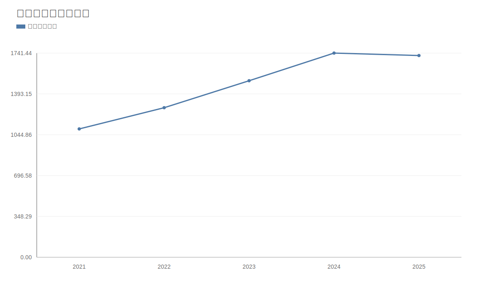

### 2. 净利润趋势图
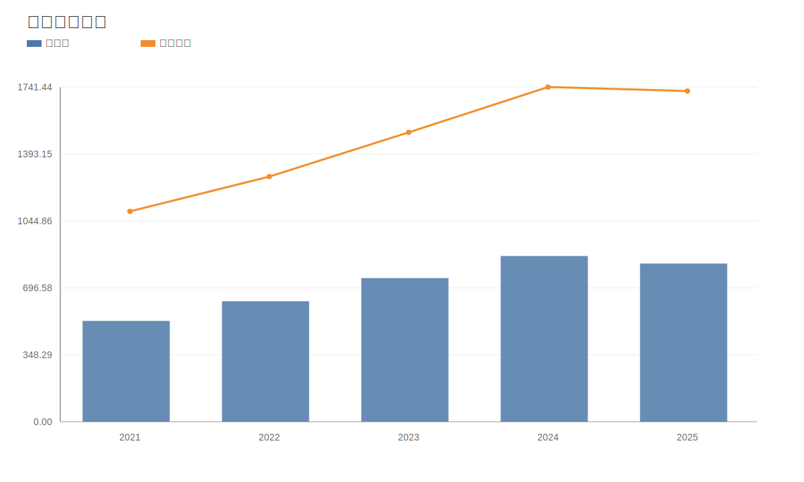

### 3. 毛利率和净利率对比图
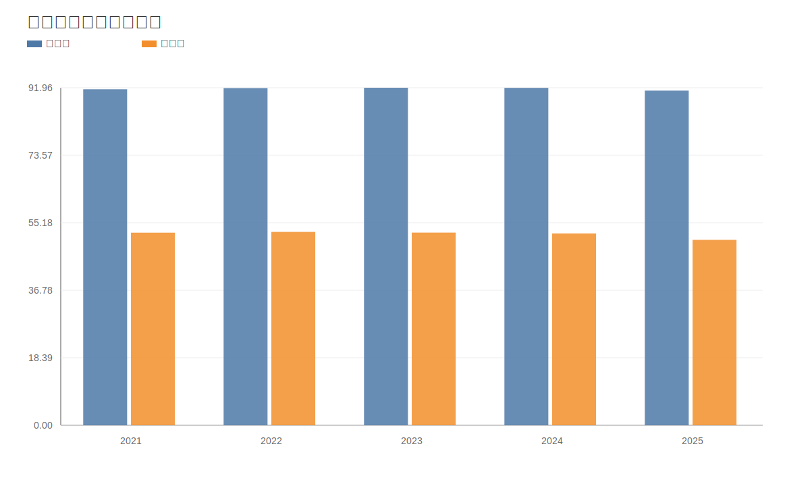

### 4. 分产品收入结构图
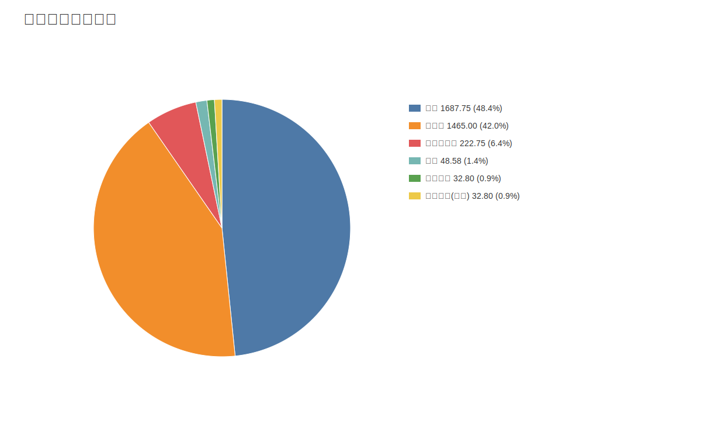

### 4. 分产品收入变化图
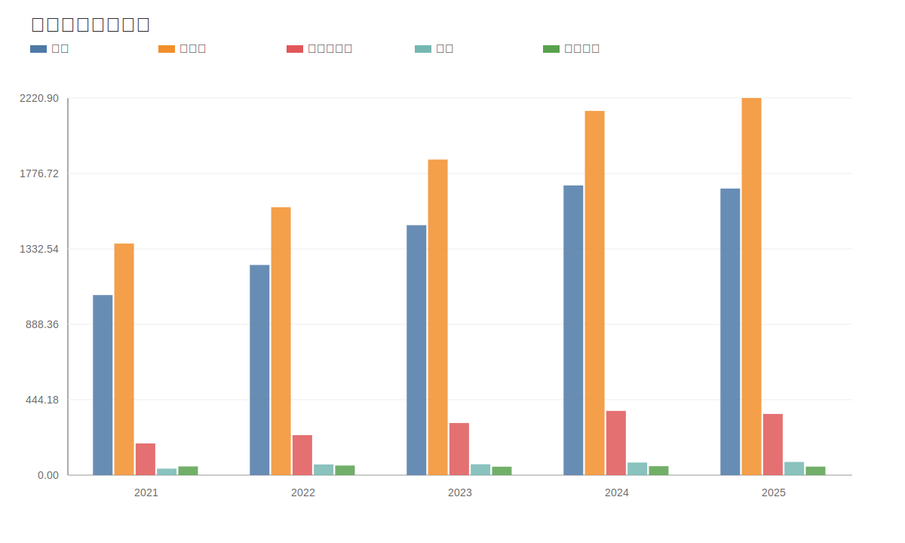

### 5. 分产品利润结构图
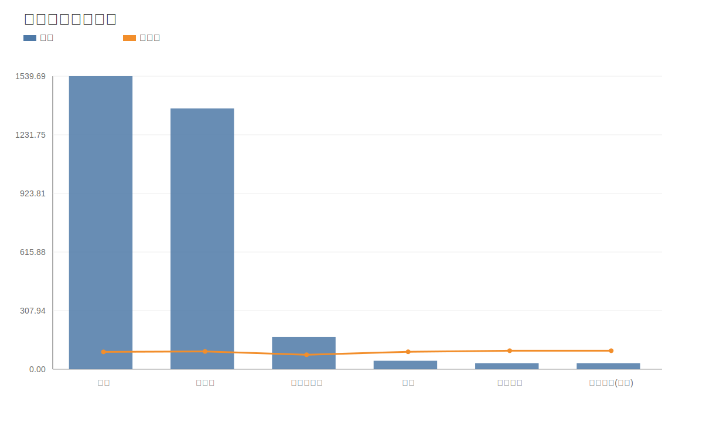

### 6. 分地区收入分布图
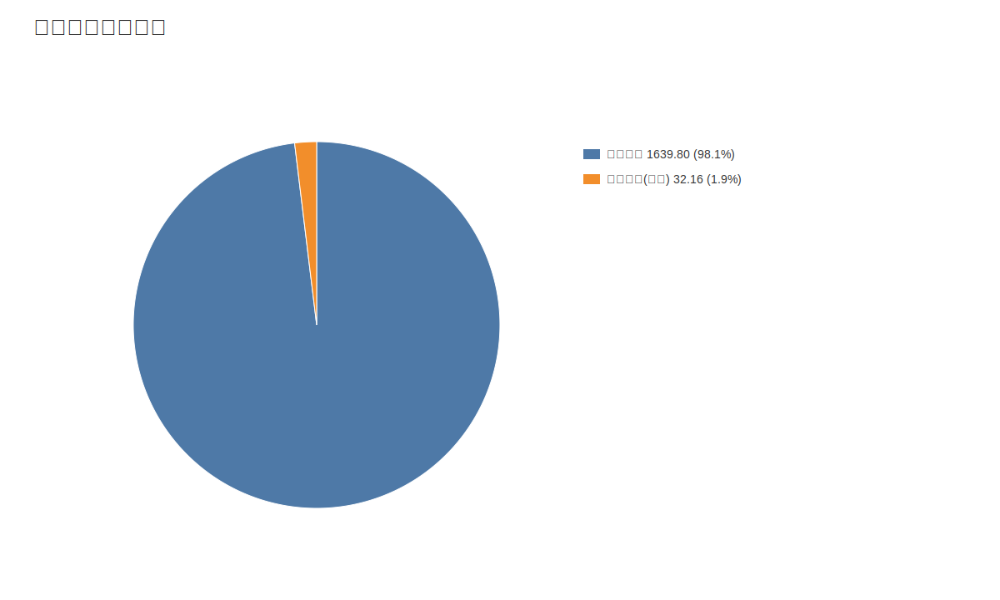

### 7. 资产负债表关键数据图
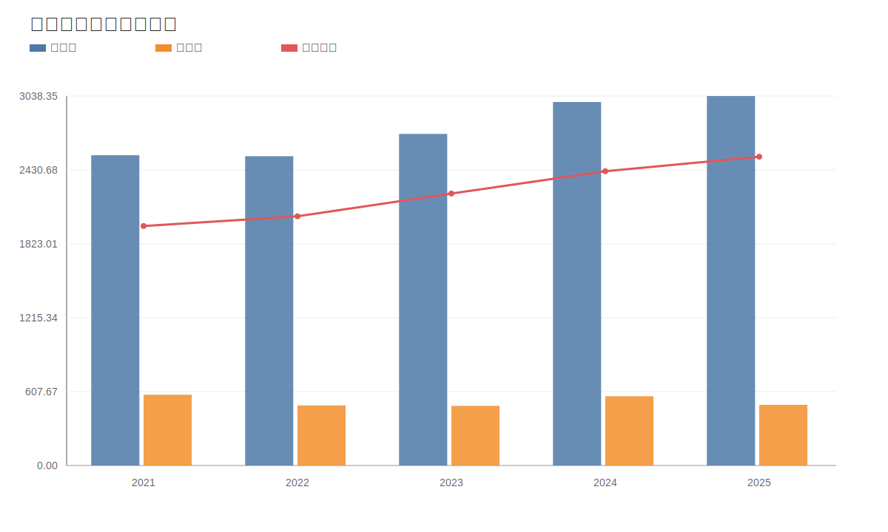

### 8. 自由现金流与经营现金流对比图
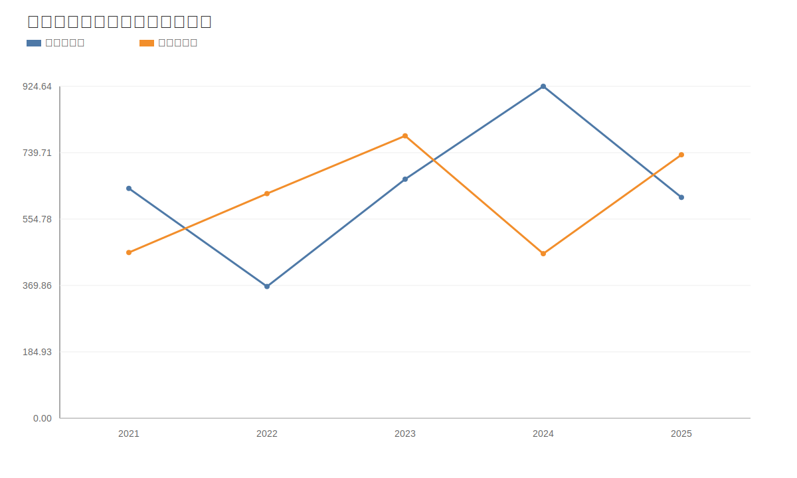

### 9. 股东回报分析图
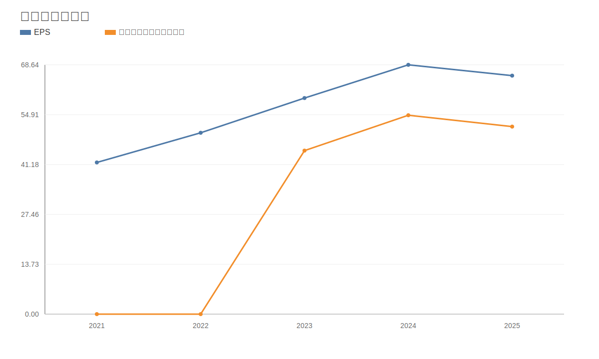

### 10. 财务比率分析图
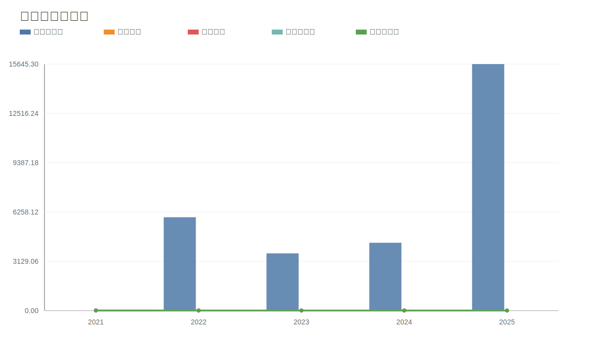

### 11. ROE与ROA对比图
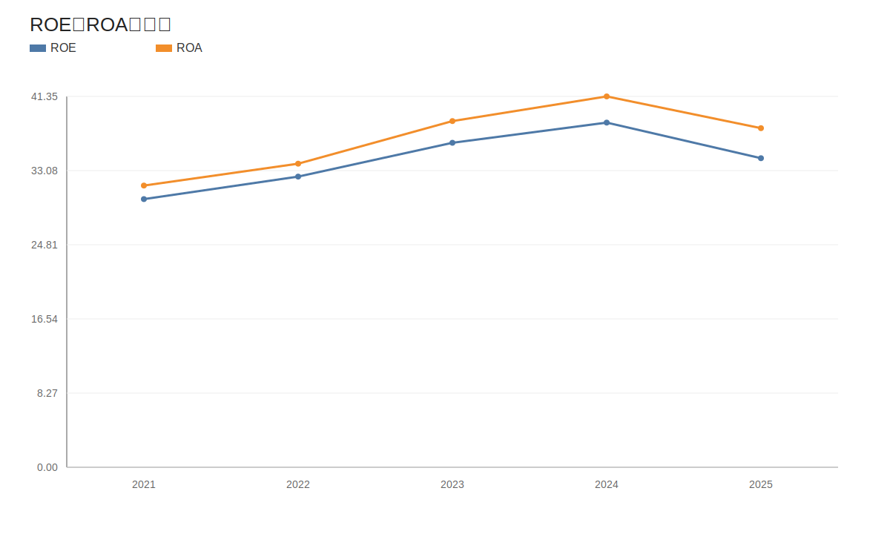
<!-- VALUE_CHARTS_END -->
