# 中孚实业（600595.SH）价值分析报告草稿

- 生成时间：2026-05-13 08:10:39
- 自动化脚本：`.agents/skills/value-report/value_report_scaffold.py`
- 数据口径：数据库字段定义以 `app/models/models.py` 为准
- 公司信息：行业 铝｜地区 河南｜上市日期 20020626
- 管理层：董事长 马文超｜总经理 钱宇｜员工 6933
- 主营业务：主要产品:高性能铝合金板材,易拉罐罐体,罐盖,拉环料,高档双零铝箔毛料,高档印刷版基,阳极氧化料等,产品广泛使用于交通运输,食品和医药包装,印刷制版等.主营业务:煤炭,火电,阳极炭块,电解铝,铝棒材,铝线材及铝精深加工产品.
- 提示：本文件已自动填充定量部分，定性模块请结合最新公告与行业资料补充。

## 自动填充数据（可直接引用）
### 最新估值
- 交易日：20260511
- 收盘价：7.72 元
- PE(TTM)：14.01 倍
- PB：1.73 倍
- PS(TTM)：1.25 倍
- 股息率(TTM)：N/A
- 总市值：309.41 亿元

### 最新财务快照
- 报告期：20260331
- 营收：66.40亿（同比 32.23%）
- 归母净利润：8.21亿（同比 256.61%）
- 经营现金流：-0.84亿（同比 66.22%）
- 自由现金流：-2.75亿
- 毛利率：20.48%，净利率：11.63%
- ROE：4.69%，ROIC：4.03%
- 资产负债率：29.85%，流动比率：1.70
- 经营现金流/利润：-8.74%
- 货币资金：10.19亿，有息负债：20.36亿，净现金：-10.18亿

### 近五年年报趋势
| 年度 | 营收 | 营收同比 | 归母净利 | 净利同比 | 毛利率 | 净利率 | ROE | ROIC | 资产负债率 | 经营现金流 | 自由现金流 | 现净比 |
| --- | --- | --- | --- | --- | --- | --- | --- | --- | --- | --- | --- | --- |
| 2025 | 230.68亿 | 1.35% | 16.17亿 | 129.83% | 13.15% | 5.97% | 10.19% | 8.35% | 29.24% | 11.80亿 | 0.65亿 | 72.96% |
| 2024 | 227.61亿 | 21.12% | 7.04亿 | -39.30% | 9.70% | 3.29% | 4.97% | 5.55% | 33.07% | 14.04亿 | 6.88亿 | 199.53% |
| 2023 | 187.93亿 | 7.29% | 11.59亿 | 10.41% | 15.71% | 8.39% | 8.99% | 10.55% | 34.45% | 19.89亿 | 2.90亿 | 171.60% |
| 2022 | 175.17亿 | 15.12% | 10.50亿 | 60.06% | 16.06% | 8.26% | 9.92% | 10.17% | 40.41% | 16.42亿 | 19.67亿 | 156.43% |
| 2021 | 152.16亿 | N/A | 6.56亿 | N/A | 21.45% | 10.36% | 12.28% | 12.96% | 46.80% | 13.31亿 | -17.23亿 | 202.86% |

- 近五年营收CAGR：10.96%
- 近五年净利CAGR：25.31%

### 分红与审计
#### 已实施分红
2021年已实施现金分红（税前）合计：每股 0.000 元

#### 审计意见
- 20241231：标准无保留意见（北京兴华会计师事务所）
- 20231231：标准无保留意见（北京兴华会计师事务所）
- 20221231：标准无保留意见（北京兴华会计师事务所）
- 20211231：标准无保留意见（北京兴华会计师事务所）
- 20201231：带强调事项段的无保留意见（北京兴华会计师事务所）

## ECharts 图表数据（option）

- 说明：以下 `option` 可直接用于前端图表渲染；单位已在坐标轴标注。

### 1. 主营业务收入趋势图
```json
{
  "title": {
    "text": "主营业务收入趋势（近5年）"
  },
  "tooltip": {
    "trigger": "axis"
  },
  "legend": {
    "top": 24,
    "data": [
      "主营业务收入"
    ]
  },
  "xAxis": {
    "type": "category",
    "data": [
      "2021",
      "2022",
      "2023",
      "2024",
      "2025"
    ]
  },
  "yAxis": {
    "type": "value",
    "name": "亿元"
  },
  "series": [
    {
      "name": "主营业务收入",
      "type": "line",
      "smooth": true,
      "data": [
        152.16,
        175.17,
        187.93,
        227.61,
        230.68
      ]
    }
  ]
}
```

### 2. 净利润趋势图
```json
{
  "title": {
    "text": "净利润趋势（近5年）"
  },
  "tooltip": {
    "trigger": "axis"
  },
  "legend": {
    "top": 24,
    "data": [
      "净利润",
      "营业收入"
    ]
  },
  "xAxis": {
    "type": "category",
    "data": [
      "2021",
      "2022",
      "2023",
      "2024",
      "2025"
    ]
  },
  "yAxis": [
    {
      "type": "value",
      "name": "亿元"
    },
    {
      "type": "value",
      "name": "亿元"
    }
  ],
  "series": [
    {
      "name": "净利润",
      "type": "bar",
      "data": [
        6.56,
        10.5,
        11.59,
        7.04,
        16.17
      ]
    },
    {
      "name": "营业收入",
      "type": "line",
      "yAxisIndex": 1,
      "data": [
        152.16,
        175.17,
        187.93,
        227.61,
        230.68
      ]
    }
  ]
}
```

### 3. 毛利率和净利率对比图
```json
{
  "title": {
    "text": "毛利率 vs 净利率"
  },
  "tooltip": {
    "trigger": "axis"
  },
  "legend": {
    "top": 24,
    "data": [
      "毛利率",
      "净利率"
    ]
  },
  "xAxis": {
    "type": "category",
    "data": [
      "2021",
      "2022",
      "2023",
      "2024",
      "2025"
    ]
  },
  "yAxis": {
    "type": "value",
    "name": "%"
  },
  "series": [
    {
      "name": "毛利率",
      "type": "bar",
      "data": [
        21.45,
        16.06,
        15.71,
        9.7,
        13.15
      ]
    },
    {
      "name": "净利率",
      "type": "bar",
      "data": [
        10.36,
        8.26,
        8.39,
        3.29,
        5.97
      ]
    }
  ]
}
```

### 4. 分产品收入结构图
```json
{
  "title": {
    "text": "分产品收入结构（20251231）"
  },
  "tooltip": {
    "trigger": "item"
  },
  "legend": {
    "type": "scroll",
    "top": 24
  },
  "series": [
    {
      "type": "pie",
      "radius": "55%",
      "data": [
        {
          "name": "有色金属",
          "value": 217.85
        },
        {
          "name": "铝加工",
          "value": 144.1
        },
        {
          "name": "国外",
          "value": 90.93
        },
        {
          "name": "电解铝",
          "value": 73.76
        },
        {
          "name": "电力",
          "value": 5.9
        },
        {
          "name": "煤炭",
          "value": 5.61
        },
        {
          "name": "煤炭(行业)",
          "value": 5.61
        },
        {
          "name": "电",
          "value": 4.77
        }
      ]
    }
  ]
}
```

### 4. 分产品收入变化图
```json
{
  "title": {
    "text": "分产品收入变化（近5年）"
  },
  "tooltip": {
    "trigger": "axis"
  },
  "legend": {
    "type": "scroll",
    "top": 24,
    "data": [
      "有色金属",
      "铝加工",
      "国外",
      "电解铝",
      "电力"
    ]
  },
  "xAxis": {
    "type": "category",
    "data": [
      "2021",
      "2022",
      "2023",
      "2024",
      "2025"
    ]
  },
  "yAxis": {
    "type": "value",
    "name": "亿元"
  },
  "series": [
    {
      "name": "有色金属",
      "type": "bar",
      "stack": "total",
      "data": [
        198.03,
        246.13,
        252.41,
        318.25,
        318.05
      ]
    },
    {
      "name": "铝加工",
      "type": "bar",
      "stack": "total",
      "data": [
        151.43,
        189.64,
        100.68,
        142.53,
        144.1
      ]
    },
    {
      "name": "国外",
      "type": "bar",
      "stack": "total",
      "data": [
        67.04,
        118.19,
        52.71,
        92.81,
        90.93
      ]
    },
    {
      "name": "电解铝",
      "type": "bar",
      "stack": "total",
      "data": [
        46.61,
        56.5,
        71.66,
        71.81,
        73.76
      ]
    },
    {
      "name": "电力",
      "type": "bar",
      "stack": "total",
      "data": [
        7.56,
        7.59,
        18.09,
        17.22,
        16.42
      ]
    }
  ]
}
```

### 5. 分产品利润结构图
```json
{
  "title": {
    "text": "分产品利润结构（20251231）"
  },
  "tooltip": {
    "trigger": "axis"
  },
  "legend": {
    "top": 24,
    "data": [
      "利润",
      "毛利率"
    ]
  },
  "xAxis": {
    "type": "category",
    "data": [
      "有色金属",
      "铝加工",
      "国外",
      "电解铝",
      "电力",
      "煤炭",
      "煤炭(行业)",
      "电"
    ]
  },
  "yAxis": [
    {
      "type": "value",
      "name": "亿元"
    },
    {
      "type": "value",
      "name": "%"
    }
  ],
  "series": [
    {
      "name": "利润",
      "type": "bar",
      "data": [
        28.77,
        16.41,
        8.51,
        12.35,
        0.86,
        -0.24,
        -0.24,
        0.97
      ]
    },
    {
      "name": "毛利率",
      "type": "line",
      "yAxisIndex": 1,
      "data": [
        13.2,
        11.39,
        9.36,
        16.75,
        14.6,
        -4.2,
        -4.2,
        20.32
      ]
    }
  ]
}
```

### 6. 分地区收入分布图
```json
{
  "title": {
    "text": "分地区收入分布（20251231）"
  },
  "tooltip": {
    "trigger": "item"
  },
  "legend": {
    "type": "scroll",
    "top": 24
  },
  "series": [
    {
      "type": "pie",
      "radius": "55%",
      "data": [
        {
          "name": "中国大陆",
          "value": 138.43
        },
        {
          "name": "其他业务(地区)",
          "value": 1.32
        }
      ]
    }
  ]
}
```

### 7. 资产负债表关键数据图
```json
{
  "title": {
    "text": "资产负债表关键数据（近5年）"
  },
  "tooltip": {
    "trigger": "axis"
  },
  "legend": {
    "top": 24,
    "data": [
      "总资产",
      "总负债",
      "股东权益"
    ]
  },
  "xAxis": {
    "type": "category",
    "data": [
      "2021",
      "2022",
      "2023",
      "2024",
      "2025"
    ]
  },
  "yAxis": {
    "type": "value",
    "name": "亿元"
  },
  "series": [
    {
      "name": "总资产",
      "type": "bar",
      "stack": "capital",
      "data": [
        218.27,
        241.91,
        231.14,
        241.16,
        241.43
      ]
    },
    {
      "name": "总负债",
      "type": "bar",
      "stack": "capital",
      "data": [
        102.15,
        97.75,
        79.63,
        79.75,
        70.59
      ]
    },
    {
      "name": "股东权益",
      "type": "line",
      "data": [
        116.13,
        144.17,
        151.51,
        161.41,
        170.84
      ]
    }
  ]
}
```

### 8. 自由现金流与经营现金流对比图
```json
{
  "title": {
    "text": "自由现金流 vs 经营现金流"
  },
  "tooltip": {
    "trigger": "axis"
  },
  "legend": {
    "top": 24,
    "data": [
      "经营现金流",
      "自由现金流"
    ]
  },
  "xAxis": {
    "type": "category",
    "data": [
      "2021",
      "2022",
      "2023",
      "2024",
      "2025"
    ]
  },
  "yAxis": {
    "type": "value",
    "name": "亿元"
  },
  "series": [
    {
      "name": "经营现金流",
      "type": "line",
      "data": [
        13.31,
        16.42,
        19.89,
        14.04,
        11.8
      ]
    },
    {
      "name": "自由现金流",
      "type": "line",
      "data": [
        -17.23,
        19.67,
        2.9,
        6.88,
        0.65
      ]
    }
  ]
}
```

### 9. 股东回报分析图
```json
{
  "title": {
    "text": "股东回报（EPS/分红）"
  },
  "tooltip": {
    "trigger": "axis"
  },
  "legend": {
    "top": 24,
    "data": [
      "EPS",
      "每股现金分红（已实施）"
    ]
  },
  "xAxis": {
    "type": "category",
    "data": [
      "2021",
      "2022",
      "2023",
      "2024",
      "2025"
    ]
  },
  "yAxis": {
    "type": "value",
    "name": "元"
  },
  "series": [
    {
      "name": "EPS",
      "type": "line",
      "data": [
        0.27,
        0.27,
        0.29,
        0.18,
        0.4
      ]
    },
    {
      "name": "每股现金分红（已实施）",
      "type": "line",
      "data": [
        0.0,
        0.0,
        0.0,
        0.0,
        0.0
      ]
    }
  ]
}
```

### 10. 财务比率分析图
```json
{
  "title": {
    "text": "关键财务比率（近5年）"
  },
  "tooltip": {
    "trigger": "axis"
  },
  "legend": {
    "type": "scroll",
    "top": 24,
    "data": [
      "资产负债率",
      "流动比率",
      "速动比率",
      "应收周转率",
      "存货周转率"
    ]
  },
  "xAxis": {
    "type": "category",
    "data": [
      "2021",
      "2022",
      "2023",
      "2024",
      "2025"
    ]
  },
  "yAxis": [
    {
      "type": "value",
      "name": "比率/%"
    },
    {
      "type": "value",
      "name": "周转率"
    }
  ],
  "series": [
    {
      "name": "资产负债率",
      "type": "line",
      "data": [
        46.8,
        40.41,
        34.45,
        33.07,
        29.24
      ]
    },
    {
      "name": "流动比率",
      "type": "line",
      "data": [
        0.97,
        1.01,
        1.14,
        1.23,
        1.52
      ]
    },
    {
      "name": "速动比率",
      "type": "line",
      "data": [
        0.67,
        0.64,
        0.62,
        0.76,
        0.9
      ]
    },
    {
      "name": "应收周转率",
      "type": "bar",
      "yAxisIndex": 1,
      "data": [
        27.14,
        26.83,
        21.77,
        15.23,
        10.15
      ]
    },
    {
      "name": "存货周转率",
      "type": "bar",
      "yAxisIndex": 1,
      "data": [
        7.4,
        7.3,
        6.95,
        8.52,
        7.29
      ]
    }
  ]
}
```

### 11. ROE与ROA对比图
```json
{
  "title": {
    "text": "ROE vs ROA（近5年）"
  },
  "tooltip": {
    "trigger": "axis"
  },
  "legend": {
    "top": 24,
    "data": [
      "ROE",
      "ROA"
    ]
  },
  "xAxis": {
    "type": "category",
    "data": [
      "2021",
      "2022",
      "2023",
      "2024",
      "2025"
    ]
  },
  "yAxis": {
    "type": "value",
    "name": "%"
  },
  "series": [
    {
      "name": "ROE",
      "type": "line",
      "data": [
        12.28,
        9.92,
        8.99,
        4.97,
        10.19
      ]
    },
    {
      "name": "ROA",
      "type": "line",
      "data": [
        9.52,
        8.25,
        9.02,
        5.15,
        8.7
      ]
    }
  ]
}
```

## 1. 公司概况（商业模式优先）
- 公司是如何赚钱的？
- 收入来源构成（核心业务占比）
- 客户类型（To B / To C / 政府）
- 是否具备持续性收入（一次性 vs 订阅/复购）
- 是否依赖单一客户或区域

### 结论
- 商业模式是否简单、可理解
- 是否具备长期可持续性

## 2. 行业与竞争格局
- 行业空间（市场规模、天花板）
- 行业阶段（成长 / 成熟 / 衰退）
- 行业增速
- 主要竞争对手
- 市场份额与行业集中度
- 公司在产业链中的位置

### 结论
- 是否属于优质赛道
- 公司是否处于有利竞争位置
- 行业未来3-5年趋势

## 3. 护城河分析（含真伪辨别）
- 品牌优势
- 成本优势
- 网络效应
- 转换成本
- 技术壁垒
- 渠道优势

### 护城河真伪辨别
- 如果产品提价 5%，客户是否会流失？
- 客户是否对价格敏感？
- 是否存在“非它不可”的使用场景？
- 替代品是否容易出现？
- 客户更换供应商的成本高不高？

### 结论
- 护城河类型
- 护城河强度：强 / 中 / 弱 / 伪护城河
- 是否具备真实定价权

## 4. 管理层与资本配置（重点）
- 管理层背景与稳定性
- 是否存在诚信问题（造假 / 处罚 / 诉讼）
- 过往战略是否理性

### 资本配置历史
- 是否长期分红
- 是否进行回购注销（而非股权激励稀释）
- 并购历史（成功 / 失败 / 频繁）
- 是否存在盲目多元化扩张
- 资本开支是否合理

### 结论
- 管理层类型：价值创造者 / 中性 / 价值毁灭者
- 是否值得长期信任

## 5. 财务分析
### 5.1 成长性
- 营收增长率（近3-5年）
- 净利润增长率
- 增长是否稳定

### 结论
- 是否具备持续成长能力

### 5.2 盈利能力
- 毛利率
- 净利率
- ROE / ROIC

### 结论
- 是否具备定价权
- 盈利质量如何

### 5.3 财务健康
- 资产负债率
- 有息负债
- 现金储备
- 短期偿债能力

### 结论
- 是否存在财务风险

### 5.4 现金流质量
- 经营现金流
- 自由现金流
- 净利润与现金流是否匹配

### 结论
- 利润是否真实
- 是否具备造血能力

## 6. 成长驱动
- 未来3-5年增长来源
- 是否依赖提价 / 扩张 / 新业务
- 增长逻辑是否清晰

### 结论
- 成长是否可持续

## 7. 风险分析（含幸存者偏差）
- 政策风险
- 行业竞争风险
- 技术替代风险
- 财务风险
- 客户集中风险

### 幸存者偏差检验
- 行业历史最差时期是什么时候？
- 当时发生了什么（金融危机 / 疫情 / 监管）？
- 公司当时表现：是否大幅亏损 / 现金流断裂 / 接近破产？
- 公司在极端情况下是：变强 / 持平 / 衰退

### 结论
- 抗风险能力：强 / 中 / 弱
- 是否属于“穿越周期公司”

## 8. 估值分析
- PE / PB / PS / PEG / EV/EBITDA
- 当前估值 vs 历史估值
- 当前估值 vs 行业对比

### 结论
- 当前是否高估 / 低估 / 合理
- 是否具备安全边际

## 9. 投资判断
### 多头逻辑
1. 
2. 
3. 

### 空头逻辑
1. 
2. 
3. 

### 核心跟踪指标
1. 
2. 
3. 

## 最终结论
- 这是否是一家好公司？
- 是否具备长期投资价值？
- 当前价格是否值得买入？
- 投资建议：买入 / 观察 / 回避

## 总评分（100分）
- 商业模式：
- 护城河：
- 管理层：
- 财务：
- 风险：
- 估值：

**最终评分：__ / 100**

## 三个终极问题（必须回答）
1. 如果提价 5%，客户会不会流失？
2. 公司赚的钱有没有被管理层浪费？
3. 在行业最差年份，公司是怎么活下来的？

<!-- VALUE_CHARTS_START -->
## 图表图片（自动生成）

### 1. 主营业务收入趋势图
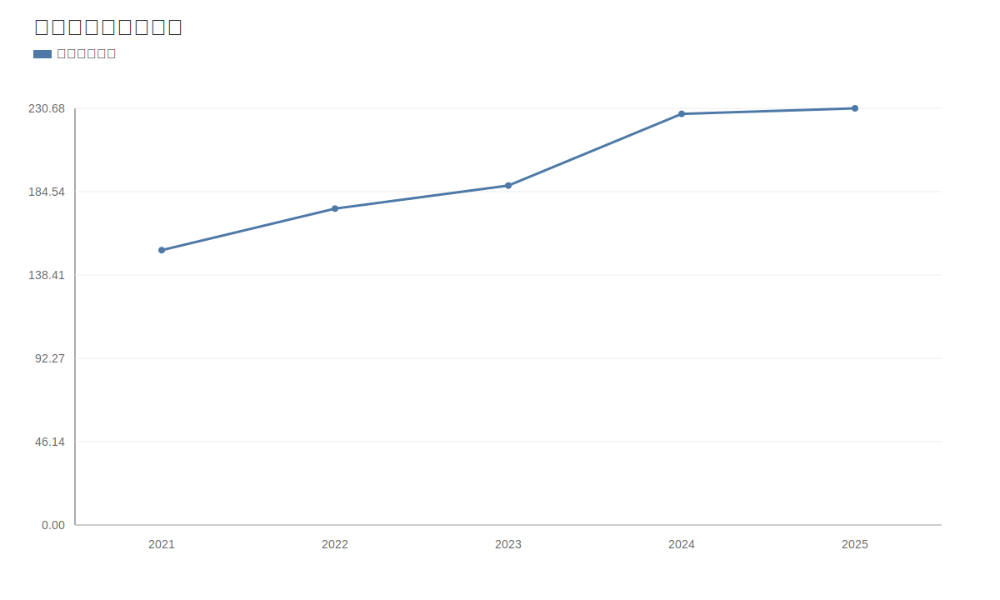

### 2. 净利润趋势图
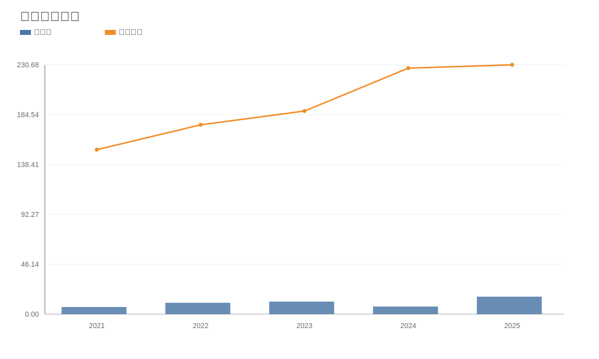

### 3. 毛利率和净利率对比图
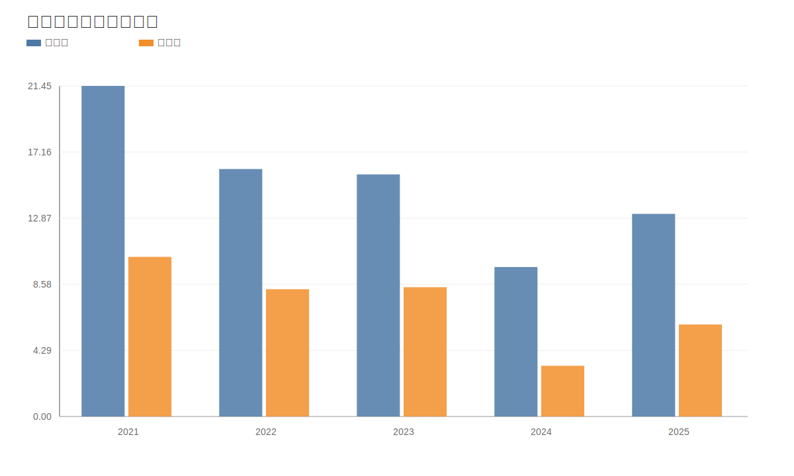

### 4. 分产品收入结构图
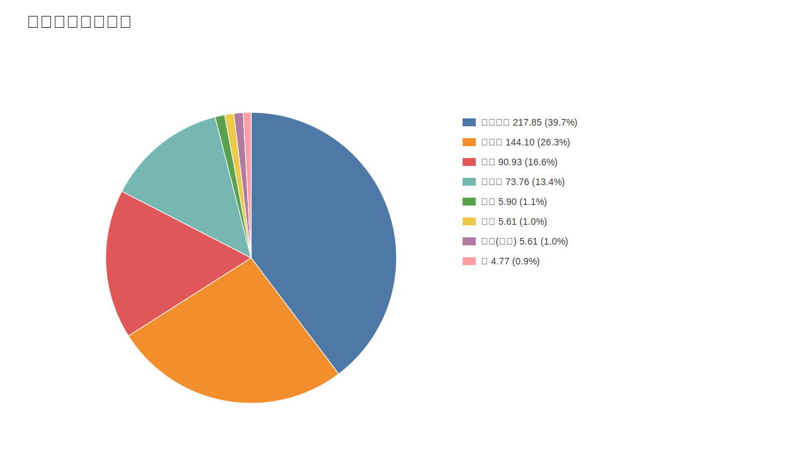

### 4. 分产品收入变化图
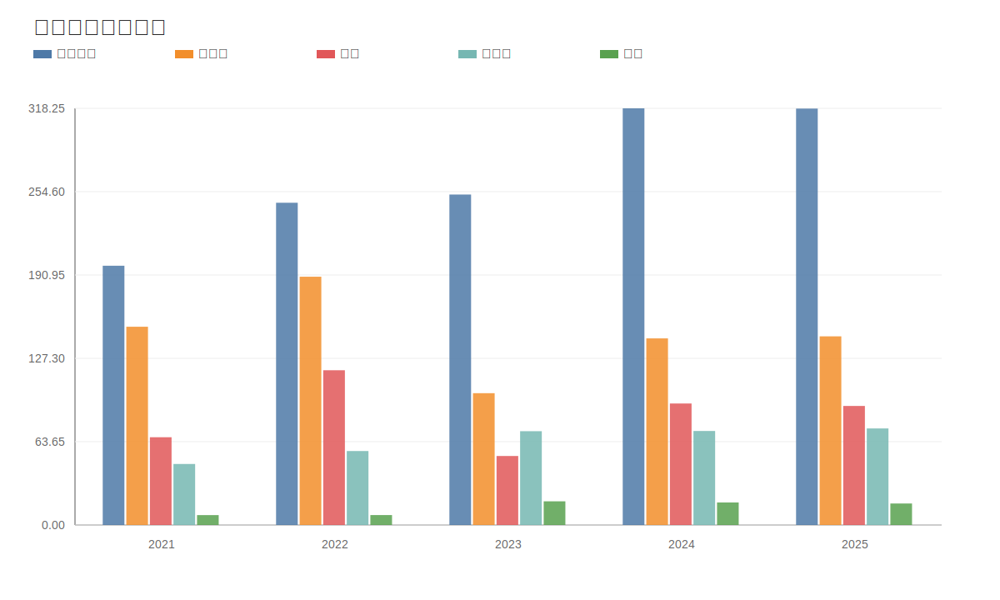

### 5. 分产品利润结构图
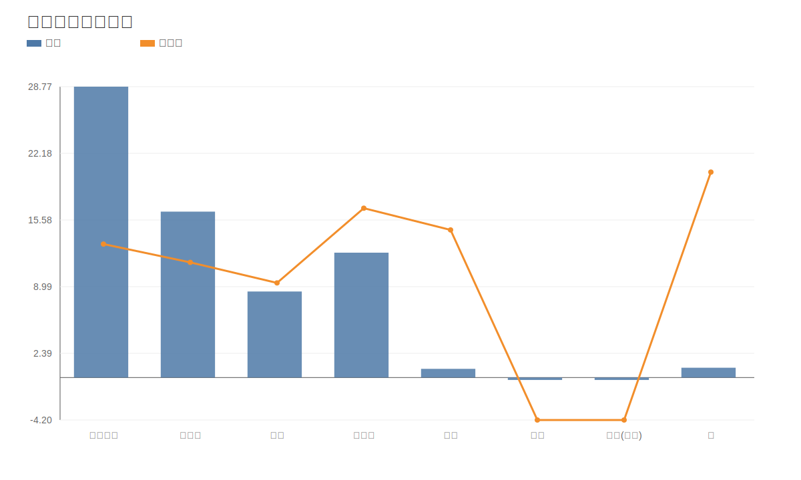

### 6. 分地区收入分布图
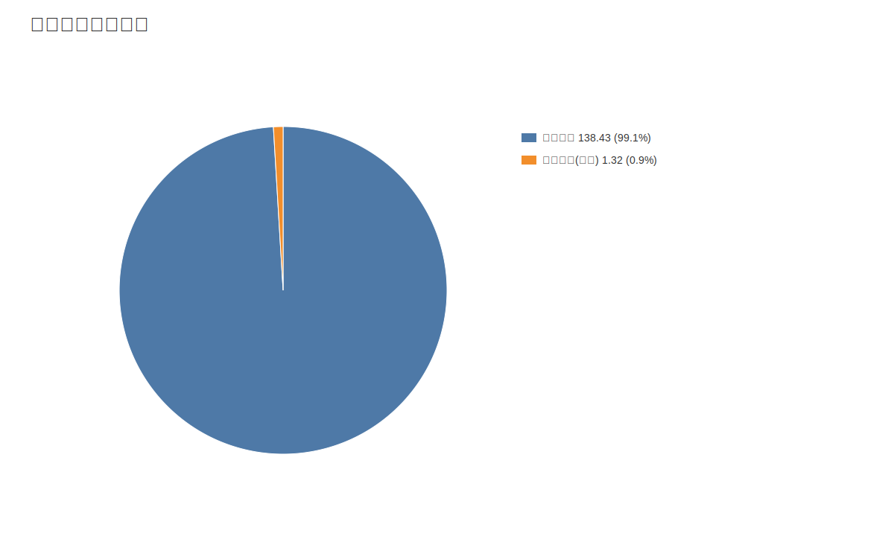

### 7. 资产负债表关键数据图
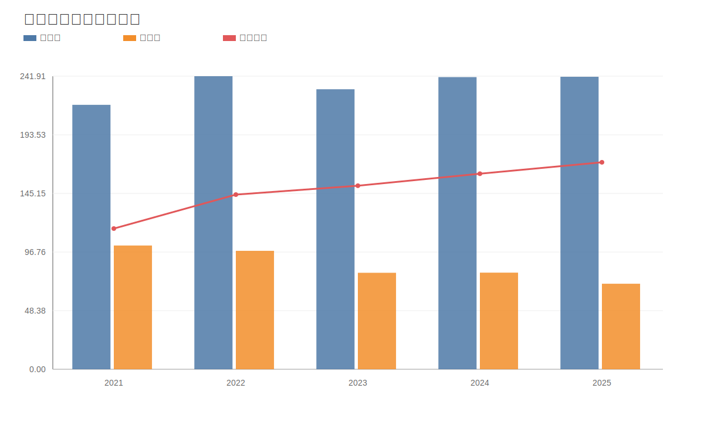

### 8. 自由现金流与经营现金流对比图
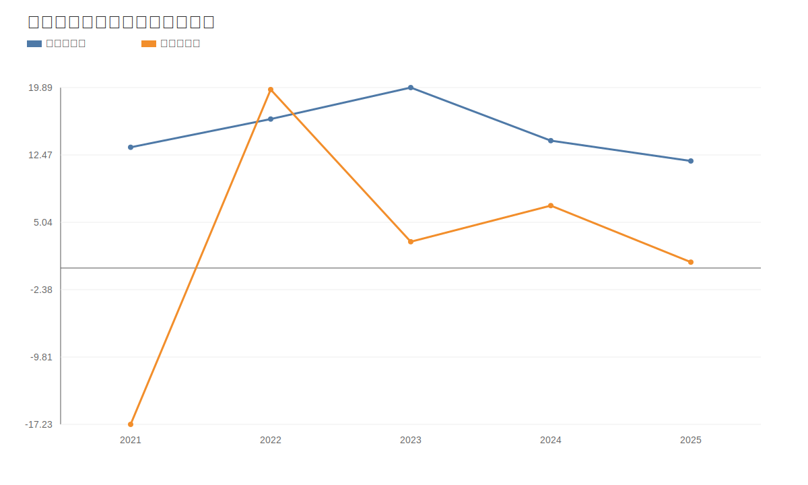

### 9. 股东回报分析图
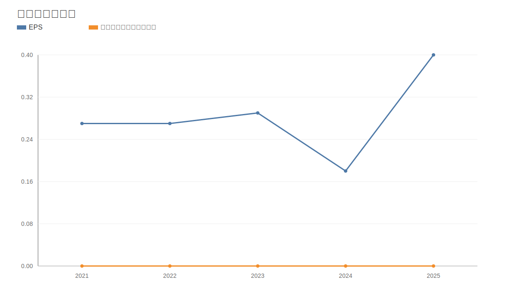

### 10. 财务比率分析图
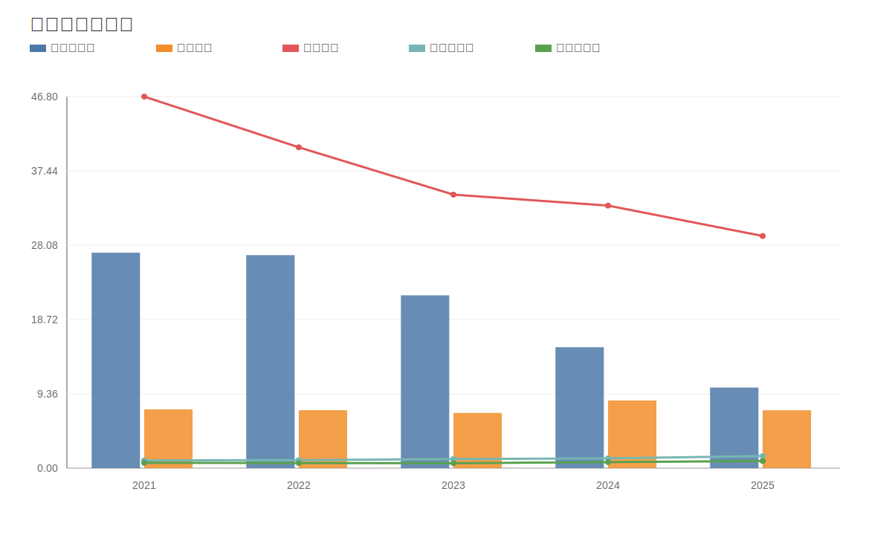

### 11. ROE与ROA对比图
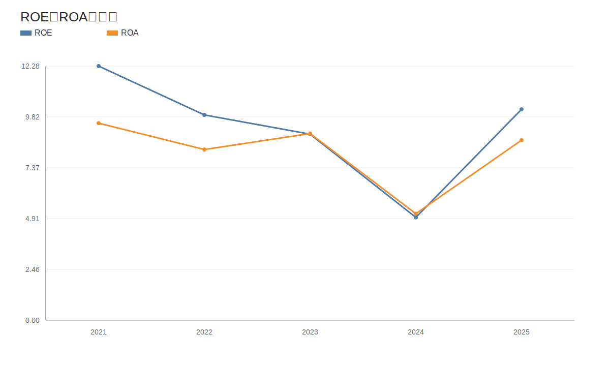
<!-- VALUE_CHARTS_END -->

## 困境反转专项判断（中孚实业）
事实：
- 价格日期：20260511；财报日期：20260331。
- 当前收盘价 7.72 元，PE(TTM) 14.01，PB 1.73。
计算结果：
- 营收同比 -71.22%，净利润同比 -49.21%，经营现金流同比 -107.16%。
- 资产负债率：最新 29.85%，上期 29.24%。
- 困境反转评分：0/3，状态：反转待确认。
推断：
- 若“盈利修复 + 现金流修复 + 杠杆缓解”连续两个报告期维持，则反转概率提升；若任一项再度恶化，应下调反转置信度。
