# 青岛啤酒（600600）深度价值研究报告

- 报告日期：2026年4月22日
- 数据截止：
  - 年度财务：2025年12月31日（年报口径）
  - 财务指标：2025年9月30日（最新可得 `fina_indicator` 口径）
  - 估值与股价：2026年4月21日（最新交易日）
- 本地库主口径：`income/balancesheet/cashflow/fina_indicator/daily_basic/dividend/fina_audit/stock_company`
- 外部增量验证：公司官网新闻、交易所披露（定期报告）、行业统计口径

## 1. 公司概况
青岛啤酒的盈利模式是“品牌矩阵 + 渠道网络 + 规模生产”，以啤酒销售收入为核心。客户类型以 ToC 为主，经销体系覆盖餐饮、商超、流通和即时零售，收入天然具备复购特征。公司核心品牌为青岛啤酒，同时通过崂山等品牌覆盖大众价格带。

在结构维度上，本地库 `fina_mainbz` 未返回 2025 年分产品/分地区明细（`MAINBZ_ROWS=0`），因此产品与区域占比以公司披露的经营描述做增量验证，不替代财务主口径。

结论：公司是成熟消费品龙头，商业模式清晰，收入可持续性强。
事实：2025 年营收 324.73 亿元、归母净利润 45.88 亿元；2026年4月21日总市值 846.07 亿元。
推断：未来回报更依赖“结构升级+效率改善”，而非行业总量高增长。

## 2. 行业与竞争格局
中国啤酒行业已从增量扩张转向存量竞争，核心竞争从“规模扩张”转向“品牌力、产品结构、渠道效率、费用控制”。青岛啤酒处于国内第一梯队，具备全国化品牌认知和较强渠道覆盖。

根据公司披露的 2025 年半年度报告（2025年8月27日披露），2025 年上半年公司实现销量 463 万千升，其中中高端以上产品销量 293 万千升，同比+2.58%，对应收入 145.89 亿元，同比+5.43%，显示结构升级仍在推进。

结论：行业处于成熟期，公司竞争位置稳固但增长弹性有限。
事实：2021-2025 年营收 CAGR 仅 1.86%，同期净利 CAGR 9.81%。
推断：未来 3-5 年公司更可能走“利润率改善型增长”，而非“规模高速扩张型增长”。

## 3. 护城河分析（含真伪辨别）
护城河来源主要是品牌、渠道和运营规模。青岛啤酒在宴饮、礼赠、餐饮和城市消费场景有稳定品牌心智；渠道端具备较深经销网络；供应链管理和产销协同能力在行业内较成熟。

真伪辨别：
- 提价 5% 是否流失客户：核心品牌场景流失可控，但大众价格带更敏感。
- 客户是否对价格高度敏感：中等偏高，促销节奏与终端折扣仍会影响销量。
- 是否存在“非它不可”场景：在部分区域与场景存在品牌偏好，但不构成绝对垄断。
- 替代品出现难度：中等，行业内替代品牌充足。
- 更换供应商成本：终端消费者切换成本低，经销端切换成本中等。

结论：护城河强度为“中偏强”，不是不可撼动型护城河。
事实：2025年9月30日口径毛利率 43.66%、净利率 18.40%，维持行业较高水平。
推断：公司可维持较高盈利中枢，但护城河宽度会受行业促销周期影响。

## 4. 管理层与资本配置
管理层稳定，审计意见连续多年“标准无保留”。资本配置整体偏稳健：持续分红、低有息负债、高现金储备，经营安全边际较高。

分红方面，已实施现金分红（税前）近年明显提升：2024 年每股 2.00 元、2025 年每股 2.20 元。财务结构方面，2025 年末货币资金约 128.60 亿元，有息负债口径近似为 0。

结论：管理层资本配置表现为“价值创造者（中高置信）”。
事实：2026年4月21日股息率（TTM）3.55%；2025 年末净现金约 128.60 亿元。
推断：公司估值下限受分红与现金资产支撑，但上限仍取决于增长质量。

## 5. 财务分析（成长/盈利/健康/现金流）
### 5.1 成长性
- 营收（亿元）：2021 年 301.67 → 2025 年 324.73，5 年 CAGR 1.86%。
- 归母净利（亿元）：2021 年 31.55 → 2025 年 45.88，5 年 CAGR 9.81%。
- 2025 年同比：营收 +1.04%，归母净利 +5.60%。

### 5.2 盈利能力
- 年度可比口径（截至 2024年12月31日）：毛利率 40.23%，净利率 13.98%，ROE 15.38%，ROIC 13.84%。
- 最新指标口径（截至 2025年9月30日）：毛利率 43.66%，净利率 18.40%，ROE 17.47%，ROIC 16.57%。

### 5.3 财务健康
- 2025 年末总资产 521.32 亿元，总负债 206.19 亿元，按资产负债表计算负债率约 39.55%。
- 2025年9月30日口径：资产负债率 37.35%，流动比率 1.59，速动比率 1.47。

### 5.4 现金流质量
- 经营现金流（亿元）：2021 年 60.43、2022 年 48.79、2023 年 27.78、2024 年 51.55、2025 年 45.93。
- 自由现金流（亿元）：2021 年 -29.54、2022 年 42.46、2023 年 37.10、2024 年 86.64、2025 年 23.62。
- 2025 年经营现金流/净利润约 100.10%，利润现金化整体尚可。

结论：财务质量整体优秀，增长偏稳健，现金流有波动但未失真。
事实：净利润增长显著快于收入增长，且 2025 年现净比约 1.00。
推断：公司已进入“高质量低速增长”阶段，估值弹性依赖利润率维持和现金流稳定。

## 6. 成长驱动
未来 3-5 年增长驱动预计来自四类：
1. 结构升级：中高端产品占比继续提升。
2. 价盘与品牌：核心品牌溢价能力维持。
3. 渠道效率：即时零售、餐饮与传统流通协同优化。
4. 经营效率：费用率、供应链和产销协同优化。

结论：增长来源以“提质增效”为主，确定性高于弹性。
事实：2025H1 中高端以上产品收入同比增长 5.43%，快于公司整体收入增速。
推断：若行业不出现激烈价格战，公司盈利中枢仍有小幅上行空间。

## 7. 风险分析（含幸存者偏差）
主要风险：
- 行业竞争风险：促销强度上升会压缩吨酒利润。
- 成本风险：大麦、包材、能源价格波动。
- 需求风险：宏观消费波动导致结构升级节奏放缓。
- 渠道风险：库存周期与渠道压货引发短期波动。
- 财务风险：整体较低，但自由现金流年度波动需跟踪。

幸存者偏差检验（行业低谷阶段）：
- 2014-2016 年公司营收从 290.49 亿元降至 261.06 亿元。
- 同期归母净利从 19.90 亿元降至 10.43 亿元，但未亏损。
- 同期经营现金流保持正值（2014 年 16.91 亿元、2015 年 25.75 亿元、2016 年 29.71 亿元）。

结论：抗风险能力评估为“中偏强”。
事实：公司在行业压力周期仍保持正利润、正经营现金流、负债率可控。
推断：公司更可能面临“利润率波动风险”而非“生存性风险”。

## 8. 估值分析
截至 2026年4月21日：
- PE(TTM)：18.44 倍
- PB：2.76 倍
- PS(TTM)：2.61 倍
- 股息率(TTM)：3.55%
- PEG（以 2025 年归母净利同比 5.60% 粗算）：约 3.29
- EV/EBITDA：数据库当前无 EBITDA 字段，无法给出可比口径

历史分位（近一年，滚动交易日样本）：
- PE 分位约 60.42%
- PB 分位约 72.92%
- PS 分位约 45.83%

同业对比（同为 2026年4月21日）：
- 青岛啤酒：PE 18.44 / PB 2.76 / PS 2.61
- 燕京啤酒：PE 21.32 / PB 2.31 / PS 2.33
- 重庆啤酒：PE 20.97 / PB 18.75 / PS 1.75
- 珠江啤酒：PE 23.95 / PB 1.96 / PS 3.68

结论：当前估值为“合理偏贵”，安全边际一般。
事实：PE 低于主要同业平均，但 PB 分位已处于近一年偏高区间。
推断：若利润率持续改善，估值可被消化；若行业促销加剧，估值回撤压力会上升。

## 9. 投资判断（多头/空头/跟踪指标）
多头逻辑：
1. 品牌与渠道优势仍在，需求韧性优于中小品牌。
2. 高现金、低负债、分红稳定，具备防御属性。
3. 利润增长快于收入增长，经营质量较高。
4. 中高端结构升级仍有延续迹象。

空头逻辑：
1. 行业总量天花板明显，收入增长弹性有限。
2. 促销竞争可能侵蚀吨酒利润与费用效率。
3. 自由现金流波动较大，资本开支节奏需持续跟踪。
4. 估值已不便宜，容错率低于低估值区间。

核心跟踪指标（季度）：
1. 中高端产品销量与收入增速。
2. 毛利率、净利率和销售费用率。
3. 经营现金流/净利润。
4. 渠道库存与终端动销节奏。
5. 分红政策与回购（若有）变化。

结论：标的是“高质量、低弹性”类型，更适合稳健型长期资金。
事实：经营与现金结构优秀，但估值不处于深度便宜区。
推断：未来超额收益主要来自盈利质量持续兑现，而非估值扩张。

## 10. 最终结论
- 这是否是一家好公司：是。
- 是否具备长期投资价值：是。
- 当前价格是否值得买入：可以关注分批配置，但不宜激进追高。
- 投资建议：观察（偏持有）。

结论：青岛啤酒是优质消费龙头，但当前更像“质量型持有标的”而非“高赔率抄底标的”。
事实：截至 2026年4月21日，估值在历史中枢偏上区间，分红与资产负债表质量较优。
推断：若后续出现估值回落或盈利超预期，性价比会明显改善。

## 11. 总评分（100分）
- 商业模式（20%）：17/20
- 护城河（20%）：16/20
- 管理层与资本配置（15%）：14/15
- 财务质量（20%）：17/20
- 风险控制（15%）：12/15
- 估值性价比（10%）：6/10

**最终总分：82/100**

结论：82 分对应“高质量稳健型”，适合中长期配置但需要估值纪律。
事实：优势集中在品牌、财务韧性与分红能力。
推断：若估值下移至更具安全边际区间，风险收益比会更优。

## 12. 三个终极问题（必须回答）
1. 如果提价 5%，客户会不会流失？
会流失一部分价格敏感用户，但核心品牌场景和中高端用户流失预计可控。

2. 公司赚的钱有没有被管理层浪费？
从近年分红、现金储备、负债结构和审计意见看，暂未见系统性资本错配或明显浪费迹象。

3. 在行业最差年份，公司是怎么活下来的？
依靠品牌力维持基本销量、通过渠道和费用管理守住现金流、并以较稳健负债结构穿越周期。

结论：三问整体偏正面，关键矛盾在增长弹性而非生存能力。
事实：行业低谷期公司仍保持正利润与正经营现金流。
推断：长期价值成立，但买点决定中期回报率。

## 外部增量验证来源
- [青岛啤酒官网：青岛啤酒股份有限公司2025年半年度报告披露](https://www.tsingtao.com.cn/news/7cc9514e-bbb1-44dd-b3d7-c57ac18085be.html)
- [青岛啤酒 2025 年半年度报告（交易所披露文件，披露日期 2025-08-27）](https://static.cninfo.com.cn/finalpage/2025-08-27/1224581043.PDF)
- [青岛啤酒投资者关系（公司官网入口）](https://www.tsingtao.com.cn/MT/investment/invest.html)

⚠️ 免责声明：本报告仅供教育和研究用途，不构成任何投资建议。

<!-- VALUE_CHARTS_START -->
## 图表图片（自动生成）

### 1. 主营业务收入趋势图
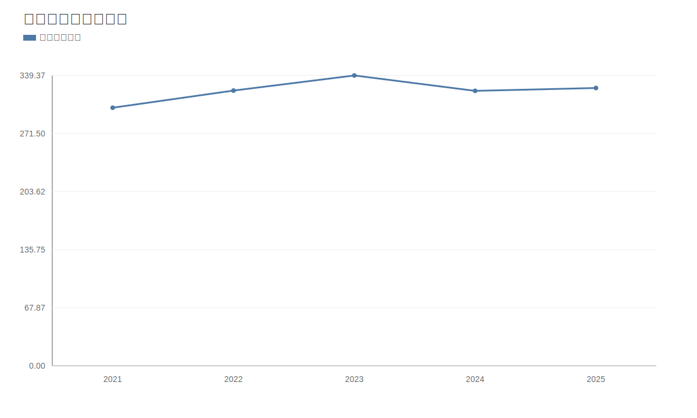

### 2. 净利润趋势图
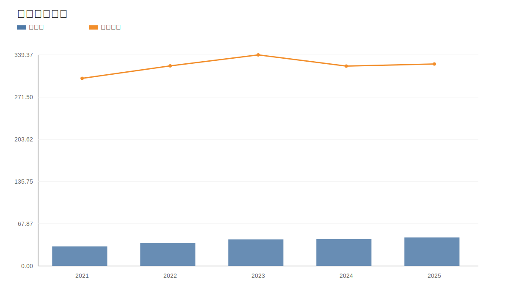

### 3. 毛利率和净利率对比图
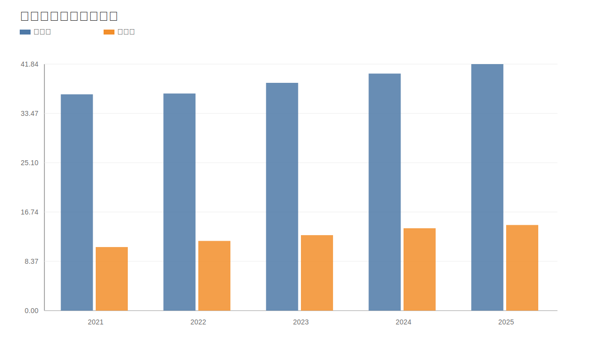

### 4. 分产品收入结构图
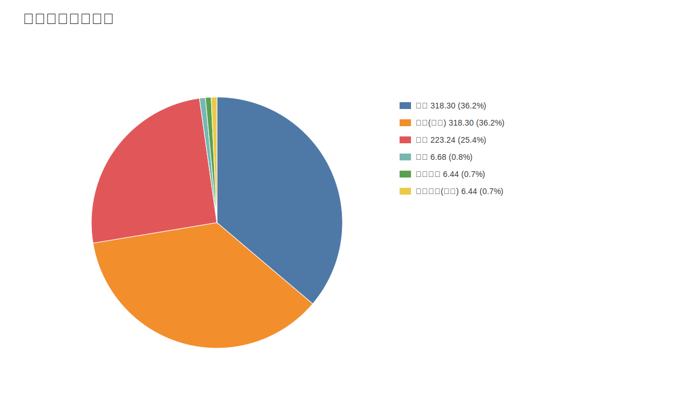

### 4. 分产品收入变化图
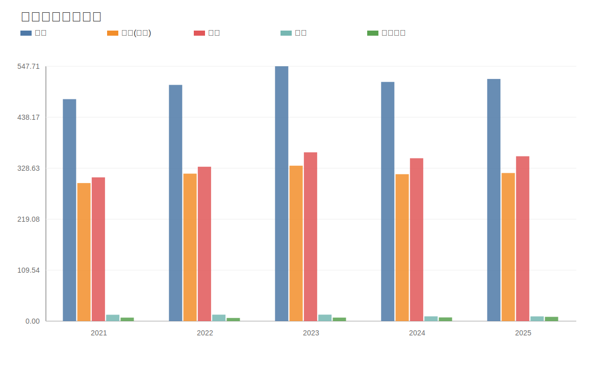

### 5. 分产品利润结构图
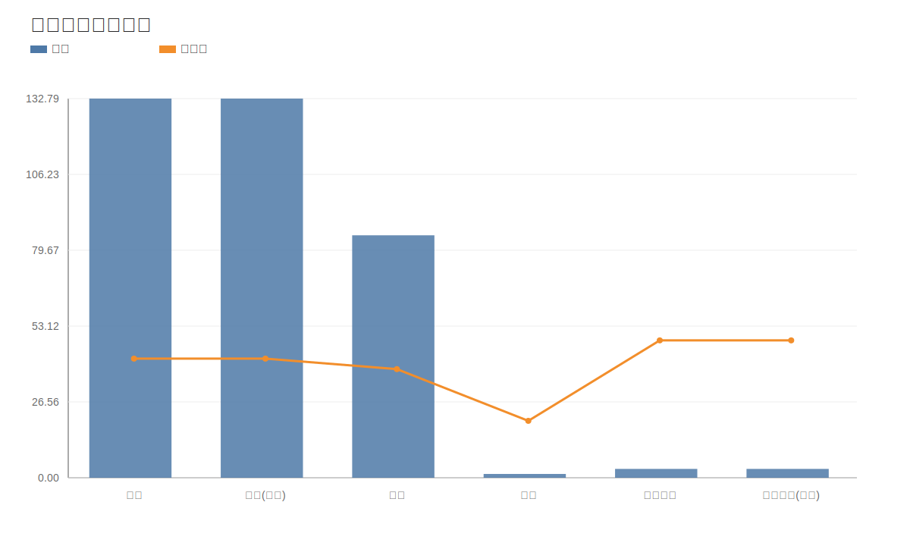

### 6. 分地区收入分布图
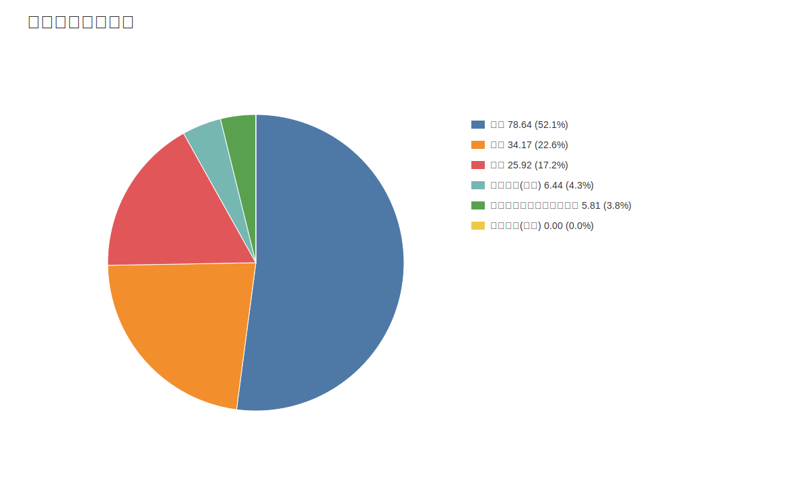

### 7. 资产负债表关键数据图
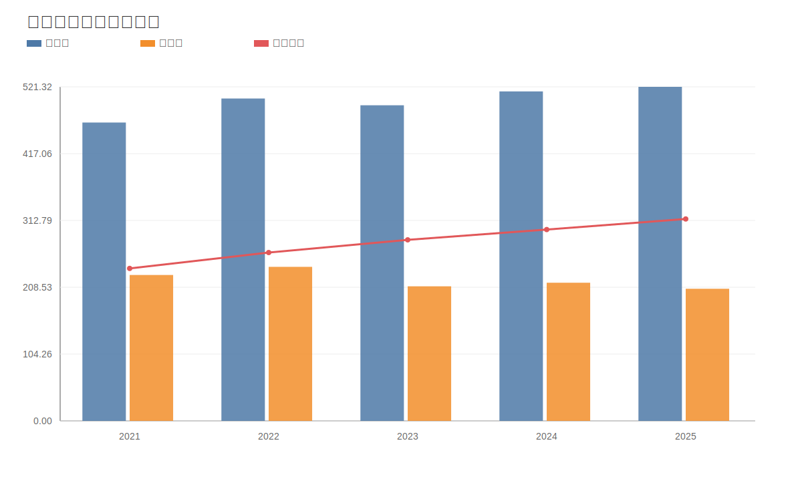

### 8. 自由现金流与经营现金流对比图
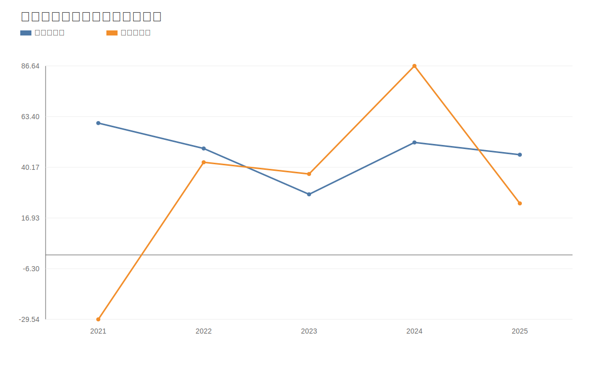

### 9. 股东回报分析图
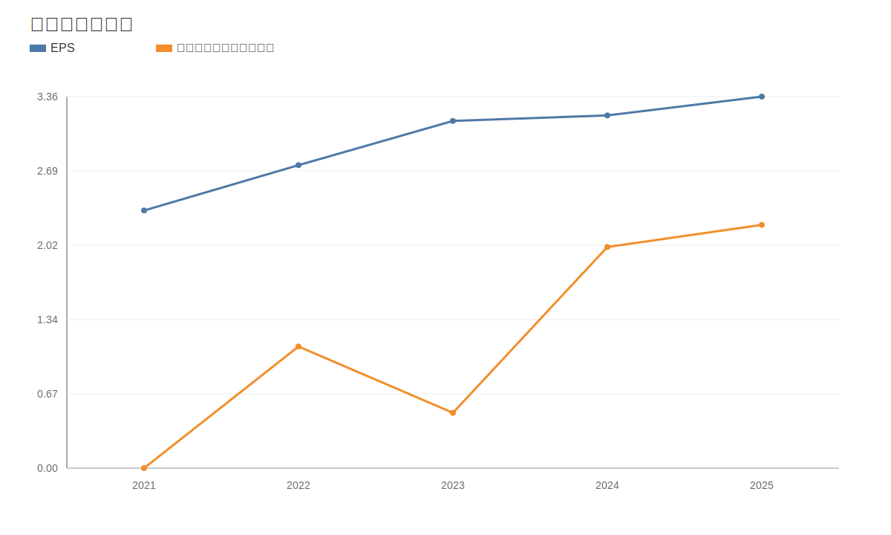

### 10. 财务比率分析图
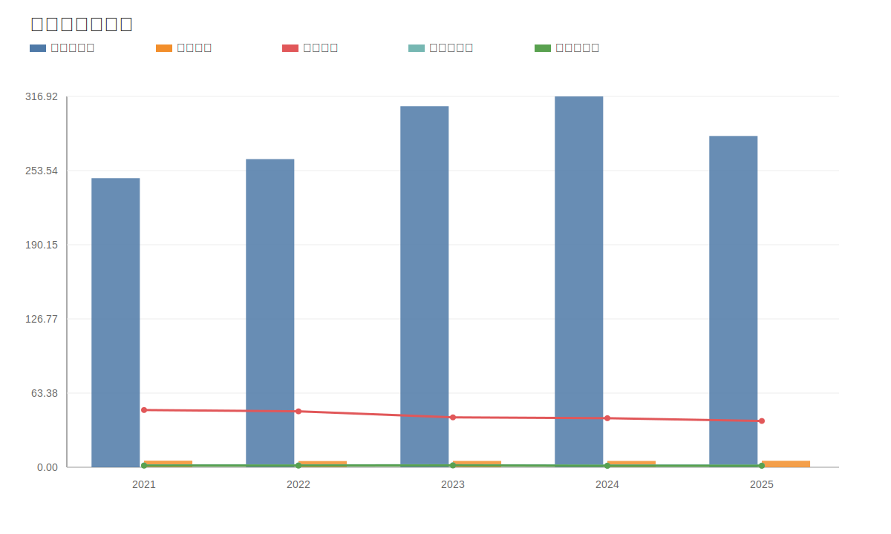

### 11. ROE与ROA对比图
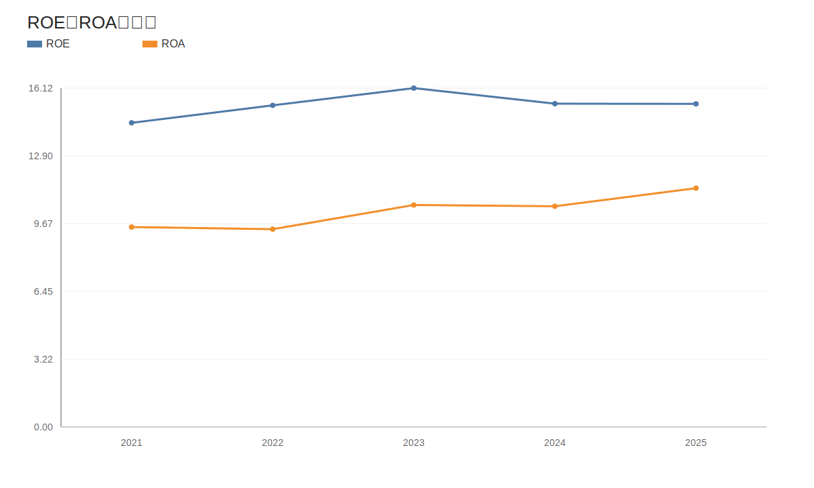
<!-- VALUE_CHARTS_END -->
