# 长江电力（600900.SH）深度价值研究报告

- 报告日期：2026-05-14
- 标的代码：600900（长江电力）
- 价格时点：截至 2026-05-13 收盘
- 财报时点：截至 2026-03-31（2026年一季度）
- 数据主口径：本地数据库 `income`、`balancesheet`、`cashflow`、`fina_indicator`、`daily_basic`、`dividend`、`fina_audit`、`stock_company`
- 外部增量验证：上交所公告、国家能源局电力统计

## 1. 公司概况
长江电力的盈利模式是“流域大型水电资产运营+电力交易”，核心收入来自电力销售，辅以少量其他业务收入。公司本质是重资产公用事业平台，依托优质流域水电站群，以高利用小时、低边际成本和稳定现金流创造回报。

按最新年报口径（2025-12-31），主营收入以“电力行业”收入为主（756.62亿元），其他收入规模明显较小。客户侧以电网和电力市场交易主体为主（ToB），并受电价机制、来水、调度及政策框架共同影响。收入持续性较强，但年度波动受来水条件与电价政策扰动。

结论：长江电力是典型“高质量公用事业现金流资产”。
事实：2025年营收862.42亿元、归母净利345.03亿元，电力主业占绝对核心。
推断：未来盈利波动主要由“水文+电价”驱动，而非需求端剧烈变化。

## 2. 行业与竞争格局
水电行业属于成熟行业，增量建设速度放缓，存量优质资产稀缺。行业天花板由可开发流域资源、电网消纳能力、市场化交易机制及新能源协同决定。长江流域头部水电资产具备天然区位与规模优势，行业进入“规模扩张慢、效率竞争与调度价值提升”阶段。

国家能源局 2025 年 1-10 月统计显示，水电装机容量同比仍保持正增长（+3.0%），但增速显著低于风电、光伏，说明水电是“稳基荷+调节价值”而非高成长赛道。

A股可比中，华能水电、国投电力、川投能源等在区域与资产结构上各有差异；长江电力的核心差异在于资产体量、来水调节能力和现金分红稳定性。

结论：行业是慢变量行业，长江电力处在产业链优质位置。
事实：水电行业整体增速中低位，长江电力市值与利润规模在A股水电阵营显著领先。
推断：未来3-5年更像“稳健复利”，而非高弹性成长。

## 3. 护城河分析（含真伪辨别）
护城河结构：
- 成本优势：水电边际成本低，长期现金流强。
- 资源壁垒：优质流域资产稀缺且难复制。
- 渠道与网络：并非品牌网络效应，而是电网接入与调度地位壁垒。
- 转换成本：电网侧替代并非零成本，尤其在清洁低碳与调峰需求下，优质水电价值突出。

真伪辨别：
- 提价5%是否流失客户：电价受机制与市场约束，无法简单“自主提价”；若市场化电价中枢上移，需求侧流失风险有限。
- 客户是否价格敏感：电网和市场化交易主体敏感，但更关注“可得性+稳定性+系统调节价值”。
- 是否存在“非它不可”场景：在特定调峰、清洁配比与枢纽调度场景下具较强不可替代性。
- 替代品难度：短期可由火电、储能、外送等部分替代，但成本与系统约束不同。

结论：护城河强度判断为“强”。
事实：资产稀缺、现金流稳定、行业进入壁垒高。
推断：护城河会长期存在，但收益上限仍受监管与电价机制约束。

## 4. 管理层与资本配置
管理层与治理结构整体稳定，审计意见连续多年为标准无保留。资本配置风格偏“稳健回报型”，分红连续性较强：近四年已实施现金分红（税前）分别约为每股0.815、0.853、0.820、0.943元。

资产负债表显示公司长期有息负债规模较高（公用事业属性），但经营现金流覆盖能力突出，且分红与再投资节奏较平衡。并购与资产整合侧重于流域协同和发电资产运营效率，不属于激进多元化路径。

结论：管理层总体可归类为“价值创造者（稳健型）”。
事实：持续分红、连续无保留审计、资本开支与主业协同度高。
推断：未来仍将以“稳现金流+稳分红+稳杠杆”策略为主。

## 5. 财务分析（成长/盈利/健康/现金流）
### 5.1 成长性
2021-2025年营收由556.46亿元增至862.42亿元，CAGR约11.58%；归母净利由262.73亿元增至345.03亿元，CAGR约7.05%。2025年营收同比+2.07%，净利同比+6.17%；2026Q1营收同比+6.44%，净利同比+30.50%。

### 5.2 盈利能力
2025年毛利率61.67%、净利率40.52%、ROE15.99%、ROIC8.20%，盈利质量在公用事业中处于高位。2026Q1毛利率55.65%、净利率38.01%，仍维持高盈利中枢。

### 5.3 财务健康
截至2026-03-31，资产负债率57.33%，流动比率0.15，货币资金103.29亿元，有息负债约2196.42亿元。流动性指标偏紧是公用事业常见结构特征，关键在于经营现金流与债务期限匹配。

### 5.4 现金流质量
2021-2025年经营现金流分别为357.32/309.13/647.19/596.48/605.63亿元，长期显著高于净利润，现净比长期大于100%。2026Q1经营现金流117.11亿元，同比-1.15%，但经营现金流/利润仍达140.76%。

结论：财务特征是“高盈利+高现金流+高杠杆（可控）”。
事实：利润与现金流长期高质量匹配，ROE维持在较高区间。
推断：若来水与电价中枢稳定，财务表现将延续稳健；极端干旱会带来短期波动。

## 6. 成长驱动
未来3-5年增长驱动主要来自：
- 来水条件改善与梯级联合调度效率提升。
- 电力市场化交易机制优化带来的量价结构改善。
- 清洁能源与电力系统调峰需求上升，提升水电调节价值。
- 流域资产协同与精益运维提升单位资产回报。

增长属性上，公司更接近“现金流复利型”而非“高增速扩张型”，增长可验证性强、弹性中等。

结论：成长逻辑可验证、可持续，但斜率中等。
事实：历史增速稳健，2026Q1利润端仍有较好韧性。
推断：未来超额收益更多来自估值与分红复利，而非业绩爆发。

## 7. 风险分析（含幸存者偏差）
核心风险：
- 政策与电价机制风险：市场化改革节奏与规则变化影响收益分配。
- 来水与气候风险：极端水文年份会压制发电量和利润。
- 负债与利率风险：高负债结构对利率环境敏感。
- 行业竞争风险：新能源大规模并网后，电力系统收益结构可能再平衡。
- 客户集中风险：电网与交易市场结构集中。

幸存者偏差检验：2022年在复杂外部环境与水文扰动下，公司营收同比-6.44%、净利同比-18.89%，但仍保持盈利和正经营现金流（309.13亿元），随后在2023-2025年持续修复并创新高，显示逆周期生存能力强。

结论：抗风险能力判断为“强”。
事实：历史最差年份仍保持盈利与强现金流，且后续修复速度快。
推断：公司并非“无风险”，但具备较强穿越周期能力。

## 8. 估值分析
截至2026-05-13：
- PE(TTM)：18.31倍
- PB：2.90倍
- PS(TTM)：7.56倍
- 股息率(TTM)：3.49%
- PEG（用PE/近年净利增速近似）：约2.97（以2025净利同比6.17%估算）
- EV/EBITDA：本地口径缺统一可比值，暂不作为主判断指标

历史分位（2021-01-01至2026-05-13，本地日频）：
- PE分位约3.7%（接近近五年低位）
- PB分位约11.1%（偏低）
- PS分位约42.6%（中位附近）

同业横向（截至2026-05-13，A股可比）：
- 华能水电 PE 21.01 / PB 2.53
- 国投电力 PE 14.61 / PB 1.57
- 川投能源 PE 15.87 / PB 1.62
- 长江电力 PE 18.31 / PB 2.90

解读：长江电力估值纵向偏低（尤其PE分位），但横向仍有“龙头溢价”。

结论：安全边际判断为“合理偏低估”。
事实：PE处于历史低分位，分红收益率具吸引力。
推断：若来水和分红预期稳定，估值有温和修复空间。

## 9. 投资判断（多头/空头/跟踪指标）
多头逻辑：
- 稀缺水电资产+稳定现金流，长期复利特征明确。
- 分红连续且股息率具配置价值。
- 估值处历史偏低区间，向下风险相对可控。
- 在新能源高占比系统中，水电调节价值提升。

空头逻辑：
- 高杠杆结构对利率和融资环境敏感。
- 来水波动会放大短期业绩不确定性。
- 横向估值仍高于部分同业，溢价需要持续经营兑现。
- 强监管行业中，收益弹性受政策框架约束。

核心跟踪指标：
- 季度发电量与来水偏差。
- 市场化交易电价与电量占比。
- 经营现金流/净利润与债务成本变化。
- 分红率与资本开支节奏。

结论：适合“防守型+分红复利型”投资者中长期配置。
事实：公司质量高、现金流稳、估值处于自身偏低区间。
推断：若出现来水与电价共振改善，回报弹性将优于纯防守预期。

## 10. 最终结论
这是否是一家好公司：是，属于A股公用事业中高质量核心资产。
是否具备长期投资价值：具备，尤其适合偏稳健、重分红的长期资金。
当前价格是否值得买入：截至2026-05-13，处在可分批配置区间。

投资建议：买入（偏长期配置型买入，非短线交易型）。

结论：长江电力是“高确定性、低惊喜”的优质复利资产。
事实：高ROE、高现金流、连续分红与较低历史PE分位并存。
推断：收益兑现节奏会偏慢，但长期胜率较高。

## 11. 总评分（100分）
- 商业模式（20%）：18/20
- 护城河（20%）：18/20
- 管理层与资本配置（15%）：13/15
- 财务质量（20%）：17/20
- 风险控制（10%）：8/10
- 估值性价比（15%）：12/15

最终总分：86/100

结论：综合评级“高质量+合理估值偏吸引”。
事实：公司具备强护城河和可持续现金分红能力。
推断：若估值进一步回落，总分可上修至90分附近。

## 12. 三个终极问题（必须回答）
问题1：如果提价5%，客户会不会流失？
- 回答：在电力机制约束下不存在简单自主提价5%的情形。若市场化电价中枢上移，需求侧流失通常有限，更多体现为交易结构再平衡。

问题2：公司赚的钱有没有被管理层浪费？
- 回答：当前证据不支持“明显浪费”。连续分红、高经营现金流、审计连续无保留，显示资本配置总体克制且以股东回报为导向。

问题3：在行业最差年份，公司是怎么活下来的？
- 回答：依靠低边际成本水电资产和强现金流。即使在2022年利润下滑，公司仍维持盈利与正经营现金流，随后快速修复，体现了重资产公用事业龙头的抗周期能力。

结论：三问合并后的答案是“护城河真实、管理层理性、周期冲击可穿越”。
事实：历史逆风期仍保持盈利与现金流正向，且分红政策延续。
推断：长期收益核心来自纪律性持有与分红再投资，而非短期估值博弈。

## 外部增量核验来源
- 上交所公告：长江电力2025年年度报告（公告日期 2026-04-30）  
  http://static.sse.com.cn/disclosure/listedinfo/announcement/c/new/2026-04-30/600900_20260430_WC8R.pdf
- 上交所公告：长江电力2026年一季度报告（公告日期 2026-04-30）  
  http://static.sse.com.cn/disclosure/listedinfo/announcement/c/new/2026-04-30/600900_20260430_PRUY.pdf
- 上交所公告：长江电力2026年第一季度发电量完成情况公告（公告日期 2026-04-10）  
  http://static.sse.com.cn/disclosure/listedinfo/announcement/c/new/2026-04-10/600900_20260410_0PQB.pdf
- 国家能源局：2025年1-10月份全国电力工业统计数据（发布时间 2025-11-25）  
  https://www.nea.gov.cn/20251125/c08a5f9b4a54481696a432ecd6c70dd3/c.html

> 免责声明：本报告仅供研究学习，不构成任何投资建议。

<!-- VALUE_CHARTS_START -->
## 图表图片（自动生成）

### 1. 主营业务收入趋势图
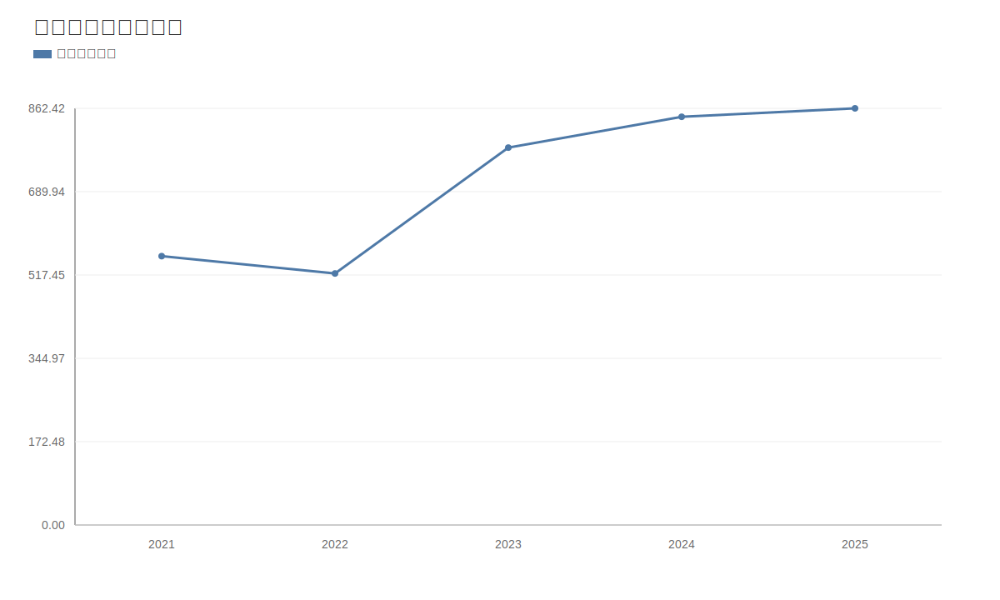

### 2. 净利润趋势图
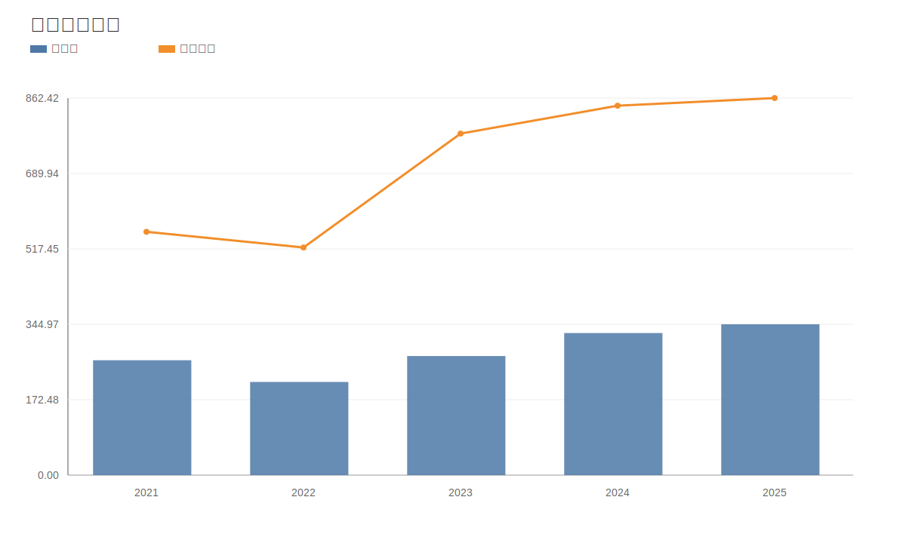

### 3. 毛利率和净利率对比图
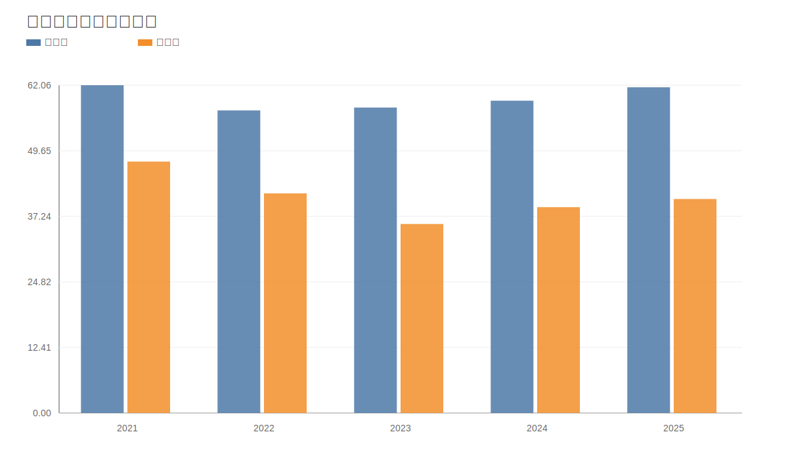

### 4. 分产品收入结构图
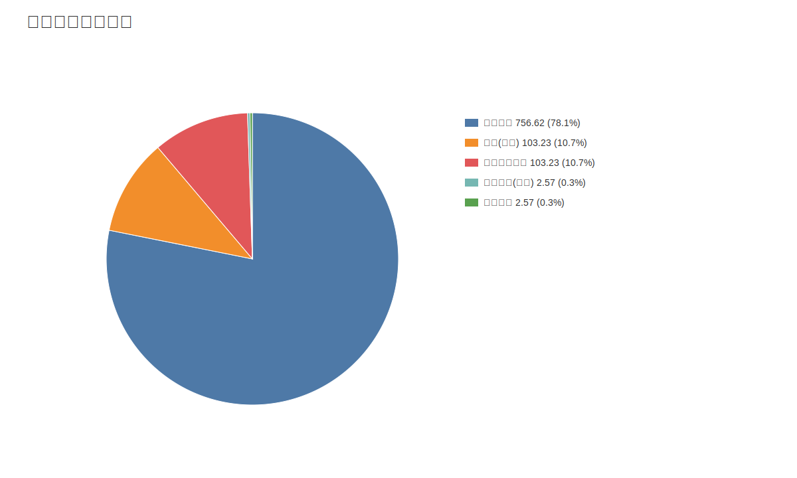

### 4. 分产品收入变化图
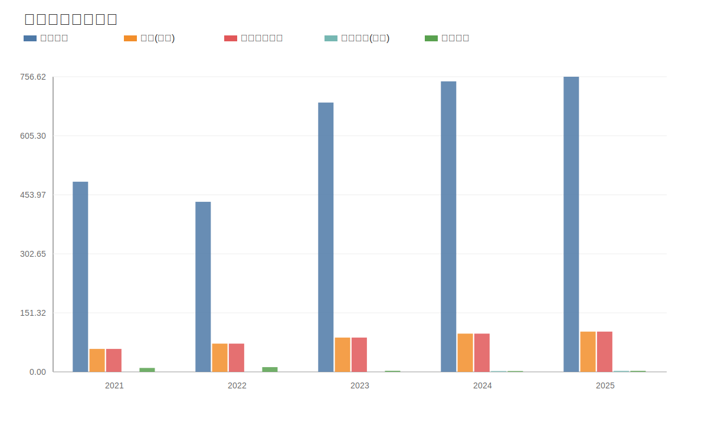

### 5. 分产品利润结构图
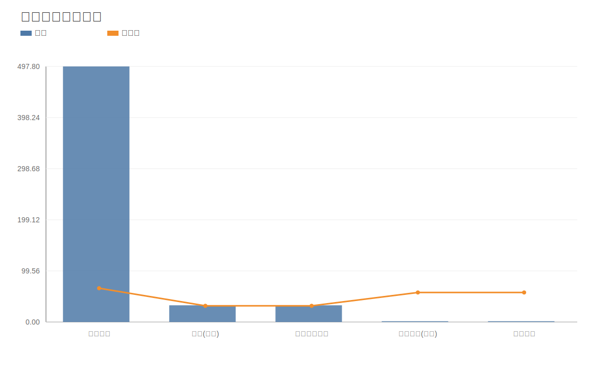

### 6. 分地区收入分布图
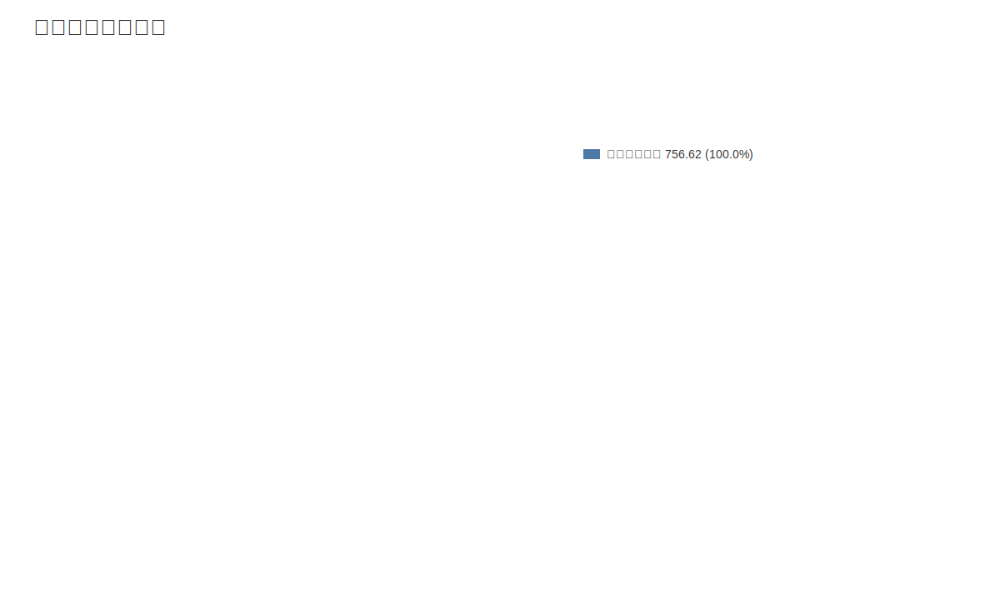

### 7. 资产负债表关键数据图
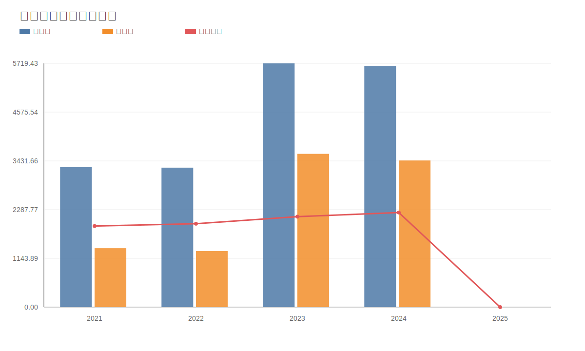

### 8. 自由现金流与经营现金流对比图
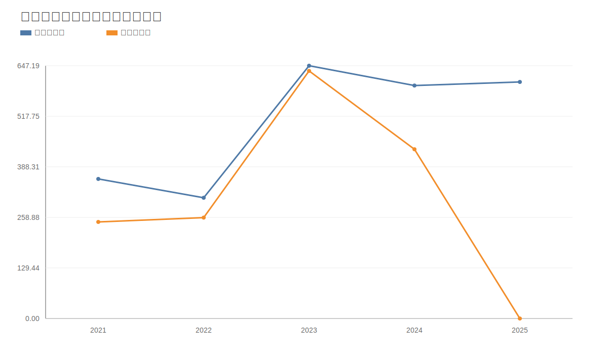

### 9. 股东回报分析图
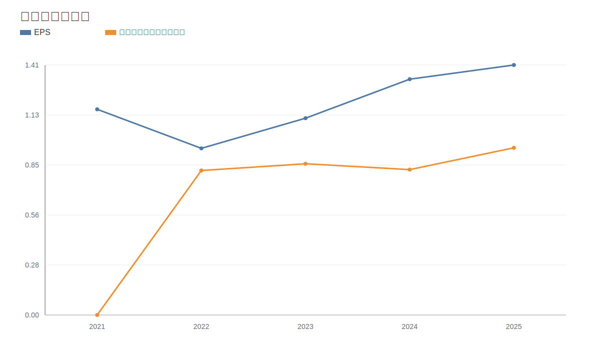

### 10. 财务比率分析图
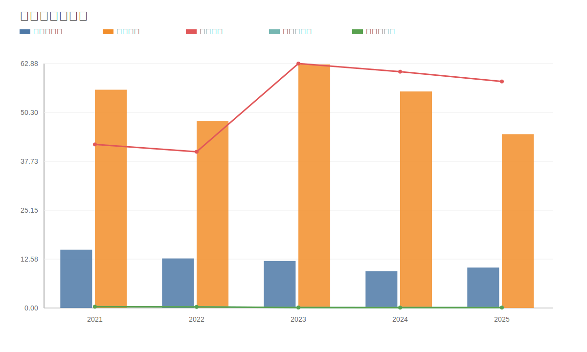

### 11. ROE与ROA对比图
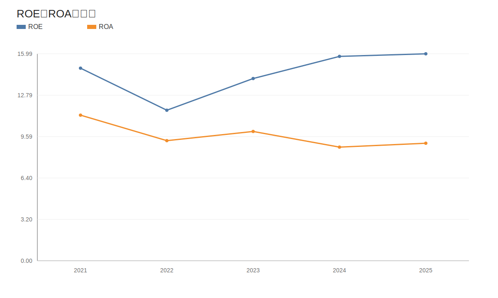
<!-- VALUE_CHARTS_END -->
