# 中国平安（601318.SH）价值分析报告草稿

- 生成时间：2026-05-13 01:36:18
- 自动化脚本：`.agents/skills/value-report/value_report_scaffold.py`
- 数据口径：数据库字段定义以 `app/models/models.py` 为准
- 公司信息：行业 保险｜地区 深圳｜上市日期 20070301
- 管理层：董事长 马明哲｜总经理 谢永林｜员工 258806
- 主营业务：主营业务:以保险业务为核心,以统一品牌向客户提供包括保险,银行,证券,信托等多元化金融服务
- 提示：本文件已自动填充定量部分，定性模块请结合最新公告与行业资料补充。

## 自动填充数据（可直接引用）
### 最新估值
- 交易日：20260511
- 收盘价：60.10 元
- PE(TTM)：8.20 倍
- PB：1.07 倍
- PS(TTM)：1.05 倍
- 股息率(TTM)：4.28%
- 总市值：10882.69 亿元

### 最新财务快照
- 报告期：20260331
- 营收：2184.05亿（同比 -6.18%）
- 归母净利润：250.22亿（同比 -7.38%）
- 经营现金流：1310.64亿（同比 -46.11%）
- 自由现金流：N/A
- 毛利率：N/A，净利率：15.23%
- ROE：2.48%，ROIC：N/A
- 资产负债率：89.88%，流动比率：N/A
- 经营现金流/利润：372.58%
- 货币资金：7257.11亿，有息负债：11085.34亿，净现金：-3828.23亿

### 近五年年报趋势
| 年度 | 营收 | 营收同比 | 归母净利 | 净利同比 | 毛利率 | 净利率 | ROE | ROIC | 资产负债率 | 经营现金流 | 自由现金流 | 现净比 |
| --- | --- | --- | --- | --- | --- | --- | --- | --- | --- | --- | --- | --- |
| 2025 | 10505.06亿 | 2.10% | 1347.78亿 | 6.45% | N/A | 15.07% | 13.97% | N/A | 89.81% | 6586.32亿 | N/A | 488.68% |
| 2024 | 10289.25亿 | 12.60% | 1266.07亿 | 47.79% | N/A | 14.26% | 13.85% | N/A | 89.93% | 3824.74亿 | N/A | 302.10% |
| 2023 | 9137.89亿 | -17.72% | 856.65亿 | 2.26% | N/A | 11.96% | 9.75% | N/A | 89.39% | 3604.03亿 | N/A | 420.71% |
| 2022 | 11105.68亿 | -5.92% | 837.74亿 | -17.56% | N/A | 9.67% | 10.03% | N/A | 89.45% | 4859.05亿 | N/A | 580.02% |
| 2021 | 11804.44亿 | N/A | 1016.18亿 | N/A | N/A | 10.32% | 12.90% | N/A | 89.37% | 901.16亿 | 7059.22亿 | 88.68% |

- 近五年营收CAGR：-2.87%
- 近五年净利CAGR：7.32%

### 分红与审计
#### 已实施分红
2025年已实施现金分红（税前）合计：每股 6.760 元
2024年已实施现金分红（税前）合计：每股 6.360 元
2023年已实施现金分红（税前）合计：每股 6.360 元
2022年已实施现金分红（税前）合计：每股 6.340 元

#### 审计意见
- 20241231：标准无保留意见（安永华明会计师事务所）
- 20231231：标准无保留意见（安永华明会计师事务所）
- 20221231：标准无保留意见（安永华明会计师事务所）
- 20211231：标准无保留意见（安永华明会计师事务所）
- 20201231：标准无保留意见（普华永道中天会计师事务所）

## ECharts 图表数据（option）

- 说明：以下 `option` 可直接用于前端图表渲染；单位已在坐标轴标注。

### 1. 主营业务收入趋势图
```json
{
  "title": {
    "text": "主营业务收入趋势（近5年）"
  },
  "tooltip": {
    "trigger": "axis"
  },
  "legend": {
    "top": 24,
    "data": [
      "主营业务收入"
    ]
  },
  "xAxis": {
    "type": "category",
    "data": [
      "2021",
      "2022",
      "2023",
      "2024",
      "2025"
    ]
  },
  "yAxis": {
    "type": "value",
    "name": "亿元"
  },
  "series": [
    {
      "name": "主营业务收入",
      "type": "line",
      "smooth": true,
      "data": [
        11804.44,
        11105.68,
        9137.89,
        10289.25,
        10505.06
      ]
    }
  ]
}
```

### 2. 净利润趋势图
```json
{
  "title": {
    "text": "净利润趋势（近5年）"
  },
  "tooltip": {
    "trigger": "axis"
  },
  "legend": {
    "top": 24,
    "data": [
      "净利润",
      "营业收入"
    ]
  },
  "xAxis": {
    "type": "category",
    "data": [
      "2021",
      "2022",
      "2023",
      "2024",
      "2025"
    ]
  },
  "yAxis": [
    {
      "type": "value",
      "name": "亿元"
    },
    {
      "type": "value",
      "name": "亿元"
    }
  ],
  "series": [
    {
      "name": "净利润",
      "type": "bar",
      "data": [
        1016.18,
        837.74,
        856.65,
        1266.07,
        1347.78
      ]
    },
    {
      "name": "营业收入",
      "type": "line",
      "yAxisIndex": 1,
      "data": [
        11804.44,
        11105.68,
        9137.89,
        10289.25,
        10505.06
      ]
    }
  ]
}
```

### 3. 毛利率和净利率对比图
```json
{
  "title": {
    "text": "毛利率 vs 净利率"
  },
  "tooltip": {
    "trigger": "axis"
  },
  "legend": {
    "top": 24,
    "data": [
      "毛利率",
      "净利率"
    ]
  },
  "xAxis": {
    "type": "category",
    "data": [
      "2021",
      "2022",
      "2023",
      "2024",
      "2025"
    ]
  },
  "yAxis": {
    "type": "value",
    "name": "%"
  },
  "series": [
    {
      "name": "毛利率",
      "type": "bar",
      "data": [
        null,
        null,
        null,
        null,
        null
      ]
    },
    {
      "name": "净利率",
      "type": "bar",
      "data": [
        10.32,
        9.67,
        11.96,
        14.26,
        15.07
      ]
    }
  ]
}
```

### 4. 分产品收入结构图
```json
{
  "title": {
    "text": "分产品收入结构（20251231）"
  },
  "tooltip": {
    "trigger": "item"
  },
  "legend": {
    "type": "scroll",
    "top": 24
  },
  "series": [
    {
      "type": "pie",
      "radius": "55%",
      "data": [
        {
          "name": "个人寿险",
          "value": 6460.28
        },
        {
          "name": "传统寿险",
          "value": 2311.09
        },
        {
          "name": "机动车辆保险",
          "value": 2303.62
        },
        {
          "name": "客户贷款",
          "value": 1302.6
        },
        {
          "name": "广东",
          "value": 1156.25
        },
        {
          "name": "年金",
          "value": 1081.55
        },
        {
          "name": "长期健康险",
          "value": 1051.57
        },
        {
          "name": "分红险",
          "value": 918.87
        }
      ]
    }
  ]
}
```

### 4. 分产品收入变化图
```json
{
  "title": {
    "text": "分产品收入变化（近5年）"
  },
  "tooltip": {
    "trigger": "axis"
  },
  "legend": {
    "type": "scroll",
    "top": 24,
    "data": [
      "个人寿险",
      "传统寿险",
      "机动车辆保险",
      "客户贷款",
      "广东"
    ]
  },
  "xAxis": {
    "type": "category",
    "data": [
      "2021",
      "2022",
      "2023",
      "2024",
      "2025"
    ]
  },
  "yAxis": {
    "type": "value",
    "name": "亿元"
  },
  "series": [
    {
      "name": "个人寿险",
      "type": "bar",
      "stack": "total",
      "data": [
        17392.94,
        16783.32,
        19000.16,
        19711.38,
        14045.32
      ]
    },
    {
      "name": "传统寿险",
      "type": "bar",
      "stack": "total",
      "data": [
        1775.34,
        1855.39,
        2601.13,
        3348.68,
        3669.63
      ]
    },
    {
      "name": "机动车辆保险",
      "type": "bar",
      "stack": "total",
      "data": [
        2780.84,
        2970.08,
        3151.99,
        3281.25,
        3389.73
      ]
    },
    {
      "name": "客户贷款",
      "type": "bar",
      "stack": "total",
      "data": [
        2549.93,
        2811.1,
        2785.41,
        2351.11,
        1975.81
      ]
    },
    {
      "name": "广东",
      "type": "bar",
      "stack": "total",
      "data": [
        1577.78,
        1520.97,
        1674.73,
        1749.96,
        1847.85
      ]
    }
  ]
}
```

### 5. 分产品利润结构图
```json
{
  "title": {
    "text": "分产品利润结构（20251231）"
  },
  "tooltip": {
    "trigger": "axis"
  },
  "legend": {
    "top": 24,
    "data": [
      "利润",
      "毛利率"
    ]
  },
  "xAxis": {
    "type": "category",
    "data": [
      "个人寿险",
      "传统寿险",
      "机动车辆保险",
      "客户贷款",
      "广东",
      "年金",
      "长期健康险",
      "分红险"
    ]
  },
  "yAxis": [
    {
      "type": "value",
      "name": "亿元"
    },
    {
      "type": "value",
      "name": "%"
    }
  ],
  "series": [
    {
      "name": "利润",
      "type": "bar",
      "data": [
        0.0,
        0.0,
        0.0,
        0.0,
        0.0,
        0.0,
        0.0,
        0.0
      ]
    },
    {
      "name": "毛利率",
      "type": "line",
      "yAxisIndex": 1,
      "data": [
        0.0,
        0.0,
        0.0,
        0.0,
        0.0,
        0.0,
        0.0,
        0.0
      ]
    }
  ]
}
```

### 6. 分地区收入分布图
```json
{
  "title": {
    "text": "分地区收入分布（20251231，数据待补）"
  },
  "tooltip": {
    "trigger": "item"
  },
  "legend": {
    "type": "scroll",
    "top": 24
  },
  "series": [
    {
      "type": "pie",
      "radius": "55%",
      "data": []
    }
  ]
}
```

### 7. 资产负债表关键数据图
```json
{
  "title": {
    "text": "资产负债表关键数据（近5年）"
  },
  "tooltip": {
    "trigger": "axis"
  },
  "legend": {
    "top": 24,
    "data": [
      "总资产",
      "总负债",
      "股东权益"
    ]
  },
  "xAxis": {
    "type": "category",
    "data": [
      "2021",
      "2022",
      "2023",
      "2024",
      "2025"
    ]
  },
  "yAxis": {
    "type": "value",
    "name": "亿元"
  },
  "series": [
    {
      "name": "总资产",
      "type": "bar",
      "stack": "capital",
      "data": [
        101420.26,
        111371.68,
        115834.17,
        129578.27,
        138984.71
      ]
    },
    {
      "name": "总负债",
      "type": "bar",
      "stack": "capital",
      "data": [
        90643.03,
        99618.7,
        103544.53,
        116531.15,
        124824.83
      ]
    },
    {
      "name": "股东权益",
      "type": "line",
      "data": [
        10777.23,
        11752.98,
        12289.64,
        13047.12,
        14159.88
      ]
    }
  ]
}
```

### 8. 自由现金流与经营现金流对比图
```json
{
  "title": {
    "text": "自由现金流 vs 经营现金流"
  },
  "tooltip": {
    "trigger": "axis"
  },
  "legend": {
    "top": 24,
    "data": [
      "经营现金流",
      "自由现金流"
    ]
  },
  "xAxis": {
    "type": "category",
    "data": [
      "2021",
      "2022",
      "2023",
      "2024",
      "2025"
    ]
  },
  "yAxis": {
    "type": "value",
    "name": "亿元"
  },
  "series": [
    {
      "name": "经营现金流",
      "type": "line",
      "data": [
        901.16,
        4859.05,
        3604.03,
        3824.74,
        6586.32
      ]
    },
    {
      "name": "自由现金流",
      "type": "line",
      "data": [
        7059.22,
        null,
        null,
        null,
        null
      ]
    }
  ]
}
```

### 9. 股东回报分析图
```json
{
  "title": {
    "text": "股东回报（EPS/分红）"
  },
  "tooltip": {
    "trigger": "axis"
  },
  "legend": {
    "top": 24,
    "data": [
      "EPS",
      "每股现金分红（已实施）"
    ]
  },
  "xAxis": {
    "type": "category",
    "data": [
      "2021",
      "2022",
      "2023",
      "2024",
      "2025"
    ]
  },
  "yAxis": {
    "type": "value",
    "name": "元"
  },
  "series": [
    {
      "name": "EPS",
      "type": "line",
      "data": [
        5.77,
        4.8,
        4.84,
        7.16,
        7.68
      ]
    },
    {
      "name": "每股现金分红（已实施）",
      "type": "line",
      "data": [
        0.0,
        6.34,
        6.36,
        6.36,
        6.76
      ]
    }
  ]
}
```

### 10. 财务比率分析图
```json
{
  "title": {
    "text": "关键财务比率（近5年）"
  },
  "tooltip": {
    "trigger": "axis"
  },
  "legend": {
    "type": "scroll",
    "top": 24,
    "data": [
      "资产负债率",
      "流动比率",
      "速动比率",
      "应收周转率",
      "存货周转率"
    ]
  },
  "xAxis": {
    "type": "category",
    "data": [
      "2021",
      "2022",
      "2023",
      "2024",
      "2025"
    ]
  },
  "yAxis": [
    {
      "type": "value",
      "name": "比率/%"
    },
    {
      "type": "value",
      "name": "周转率"
    }
  ],
  "series": [
    {
      "name": "资产负债率",
      "type": "line",
      "data": [
        89.37,
        89.45,
        89.39,
        89.93,
        89.81
      ]
    },
    {
      "name": "流动比率",
      "type": "line",
      "data": [
        null,
        null,
        null,
        null,
        null
      ]
    },
    {
      "name": "速动比率",
      "type": "line",
      "data": [
        null,
        null,
        null,
        null,
        null
      ]
    },
    {
      "name": "应收周转率",
      "type": "bar",
      "yAxisIndex": 1,
      "data": [
        null,
        null,
        null,
        null,
        null
      ]
    },
    {
      "name": "存货周转率",
      "type": "bar",
      "yAxisIndex": 1,
      "data": [
        null,
        null,
        null,
        null,
        null
      ]
    }
  ]
}
```

### 11. ROE与ROA对比图
```json
{
  "title": {
    "text": "ROE vs ROA（近5年）"
  },
  "tooltip": {
    "trigger": "axis"
  },
  "legend": {
    "top": 24,
    "data": [
      "ROE",
      "ROA"
    ]
  },
  "xAxis": {
    "type": "category",
    "data": [
      "2021",
      "2022",
      "2023",
      "2024",
      "2025"
    ]
  },
  "yAxis": {
    "type": "value",
    "name": "%"
  },
  "series": [
    {
      "name": "ROE",
      "type": "line",
      "data": [
        12.9,
        10.03,
        9.75,
        13.85,
        13.97
      ]
    },
    {
      "name": "ROA",
      "type": "line",
      "data": [
        null,
        null,
        null,
        null,
        null
      ]
    }
  ]
}
```

## 1. 公司概况（商业模式优先）
- 公司是如何赚钱的？
- 收入来源构成（核心业务占比）
- 客户类型（To B / To C / 政府）
- 是否具备持续性收入（一次性 vs 订阅/复购）
- 是否依赖单一客户或区域

### 结论
- 商业模式是否简单、可理解
- 是否具备长期可持续性

## 2. 行业与竞争格局
- 行业空间（市场规模、天花板）
- 行业阶段（成长 / 成熟 / 衰退）
- 行业增速
- 主要竞争对手
- 市场份额与行业集中度
- 公司在产业链中的位置

### 结论
- 是否属于优质赛道
- 公司是否处于有利竞争位置
- 行业未来3-5年趋势

## 3. 护城河分析（含真伪辨别）
- 品牌优势
- 成本优势
- 网络效应
- 转换成本
- 技术壁垒
- 渠道优势

### 护城河真伪辨别
- 如果产品提价 5%，客户是否会流失？
- 客户是否对价格敏感？
- 是否存在“非它不可”的使用场景？
- 替代品是否容易出现？
- 客户更换供应商的成本高不高？

### 结论
- 护城河类型
- 护城河强度：强 / 中 / 弱 / 伪护城河
- 是否具备真实定价权

## 4. 管理层与资本配置（重点）
- 管理层背景与稳定性
- 是否存在诚信问题（造假 / 处罚 / 诉讼）
- 过往战略是否理性

### 资本配置历史
- 是否长期分红
- 是否进行回购注销（而非股权激励稀释）
- 并购历史（成功 / 失败 / 频繁）
- 是否存在盲目多元化扩张
- 资本开支是否合理

### 结论
- 管理层类型：价值创造者 / 中性 / 价值毁灭者
- 是否值得长期信任

## 5. 财务分析
### 5.1 成长性
- 营收增长率（近3-5年）
- 净利润增长率
- 增长是否稳定

### 结论
- 是否具备持续成长能力

### 5.2 盈利能力
- 毛利率
- 净利率
- ROE / ROIC

### 结论
- 是否具备定价权
- 盈利质量如何

### 5.3 财务健康
- 资产负债率
- 有息负债
- 现金储备
- 短期偿债能力

### 结论
- 是否存在财务风险

### 5.4 现金流质量
- 经营现金流
- 自由现金流
- 净利润与现金流是否匹配

### 结论
- 利润是否真实
- 是否具备造血能力

## 6. 成长驱动
- 未来3-5年增长来源
- 是否依赖提价 / 扩张 / 新业务
- 增长逻辑是否清晰

### 结论
- 成长是否可持续

## 7. 风险分析（含幸存者偏差）
- 政策风险
- 行业竞争风险
- 技术替代风险
- 财务风险
- 客户集中风险

### 幸存者偏差检验
- 行业历史最差时期是什么时候？
- 当时发生了什么（金融危机 / 疫情 / 监管）？
- 公司当时表现：是否大幅亏损 / 现金流断裂 / 接近破产？
- 公司在极端情况下是：变强 / 持平 / 衰退

### 结论
- 抗风险能力：强 / 中 / 弱
- 是否属于“穿越周期公司”

## 8. 估值分析
- PE / PB / PS / PEG / EV/EBITDA
- 当前估值 vs 历史估值
- 当前估值 vs 行业对比

### 结论
- 当前是否高估 / 低估 / 合理
- 是否具备安全边际

## 9. 投资判断
### 多头逻辑
1. 
2. 
3. 

### 空头逻辑
1. 
2. 
3. 

### 核心跟踪指标
1. 
2. 
3. 

## 最终结论
- 这是否是一家好公司？
- 是否具备长期投资价值？
- 当前价格是否值得买入？
- 投资建议：买入 / 观察 / 回避

## 总评分（100分）
- 商业模式：
- 护城河：
- 管理层：
- 财务：
- 风险：
- 估值：

**最终评分：__ / 100**

## 三个终极问题（必须回答）
1. 如果提价 5%，客户会不会流失？
2. 公司赚的钱有没有被管理层浪费？
3. 在行业最差年份，公司是怎么活下来的？

<!-- VALUE_CHARTS_START -->
## 图表图片（自动生成）

### 1. 主营业务收入趋势图
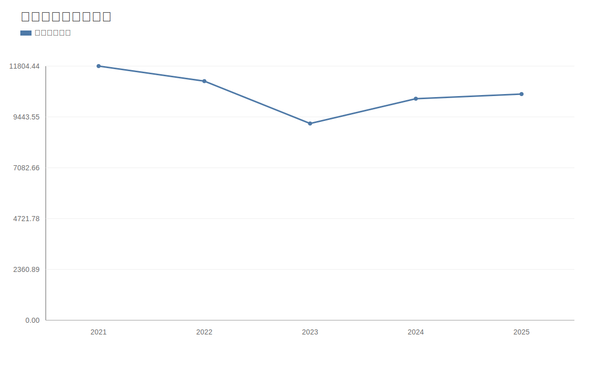

### 2. 净利润趋势图
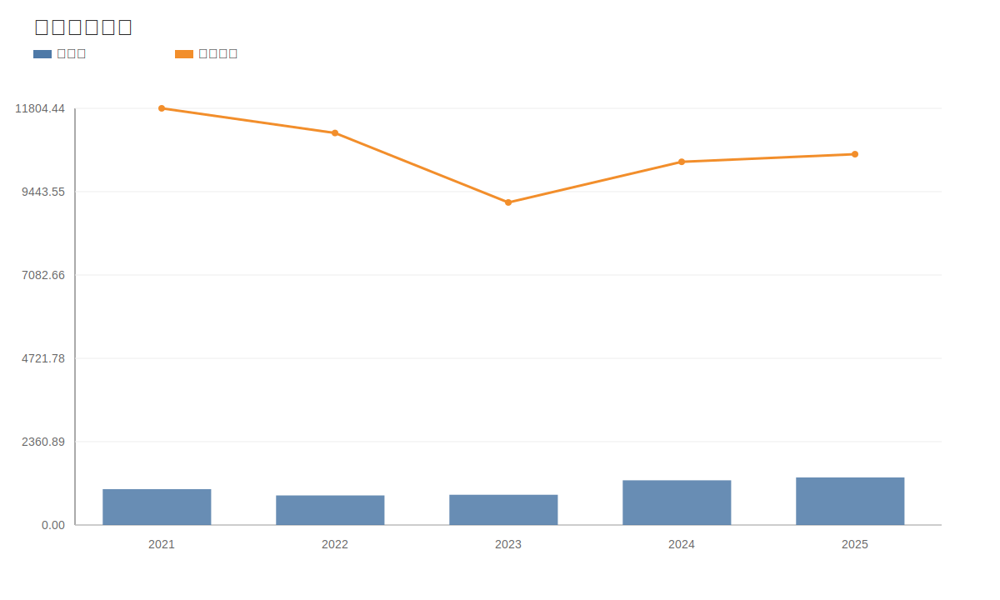

### 3. 毛利率和净利率对比图
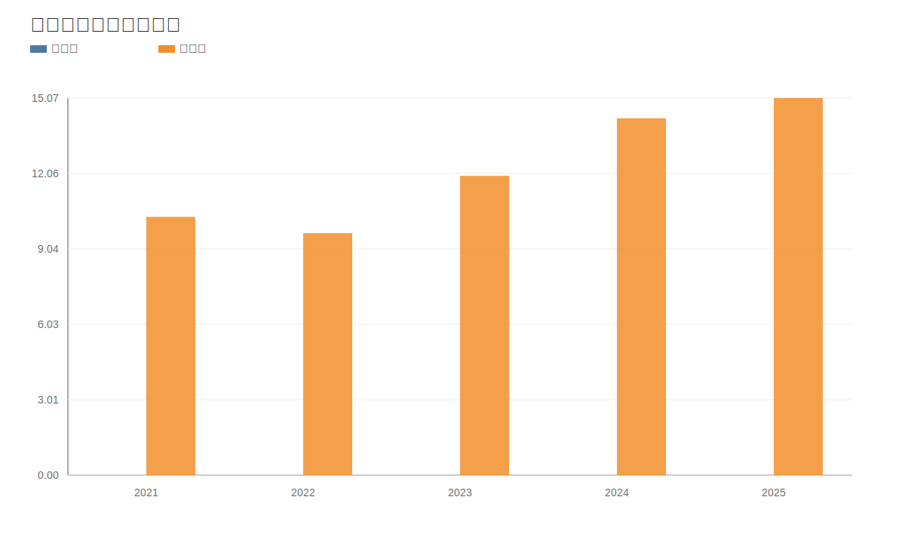

### 4. 分产品收入结构图
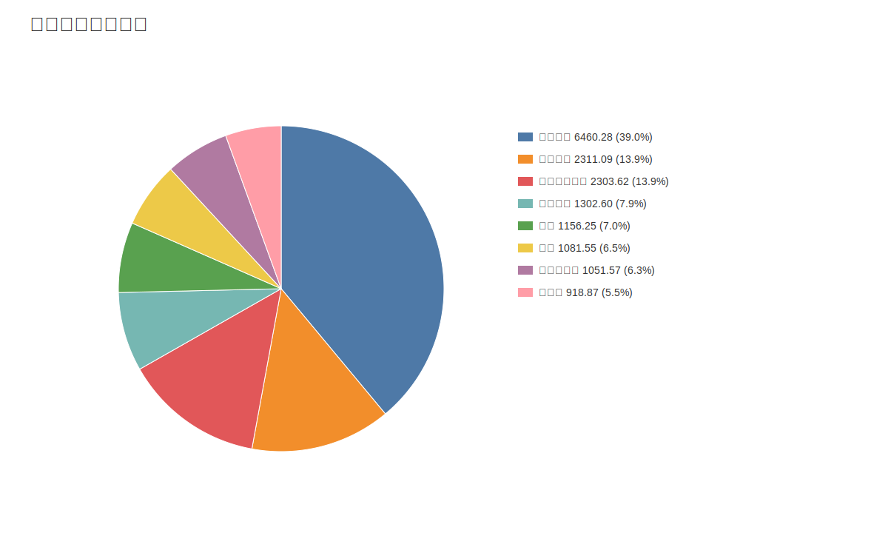

### 4. 分产品收入变化图
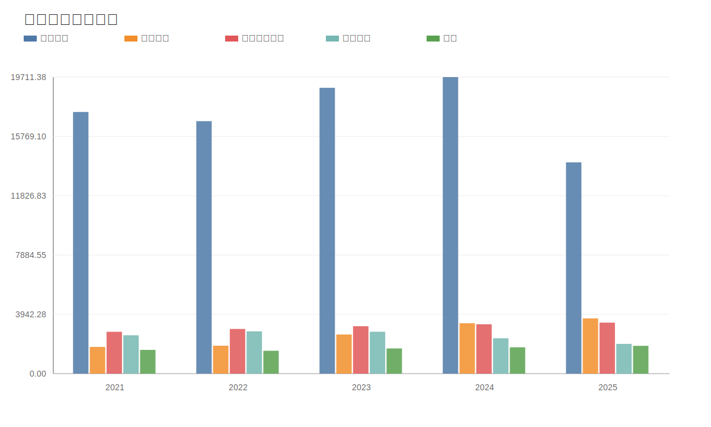

### 5. 分产品利润结构图
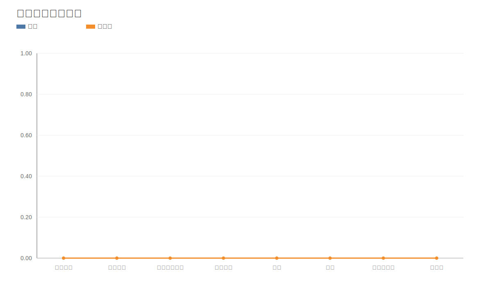

### 6. 分地区收入分布图


### 7. 资产负债表关键数据图
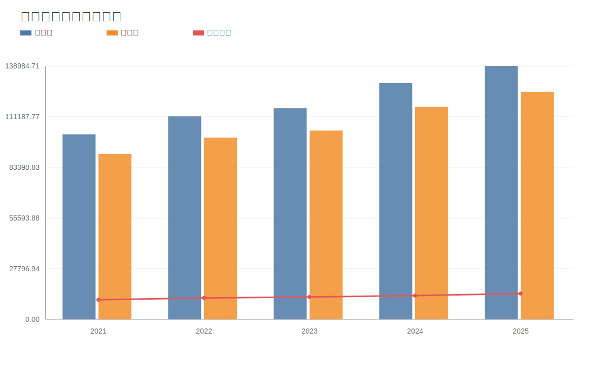

### 8. 自由现金流与经营现金流对比图
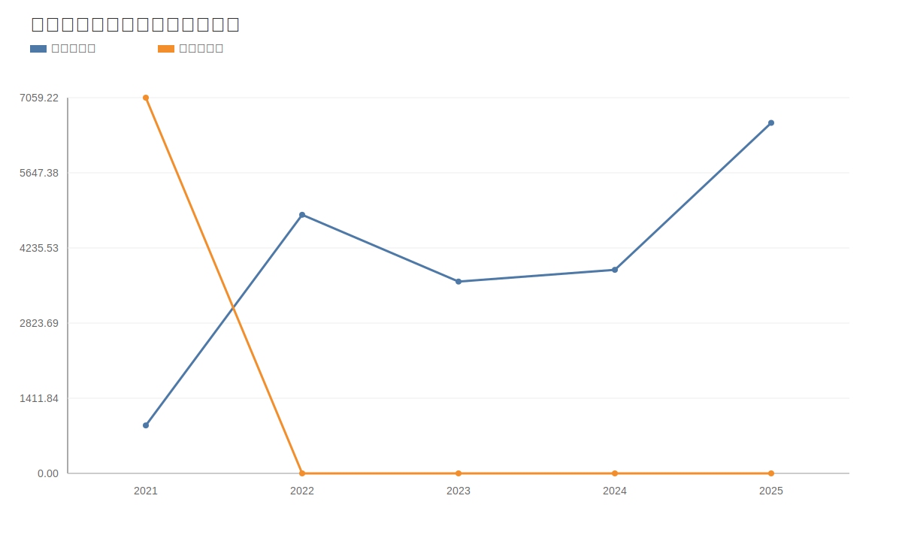

### 9. 股东回报分析图
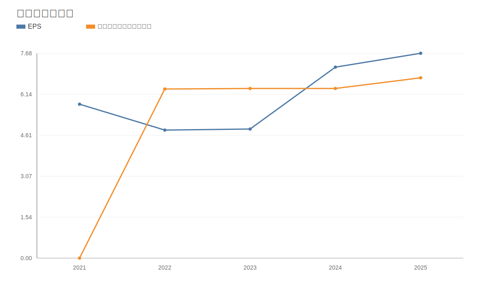

### 10. 财务比率分析图
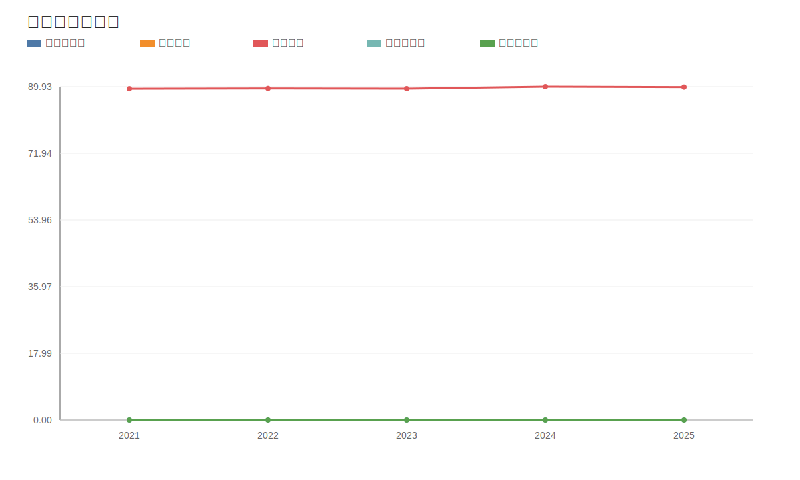

### 11. ROE与ROA对比图
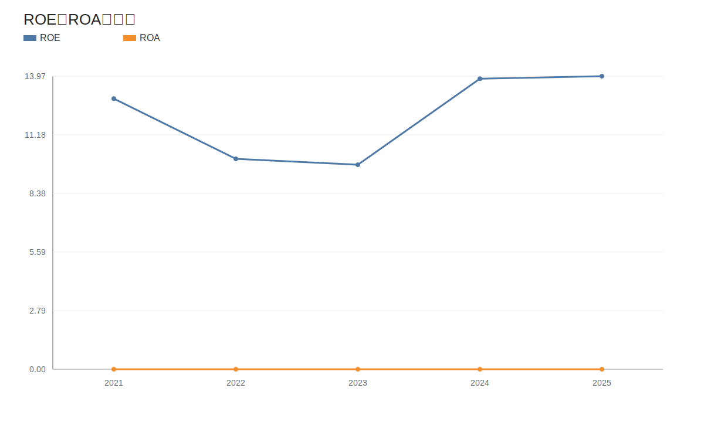
<!-- VALUE_CHARTS_END -->
