# 紫金矿业（601899.SH）价值分析报告草稿

- 生成时间：2026-05-13 01:34:59
- 自动化脚本：`.agents/skills/value-report/value_report_scaffold.py`
- 数据口径：数据库字段定义以 `app/models/models.py` 为准
- 公司信息：行业 铜｜地区 福建｜上市日期 20080425
- 管理层：董事长 邹来昌｜总经理 林泓富｜员工 66708
- 主营业务：以黄金为主导产业的矿产资源的勘探,采矿,选矿,冶炼及矿产品销售.
- 提示：本文件已自动填充定量部分，定性模块请结合最新公告与行业资料补充。

## 自动填充数据（可直接引用）
### 最新估值
- 交易日：20260511
- 收盘价：34.27 元
- PE(TTM)：14.77 倍
- PB：4.62 倍
- PS(TTM)：2.47 倍
- 股息率(TTM)：1.46%
- 总市值：9112.64 亿元

### 最新财务快照
- 报告期：20260331
- 营收：984.98亿（同比 24.79%）
- 归母净利润：200.79亿（同比 97.50%）
- 经营现金流：278.32亿（同比 122.15%）
- 自由现金流：169.84亿
- 毛利率：36.33%，净利率：25.55%
- ROE：10.40%，ROIC：5.88%
- 资产负债率：51.37%，流动比率：1.34
- 经营现金流/利润：87.79%
- 货币资金：993.93亿，有息负债：1549.35亿，净现金：-555.42亿

### 近五年年报趋势
| 年度 | 营收 | 营收同比 | 归母净利 | 净利同比 | 毛利率 | 净利率 | ROE | ROIC | 资产负债率 | 经营现金流 | 自由现金流 | 现净比 |
| --- | --- | --- | --- | --- | --- | --- | --- | --- | --- | --- | --- | --- |
| 2025 | 3490.79亿 | 14.96% | 517.77亿 | 61.55% | 27.73% | 18.28% | 31.83% | 17.55% | 51.56% | 754.30亿 | 535.69亿 | 145.68% |
| 2024 | 3036.40亿 | 3.49% | 320.51亿 | 51.76% | 20.37% | 12.97% | 25.92% | 13.47% | 55.19% | 488.60亿 | 304.30亿 | 152.45% |
| 2023 | 2934.03亿 | 8.54% | 211.19亿 | 5.38% | 15.81% | 9.05% | 21.50% | 10.90% | 59.66% | 368.60亿 | 127.30亿 | 174.53% |
| 2022 | 2703.29亿 | 20.09% | 200.42亿 | 27.88% | 15.74% | 9.16% | 25.06% | 12.53% | 59.33% | 286.79亿 | 11.93亿 | 143.09% |
| 2021 | 2251.02亿 | N/A | 156.73亿 | N/A | 15.44% | 8.71% | 24.57% | 12.87% | 55.47% | 260.72亿 | 73.01亿 | 166.35% |

- 近五年营收CAGR：11.59%
- 近五年净利CAGR：34.82%

### 分红与审计
#### 已实施分红
2025年已实施现金分红（税前）合计：每股 0.500 元
2024年已实施现金分红（税前）合计：每股 0.300 元
2023年已实施现金分红（税前）合计：每股 0.250 元
2022年已实施现金分红（税前）合计：每股 0.200 元

#### 审计意见
- 20241231：标准无保留意见（安永华明会计师事务所）
- 20231231：标准无保留意见（安永华明会计师事务所）
- 20221231：标准无保留意见（安永华明会计师事务所）
- 20211231：标准无保留意见（安永华明会计师事务所）
- 20201231：标准无保留意见（安永华明会计师事务所）

## ECharts 图表数据（option）

- 说明：以下 `option` 可直接用于前端图表渲染；单位已在坐标轴标注。

### 1. 主营业务收入趋势图
```json
{
  "title": {
    "text": "主营业务收入趋势（近5年）"
  },
  "tooltip": {
    "trigger": "axis"
  },
  "legend": {
    "top": 24,
    "data": [
      "主营业务收入"
    ]
  },
  "xAxis": {
    "type": "category",
    "data": [
      "2021",
      "2022",
      "2023",
      "2024",
      "2025"
    ]
  },
  "yAxis": {
    "type": "value",
    "name": "亿元"
  },
  "series": [
    {
      "name": "主营业务收入",
      "type": "line",
      "smooth": true,
      "data": [
        2251.02,
        2703.29,
        2934.03,
        3036.4,
        3490.79
      ]
    }
  ]
}
```

### 2. 净利润趋势图
```json
{
  "title": {
    "text": "净利润趋势（近5年）"
  },
  "tooltip": {
    "trigger": "axis"
  },
  "legend": {
    "top": 24,
    "data": [
      "净利润",
      "营业收入"
    ]
  },
  "xAxis": {
    "type": "category",
    "data": [
      "2021",
      "2022",
      "2023",
      "2024",
      "2025"
    ]
  },
  "yAxis": [
    {
      "type": "value",
      "name": "亿元"
    },
    {
      "type": "value",
      "name": "亿元"
    }
  ],
  "series": [
    {
      "name": "净利润",
      "type": "bar",
      "data": [
        156.73,
        200.42,
        211.19,
        320.51,
        517.77
      ]
    },
    {
      "name": "营业收入",
      "type": "line",
      "yAxisIndex": 1,
      "data": [
        2251.02,
        2703.29,
        2934.03,
        3036.4,
        3490.79
      ]
    }
  ]
}
```

### 3. 毛利率和净利率对比图
```json
{
  "title": {
    "text": "毛利率 vs 净利率"
  },
  "tooltip": {
    "trigger": "axis"
  },
  "legend": {
    "top": 24,
    "data": [
      "毛利率",
      "净利率"
    ]
  },
  "xAxis": {
    "type": "category",
    "data": [
      "2021",
      "2022",
      "2023",
      "2024",
      "2025"
    ]
  },
  "yAxis": {
    "type": "value",
    "name": "%"
  },
  "series": [
    {
      "name": "毛利率",
      "type": "bar",
      "data": [
        15.44,
        15.74,
        15.81,
        20.37,
        27.73
      ]
    },
    {
      "name": "净利率",
      "type": "bar",
      "data": [
        8.71,
        9.16,
        9.05,
        12.97,
        18.28
      ]
    }
  ]
}
```

### 4. 分产品收入结构图
```json
{
  "title": {
    "text": "分产品收入结构（20251231）"
  },
  "tooltip": {
    "trigger": "item"
  },
  "legend": {
    "type": "scroll",
    "top": 24
  },
  "series": [
    {
      "type": "pie",
      "radius": "55%",
      "data": [
        {
          "name": "其他主营业务",
          "value": 2685.71
        },
        {
          "name": "国外",
          "value": 1986.76
        },
        {
          "name": "冶炼加工金",
          "value": 1258.22
        },
        {
          "name": "冶炼产铜",
          "value": 499.68
        },
        {
          "name": "铜精矿",
          "value": 423.77
        },
        {
          "name": "金锭",
          "value": 397.58
        },
        {
          "name": "金精矿",
          "value": 249.17
        },
        {
          "name": "矿山产电解铜",
          "value": 88.05
        }
      ]
    }
  ]
}
```

### 4. 分产品收入变化图
```json
{
  "title": {
    "text": "分产品收入变化（近5年）"
  },
  "tooltip": {
    "trigger": "axis"
  },
  "legend": {
    "type": "scroll",
    "top": 24,
    "data": [
      "其他主营业务",
      "国外",
      "冶炼加工金",
      "冶炼产铜",
      "铜精矿"
    ]
  },
  "xAxis": {
    "type": "category",
    "data": [
      "2021",
      "2022",
      "2023",
      "2024",
      "2025"
    ]
  },
  "yAxis": {
    "type": "value",
    "name": "亿元"
  },
  "series": [
    {
      "name": "其他主营业务",
      "type": "bar",
      "stack": "total",
      "data": [
        1862.34,
        2541.24,
        2101.14,
        2284.78,
        2967.92
      ]
    },
    {
      "name": "国外",
      "type": "bar",
      "stack": "total",
      "data": [
        674.16,
        856.23,
        891.68,
        1314.71,
        1986.76
      ]
    },
    {
      "name": "冶炼加工金",
      "type": "bar",
      "stack": "total",
      "data": [
        1482.59,
        1508.21,
        1628.81,
        1255.01,
        1258.22
      ]
    },
    {
      "name": "冶炼产铜",
      "type": "bar",
      "stack": "total",
      "data": [
        560.76,
        631.53,
        655.05,
        493.61,
        499.68
      ]
    },
    {
      "name": "铜精矿",
      "type": "bar",
      "stack": "total",
      "data": [
        281.38,
        444.46,
        480.33,
        349.55,
        423.77
      ]
    }
  ]
}
```

### 5. 分产品利润结构图
```json
{
  "title": {
    "text": "分产品利润结构（20251231）"
  },
  "tooltip": {
    "trigger": "axis"
  },
  "legend": {
    "top": 24,
    "data": [
      "利润",
      "毛利率"
    ]
  },
  "xAxis": {
    "type": "category",
    "data": [
      "其他主营业务",
      "国外",
      "冶炼加工金",
      "冶炼产铜",
      "铜精矿",
      "金锭",
      "金精矿",
      "矿山产电解铜"
    ]
  },
  "yAxis": [
    {
      "type": "value",
      "name": "亿元"
    },
    {
      "type": "value",
      "name": "%"
    }
  ],
  "series": [
    {
      "name": "利润",
      "type": "bar",
      "data": [
        218.19,
        533.97,
        13.02,
        10.41,
        274.8,
        233.74,
        184.12,
        43.15
      ]
    },
    {
      "name": "毛利率",
      "type": "line",
      "yAxisIndex": 1,
      "data": [
        8.12,
        26.88,
        1.03,
        2.08,
        64.85,
        58.79,
        73.89,
        49.01
      ]
    }
  ]
}
```

### 6. 分地区收入分布图
```json
{
  "title": {
    "text": "分地区收入分布（20251231）"
  },
  "tooltip": {
    "trigger": "item"
  },
  "legend": {
    "type": "scroll",
    "top": 24
  },
  "series": [
    {
      "type": "pie",
      "radius": "55%",
      "data": [
        {
          "name": "中国大陆",
          "value": 3853.74
        },
        {
          "name": "其他业务(地区)",
          "value": 0.0
        },
        {
          "name": "内部抵销(地区)",
          "value": -2349.7
        }
      ]
    }
  ]
}
```

### 7. 资产负债表关键数据图
```json
{
  "title": {
    "text": "资产负债表关键数据（近5年）"
  },
  "tooltip": {
    "trigger": "axis"
  },
  "legend": {
    "top": 24,
    "data": [
      "总资产",
      "总负债",
      "股东权益"
    ]
  },
  "xAxis": {
    "type": "category",
    "data": [
      "2021",
      "2022",
      "2023",
      "2024",
      "2025"
    ]
  },
  "yAxis": {
    "type": "value",
    "name": "亿元"
  },
  "series": [
    {
      "name": "总资产",
      "type": "bar",
      "stack": "capital",
      "data": [
        2085.95,
        3060.44,
        3430.06,
        3966.11,
        5120.05
      ]
    },
    {
      "name": "总负债",
      "type": "bar",
      "stack": "capital",
      "data": [
        1156.98,
        1815.89,
        2046.43,
        2188.8,
        2639.83
      ]
    },
    {
      "name": "股东权益",
      "type": "line",
      "data": [
        928.97,
        1244.55,
        1383.63,
        1777.31,
        2480.23
      ]
    }
  ]
}
```

### 8. 自由现金流与经营现金流对比图
```json
{
  "title": {
    "text": "自由现金流 vs 经营现金流"
  },
  "tooltip": {
    "trigger": "axis"
  },
  "legend": {
    "top": 24,
    "data": [
      "经营现金流",
      "自由现金流"
    ]
  },
  "xAxis": {
    "type": "category",
    "data": [
      "2021",
      "2022",
      "2023",
      "2024",
      "2025"
    ]
  },
  "yAxis": {
    "type": "value",
    "name": "亿元"
  },
  "series": [
    {
      "name": "经营现金流",
      "type": "line",
      "data": [
        260.72,
        286.79,
        368.6,
        488.6,
        754.3
      ]
    },
    {
      "name": "自由现金流",
      "type": "line",
      "data": [
        73.01,
        11.93,
        127.3,
        304.3,
        535.69
      ]
    }
  ]
}
```

### 9. 股东回报分析图
```json
{
  "title": {
    "text": "股东回报（EPS/分红）"
  },
  "tooltip": {
    "trigger": "axis"
  },
  "legend": {
    "top": 24,
    "data": [
      "EPS",
      "每股现金分红（已实施）"
    ]
  },
  "xAxis": {
    "type": "category",
    "data": [
      "2021",
      "2022",
      "2023",
      "2024",
      "2025"
    ]
  },
  "yAxis": {
    "type": "value",
    "name": "元"
  },
  "series": [
    {
      "name": "EPS",
      "type": "line",
      "data": [
        0.6,
        0.76,
        0.8,
        1.21,
        1.95
      ]
    },
    {
      "name": "每股现金分红（已实施）",
      "type": "line",
      "data": [
        0.0,
        0.2,
        0.25,
        0.3,
        0.5
      ]
    }
  ]
}
```

### 10. 财务比率分析图
```json
{
  "title": {
    "text": "关键财务比率（近5年）"
  },
  "tooltip": {
    "trigger": "axis"
  },
  "legend": {
    "type": "scroll",
    "top": 24,
    "data": [
      "资产负债率",
      "流动比率",
      "速动比率",
      "应收周转率",
      "存货周转率"
    ]
  },
  "xAxis": {
    "type": "category",
    "data": [
      "2021",
      "2022",
      "2023",
      "2024",
      "2025"
    ]
  },
  "yAxis": [
    {
      "type": "value",
      "name": "比率/%"
    },
    {
      "type": "value",
      "name": "周转率"
    }
  ],
  "series": [
    {
      "name": "资产负债率",
      "type": "line",
      "data": [
        55.47,
        59.33,
        59.66,
        55.19,
        51.56
      ]
    },
    {
      "name": "流动比率",
      "type": "line",
      "data": [
        0.94,
        1.12,
        0.92,
        0.99,
        1.14
      ]
    },
    {
      "name": "速动比率",
      "type": "line",
      "data": [
        0.55,
        0.72,
        0.57,
        0.66,
        0.84
      ]
    },
    {
      "name": "应收周转率",
      "type": "bar",
      "yAxisIndex": 1,
      "data": [
        125.52,
        52.18,
        37.39,
        41.62,
        43.31
      ]
    },
    {
      "name": "存货周转率",
      "type": "bar",
      "yAxisIndex": 1,
      "data": [
        10.19,
        9.37,
        8.27,
        7.47,
        6.73
      ]
    }
  ]
}
```

### 11. ROE与ROA对比图
```json
{
  "title": {
    "text": "ROE vs ROA（近5年）"
  },
  "tooltip": {
    "trigger": "axis"
  },
  "legend": {
    "top": 24,
    "data": [
      "ROE",
      "ROA"
    ]
  },
  "xAxis": {
    "type": "category",
    "data": [
      "2021",
      "2022",
      "2023",
      "2024",
      "2025"
    ]
  },
  "yAxis": {
    "type": "value",
    "name": "%"
  },
  "series": [
    {
      "name": "ROE",
      "type": "line",
      "data": [
        24.57,
        25.06,
        21.5,
        25.92,
        31.83
      ]
    },
    {
      "name": "ROA",
      "type": "line",
      "data": [
        13.38,
        12.47,
        10.56,
        13.53,
        18.06
      ]
    }
  ]
}
```

## 1. 公司概况（商业模式优先）
- 公司是如何赚钱的？
- 收入来源构成（核心业务占比）
- 客户类型（To B / To C / 政府）
- 是否具备持续性收入（一次性 vs 订阅/复购）
- 是否依赖单一客户或区域

### 结论
- 商业模式是否简单、可理解
- 是否具备长期可持续性

## 2. 行业与竞争格局
- 行业空间（市场规模、天花板）
- 行业阶段（成长 / 成熟 / 衰退）
- 行业增速
- 主要竞争对手
- 市场份额与行业集中度
- 公司在产业链中的位置

### 结论
- 是否属于优质赛道
- 公司是否处于有利竞争位置
- 行业未来3-5年趋势

## 3. 护城河分析（含真伪辨别）
- 品牌优势
- 成本优势
- 网络效应
- 转换成本
- 技术壁垒
- 渠道优势

### 护城河真伪辨别
- 如果产品提价 5%，客户是否会流失？
- 客户是否对价格敏感？
- 是否存在“非它不可”的使用场景？
- 替代品是否容易出现？
- 客户更换供应商的成本高不高？

### 结论
- 护城河类型
- 护城河强度：强 / 中 / 弱 / 伪护城河
- 是否具备真实定价权

## 4. 管理层与资本配置（重点）
- 管理层背景与稳定性
- 是否存在诚信问题（造假 / 处罚 / 诉讼）
- 过往战略是否理性

### 资本配置历史
- 是否长期分红
- 是否进行回购注销（而非股权激励稀释）
- 并购历史（成功 / 失败 / 频繁）
- 是否存在盲目多元化扩张
- 资本开支是否合理

### 结论
- 管理层类型：价值创造者 / 中性 / 价值毁灭者
- 是否值得长期信任

## 5. 财务分析
### 5.1 成长性
- 营收增长率（近3-5年）
- 净利润增长率
- 增长是否稳定

### 结论
- 是否具备持续成长能力

### 5.2 盈利能力
- 毛利率
- 净利率
- ROE / ROIC

### 结论
- 是否具备定价权
- 盈利质量如何

### 5.3 财务健康
- 资产负债率
- 有息负债
- 现金储备
- 短期偿债能力

### 结论
- 是否存在财务风险

### 5.4 现金流质量
- 经营现金流
- 自由现金流
- 净利润与现金流是否匹配

### 结论
- 利润是否真实
- 是否具备造血能力

## 6. 成长驱动
- 未来3-5年增长来源
- 是否依赖提价 / 扩张 / 新业务
- 增长逻辑是否清晰

### 结论
- 成长是否可持续

## 7. 风险分析（含幸存者偏差）
- 政策风险
- 行业竞争风险
- 技术替代风险
- 财务风险
- 客户集中风险

### 幸存者偏差检验
- 行业历史最差时期是什么时候？
- 当时发生了什么（金融危机 / 疫情 / 监管）？
- 公司当时表现：是否大幅亏损 / 现金流断裂 / 接近破产？
- 公司在极端情况下是：变强 / 持平 / 衰退

### 结论
- 抗风险能力：强 / 中 / 弱
- 是否属于“穿越周期公司”

## 8. 估值分析
- PE / PB / PS / PEG / EV/EBITDA
- 当前估值 vs 历史估值
- 当前估值 vs 行业对比

### 结论
- 当前是否高估 / 低估 / 合理
- 是否具备安全边际

## 9. 投资判断
### 多头逻辑
1. 
2. 
3. 

### 空头逻辑
1. 
2. 
3. 

### 核心跟踪指标
1. 
2. 
3. 

## 最终结论
- 这是否是一家好公司？
- 是否具备长期投资价值？
- 当前价格是否值得买入？
- 投资建议：买入 / 观察 / 回避

## 总评分（100分）
- 商业模式：
- 护城河：
- 管理层：
- 财务：
- 风险：
- 估值：

**最终评分：__ / 100**

## 三个终极问题（必须回答）
1. 如果提价 5%，客户会不会流失？
2. 公司赚的钱有没有被管理层浪费？
3. 在行业最差年份，公司是怎么活下来的？

<!-- VALUE_CHARTS_START -->
## 图表图片（自动生成）

### 1. 主营业务收入趋势图
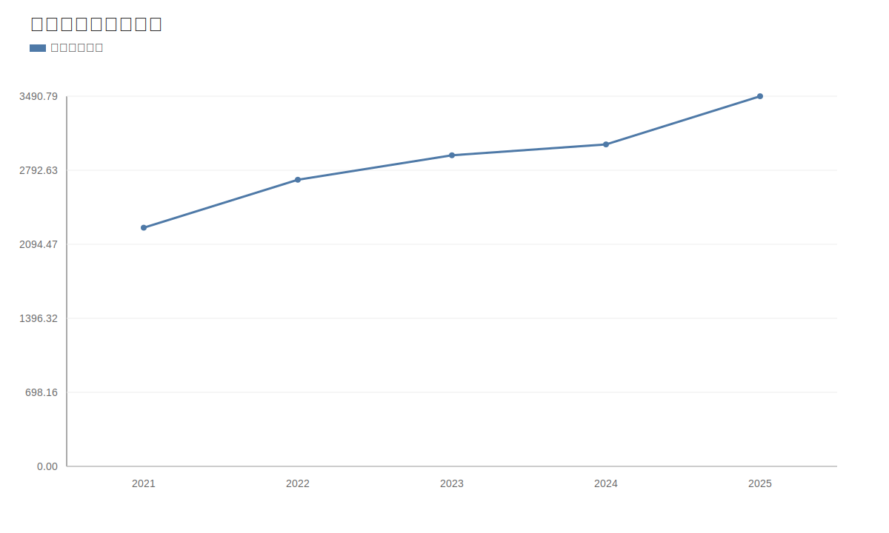

### 2. 净利润趋势图
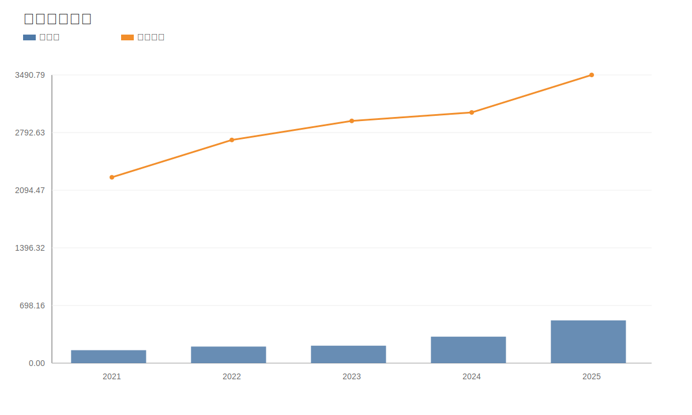

### 3. 毛利率和净利率对比图
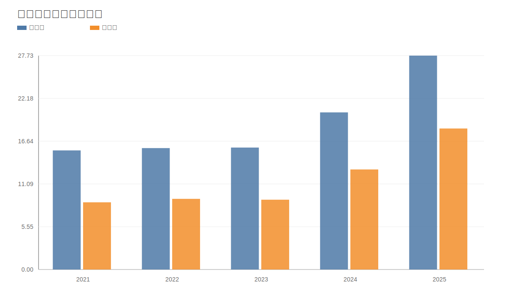

### 4. 分产品收入结构图
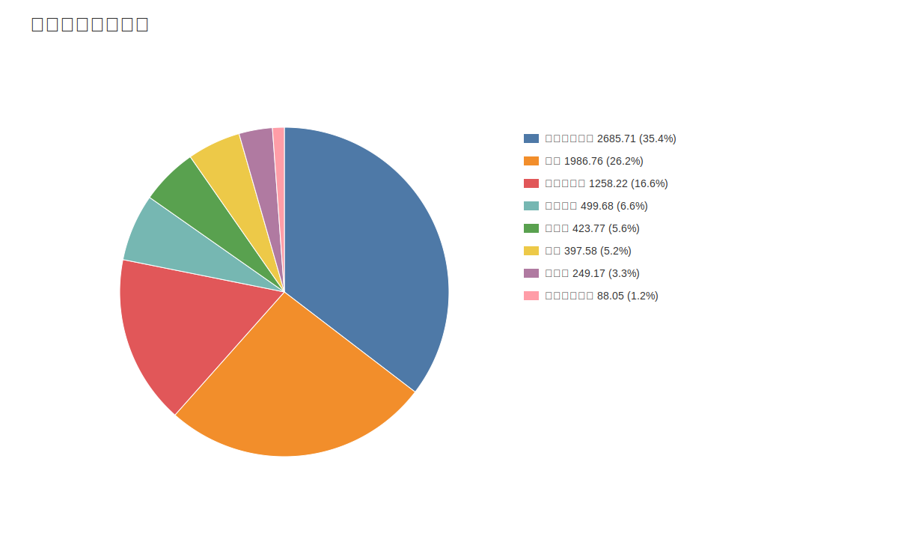

### 4. 分产品收入变化图
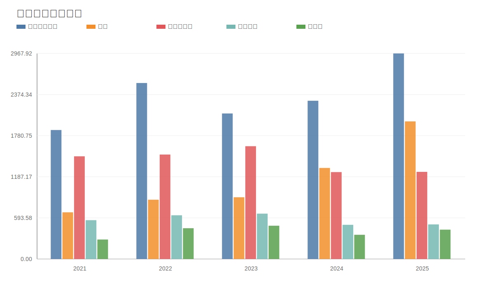

### 5. 分产品利润结构图
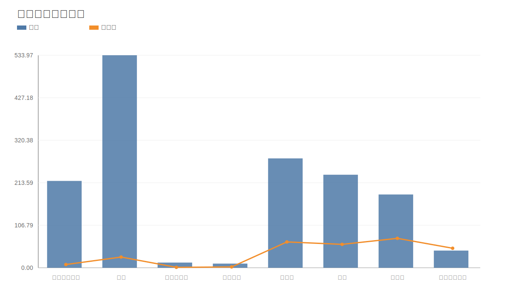

### 6. 分地区收入分布图
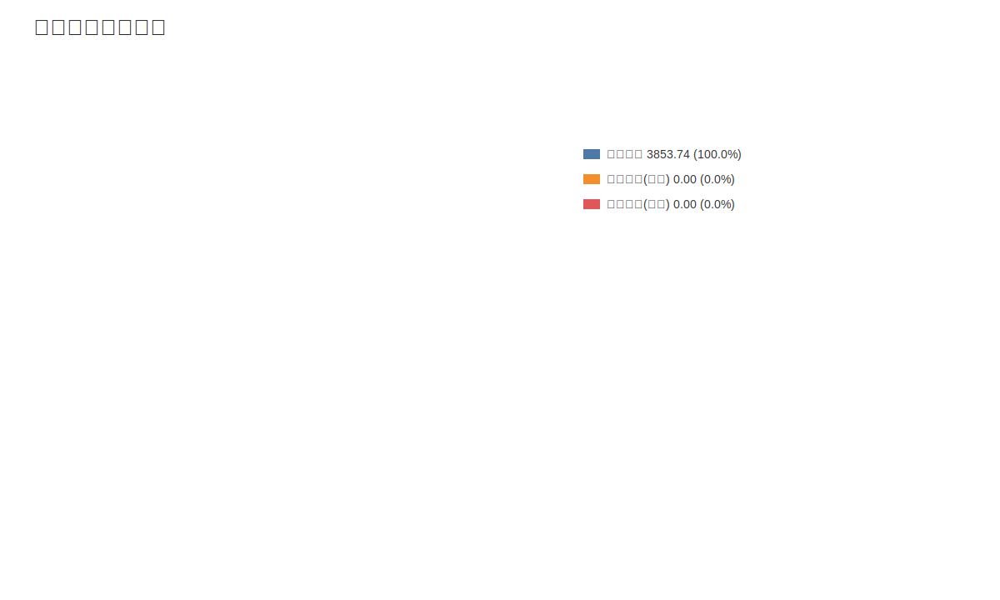

### 7. 资产负债表关键数据图
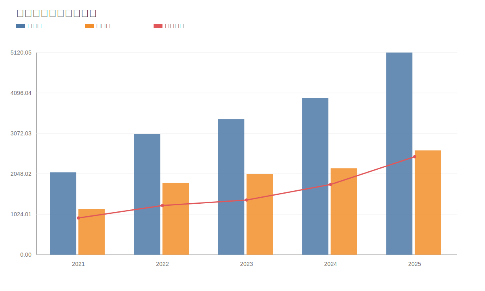

### 8. 自由现金流与经营现金流对比图
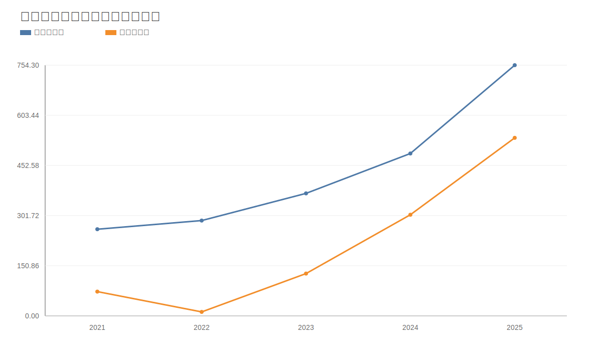

### 9. 股东回报分析图
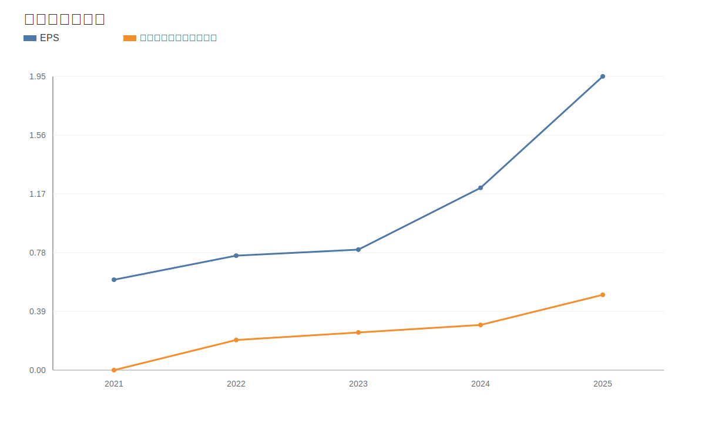

### 10. 财务比率分析图
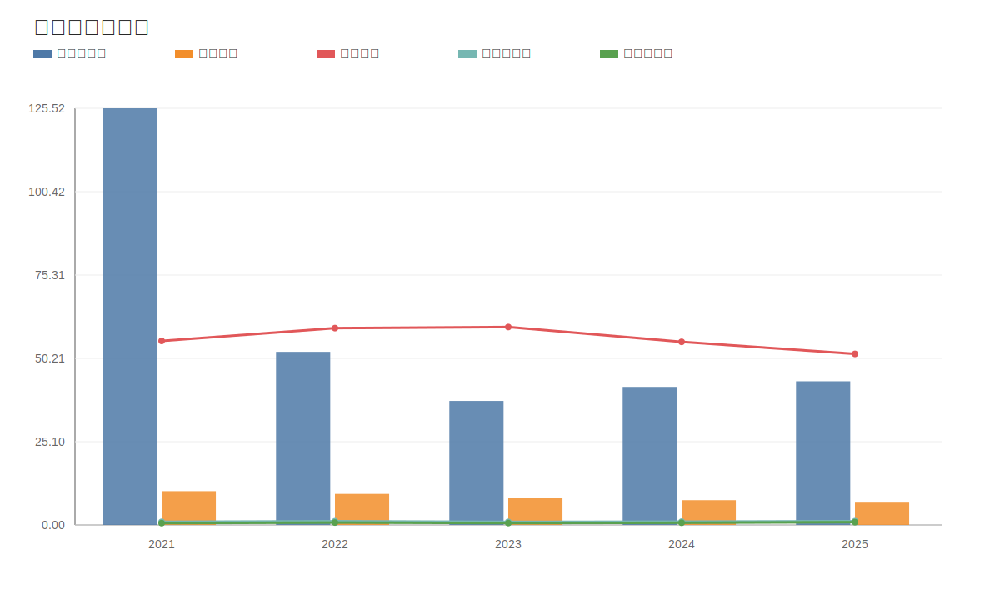

### 11. ROE与ROA对比图
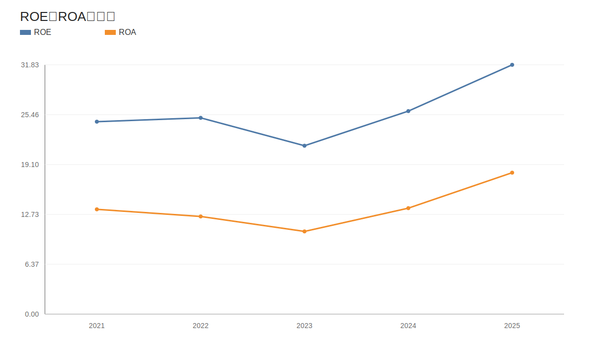
<!-- VALUE_CHARTS_END -->
