# 海天味业（603288.SH）深度价值研究报告

- 报告日期：2026-04-18 16:36:49
- 数据口径：`tushare-data` + 本地数据库（主口径）
- 价格日期：2026-04-17
- 财报日期：2025-12-31
- 重要说明：涉及“当前/最新”均以以上绝对日期为准。

## 1. 公司概况（商业模式优先）
公司以酱油、蚝油、酱类及复合调味品为核心，依托经销体系与终端覆盖实现高频复购。2025 年收入结构中，酱油约占 51.7%，蚝油约占 16.9%，酱类约占 10.1%。渠道上仍以线下为主（约 89.2%）。  
结论：商业模式简单、可理解，且现金回款特征明显。  
事实：2025 年营收 288.73 亿元，归母净利 70.38 亿元，经营现金流 77.46 亿元。  
推断：公司处于“成熟消费现金牛”阶段。

## 2. 行业与竞争格局
调味品赛道需求稳定但增速趋缓，行业从增量扩张转向存量博弈。海天对比区域品牌在品牌认知、供应链和渠道密度上仍具优势。白酒龙头可作为消费品估值锚，但与调味品成长性和周期属性并不完全同类。  
结论：属于优质但成熟赛道，竞争强度中高。  
事实：2023 年公司营收/净利阶段性回落，2024-2025 连续修复。  
推断：未来超额收益更多来自份额与效率，而非行业高景气。

## 3. 护城河分析（含真伪辨别）
护城河来源于品牌心智、经销网络、规模化制造与供应链效率。对“提价 5% 是否流失”问题，调味品在家庭和餐饮中的支出占比低、替代成本存在，短期可承受一定提价；但行业成熟后提价频率受竞争与渠道议价限制。  
结论：护城河强度中偏强，真实但非无限扩张型。  
事实：2025 年毛利率 40.22%，净利率 24.40%，较 2023 年改善。  
推断：公司具备稳态定价权，但难以长期依赖提价驱动高增长。

## 4. 管理层与资本配置
管理层长期稳定，审计意见连续标准无保留。资本配置上，公司保留高现金储备、低杠杆，分红延续性较好，未见高风险多元化并购。  
结论：管理层偏“稳健价值创造者”。  
事实：2025 年末净现金约 244.63 亿元；有息负债/总资产约 0.27%。  
推断：资本配置失误概率较低，但也意味着进攻性扩张有限。

## 5. 财务分析（成长/盈利/健康/现金流）
5.1 成长性：2025 年营收同比 +7.33%，净利同比 +10.94%；2021-2025 营收 CAGR 4.23%，净利 CAGR -0.23%。  
5.2 盈利能力：2025 年 ROE 19.49%，ROIC 17.60%，净利率 24.40%。  
5.3 财务健康：资产负债率 19.82%，流动比率 3.85，速动比率 3.61。  
5.4 现金流质量：经营现金流/净利润约 110.1%，利润现金化较好；自由现金流 2025 年同比下降（高基数+投资节奏扰动）。  
结论：财务质量高、偿债安全边际高，增长弹性中等。  
事实：2025 年自由现金流 68.97 亿元，同比 -38.53%。  
推断：公司回报特征偏“稳现金流+稳分红”。

## 图表区块（自动注入）
<!-- VALUE_CHARTS_START -->
## 图表图片（自动生成）

### 1. 主营业务收入趋势图
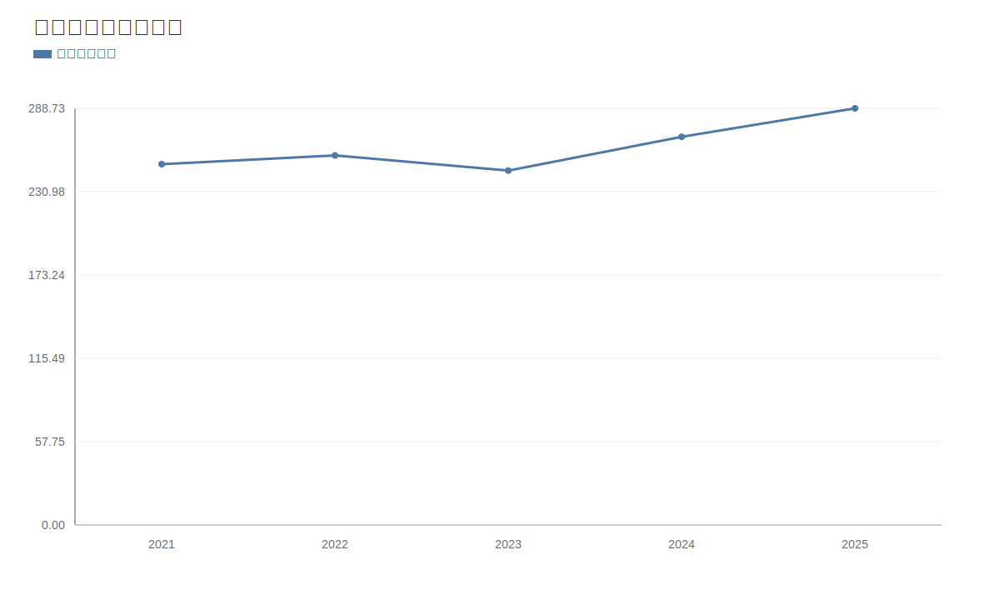

### 2. 净利润趋势图
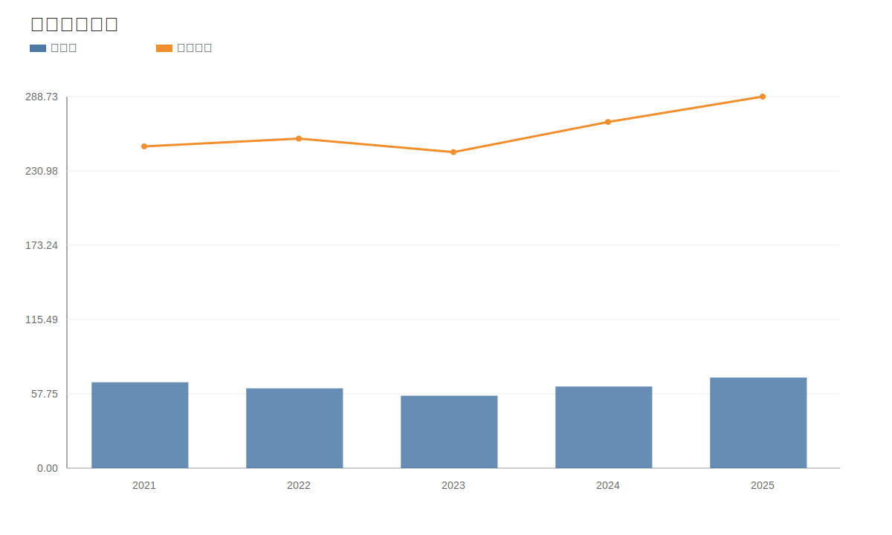

### 3. 毛利率和净利率对比图
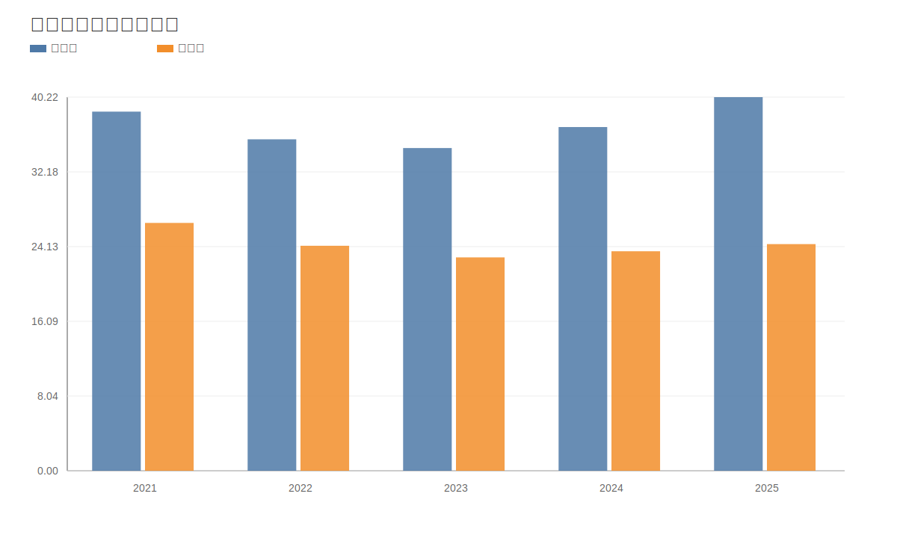

### 4. 分产品收入结构图
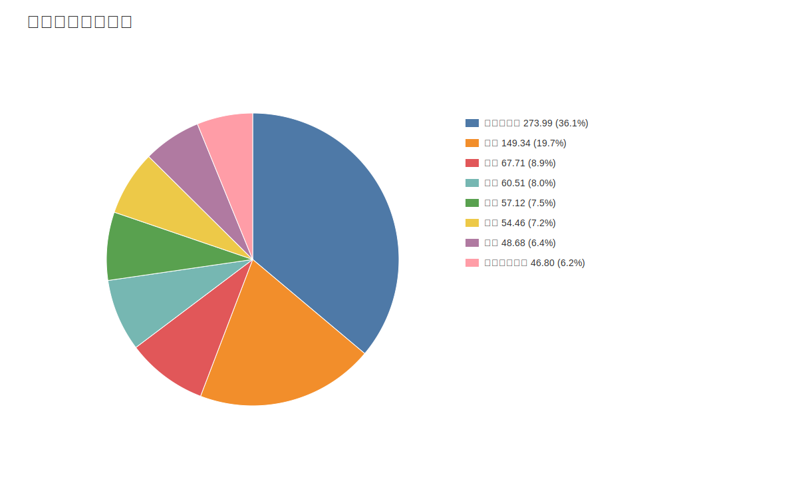

### 4. 分产品收入变化图
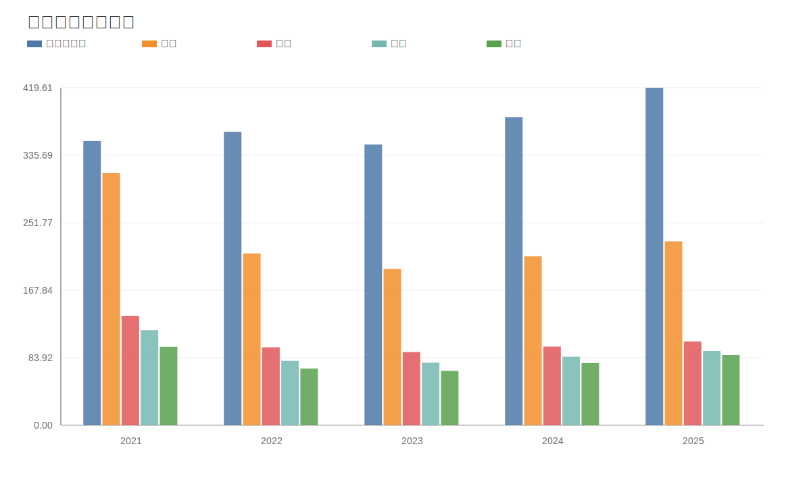

### 5. 分产品利润结构图
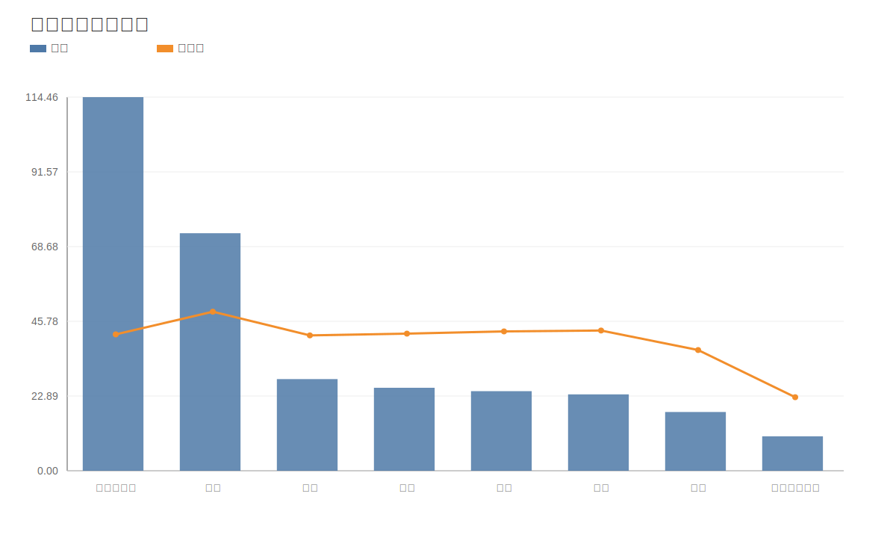

### 6. 分地区收入分布图
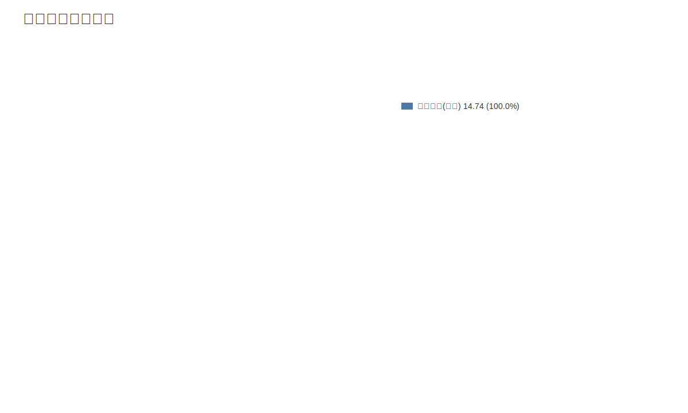

### 7. 资产负债表关键数据图
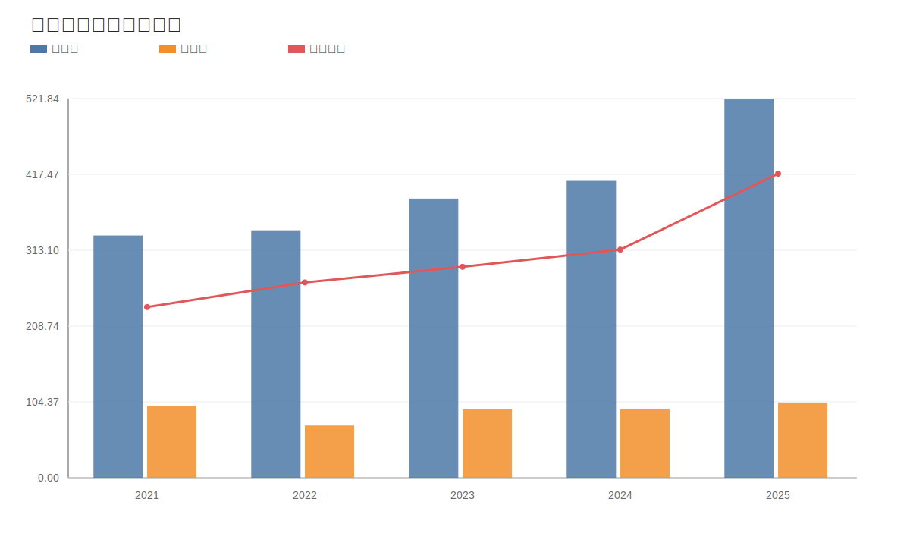

### 8. 自由现金流与经营现金流对比图
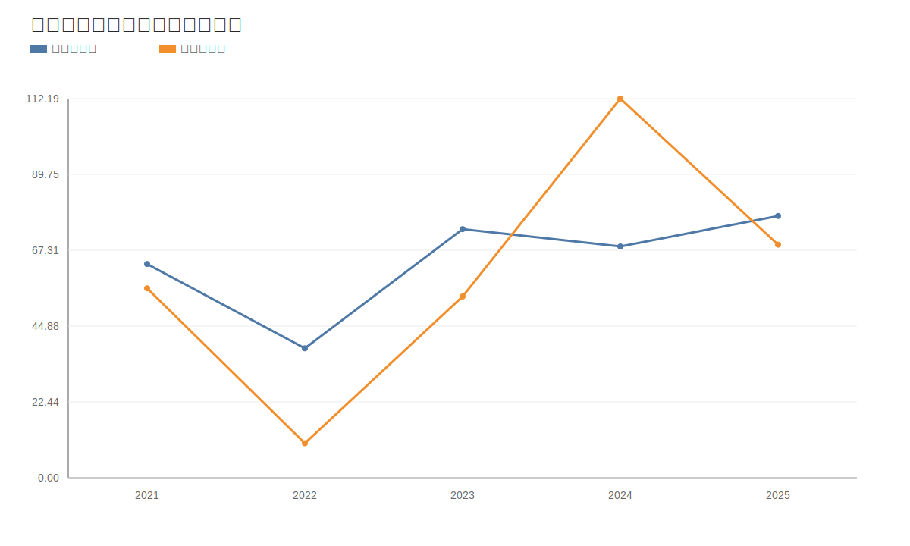

### 9. 股东回报分析图
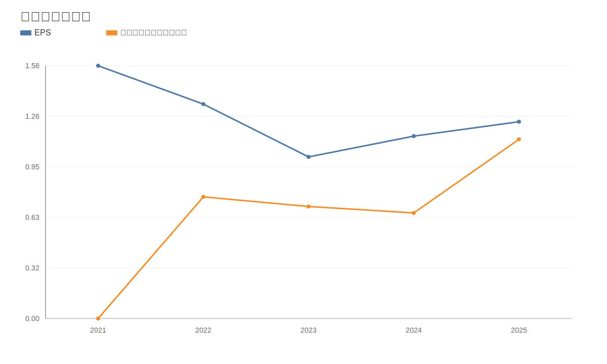

### 10. 财务比率分析图
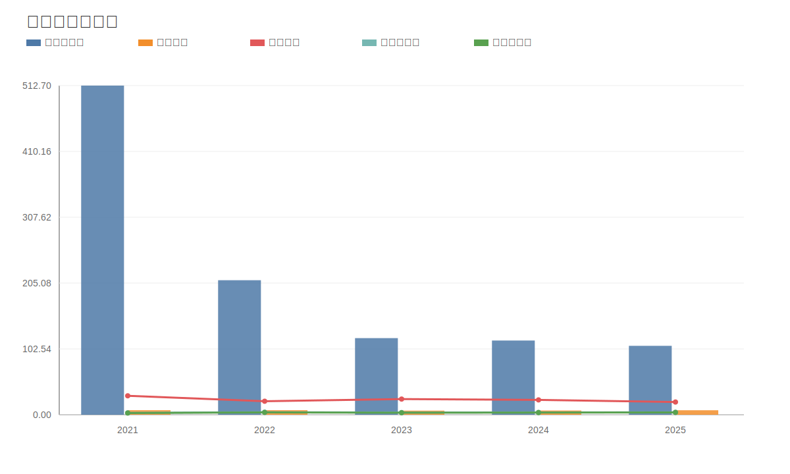

### 11. ROE与ROA对比图
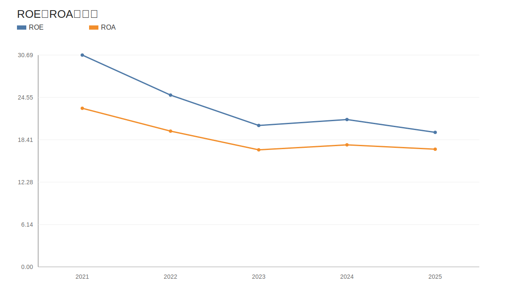
<!-- VALUE_CHARTS_END -->

## 6. 成长驱动
未来 3-5 年增长更依赖结构性驱动：高附加值产品占比提升、渠道效率优化、线上补能与餐饮端渗透。公司难再复制早期高双位数扩张，但具备温和内生增长条件。  
结论：增长来源可验证但强度有限。  
事实：2024-2025 已连续两年恢复增长。  
推断：中枢增速大概率落在中高个位数区间。

## 7. 风险分析（含幸存者偏差）
主要风险包括原材料波动、渠道价格竞争、消费力走弱、新品不及预期。幸存者偏差检验以 2022-2023 为压力段：公司利润与现金流虽波动，但未出现偿债压力和现金流断裂。  
结论：抗风险能力“中偏强”。  
事实：2023 年净利同比 -9.21%，但 2024-2025 已修复。  
推断：公司可穿越中等强度周期，但超额收益对增长兑现依赖高。

## 8. 估值分析
当前估值：PE 33.21x、PB 5.91x、PS 8.09x、股息率 3.55%。历史分位显示 PE/PB/PS 位于低位区；同业对比中，海天估值高于多数食品子行业公司，低于历史高溢价阶段。  
DCF（三情景）每股价值 22.73~46.40 元，基准 32.62 元；反向 DCF 显示当前价格隐含未来 10 年 FCF CAGR 约 9.98%。  
结论：估值“合理偏贵到合理区间”，并非明显深度低估。  
事实：历史低分位与高股息并存。  
推断：未来回报更依赖业绩兑现而非估值扩张。

## 9. 投资判断（多头/空头/跟踪指标）
多头逻辑：
1. 品牌与渠道护城河仍在，现金流韧性强。  
2. 资产负债表极稳健，净现金充足。  
3. 估值较历史高位显著回落，股息吸引力提升。  

空头逻辑：
1. 行业成熟，长期增速中枢下移。  
2. 当前价格已隐含较高现金流增长预期（反向 DCF 约 9.98%）。  
3. 新品与渠道增量若不及预期，估值修复空间受限。  

核心跟踪指标：
1. 季度营收与归母净利同比（是否持续高于个位数中枢）。  
2. 毛利率与经营现金流/净利润（盈利质量是否维持）。  
3. 线上渠道增速与新品类占比（结构升级是否兑现）。  

结论：多空并存，偏向“稳健持有/分批观察”。  
事实：基本面修复已兑现两年。  
推断：超额收益关键在后续 2-3 年增长质量。

## 10. 最终结论
这是一家好公司，具备长期投资价值，但已从“高成长白马”转为“高质量现金牛”。在 2026-04-17 的 39.94 元价格下，更适合稳健型资金以中长期视角分批配置。  
投资建议：观察（偏积极）。  
结论：质量优秀、估值不算便宜、胜率高于赔率。  
事实：净现金高、分红能力强、估值历史分位较低。  
推断：若增长稳态兑现，可获得中枢偏稳的复合回报。

## 11. 总评分（100分）
- 商业模式（20%）：17/20  
- 护城河（20%）：16/20  
- 管理层与资本配置（15%）：13/15  
- 财务质量（20%）：17/20  
- 风险控制（10%）：8/10  
- 估值性价比（15%）：10/15  
- 最终总分：81/100  

结论：公司质量高于估值性价比，属于“可长期跟踪、择机配置”型标的。  
事实：分项短板主要在增长弹性与估值赔率。  
推断：收益更偏“稳健复利”，不偏“高弹性进攻”。

## 12. 三个终极问题（必须回答）
1. 如果提价 5%，客户会不会流失？  
短期不会显著流失，但会受到渠道竞争与替代品牌牵制，提价可行性受行业成熟度约束。  

2. 公司赚的钱有没有被管理层浪费？  
从低杠杆、高净现金、持续分红与审计记录看，尚无“系统性浪费资本”的强证据。  

3. 在行业最差年份，公司是怎么活下来的？  
依靠高现金储备、强渠道与高频刚需属性穿越 2022-2023 压力期，虽有利润波动但未伤及资产负债表。  

结论：三问整体通过，但第二增长曲线仍需跟踪验证。  
事实：压力期后已恢复增长。  
推断：未来回报上限取决于结构升级而非单纯提价。

## 外部增量验证（非主口径）
- 上交所公告显示公司于 2026-04-13 召开 2025 年度业绩说明会（用于确认沟通窗口）。  
- 国家统计局 2026-03-31 公布 PMI 运行在扩张区间，宏观消费环境较 2023 年更平稳。  
- 公开公告逐字问答与完整会后纪要在本次数据集中仍有缺口，相关细项为“数据缺失/待核实”。

> ⚠️ 免责声明：本报告仅用于研究与教育，不构成任何投资建议。
