# 吉比特（603444.SH）深度价值研究报告

- 价格日期：2026-05-29
- 财报日期：2026-03-31
- 数据口径：本地数据库主口径（Tushare落库）+ 公司定期报告增量验证
- 当前价格/市值：331.95元 / 239.14亿元
- 当前估值：PE(TTM) 11.79倍，PB 4.35倍，PS(TTM) 3.46倍，股息率(TTM) 4.88%

## 1. 公司概况
事实：公司核心业务是网络游戏研发+发行运营，商业模式以“免费进入+道具付费”为主。2025年营收62.05亿元、归母净利润17.94亿元、经营现金流27.96亿元；2026Q1营收18.47亿元、归母净利润5.18亿元。2026Q1主要产品流水包括《杖剑传说（大陆版）》5.48亿元、《问道手游》4.02亿元、《道友来挖宝》2.81亿元、《杖剑传说（境外版）》2.00亿元。
推断：吉比特已从“老产品单核驱动”过渡到“老产品长线+新游接力”的双引擎阶段，但单款新游生命周期仍会带来季度波动。
结论：商业模式清晰、现金回收快、产品型公司特征明显，属于可理解且可跟踪的商业模型。

## 2. 行业与竞争格局
事实：2025年行业端仍在“监管常态化+供给恢复+全球化竞争加剧”框架下运行。公司年报摘要披露：2025年中国自主研发游戏海外市场实际销售收入204.55亿美元，同比增长10.23%；国内市场仍占主导。公司层面，2025年境外营业收入9.29亿元，同比+85.80%；2026Q1境外营业收入2.86亿元，同比+144.77%。
推断：行业已从“牌照稀缺红利”转向“精品内容+长线运营+全球发行效率”竞争，头部公司优势来自持续供给能力，而非单次爆款。
结论：赛道仍有结构性增长，但竞争强度上行，吉比特处于中上游位置，未来3-5年重点看海外续航和新品稳定供给。

## 3. 护城河分析（含真伪辨别）
事实：公司拥有长期运营IP（《问道》端游/手游）与雷霆游戏运营体系，2025年毛利率93.90%、2026Q1毛利率93.77%，显示内容产品和发行端仍具较强盈利能力。2026Q1期末未摊销充值及道具余额7.67亿元，表明存量玩家付费池仍在。
推断：护城河主要来自“研发选品能力+长线运营能力+用户社区沉淀”，而不是绝对渠道垄断；其强度受新品成功率影响较大。
结论：护城河强度评估为“中等偏强”。若核心产品提价5%，老用户流失可控，但对新游拉新效率和中轻度玩家转化存在压力。

## 4. 管理层与资本配置
事实：董事长与总经理均为卢竑岩，核心管理稳定。近三年已实施现金分红（税前）分别为每股10.00元（2023）、6.50元（2024）、16.10元（2025）。2026Q1货币资金46.83亿元、有息负债约0、净现金46.83亿元。2026Q1投资业务合计收益为-0.24亿元（公允价值波动拖累）。
推断：管理层在“高现金+高分红”框架下偏稳健，投资业务带来的公允价值波动不改变主业现金创造能力，但会放大利润表季度噪音。
结论：管理层类型为“中性偏价值创造者”，资本配置总体审慎，股东回报意识较强。

## 5. 财务分析（成长/盈利/健康/现金流）
事实：近五年营收CAGR 7.66%、净利CAGR 5.13%，呈“先降后升”波动（2023-2024回落，2025显著反弹）。盈利端维持高位：2025净利率34.58%、ROE 34.45%、ROIC 33.95%。财务结构稳健：2026Q1资产负债率21.60%、流动比率3.51、净现金充足。现金流方面，2025经营现金流/归母净利约155.87%，2026Q1经营现金流同比+172.53%。
推断：财务质量整体优秀，短板不在资产负债表，而在利润与估值对新品周期的敏感性。
结论：财务健康度为“高”，利润真实性和造血能力较强，具备穿越单季波动的财务缓冲。

## 6. 成长驱动
事实：2025-2026Q1主要增长来自新游放量与出海贡献，代表产品包括《杖剑传说（大陆版/境外版）》《问剑长生（大陆版/境外版）》《道友来挖宝》《九牧之野》。公司披露《九牧之野》截至2026Q1末（不考虑递延）渠道分成后收入扣除发行投入和研发分成后的净额已回正。
推断：未来3-5年增长并非主要依靠提价，而是依赖“新游成功率+海外运营效率+老游戏长线维护”三件事能否同时成立。
结论：成长逻辑可验证但波动较大，属于“有增长弹性、但需要季度跟踪验证”的类型。

## 7. 风险分析（含幸存者偏差）
事实：主要风险包括：1）单款新游生命周期不及预期；2）行业买量竞争和渠道分成挤压利润；3）监管与内容合规要求持续提高；4）汇率波动影响境外利润（2026Q1汇率相关损失同比显著增加）；5）投资资产公允价值波动影响当期利润。历史上公司在2023-2024业绩下行阶段仍保持盈利与正经营现金流。
推断：吉比特并非“无周期”的消费品公司，而是“有安全垫的产品周期公司”；估值回撤通常先于盈利回撤发生。
结论：抗风险能力评估为“中等偏强”，生存风险低，业绩波动风险中等。

## 8. 估值分析
事实：截至2026-05-29，公司PE(TTM)11.79倍、PB4.35倍、PS(TTM)3.46倍、股息率4.88%，对应市值239.14亿元。对比本仓库同口径近邻时点样本：三七互娱PE约15.09倍、恺英网络约18.11倍、完美世界约61.41倍（均为2026-05-11快照）。按2025自由现金流28.70亿元粗算，当前FCF收益率约12%。
推断：市场已计入“爆款持续性折价”，因此估值低于多数A股游戏可比公司；若新品流水平稳衔接，估值有修复空间。
结论：当前估值判断为“合理偏低”，具备一定安全边际；但不是“无条件低估”，需要基本面持续兑现配合。

## 9. 投资判断（多头/空头/跟踪指标）
事实：多头逻辑：1）高毛利+高现金流模型成立；2）净现金充足且分红能力强；3）2025-2026Q1新游与出海驱动兑现。空头逻辑：1）对新游流水续航依赖高；2）行业竞争与买量成本上行；3）汇率和投资公允价值波动会压制短期利润可见度。核心跟踪指标：季度流水结构（老游/新游占比）、境外收入增速、经营现金流/净利润比、递延余额变化、销售费用率与ROI。
推断：当前最优策略不是“盲目看多或看空”，而是用季度数据跟踪“增长质量是否可持续”。
结论：投资上更接近“观察偏积极、可分批跟踪”的状态，不宜一次性重仓。

## 10. 最终结论
事实：公司具备高盈利、高现金、低杠杆、连续分红等典型优质特征；短期增长由新游与出海贡献显著。
推断：好公司与好价格需要同时成立。吉比特“公司质量”已被验证，但“高增长能否延续”仍需后续季度确认。
结论：这是一家好公司，具备长期投资价值；在2026-05-29时点价格下给出明确建议为【观察】。

## 11. 总评分（100分）
事实：评分权重：商业模式20、护城河20、管理层与资本配置15、财务质量20、风险控制10、估值性价比15。
推断：分项建议：商业模式16/20，护城河15/20，管理层12/15，财务18/20，风险7/10，估值12/15。
结论：综合得分80/100，对应“优质但需跟踪验证增长持续性”的评级。

## 12. 三个终极问题
事实：1）如果提价5%，老产品核心用户流失有限，但新游转化可能受压；2）公司赚的钱整体未见明显浪费，分红和净现金体现资本纪律；3）在行业较弱阶段公司依靠老IP现金流、低杠杆和高毛利结构维持生存并等待新品周期。
推断：三问中最关键变量是第一问，即“提价权与用户粘性是否能跨产品延续”。
结论：三问整体偏正面，当前投资结论维持【观察】而非激进买入。

## 参考资料
1. 厦门吉比特网络技术股份有限公司《2025年年度报告摘要》（2026-03-27）：https://static.cninfo.com.cn/finalpage/2026-03-27/1225034661.PDF
2. 厦门吉比特网络技术股份有限公司《2026年第一季度报告》（2026-04-24）：https://static.cninfo.com.cn/finalpage/2026-04-24/1225158041.PDF
3. 国家新闻出版署官网（游戏审批结果与行业监管信息）：https://www.nppa.gov.cn/

免责声明：本分析仅供教育和研究用途，不构成任何投资建议。

<!-- VALUE_CHARTS_START -->
## 图表图片（自动生成）

### 1. 主营业务收入趋势图
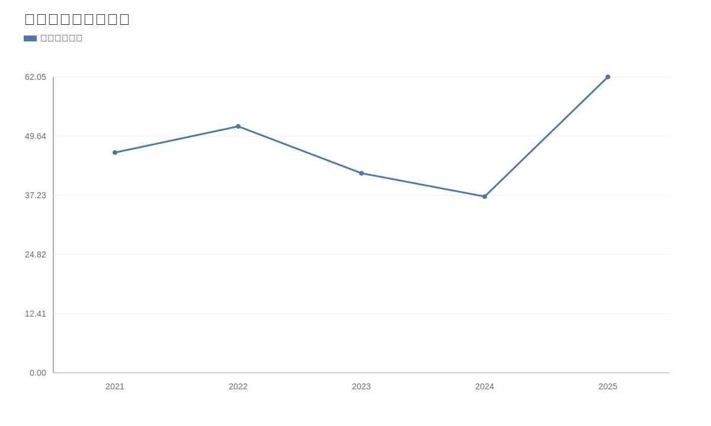

### 2. 净利润趋势图
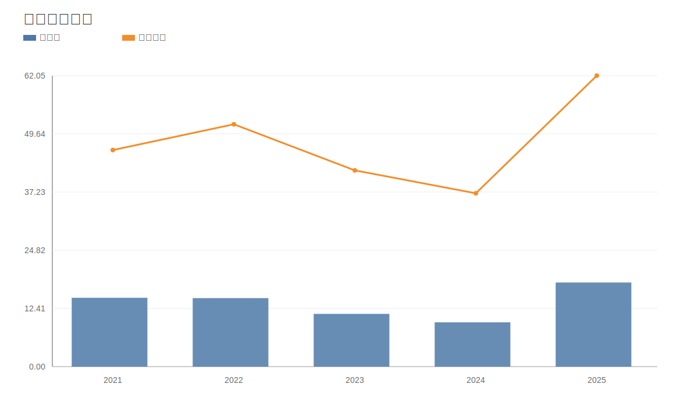

### 3. 毛利率和净利率对比图
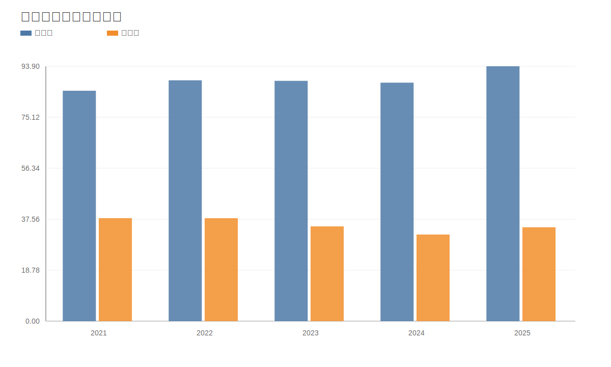

### 4. 分产品收入结构图
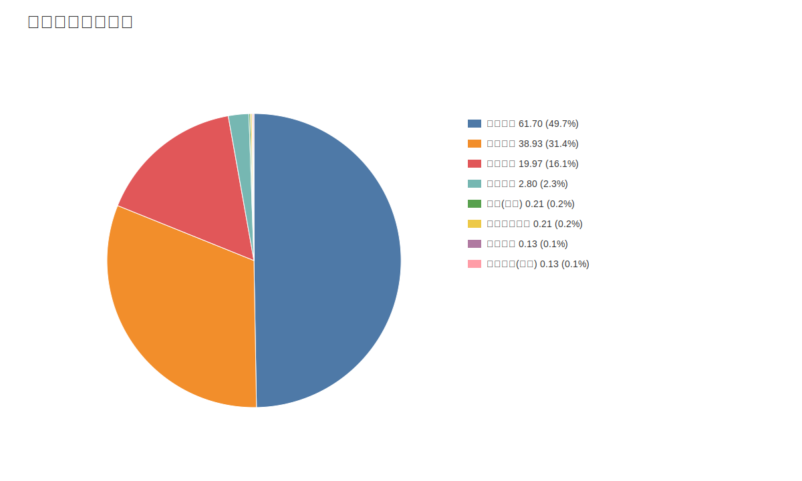

### 4. 分产品收入变化图
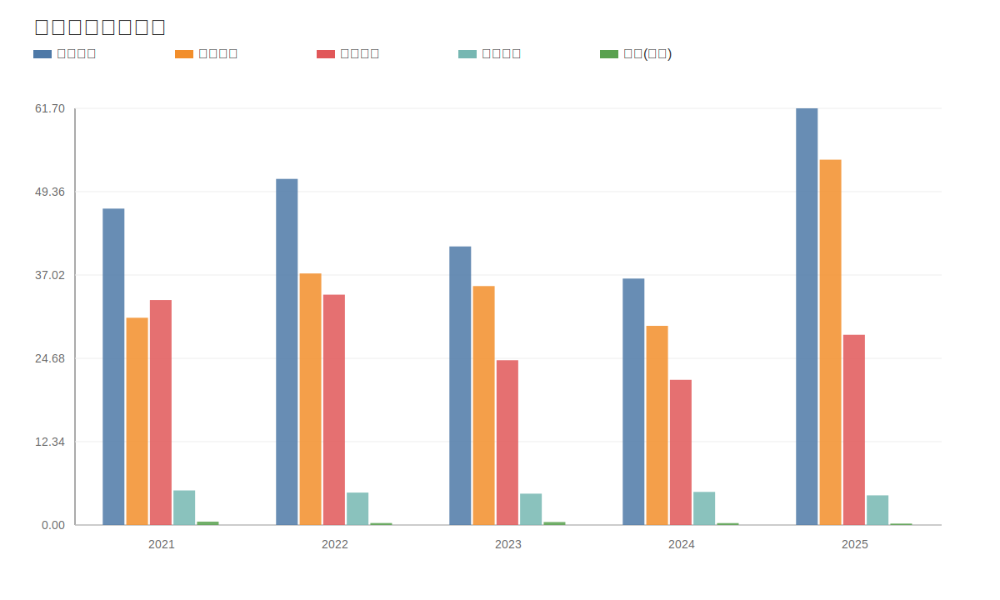

### 5. 分产品利润结构图
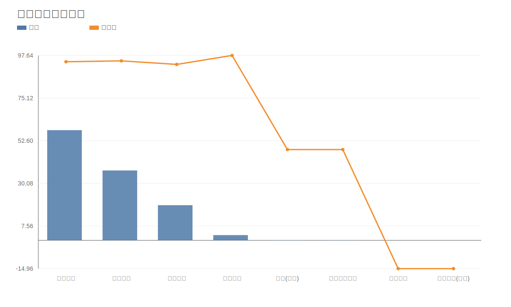

### 6. 分地区收入分布图
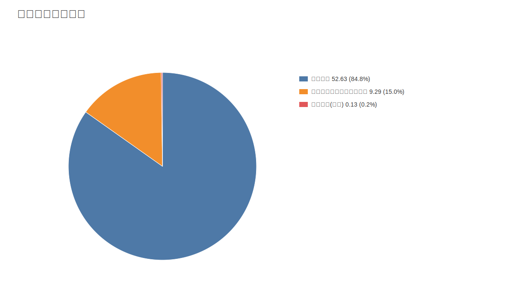

### 7. 资产负债表关键数据图
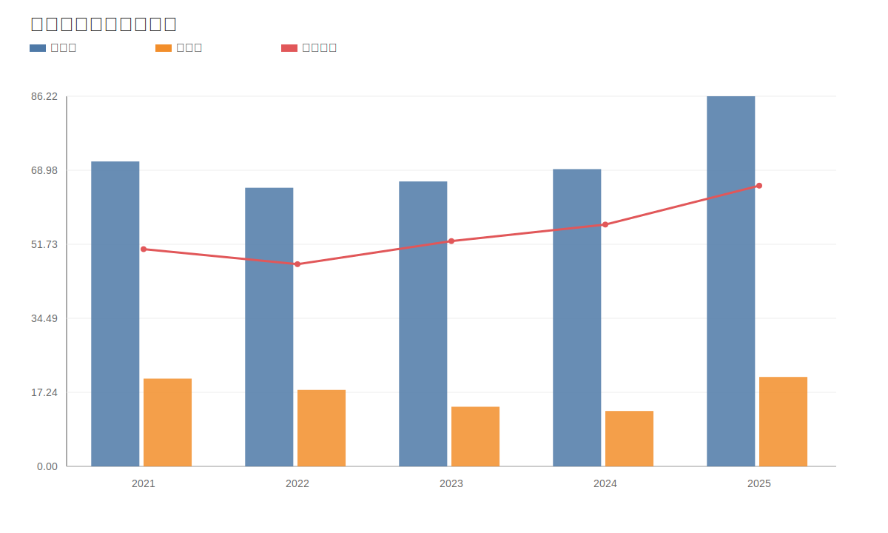

### 8. 自由现金流与经营现金流对比图
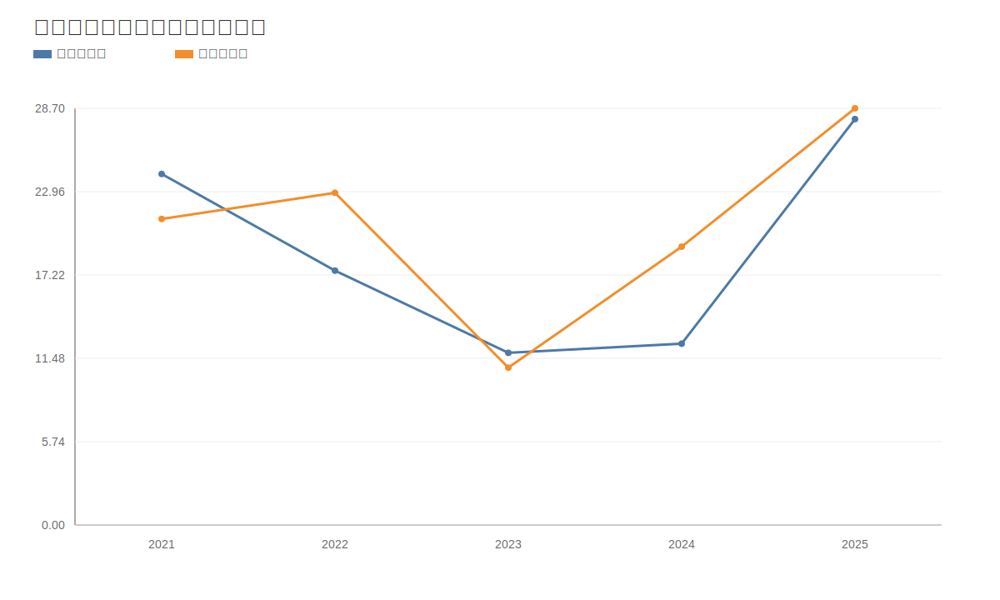

### 9. 股东回报分析图
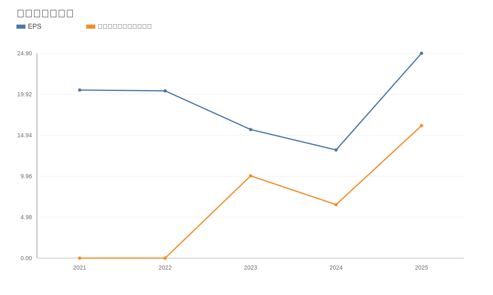

### 10. 财务比率分析图
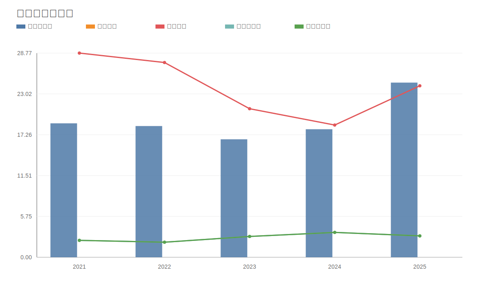

### 11. ROE与ROA对比图
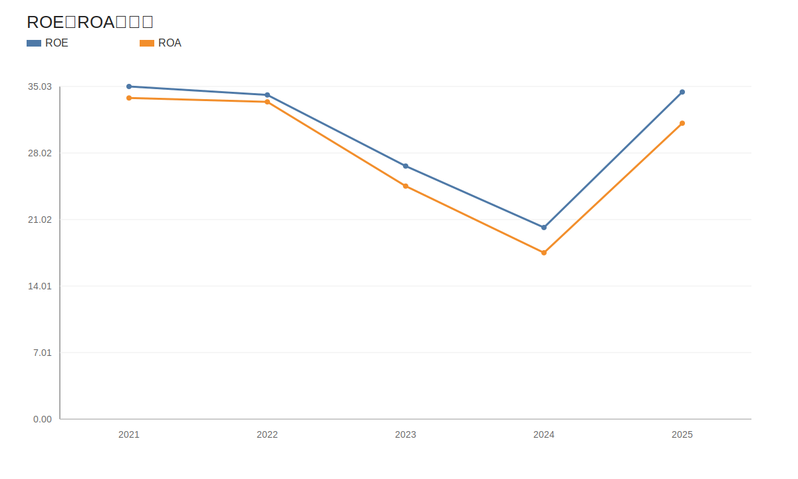
<!-- VALUE_CHARTS_END -->
