# 豪威集团（603501）深度价值研究报告

- 报告日期：2026年4月20日
- 数据截止：
  - 财务：2025年12月31日（年报口径）
  - 估值：2026年4月20日（最新交易日）
- 本地库主口径：`income/balancesheet/cashflow/fina_indicator/daily_basic/dividend/fina_audit/stock_company`
- 外部增量验证：年报摘要、半年度报告、一季报公告

## 1. 公司概况（商业模式优先）
豪威集团核心商业模式是“半导体设计+半导体分销”双轮驱动，其中设计业务贡献成长弹性，分销业务提供规模与客户覆盖。客户结构以 ToB 为主，收入具备一定持续性但受行业周期影响。

结论：公司属于技术驱动型半导体平台公司，商业模式清晰。
事实：2025 年营收 288.55 亿元，归母净利 40.45 亿元。
推断：未来价值取决于设计业务盈利能力与周期管理能力。

## 2. 行业与竞争格局
行业处于结构性成长与周期波动并存阶段，AI 终端、汽车电子、新消费电子需求带来增量，但库存周期仍会放大业绩波动。公司处于国内半导体设计核心阵营，竞争对手估值整体更高。

结论：行业空间大但波动高，公司位置优于多数中小设计公司。
事实：可比样本中，公司 PE 明显低于澜起、北方华创、北京君正等。
推断：市场给予折价反映对持续增长确定性的谨慎。

## 3. 护城河分析（含真伪辨别）
护城河来源：
1. 图像传感器等核心技术积累。
2. 客户与渠道网络。
3. 规模化研发与量产能力。
4. 产品线协同。

真伪辨别：
- 提价 5% 是否流失：在高替代环节有流失风险，在高性能场景相对可控。
- 客户价格敏感度：中高。
- 非它不可场景：部分车载/高端 CIS 场景存在技术门槛。
- 替代品出现难度：中等偏高。
- 更换供应商成本：中等。

结论：护城河强度为“中偏强”。
事实：公司毛利率与净利率修复，显示竞争力回升。
推断：护城河可持续但需持续高研发投入维护。

## 4. 管理层与资本配置
管理层稳定，审计口径规范。资本配置以研发投入和业务扩张为主，分红较低。公司净现金为正，财务弹性较好。

结论：管理层偏“价值创造者（中等偏上）”。
事实：2025 年研发费用 28.43 亿元，占收入约 9.85%。
推断：若研发转化效率继续提升，资本配置回报率将进一步改善。

## 5. 财务分析（成长/盈利/健康/现金流）
### 5.1 成长性
2021-2025 年营收 CAGR 4.60%，净利 CAGR -2.50%；2025 年出现明显恢复。

### 5.2 盈利能力
2025Q3 毛利率 30.43%、净利率 14.69%、ROE 12.37%、ROIC 8.66，较低谷期显著回升。

### 5.3 财务健康
2025 年总资产 436.01 亿元，总负债 154.47 亿元；流动比率 2.46，速动比率 1.68。货币资金 128.21 亿元，短债+长债约 36.97 亿元，净现金约 91.24 亿元。

### 5.4 现金流质量
2025 年经营现金流 41.20 亿元，自由现金流 16.87 亿元，经营现金流/净利润约 1.02 倍。

结论：财务稳健且现金流恢复良好。
事实：净现金充足，流动性指标优于多数可比。
推断：若库存和周转继续改善，财务质量仍有上行空间。

## 6. 成长驱动
未来 3-5 年增长来源：
1. CIS 在汽车、安防、AIoT 的渗透提升。
2. 新产品迭代带来的 ASP 与毛利改善。
3. 库存去化完成后的经营杠杆释放。
4. 分销与设计协同带来的客户扩展。

结论：增长驱动明确，但节奏受行业周期影响。
事实：2025 年利润增速明显快于营收增速。
推断：增长可持续性取决于下游需求景气与产品竞争力。

## 7. 风险分析（含幸存者偏差）
主要风险包括：行业景气反转、技术替代、客户需求波动、库存管理风险、国际贸易与政策风险。

幸存者偏差检验：公司经历过 2022-2023 的利润低谷后恢复，显示抗压能力；但回升并不等于长期高增长常态。

结论：抗风险能力为“中”。
事实：公司在低谷期仍保持研发投入与经营连续性。
推断：风险主要来自周期波动，不是短期流动性问题。

## 8. 估值分析
当前估值（2026-04-20）：PE 29.24、PB 3.62、PS 4.10、股息率 0.66%。

历史分位（近一年）：PE/PB/PS 约 14.9%。

同业比较（2026-04-20）：
- 北方华创 PE 61.86
- 澜起科技 PE 84.55
- 豪威集团 PE 29.24
- 北京君正 PE 155.24
- 全志科技 PE 124.70

估值模型：
- 相对估值（PE 分位）约 94.85-120.39 元
- DCF 约 17.50-30.38 元
- 反向 DCF 隐含未来 5 年 FCFE 年化增速约 44.66%

结论：安全边际判断为“相对偏低估、绝对偏进取”。
事实：相对分位低于历史中枢。
推断：若业绩兑现不及预期，估值回撤压力仍大。

## 9. 投资判断（多头/空头/跟踪指标）
### 多头逻辑
1. 行业景气修复叠加产品升级。
2. 现金流与利润同步恢复。
3. 估值分位偏低，具修复空间。
4. 净现金充足，财务抗波动能力较强。

### 空头逻辑
1. 半导体行业周期波动仍大。
2. 库存周转压力尚未完全消化。
3. 估值对高增长兑现要求高。
4. 技术替代与竞争加剧风险持续存在。

### 核心跟踪指标（季度）
1. 单季毛利率与净利率趋势。
2. 库存周转天数与应收周转天数。
3. 经营现金流/净利润比值。
4. 研发费用率与新品放量进展。
5. 净现金规模变化。

结论：适合“分批+跟踪验证”策略。
事实：当前基本面改善与估值低分位并存。
推断：真正的上行空间取决于盈利持续性。

## 10. 最终结论
豪威集团是处于修复通道的半导体核心资产，具备长期研究与配置价值。当前价格不在高位，偏向中期跟踪配置窗口，但不宜忽视行业波动风险。

- 这是否是一家好公司：是
- 是否具备长期投资价值：是
- 当前价格是否值得买入：可分批
- 投资建议：观察（偏积极）

结论：建议“观察（偏积极）”。
事实：业绩修复和估值低分位同时存在。
推断：提升仓位应等待连续季度兑现验证。

## 11. 总评分（100分）
- 商业模式（20%）：16/20
- 护城河（20%）：15/20
- 管理层与资本配置（15%）：12/15
- 财务质量（20%）：15/20
- 风险控制（15%）：10/15
- 估值性价比（10%）：7/10

**最终总分：75/100**

结论：75 分对应“中上质量、偏成长波动型标的”。
事实：优势在技术与修复弹性，短板在周期与估值波动。
推断：若盈利连续兑现，评分存在上修空间。

## 12. 三个终极问题（必须回答）
1. 如果提价 5%，客户会不会流失？
在标准化应用场景会有流失，技术壁垒高的细分场景流失相对可控。

2. 公司赚的钱有没有被管理层浪费？
当前证据不支持系统性浪费，现金流和净现金表现较稳，但资本开支效率需要持续验证。

3. 在行业最差年份，公司是怎么活下来的？
通过维持研发投入、优化库存与现金流管理、依托分销业务缓冲需求波动，实现穿越周期。

结论：三问整体偏正面，核心矛盾在波动而非生存。
事实：公司在低谷期仍保持经营与研发连续性。
推断：长期价值成立，但路径会伴随较高波动。

## 外部增量验证来源
- [豪威集团 2025 年年度报告摘要（2026-03-31）](https://static.cninfo.com.cn/finalpage/2026-03-31/1225055209.PDF)
- [豪威集团 2025 年半年度报告（2025-08-30）](https://static.cninfo.com.cn/finalpage/2025-08-30/1224628800.pdf)
- [豪威集团 2026 年一季报（2026-04-02）](https://file.finance.sina.com.cn/211.154.219.97%3A9494/MRGG/CNSESH_STOCK/2026/2026-4/2026-04-02/12054720.PDF)

<!-- VALUE_CHARTS_START -->
## 图表图片（自动生成）

### 1. 主营业务收入趋势图
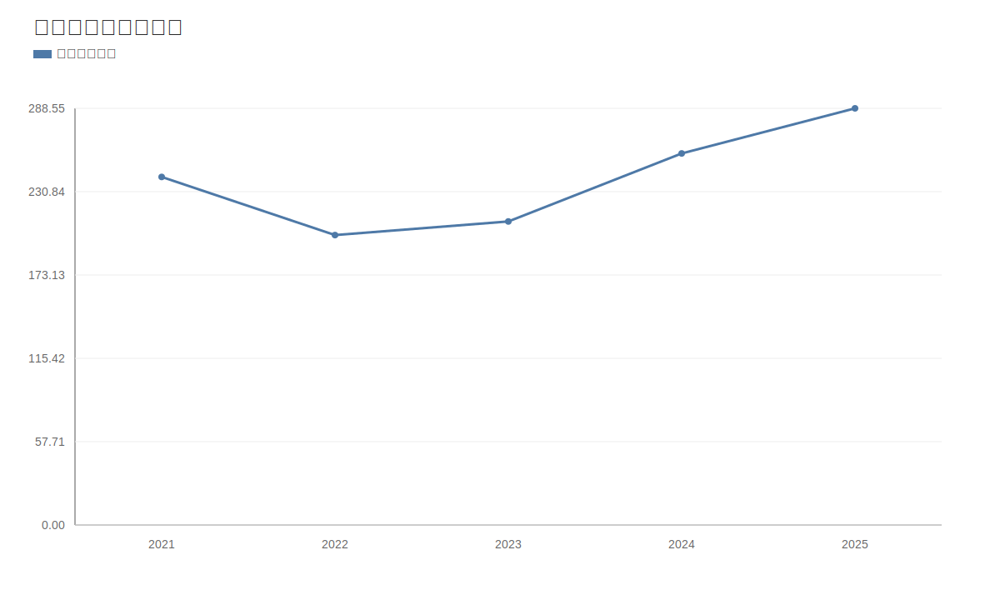

### 2. 净利润趋势图
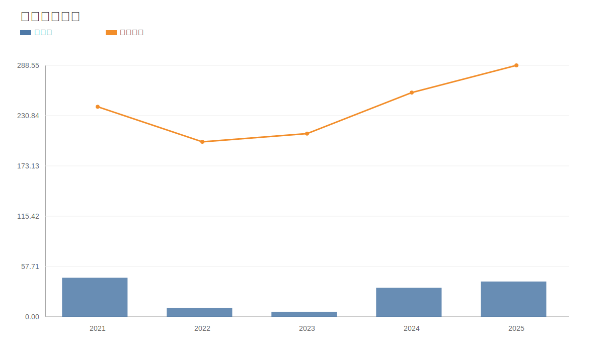

### 3. 毛利率和净利率对比图
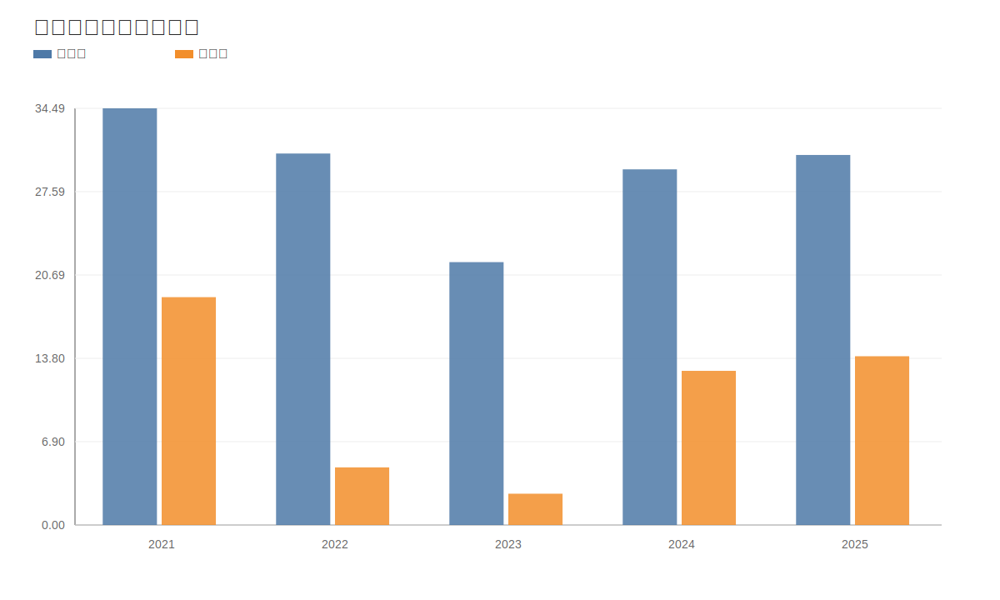

### 4. 分产品收入结构图
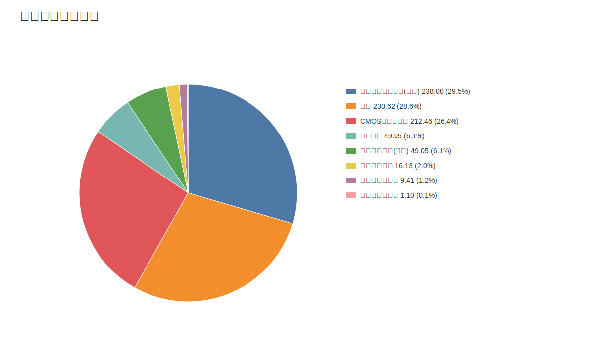

### 4. 分产品收入变化图
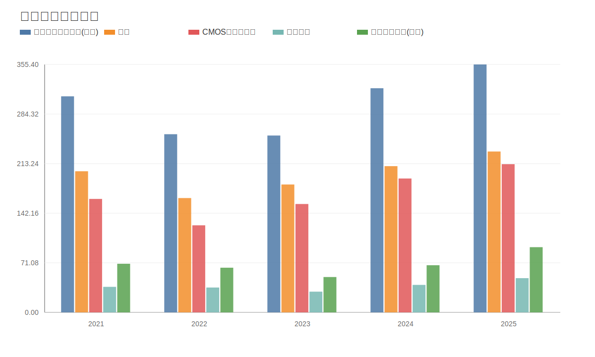

### 5. 分产品利润结构图
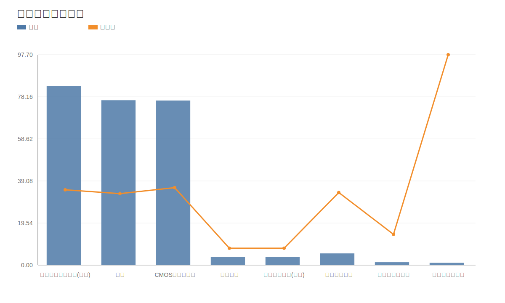

### 6. 分地区收入分布图
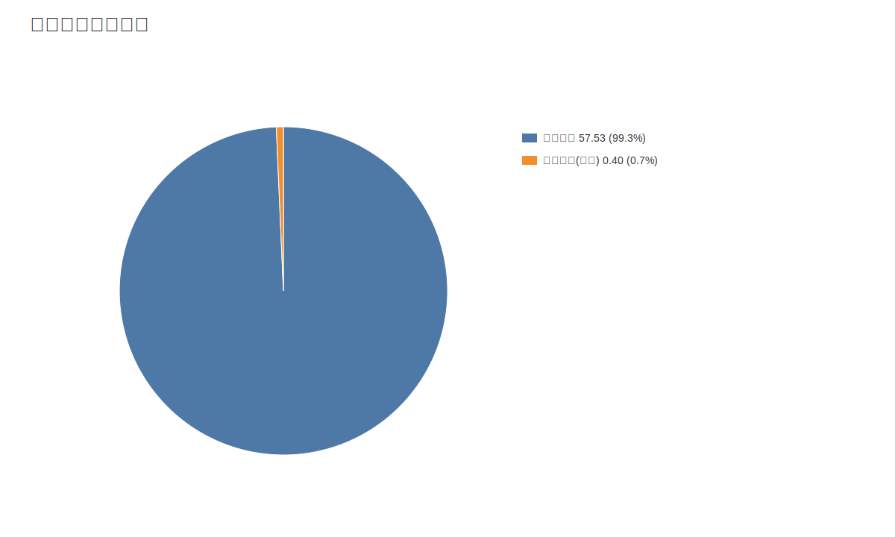

### 7. 资产负债表关键数据图
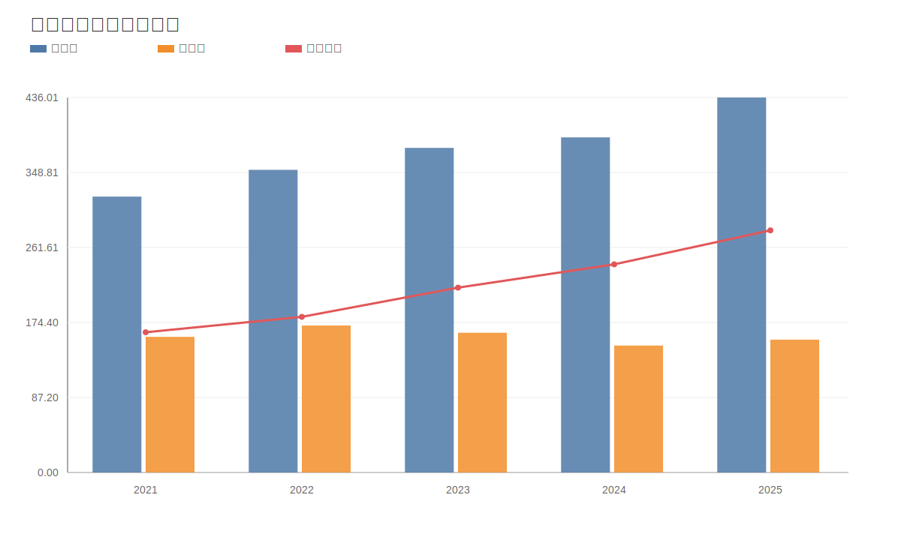

### 8. 自由现金流与经营现金流对比图
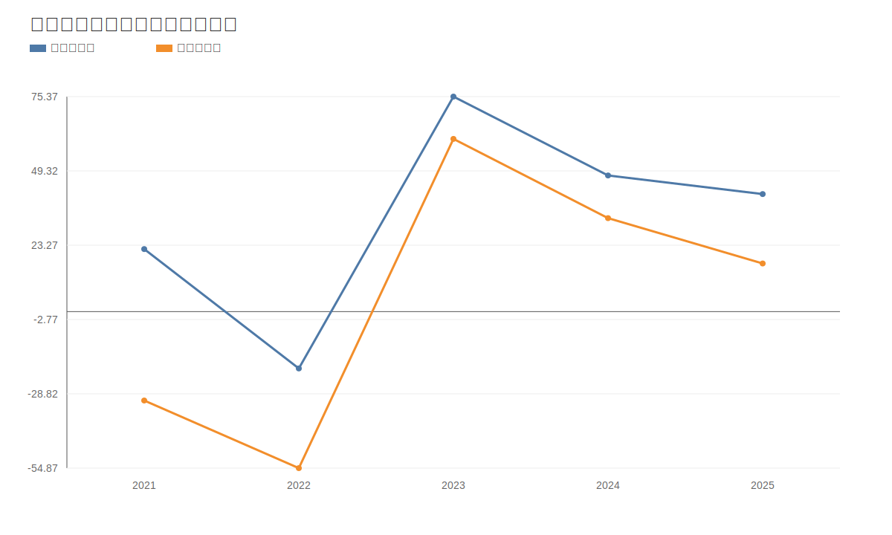

### 9. 股东回报分析图
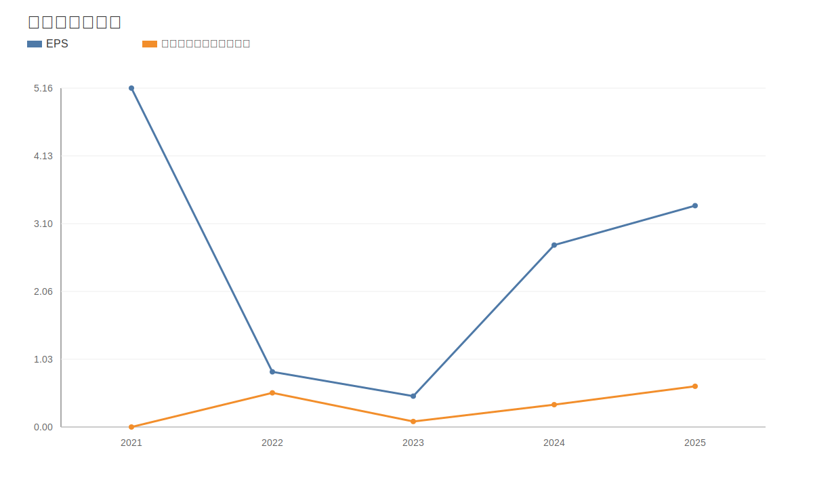

### 10. 财务比率分析图
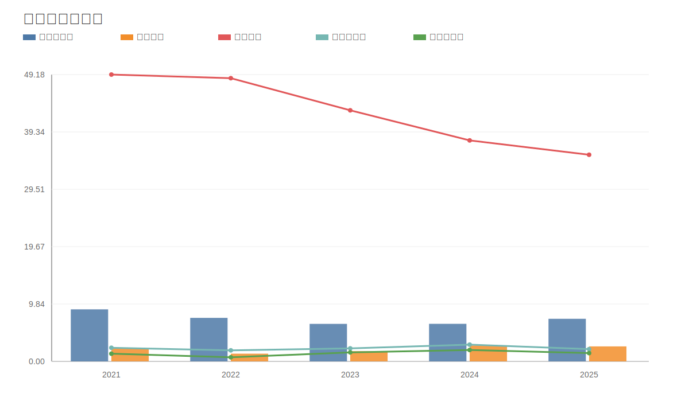

### 11. ROE与ROA对比图
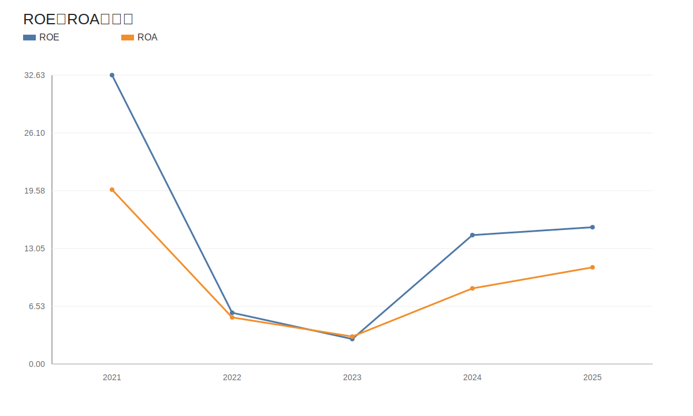
<!-- VALUE_CHARTS_END -->
