# 顾家家居（603816.SH）深度价值研究报告

- 价格日期：2026-05-29
- 财报日期：2026-03-31
- 数据口径：本地数据库主口径 + 公司公告增量验证
- 当前价格/市值：29.08元 / 238.88亿元
- 当前估值：PE(TTM) 13.52倍，PB 2.15倍，PS(TTM) 1.18倍，股息率(TTM) 4.75%

## 1. 公司概况
事实：顾家家居以软体家具为核心，主打客厅和卧室场景，收入主要来自沙发、卧室用品、集成产品、定制家具及配套服务。2025年主营收入200.56亿元，其中沙发115.76亿元，占比57.72%；卧室用品34.65亿元，占比17.28%；集成产品23.14亿元，占比11.54%；定制家具10.31亿元，占比5.14%；其他业务和信息技术服务合计约7.6%。公司客户以ToC为主，通过经销、直营、线上和海外渠道触达消费者，不是典型一次性大项目制ToB公司。地区拆分在本地主营表里未抓到完整D类明细，但公司公开资料显示海外覆盖持续扩大，区域分散度在提升。
推断：这门生意本质上是“品牌+渠道+制造+供应链周转”的零售制造混合体，消费属性强于工业属性。收入持续性来自换新、以旧换新、装修周期和海外渠道扩张，而不是订阅式复购。
结论：商业模式清晰，核心收入集中在沙发和卧室用品，单一客户依赖不高，但对终端消费和住房景气仍有周期暴露。

## 2. 行业与竞争格局
事实：家居行业整体属于成熟期赛道，国内需求与房地产竣工、二手房翻新、消费信心高度相关，增速通常不高但会阶段性修复。顾家主要竞争对手包括欧派家居、索菲亚、喜临门、箭牌家居、好莱客、曲美家居等；在软体家具和功能沙发细分里，顾家的品牌和产品力更强，但在整个家居行业里并非绝对寡头。公司公开资料显示，2025年业务已覆盖全球120多个国家和地区，拥有近6000家品牌专卖店，海外扩张是重要增量。
推断：未来3-5年，行业大概率仍是“低速增长+结构分化”：国内靠换新和改善型需求，海外靠品牌和渠道渗透。行业天花板不低，但不会出现典型高成长赛道的线性扩张。
结论：行业不差，但偏成熟、偏周期，顾家处在强细分品牌位置，竞争力好于普通家居企业，但还称不上有极深护城河的超级龙头。

## 3. 护城河分析（含真伪辨别）
事实：顾家的护城河主要来自品牌认知、渠道覆盖、规模制造、产品迭代和海外布局，而不是技术专利或网络效应。2025年毛利率32.72%，2026Q1毛利率32.38%，净利率分别为7.83%和10.67%，说明品牌和渠道仍能支撑一定溢价。若按产品看，沙发和卧室用品合计贡献接近75%的收入，说明优势集中在核心场景，而不是铺得特别散。
推断：如果提价5%，核心城市和改善型客户大概率不会立刻大规模流失，但促销敏感客群会明显转向，说明它有品牌力，但不是“非它不可”的硬垄断。替代品并不稀缺，客户也不天然不敏感，所以护城河更多是“中等偏强”，而不是“强到可以随意涨价”。
结论：护城河强度评为“中等偏强”。它有定价权的局部能力，但更像渠道品牌型护城河，而不是无可替代型护城河。

## 4. 管理层与资本配置
事实：公司管理层稳定，董事长和总经理均为李东来。2021-2025年已实施现金分红（税前）分别为每股0.82元、1.32元、1.11元、1.39元和1.38元，分红连续性较好。2025年审计意见为标准无保留意见，连续多年审计结论正常。2026Q1货币资金29.47亿元，有息负债7.80亿元，净现金约21.67亿元，资本结构不激进。
推断：管理层更像“稳健经营+稳健分红”的类型，资本配置重心在主业扩张、渠道和国际化，而不是高风险并购。回购并不是资本回报主轴，现金分红才是更明确的股东回报方式。
结论：管理层属于“中性偏价值创造者”。它没有明显的资本毁灭迹象，也没有展示出特别激进的扩张冲动。

## 5. 财务分析（成长/盈利/健康/现金流）
### 5.1 成长性
事实：近五年营收CAGR约2.26%，净利CAGR约1.84%，说明长期增速并不快。2025年营收200.56亿元，同比增长8.53%；归母净利润17.90亿元，同比增长26.37%。2026Q1营收50.33亿元，同比增长2.42%；归母净利润4.96亿元，同比下降4.39%，增长出现短期波动。
推断：顾家不是高成长股，而是“低速增长+周期修复+结构升级”的类型。盈利波动更多来自终端需求、渠道费用和海外经营节奏，而不是单纯产能扩张。
结论：成长性中等，长期更依赖结构改善而不是高增速本身。

### 5.2 盈利能力
事实：2025年净利率7.83%，2026Q1净利率10.67%；2026Q1 ROE为15.25%，ROIC为13.74%。按产品看，2025年沙发毛利率34.91%，卧室用品42.91%，集成产品29.64%，定制家具28.73%，信息技术服务81.85%，说明高毛利来自软体主业和服务延伸，而不是纯低价竞争。
推断：公司盈利能力比普通制造业强，但离“高壁垒高毛利消费龙头”仍有差距。PB高于部分同业，背后更多是对ROE、品牌和现金回报的定价，而不是单纯看账面资产。
结论：盈利能力算稳健，不算极致，但质量优于多数家居企业。

### 5.3 财务健康
事实：2026Q1资产负债率39.77%，流动比率1.21，货币资金29.47亿元，有息负债7.80亿元，净现金21.67亿元。公司不属于高杠杆扩张模式，资产负债表整体安全。
推断：在家居行业这个偏周期赛道里，净现金和不高的杠杆是非常重要的缓冲垫。只要终端需求不出现极端恶化，流动性风险并不高。
结论：财务健康度较好，短债压力可控，整体偏稳健。

### 5.4 现金流质量
事实：2025年经营现金流27.74亿元，高于归母净利润17.90亿元，经营现金流/净利润约155%；2026Q1经营现金流1.02亿元，经营现金流/净利润约98.64%。这说明利润并非纯会计数字，现金回款能力总体不错，但季度波动会受库存、应收和终端促销节奏影响。
推断：现金流质量是顾家最重要的优点之一，也是它在周期下行时还能维持分红和再投资的底气。与其看单季利润，不如看全年经营现金流和库存周转。
结论：利润真实度较高，造血能力较强。

## 6. 成长驱动
事实：2025年到2026Q1，增长更像来自“产品结构升级+海外扩张+门店和渠道效率提升”，而不是单纯提价。年报和公开资料显示，公司海外覆盖120多个国家和地区，近6000家专卖店；这意味着海外渠道已经不只是试水，而是实质性的第二增长曲线。产品端，沙发仍是绝对主力，但卧室用品、集成产品和定制家具共同构成了更完整的客厅-卧室-整家链条。
推断：未来3-5年最可验证的增长来源有三类：一是海外品牌化和渠道扩张，二是功能沙发和改善型产品渗透，三是整家化和配套产品提升客单价。真正值得盯的是“收入增速是否能稳定转化成现金流增速”。
结论：增长逻辑存在，而且能验证，但它属于阶段性修复型增长，不是高确定性的高斜率增长。

## 7. 风险分析（含幸存者偏差）
事实：主要风险来自四方面：一是房地产和装修景气偏弱，二是行业竞争与价格战，三是海外关税、汇率和物流波动，四是终端消费降级导致客单价承压。幸存者偏差检验上，2022-2024年家居行业环境并不友好，但顾家仍能保持盈利、保持正经营现金流并继续分红，说明生存能力不差。
推断：顾家不是无周期公司，而是“有安全垫的周期消费公司”。最差年份里，它靠品牌、渠道、现金回款和相对健康的负债结构活下来，而不是靠资本输血。
结论：抗风险能力评为“中等偏强”，风险主要在需求和竞争，而不在财务崩溃。

## 8. 估值分析
事实：截至2026-05-29，顾家家居PE(TTM)13.52倍、PB2.15倍、PS(TTM)1.18倍、股息率4.75%，对应市值238.88亿元。按最近57个交易日样本看，PE区间约13.15-18.91倍，当前PE接近低位；PB区间约2.10-2.92倍，当前PB接近低位；PS区间约1.15-1.53倍，当前PS也偏低；股息率则接近样本高位。在可计算PE的同业样本中，欧派家居、索菲亚、喜临门、箭牌家居等PE中位数约18.58倍、PB中位数约1.32倍、PS中位数约1.01倍，顾家PE低于同业中位，但PB/PS略高，反映市场对其盈利质量和品牌能力给了更高资产定价。
推断：当前估值不是“极端便宜”，但已经明显低于其自身近期中枢，且股息率提供了相对扎实的下行缓冲。问题不在于便不便宜，而在于“利润修复能不能继续兑现”。
结论：安全边际为“合理偏低”，偏价值区间，但不是无脑捡便宜的水平。

## 9. 投资判断（多头/空头/跟踪指标）
事实：多头逻辑有四条：1）品牌和渠道支撑中等偏强护城河；2）净现金和低杠杆让公司在周期下行时更稳；3）分红持续，股东回报明确；4）海外扩张和产品结构升级带来第二增长曲线。空头逻辑也有四条：1）行业与地产景气绑定，需求修复不确定；2）提价能力有限，价格战风险长期存在；3）2026Q1利润同比下滑，说明恢复并不线性；4）家居行业竞争激烈，品牌优势不等于份额永久锁定。核心跟踪指标建议看：月度/季度零售和门店表现、海外收入增速、沙发与卧室用品占比、经营现金流/净利润、库存周转和毛利率。
推断：顾家更适合“中长期跟踪型配置”，而不是追逐高弹性的成长故事。它的确定性来自现金流和分红，不来自超高增速。
结论：当前更适合给出“观察”而非激进追高，若看重股息和中长期修复，可列入分批跟踪名单。

## 10. 最终结论
事实：顾家家居是一个品牌、渠道、制造和现金流都不弱的家居公司，盈利质量和财务健康在行业内属于上游。公司当前估值不贵，分红连续，净现金充足，海外扩张也在推进。
推断：它更像“稳健型消费制造”而不是“高成长爆发型公司”。若住房和消费环境改善，估值与业绩都有修复空间；若行业持续疲弱，股息和现金流会成为防守主力。
结论：这是一家不错的公司，具备长期投资价值，但在2026-05-29这个时点，我给出的明确建议是【观察】。

## 11. 总评分（100分）
事实：评分权重设定为：商业模式20分、护城河20分、管理层与资本配置15分、财务质量20分、风险控制10分、估值性价比15分。
推断：分项建议评分为：商业模式15/20，护城河15/20，管理层与资本配置12/15，财务质量17/20，风险控制7/10，估值性价比11/15。综合得分77/100。
结论：77分属于“质量不错、估值尚可、但成长性不够锋利”的区间，适合偏稳健和长期视角的投资者。

## 12. 三个终极问题
事实：如果提价5%，顾家家居的核心改善型客户大概率不会全部流失，但促销敏感客群会更挑剔，说明它有品牌力，但不是绝对定价权；公司赚的钱总体没有明显被浪费，分红和净现金说明资本纪律还可以；在行业最差年份，公司靠品牌、渠道、现金回款和相对稳健的负债结构活下来，并没有出现典型的财务危机。  
推断：这三问的答案说明它是一家“能活、能赚、也愿意回报股东”的公司，但不是一家公司可以简单用高成长估值去买的公司。
结论：三个终极问题整体偏正面，当前结论维持【观察】，更适合等待需求和利润确认后再提高仓位。

## 参考资料
1. 顾家家居 2026年第一季度报告，CNINFO：https://static.cninfo.com.cn/finalpage/2026-04-30/1225257293.PDF
2. 顾家家居 2025年年度报告相关公开页面/镜像（用于增量验证）：https://stockmc.xueqiu.com/202604/603816_20260423_YN13.pdf
3. 顾家家居公司公开资料与投资者关系页面（海外布局与门店信息）

免责声明：本分析仅供教育和研究用途，不构成投资建议。

<!-- VALUE_CHARTS_START -->
## 图表图片（自动生成）

### 1. 主营业务收入趋势图
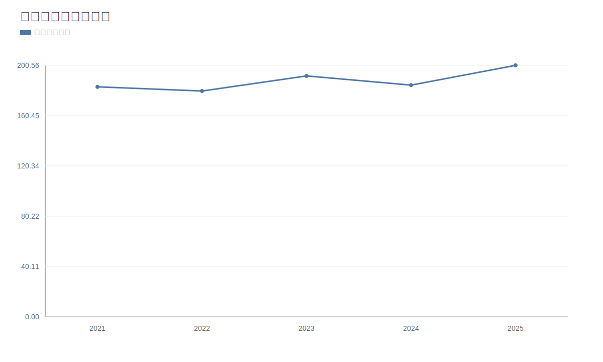

### 2. 净利润趋势图
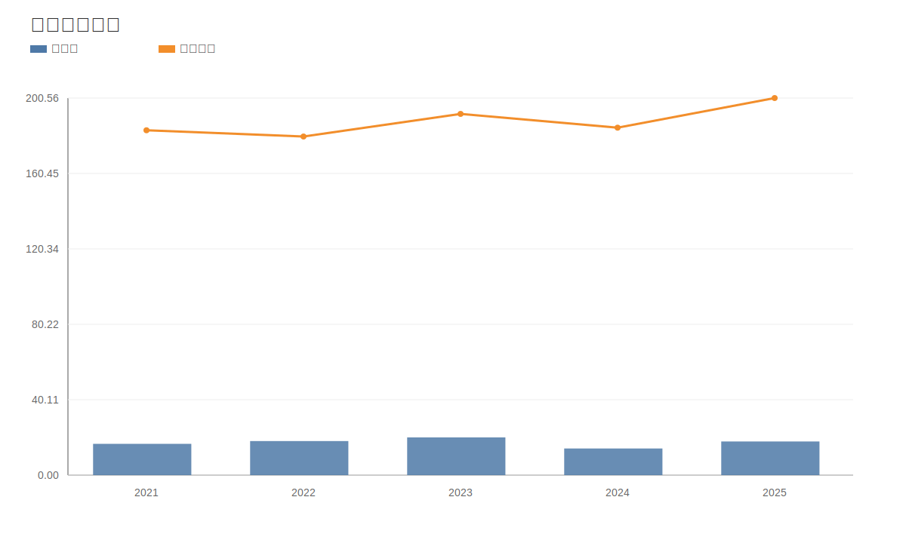

### 3. 毛利率和净利率对比图
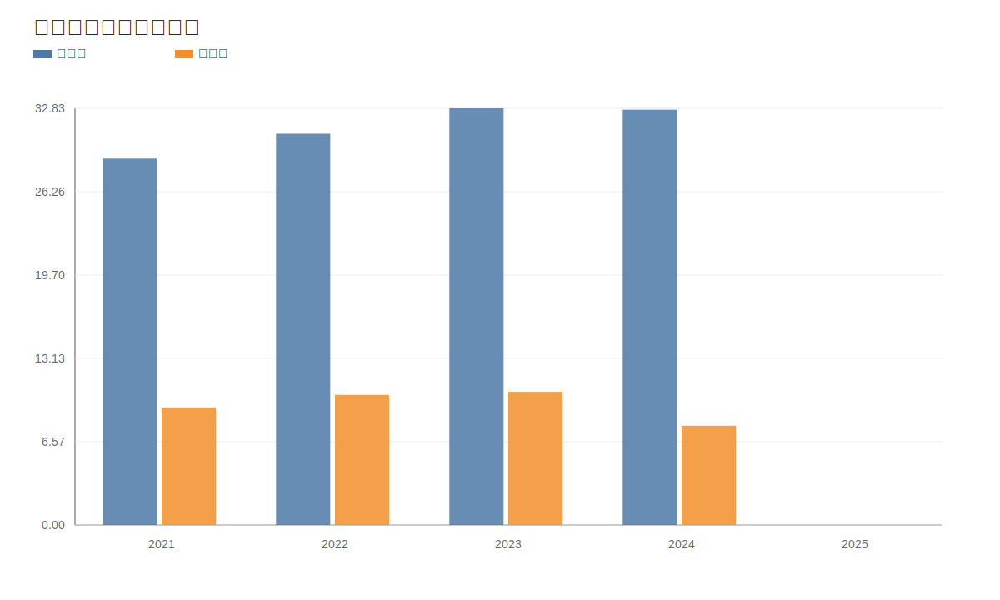

### 4. 分产品收入结构图
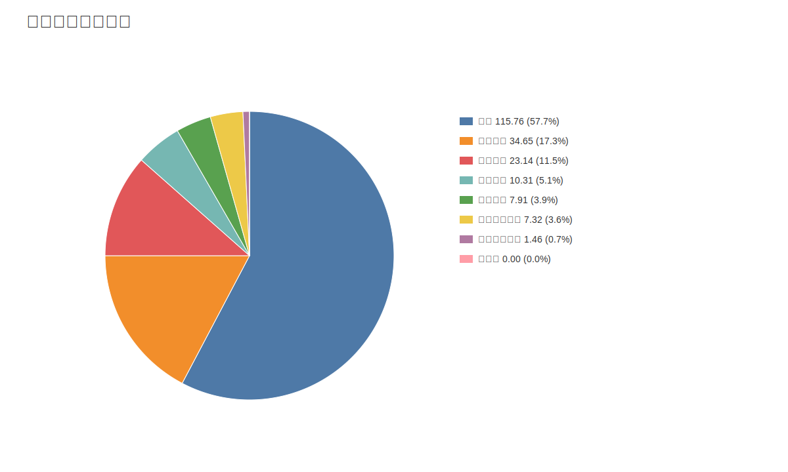

### 4. 分产品收入变化图
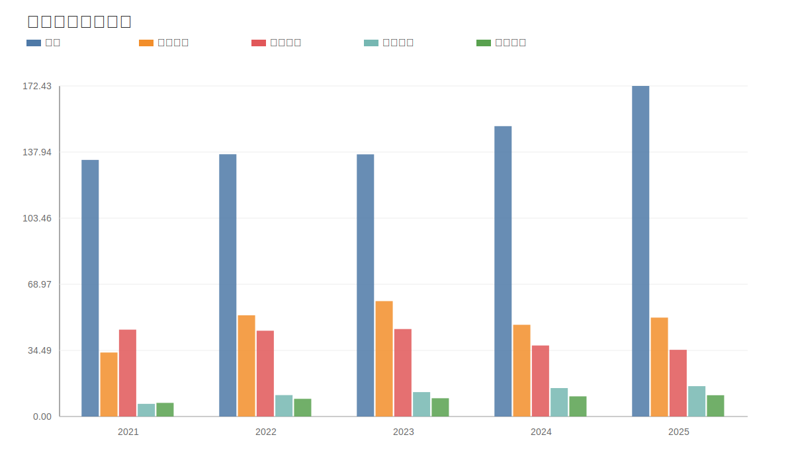

### 5. 分产品利润结构图
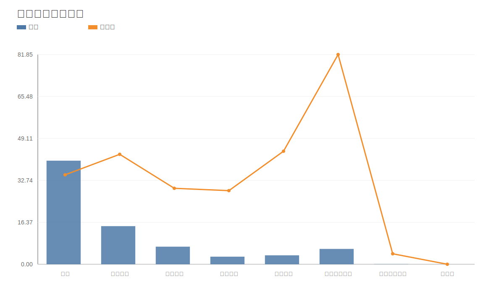

### 6. 分地区收入分布图

### 7. 资产负债表关键数据图
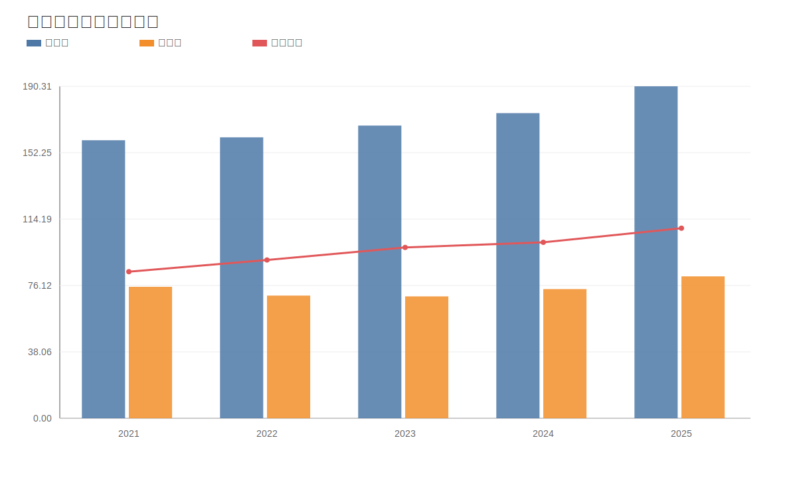

### 8. 自由现金流与经营现金流对比图
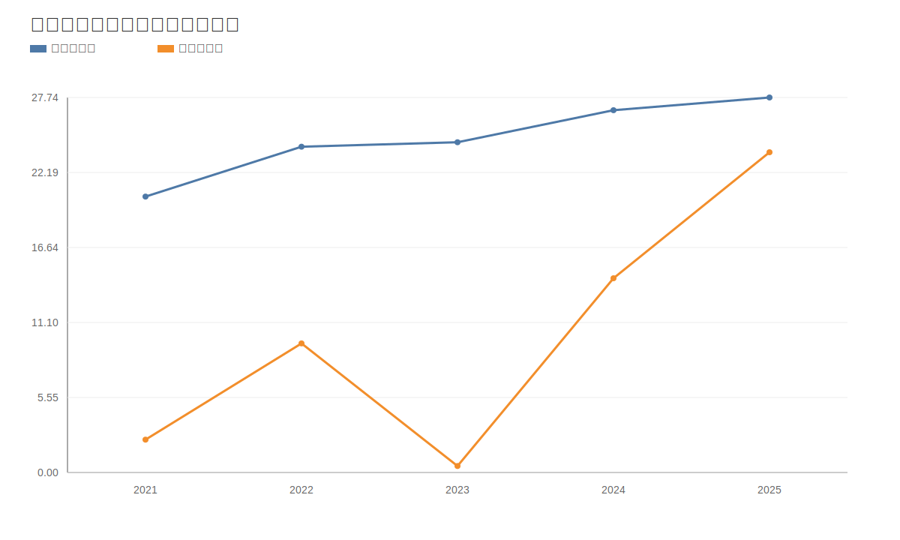

### 9. 股东回报分析图
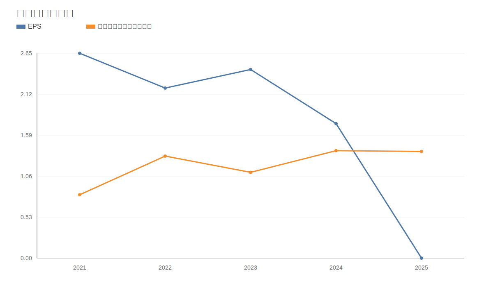

### 10. 财务比率分析图
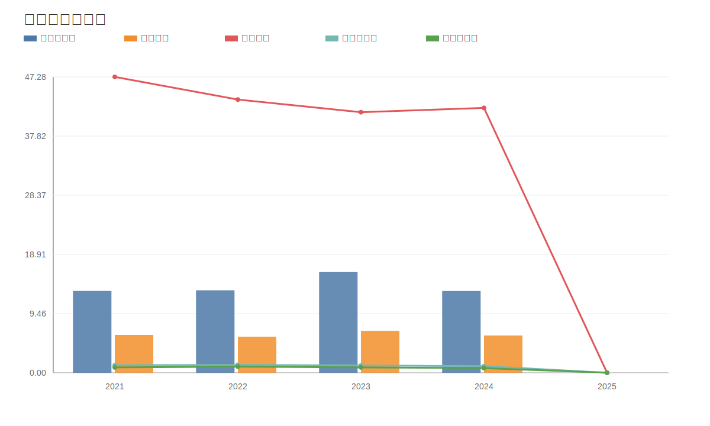

### 11. ROE与ROA对比图
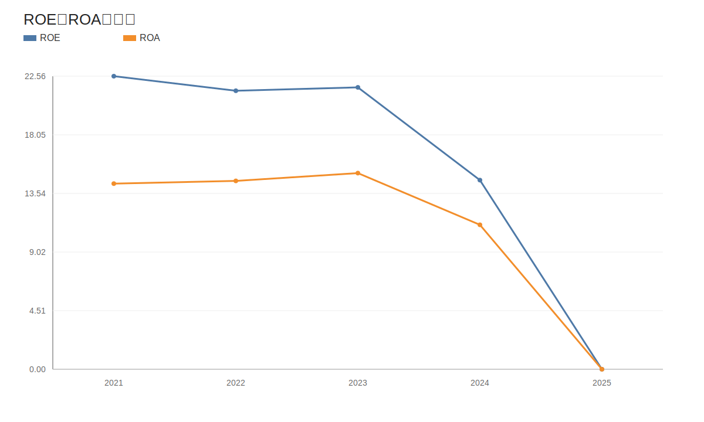
<!-- VALUE_CHARTS_END -->
