# 东鹏饮料（605499）深度价值研究报告

- 报告日期：2026年4月18日
- 数据截止：
  - 财务：2025年12月31日（年报口径）
  - 估值：2026年4月17日（最新交易日）
- 本地库主口径：`income/balancesheet/cashflow/fina_indicator/daily_basic/dividend/fina_audit/stock_company`
- 外部增量验证：上交所公告、国家统计局、公司官网

## 1. 公司概况（商业模式优先）
东鹏饮料以“功能饮料主业+多品类扩张”实现增长，核心收入来自东鹏特饮，补水啦、果茶、咖啡等逐步承接第二曲线。客户结构以 ToC 为主，通过经销商和终端网点覆盖全国地级市，收入具备较强复购属性。公司生产端采用全国多基地布局，以缩短运输半径并提升渠道响应速度。

结论：公司商业模式清晰，属于“高频消费+渠道效率驱动”的可理解生意。
事实：2025 年营收 208.75 亿元，同比增长 31.80%；主业仍由能量饮料驱动。
推断：若多品类贡献继续提升，公司将从“单品爆款”过渡到“平台型饮料公司”。

## 2. 行业与竞争格局
软饮料赛道具备长期需求韧性，但内部结构分化显著，功能饮料、电解质水、低糖茶饮等子赛道竞争更激烈。东鹏在国产能量饮料中处于龙头位置，竞争者既包括功能饮料品牌，也包括综合饮料企业在相关场景的替代产品。

结论：行业仍是好赛道，但已从粗放扩容进入“份额争夺+效率比拼”阶段。
事实：可比样本中，东鹏饮料 2026-04-17 市值约 1128 亿元，显著高于多数 A 股软饮料可比公司。
推断：未来 3-5 年公司的超额收益将更多来自份额提升与组织效率，而非单纯行业贝塔。

## 3. 护城河分析（含真伪辨别）
公司护城河主要由品牌心智、渠道网络、供应链周转效率构成。品牌层面，“累困场景”定位清晰；渠道层面，广覆盖与高动销能力形成执行壁垒；供应链层面，多基地布局降低物流与补货摩擦。

护城河真伪辨别：
- 提价 5% 是否流失客户：在强品牌场景下流失可控，但在同质化渠道端会有替代压力。
- 客户价格敏感度：中等偏高，终端促销与竞品活动会影响短期销量。
- 是否存在“非它不可”场景：在部分功能饮料消费场景存在心智优势，但并非绝对不可替代。
- 替代品出现难度：中等，行业新品迭代快。
- 更换供应商成本：渠道侧中等，消费者侧偏低。

结论：护城河强度评估为“中偏强”。
事实：2025Q3 毛利率 45.17%，净利率 22.32%，盈利效率在可比中领先。
推断：东鹏护城河是复合型执行优势，不是排他性垄断优势。

## 4. 管理层与资本配置
管理层稳定性高，董事长与总经理均为林木勤。公司近年分红持续且金额提升，体现股东回报导向。审计意见连续为标准无保留，财务透明度较高。资本配置上，公司在扩产、渠道、品牌投放之间保持进攻姿态，但短债规模偏高，需持续平衡增长与财务稳健。

结论：管理层与资本配置总体属于“价值创造者（中高置信）”。
事实：2024、2025 年已实施每股现金分红（税前）均为 5.00 元；审计意见连续无保留。
推断：若继续维持分红与现金创造能力，管理层可信度仍有上行空间。

## 5. 财务分析（成长/盈利/健康/现金流）
### 5.1 成长性
2021-2025 年营收从 69.78 亿元增至 208.75 亿元，5 年 CAGR 约 31.52%；归母净利润从 11.93 亿元增至 44.15 亿元，5 年 CAGR 约 38.70%。

### 5.2 盈利能力
截至 2025Q3，毛利率 45.17%、净利率 22.32%、ROE 45.62%、ROIC 24.27%，盈利能力在消费饮料样本中居前。

### 5.3 财务健康
2025 年末总资产 267.21 亿元、总负债 172.97 亿元，货币资金 56.80 亿元，短期借款 66.30 亿元，存在一定净负债压力。

### 5.4 现金流质量
2025 年经营现金流 61.74 亿元，自由现金流 29.63 亿元，经营现金流/归母净利润约 1.40 倍，利润现金化较好。

结论：公司财务质量整体优秀，但债务结构是需要持续跟踪的薄弱环节。
事实：2025 年营收、净利、经营现金流均创历史新高。
推断：若现金流保持强劲且短债占比下降，估值中枢有望上修。

## 6. 成长驱动
中期增长驱动来自三条线：
1. 东鹏特饮基本盘继续扩张。
2. 补水啦、果茶等新品类贡献提升。
3. 全国化产能与渠道下沉带来渗透率提升。

结论：未来 3-5 年增长来源可验证，核心在“新品放量+效率维持”。
事实：2025 年收入与利润同增超 30%，且新产能与渠道扩张仍在推进。
推断：公司从单引擎向多引擎过渡成功与否，将决定增速中枢是否可持续。

## 7. 风险分析（含幸存者偏差）
主要风险包括：渠道促销竞争导致费用率上行、原料价格波动、消费需求波动、短债与现金错配、估值高敏感性。幸存者偏差检验上，公司历史上已经历行业价格战与竞争加剧阶段，仍保持盈利与现金流正向，但未来外部环境变化可能抬升波动。

结论：抗风险能力“中偏强”，但估值波动风险高于经营生存风险。
事实：公司历年利润与经营现金流总体连续为正，审计口径稳定。
推断：最大风险在于“增长降速触发估值压缩”，而不是基本盘崩塌。

## 8. 估值分析
截至 2026-04-17：PE(TTM) 25.56、PB 5.89、PS(TTM) 5.41、股息率 2.50%。

历史分位（近 1 年）：PE/PB/PS 大致都在 13% 左右，处于历史偏低区。横向比较看，公司估值高于承德露露、接近养元饮品，但盈利质量和增速更优。

同时引入绝对估值校准：
- DCF（FCFE）约 80.6-141.6 元
- 反向 DCF 隐含未来 5 年 FCFE 年化增速约 24.9%

结论：估值判断为“相对不贵、绝对不便宜”。
事实：当前估值处于自身一年低分位，但显著高于 DCF 基准值。
推断：若未来两年增长低于市场预期，估值回撤压力会显著上升。

## 9. 投资判断（多头/空头/跟踪指标）
### 多头逻辑
1. 功能饮料龙头地位稳固，渠道执行能力强。
2. 多品类扩张进入兑现期，第二曲线具备潜力。
3. 财务与现金流质量优秀，股东回报持续。
4. 当前估值处于历史偏低分位。

### 空头逻辑
1. 市场对高增长有较高定价，容错率有限。
2. 渠道与营销费用若持续抬升，会压缩利润弹性。
3. 短债规模偏高，需要关注流动性管理。
4. 饮料行业新品竞争密集，品类替代风险常态化。

### 核心跟踪指标（季度）
1. 经营现金流/净利润是否持续 >1。
2. 销售费用率与毛利率组合是否优化。
3. 新品类收入占比和复购表现。
4. 短债与货币资金的匹配度。
5. 存货与应收周转天数变化。

结论：属于“高质量成长股”，但需要纪律化买入和持续跟踪验证。
事实：基本面强于多数可比，估值分位回落至低位。
推断：中长期具备配置价值，短期回报仍取决于增长兑现节奏。

## 10. 最终结论
东鹏饮料是一家具备清晰商业模式、强执行力和高盈利效率的消费成长公司。公司在功能饮料赛道具备领先地位，并正在推进多品类扩张。当前价格对应“质量溢价但并非极端估值”，更适合中长期投资者分批配置。

- 是否是一家好公司：是
- 是否具备长期投资价值：是
- 当前价格是否值得买入：可分批
- 投资建议：观察偏买入（分批）

结论：给出“观察偏买入（分批）”。
事实：公司成长、盈利、现金流三项核心指标均处高位。
推断：若后续新品类兑现与现金流稳健延续，估值中枢有望抬升。

## 11. 总评分（100分）
- 商业模式（20%）：17/20
- 护城河（20%）：16/20
- 管理层与资本配置（15%）：13/15
- 财务质量（20%）：17/20
- 风险控制（15%）：11/15
- 估值性价比（10%）：7/10

**最终总分：81/100**

结论：81 分对应“优质公司，可跟踪配置”。
事实：公司经营质量较高，主要扣分来自估值敏感与行业竞争。
推断：分数提升的关键是多品类兑现与负债结构优化。

## 12. 三个终极问题（必须回答）
1. 如果提价 5%，客户会不会流失？
会有一定流失，尤其在价格敏感渠道；但在品牌心智强场景下，流失可控。

2. 公司赚的钱有没有被管理层浪费？
当前证据不支持“系统性浪费”：分红持续、经营现金流强、扩产与渠道投入仍围绕主业。

3. 在行业最差年份，公司是怎么活下来的？
依靠高周转渠道体系、品牌心智和现金流管理保持盈利韧性，避免了库存与资金链失控。

结论：三问整体偏正面，核心矛盾在估值与增速匹配，不在公司生存能力。
事实：公司历年利润与现金流表现稳健，且分红记录连续。
推断：长期价值成立，但买入回报高度依赖买入价格与兑现节奏。

## 外部增量验证来源
- [东鹏饮料 2025 年年度报告（上交所，2026-03-31）](https://static.sse.com.cn/disclosure/listedinfo/announcement/c/new/2026-03-31/605499_20260331_JIEN.pdf)
- [东鹏饮料 2025 年年度报告摘要（上交所，2026-03-31）](https://static.sse.com.cn/disclosure/listedinfo/announcement/c/new/2026-03-31/605499_20260331_W4HK.pdf)
- [东鹏饮料 2025 年度主要经营数据公告（上交所，2026-03-31）](https://static.sse.com.cn/disclosure/listedinfo/announcement/c/new/2026-03-31/605499_20260331_4Y6N.pdf)
- [国家统计局：2025 年社会消费品零售总额（2026-01-17）](https://www.stats.gov.cn/sj/zxfb/202501/t20250117_1958337.html)
- [东鹏饮料官网（公司简介与产品矩阵）](https://www.szeastroc.com/)

<!-- VALUE_CHARTS_START -->
## 图表图片（自动生成）

### 1. 主营业务收入趋势图
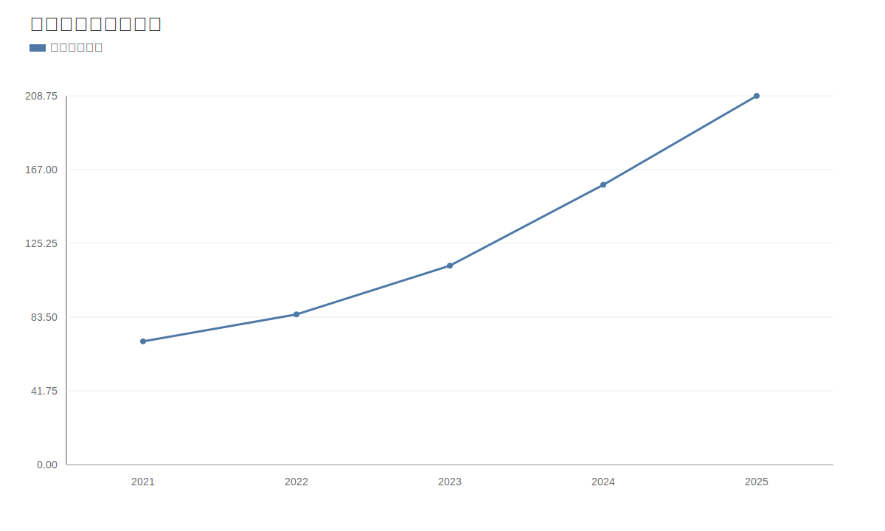

### 2. 净利润趋势图
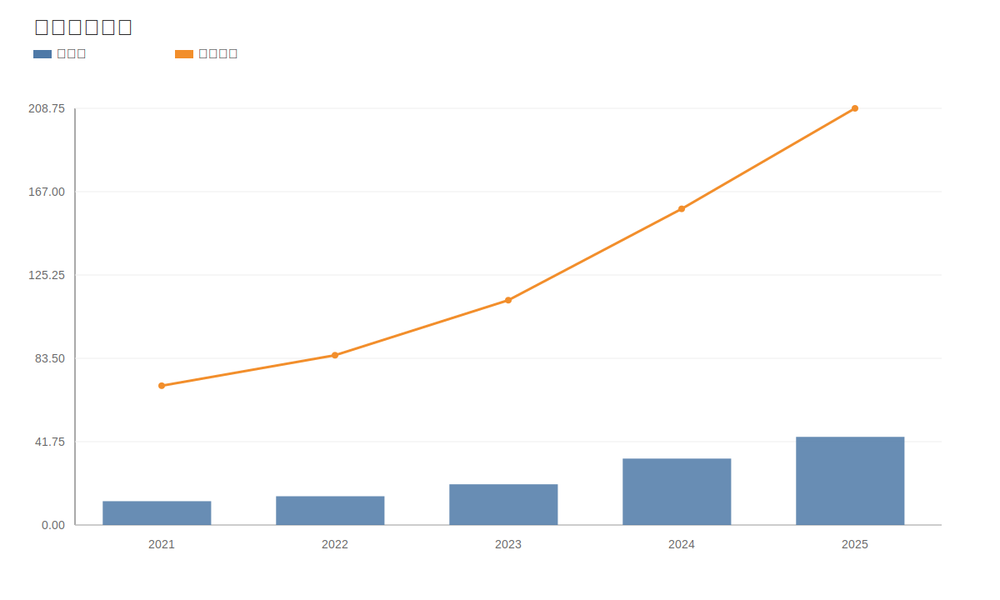

### 3. 毛利率和净利率对比图
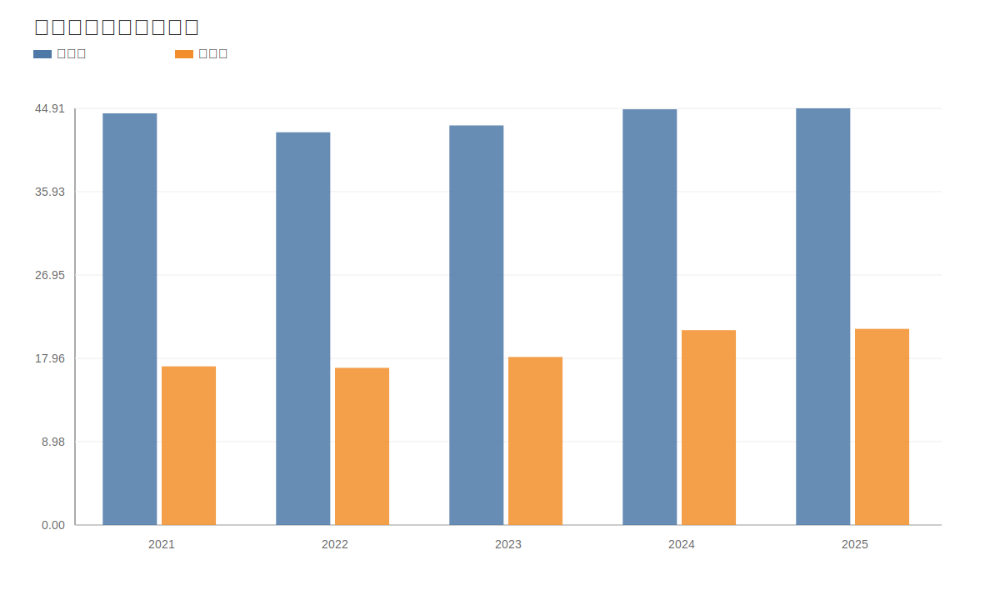

### 4. 分产品收入结构图
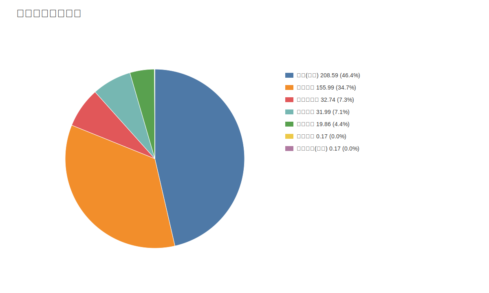

### 4. 分产品收入变化图
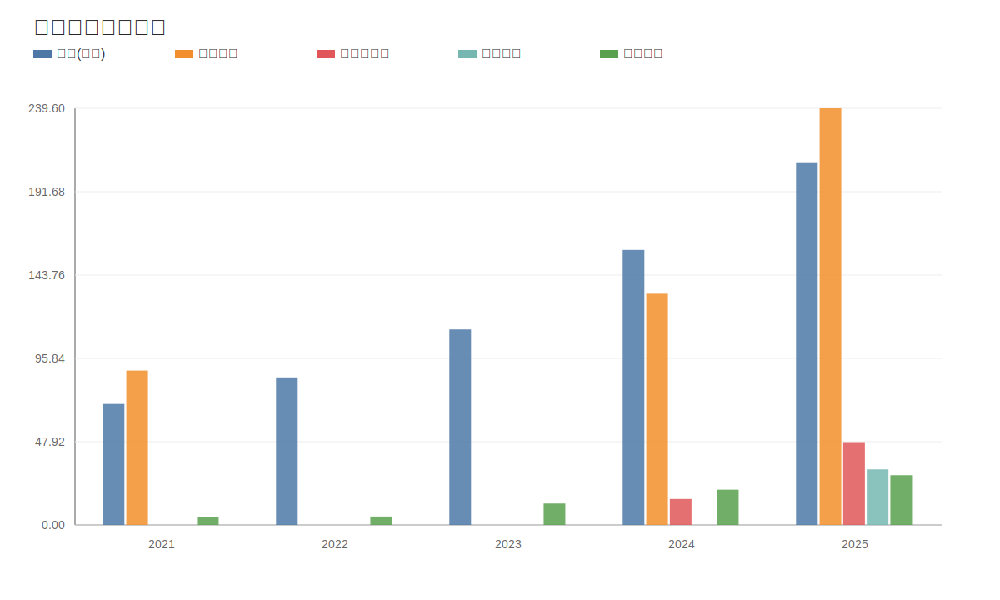

### 5. 分产品利润结构图
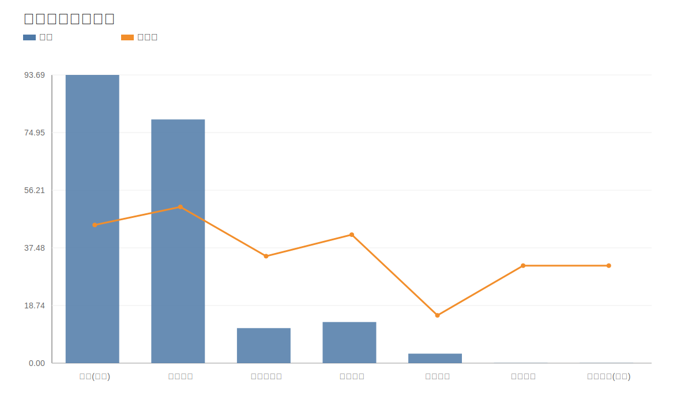

### 6. 分地区收入分布图
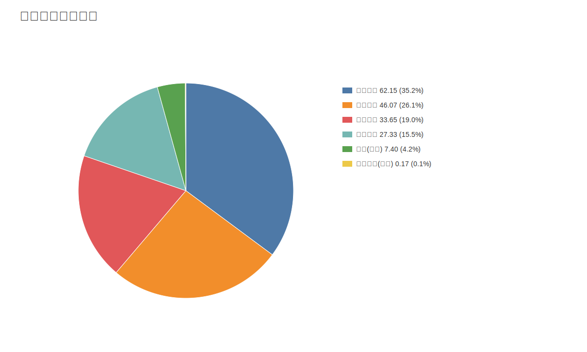

### 7. 资产负债表关键数据图
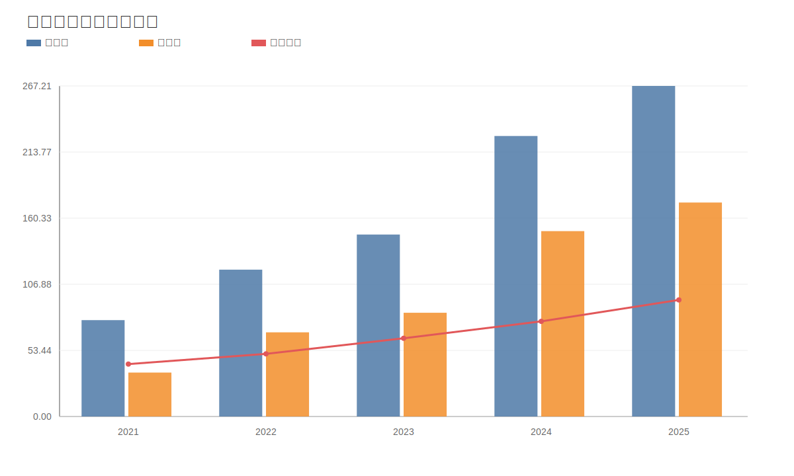

### 8. 自由现金流与经营现金流对比图
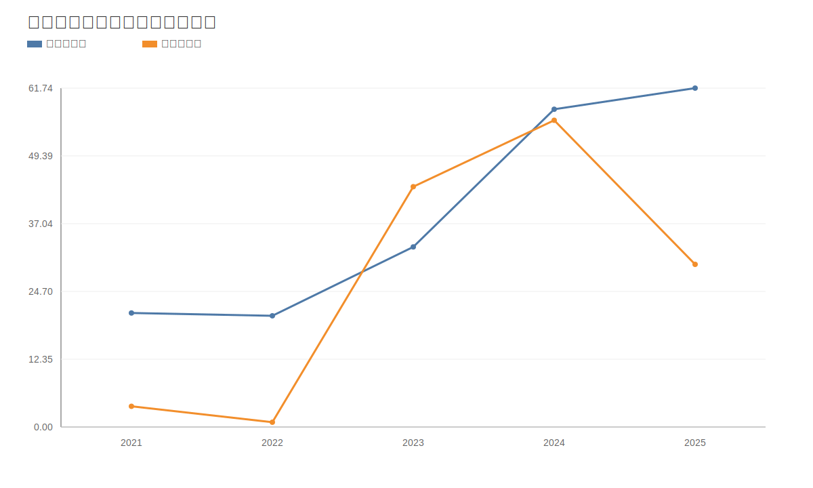

### 9. 股东回报分析图
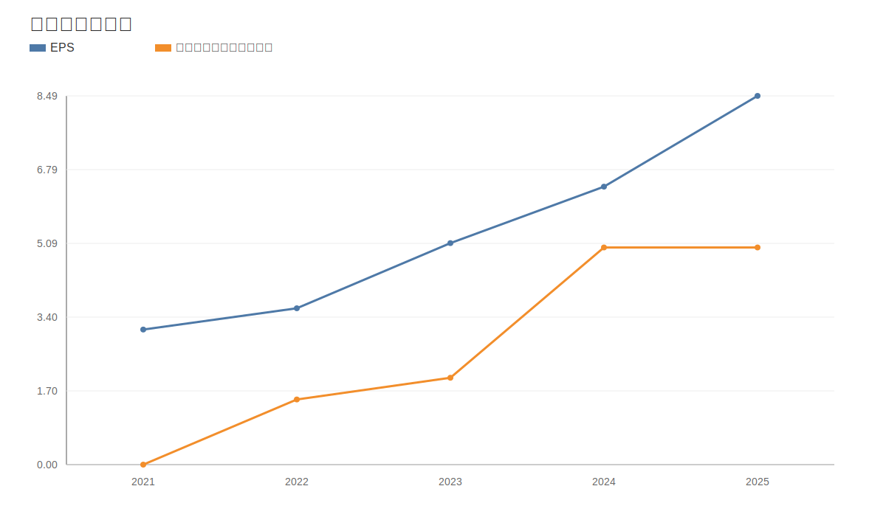

### 10. 财务比率分析图
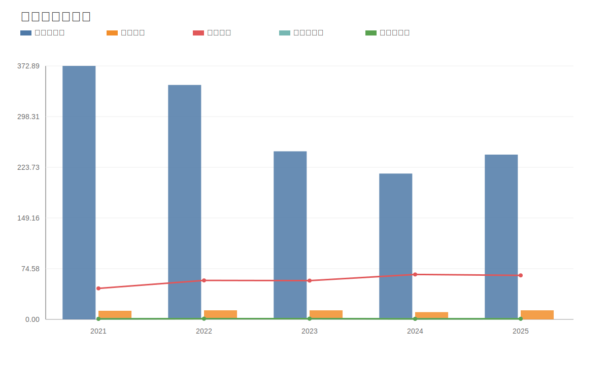

### 11. ROE与ROA对比图
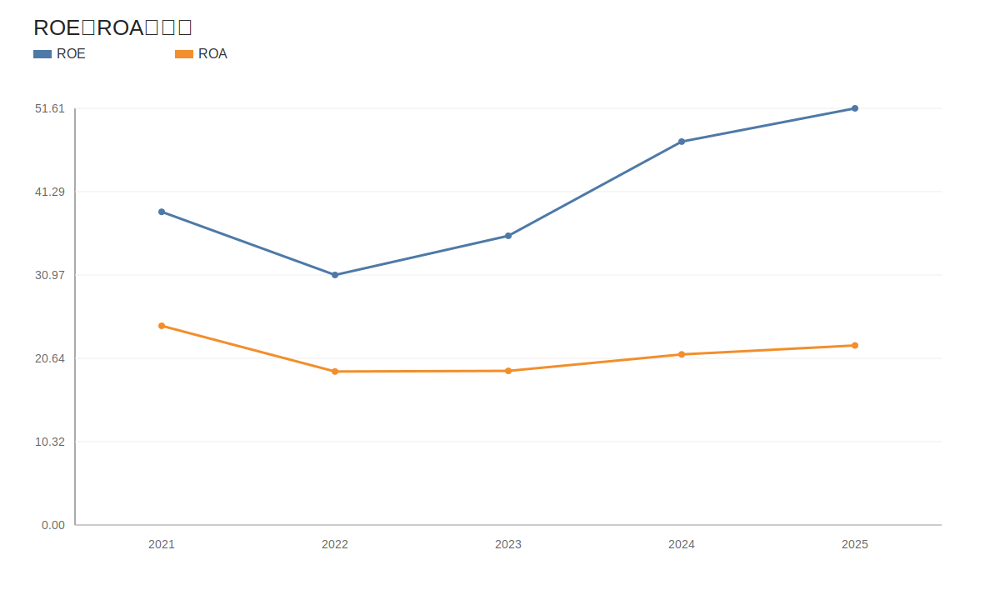
<!-- VALUE_CHARTS_END -->
