# 绿的谐波（688017.SH）深度价值研究报告

- 生成时间：2026-04-22 14:55:00
- 价格日期：2026-04-21
- 财报日期：2025-09-30
- 最新增量校验：2025 年度业绩快报（公告日期 2026-02-27，公告编号 2026-004，未经审计）
- 数据口径：本地财务库 + Tushare 快照 + 交易所公告增量验证

## 估值快照（2026-04-21）
- 收盘价：213.32 元
- PE(TTM)：313.07 倍（上市以来约 80.7% 分位）
- PB：11.06 倍（上市以来约 77.8% 分位）
- PS(TTM)：68.74 倍（上市以来约 87.6% 分位）
- 股息率(TTM)：0.0468%
- 总市值：约 391.08 亿元

## 1. 公司概况（商业模式优先）
绿的谐波是机器人精密传动环节核心零部件厂商，主营谐波减速器，同时布局机电一体化执行器与精密零部件。公司的商业逻辑是“技术壁垒 + 制造能力 + 客户验证周期”。

结论：公司商业模式清晰，属于机器人产业链高价值环节。
事实：主营产品聚焦明确，2025 年收入和利润显著修复。
推断：若执行器业务持续放量，公司有机会从单品龙头升级为平台型传动供应商。

## 2. 行业与竞争格局
根据 IFR《World Robotics 2025》，2024 年全球工业机器人新增装机约 54.2 万台，其中中国约 29.5 万台，占全球约 54%。行业中长期仍在扩容，但国产厂商竞争也在加剧。

结论：赛道景气方向正确，但竞争强度高。
事实：中国仍是全球最大机器人市场，需求端具备长期支撑。
推断：公司后续超额收益取决于份额提升与产品结构升级，而非单纯行业 beta。

## 3. 护城河分析（含真伪辨别）
护城河主要来自高精密传动技术、批量一致性制造、客户导入验证与交付能力。公司在国内处于领先梯队，但并非无竞争状态。

真伪辨别：
- 提价 5% 是否流失客户：标准化中低端客户更敏感，高端场景相对不敏感。
- 是否存在“非它不可”：部分高精度场景存在，但整体不是绝对垄断。
- 替代难度：中短期不低，长期仍有技术与价格替代压力。

结论：护城河强度评估为“中偏强”。
事实：公司毛利率中枢仍高于多数通用机械零部件企业。
推断：若执行器业务形成规模效应，护城河有望加宽。

## 4. 管理层与资本配置
公司在 2024 年利润承压期仍保持研发和海外拓展投入，2025 年快报显示经营结果明显修复。资本配置风格偏成长型，而非短期利润最大化。

结论：管理层当前评价为“中性偏正面”。
事实：2024 年利润下滑与费用投入上升同时出现，2025 年收入利润同步恢复。
推断：前置投入若继续转化为订单，资本配置评价可进一步上修。

## 5. 财务分析（成长/盈利/健康/现金流）
### 5.1 成长性
- 2020-2024 营收 CAGR 约 15.66%。
- 2025 年业绩快报：营收 5.69 亿元（+46.86%），归母净利 1.25 亿元（+122.40%）。

### 5.2 盈利能力
- 2021-2024 毛利率由 52.52% 下行至 37.54%，利润率中枢回落后正在修复。
- 2025Q1-Q3 净利率约 23.35%，较 2024 年改善。

### 5.3 财务健康
- 2025Q3 资产负债率约 9.83%，流动比率约 10.09。
- 货币资金约 2.36 亿元，有息负债约 0.30 亿元，净现金为正。

### 5.4 现金流质量
- 2025Q3 经营现金流约 1.10 亿元，经营现金流/利润约 103.93%。
- 自由现金流阶段性为负，体现扩产和投入周期特征。

结论：底盘稳健，成长恢复明确，但现金流波动仍需跟踪。
事实：低杠杆、高流动性、经营现金流明显改善。
推断：若 2026 年收入继续放量，利润和自由现金流有望同步修复。

## 6. 成长驱动
未来 3-5 年主要驱动来自四点：工业机器人复苏、具身智能放量、海外渠道拓展、执行器产品线扩张。

结论：成长驱动真实存在，关键在兑现节奏。
事实：公司公告明确提及工业机器人回暖、具身智能客户转入小批量、海外拓展见效。
推断：若头部客户进入连续量产，公司有望获得更高业绩弹性。

## 7. 风险分析（含幸存者偏差）
核心风险包括：行业需求波动、价格竞争、技术替代、客户节奏变化、估值回撤。

幸存者偏差检验：
- 2023-2024 行业偏弱期，公司利润显著承压，说明并非天然“穿越周期”。
- 2025 年修复说明公司具备一定抗压调整能力。

结论：抗风险能力评估“中等”。
事实：历史上利润确实经历回撤后再恢复。
推断：公司更像“有韧性的成长制造”，而非弱周期资产。

## 8. 估值分析
可比公司同日估值粗对比：
- 双环传动（002472）：PE 27.9x / PB 3.49x / PS 3.89x
- 中大力德（002896）：PE 227.5x / PB 11.87x / PS 13.71x
- 汇川技术（300124）：PE 34.5x / PB 5.20x / PS 4.13x
- 绿的谐波（688017）：PE 313.1x / PB 11.06x / PS 68.74x

结论：当前估值偏高，安全边际不足。
事实：PE/PB/PS均处于公司历史较高分位，且显著高于多数可比公司。
推断：后续回报更依赖盈利持续超预期，而不是估值再抬升。

## 9. 投资判断（多头/空头/跟踪指标）
多头逻辑：
1. 机器人行业回暖，主业弹性恢复。
2. 具身智能链条带来新增需求。
3. 低杠杆财务结构支持持续投入。
4. 2025 年收入利润增速显著回升。

空头逻辑：
1. 估值处高位，容错率低。
2. 毛利率中枢较历史高点仍有差距。
3. 竞争加剧可能压缩利润弹性。
4. 新业务放量节奏不确定。

核心跟踪指标：
1. 谐波减速器与执行器分业务增速。
2. 毛利率与经营现金流/净利润匹配度。
3. 海外收入占比与头部客户量产进度。

结论：策略上应以“跟踪+择时”替代“追高”。
事实：基本面修复和高估值同时存在。
推断：风险收益比目前不对称，更适合等待更优买点。

## 10. 最终结论
- 这是否是一家好公司：是，属于机器人核心零部件优质资产。
- 是否具备长期投资价值：具备，但波动和预期博弈强。
- 当前价格是否值得买入：在 2026-04-21 口径下，不是高安全边际买点。
- 投资建议：**观察**。

结论：给出“观察”，不建议在高估值区间激进追价。
事实：公司业绩修复明确，但估值处于高位分位。
推断：更优决策是等待估值回落或盈利继续超预期后再评估。

## 11. 总评分（100分）
- 商业模式（20%）：16
- 护城河（20%）：14
- 管理层与资本配置（15%）：11
- 财务质量（20%）：12
- 风险控制（10%）：6
- 估值性价比（15%）：4

**最终总分：63 / 100**

结论：公司质量中上，但估值拖累综合分。
事实：成长恢复与资产负债表稳健均有支撑，估值显著偏高。
推断：若未来 2-3 个季度继续高质量增长，评分可上调。

## 12. 三个终极问题（必须回答）
1. 如果提价 5%，客户会不会流失？  
答：中低端场景流失风险较高，高精度核心场景相对可控。

2. 公司赚的钱有没有被管理层浪费？  
答：当前更像“前置投入换未来增长”，暂未见明显资本错配证据，但需持续验证投入回报率。

3. 在行业最差年份，公司是怎么活下来的？  
答：依靠低杠杆与现金安全垫，在利润承压阶段维持研发和市场投入，等待景气修复。

结论：公司“有质量”，但“价格不便宜”。
事实：历史下行阶段利润承压但财务未失衡，2025 年业绩修复明显。
推断：后续关键是把增长持续性转化为估值消化能力。

## 外部增量验证来源
- 2025 年业绩快报（2026-02-27）：https://stockmc.xueqiu.com/202602/688017_20260227_1EJI.pdf
- 2024 年业绩快报（2025-02-28，SSE）：https://big5.sse.com.cn/site/cht/www.sse.com.cn/disclosure/listedinfo/announcement/c/new/2025-02-28/688017_20250228_H5HD.pdf
- 2026 年第一次临时股东会通知（SSE）：https://big5.sse.com.cn/disclosure/listedinfo/announcement/c/new/2026-03-04/688017_20260304_E4OU.pdf
- IFR《World Robotics 2025》：https://ifr.org/ifr-press-releases/news/global-robot-demand-in-factories-doubles-over-10-years%20%20%20

<!-- VALUE_CHARTS_START -->
## 图表图片（自动生成）

### 1. 主营业务收入趋势图
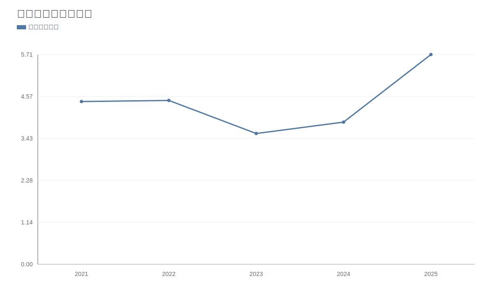

### 2. 净利润趋势图
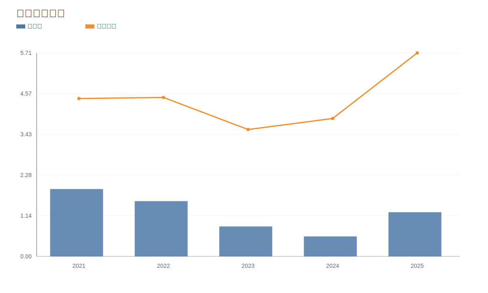

### 3. 毛利率和净利率对比图
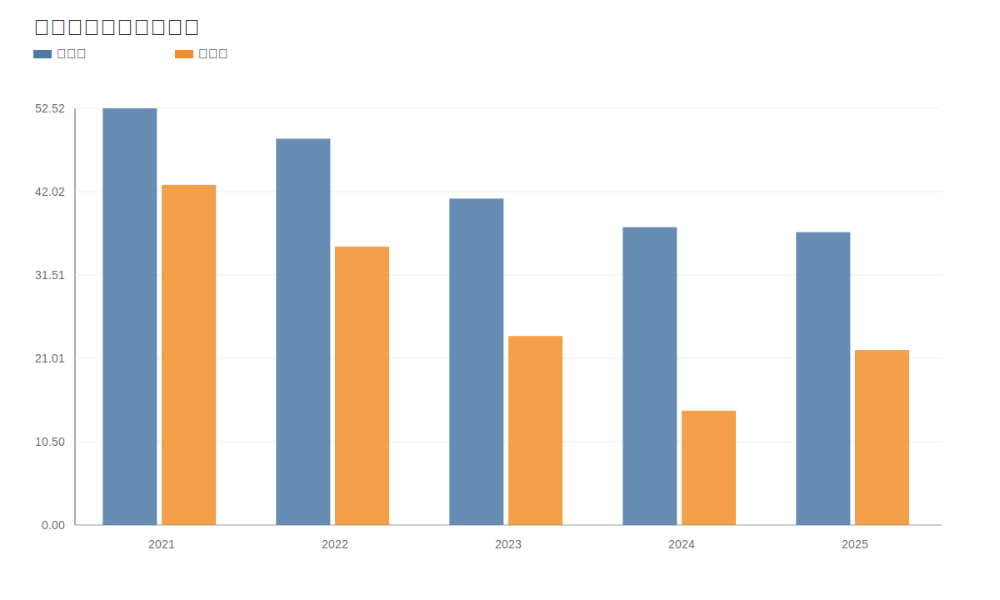

### 4. 分产品收入结构图
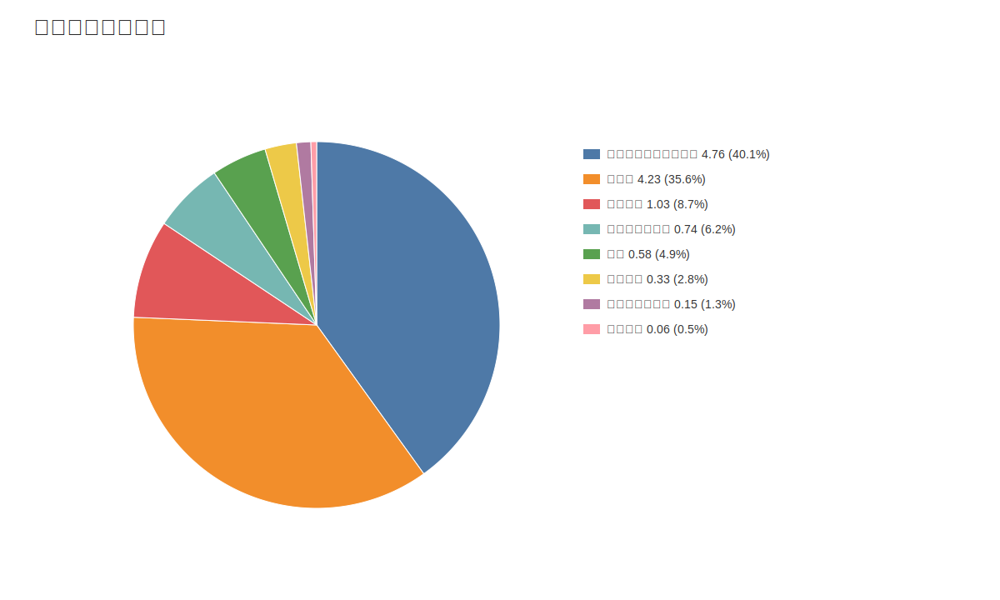

### 4. 分产品收入变化图
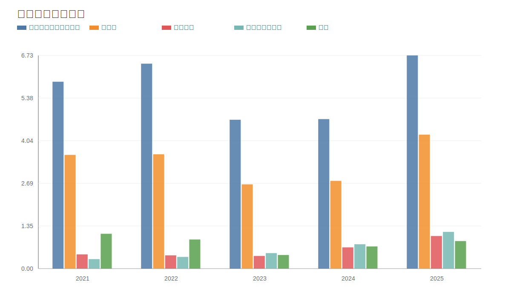

### 5. 分产品利润结构图
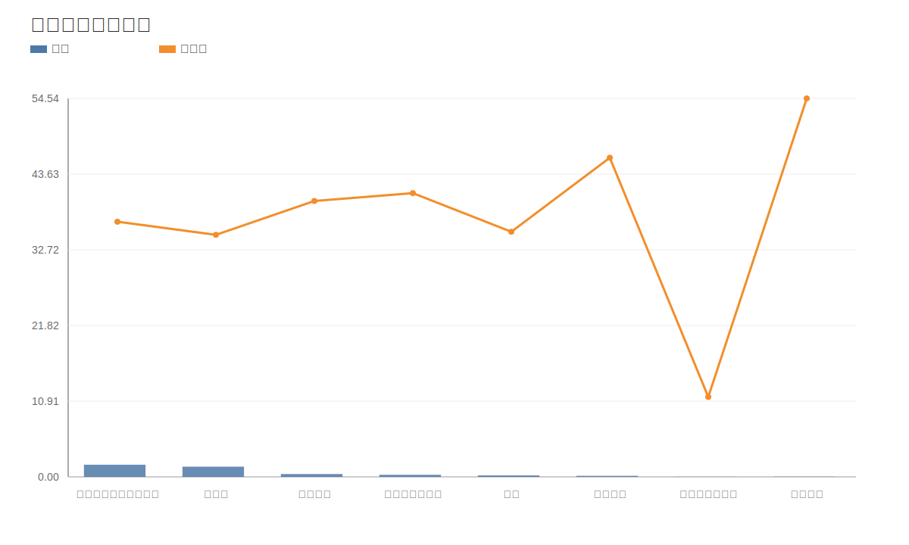

### 6. 分地区收入分布图

### 7. 资产负债表关键数据图
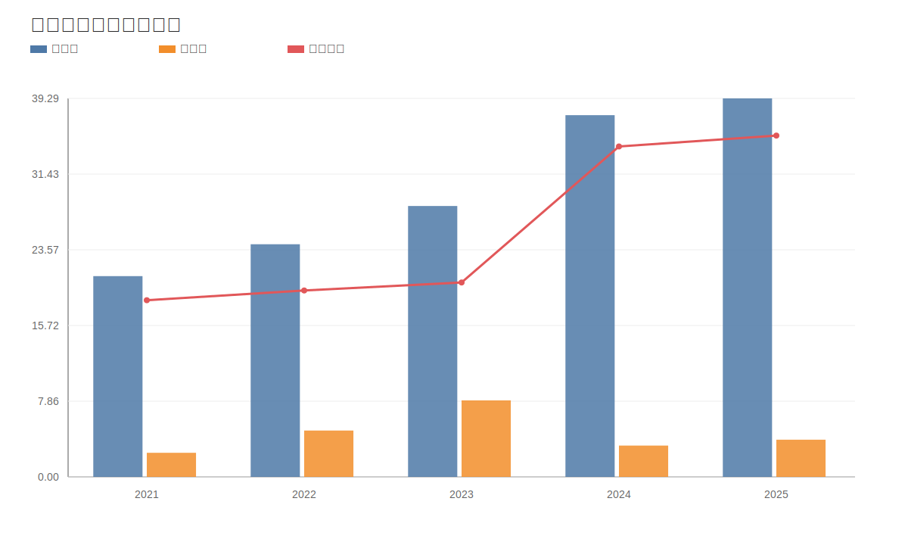

### 8. 自由现金流与经营现金流对比图
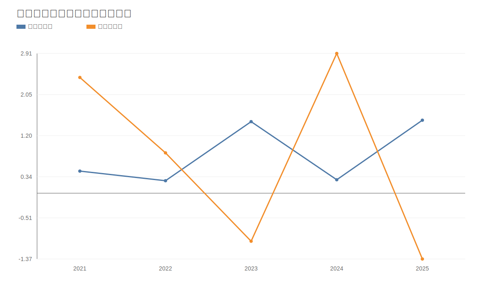

### 9. 股东回报分析图
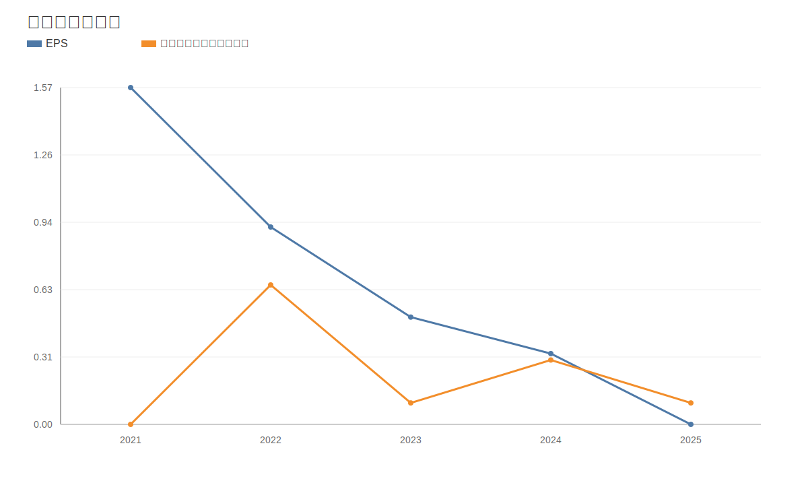

### 10. 财务比率分析图
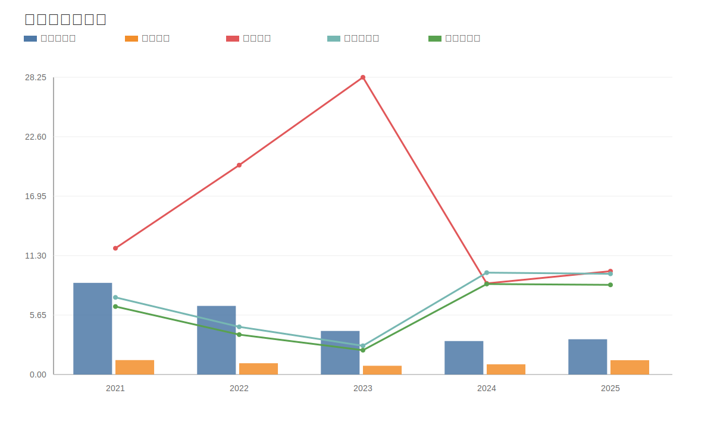

### 11. ROE与ROA对比图
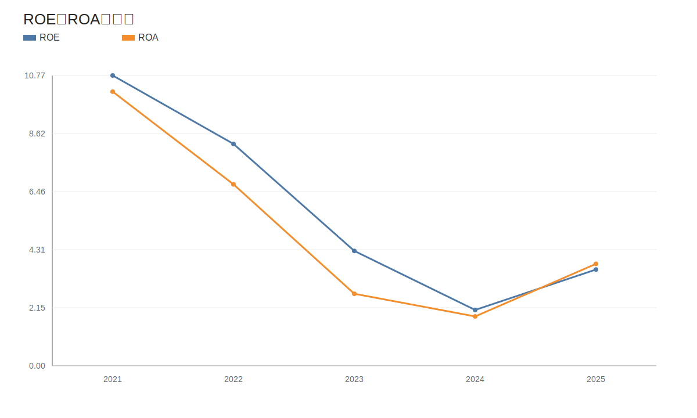
<!-- VALUE_CHARTS_END -->
