# 泽璟制药U（688266.SH）深度价值研究报告

- 价格日期：2026-05-11
- 财报日期：2026-03-31
- 数据口径：本地数据库主口径，外部定性信息待公告逐项复核
- 当前价格/市值：105.28元 / 278.68亿元

## 1. 公司概况
事实：公司属于生物制药，2025年收入8.10亿、归母净利润-1.63亿。业务结构：2025年医药制造收入8.10亿，药品口径8.03亿；经销授权许可约0.08亿。
推断：公司质量判断不能只看单季度，应把2026Q1高景气与2021-2025完整周期放在一起看。
结论：事实：价格日2026-05-11，财报日2026-03-31；推断：泽璟制药U的核心判断来自主营结构、现金流和估值三者是否匹配。

## 2. 行业与竞争格局
事实：2026Q1收入9.05亿，同比440.07%；归母净利润6.33亿，同比2338.37%。
推断：行业位置取决于能否把增长转化为稳定现金流，而不是单纯追逐收入增速。
结论：事实：短期增长数据强弱已经体现在估值中；推断：竞争格局仍需跟踪价格、份额和客户预算变化。

## 3. 护城河分析（含真伪辨别）
事实：中等偏弱到中等：创新药管线和适应症扩展有期权价值，但商业化、医保定价、竞品临床数据会快速重估护城河。
推断：护城河若不能体现为毛利率、复购、现金流或议价能力，就应按伪护城河处理。
结论：事实：毛利率97.01%、净利率69.87%；推断：护城河强度为中等偏弱。

## 4. 管理层与资本配置
事实：盛泽林任董事长兼总经理，研发型公司特征明显；历史长期亏损，2026Q1利润跃升需要核实是否包含一次性授权/里程碑收入。
推断：资本配置评价重点是分红/回购、研发/扩产回报和现金消耗，而非管理层叙事。
结论：事实：净现金12.91亿；推断：管理层暂列待验证。

## 5. 财务分析（成长/盈利/健康/现金流）
事实：近五年营收CAGR 43.65%，净利CAGR N/A；2026Q1经营现金流8.37亿，ROE 45.29%，ROIC 25.40%，资产负债率53.56%。
推断：现金流/利润匹配度比会计利润更重要，尤其在高估值或周期性行业。
结论：事实：货币资金22.18亿、净现金12.91亿；推断：财务质量为改善中但波动高。

## 6. 成长驱动
事实：药品收入扩大，2026Q1收入、利润、经营现金流同步转正，说明商业化或授权进入收获期。
推断：成长驱动需要拆成放量、提价、新品、授权或周期修复，不能把一次性改善线性外推。
结论：事实：2026Q1营收同比440.07%；推断：未来3-5年最重要的验证点是增长是否继续转化为自由现金流。

## 7. 风险分析（含幸存者偏差）
事实：2025仍亏损，估值高，单季度高利润可持续性待核实；创新药临床、医保和竞品风险高。
推断：幸存者偏差检验要看行业最差年份仍能否盈利、正现金流、低杠杆生存。
结论：事实：资产负债率53.56%；推断：抗风险能力为中弱。

## 8. 估值分析
事实：PE(TTM)55.97倍，PB 16.27倍，PS(TTM)18.00倍，股息率N/A。DCF合理市值约190-300亿元；反向DCF显示当前约279亿元市值要求核心产品收入持续高增长并维持90%上下高毛利，且研发费用率逐步摊薄。
推断：安全边际取决于当前价格是否明显低于DCF下沿，且反向DCF假设是否保守。
结论：事实：当前市值278.68亿元；推断：估值性价比为高不确定。

## 9. 投资判断（多头/空头/跟踪指标）
事实：多头逻辑：药品收入扩大，2026Q1收入、利润、经营现金流同步转正，说明商业化或授权进入收获期。 空头逻辑：2025仍亏损，估值高，单季度高利润可持续性待核实；创新药临床、医保和竞品风险高。
推断：跟踪指标包括收入增速、毛利率、经营现金流、应收/库存、核心业务份额、分红或研发兑现。
结论：事实：2026Q1净利同比2338.37%；推断：当前更适合列入跟踪池，而非无条件买入。

## 10. 最终结论
事实：公司在各自行业具备可识别的核心资产，但估值与成长持续性要求不同。
推断：好公司不等于好价格；短期利润高增长需要用后续季度验证。
结论：事实：价格日2026-05-11；推断：投资建议为【观察】。

## 11. 总评分（100分）
事实：商业模式20分、护城河20分、管理层与资本配置15分、财务质量20分、风险控制10分、估值性价比15分。
推断：综合得分 62/100。分项估算：商业模式12/20，护城河12/20，管理层9/15，财务质量12/20，风险控制6/10，估值性价比9/15。
结论：事实：评分是研究框架输出，不是交易指令；推断：62分对应【观察】。

## 12. 三个终极问题
事实：如果提价5%：药品通常受医保和竞品约束，直接提价5%难度较高，授权收入另论。 公司赚的钱是否被浪费：研发投入是必要资本配置，但历史亏损期较长，需用后续管线转化率验证是否创造价值。 行业最差年份如何活下来：靠现金储备、融资能力和研发管线推进生存；最差年份关注现金消耗和核心产品销售。
推断：三问的答案决定公司是否值得长期持有，而估值决定是否值得现在买。
结论：事实：三问均存在可跟踪指标；推断：当前结论为【观察】。

<!-- VALUE_CHARTS_START -->
## 图表图片（自动生成）

### 1. 主营业务收入趋势图
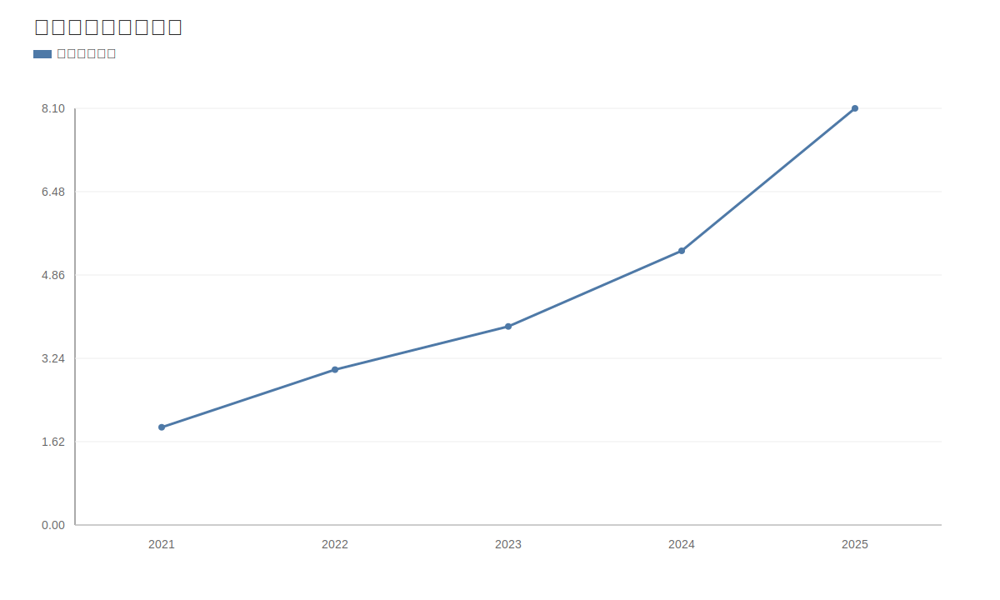

### 2. 净利润趋势图
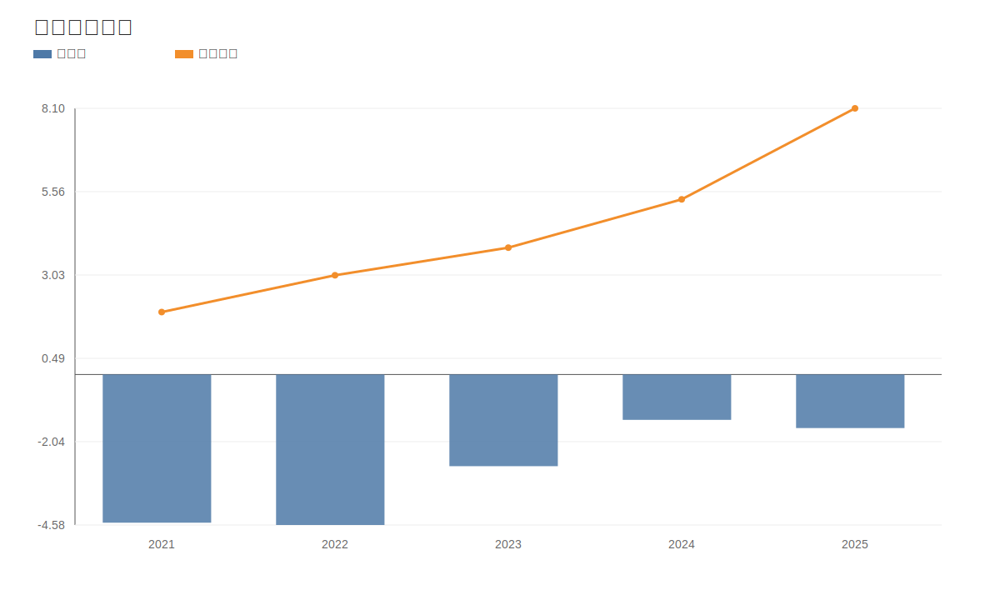

### 3. 毛利率和净利率对比图
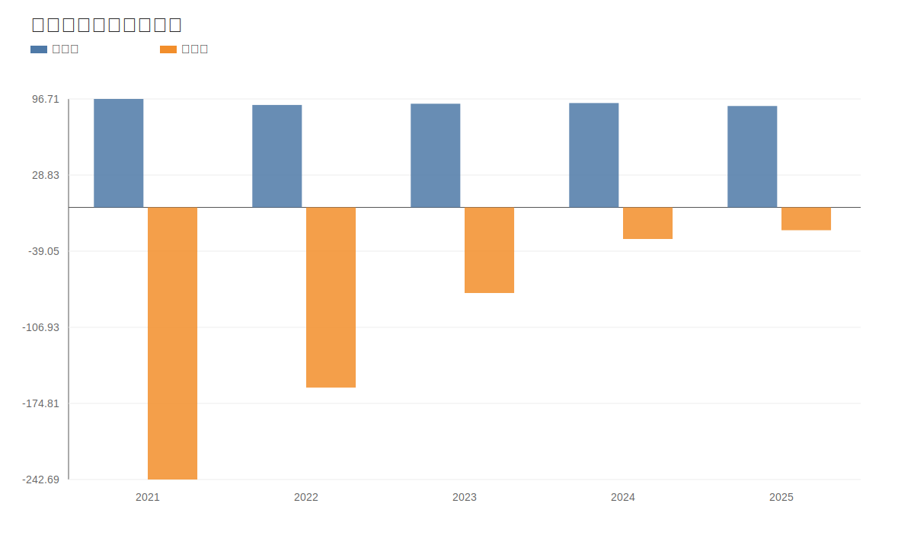

### 4. 分产品收入结构图
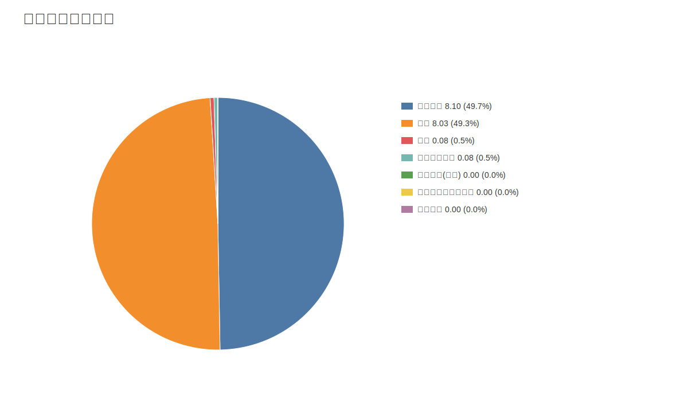

### 4. 分产品收入变化图
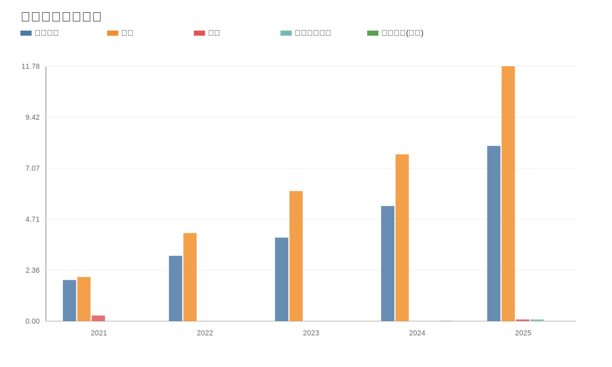

### 5. 分产品利润结构图
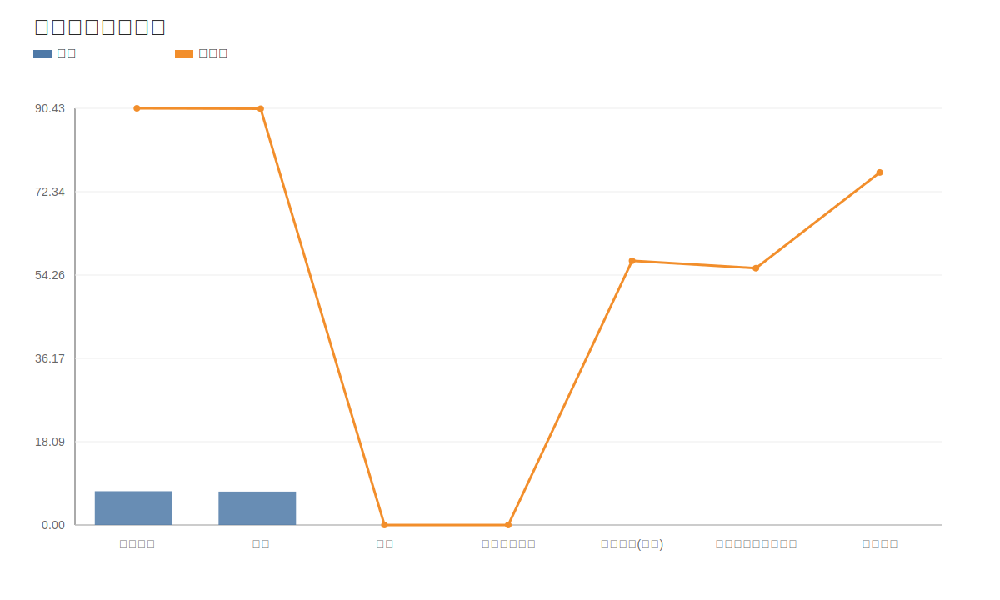

### 6. 分地区收入分布图
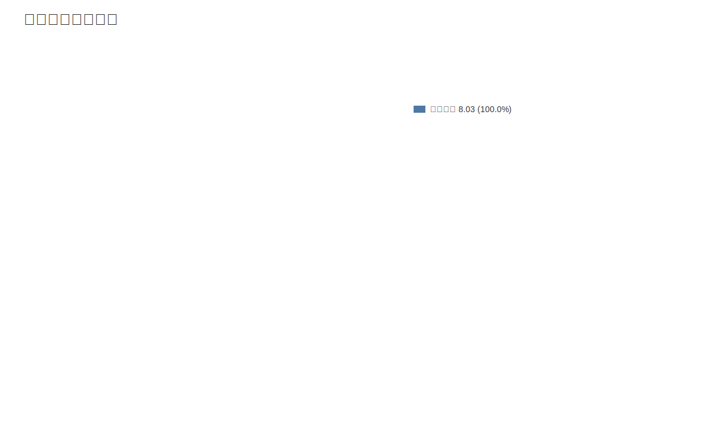

### 7. 资产负债表关键数据图
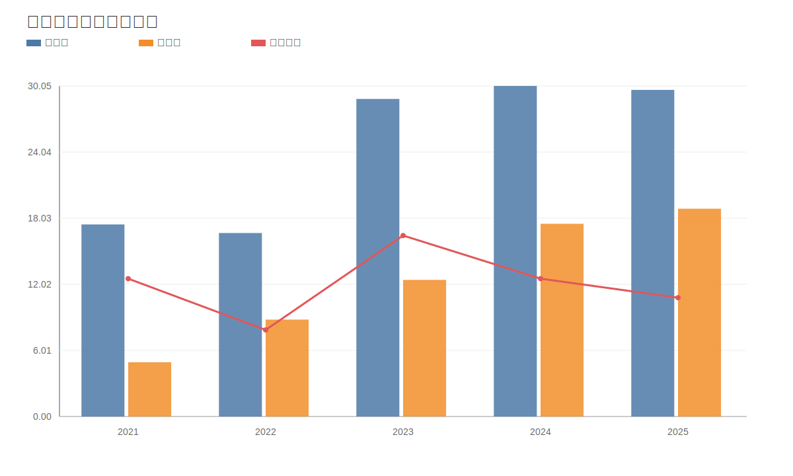

### 8. 自由现金流与经营现金流对比图
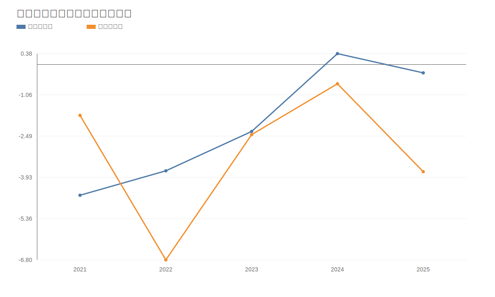

### 9. 股东回报分析图
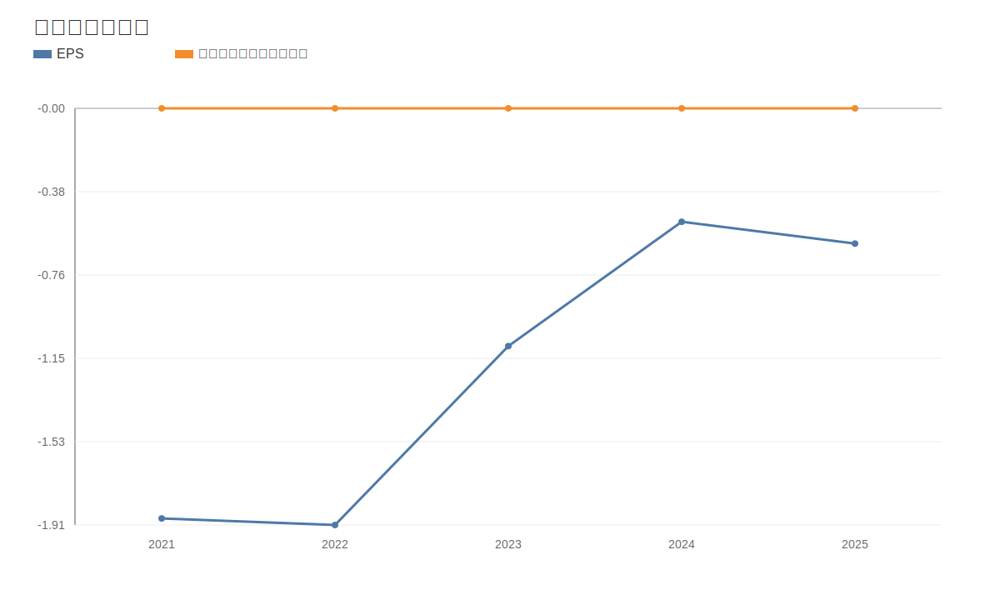

### 10. 财务比率分析图
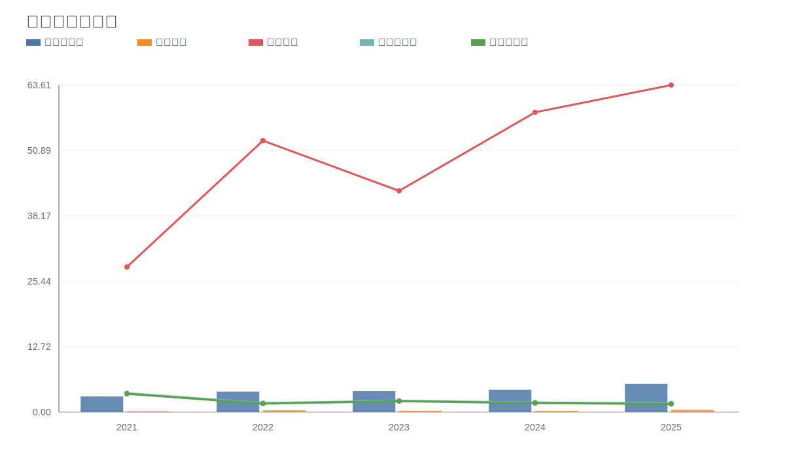

### 11. ROE与ROA对比图
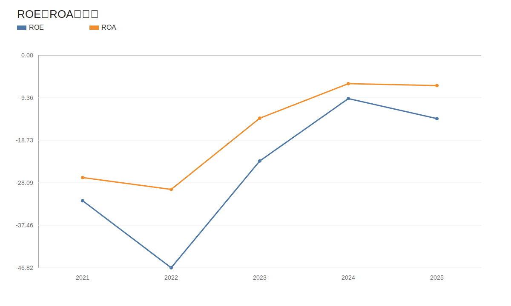
<!-- VALUE_CHARTS_END -->

免责声明：本分析仅供教育和研究用途，不构成投资建议。
