# 华润微（688396.SH）价值分析报告草稿

- 生成时间：2026-05-13 08:10:32
- 自动化脚本：`.agents/skills/value-report/value_report_scaffold.py`
- 数据口径：数据库字段定义以 `app/models/models.py` 为准
- 公司信息：行业 半导体｜地区 江苏｜上市日期 20200227
- 管理层：董事长 李虹｜总经理 N/A｜员工 11000
- 主营业务：主营业务可分为产品与方案,制造与服务两大业务板块.
- 提示：本文件已自动填充定量部分，定性模块请结合最新公告与行业资料补充。

## 自动填充数据（可直接引用）
### 最新估值
- 交易日：20260511
- 收盘价：59.70 元
- PE(TTM)：87.39 倍
- PB：3.43 倍
- PS(TTM)：6.86 倍
- 股息率(TTM)：0.14%
- 总市值：792.94 亿元

### 最新财务快照
- 报告期：20260331
- 营收：28.57亿（同比 21.34%）
- 归母净利润：3.30亿（同比 296.56%）
- 经营现金流：6.27亿（同比 131.50%）
- 自由现金流：-2.54亿
- 毛利率：25.48%，净利率：10.57%
- ROE：1.43%，ROIC：1.15%
- 资产负债率：17.87%，流动比率：3.16
- 经营现金流/利润：160.52%
- 货币资金：86.28亿，有息负债：0.18亿，净现金：86.10亿

### 近五年年报趋势
| 年度 | 营收 | 营收同比 | 归母净利 | 净利同比 | 毛利率 | 净利率 | ROE | ROIC | 资产负债率 | 经营现金流 | 自由现金流 | 现净比 |
| --- | --- | --- | --- | --- | --- | --- | --- | --- | --- | --- | --- | --- |
| 2025 | 110.54亿 | 9.24% | 6.61亿 | -13.37% | 26.38% | 5.02% | 2.92% | 1.66% | 18.71% | 20.85亿 | 6.92亿 | 315.61% |
| 2024 | 101.19亿 | 2.20% | 7.62亿 | -48.46% | 27.19% | 6.54% | 3.48% | 2.20% | 16.53% | 20.36亿 | 0.78亿 | 267.03% |
| 2023 | 99.01亿 | -1.59% | 14.79亿 | -43.48% | 32.22% | 14.53% | 7.12% | 5.30% | 19.12% | 17.38亿 | -36.18亿 | 117.47% |
| 2022 | 100.60亿 | 8.77% | 26.17亿 | 15.40% | 36.71% | 25.84% | 14.04% | 11.76% | 21.78% | 30.58亿 | 13.26亿 | 116.86% |
| 2021 | 92.49亿 | N/A | 22.68亿 | N/A | 35.33% | 24.41% | 16.27% | 13.12% | 21.14% | 34.54亿 | 26.18亿 | 152.32% |

- 近五年营收CAGR：4.56%
- 近五年净利CAGR：-26.54%

### 分红与审计
#### 已实施分红
2025年已实施现金分红（税前）合计：每股 0.084 元
2024年已实施现金分红（税前）合计：每股 0.112 元
2023年已实施现金分红（税前）合计：每股 0.198 元
2022年已实施现金分红（税前）合计：每股 0.172 元

#### 审计意见
- 20241231：标准无保留意见（立信会计师事务所）
- 20231231：标准无保留意见（立信会计师事务所）
- 20221231：标准无保留意见（天职国际会计师事务所）
- 20211231：标准无保留意见（天职国际会计师事务所）
- 20201231：标准无保留意见（天职国际会计师事务所）

## ECharts 图表数据（option）

- 说明：以下 `option` 可直接用于前端图表渲染；单位已在坐标轴标注。

### 1. 主营业务收入趋势图
```json
{
  "title": {
    "text": "主营业务收入趋势（近5年）"
  },
  "tooltip": {
    "trigger": "axis"
  },
  "legend": {
    "top": 24,
    "data": [
      "主营业务收入"
    ]
  },
  "xAxis": {
    "type": "category",
    "data": [
      "2021",
      "2022",
      "2023",
      "2024",
      "2025"
    ]
  },
  "yAxis": {
    "type": "value",
    "name": "亿元"
  },
  "series": [
    {
      "name": "主营业务收入",
      "type": "line",
      "smooth": true,
      "data": [
        92.49,
        100.6,
        99.01,
        101.19,
        110.54
      ]
    }
  ]
}
```

### 2. 净利润趋势图
```json
{
  "title": {
    "text": "净利润趋势（近5年）"
  },
  "tooltip": {
    "trigger": "axis"
  },
  "legend": {
    "top": 24,
    "data": [
      "净利润",
      "营业收入"
    ]
  },
  "xAxis": {
    "type": "category",
    "data": [
      "2021",
      "2022",
      "2023",
      "2024",
      "2025"
    ]
  },
  "yAxis": [
    {
      "type": "value",
      "name": "亿元"
    },
    {
      "type": "value",
      "name": "亿元"
    }
  ],
  "series": [
    {
      "name": "净利润",
      "type": "bar",
      "data": [
        22.68,
        26.17,
        14.79,
        7.62,
        6.61
      ]
    },
    {
      "name": "营业收入",
      "type": "line",
      "yAxisIndex": 1,
      "data": [
        92.49,
        100.6,
        99.01,
        101.19,
        110.54
      ]
    }
  ]
}
```

### 3. 毛利率和净利率对比图
```json
{
  "title": {
    "text": "毛利率 vs 净利率"
  },
  "tooltip": {
    "trigger": "axis"
  },
  "legend": {
    "top": 24,
    "data": [
      "毛利率",
      "净利率"
    ]
  },
  "xAxis": {
    "type": "category",
    "data": [
      "2021",
      "2022",
      "2023",
      "2024",
      "2025"
    ]
  },
  "yAxis": {
    "type": "value",
    "name": "%"
  },
  "series": [
    {
      "name": "毛利率",
      "type": "bar",
      "data": [
        35.33,
        36.71,
        32.22,
        27.19,
        26.38
      ]
    },
    {
      "name": "净利率",
      "type": "bar",
      "data": [
        24.41,
        25.84,
        14.53,
        6.54,
        5.02
      ]
    }
  ]
}
```

### 4. 分产品收入结构图
```json
{
  "title": {
    "text": "分产品收入结构（20251231）"
  },
  "tooltip": {
    "trigger": "item"
  },
  "legend": {
    "type": "scroll",
    "top": 24
  },
  "series": [
    {
      "type": "pie",
      "radius": "55%",
      "data": [
        {
          "name": "集成电路",
          "value": 108.21
        },
        {
          "name": "产品与方案",
          "value": 60.28
        },
        {
          "name": "制造与服务",
          "value": 47.93
        },
        {
          "name": "其他业务",
          "value": 2.33
        },
        {
          "name": "其他业务(行业)",
          "value": 2.33
        }
      ]
    }
  ]
}
```

### 4. 分产品收入变化图
```json
{
  "title": {
    "text": "分产品收入变化（近5年）"
  },
  "tooltip": {
    "trigger": "axis"
  },
  "legend": {
    "type": "scroll",
    "top": 24,
    "data": [
      "集成电路",
      "产品与方案",
      "制造与服务",
      "其他业务",
      "其他业务(行业)"
    ]
  },
  "xAxis": {
    "type": "category",
    "data": [
      "2021",
      "2022",
      "2023",
      "2024",
      "2025"
    ]
  },
  "yAxis": {
    "type": "value",
    "name": "亿元"
  },
  "series": [
    {
      "name": "集成电路",
      "type": "bar",
      "stack": "total",
      "data": [
        91.58,
        98.96,
        97.5,
        98.41,
        108.21
      ]
    },
    {
      "name": "产品与方案",
      "type": "bar",
      "stack": "total",
      "data": [
        64.01,
        49.47,
        46.7,
        51.53,
        60.28
      ]
    },
    {
      "name": "制造与服务",
      "type": "bar",
      "stack": "total",
      "data": [
        71.84,
        49.49,
        50.8,
        46.88,
        47.93
      ]
    },
    {
      "name": "其他业务",
      "type": "bar",
      "stack": "total",
      "data": [
        1.19,
        2.3,
        2.41,
        3.97,
        3.76
      ]
    },
    {
      "name": "其他业务(行业)",
      "type": "bar",
      "stack": "total",
      "data": [
        0.0,
        0.0,
        0.0,
        2.78,
        2.33
      ]
    }
  ]
}
```

### 5. 分产品利润结构图
```json
{
  "title": {
    "text": "分产品利润结构（20251231）"
  },
  "tooltip": {
    "trigger": "axis"
  },
  "legend": {
    "top": 24,
    "data": [
      "利润",
      "毛利率"
    ]
  },
  "xAxis": {
    "type": "category",
    "data": [
      "集成电路",
      "产品与方案",
      "制造与服务",
      "其他业务",
      "其他业务(行业)"
    ]
  },
  "yAxis": [
    {
      "type": "value",
      "name": "亿元"
    },
    {
      "type": "value",
      "name": "%"
    }
  ],
  "series": [
    {
      "name": "利润",
      "type": "bar",
      "data": [
        28.69,
        13.36,
        15.32,
        0.48,
        0.48
      ]
    },
    {
      "name": "毛利率",
      "type": "line",
      "yAxisIndex": 1,
      "data": [
        26.51,
        22.17,
        31.97,
        20.51,
        20.51
      ]
    }
  ]
}
```

### 6. 分地区收入分布图
```json
{
  "title": {
    "text": "分地区收入分布（20251231）"
  },
  "tooltip": {
    "trigger": "item"
  },
  "legend": {
    "type": "scroll",
    "top": 24
  },
  "series": [
    {
      "type": "pie",
      "radius": "55%",
      "data": [
        {
          "name": "中国大陆",
          "value": 96.84
        },
        {
          "name": "中国港澳台地区及海外地区",
          "value": 11.36
        },
        {
          "name": "其他业务(地区)",
          "value": 2.33
        }
      ]
    }
  ]
}
```

### 7. 资产负债表关键数据图
```json
{
  "title": {
    "text": "资产负债表关键数据（近5年）"
  },
  "tooltip": {
    "trigger": "axis"
  },
  "legend": {
    "top": 24,
    "data": [
      "总资产",
      "总负债",
      "股东权益"
    ]
  },
  "xAxis": {
    "type": "category",
    "data": [
      "2021",
      "2022",
      "2023",
      "2024",
      "2025"
    ]
  },
  "yAxis": {
    "type": "value",
    "name": "亿元"
  },
  "series": [
    {
      "name": "总资产",
      "type": "bar",
      "stack": "capital",
      "data": [
        221.91,
        264.58,
        292.15,
        291.07,
        305.9
      ]
    },
    {
      "name": "总负债",
      "type": "bar",
      "stack": "capital",
      "data": [
        46.91,
        57.62,
        55.85,
        48.11,
        57.23
      ]
    },
    {
      "name": "股东权益",
      "type": "line",
      "data": [
        175.0,
        206.96,
        236.3,
        242.96,
        248.67
      ]
    }
  ]
}
```

### 8. 自由现金流与经营现金流对比图
```json
{
  "title": {
    "text": "自由现金流 vs 经营现金流"
  },
  "tooltip": {
    "trigger": "axis"
  },
  "legend": {
    "top": 24,
    "data": [
      "经营现金流",
      "自由现金流"
    ]
  },
  "xAxis": {
    "type": "category",
    "data": [
      "2021",
      "2022",
      "2023",
      "2024",
      "2025"
    ]
  },
  "yAxis": {
    "type": "value",
    "name": "亿元"
  },
  "series": [
    {
      "name": "经营现金流",
      "type": "line",
      "data": [
        34.54,
        30.58,
        17.38,
        20.36,
        20.85
      ]
    },
    {
      "name": "自由现金流",
      "type": "line",
      "data": [
        26.18,
        13.26,
        -36.18,
        0.78,
        6.92
      ]
    }
  ]
}
```

### 9. 股东回报分析图
```json
{
  "title": {
    "text": "股东回报（EPS/分红）"
  },
  "tooltip": {
    "trigger": "axis"
  },
  "legend": {
    "top": 24,
    "data": [
      "EPS",
      "每股现金分红（已实施）"
    ]
  },
  "xAxis": {
    "type": "category",
    "data": [
      "2021",
      "2022",
      "2023",
      "2024",
      "2025"
    ]
  },
  "yAxis": {
    "type": "value",
    "name": "元"
  },
  "series": [
    {
      "name": "EPS",
      "type": "line",
      "data": [
        1.76,
        1.98,
        1.12,
        0.58,
        0.5
      ]
    },
    {
      "name": "每股现金分红（已实施）",
      "type": "line",
      "data": [
        0.0,
        0.172,
        0.198,
        0.112,
        0.084
      ]
    }
  ]
}
```

### 10. 财务比率分析图
```json
{
  "title": {
    "text": "关键财务比率（近5年）"
  },
  "tooltip": {
    "trigger": "axis"
  },
  "legend": {
    "type": "scroll",
    "top": 24,
    "data": [
      "资产负债率",
      "流动比率",
      "速动比率",
      "应收周转率",
      "存货周转率"
    ]
  },
  "xAxis": {
    "type": "category",
    "data": [
      "2021",
      "2022",
      "2023",
      "2024",
      "2025"
    ]
  },
  "yAxis": [
    {
      "type": "value",
      "name": "比率/%"
    },
    {
      "type": "value",
      "name": "周转率"
    }
  ],
  "series": [
    {
      "name": "资产负债率",
      "type": "line",
      "data": [
        21.14,
        21.78,
        19.12,
        16.53,
        18.71
      ]
    },
    {
      "name": "流动比率",
      "type": "line",
      "data": [
        3.41,
        3.73,
        3.77,
        3.23,
        2.95
      ]
    },
    {
      "name": "速动比率",
      "type": "line",
      "data": [
        3.05,
        3.31,
        3.31,
        2.72,
        2.5
      ]
    },
    {
      "name": "应收周转率",
      "type": "bar",
      "yAxisIndex": 1,
      "data": [
        9.62,
        9.85,
        8.51,
        7.34,
        6.7
      ]
    },
    {
      "name": "存货周转率",
      "type": "bar",
      "yAxisIndex": 1,
      "data": [
        4.25,
        3.72,
        3.49,
        3.63,
        3.72
      ]
    }
  ]
}
```

### 11. ROE与ROA对比图
```json
{
  "title": {
    "text": "ROE vs ROA（近5年）"
  },
  "tooltip": {
    "trigger": "axis"
  },
  "legend": {
    "top": 24,
    "data": [
      "ROE",
      "ROA"
    ]
  },
  "xAxis": {
    "type": "category",
    "data": [
      "2021",
      "2022",
      "2023",
      "2024",
      "2025"
    ]
  },
  "yAxis": {
    "type": "value",
    "name": "%"
  },
  "series": [
    {
      "name": "ROE",
      "type": "line",
      "data": [
        16.27,
        14.04,
        7.12,
        3.48,
        2.92
      ]
    },
    {
      "name": "ROA",
      "type": "line",
      "data": [
        11.27,
        9.94,
        5.18,
        2.23,
        1.81
      ]
    }
  ]
}
```

## 1. 公司概况（商业模式优先）
- 公司是如何赚钱的？
- 收入来源构成（核心业务占比）
- 客户类型（To B / To C / 政府）
- 是否具备持续性收入（一次性 vs 订阅/复购）
- 是否依赖单一客户或区域

### 结论
- 商业模式是否简单、可理解
- 是否具备长期可持续性

## 2. 行业与竞争格局
- 行业空间（市场规模、天花板）
- 行业阶段（成长 / 成熟 / 衰退）
- 行业增速
- 主要竞争对手
- 市场份额与行业集中度
- 公司在产业链中的位置

### 结论
- 是否属于优质赛道
- 公司是否处于有利竞争位置
- 行业未来3-5年趋势

## 3. 护城河分析（含真伪辨别）
- 品牌优势
- 成本优势
- 网络效应
- 转换成本
- 技术壁垒
- 渠道优势

### 护城河真伪辨别
- 如果产品提价 5%，客户是否会流失？
- 客户是否对价格敏感？
- 是否存在“非它不可”的使用场景？
- 替代品是否容易出现？
- 客户更换供应商的成本高不高？

### 结论
- 护城河类型
- 护城河强度：强 / 中 / 弱 / 伪护城河
- 是否具备真实定价权

## 4. 管理层与资本配置（重点）
- 管理层背景与稳定性
- 是否存在诚信问题（造假 / 处罚 / 诉讼）
- 过往战略是否理性

### 资本配置历史
- 是否长期分红
- 是否进行回购注销（而非股权激励稀释）
- 并购历史（成功 / 失败 / 频繁）
- 是否存在盲目多元化扩张
- 资本开支是否合理

### 结论
- 管理层类型：价值创造者 / 中性 / 价值毁灭者
- 是否值得长期信任

## 5. 财务分析
### 5.1 成长性
- 营收增长率（近3-5年）
- 净利润增长率
- 增长是否稳定

### 结论
- 是否具备持续成长能力

### 5.2 盈利能力
- 毛利率
- 净利率
- ROE / ROIC

### 结论
- 是否具备定价权
- 盈利质量如何

### 5.3 财务健康
- 资产负债率
- 有息负债
- 现金储备
- 短期偿债能力

### 结论
- 是否存在财务风险

### 5.4 现金流质量
- 经营现金流
- 自由现金流
- 净利润与现金流是否匹配

### 结论
- 利润是否真实
- 是否具备造血能力

## 6. 成长驱动
- 未来3-5年增长来源
- 是否依赖提价 / 扩张 / 新业务
- 增长逻辑是否清晰

### 结论
- 成长是否可持续

## 7. 风险分析（含幸存者偏差）
- 政策风险
- 行业竞争风险
- 技术替代风险
- 财务风险
- 客户集中风险

### 幸存者偏差检验
- 行业历史最差时期是什么时候？
- 当时发生了什么（金融危机 / 疫情 / 监管）？
- 公司当时表现：是否大幅亏损 / 现金流断裂 / 接近破产？
- 公司在极端情况下是：变强 / 持平 / 衰退

### 结论
- 抗风险能力：强 / 中 / 弱
- 是否属于“穿越周期公司”

## 8. 估值分析
- PE / PB / PS / PEG / EV/EBITDA
- 当前估值 vs 历史估值
- 当前估值 vs 行业对比

### 结论
- 当前是否高估 / 低估 / 合理
- 是否具备安全边际

## 9. 投资判断
### 多头逻辑
1. 
2. 
3. 

### 空头逻辑
1. 
2. 
3. 

### 核心跟踪指标
1. 
2. 
3. 

## 最终结论
- 这是否是一家好公司？
- 是否具备长期投资价值？
- 当前价格是否值得买入？
- 投资建议：买入 / 观察 / 回避

## 总评分（100分）
- 商业模式：
- 护城河：
- 管理层：
- 财务：
- 风险：
- 估值：

**最终评分：__ / 100**

## 三个终极问题（必须回答）
1. 如果提价 5%，客户会不会流失？
2. 公司赚的钱有没有被管理层浪费？
3. 在行业最差年份，公司是怎么活下来的？

<!-- VALUE_CHARTS_START -->
## 图表图片（自动生成）

### 1. 主营业务收入趋势图
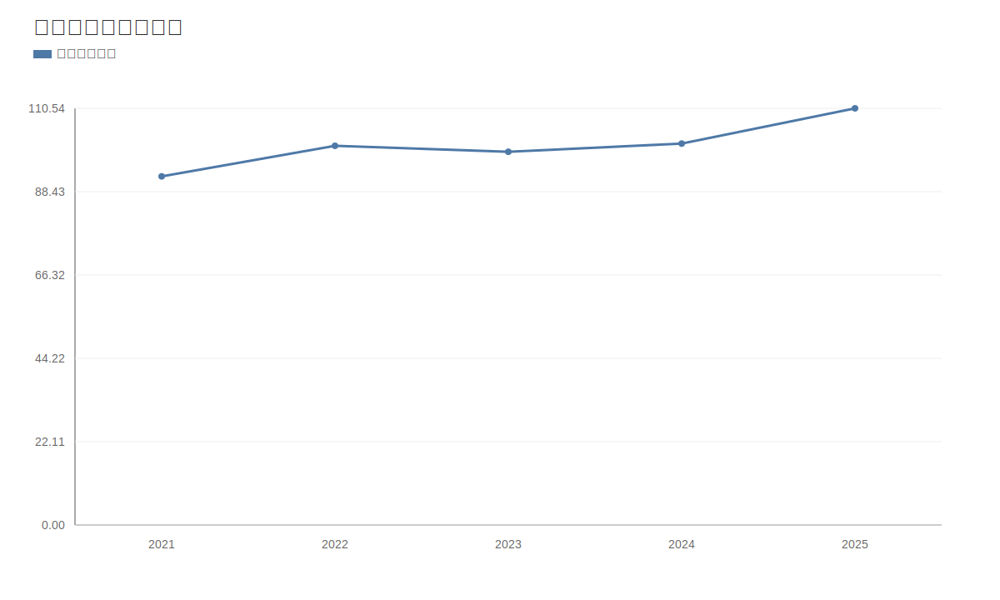

### 2. 净利润趋势图
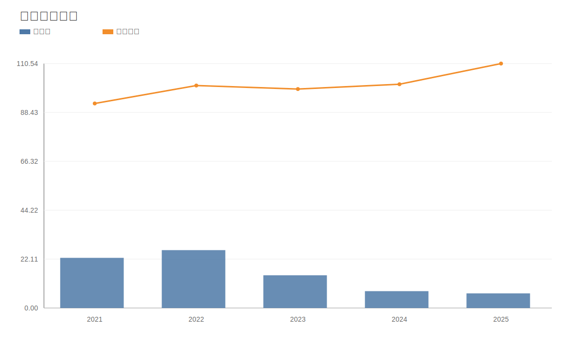

### 3. 毛利率和净利率对比图
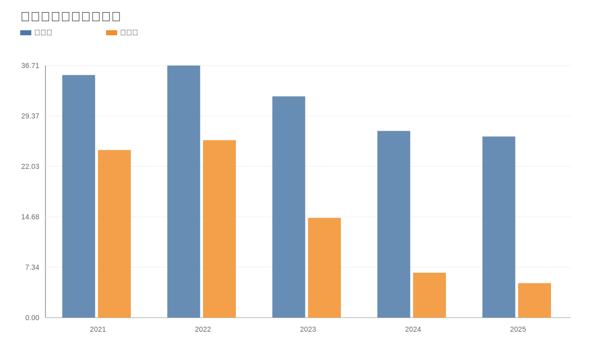

### 4. 分产品收入结构图
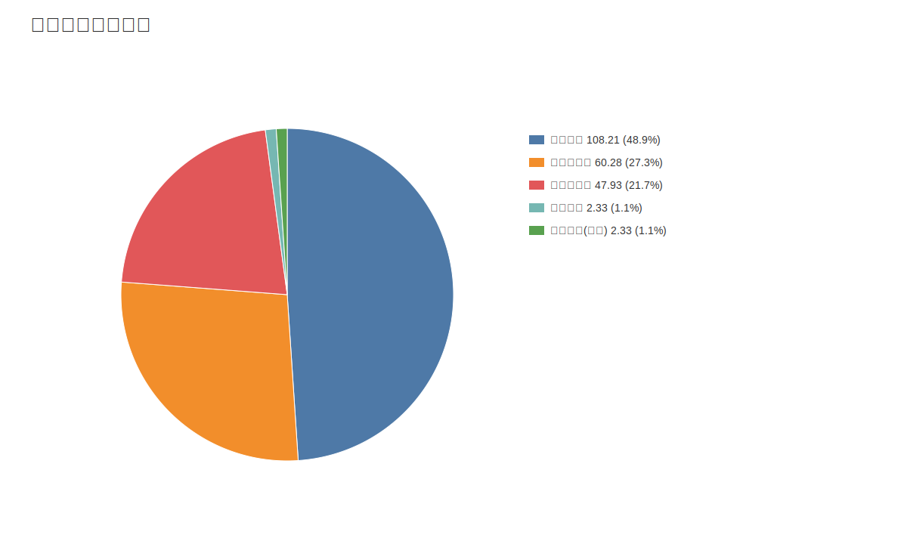

### 4. 分产品收入变化图
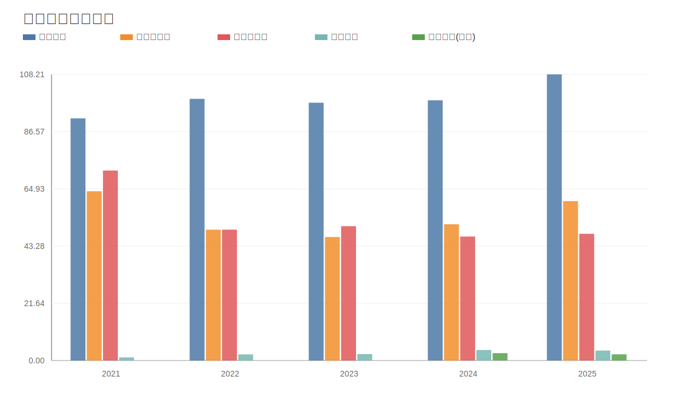

### 5. 分产品利润结构图
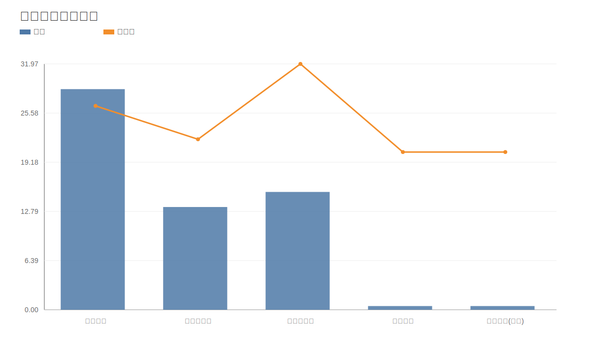

### 6. 分地区收入分布图
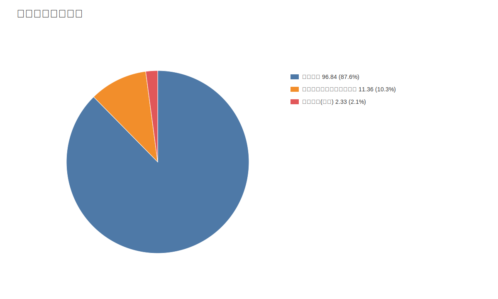

### 7. 资产负债表关键数据图
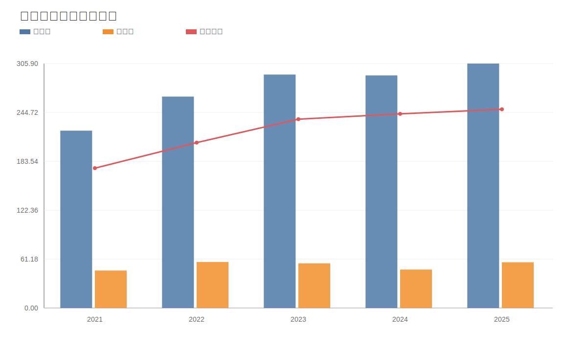

### 8. 自由现金流与经营现金流对比图
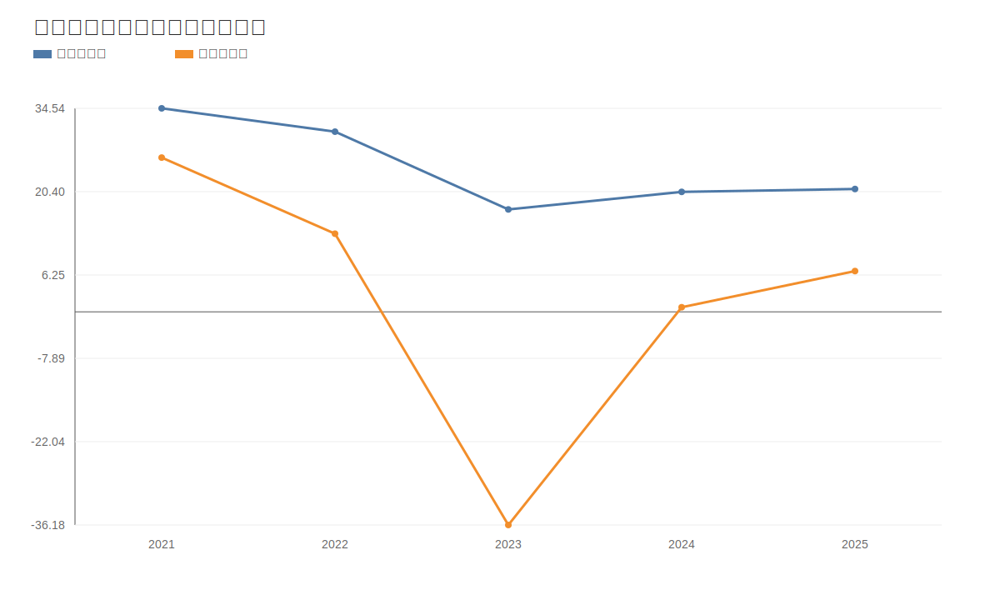

### 9. 股东回报分析图
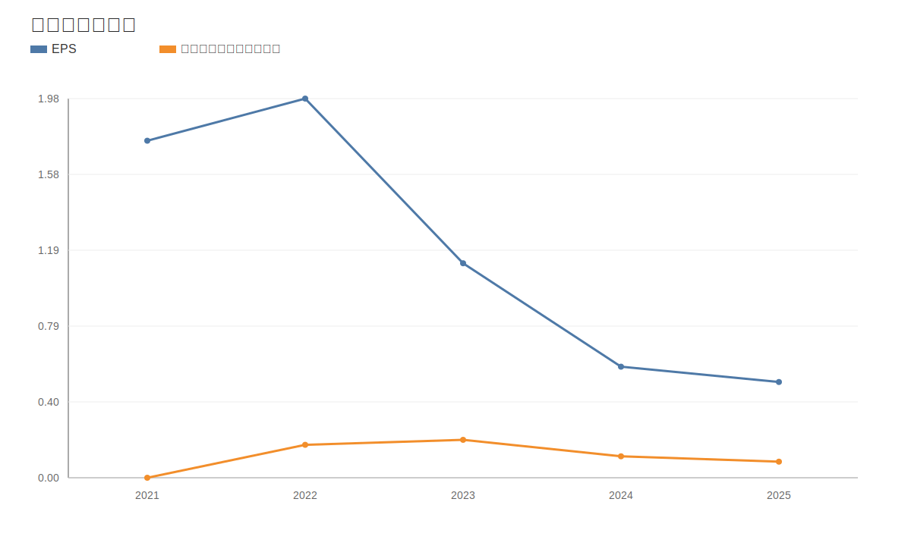

### 10. 财务比率分析图
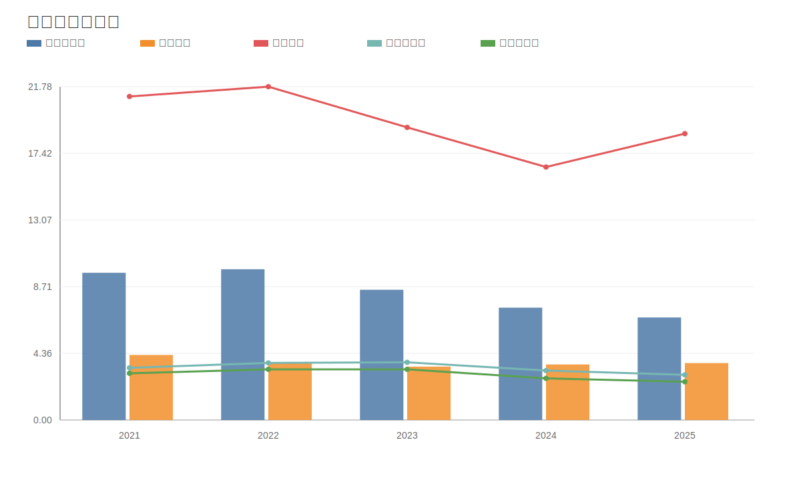

### 11. ROE与ROA对比图
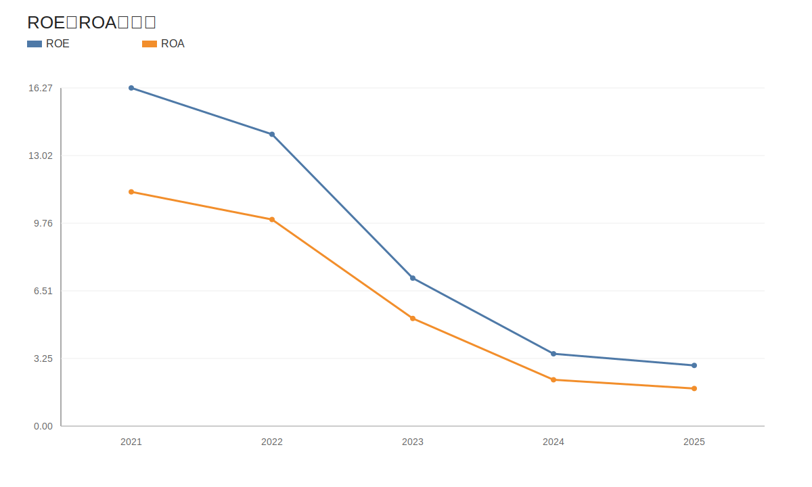
<!-- VALUE_CHARTS_END -->

## 困境反转专项判断（华润微）
事实：
- 价格日期：20260511；财报日期：20260331。
- 当前收盘价 59.70 元，PE(TTM) 87.39，PB 3.43。
计算结果：
- 营收同比 -74.15%，净利润同比 -50.04%，经营现金流同比 -69.91%。
- 资产负债率：最新 17.87%，上期 18.71%。
- 困境反转评分：1/3，状态：反转待确认。
推断：
- 若“盈利修复 + 现金流修复 + 杠杆缓解”连续两个报告期维持，则反转概率提升；若任一项再度恶化，应下调反转置信度。
