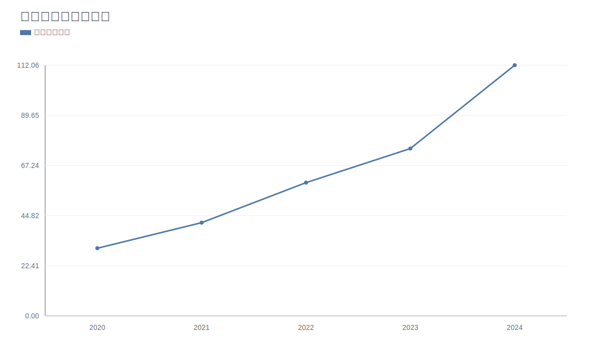
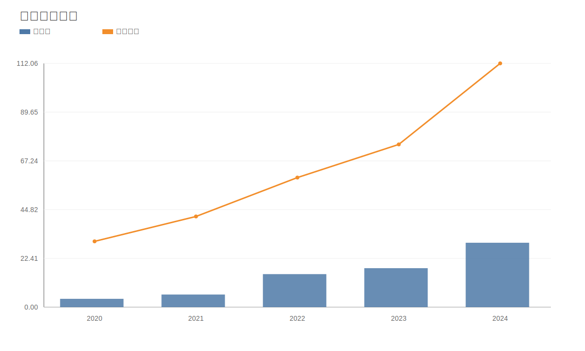
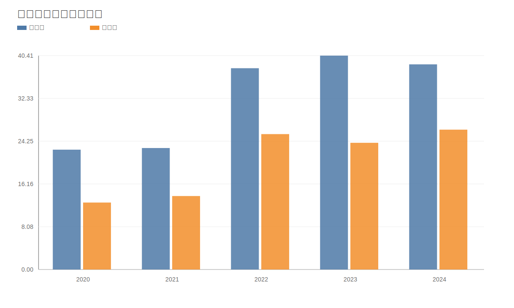
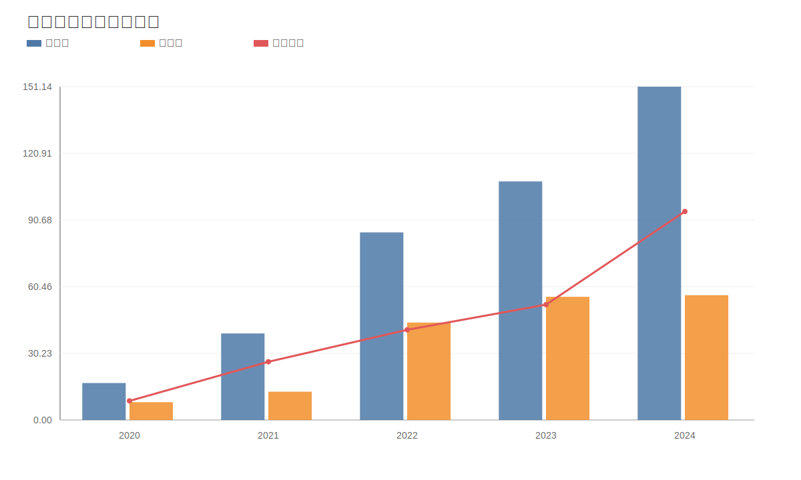
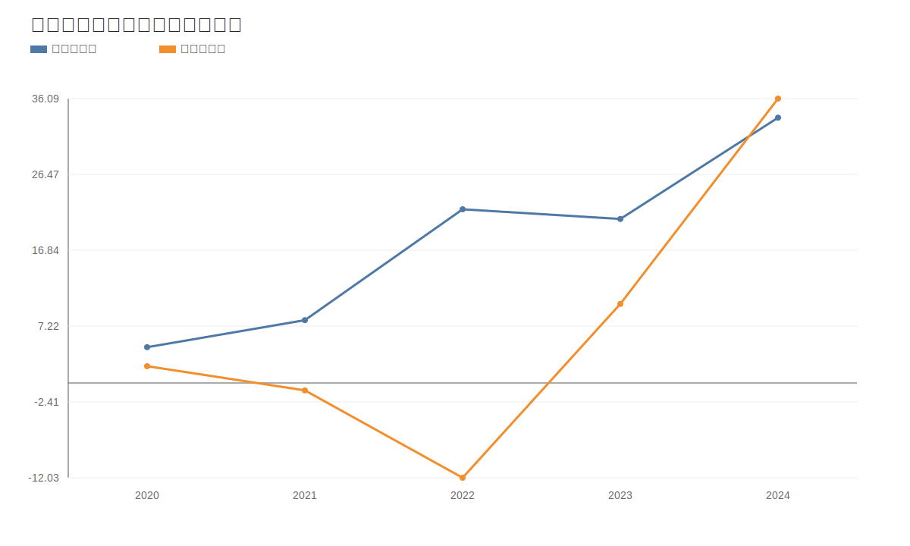
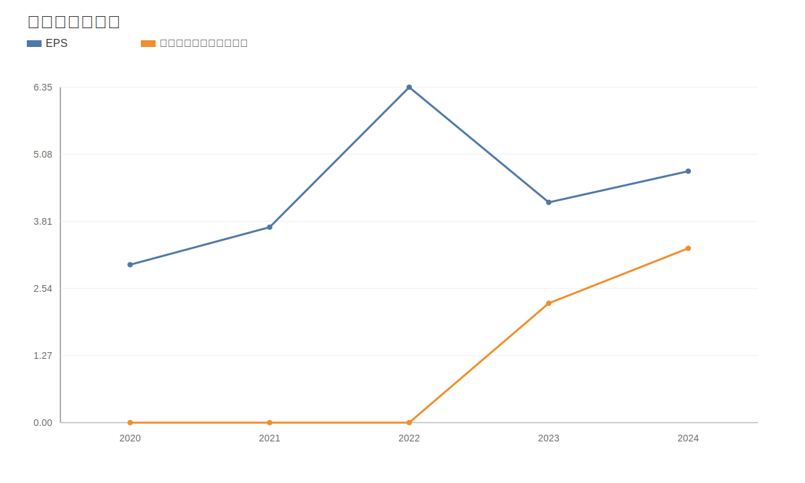
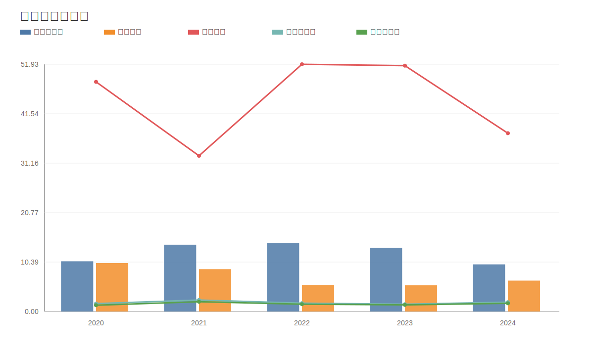
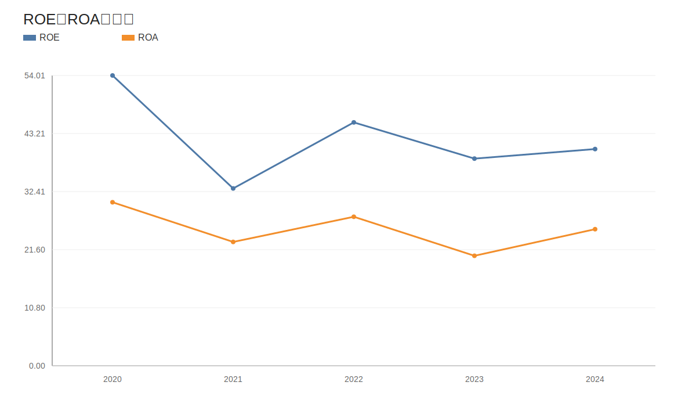

# 德业股份（605117.SH）深度价值研究报告

- 研究日期：2026年4月16日
- 标的代码：605117.SH
- 本地数据口径：`app/models/models.py`（`income`、`balancesheet`、`cashflow`、`fina_indicator`、`daily_basic`、`dividend`、`fina_audit`、`stock_company`）
- 草稿来源：`outputs/value_605117_德业股份_2604160024_draft.md`
- 最新市场口径日期：2026年4月15日
- 外部验证口径：2025年一季报（2025年4月30日）、2025年半年报（2025年8月26日）、2025年三季报（2025年10月30日）、2026-006担保公告（2026年1月21日）

## 1. 公司概况（商业模式优先）

德业股份当前已从“环境电器+热交换器”扩展为“光储逆变器+储能电池包+环境电器”的复合制造平台。业务以 ToB 出海为主，盈利关键来自逆变器与储能产品规模效应和渠道拓展，而非终端品牌溢价。2025年半年报披露，逆变器和储能电池包已成为核心收入来源。

结论：  
事实：公司商业模式是“技术研发+制造交付+全球渠道”驱动的电力电子制造型公司。  
推断：其估值应主要锚定海外光储景气、产品份额和利润率持续性，而不是消费品稳定估值框架。

## 2. 行业与竞争格局

从行业需求侧看，国家能源局在2025年9月26日披露：截至2025年8月底，国内太阳能发电装机11.2亿千瓦，同比增长48.5%；在2026年1月29日披露：截至2025年底太阳能发电装机12.0亿千瓦，同比增长35.4。光伏与储能渗透率持续提升，对逆变器与储能系统形成中期需求支撑。

从竞争侧看，逆变器赛道头部企业集中度提升，德业与阳光电源、锦浪、固德威等在海外市场直接竞争。公司在户储逆变器和储能电池包一体化交付上有明显进攻性，但在规模和产品矩阵上仍需持续对标头部综合型厂商。

结论：  
事实：行业仍处成长阶段，但竞争已从“增量红利”转向“份额+成本+交付能力”竞争。  
推断：德业仍有成长空间，但未来利润弹性将更依赖市场份额与供应链效率，而非行业普涨。

## 3. 护城河分析（含真伪辨别）

德业护城河主要来自三层：
- 成本与制造护城河：规模制造+供应链协同带来成本优势。  
- 渠道护城河：海外经销和客户覆盖扩展较快。  
- 产品组合护城河：逆变器与储能电池包协同销售，提升客单价和复购。

真伪辨别：
- 若提价5%，在强需求区域客户黏性存在，但在竞争白热化市场价格敏感度高。  
- 替代品并不稀缺，核心在交付稳定性、故障率控制与售后网络。  
- 客户切换成本中等，不是高垄断型护城河。

结论：  
事实：公司具备“成本+渠道+产品协同”的实质竞争力。  
推断：护城河强度为“中等偏强”，但尚未达到不可替代的宽护城河。

## 4. 管理层与资本配置

管理层稳定，董事长与总经理均为 ZHANG DONG YE。资本配置上，近三年现金分红持续提升（本地 `dividend` 显示：2023年每股2.26元、2024年3.30元、2025年3.708元，税前已实施口径）。同时，公司在扩张期仍保持较高现金流覆盖能力。  
2026年1月21日公告显示，公司为全资子公司德业储能向弗迪电池采购协议提供不超过2亿元履约担保，反映储能业务持续投入和订单推进。

结论：  
事实：管理层执行和资本回报意愿较强，分红与扩张并行。  
推断：资本配置总体是加分项，但需持续跟踪扩张项目回报率，防止高景气期过度投资。

## 5. 财务分析（成长/盈利/健康/现金流）

### 5.1 成长性

本地口径显示：2020-2024年营收CAGR 38.75%，净利CAGR 66.80%；2025年前三季度营收88.46亿元，同比增长10.36%，归母净利23.47亿元，同比增长4.79%。增长仍在，但边际增速较2024年显著放缓。

### 5.2 盈利能力

2024年毛利率38.76%、净利率26.42%；2025Q3毛利率38.55%、净利率26.51%，利润率保持高位稳定。ROE 2025Q3为24.98%，仍属优秀区间，但相较2022-2024高弹性阶段已出现回归迹象。

### 5.3 财务健康

截至2025Q3：资产负债率56.51%，流动比率1.39，货币资金71.86亿元，有息负债59.67亿元，净现金12.19亿元。相比多数制造业公司杠杆不低，但短期偿债压力可控。

### 5.4 现金流质量

2025Q3经营现金流26.62亿元，同比-0.78%；经营现金流/利润约97.08%，利润兑现质量较好。2024年经营现金流33.67亿元、自由现金流36.09亿元，现金创造能力较强。

结论：  
事实：公司当前仍是“高盈利+高现金回收”的优质制造标的。  
推断：若未来收入增速继续放缓而估值维持高位，市场将更看重现金流与ROE的稳定性而非规模增速。

## 6. 成长驱动

未来3-5年增长核心来自：
- 海外逆变器需求持续增长；  
- 储能电池包与逆变器协同放量（2025Q1报告也明确逆变器、储能电池包销售规模持续上升）；  
- 新市场渗透和渠道下沉；  
- 供应链整合带来的成本优化。

结论：  
事实：增长驱动清晰，且已有真实订单与交付支撑。  
推断：增长从“高增速阶段”向“高质量增长阶段”切换，关键是份额与利润率的双稳定。

## 7. 风险分析（含幸存者偏差）

主要风险：
- 海外政策与贸易壁垒风险（关税、认证、合规）；  
- 逆变器价格竞争加剧导致毛利压缩；  
- 汇率波动影响利润；  
- 储能业务扩张过程中的质量与交付风险；  
- 杠杆和担保规模随扩张上行的潜在风险。

幸存者偏差检验：
- 不能用2022-2024高增长线性外推。  
- 不能把当前高利润率视作永久常态。  
- 需在行业竞争加剧阶段验证现金流与份额是否同步稳住。

结论：  
事实：核心风险来自外部市场和竞争格局变化，而非短期财务崩溃。  
推断：公司抗风险能力中上，但估值回撤通常会先于报表恶化出现。

## 8. 估值分析

截至2026年4月15日，本地口径：股价136.30元，PE(TTM) 39.09倍，PB 11.98倍，PS(TTM) 10.14倍，股息率2.17%，市值1239.42亿元。  
同业快照显示：德业估值显著高于阳光电源（PE约20.62倍）与锦浪（约41.36倍接近），显著高于多数电力电子可比公司的PB水平。市场已明确给予成长溢价。

结论：  
事实：当前估值并不便宜，属于高成长定价区间。  
推断：若后续利润增速不能重新抬升，估值压缩风险将高于业绩下修风险。

## 9. 投资判断（多头/空头/跟踪指标）

多头逻辑：
- 光储行业中期需求仍有支撑；  
- 公司盈利能力和现金流质量优于多数可比；  
- 储能与逆变器协同增强业务韧性；  
- 管理层执行力和分红回报较好。

空头逻辑：
- 当前估值偏高，对增长放缓容错率低；  
- 海外政策与价格竞争不确定性较大；  
- 储能扩张带来供应链和担保等表外风险敞口。

核心跟踪指标：
- 海外收入增速与毛利率变化；  
- 逆变器与储能电池包收入占比；  
- 经营现金流/净利润比值（是否持续>90%）；  
- 存货周转与应收账款天数；  
- 新订单与担保规模变化。

结论：  
事实：公司质地仍优，但已进入“估值敏感期”。  
推断：更适合“跟踪后分批配置”，不适合在高估值区间一次性重仓追高。

## 10. 最终结论

德业股份是光储赛道里基本面扎实、盈利能力强、现金流质量高的优质制造企业。公司具备中等偏强护城河和较强执行力，但当下估值已隐含较高增长预期。  
投资上更适合“业绩与估值双验证”的纪律化策略：用季度跟踪确认增长质量，再决定仓位节奏。

结论：  
事实：公司是好公司，具备长期经营价值。  
推断：当前价格下安全边际一般，建议“观察+回调分批”，而非激进追高买入。

## 11. 总评分（100分）

- 商业模式（15%）：13/15  
- 护城河（20%）：16/20  
- 管理层与资本配置（15%）：13/15  
- 财务质量（20%）：17/20  
- 风险控制（15%）：11/15  
- 估值性价比（15%）：9/15  

最终总分：79/100

结论：  
事实：基本面得分高，估值项明显拖分。  
推断：是“高质量但高预期”的成长股，配置价值取决于买入价格与后续业绩兑现。

## 12. 三个终极问题（必须回答）

1) 如果提价5%，客户会不会流失？  
在部分区域和渠道会流失，说明公司有竞争力但不是绝对定价权公司。

2) 公司赚的钱有没有被管理层浪费？  
目前看没有明显浪费迹象，分红和现金流表现较好，但扩张期需持续盯投资回报率。

3) 在行业最差年份，公司是怎么活下来的？  
核心靠产品结构升级、成本控制和现金流管理，属于能穿越中度周期波动的企业。

结论：  
事实：公司具备穿越一般行业波动的能力。  
推断：真正考验在于高竞争阶段能否维持高ROE与高现金转换。

## 参考来源

- [德业股份2025年第一季度报告（2025-04-30）](https://static.cninfo.com.cn/finalpage/2025-04-30/1223427128.PDF)
- [德业股份2025年半年度报告（2025-08-26）](https://static.cninfo.com.cn/finalpage/2025-08-26/1224571841.PDF)
- [德业股份2025年第三季度报告（2025-10-30）](https://static.cninfo.com.cn/finalpage/2025-10-30/1224768213.PDF)
- [德业股份关于为子公司提供担保的进展公告（2026-01-21，公告编号2026-006）](https://big5.sse.com.cn/site/cht/www.sse.com.cn/disclosure/listedinfo/announcement/c/new/2026-01-21/605117_20260121_PF7M.pdf)
- [国家能源局发布2025年1-8月份全国电力工业统计数据（2025-09-26）](https://www.nea.gov.cn/20250926/2e8ea0184702461f8531527b015964d5/c.html)
- [国家能源局发布2025年全国电力统计数据（2026-01-29）](https://www.nea.gov.cn/20260129/6874f211acd0417eab7ac10c3061a7c2/c.html)

<!-- VALUE_CHARTS_START -->
## 图表图片（自动生成）

### 1. 主营业务收入趋势图

### 2. 净利润趋势图

### 3. 毛利率和净利率对比图

### 4. 分产品收入结构图

### 4. 分产品收入变化图

### 5. 分产品利润结构图

### 6. 分地区收入分布图

### 7. 资产负债表关键数据图

### 8. 自由现金流与经营现金流对比图

### 9. 股东回报分析图

### 10. 财务比率分析图

### 11. ROE与ROA对比图

<!-- VALUE_CHARTS_END -->
